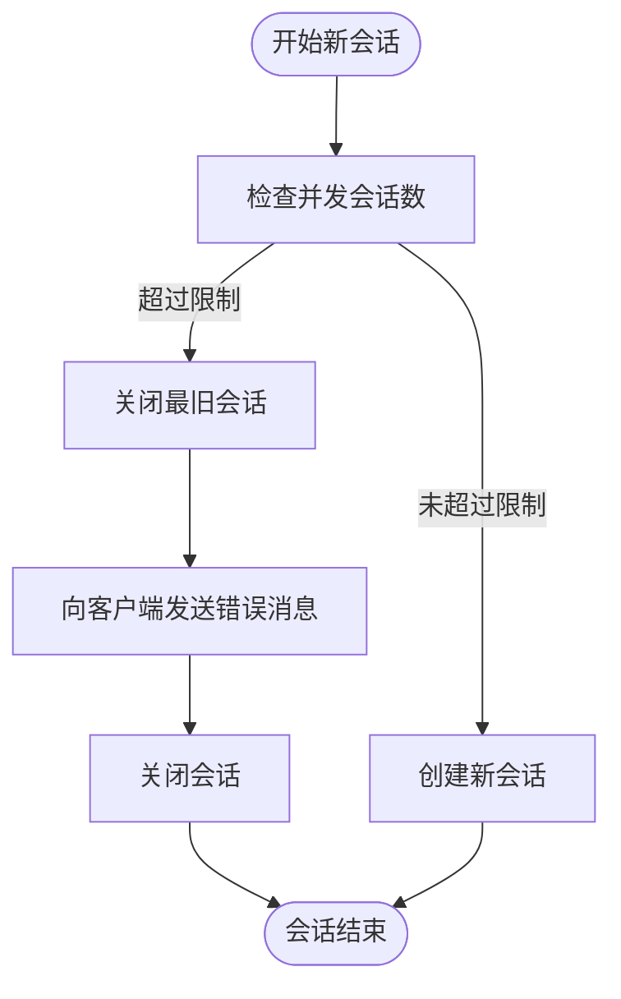
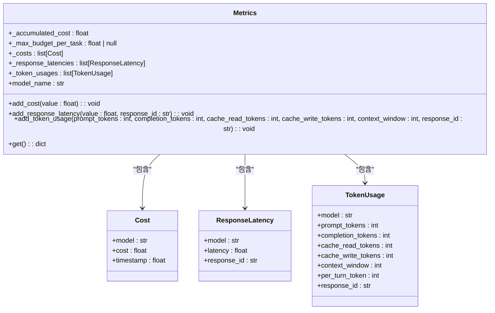
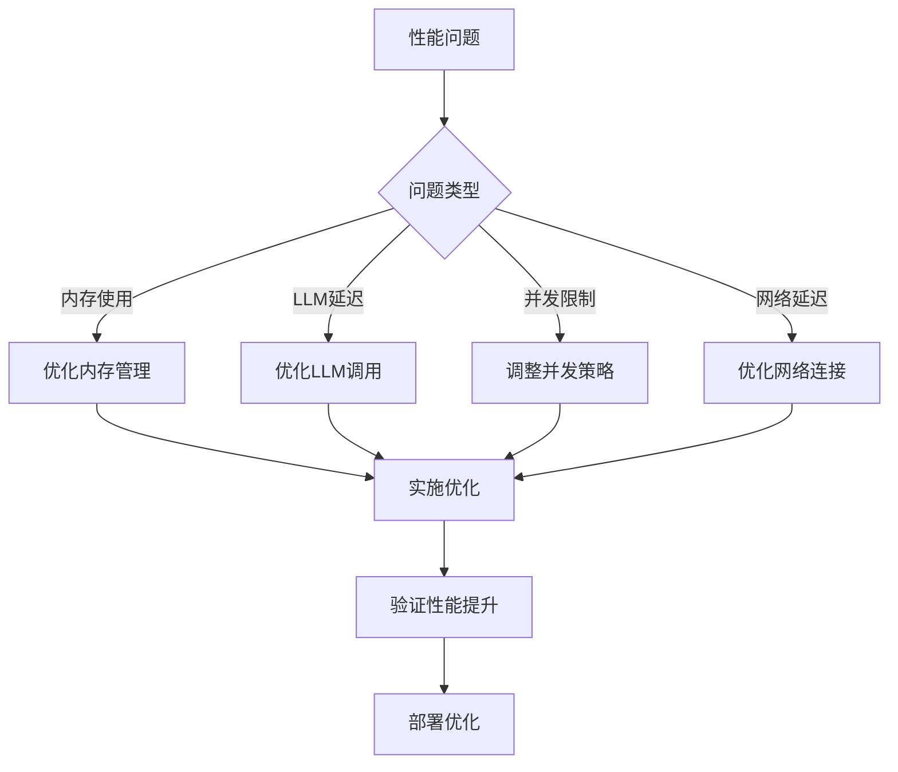

# 性能测试

<cite>
**本文档引用的文件**   
- [metrics-store.ts](file://frontend/src/stores/metrics-store.ts)
- [test_stress_remote_runtime.py](file://tests/runtime/test_stress_remote_runtime.py)
- [llm/metrics.py](file://openhands/llm/metrics.py)
- [monitoring.py](file://openhands/server/monitoring.py)
- [saas_monitoring_listener.py](file://enterprise/server/saas_monitoring_listener.py)
- [config.py](file://enterprise/server/config.py)
- [standalone_conversation_manager.py](file://openhands/server/conversation_manager/standalone_conversation_manager.py)
- [telemetry_metrics.py](file://storage/telemetry_metrics.py)
- [openhands-enterprise-telemetry-design.md](file://enterprise/doc/design-doc/openhands-enterprise-telemetry-design.md)
</cite>

## 目录
1. [性能评估方法](#性能评估方法)
2. [压力测试实施策略](#压力测试实施策略)
3. [内置指标系统](#内置指标系统)
4. [远程运行时性能测试](#远程运行时性能测试)
5. [LLM调用监控](#llm调用监控)
6. [系统瓶颈识别与优化](#系统瓶颈识别与优化)

## 性能评估方法

OpenHands系统的性能评估方法基于全面的指标收集和监控框架，通过内置的指标系统和Prometheus集成来实现。系统性能评估主要关注并发会话处理能力、资源消耗、LLM调用延迟和token使用量等关键指标。

性能评估的核心是通过`Metrics`类来跟踪各种性能指标，包括累积成本、响应延迟和token使用情况。这些指标在会话生命周期中被持续收集，并可用于后续分析和优化。系统还通过`MonitoringListener`接口提供扩展点，允许应用程序自定义监控行为。

**Section sources**
- [llm/metrics.py](file://openhands/llm/metrics.py#L1-L278)
- [monitoring.py](file://openhands/server/monitoring.py#L1-L42)

## 压力测试实施策略

### 并发会话处理能力

OpenHands系统通过`ConversationManager`类管理并发会话，系统配置了最大并发会话限制来防止资源耗尽。当用户会话数量超过配置的`max_concurrent_conversations`限制时，系统会自动关闭最旧的会话以释放资源。



**Diagram sources**
- [standalone_conversation_manager.py](file://openhands/server/conversation_manager/standalone_conversation_manager.py#L317-L338)

### 资源消耗监控

系统通过压力测试来评估在资源约束下的行为。测试使用`stress-ng`工具模拟高内存使用情况，验证系统在内存不足情况下的表现。测试配置包括：

- CPU限制：100ms周期内100ms配额（1个CPU核心）
- 内存限制：4GB
- 禁用交换空间
- 启用OOM（内存不足）终止机制

```python
config.sandbox.docker_runtime_kwargs = {
    'cpu_period': 100000,
    'cpu_quota': 100000,
    'mem_limit': '4G',
    'memswap_limit': '0',
    'mem_swappiness': 0,
    'oom_kill_disable': False,
}
```

当系统资源不足时，进程会被OOM终止器终止，返回退出码3，表明系统成功处理了内存不足的情况。

**Section sources**
- [test_stress_remote_runtime.py](file://tests/runtime/test_stress_remote_runtime.py#L377-L418)

## 内置指标系统

### 指标收集与分析

OpenHands系统使用内置的指标系统来收集和分析性能数据。核心指标类`Metrics`提供了以下功能：

- **成本跟踪**：记录LLM调用的累积成本
- **响应延迟**：测量每次完成调用的往返时间
- **Token使用量**：详细跟踪每次调用的token使用情况
- **预算控制**：设置和跟踪每个任务的最大预算



**Diagram sources**
- [llm/metrics.py](file://openhands/llm/metrics.py#L47-L278)

### Prometheus集成

系统通过`SaaSMonitoringListener`类与Prometheus集成，暴露关键性能指标。主要监控的指标包括：

- `saas_agent_status_errors`：代理状态更改为错误状态的次数
- `saas_create_conversation`：创建会话的尝试次数
- `saas_agent_session_start`：代理会话启动的直方图，包含成功状态和持续时间

```python
AGENT_STATUS_ERROR_COUNT = Counter(
    'saas_agent_status_errors', 'Agent Status change events to status error'
)
CREATE_CONVERSATION_COUNT = Counter(
    'saas_create_conversation', 'Create conversation attempts'
)
AGENT_SESSION_START_HISTOGRAM = Histogram(
    'saas_agent_session_start',
    'AgentSession starts with success and duration',
    labelnames=['success'],
)
```

这些指标可用于监控系统健康状况、识别性能瓶颈和优化资源分配。

**Section sources**
- [saas_monitoring_listener.py](file://enterprise/server/saas_monitoring_listener.py#L12-L76)

## 远程运行时性能测试

### 配置与执行指南

远程运行时性能测试的配置和执行需要设置以下环境变量：

```bash
export ALLHANDS_API_KEY="YOUR_API_KEY"
export RUNTIME=remote
export SANDBOX_REMOTE_RUNTIME_API_URL="https://runtime.staging.all-hands.dev"
```

测试使用`pytest`框架执行，支持多进程并行测试。测试配置包括：

- 运行时类型：远程
- 沙箱基础容器镜像：python:3.11-bookworm
- 超时时间：300秒
- API密钥：从环境变量获取
- 远程运行时API URL：从环境变量获取

### 长输出与超时测试

系统通过长输出测试来验证在软超时和硬超时情况下的行为。测试包括：

1. **软超时测试**：发送需要用户输入的命令，验证系统能正确处理交互式命令
2. **硬超时测试**：生成大量输出的命令，设置硬超时限制
3. **终端状态恢复**：在超时后验证终端能恢复正常状态

```python
# 测试硬超时
action = CmdRunAction(
    f'export i={i}; for j in $(seq 1 100); do echo "Line $j - Iteration $i - $(printf \'%1000s\' | tr " " "*")"; sleep 1; done'
)
action.set_hard_timeout(2)
obs = runtime.run_action(action)
```

测试验证了系统能正确处理超时情况，并通过发送Ctrl+C来恢复终端状态。

**Section sources**
- [test_stress_remote_runtime.py](file://tests/runtime/test_stress_remote_runtime.py#L247-L368)

## LLM调用监控

### 延迟监控

系统通过`add_response_latency`方法监控LLM调用的延迟。每次LLM调用完成后，系统记录响应延迟并将其添加到`response_latencies`列表中。

```python
def add_response_latency(self, value: float, response_id: str) -> None:
    self._response_latencies.append(
        ResponseLatency(
            latency=max(0.0, value), model=self.model_name, response_id=response_id
        )
    )
```

延迟数据可用于分析LLM服务的性能趋势，识别响应时间异常的情况。

### Token使用量监控

系统详细监控每次LLM调用的token使用量，包括：

- **提示token**：输入提示的token数量
- **完成token**：生成响应的token数量
- **缓存读取token**：从缓存中读取的token数量
- **缓存写入token**：写入缓存的token数量
- **上下文窗口**：使用的上下文窗口大小

```python
def add_token_usage(
    self,
    prompt_tokens: int,
    completion_tokens: int,
    cache_read_tokens: int,
    cache_write_tokens: int,
    context_window: int,
    response_id: str,
) -> None:
    usage = TokenUsage(
        model=self.model_name,
        prompt_tokens=prompt_tokens,
        completion_tokens=completion_tokens,
        cache_read_tokens=cache_read_tokens,
        cache_write_tokens=cache_write_tokens,
        context_window=context_window,
        per_turn_token=prompt_tokens + completion_tokens,
        response_id=response_id,
    )
    self._token_usages.append(usage)
```

前端通过`metrics-store.ts`接收和显示这些指标：

```typescript
interface MetricsState {
  cost: number | null;
  max_budget_per_task: number | null;
  usage: {
    prompt_tokens: number;
    completion_tokens: number;
    cache_read_tokens: number;
    cache_write_tokens: number;
    context_window: number;
    per_turn_token: number;
  } | null;
}
```

**Section sources**
- [llm/metrics.py](file://openhands/llm/metrics.py#L143-L166)
- [metrics-store.ts](file://frontend/src/stores/metrics-store.ts#L1-L27)

## 系统瓶颈识别与性能优化

### 瓶颈识别

通过分析系统监控数据，可以识别以下潜在瓶颈：

1. **内存使用**：长时间运行的会话可能导致内存泄漏
2. **LLM调用延迟**：外部LLM服务的响应时间波动
3. **并发会话限制**：最大并发会话数可能成为性能瓶颈
4. **网络延迟**：远程运行时的网络延迟影响整体性能

### 性能优化建议

基于性能测试结果，提出以下优化建议：

1. **资源限制优化**：根据实际负载调整Docker运行时的CPU和内存限制
2. **缓存策略**：优化token缓存策略，减少重复计算
3. **会话管理**：实现更智能的会话管理策略，优先保留活跃会话
4. **异步处理**：将非关键操作异步化，提高响应速度
5. **监控告警**：设置性能指标告警阈值，及时发现异常



**Diagram sources**
- [telemetry_metrics.py](file://storage/telemetry_metrics.py#L1-L190)
- [openhands-enterprise-telemetry-design.md](file://enterprise/doc/design-doc/openhands-enterprise-telemetry-design.md#L126-L354)