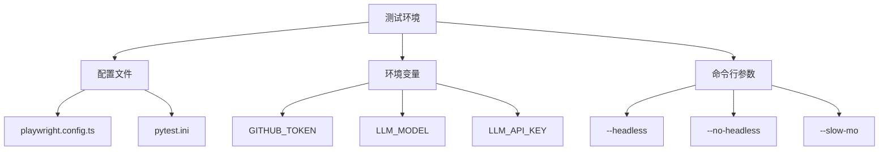
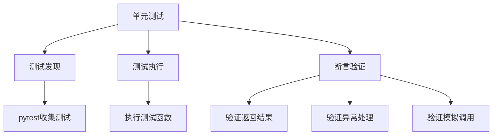
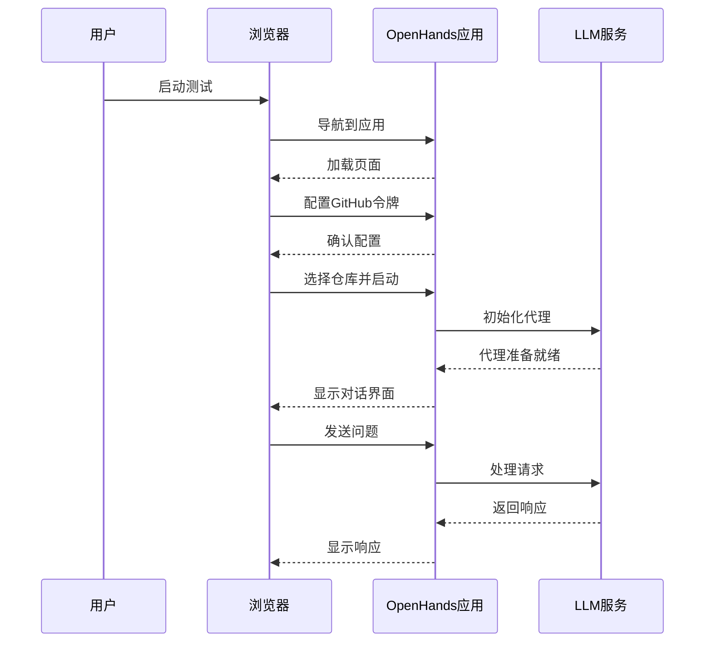
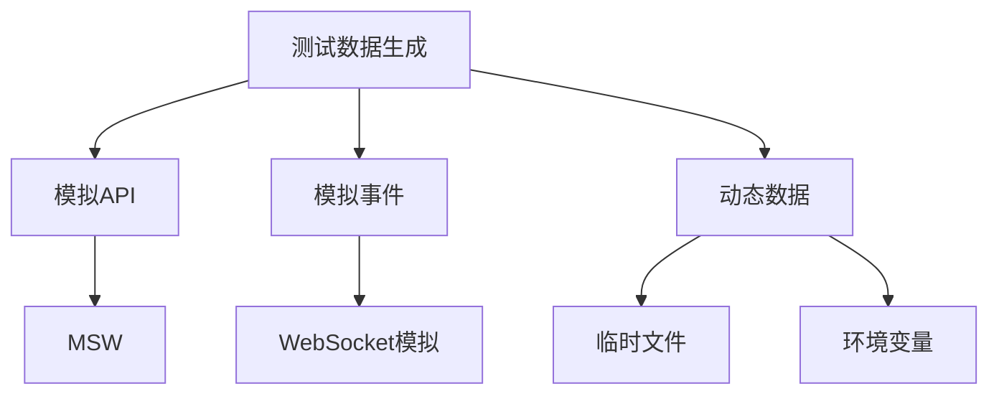

# 测试策略

<cite>
**本文档中引用的文件**   
- [test_conversation.py](file://tests/e2e/test_conversation.py)
- [conftest.py](file://tests/e2e/conftest.py)
- [README.md](file://tests/e2e/README.md)
- [pytest.ini](file://pytest.ini)
- [pyproject.toml](file://enterprise/pyproject.toml)
- [playwright.config.ts](file://frontend/playwright.config.ts)
- [vitest.setup.ts](file://frontend/vitest.setup.ts)
- [test_auth_routes.py](file://enterprise/tests/unit/test_auth_routes.py)
- [test_conversation_summary.py](file://tests/unit/test_conversation_summary.py)
- [conversation-websocket-handler.test.tsx](file://frontend/__tests__/conversation-websocket-handler.test.tsx)
</cite>

## 目录
1. [引言](#引言)
2. [测试环境设置](#测试环境设置)
3. [单元测试](#单元测试)
4. [集成测试](#集成测试)
5. [端到端测试](#端到端测试)
6. [测试覆盖率与代码质量标准](#测试覆盖率与代码质量标准)
7. [性能测试与压力测试](#性能测试与压力测试)
8. [安全测试](#安全测试)
9. [测试自动化与CI/CD集成](#测试自动化与cicd集成)
10. [测试数据管理策略](#测试数据管理策略)
11. [测试调试技巧与故障排除指南](#测试调试技巧与故障排除指南)
12. [测试数据生成与模拟策略](#测试数据生成与模拟策略)

## 引言
OpenHands项目采用全面的质量保证体系，通过多层次的测试策略确保系统的稳定性和可靠性。该测试策略涵盖了从单元测试到端到端测试的完整测试金字塔，结合自动化测试和持续集成流程，为项目的高质量交付提供了坚实保障。本文档详细描述了OpenHands的测试方法、工具链、环境配置和最佳实践。

## 测试环境设置
OpenHands的测试环境设置遵循标准化流程，确保测试的一致性和可重复性。测试环境依赖于Playwright、pytest等工具，通过配置文件进行管理。

测试环境需要设置以下关键环境变量：
- `GITHUB_TOKEN`: 用于访问测试仓库的GitHub令牌
- `LLM_MODEL`: 指定使用的LLM模型（如"gpt-4o"）
- `LLM_API_KEY`: LLM模型的API密钥
- `LLM_BASE_URL`: 可选的LLM API基础URL（用于自定义端点）

测试环境支持多种运行模式，包括无头模式和非无头模式。通过`--headless`和`--no-headless`命令行参数可以控制浏览器的显示方式，`--slow-mo`参数可以添加操作延迟，便于观察测试过程。

**Diagram sources**
- [playwright.config.ts](file://frontend/playwright.config.ts)
- [pytest.ini](file://pytest.ini)
- [README.md](file://tests/e2e/README.md)

**Section sources**
- [README.md](file://tests/e2e/README.md)
- [playwright.config.ts](file://frontend/playwright.config.ts)

## 单元测试
OpenHands的单元测试主要使用pytest框架，针对各个模块和函数进行隔离测试。单元测试位于`tests/unit/`目录下，覆盖了核心功能组件。

单元测试的特点包括：
- 使用`unittest.mock`进行依赖模拟
- 支持异步测试（通过`@pytest.mark.asyncio`装饰器）
- 包含边界条件和异常处理测试
- 遵循测试驱动开发（TDD）原则

例如，在`test_conversation_summary.py`中，测试了对话摘要生成器的各种场景，包括空消息、长标题截断和异常处理。这些测试确保了核心功能的健壮性。

**Diagram sources**
- [test_conversation_summary.py](file://tests/unit/test_conversation_summary.py)
- [test_auth_routes.py](file://enterprise/tests/unit/test_auth_routes.py)

**Section sources**
- [test_conversation_summary.py](file://tests/unit/test_conversation_summary.py)
- [test_auth_routes.py](file://enterprise/tests/unit/test_auth_routes.py)

## 集成测试
OpenHands的集成测试主要在`evaluation/integration_tests/`目录下实现，用于验证多个组件之间的交互。集成测试通过模拟真实环境中的操作流程，确保系统各部分能够协同工作。

集成测试的特点包括：
- 测试跨组件的交互流程
- 验证数据在不同模块间的传递
- 模拟真实用户操作场景
- 使用真实的运行时环境

集成测试通过定义测试用例和验证结果来确保功能的正确性。例如，在git暂存区测试中，通过执行`git status`命令并检查输出，验证了工作树的清理状态。

**Section sources**
- [t04_git_staging.py](file://evaluation/integration_tests/tests/t04_git_staging.py)

## 端到端测试
OpenHands的端到端测试使用Playwright框架，通过浏览器自动化测试整个应用的工作流程。这些测试位于`tests/e2e/`目录下，模拟真实用户与应用的交互。

端到端测试覆盖了以下关键场景：
- GitHub令牌配置
- 对话启动
- 多对话恢复
- 本地运行时测试

测试流程包括：
1. 导航到OpenHands应用
2. 配置GitHub令牌（如果需要）
3. 选择仓库并启动对话
4. 与代理交互并验证响应
5. 验证对话历史的持久性

**Diagram sources**
- [test_conversation.py](file://tests/e2e/test_conversation.py)
- [conftest.py](file://tests/e2e/conftest.py)

**Section sources**
- [test_conversation.py](file://tests/e2e/test_conversation.py)
- [README.md](file://tests/e2e/README.md)

## 测试覆盖率与代码质量标准
OpenHands项目通过coverage工具监控测试覆盖率，确保代码质量。测试覆盖率目标通常要求核心模块达到80%以上的覆盖率。

代码质量标准包括：
- 遵循PEP 8编码规范
- 使用ruff和mypy进行静态分析
- 通过black格式化代码
- 确保所有公共函数都有文档字符串

在`pyproject.toml`中配置了测试依赖，包括pytest、pytest-cov等工具，支持覆盖率报告的生成和分析。

**Section sources**
- [pyproject.toml](file://enterprise/pyproject.toml)
- [uv.lock](file://openhands-cli/uv.lock)

## 性能测试与压力测试
虽然项目中没有明确的性能测试文件，但通过端到端测试中的等待时间和超时设置，间接体现了性能要求。例如，在对话启动测试中设置了5分钟的导航超时和480秒的代理准备等待时间。

压力测试主要通过以下方式实现：
- 并行执行多个测试用例
- 模拟高频率的用户交互
- 监控系统资源使用情况

未来的性能测试可以考虑添加专门的负载测试，使用工具模拟大量并发用户，评估系统的响应时间和稳定性。

## 安全测试
OpenHands的安全测试主要集中在认证和授权机制上。通过单元测试验证了各种安全场景，包括：
- 缺少代码时的回调处理
- 令牌检索失败的处理
- 用户信息缺失的验证
- 用户未授权的访问控制

安全测试确保了系统的认证流程健壮，能够正确处理各种异常情况，防止未授权访问。

**Section sources**
- [test_auth_routes.py](file://enterprise/tests/unit/test_auth_routes.py)

## 测试自动化与CI/CD集成
OpenHands的测试自动化通过GitHub Actions实现，与CI/CD流程紧密集成。测试可以在以下情况下触发：
- 添加"end-to-end"标签到拉取请求
- 手动从GitHub Actions选项卡触发

自动化测试流程包括：
1. 设置测试环境
2. 安装依赖
3. 运行测试套件
4. 生成测试报告
5. 发布结果

Playwright配置文件中设置了CI环境的特定选项，如重试次数和工作进程数量，确保在CI环境中稳定运行。

**Section sources**
- [playwright.config.ts](file://frontend/playwright.config.ts)
- [README.md](file://tests/e2e/README.md)

## 测试数据管理策略
OpenHands的测试数据管理策略包括：
- 使用临时目录存储测试结果
- 通过环境变量配置测试数据
- 在测试中动态生成测试数据
- 使用模拟数据进行隔离测试

测试数据文件存储在`test-results`目录中，包括截图和测试报告。通过合理的数据管理，确保了测试的可重复性和独立性。

**Section sources**
- [test_conversation.py](file://tests/e2e/test_conversation.py)

## 测试调试技巧与故障排除指南
当测试失败时，可以按照以下步骤进行调试：
1. 检查必需的环境变量是否已设置
2. 查看`/tmp/openhands-e2e-test.log`和`/tmp/openhands-e2e-build.log`中的日志
3. 验证OpenHands应用是否正常运行
4. 检查Playwright测试结果

调试技巧包括：
- 使用`--no-headless`参数以可见模式运行浏览器
- 添加`--slow-mo=50`参数减慢操作速度
- 使用`page.screenshot()`捕获关键步骤的截图
- 在测试代码中添加详细的日志输出

**Section sources**
- [README.md](file://tests/e2e/README.md)

## 测试数据生成与模拟策略
OpenHands采用多种数据生成和模拟策略来支持测试：
- 使用MSW（Mock Service Worker）模拟API响应
- 使用unittest.mock模拟外部依赖
- 在前端测试中模拟WebSocket事件
- 动态生成测试所需的文件和数据

例如，在`conversation-websocket-handler.test.tsx`中，通过创建模拟的WebSocket事件来测试不同场景下的行为，包括正常消息、错误事件和连接状态变化。

**Diagram sources**
- [conversation-websocket-handler.test.tsx](file://frontend/__tests__/conversation-websocket-handler.test.tsx)
- [vitest.setup.ts](file://frontend/vitest.setup.ts)

**Section sources**
- [conversation-websocket-handler.test.tsx](file://frontend/__tests__/conversation-websocket-handler.test.tsx)
- [vitest.setup.ts](file://frontend/vitest.setup.ts)