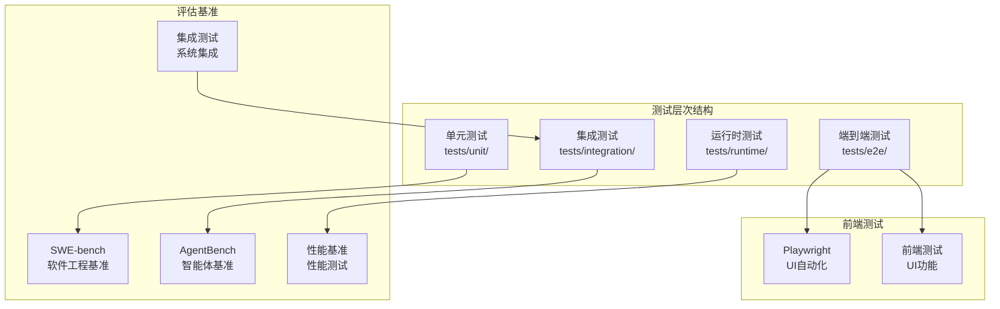
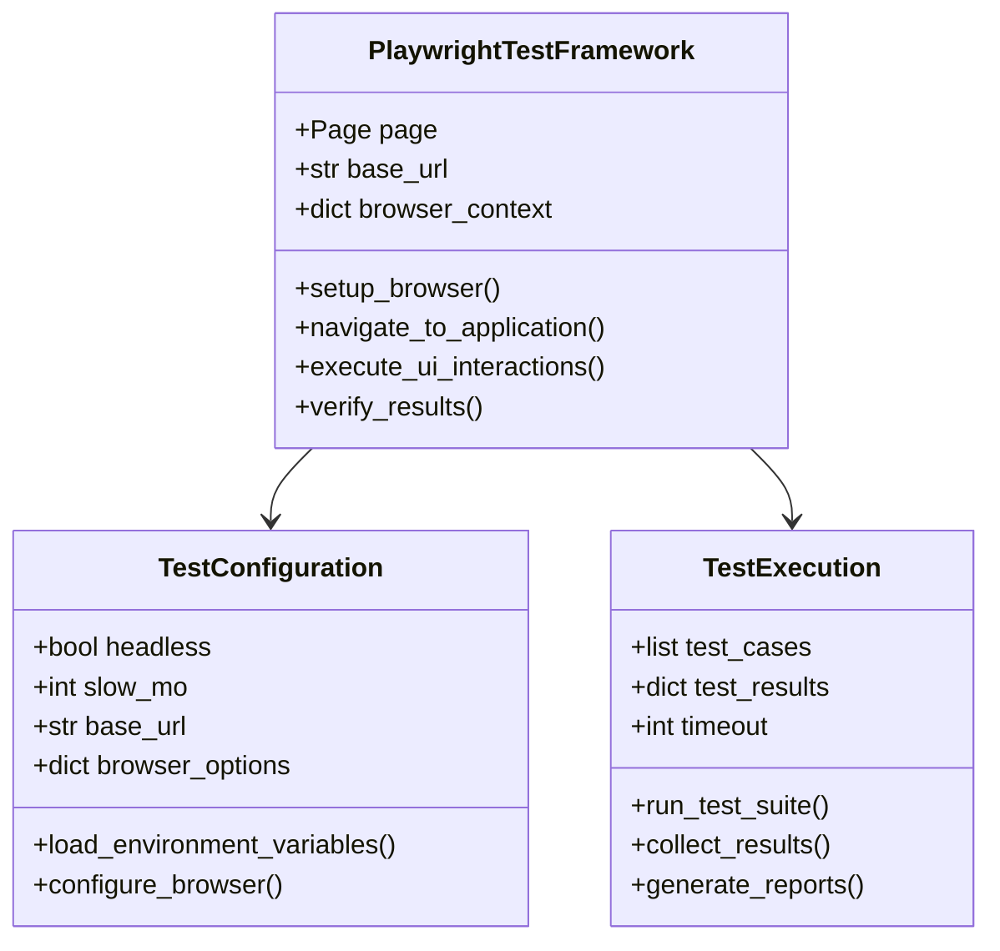
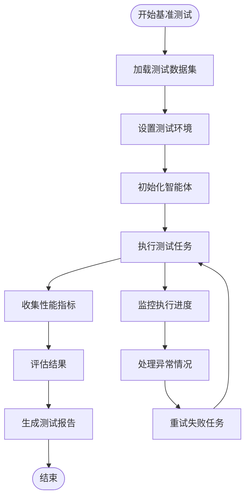
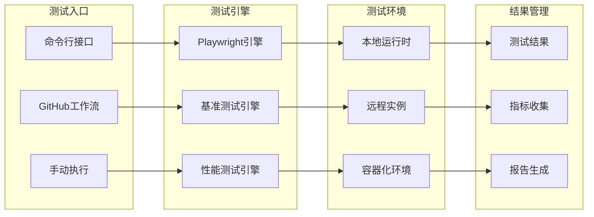
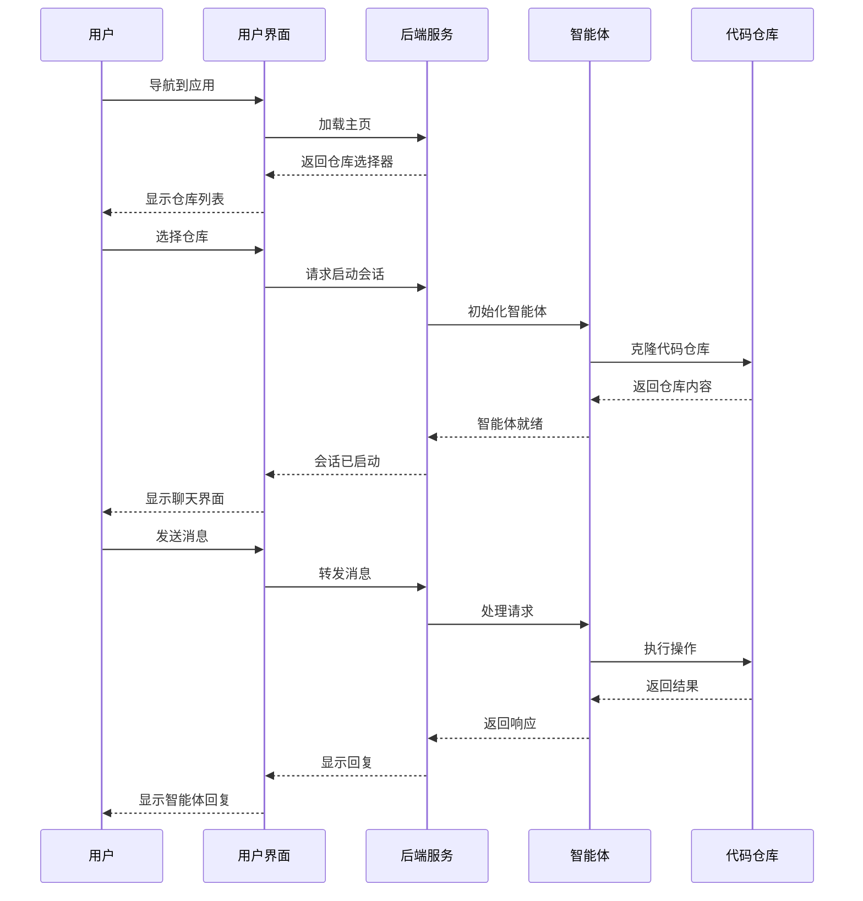
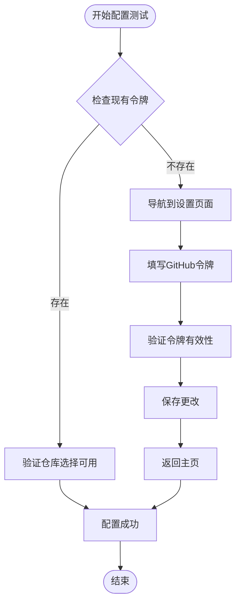
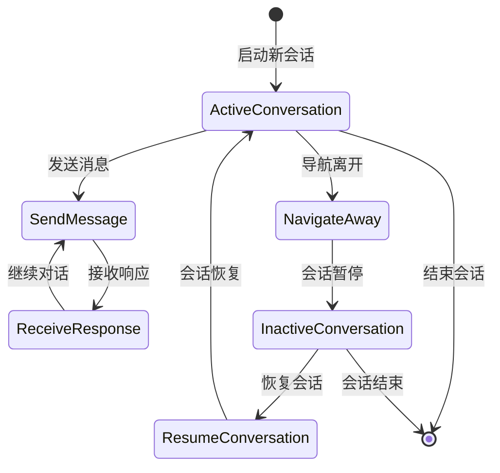
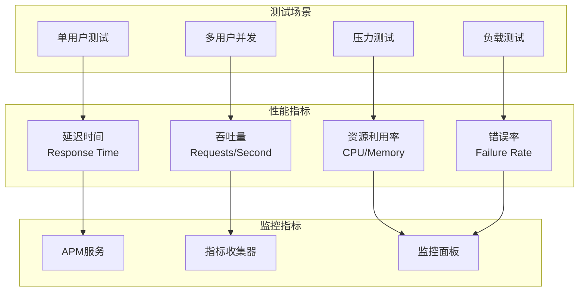
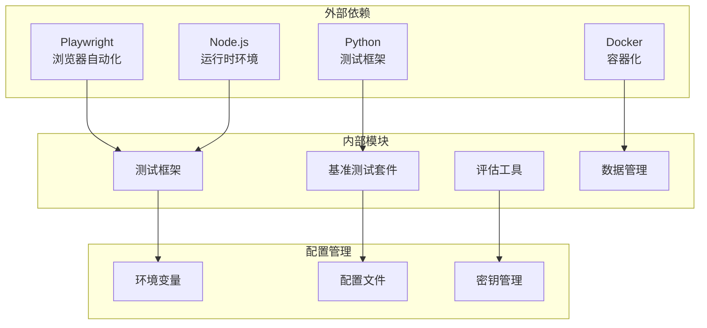

# 端到端测试

<cite>
**本文档中引用的文件**
- [tests/e2e/README.md](file://tests/e2e/README.md)
- [tests/e2e/conftest.py](file://tests/e2e/conftest.py)
- [tests/e2e/test_conversation.py](file://tests/e2e/test_conversation.py)
- [tests/e2e/test_settings.py](file://tests/e2e/test_settings.py)
- [tests/e2e/test_multi_conversation_resume.py](file://tests/e2e/test_multi_conversation_resume.py)
- [frontend/playwright.config.ts](file://frontend/playwright.config.ts)
- [tests/e2e/check_playwright.py](file://tests/e2e/check_playwright.py)
- [tests/e2e/pytest.ini](file://tests/e2e/pytest.ini)
- [evaluation/benchmarks/swe_bench/run_infer.py](file://evaluation/benchmarks/swe_bench/run_infer.py)
- [evaluation/benchmarks/swe_bench/scripts/run_infer.sh](file://evaluation/benchmarks/swe_bench/scripts/run_infer.sh)
- [evaluation/benchmarks/swe_bench/README.md](file://evaluation/benchmarks/swe_bench/README.md)
- [evaluation/benchmarks/swe_perf/run_infer.py](file://evaluation/benchmarks/swe_perf/run_infer.py)
- [evaluation/benchmarks/multi_swe_bench/run_infer.py](file://evaluation/benchmarks/multi_swe_bench/run_infer.py)
- [evaluation/benchmarks/testgeneval/run_infer.py](file://evaluation/benchmarks/testgeneval/run_infer.py)
- [evaluation/benchmarks/the_agent_company/scripts/summarise_results.py](file://evaluation/benchmarks/the_agent_company/scripts/summarise_results.py)
- [evaluation/benchmarks/aider_bench/scripts/summarize_results.py](file://evaluation/benchmarks/aider_bench/scripts/summarize_results.py)
- [evaluation/integration_tests/run_infer.py](file://evaluation/integration_tests/run_infer.py)
</cite>

## 目录
1. [简介](#简介)
2. [项目结构](#项目结构)
3. [核心组件](#核心组件)
4. [架构概览](#架构概览)
5. [详细组件分析](#详细组件分析)
6. [依赖关系分析](#依赖关系分析)
7. [性能考虑](#性能考虑)
8. [故障排除指南](#故障排除指南)
9. [结论](#结论)

## 简介

OpenHands的端到端测试框架是一个全面的测试系统，旨在验证整个应用程序栈的功能性和可靠性。该框架结合了Playwright UI自动化测试、标准化基准测试套件（如SWE-bench和AgentBench）以及性能基准测试，为开发者提供了完整的测试解决方案。

测试框架的核心目标是：
- 验证用户界面交互的正确性
- 测试会话创建和任务执行流程
- 评估系统在真实场景下的表现
- 提供可重复的基准测试结果
- 支持多维度的性能分析

## 项目结构

OpenHands的测试架构采用分层设计，包含以下主要组件：

**图表来源**
- [tests/e2e/README.md](file://tests/e2e/README.md#L1-L163)
- [evaluation/benchmarks/swe_bench/run_infer.py](file://evaluation/benchmarks/swe_bench/run_infer.py#L1-L887)

**章节来源**
- [tests/e2e/README.md](file://tests/e2e/README.md#L1-L163)

## 核心组件

### Playwright UI自动化测试框架

Playwright是OpenHands端到端测试的核心工具，提供了强大的浏览器自动化能力：

**图表来源**
- [frontend/playwright.config.ts](file://frontend/playwright.config.ts#L1-L83)
- [tests/e2e/conftest.py](file://tests/e2e/conftest.py#L1-L47)

### 基准测试套件

OpenHands集成了多个标准化的评估基准，确保系统的可靠性和可比性：

**图表来源**
- [evaluation/benchmarks/swe_bench/run_infer.py](file://evaluation/benchmarks/swe_bench/run_infer.py#L69-L887)
- [evaluation/benchmarks/swe_perf/run_infer.py](file://evaluation/benchmarks/swe_perf/run_infer.py#L842-L875)

**章节来源**
- [evaluation/benchmarks/swe_bench/run_infer.py](file://evaluation/benchmarks/swe_bench/run_infer.py#L69-L887)
- [evaluation/benchmarks/swe_perf/run_infer.py](file://evaluation/benchmarks/swe_perf/run_infer.py#L842-L875)

## 架构概览

OpenHands的端到端测试架构采用模块化设计，支持多种测试类型和场景：

**图表来源**
- [tests/e2e/README.md](file://tests/e2e/README.md#L35-L163)
- [evaluation/benchmarks/swe_bench/scripts/run_infer.sh](file://evaluation/benchmarks/swe_bench/scripts/run_infer.sh#L66-L125)

## 详细组件分析

### 会话创建和任务执行测试

会话创建测试验证用户如何启动新对话并与智能体交互：

**图表来源**
- [tests/e2e/test_conversation.py](file://tests/e2e/test_conversation.py#L34-L609)
- [tests/e2e/test_settings.py](file://tests/e2e/test_settings.py#L14-L295)

### GitHub令牌配置测试

GitHub令牌配置测试确保用户能够正确设置必要的认证凭据：

**图表来源**
- [tests/e2e/test_settings.py](file://tests/e2e/test_settings.py#L14-L295)

### 多会话恢复测试

多会话恢复测试验证用户能够从之前的对话中恢复并继续工作：

**图表来源**
- [tests/e2e/test_multi_conversation_resume.py](file://tests/e2e/test_multi_conversation_resume.py#L22-L901)

**章节来源**
- [tests/e2e/test_conversation.py](file://tests/e2e/test_conversation.py#L34-L609)
- [tests/e2e/test_settings.py](file://tests/e2e/test_settings.py#L14-L295)
- [tests/e2e/test_multi_conversation_resume.py](file://tests/e2e/test_multi_conversation_resume.py#L22-L901)

### SWE-bench基准测试

SWE-bench是一个标准化的软件工程基准，用于评估智能体解决实际编程问题的能力：

| 测试指标 | 描述 | 计算方式 | 目标值 |
|---------|------|----------|--------|
| 解决率 | 成功解决的问题比例 | (解决的问题数 / 总问题数) × 100% | > 80% |
| 平均耗时 | 解决单个问题的平均时间 | Σ(每个问题耗时) / 总问题数 | < 30分钟 |
| 成本效率 | 每美元解决的问题数量 | 解决的问题数 / 总成本 | > 0.5 |
| 代码质量 | 修复后的代码质量评分 | 自动化代码分析得分 | > 85分 |

**章节来源**
- [evaluation/benchmarks/swe_bench/run_infer.py](file://evaluation/benchmarks/swe_bench/run_infer.py#L69-L887)
- [evaluation/benchmarks/swe_bench/scripts/run_infer.sh](file://evaluation/benchmarks/swe_bench/scripts/run_infer.sh#L66-L125)

### 性能基准测试

性能基准测试专注于评估系统的响应时间和资源利用率：

**图表来源**
- [evaluation/benchmarks/swe_perf/run_infer.py](file://evaluation/benchmarks/swe_perf/run_infer.py#L842-L875)

**章节来源**
- [evaluation/benchmarks/swe_perf/run_infer.py](file://evaluation/benchmarks/swe_perf/run_infer.py#L842-L875)

## 依赖关系分析

OpenHands测试框架的依赖关系复杂，涉及多个层面的技术组件：

**图表来源**
- [tests/e2e/README.md](file://tests/e2e/README.md#L7-L35)
- [frontend/playwright.config.ts](file://frontend/playwright.config.ts#L1-L83)

**章节来源**
- [tests/e2e/README.md](file://tests/e2e/README.md#L7-L35)
- [frontend/playwright.config.ts](file://frontend/playwright.config.ts#L1-L83)

## 性能考虑

### 测试执行优化

为了提高测试效率，OpenHands采用了多种优化策略：

1. **并行执行**：支持多进程并行运行测试用例
2. **智能重试**：自动重试失败的测试以减少误报
3. **资源池管理**：动态分配和回收测试资源
4. **缓存机制**：缓存重复使用的测试数据和环境

### 内存和存储管理

测试过程中需要有效管理内存和存储资源：

- **临时文件清理**：自动清理测试产生的临时文件
- **日志轮转**：定期轮转和压缩测试日志
- **结果归档**：将历史测试结果归档存储

### 网络和I/O优化

针对网络和I/O密集型测试的优化措施：

- **连接池**：复用数据库和HTTP连接
- **异步处理**：使用异步I/O处理大量数据
- **批量操作**：合并小的I/O操作以提高效率

## 故障排除指南

### 常见问题及解决方案

#### Playwright测试失败

**问题症状**：浏览器无法启动或页面元素无法定位

**可能原因**：
- 缺少必要的浏览器驱动程序
- 网络连接问题
- 权限不足

**解决方案**：
1. 运行 `playwright install` 安装所需浏览器
2. 检查防火墙设置
3. 以管理员权限运行测试

#### 基准测试超时

**问题症状**：测试在规定时间内未完成

**可能原因**：
- 系统资源不足
- 网络延迟过高
- 测试数据过大

**解决方案**：
1. 增加超时时间设置
2. 优化网络连接
3. 分批处理大数据集

#### 环境配置错误

**问题症状**：缺少必要的环境变量或配置文件

**解决方案**：
1. 检查 `.env` 文件配置
2. 验证环境变量设置
3. 使用默认配置作为备选

**章节来源**
- [tests/e2e/README.md](file://tests/e2e/README.md#L155-L163)

## 结论

OpenHands的端到端测试框架提供了一个全面、可靠的测试解决方案，涵盖了从UI自动化到性能基准的各个方面。通过集成Playwright、标准化基准测试和性能监控，该框架能够：

1. **确保功能正确性**：通过UI自动化测试验证用户交互流程
2. **评估系统性能**：通过基准测试评估智能体的实际表现
3. **支持持续集成**：通过自动化测试支持CI/CD流程
4. **提供可重现的结果**：通过标准化测试确保结果的一致性

该测试框架的设计充分考虑了可扩展性、可维护性和可观察性，为OpenHands项目的质量保证提供了坚实的基础。随着项目的不断发展，测试框架也将持续演进，以适应新的需求和技术挑战。