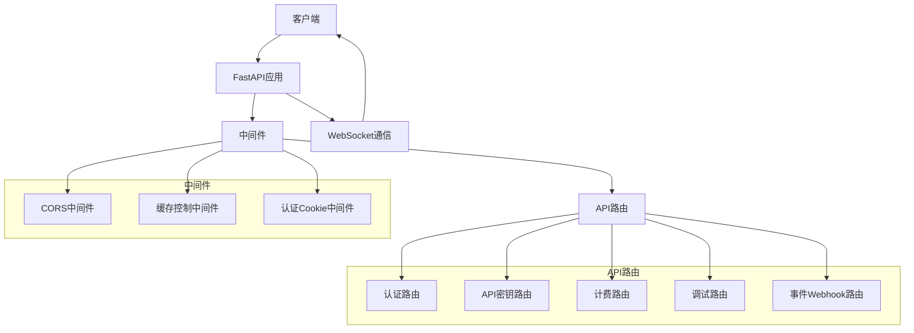
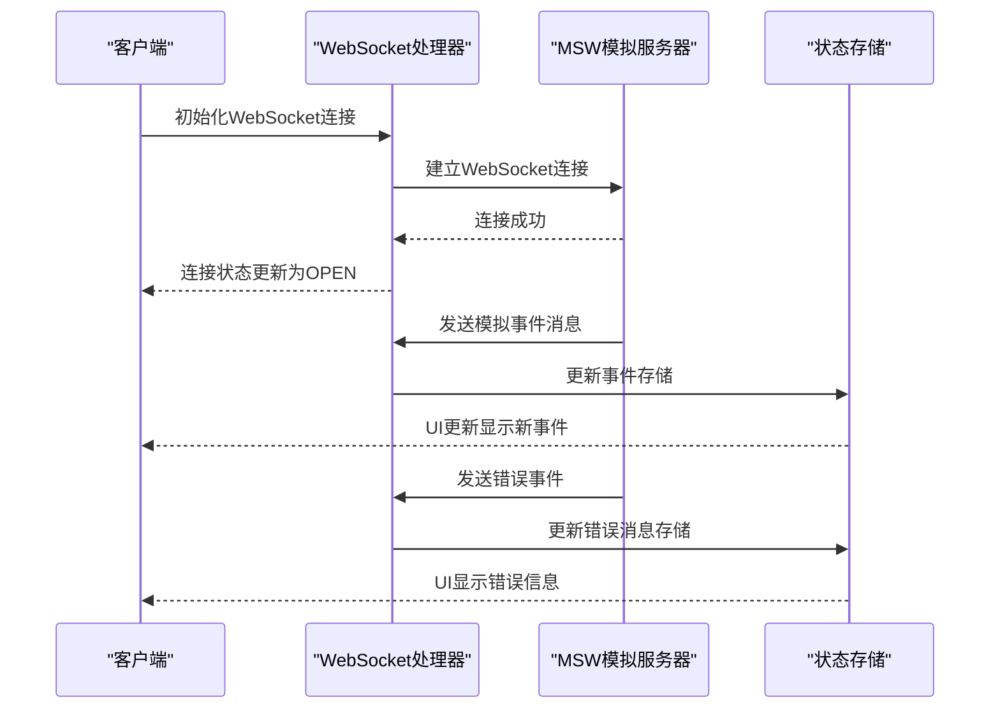
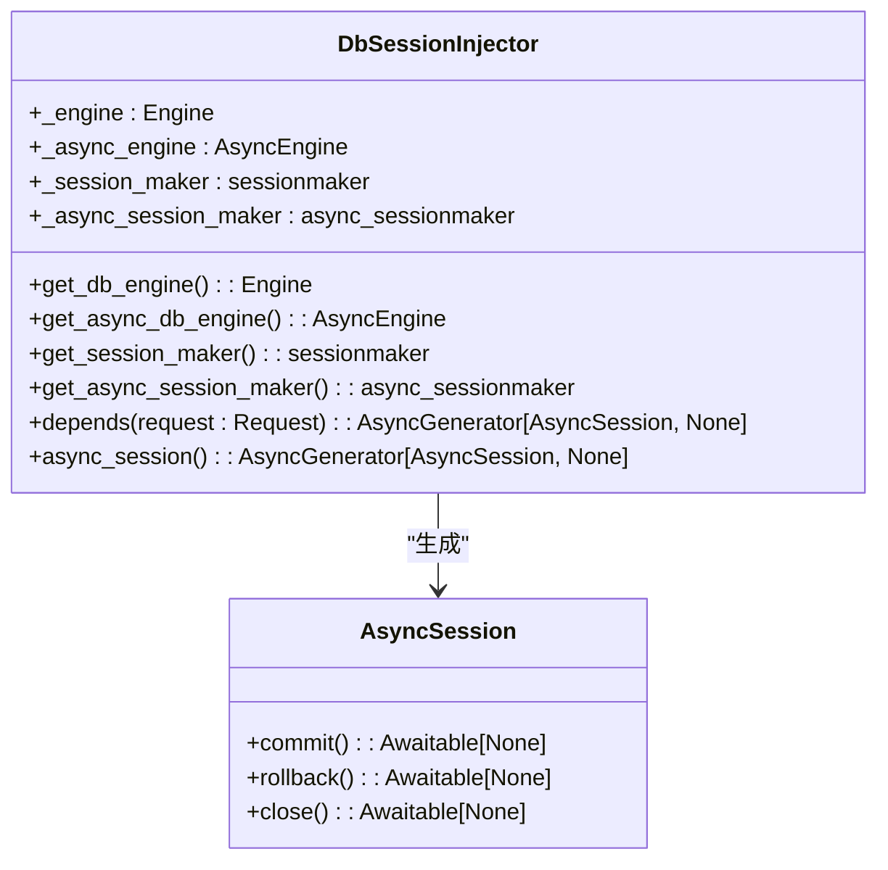
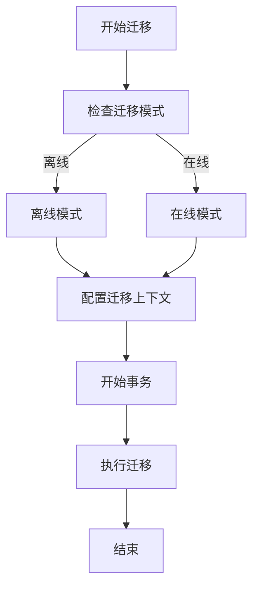
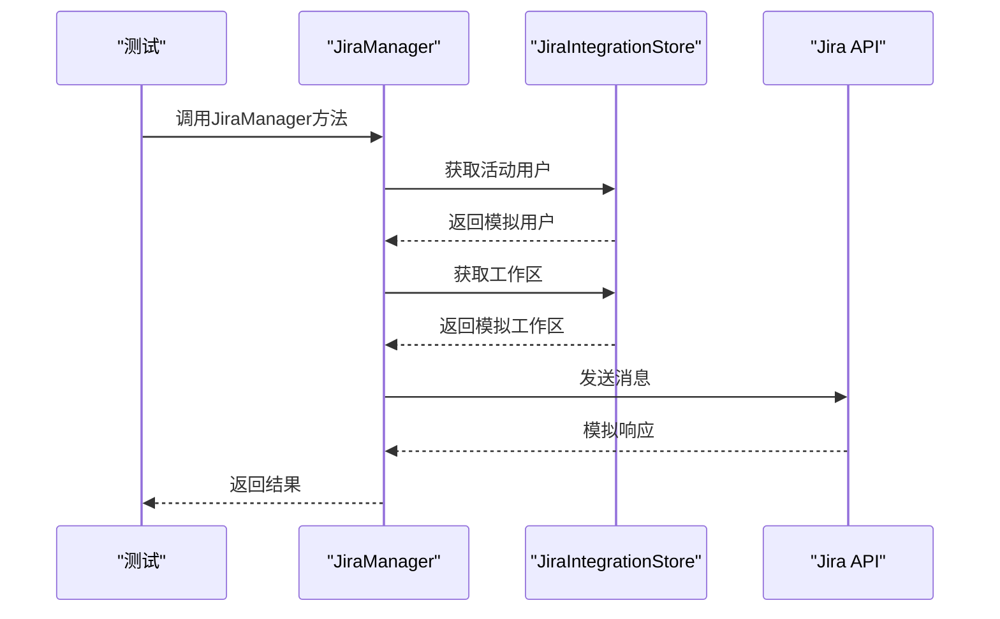
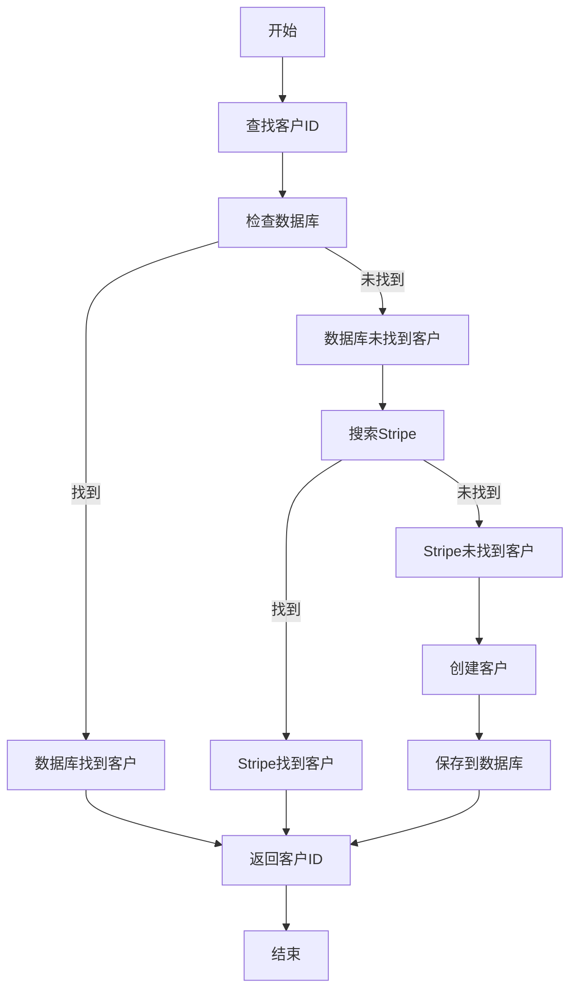
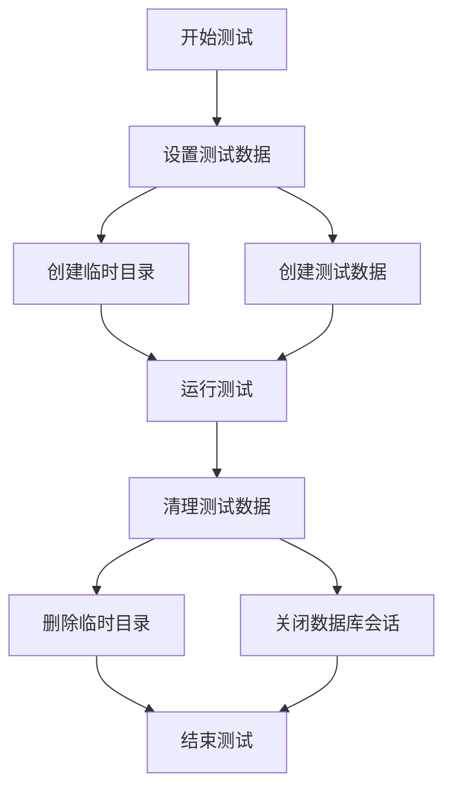

# 集成测试

<cite>
**本文档引用的文件**  
- [saas_server.py](file://enterprise/saas_server.py)
- [jira_workspace.py](file://enterprise/storage/jira_workspace.py)
- [alembic.ini](file://openhands/app_server/app_lifespan/alembic.ini)
- [env.py](file://enterprise/migrations/env.py)
- [jira_manager.py](file://enterprise/integrations/jira/jira_manager.py)
- [jira_view.py](file://enterprise/integrations/jira/jira_view.py)
- [stripe_service.py](file://enterprise/integrations/stripe_service.py)
- [test_jira_callback_processor.py](file://enterprise/tests/unit/server/conversation_callback_processor/test_jira_callback_processor.py)
- [test_conversation_callback_utils.py](file://enterprise/tests/unit/server/test_conversation_callback_utils.py)
- [use-websocket.test.ts](file://frontend/__tests__/hooks/use-websocket.test.ts)
- [conversation-websocket-handler.test.tsx](file://frontend/__tests__/conversation-websocket-handler.test.tsx)
- [msw-websocket-setup.ts](file://frontend/__tests__/helpers/msw-websocket-setup.ts)
- [conftest.py](file://enterprise/tests/unit/integrations/jira/conftest.py)
- [test_db_session_injector.py](file://tests/unit/app_server/test_db_session_injector.py)
- [mock_stripe_service.py](file://enterprise/tests/unit/mock_stripe_service.py)
</cite>

## 目录
1. [API端点集成测试](#api端点集成测试)
2. [数据库集成测试](#数据库集成测试)
3. [第三方服务集成测试](#第三方服务集成测试)
4. [企业版特有集成测试](#企业版特有集成测试)
5. [测试数据准备与清理](#测试数据准备与清理)

## API端点集成测试

OpenHands的API端点集成测试主要围绕FastAPI路由和WebSocket通信进行。系统使用FastAPI作为主要的Web框架，通过`saas_server.py`文件中的`base_app`实例来管理所有API路由的注册和中间件配置。API路由通过模块化的方式被包含到主应用中，例如认证路由、API密钥管理、计费、调试、事件Webhook等。

**Diagram sources**
- [saas_server.py](file://enterprise/saas_server.py#L1-L130)

**Section sources**
- [saas_server.py](file://enterprise/saas_server.py#L1-L130)

### WebSocket通信测试

前端的WebSocket通信测试使用MSW（Mock Service Worker）来模拟WebSocket连接和消息流。测试策略包括连接生命周期管理、事件流处理、状态管理集成、缓存管理、错误处理与恢复、连接状态验证、消息发送以及历史加载状态测试。

**Diagram sources**
- [conversation-websocket-handler.test.tsx](file://frontend/__tests__/conversation-websocket-handler.test.tsx#L1-L718)
- [use-websocket.test.ts](file://frontend/__tests__/hooks/use-websocket.test.ts#L1-L177)

**Section sources**
- [conversation-websocket-handler.test.tsx](file://frontend/__tests__/conversation-websocket-handler.test.tsx#L1-L718)
- [use-websocket.test.ts](file://frontend/__tests__/hooks/use-websocket.test.ts#L1-L177)

## 数据库集成测试

数据库集成测试涵盖了SQLAlchemy ORM和Alembic迁移的测试。系统使用SQLAlchemy作为ORM工具，通过`DbSessionInjector`类来管理数据库会话的创建和生命周期。测试策略包括数据库会话管理、连接复用、异步引擎复用、会话生成器复用以及请求上下文中的会话管理。

**Diagram sources**
- [test_db_session_injector.py](file://tests/unit/app_server/test_db_session_injector.py#L282-L530)
- [db_session_injector.py](file://openhands/app_server/services/db_session_injector.py#L267-L300)

**Section sources**
- [test_db_session_injector.py](file://tests/unit/app_server/test_db_session_injector.py#L282-L530)
- [db_session_injector.py](file://openhands/app_server/services/db_session_injector.py#L267-L300)

### Alembic迁移测试

Alembic迁移测试通过`env.py`文件中的配置来管理数据库迁移。测试策略包括离线模式和在线模式的迁移执行。离线模式用于生成SQL脚本，而在线模式用于直接在数据库上执行迁移。

**Diagram sources**
- [env.py](file://enterprise/migrations/env.py#L40-L114)
- [env.py](file://openhands/app_server/app_lifespan/alembic/env.py#L30-L115)

**Section sources**
- [env.py](file://enterprise/migrations/env.py#L40-L114)
- [env.py](file://openhands/app_server/app_lifespan/alembic/env.py#L30-L115)

## 第三方服务集成测试

第三方服务集成测试包括GitHub、GitLab、Jira和Slack的模拟测试。测试策略使用`pytest`的`@pytest.fixture`和`unittest.mock`来创建模拟对象和测试数据。

### Jira集成测试

Jira集成测试通过`conftest.py`文件中的固定装置来创建模拟的Jira用户、工作区、任务上下文和Webhook负载。测试覆盖了Jira管理器、视图和回调处理器的功能。

**Diagram sources**
- [conftest.py](file://enterprise/tests/unit/integrations/jira/conftest.py#L1-L241)
- [test_jira_manager.py](file://enterprise/tests/unit/integrations/jira/test_jira_manager.py#L1-L200)

**Section sources**
- [conftest.py](file://enterprise/tests/unit/integrations/jira/conftest.py#L1-L241)
- [test_jira_manager.py](file://enterprise/tests/unit/integrations/jira/test_jira_manager.py#L1-L200)

### Slack集成测试

Slack集成测试使用类似的策略，通过模拟Slack API调用来测试消息发送和事件处理功能。测试确保在不同状态下（如运行、等待用户输入、完成）能够正确地发送摘要到Slack。

## 企业版特有集成测试

企业版特有集成测试包括Stripe支付和Keycloak认证的测试。测试策略使用模拟服务来验证支付流程和认证逻辑。

### Stripe支付测试

Stripe支付测试通过`mock_stripe_service.py`文件中的模拟实现来测试客户查找、创建和支付方式检查功能。测试确保在数据库和Stripe API之间正确地同步客户信息。

**Diagram sources**
- [mock_stripe_service.py](file://enterprise/tests/unit/mock_stripe_service.py#L1-L81)
- [stripe_service.py](file://enterprise/integrations/stripe_service.py#L1-L73)

**Section sources**
- [mock_stripe_service.py](file://enterprise/tests/unit/mock_stripe_service.py#L1-L81)
- [stripe_service.py](file://enterprise/integrations/stripe_service.py#L1-L73)

### Keycloak认证测试

Keycloak认证测试通过模拟TokenManager来验证用户认证和令牌管理功能。测试确保在不同认证状态下能够正确地处理用户信息和权限。

## 测试数据准备与清理

测试数据准备与清理策略通过`conftest.py`文件中的固定装置来实现。测试数据包括模拟的用户、工作区、任务、仓库和Webhook负载。测试清理通过`request.addfinalizer`来确保在测试结束后删除临时目录和清理数据库会话。

**Diagram sources**
- [conftest.py](file://enterprise/tests/unit/integrations/jira/conftest.py#L1-L241)
- [temp_dir](file://tests/runtime/conftest.py#L93-L121)

**Section sources**
- [conftest.py](file://enterprise/tests/unit/integrations/jira/conftest.py#L1-L241)
- [temp_dir](file://tests/runtime/conftest.py#L93-L121)