# Docker沙箱

<cite>
**本文档引用的文件**
- [Dockerfile](file://containers/app/Dockerfile)
- [build.sh](file://containers/build.sh)
- [entrypoint.sh](file://containers/app/entrypoint.sh)
- [config.sh](file://containers/app/config.sh)
- [docker_runtime.py](file://openhands/runtime/impl/docker/docker_runtime.py)
- [runtime_build.py](file://openhands/runtime/utils/runtime_build.py)
- [e2b-sandbox/Dockerfile](file://third_party/containers/e2b-sandbox/Dockerfile)
- [e2b.toml](file://third_party/containers/e2b-sandbox/e2b.toml)
- [compose.yml](file://containers/dev/compose.yml)
</cite>

## 目录
1. [简介](#简介)
2. [项目结构](#项目结构)
3. [核心组件](#核心组件)
4. [架构概述](#架构概述)
5. [详细组件分析](#详细组件分析)
6. [依赖分析](#依赖分析)
7. [性能考虑](#性能考虑)
8. [故障排除指南](#故障排除指南)
9. [结论](#结论)

## 简介
Docker沙箱是OpenHands平台的默认运行时环境，为AI代理提供安全隔离的执行环境。该系统通过Docker容器技术实现，确保代码执行的安全性和可重复性。本技术文档详细解释了Docker沙箱的实现机制，包括镜像构建过程、容器生命周期管理、安全隔离策略和资源限制配置。文档还涵盖了网络配置、文件系统挂载和权限控制等安全特性，以及与e2b-sandbox的集成方式和配置选项。

## 项目结构
OpenHands的Docker沙箱实现分布在多个目录中，主要包含容器配置、构建脚本和运行时管理组件。核心的Docker相关文件位于`containers/`目录下，而运行时逻辑则在`openhands/runtime/`中实现。

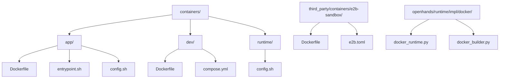

**Diagram sources**
- [containers/app/Dockerfile](file://containers/app/Dockerfile)
- [containers/dev/Dockerfile](file://containers/dev/Dockerfile)
- [third_party/containers/e2b-sandbox/Dockerfile](file://third_party/containers/e2b-sandbox/Dockerfile)
- [openhands/runtime/impl/docker/docker_runtime.py](file://openhands/runtime/impl/docker/docker_runtime.py)

**Section sources**
- [containers/app/Dockerfile](file://containers/app/Dockerfile)
- [containers/dev/Dockerfile](file://containers/dev/Dockerfile)
- [third_party/containers/e2b-sandbox/Dockerfile](file://third_party/containers/e2b-sandbox/Dockerfile)

## 核心组件
Docker沙箱的核心组件包括Docker镜像构建系统、容器运行时管理器和安全隔离机制。这些组件协同工作，为OpenHands提供可靠的执行环境。镜像构建系统负责创建包含所有必要依赖的运行时镜像，而容器运行时管理器则处理容器的生命周期，包括创建、启动、停止和销毁。安全隔离机制确保每个沙箱实例都在独立的环境中运行，防止潜在的安全风险。

**Section sources**
- [containers/app/Dockerfile](file://containers/app/Dockerfile)
- [containers/build.sh](file://containers/build.sh)
- [openhands/runtime/impl/docker/docker_runtime.py](file://openhands/runtime/impl/docker/docker_runtime.py)

## 架构概述
Docker沙箱的架构设计遵循微服务原则，将不同的功能模块分离，确保系统的可维护性和可扩展性。系统通过Docker容器提供隔离的执行环境，同时利用Docker的网络和存储功能实现与宿主机的通信和数据持久化。

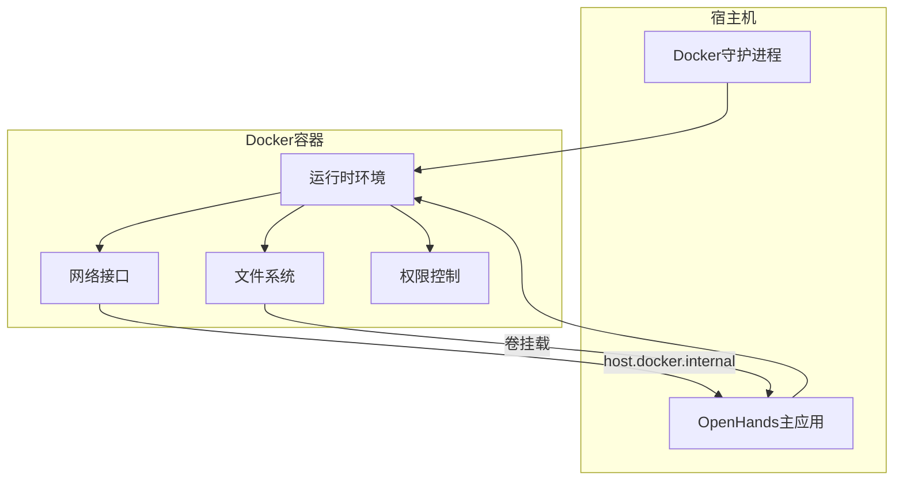

**Diagram sources**
- [containers/app/Dockerfile](file://containers/app/Dockerfile)
- [containers/app/entrypoint.sh](file://containers/app/entrypoint.sh)
- [openhands/runtime/impl/docker/docker_runtime.py](file://openhands/runtime/impl/docker/docker_runtime.py)

## 详细组件分析

### Docker镜像构建分析
Docker镜像构建是Docker沙箱实现的关键环节，它决定了运行时环境的初始状态和可用功能。构建过程采用多阶段构建策略，优化镜像大小并提高构建效率。

#### 镜像构建流程
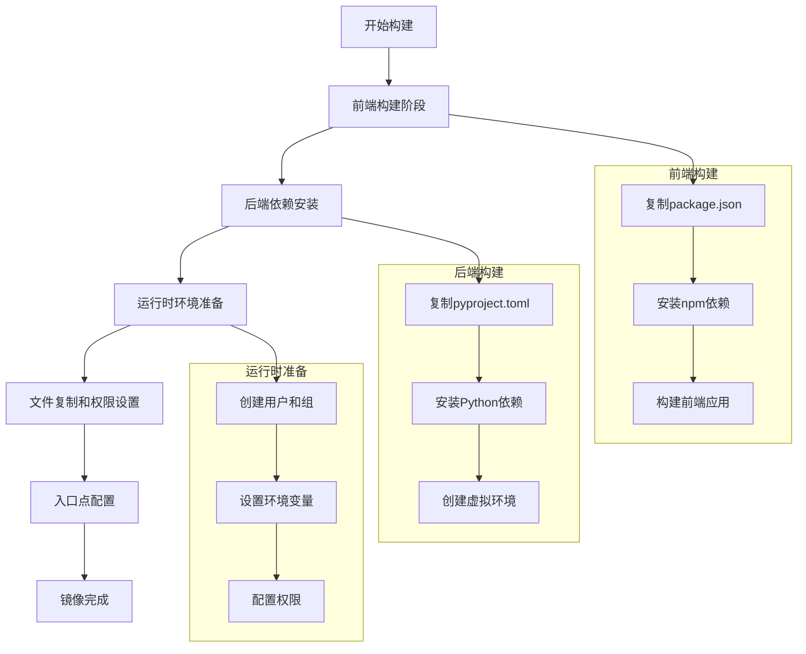

**Diagram sources**
- [containers/app/Dockerfile](file://containers/app/Dockerfile)
- [containers/build.sh](file://containers/build.sh)

#### 构建脚本分析
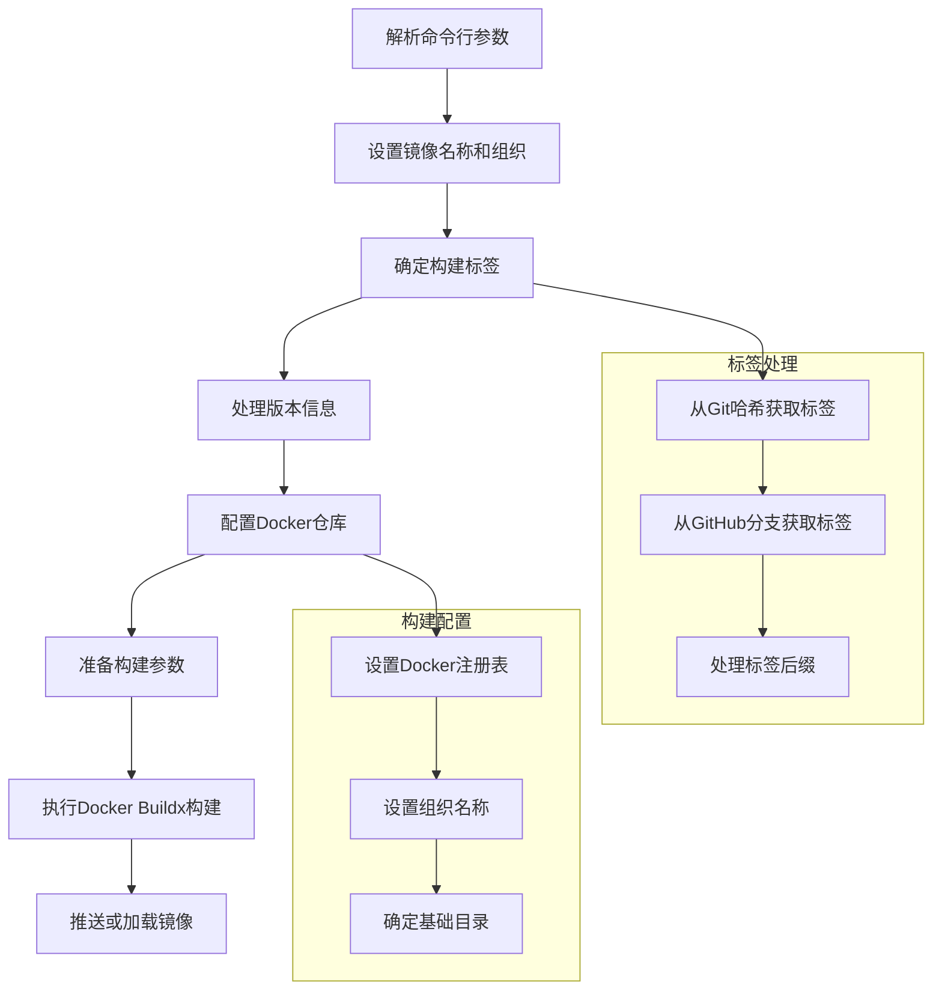

**Diagram sources**
- [containers/build.sh](file://containers/build.sh)
- [containers/app/config.sh](file://containers/app/config.sh)

**Section sources**
- [containers/build.sh](file://containers/build.sh)
- [containers/app/config.sh](file://containers/app/config.sh)

### 容器生命周期管理
容器生命周期管理是Docker沙箱的核心功能，负责容器的创建、启动、监控和销毁。这一过程确保了运行时环境的稳定性和可靠性。

#### 容器生命周期流程
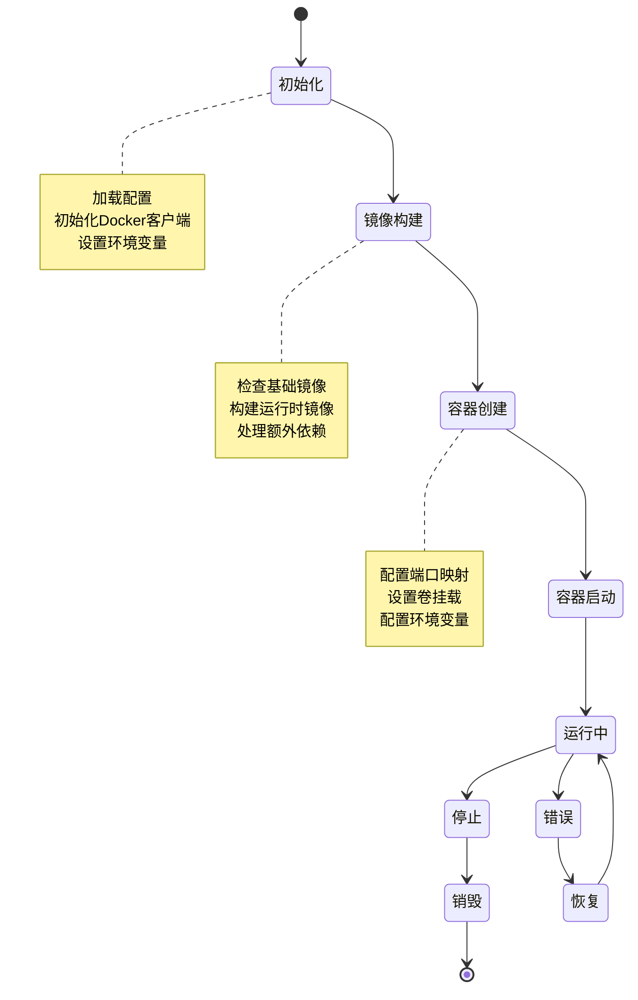

**Diagram sources**
- [openhands/runtime/impl/docker/docker_runtime.py](file://openhands/runtime/impl/docker/docker_runtime.py)
- [containers/app/entrypoint.sh](file://containers/app/entrypoint.sh)

#### 运行时配置分析
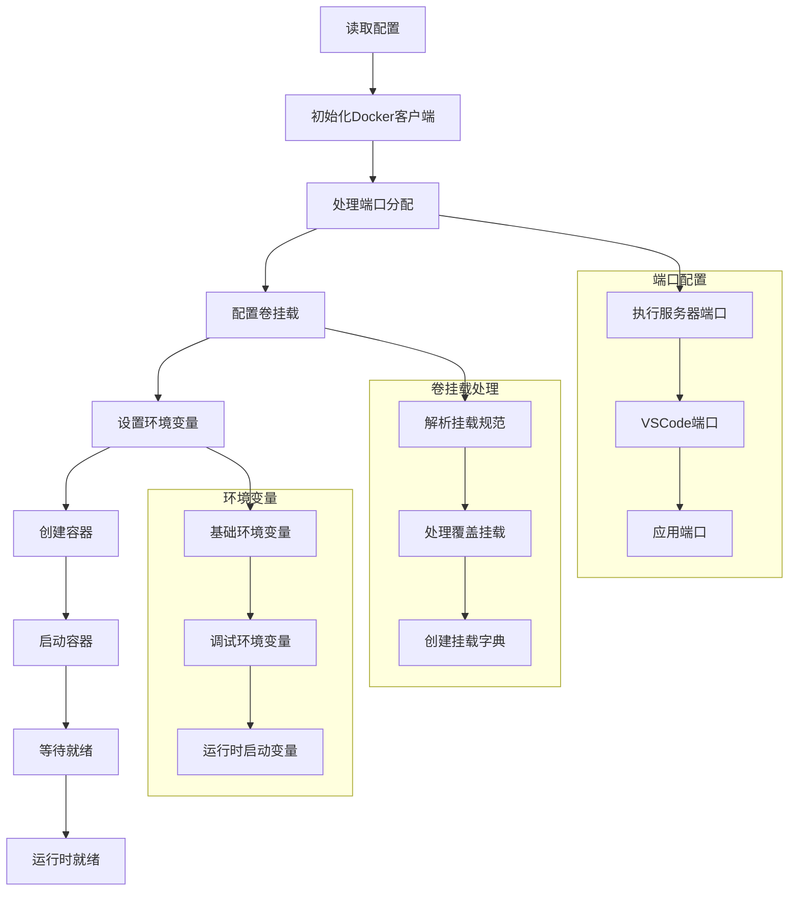

**Diagram sources**
- [openhands/runtime/impl/docker/docker_runtime.py](file://openhands/runtime/impl/docker/docker_runtime.py)
- [openhands/runtime/utils/runtime_build.py](file://openhands/runtime/utils/runtime_build.py)

**Section sources**
- [openhands/runtime/impl/docker/docker_runtime.py](file://openhands/runtime/impl/docker/docker_runtime.py)
- [openhands/runtime/utils/runtime_build.py](file://openhands/runtime/utils/runtime_build.py)

### 安全隔离与资源管理
安全隔离和资源管理是Docker沙箱的重要特性，确保了运行时环境的安全性和稳定性。

#### 安全隔离策略
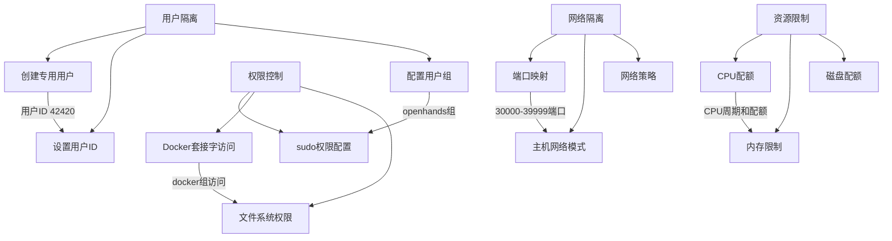

**Diagram sources**
- [containers/app/Dockerfile](file://containers/app/Dockerfile)
- [containers/app/entrypoint.sh](file://containers/app/entrypoint.sh)
- [openhands/runtime/impl/docker/docker_runtime.py](file://openhands/runtime/impl/docker/docker_runtime.py)

#### 资源限制配置
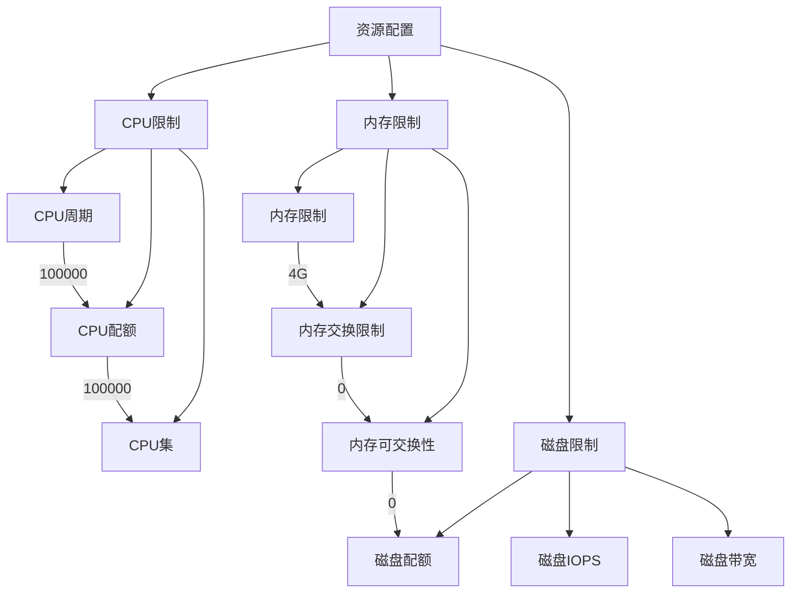

**Diagram sources**
- [tests/runtime/test_runtime_resource.py](file://tests/runtime/test_runtime_resource.py)
- [openhands/runtime/impl/docker/docker_runtime.py](file://openhands/runtime/impl/docker/docker_runtime.py)

**Section sources**
- [tests/runtime/test_runtime_resource.py](file://tests/runtime/test_runtime_resource.py)
- [openhands/runtime/impl/docker/docker_runtime.py](file://openhands/runtime/impl/docker/docker_runtime.py)

### 网络与文件系统配置
网络和文件系统配置是Docker沙箱与外部环境交互的关键，决定了数据流动和通信方式。

#### 网络配置流程
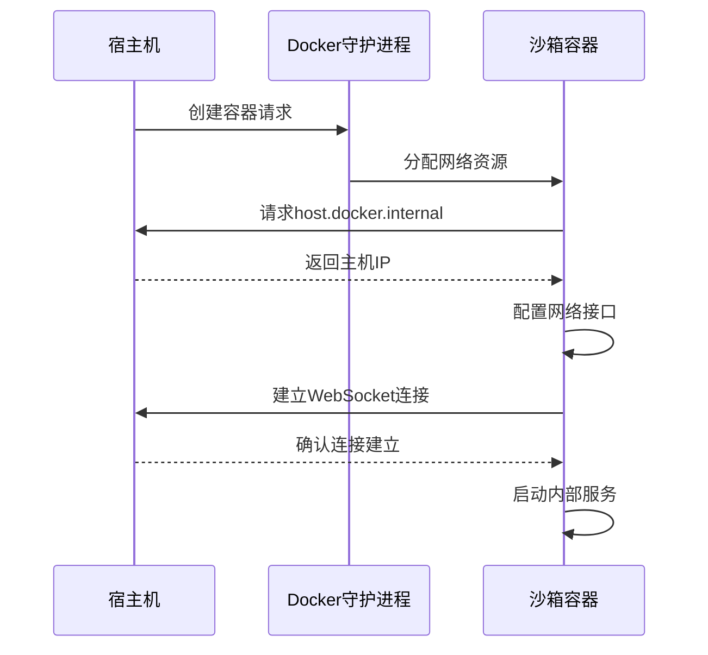

**Diagram sources**
- [containers/app/Dockerfile](file://containers/app/Dockerfile)
- [containers/dev/compose.yml](file://containers/dev/compose.yml)
- [openhands/runtime/impl/docker/docker_runtime.py](file://openhands/runtime/impl/docker/docker_runtime.py)

#### 文件系统挂载机制
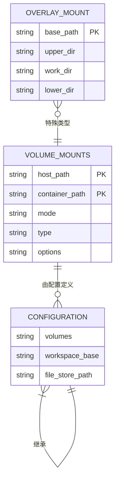

**Diagram sources**
- [openhands/runtime/impl/docker/docker_runtime.py](file://openhands/runtime/impl/docker/docker_runtime.py)
- [tests/unit/core/config/test_config.py](file://tests/unit/core/config/test_config.py)

**Section sources**
- [openhands/runtime/impl/docker/docker_runtime.py](file://openhands/runtime/impl/docker/docker_runtime.py)
- [tests/unit/core/config/test_config.py](file://tests/unit/core/config/test_config.py)

### e2b-sandbox集成分析
e2b-sandbox集成提供了与外部沙箱服务的连接能力，扩展了OpenHands的运行时选项。

#### e2b-sandbox配置
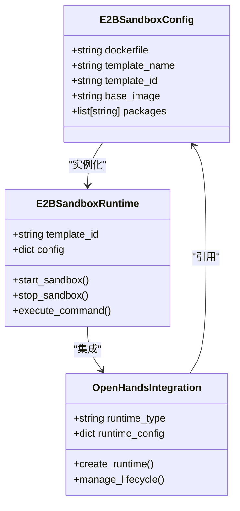

**Diagram sources**
- [third_party/containers/e2b-sandbox/e2b.toml](file://third_party/containers/e2b-sandbox/e2b.toml)
- [third_party/containers/e2b-sandbox/Dockerfile](file://third_party/containers/e2b-sandbox/Dockerfile)

**Section sources**
- [third_party/containers/e2b-sandbox/e2b.toml](file://third_party/containers/e2b-sandbox/e2b.toml)
- [third_party/containers/e2b-sandbox/Dockerfile](file://third_party/containers/e2b-sandbox/Dockerfile)

## 依赖分析
Docker沙箱的实现依赖于多个关键组件和外部服务，这些依赖关系确保了系统的完整性和功能性。

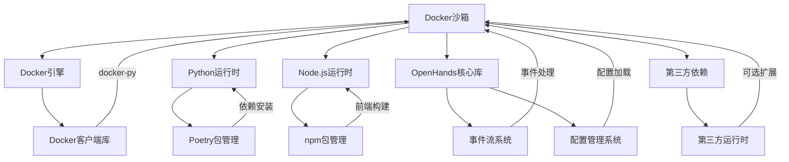

**Diagram sources**
- [containers/app/Dockerfile](file://containers/app/Dockerfile)
- [pyproject.toml](file://pyproject.toml)
- [frontend/package.json](file://frontend/package.json)

**Section sources**
- [containers/app/Dockerfile](file://containers/app/Dockerfile)
- [pyproject.toml](file://pyproject.toml)
- [frontend/package.json](file://frontend/package.json)

## 性能考虑
Docker沙箱的性能优化涉及多个方面，包括镜像大小、启动时间和资源利用率。

### 镜像优化策略
- **多阶段构建**: 使用多个构建阶段分离构建依赖和运行时依赖，显著减小最终镜像大小
- **缓存利用**: 通过Docker Buildx的缓存功能，避免重复下载和安装依赖
- **基础镜像选择**: 使用轻量级基础镜像（如slim-trixie）减少基础层大小
- **依赖精简**: 只安装必要的运行时依赖，避免包含开发工具

### 启动时间优化
- **预构建镜像**: 提前构建常用运行时镜像，避免在运行时进行耗时的构建操作
- **并行初始化**: 并行执行前端和后端的构建过程，充分利用多核CPU
- **延迟加载**: 将非关键组件的加载延迟到需要时进行
- **连接池**: 复用Docker客户端连接，避免重复建立连接的开销

### 资源利用率
- **动态资源分配**: 根据工作负载动态调整CPU和内存分配
- **连接复用**: 复用网络连接和数据库连接，减少连接建立的开销
- **批处理操作**: 将多个小操作合并为批处理操作，提高I/O效率
- **缓存策略**: 实现多级缓存策略，减少重复计算和数据访问

**Section sources**
- [containers/app/Dockerfile](file://containers/app/Dockerfile)
- [containers/build.sh](file://containers/build.sh)
- [openhands/runtime/impl/docker/docker_runtime.py](file://openhands/runtime/impl/docker/docker_runtime.py)

## 故障排除指南
本节提供常见问题的排查方法和解决方案。

### 常见问题及解决方案
- **容器启动失败**: 检查Docker服务是否正常运行，确认用户ID配置正确
- **网络连接问题**: 验证`host.docker.internal`解析是否正常，检查防火墙设置
- **权限错误**: 确认用户和组配置正确，检查文件系统权限
- **资源不足**: 调整CPU和内存限制，检查宿主机资源使用情况
- **依赖安装失败**: 检查网络连接，确认包管理器配置正确

### 调试技巧
- **启用调试模式**: 设置`DEBUG=true`环境变量获取详细日志
- **检查容器日志**: 使用`docker logs`命令查看容器输出
- **进入容器调试**: 使用`docker exec -it`进入运行中的容器进行调试
- **验证配置**: 检查配置文件和环境变量是否正确设置

**Section sources**
- [containers/app/entrypoint.sh](file://containers/app/entrypoint.sh)
- [openhands/runtime/impl/docker/docker_runtime.py](file://openhands/runtime/impl/docker/docker_runtime.py)
- [containers/app/Dockerfile](file://containers/app/Dockerfile)

## 结论
Docker沙箱作为OpenHands的默认运行时环境，通过精心设计的架构和实现，提供了安全、可靠和高效的执行环境。系统采用多阶段Docker构建策略，优化了镜像大小和构建效率。容器生命周期管理确保了运行时环境的稳定性和可预测性。安全隔离机制通过用户隔离、权限控制和资源限制，保障了系统的安全性。网络和文件系统配置实现了与宿主机的有效通信和数据持久化。与e2b-sandbox的集成扩展了运行时选项，提供了更大的灵活性。整体设计遵循最佳实践，为AI代理的执行提供了坚实的基础。