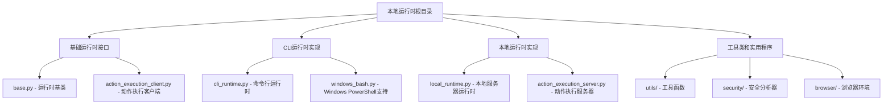
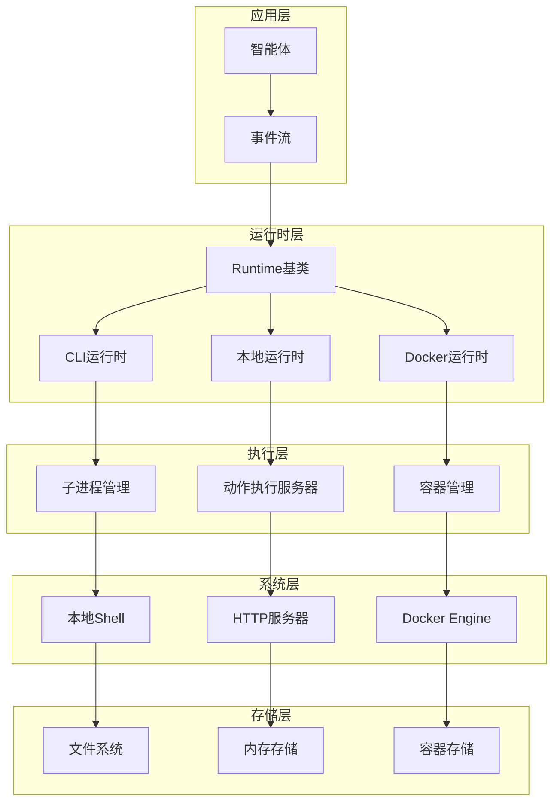
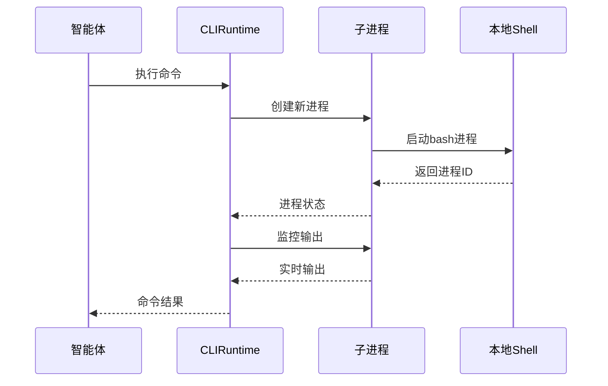
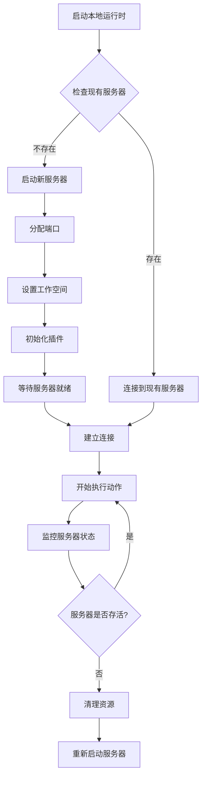
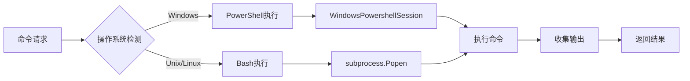
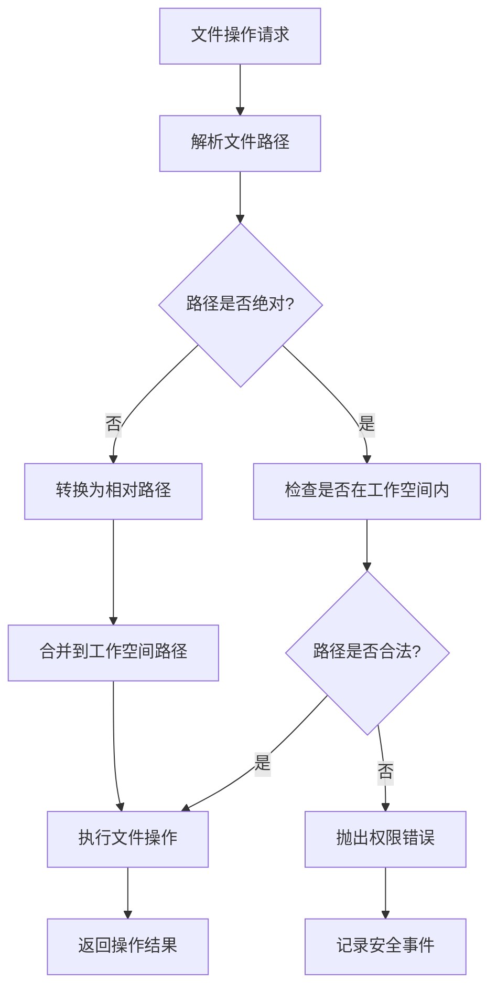
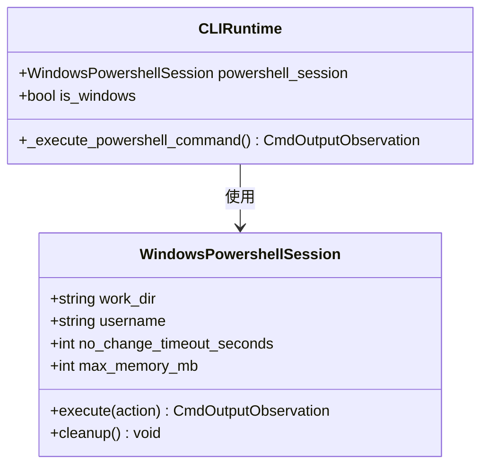
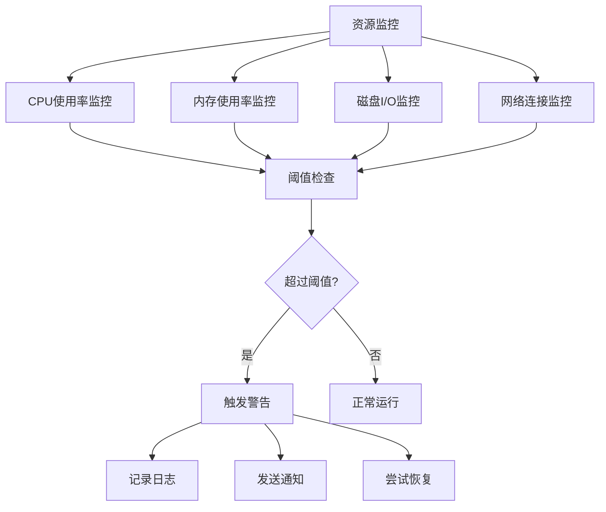
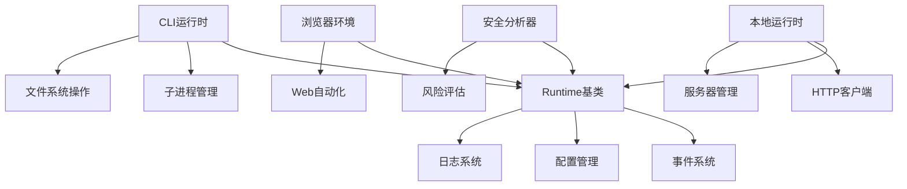

# 本地运行时

<cite>
**本文档中引用的文件**
- [base.py](file://openhands/runtime/base.py)
- [cli_runtime.py](file://openhands/runtime/impl/cli/cli_runtime.py)
- [local_runtime.py](file://openhands/runtime/impl/local/local_runtime.py)
- [README.md](file://openhands/runtime/README.md)
- [windows_bash.py](file://openhands/runtime/utils/windows_bash.py)
- [test_bash.py](file://tests/runtime/test_bash.py)
- [test_env_vars.py](file://tests/runtime/test_env_vars.py)
- [test_windows_bash.py](file://tests/runtime/test_windows_bash.py)
- [test_stress_remote_runtime.py](file://tests/runtime/test_stress_remote_runtime.py)
- [analyzer.py](file://openhands/security/invariant/analyzer.py)
- [logger.py](file://openhands/core/logger.py)
</cite>

## 目录
1. [简介](#简介)
2. [项目结构](#项目结构)
3. [核心组件](#核心组件)
4. [架构概览](#架构概览)
5. [详细组件分析](#详细组件分析)
6. [依赖关系分析](#依赖关系分析)
7. [性能考虑](#性能考虑)
8. [故障排除指南](#故障排除指南)
9. [结论](#结论)

## 简介

OpenHands本地运行时是一个强大的执行环境，允许智能体在开发者机器上直接执行任务。该系统提供了多种运行时实现，包括本地直接执行、容器化执行和远程执行等模式。本地运行时特别适用于开发和测试场景，因为它提供了对本地系统资源的直接访问，同时保持了必要的安全隔离。

本地运行时的核心优势在于其简单性和高性能。它不需要额外的容器化开销，可以直接访问主机文件系统和网络资源，为开发者提供了最直接的执行环境。

## 项目结构

本地运行时的代码组织遵循模块化设计原则，主要分为以下几个层次：

**图表来源**
- [base.py](file://openhands/runtime/base.py#L1-L50)
- [cli_runtime.py](file://openhands/runtime/impl/cli/cli_runtime.py#L1-L50)
- [local_runtime.py](file://openhands/runtime/impl/local/local_runtime.py#L1-L50)

**章节来源**
- [README.md](file://openhands/runtime/README.md#L1-L162)

## 核心组件

### 运行时基类 (Runtime)

运行时基类是所有运行时实现的基础抽象，定义了统一的接口和核心功能：

- **环境变量管理**: 支持动态添加和更新环境变量
- **动作执行**: 处理各种类型的动作（命令执行、文件操作、浏览器交互）
- **插件系统**: 集成Jupyter、VSCode等开发工具
- **安全分析**: 内置安全风险评估机制

### CLI运行时 (CLIRuntime)

CLI运行时是最简单的本地执行实现，直接使用Python标准库和子进程执行命令：

- **进程管理**: 使用`subprocess`模块管理外部命令
- **文件系统**: 直接访问主机文件系统
- **跨平台支持**: 同时支持Unix和Windows环境
- **实时输出**: 支持命令输出的实时流式传输

### 本地运行时 (LocalRuntime)

本地运行时通过启动独立的服务器进程来提供更强大的功能：

- **服务器架构**: 独立的动作执行服务器
- **热服务器**: 支持预启动的服务器池以提高响应速度
- **端口管理**: 自动分配和管理各种服务端口
- **生命周期管理**: 完整的服务器启动、停止和清理流程

**章节来源**
- [base.py](file://openhands/runtime/base.py#L91-L200)
- [cli_runtime.py](file://openhands/runtime/impl/cli/cli_runtime.py#L90-L150)
- [local_runtime.py](file://openhands/runtime/impl/local/local_runtime.py#L124-L200)

## 架构概览

本地运行时采用分层架构设计，确保了良好的可扩展性和维护性：

**图表来源**
- [base.py](file://openhands/runtime/base.py#L120-L180)
- [cli_runtime.py](file://openhands/runtime/impl/cli/cli_runtime.py#L168-L200)
- [local_runtime.py](file://openhands/runtime/impl/local/local_runtime.py#L218-L300)

## 详细组件分析

### 进程管理系统

本地运行时实现了多层次的进程管理机制：

#### CLI运行时进程管理

**图表来源**
- [cli_runtime.py](file://openhands/runtime/impl/cli/cli_runtime.py#L325-L430)

#### 本地运行时服务器管理

本地运行时通过独立的服务器进程提供更稳定的执行环境：

**图表来源**
- [local_runtime.py](file://openhands/runtime/impl/local/local_runtime.py#L218-L380)

**章节来源**
- [cli_runtime.py](file://openhands/runtime/impl/cli/cli_runtime.py#L220-L290)
- [local_runtime.py](file://openhands/runtime/impl/local/local_runtime.py#L330-L400)

### 命令执行机制

#### 跨平台命令执行

本地运行时支持多种命令执行模式，适应不同的操作系统环境：

**图表来源**
- [cli_runtime.py](file://openhands/runtime/impl/cli/cli_runtime.py#L461-L470)
- [windows_bash.py](file://openhands/runtime/utils/windows_bash.py#L1-L50)

#### 环境变量处理

环境变量的处理是运行时的重要功能，支持动态添加和持久化：

| 操作系统 | 处理方式 | 持久化位置 |
|---------|---------|-----------|
| Windows | PowerShell `$env:`语法 | 当前会话 |
| Unix/Linux | `export`命令 | `.bashrc`文件 |
| 所有平台 | `os.environ` | 当前Python进程 |

**章节来源**
- [base.py](file://openhands/runtime/base.py#L247-L321)
- [cli_runtime.py](file://openhands/runtime/impl/cli/cli_runtime.py#L194-L220)

### 文件系统交互

#### 路径安全验证

为了防止路径遍历攻击，本地运行时实现了严格的路径验证机制：

**图表来源**
- [cli_runtime.py](file://openhands/runtime/impl/cli/cli_runtime.py#L525-L540)

#### 文件编辑器集成

本地运行时集成了高级文件编辑功能：

| 编辑器功能 | 实现方式 | 支持格式 |
|-----------|---------|---------|
| 文件读取 | Python标准库 | 文本文件 |
| 文件写入 | Python标准库 | 文本文件 |
| 文件编辑 | OHEditor | 源代码文件 |
| 查看范围 | 视窗控制 | 行号范围 |

**章节来源**
- [cli_runtime.py](file://openhands/runtime/impl/cli/cli_runtime.py#L525-L680)

### 与本地Shell环境的集成

#### Windows PowerShell支持

对于Windows环境，本地运行时提供了专门的PowerShell集成：

**图表来源**
- [cli_runtime.py](file://openhands/runtime/impl/cli/cli_runtime.py#L178-L185)
- [windows_bash.py](file://openhands/runtime/utils/windows_bash.py#L1-L100)

#### Unix Shell集成

在Unix/Linux环境中，本地运行时直接使用bash shell：

- **进程组管理**: 使用`start_new_session=True`创建新的进程组
- **信号处理**: 正确处理SIGTERM和SIGKILL信号
- **输出流控制**: 实现实时输出流和缓冲输出的平衡

**章节来源**
- [cli_runtime.py](file://openhands/runtime/impl/cli/cli_runtime.py#L325-L430)
- [test_windows_bash.py](file://tests/runtime/test_windows_bash.py#L419-L479)

### 资源监控和错误处理

#### 资源监控机制

本地运行时实现了多层次的资源监控：

#### 错误处理策略

本地运行时采用分层错误处理策略：

| 错误类型 | 处理策略 | 恢复机制 |
|---------|---------|---------|
| 权限错误 | 记录并返回错误观察 | 不自动恢复 |
| 网络错误 | 重试机制 | 连接重建 |
| 超时错误 | 终止进程 | 清理资源 |
| 系统错误 | 异常捕获 | 状态重置 |

**章节来源**
- [base.py](file://openhands/runtime/base.py#L370-L400)
- [test_stress_remote_runtime.py](file://tests/runtime/test_stress_remote_runtime.py#L331-L359)

## 依赖关系分析

本地运行时的依赖关系体现了清晰的分层架构：

**图表来源**
- [base.py](file://openhands/runtime/base.py#L1-L50)
- [cli_runtime.py](file://openhands/runtime/impl/cli/cli_runtime.py#L1-L50)
- [local_runtime.py](file://openhands/runtime/impl/local/local_runtime.py#L1-L50)

**章节来源**
- [base.py](file://openhands/runtime/base.py#L1-L100)
- [cli_runtime.py](file://openhands/runtime/impl/cli/cli_runtime.py#L1-L100)

## 性能考虑

### 执行性能优化

本地运行时在多个方面进行了性能优化：

#### 热服务器机制

本地运行时实现了热服务器机制来减少启动延迟：

- **预启动服务器**: 在空闲时预先启动服务器实例
- **服务器池管理**: 维护一个可用服务器池
- **负载均衡**: 智能选择最佳服务器实例

#### 并发处理

- **异步操作**: 使用asyncio实现非阻塞操作
- **信号量控制**: 限制并发动作执行数量
- **资源池化**: 复用昂贵的资源对象

### 内存管理

- **垃圾回收**: 及时释放不再使用的资源
- **缓存策略**: 智能缓存频繁访问的数据
- **内存监控**: 实时监控内存使用情况

### 网络性能

- **连接复用**: HTTP客户端连接池
- **超时控制**: 合理的网络超时设置
- **重试机制**: 智能的失败重试策略

## 故障排除指南

### 常见问题诊断

#### 连接问题

**症状**: 无法连接到运行时服务器
**原因**: 
- 服务器未启动
- 端口被占用
- 防火墙阻止

**解决方案**:
1. 检查服务器进程状态
2. 验证端口可用性
3. 检查防火墙设置

#### 权限问题

**症状**: 文件操作失败或权限拒绝
**原因**:
- 工作空间权限不足
- 路径遍历攻击防护
- 用户权限限制

**解决方案**:
1. 检查工作空间权限
2. 验证文件路径安全性
3. 使用正确的用户身份

#### 资源耗尽

**症状**: 命令执行超时或失败
**原因**:
- 内存不足
- CPU使用率过高
- 磁盘空间不足

**解决方案**:
1. 监控系统资源使用
2. 调整资源限制
3. 清理临时文件

### 调试技巧

#### 日志分析

本地运行时提供了丰富的日志功能：

#### 性能分析

- **时间测量**: 记录关键操作的执行时间
- **资源监控**: 跟踪CPU、内存使用情况
- **瓶颈识别**: 分析性能热点

#### 安全审计

- **行为监控**: 跟踪可疑操作
- **权限检查**: 验证操作权限
- **风险评估**: 评估潜在安全威胁

**章节来源**
- [logger.py](file://openhands/core/logger.py#L87-L369)
- [analyzer.py](file://openhands/security/invariant/analyzer.py#L105-L125)

### 配置选项

#### 基本配置

| 配置项 | 默认值 | 说明 |
|-------|--------|------|
| `workspace_base` | `None` | 工作空间根目录 |
| `timeout` | `600` | 命令执行超时时间(秒) |
| `headless_mode` | `False` | 是否启用无头模式 |

#### 高级配置

| 配置项 | 默认值 | 说明 |
|-------|--------|------|
| `DESIRED_NUM_WARM_SERVERS` | `0` | 预启动服务器数量 |
| `INITIAL_NUM_WARM_SERVERS` | `0` | 初始化时预启动服务器数量 |
| `RUNTIME_URL` | `localhost` | 运行时服务器地址 |

### 安全注意事项

#### 权限提升

本地运行时需要谨慎处理权限提升：

- **最小权限原则**: 仅授予必要的系统权限
- **沙箱隔离**: 尽可能使用隔离环境
- **输入验证**: 严格验证所有用户输入

#### 系统资源消耗控制

- **内存限制**: 设置合理的内存使用上限
- **CPU限制**: 控制CPU使用率
- **磁盘空间**: 监控磁盘使用情况

#### 网络安全

- **防火墙配置**: 正确配置防火墙规则
- **加密通信**: 使用HTTPS保护数据传输
- **访问控制**: 实施适当的访问控制策略

## 结论

OpenHands本地运行时提供了一个强大而灵活的执行环境，适用于开发、测试和生产场景。其模块化设计确保了良好的可扩展性和维护性，而多层次的安全机制则保证了系统的安全性。

主要优势包括：
- **高性能**: 直接访问本地资源，避免容器化开销
- **易用性**: 简单的配置和部署过程
- **灵活性**: 支持多种执行模式和配置选项
- **安全性**: 内置安全分析和风险评估机制

未来发展方向：
- **性能优化**: 进一步优化启动时间和执行效率
- **功能扩展**: 添加更多开发工具和插件支持
- **安全增强**: 加强安全防护和合规性检查
- **云原生**: 支持更多的云平台和服务

本地运行时作为OpenHands生态系统的重要组成部分，为智能体提供了可靠、高效的本地执行环境，是开发和测试阶段的理想选择。