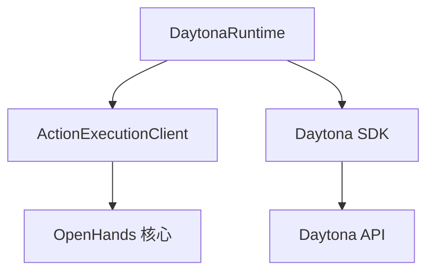
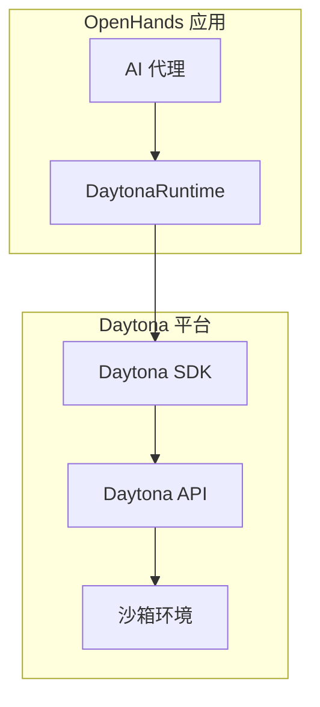
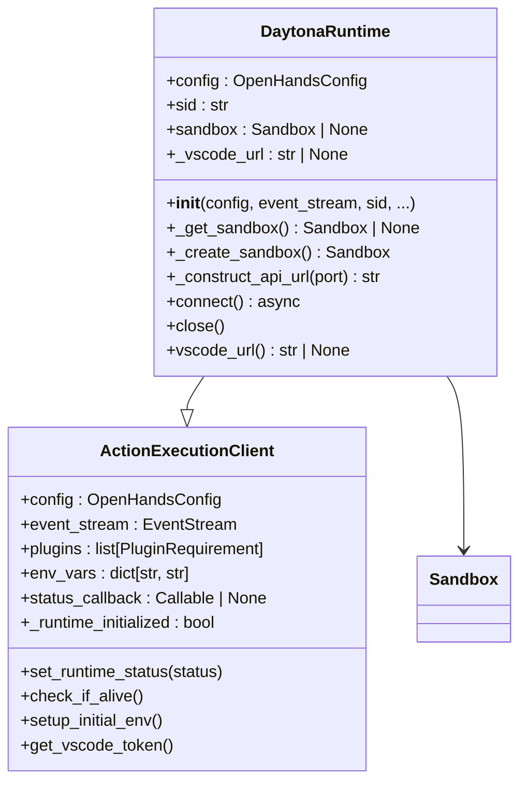
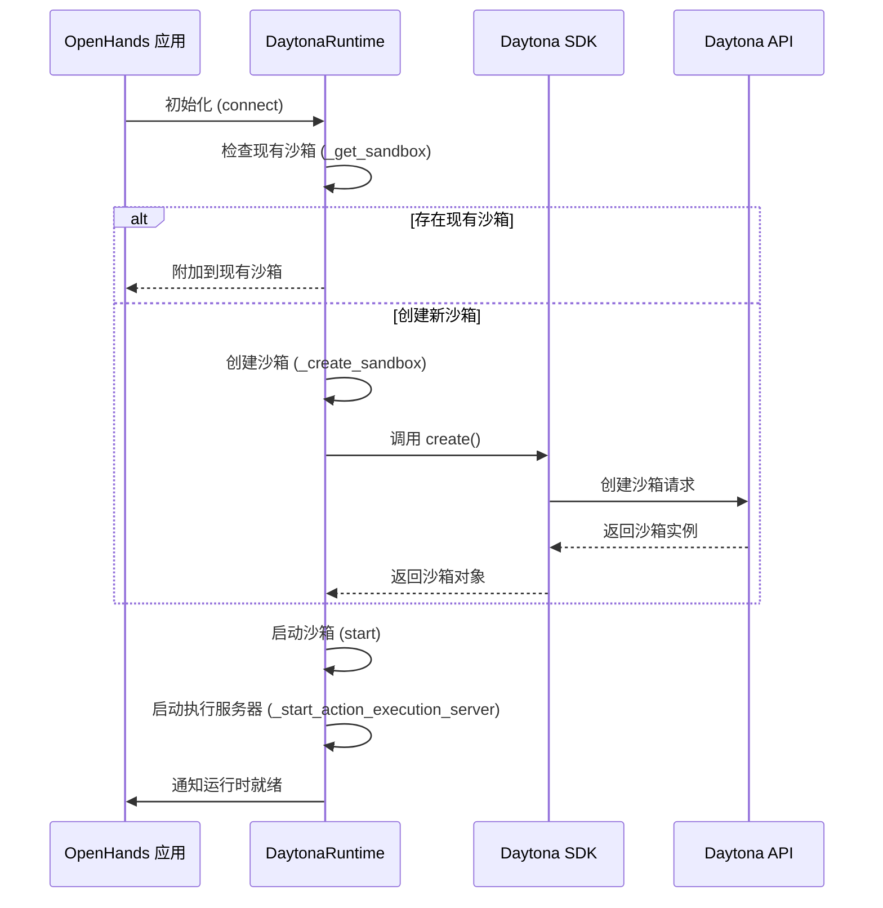
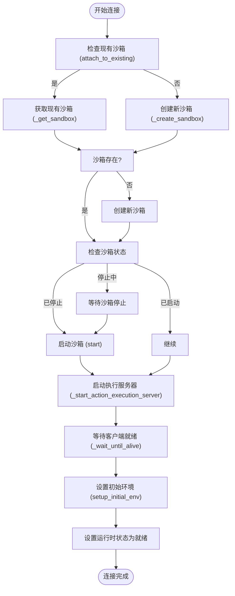
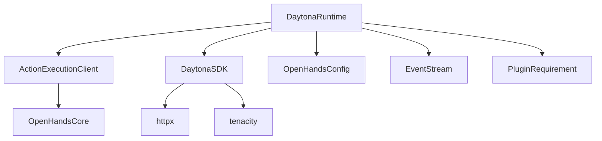

# Daytona 集成

<cite>
**本文档中引用的文件**  
- [daytona_runtime.py](file://third_party/runtime/impl/daytona/daytona_runtime.py)
- [__init__.py](file://third_party/runtime/impl/daytona/__init__.py)
- [README.md](file://third_party/runtime/impl/daytona/README.md)
</cite>

## 目录
1. [简介](#简介)
2. [项目结构](#项目结构)
3. [核心组件](#核心组件)
4. [架构概述](#架构概述)
5. [详细组件分析](#详细组件分析)
6. [依赖分析](#依赖分析)
7. [性能考虑](#性能考虑)
8. [故障排除指南](#故障排除指南)
9. [结论](#结论)

## 简介
Daytona 集成文档详细介绍了 OpenHands 与 Daytona 平台的集成机制。Daytona 是一个为 AI 生成代码提供安全弹性基础设施的平台，通过其 SDK 实现与开发环境的程序化交互。本文档深入分析了 `daytona_runtime.py` 的实现，解释了会话管理、环境配置和资源调度机制，并提供了配置示例和使用场景。

## 项目结构
Daytona 运行时集成位于 `third_party/runtime/impl/daytona/` 目录下，包含核心实现文件、初始化配置和说明文档。该结构支持通过环境变量进行配置，并与 OpenHands 的运行时系统无缝集成。

**Diagram sources**
- [daytona_runtime.py](file://third_party/runtime/impl/daytona/daytona_runtime.py#L30-L298)

**Section sources**
- [daytona_runtime.py](file://third_party/runtime/impl/daytona/daytona_runtime.py#L1-L298)
- [__init__.py](file://third_party/runtime/impl/daytona/__init__.py#L1-L8)
- [README.md](file://third_party/runtime/impl/daytona/README.md#L1-L135)

## 核心组件
`DaytonaRuntime` 类是 Daytona 集成的核心，继承自 `ActionExecutionClient`，负责管理 Daytona 沙箱的生命周期。它通过 Daytona SDK 与 Daytona 平台交互，处理沙箱的创建、启动、停止和删除操作。运行时通过环境变量进行配置，支持会话附加和现有沙箱的重用。

**Section sources**
- [daytona_runtime.py](file://third_party/runtime/impl/daytona/daytona_runtime.py#L30-L298)

## 架构概述
Daytona 集成架构基于客户端-服务器模型，其中 OpenHands 作为客户端通过 Daytona SDK 与 Daytona 平台通信。运行时创建沙箱作为隔离的执行环境，通过预定义端口暴露服务接口。架构支持弹性伸缩和安全隔离，确保 AI 代理在受控环境中执行代码。

**Diagram sources**
- [daytona_runtime.py](file://third_party/runtime/impl/daytona/daytona_runtime.py#L30-L298)

## 详细组件分析

### DaytonaRuntime 分析
`DaytonaRuntime` 类实现了与 Daytona 平台的完整交互流程，包括认证、会话管理和资源调度。

#### 对象导向组件

**Diagram sources**
- [daytona_runtime.py](file://third_party/runtime/impl/daytona/daytona_runtime.py#L30-L298)

#### API/服务组件

**Diagram sources**
- [daytona_runtime.py](file://third_party/runtime/impl/daytona/daytona_runtime.py#L184-L234)

#### 复杂逻辑组件

**Diagram sources**
- [daytona_runtime.py](file://third_party/runtime/impl/daytona/daytona_runtime.py#L184-L234)

**Section sources**
- [daytona_runtime.py](file://third_party/runtime/impl/daytona/daytona_runtime.py#L30-L298)

## 依赖分析
Daytona 运行时依赖于多个核心组件和外部服务，形成了一个复杂的依赖网络。主要依赖包括 Daytona SDK、HTTP 客户端库和 OpenHands 核心模块。

**Diagram sources**
- [daytona_runtime.py](file://third_party/runtime/impl/daytona/daytona_runtime.py#L1-L298)

**Section sources**
- [daytona_runtime.py](file://third_party/runtime/impl/daytona/daytona_runtime.py#L1-L298)

## 性能考虑
Daytona 运行时通过异步操作和重试机制优化性能。连接过程采用异步等待策略，确保在沙箱准备就绪前不会阻塞主线程。HTTP 请求通过 tenacity 库实现重试，增强了网络不稳定环境下的可靠性。沙箱状态检查和生命周期管理经过优化，减少了不必要的 API 调用。

## 故障排除指南
当遇到 Daytona 集成问题时，首先检查环境变量配置是否正确。常见的错误包括 API 密钥缺失、网络连接问题和沙箱状态异常。日志记录提供了详细的调试信息，重点关注连接过程中的状态转换和错误消息。对于 502 错误，系统会自动重试，但如果持续发生，可能需要检查 Daytona 平台的可用性。

**Section sources**
- [daytona_runtime.py](file://third_party/runtime/impl/daytona/daytona_runtime.py#L235-L249)

## 结论
Daytona 集成为 OpenHands 提供了强大的远程执行能力，通过安全的沙箱环境支持 AI 代理的代码生成和执行。该集成设计考虑了弹性、安全性和易用性，通过清晰的 API 和配置选项简化了部署和管理。选择 Daytona 作为运行时适用于需要隔离执行环境、弹性伸缩和高级安全控制的场景。