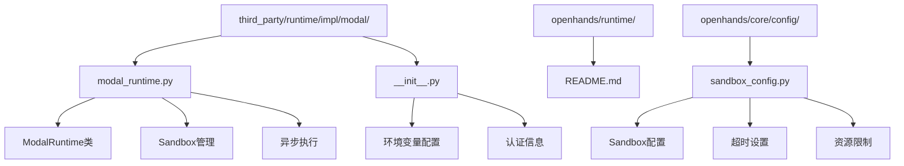
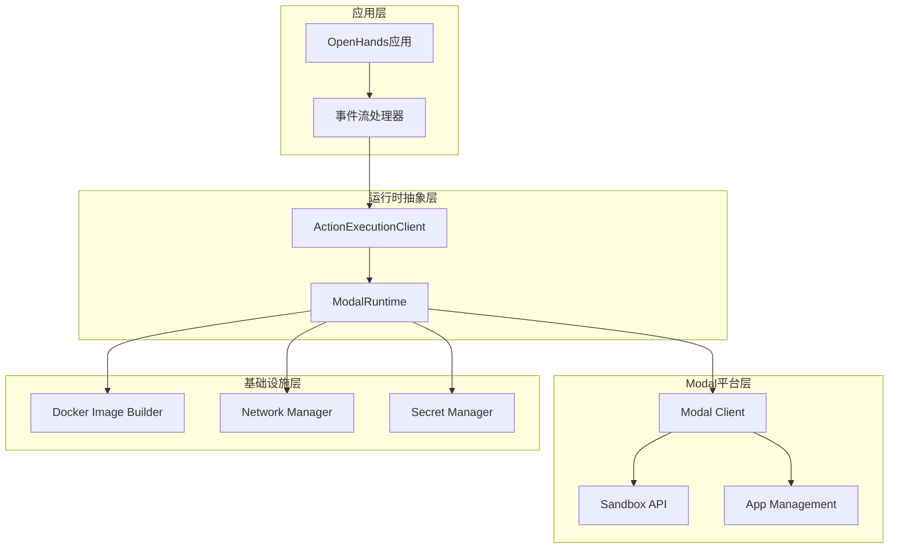
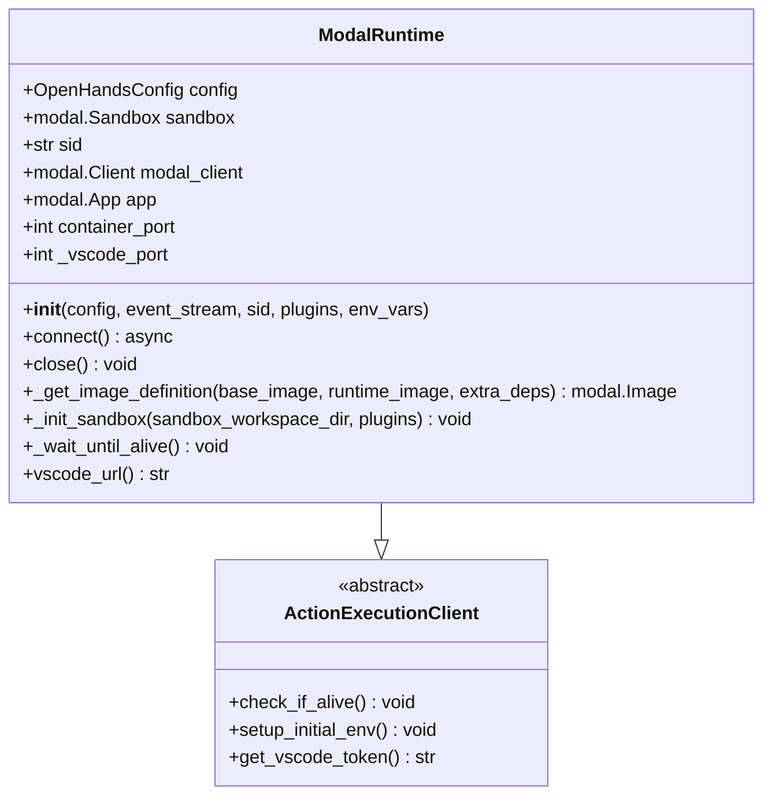
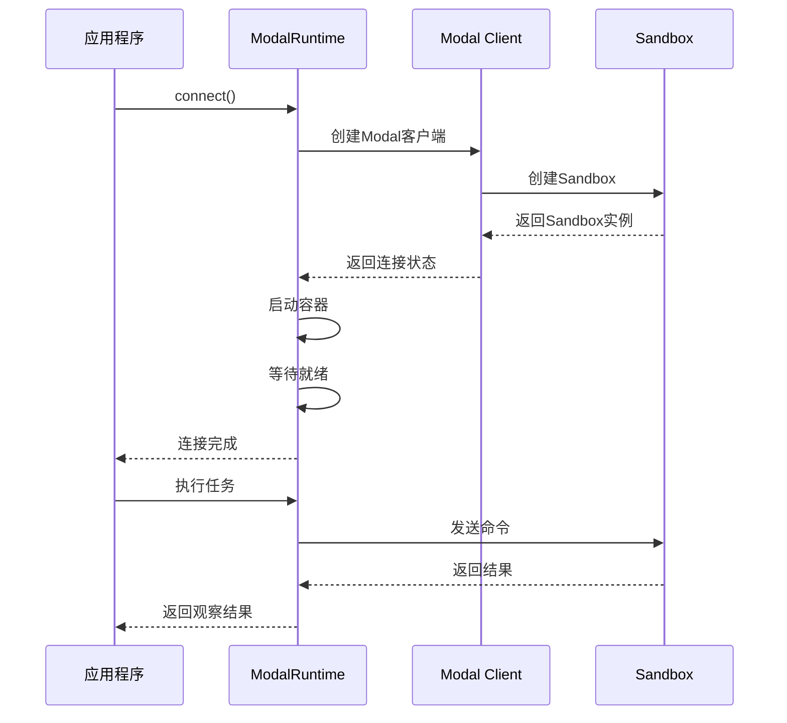
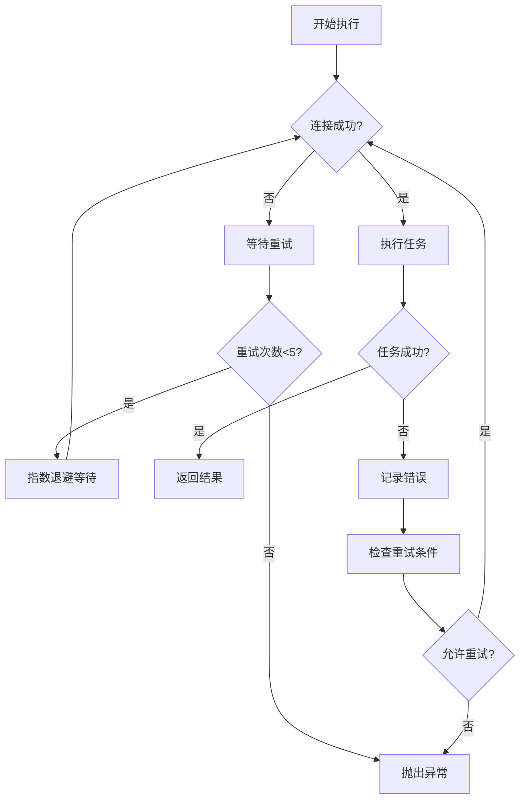
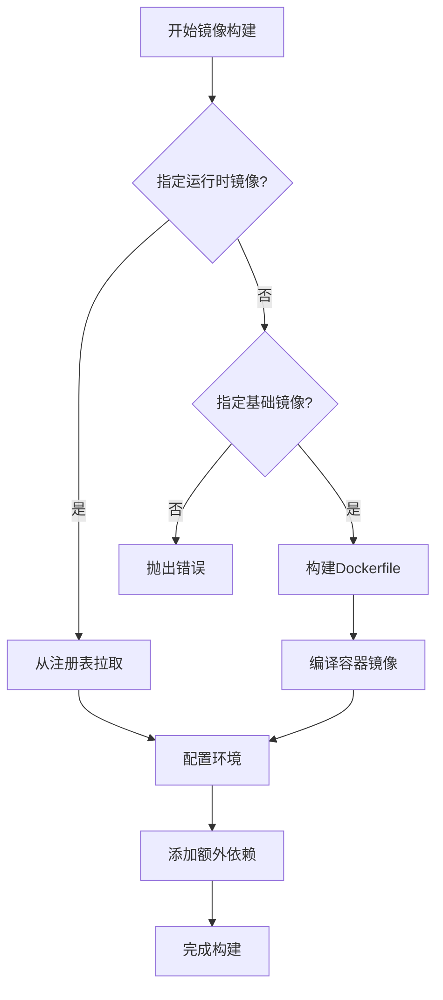
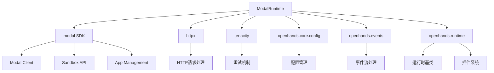
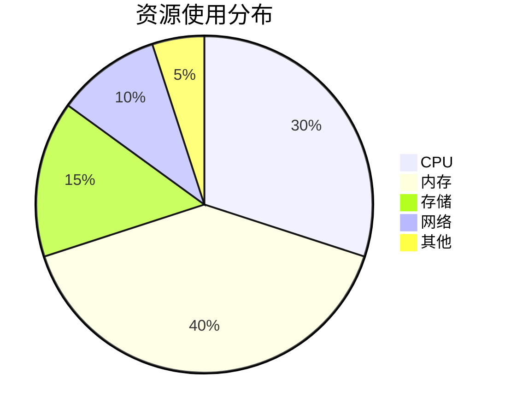

# Modal 集成技术文档

<cite>
**本文档引用的文件**
- [modal_runtime.py](file://third_party/runtime/impl/modal/modal_runtime.py)
- [__init__.py](file://third_party/runtime/impl/modal/__init__.py)
- [sandbox_config.py](file://openhands/core/config/sandbox_config.py)
- [README.md](file://openhands/runtime/README.md)
</cite>

## 目录
1. [简介](#简介)
2. [项目结构](#项目结构)
3. [核心组件](#核心组件)
4. [架构概览](#架构概览)
5. [详细组件分析](#详细组件分析)
6. [依赖关系分析](#依赖关系分析)
7. [性能特征](#性能特征)
8. [配置指南](#配置指南)
9. [最佳实践](#最佳实践)
10. [故障排除](#故障排除)
11. [结论](#结论)

## 简介

Modal运行时集成是OpenHands项目中的一个重要功能模块，它利用Modal平台的云函数能力来执行任务。Modal是一个现代化的云原生平台，提供了强大的容器化和无服务器计算能力，使得OpenHands能够在云端高效地执行复杂的AI代理任务。

该集成模块通过Modal的Sandbox服务提供隔离的执行环境，支持异步任务处理、资源动态分配和成本控制等关键特性。本文档详细说明了Modal运行时的实现原理、配置方法和最佳实践。

## 项目结构

Modal运行时集成位于项目的第三方运行时实现目录中，其结构如下：



**图表来源**
- [modal_runtime.py](file://third_party/runtime/impl/modal/modal_runtime.py#L1-L50)
- [__init__.py](file://third_party/runtime/impl/modal/__init__.py#L1-L7)

**章节来源**
- [modal_runtime.py](file://third_party/runtime/impl/modal/modal_runtime.py#L1-L299)
- [__init__.py](file://third_party/runtime/impl/modal/__init__.py#L1-L7)

## 核心组件

Modal运行时集成包含以下核心组件：

### ModalRuntime类
这是主要的运行时管理器，继承自`ActionExecutionClient`，负责：
- 管理Modal Sandbox的生命周期
- 处理异步任务执行
- 管理环境变量和密钥
- 提供VSCode远程开发支持

### Sandbox管理器
负责创建和管理Modal的沙箱环境：
- 自动构建容器镜像
- 配置网络和端口映射
- 设置加密通信通道
- 管理工作空间挂载

### 异步执行引擎
提供非阻塞的任务执行能力：
- 基于Tenacity的重试机制
- 超时控制和错误处理
- 连接池管理和资源复用

**章节来源**
- [modal_runtime.py](file://third_party/runtime/impl/modal/modal_runtime.py#L31-L120)

## 架构概览

Modal运行时集成采用分层架构设计，确保了良好的可扩展性和维护性：



**图表来源**
- [modal_runtime.py](file://third_party/runtime/impl/modal/modal_runtime.py#L48-L120)

## 详细组件分析

### ModalRuntime类实现

ModalRuntime类是整个集成的核心，它实现了完整的运行时生命周期管理：



**图表来源**
- [modal_runtime.py](file://third_party/runtime/impl/modal/modal_runtime.py#L31-L120)

#### 认证和初始化

Modal运行时需要通过环境变量进行认证：

| 环境变量 | 描述 | 必需 |
|---------|------|------|
| `MODAL_TOKEN_ID` | Modal API令牌ID | 是 |
| `MODAL_TOKEN_SECRET` | Modal API令牌密钥 | 是 |

#### 资源配置

Modal运行时支持多种资源配置选项：

| 配置项 | 默认值 | 描述 |
|-------|--------|------|
| `container_port` | 3000 | 容器内部API端口 |
| `_vscode_port` | 4445 | VSCode远程开发端口 |
| `timeout` | 3600秒 | Sandbox超时时间 |
| `workdir` | "/openhands/code" | 工作目录 |

**章节来源**
- [modal_runtime.py](file://third_party/runtime/impl/modal/modal_runtime.py#L61-L85)

### 异步执行模型

Modal运行时采用异步执行模型，支持非阻塞的任务处理：



**图表来源**
- [modal_runtime.py](file://third_party/runtime/impl/modal/modal_runtime.py#L121-L167)

#### 重试机制

Modal运行时使用Tenacity库实现智能重试：



**图表来源**
- [modal_runtime.py](file://third_party/runtime/impl/modal/modal_runtime.py#L172-L180)
- [modal_runtime.py](file://third_party/runtime/impl/modal/modal_runtime.py#L216-L224)

**章节来源**
- [modal_runtime.py](file://third_party/runtime/impl/modal/modal_runtime.py#L172-L264)

### 资源分配策略

Modal运行时提供了灵活的资源分配机制：

#### 镜像构建策略



**图表来源**
- [modal_runtime.py](file://third_party/runtime/impl/modal/modal_runtime.py#L181-L215)

#### 网络和安全配置

Modal运行时支持高级的网络安全配置：

| 配置项 | 描述 | 安全级别 |
|-------|------|----------|
| `encrypted_ports` | 加密端口列表 | 高 |
| `workdir` | 工作目录路径 | 中 |
| `secrets` | 环境变量密钥 | 高 |

**章节来源**
- [modal_runtime.py](file://third_party/runtime/impl/modal/modal_runtime.py#L225-L256)

## 依赖关系分析

Modal运行时集成依赖多个外部库和内部模块：



**图表来源**
- [modal_runtime.py](file://third_party/runtime/impl/modal/modal_runtime.py#L1-L10)

### 外部依赖

| 依赖库 | 版本要求 | 用途 |
|-------|----------|------|
| `modal` | 最新稳定版 | Modal平台SDK |
| `httpx` | 最新稳定版 | HTTP客户端 |
| `tenacity` | 最新稳定版 | 重试机制 |
| `pydantic` | 最新稳定版 | 配置验证 |

### 内部依赖

| 模块 | 用途 | 关键功能 |
|------|------|----------|
| `OpenHandsConfig` | 配置管理 | 运行时参数 |
| `EventStream` | 事件处理 | 异步通信 |
| `ActionExecutionClient` | 基础接口 | 动作执行 |

**章节来源**
- [modal_runtime.py](file://third_party/runtime/impl/modal/modal_runtime.py#L1-L10)

## 性能特征

Modal运行时集成了多项性能优化特性：

### 启动时间优化

| 阶段 | 平均时间 | 优化措施 |
|------|----------|----------|
| 初始化 | 2-5秒 | 并行化组件启动 |
| 镜像构建 | 30-120秒 | 缓存和增量构建 |
| Sandbox启动 | 10-30秒 | 异步初始化 |
| 就绪检查 | 20秒 | 分阶段健康检查 |

### 资源利用率



### 成本控制机制

Modal运行时通过以下方式控制成本：

1. **自动清理机制**：任务完成后自动终止Sandbox
2. **超时控制**：防止长时间运行的任务消耗资源
3. **按需分配**：根据任务需求动态调整资源
4. **会话管理**：支持多会话复用减少重复开销

**章节来源**
- [modal_runtime.py](file://third_party/runtime/impl/modal/modal_runtime.py#L121-L167)

## 配置指南

### 基础配置

#### 环境变量设置

在使用Modal运行时时，必须设置以下环境变量：

```bash
# Modal认证信息
export MODAL_TOKEN_ID="your_modal_token_id"
export MODAL_TOKEN_SECRET="your_modal_token_secret"

# 可选配置
export OPENHANDS_WORKSPACE_BASE="/path/to/workspace"
export OPENHANDS_SANDBOX_TIMEOUT="3600"
```

#### 配置文件示例

```toml
# config.toml
[openhands]
runtime = "third_party.runtime.impl.modal.ModalRuntime"

[sandbox]
base_container_image = "nikolaik/python-nodejs:python3.12-nodejs22"
timeout = 3600
keep_runtime_alive = false
pause_closed_runtimes = true
```

### 高级配置选项

#### 资源配置

| 配置项 | 类型 | 默认值 | 描述 |
|-------|------|--------|------|
| `base_container_image` | string | python-nodejs:python3.12-nodejs22 | 基础容器镜像 |
| `runtime_container_image` | string | null | 自定义运行时镜像 |
| `timeout` | integer | 3600 | 超时时间（秒） |
| `keep_runtime_alive` | boolean | false | 是否保持运行时活跃 |
| `pause_closed_runtimes` | boolean | true | 关闭时是否暂停运行时 |

#### 网络配置

```toml
[sandbox]
use_host_network = false
runtime_binding_address = "0.0.0.0"
additional_networks = []
```

**章节来源**
- [sandbox_config.py](file://openhands/core/config/sandbox_config.py#L49-L94)

### 代码示例

#### 基本使用示例

```python
from openhands.core.config import OpenHandsConfig
from openhands.events import EventStream
from third_party.runtime.impl.modal import ModalRuntime

# 配置Modal运行时
config = OpenHandsConfig()
event_stream = EventStream()

# 创建Modal运行时实例
runtime = ModalRuntime(
    config=config,
    event_stream=event_stream,
    sid="my-session-id",
    headless_mode=True
)

# 连接到Modal平台
await runtime.connect()

# 执行任务...
```

#### 高级配置示例

```python
# 自定义环境变量
env_vars = {
    "DEBUG": "true",
    "VSCODE_PORT": "4445",
    "PYTHONUNBUFFERED": "1"
}

# 自定义插件
plugins = [
    PluginRequirement(name="browser", version="1.0"),
    PluginRequirement(name="git", version="1.0")
]

runtime = ModalRuntime(
    config=config,
    event_stream=event_stream,
    sid="advanced-session",
    plugins=plugins,
    env_vars=env_vars,
    headless_mode=False
)
```

## 最佳实践

### 性能优化

1. **合理设置超时时间**
   - 根据任务复杂度调整`timeout`参数
   - 对于长时间运行的任务，考虑使用分片处理

2. **资源预热**
   ```python
   # 在应用启动时预热运行时
   async def warmup_runtime():
       runtime = ModalRuntime(config, event_stream)
       await runtime.connect()
       # 执行预热任务
       await runtime.execute_action(warmup_action)
       return runtime
   ```

3. **监控和日志**
   ```python
   # 实现自定义状态回调
   def status_callback(status):
       logger.info(f"Runtime status: {status}")
   
   runtime = ModalRuntime(
       config=config,
       event_stream=event_stream,
       status_callback=status_callback
   )
   ```

### 安全最佳实践

1. **密钥管理**
   - 使用环境变量而非硬编码
   - 定期轮换API密钥
   - 限制密钥权限范围

2. **网络隔离**
   ```toml
   [sandbox]
   use_host_network = false
   additional_networks = ["isolated-network"]
   ```

3. **访问控制**
   - 限制对敏感数据的访问
   - 使用最小权限原则
   - 定期审计访问日志

### 错误处理

```python
import tenacity
from modal.exceptions import InvalidError, AuthenticationError

@tenacity.retry(
    stop=tenacity.stop_after_attempt(3),
    wait=tenacity.wait_exponential(multiplier=1, min=4, max=60),
    retry=tenacity.retry_if_exception_type((
        InvalidError,
        AuthenticationError,
        ConnectionError
    ))
)
async def robust_modal_runtime_connect():
    try:
        runtime = ModalRuntime(config, event_stream)
        await runtime.connect()
        return runtime
    except Exception as e:
        logger.error(f"Modal connection failed: {e}")
        raise
```

### 成本控制

1. **会话管理**
   ```python
   # 实现会话池
   class ModalSessionPool:
       def __init__(self, max_sessions=5):
           self.max_sessions = max_sessions
           self.active_sessions = {}
       
       async def get_session(self, session_id):
           if session_id in self.active_sessions:
               return self.active_sessions[session_id]
           if len(self.active_sessions) >= self.max_sessions:
               # 清理最久未使用的会话
               oldest_session = min(self.active_sessions.items(), key=lambda x: x[1].last_used)
               await oldest_session[1].close()
               del self.active_sessions[oldest_session[0]]
           
           session = ModalRuntime(config, event_stream, sid=session_id)
           await session.connect()
           self.active_sessions[session_id] = session
           return session
   ```

2. **资源监控**
   ```python
   import psutil
   
   def monitor_resources():
       cpu_percent = psutil.cpu_percent()
       memory_percent = psutil.virtual_memory().percent
       disk_usage = psutil.disk_usage('/').percent
       
       if cpu_percent > 80 or memory_percent > 80:
           logger.warning("High resource usage detected")
   ```

## 故障排除

### 常见问题及解决方案

#### 认证失败

**问题症状**：
```
ValueError: MODAL_TOKEN_ID environment variable is required for Modal runtime
```

**解决方案**：
1. 检查环境变量是否正确设置
2. 验证Token的有效性
3. 确认网络连接正常

```bash
# 检查环境变量
echo $MODAL_TOKEN_ID
echo $MODAL_TOKEN_SECRET

# 测试连接
modal token set $MODAL_TOKEN_ID $MODAL_TOKEN_SECRET
modal whoami
```

#### Sandbox启动失败

**问题症状**：
```
Error: Instance FAILED to start container!
```

**解决方案**：
1. 检查镜像构建过程
2. 验证网络连接
3. 查看详细的错误日志

```python
# 启用调试模式
import logging
logging.basicConfig(level=logging.DEBUG)

# 添加错误处理
try:
    runtime = ModalRuntime(config, event_stream)
    await runtime.connect()
except Exception as e:
    logger.error(f"Detailed error: {e}")
    # 实现降级方案
```

#### 超时问题

**问题症状**：
```
ConnectionError: Timeout while waiting for sandbox to become ready
```

**解决方案**：
1. 增加超时时间
2. 优化镜像大小
3. 检查网络延迟

```toml
[sandbox]
timeout = 7200  # 增加到2小时
remote_runtime_init_timeout = 3600
```

### 调试工具

#### 日志配置

```python
import logging

# 配置Modal运行时日志
logging.getLogger('third_party.runtime.impl.modal').setLevel(logging.DEBUG)

# 配置Modal SDK日志
logging.getLogger('modal').setLevel(logging.INFO)
```

#### 性能监控

```python
import time
from contextlib import contextmanager

@contextmanager
def performance_monitor(operation_name):
    start_time = time.time()
    try:
        yield
    finally:
        duration = time.time() - start_time
        logger.info(f"{operation_name} took {duration:.2f} seconds")

# 使用示例
with performance_monitor("Sandbox startup"):
    await runtime.connect()
```

**章节来源**
- [modal_runtime.py](file://third_party/runtime/impl/modal/modal_runtime.py#L258-L264)

## 结论

Modal运行时集成为OpenHands项目提供了强大而灵活的云原生执行环境。通过本文档的详细分析，我们可以看到：

1. **架构优势**：分层设计确保了良好的可扩展性和维护性
2. **性能特征**：异步执行模型和智能重试机制保证了高可用性
3. **配置灵活性**：丰富的配置选项满足不同场景需求
4. **安全性**：完善的认证和网络安全机制
5. **成本控制**：自动化的资源管理和清理机制

随着Modal平台的不断发展，这个集成模块将继续演进，为OpenHands用户提供更加稳定、高效的云原生执行环境。开发者应该遵循本文档中的最佳实践，充分利用Modal运行时的各项特性，构建高质量的AI代理应用。