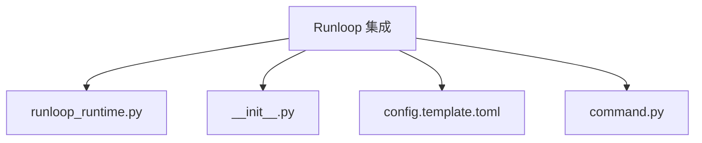
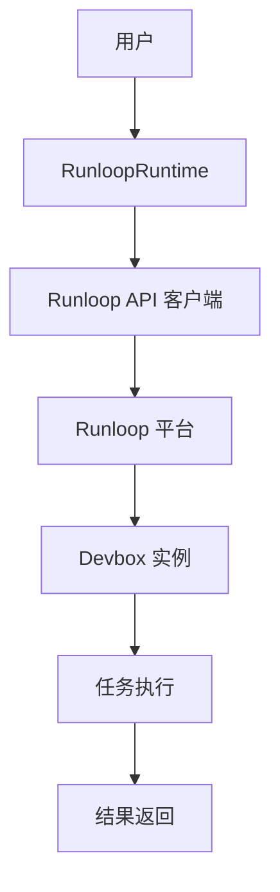
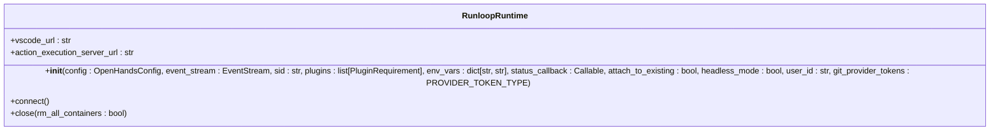
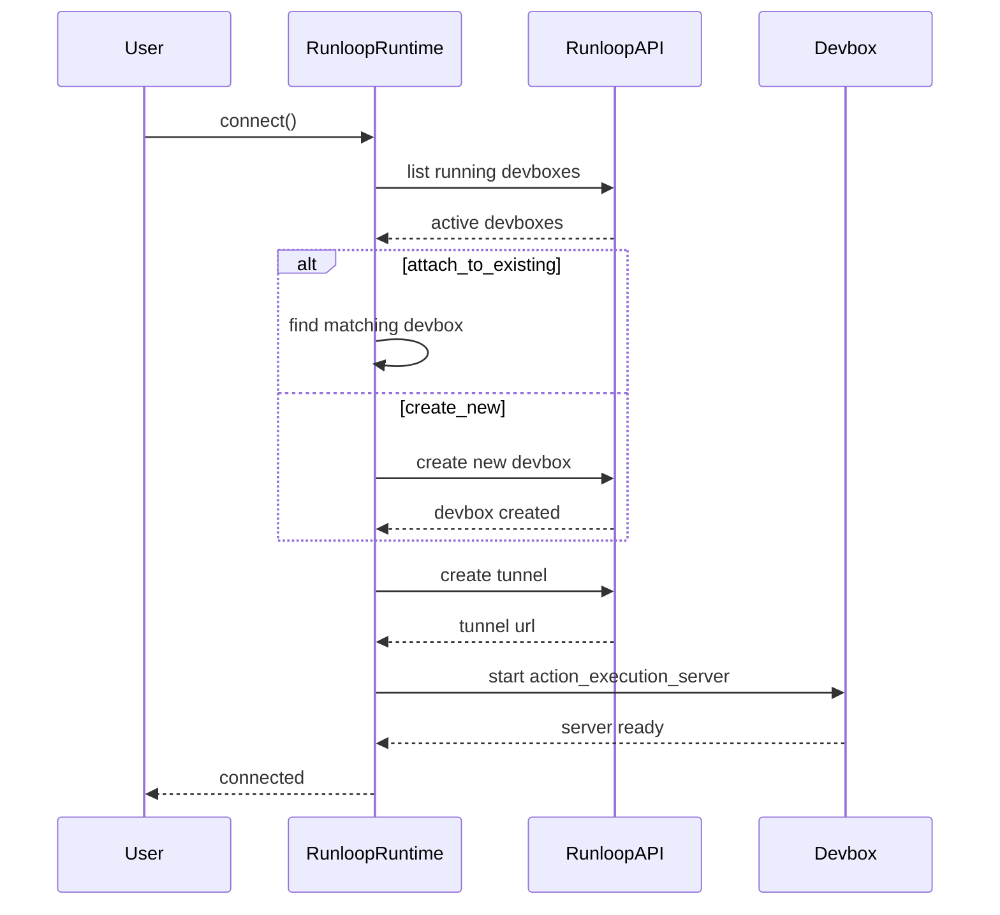
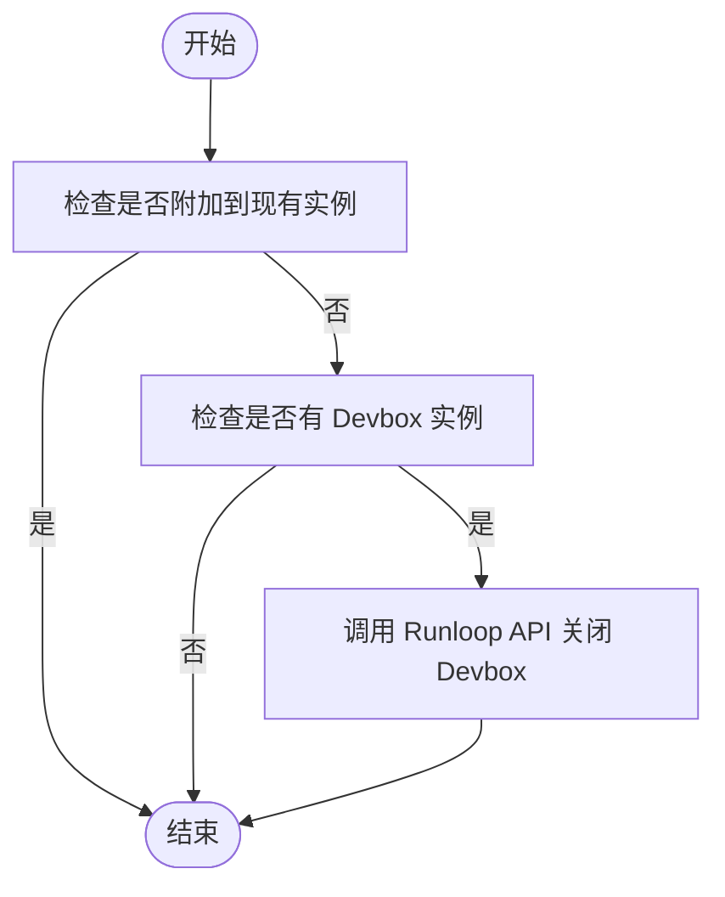
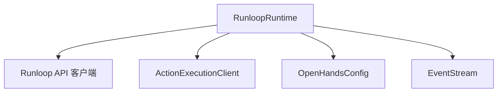

# Runloop 集成

<cite>
**本文档引用的文件**   
- [runloop_runtime.py](file://third_party/runtime/impl/runloop/runloop_runtime.py)
- [__init__.py](file://third_party/runtime/impl/runloop/__init__.py)
- [config.template.toml](file://config.template.toml)
- [command.py](file://openhands/runtime/utils/command.py)
</cite>

## 目录
1. [简介](#简介)
2. [项目结构](#项目结构)
3. [核心组件](#核心组件)
4. [架构概述](#架构概述)
5. [详细组件分析](#详细组件分析)
6. [依赖分析](#依赖分析)
7. [性能考虑](#性能考虑)
8. [故障排除指南](#故障排除指南)
9. [结论](#结论)
10. [附录](#附录)（如有必要）

## 简介
Runloop 集成文档详细介绍了如何将 OpenHands 框架与 Runloop 平台进行集成。该集成利用 Runloop Devbox 作为运行时环境，为 AI 代理任务提供了一个快速、安全且可扩展的沙箱环境。通过 Runloop API，用户可以提交任务、监控状态并获取执行结果。本文档涵盖了认证方法、API 速率限制处理和错误重试策略，帮助用户配置和使用 Runloop 集成。

## 项目结构
Runloop 集成主要位于 `third_party/runtime/impl/runloop/` 目录下，包含核心的运行时实现和初始化脚本。配置文件 `config.template.toml` 提供了运行时配置的模板，而 `command.py` 文件则定义了启动命令的生成逻辑。



**图源**
- [runloop_runtime.py](file://third_party/runtime/impl/runloop/runloop_runtime.py)
- [__init__.py](file://third_party/runtime/impl/runloop/__init__.py)
- [config.template.toml](file://config.template.toml)
- [command.py](file://openhands/runtime/utils/command.py)

**节源**
- [runloop_runtime.py](file://third_party/runtime/impl/runloop/runloop_runtime.py)
- [__init__.py](file://third_party/runtime/impl/runloop/__init__.py)

## 核心组件
Runloop 集成的核心组件是 `RunloopRuntime` 类，它继承自 `ActionExecutionClient`，并利用 Runloop API 客户端与 Runloop Devbox 进行交互。该类负责创建和管理 Devbox 实例，以及处理任务的提交和结果获取。

**节源**
- [runloop_runtime.py](file://third_party/runtime/impl/runloop/runloop_runtime.py)

## 架构概述
Runloop 集成的架构包括以下几个关键部分：
- **Runloop API 客户端**：用于与 Runloop 平台进行通信。
- **Devbox 管理**：创建、启动和关闭 Devbox 实例。
- **任务执行**：在 Devbox 中执行 AI 代理任务。
- **状态监控**：监控任务的执行状态和日志。



**图源**
- [runloop_runtime.py](file://third_party/runtime/impl/runloop/runloop_runtime.py)

## 详细组件分析

### RunloopRuntime 类分析
`RunloopRuntime` 类是 Runloop 集成的核心，负责与 Runloop 平台的 API 进行交互。以下是其主要方法和功能的分析。

#### 初始化
`__init__` 方法初始化 `RunloopRuntime` 实例，读取环境变量中的 `RUNLOOP_API_KEY`，并创建 Runloop API 客户端。



**图源**
- [runloop_runtime.py](file://third_party/runtime/impl/runloop/runloop_runtime.py#L31-L68)

#### 连接
`connect` 方法负责连接到 Runloop 平台，创建或附加到现有的 Devbox 实例，并启动任务执行服务器。



**图源**
- [runloop_runtime.py](file://third_party/runtime/impl/runloop/runloop_runtime.py#L129-L165)

#### 关闭
`close` 方法负责关闭 Devbox 实例，释放资源。



**图源**
- [runloop_runtime.py](file://third_party/runtime/impl/runloop/runloop_runtime.py#L174-L182)

### 配置和使用示例
为了使用 Runloop 集成，用户需要设置环境变量并配置运行时。

#### 环境变量
- `RUNLOOP_API_KEY`：Runloop API 密钥，用于认证。
- `RUNTIME`：设置为 `runloop`，指定使用 Runloop 运行时。

#### 配置文件
在 `config.template.toml` 中，可以配置以下参数：
- `workspace_base`：工作区基础路径。
- `max_iterations`：最大迭代次数。
- `workspace_mount_path_in_sandbox`：沙箱中的工作区挂载路径。

#### 使用示例
```bash
export RUNLOOP_API_KEY=<your-api-key>
export RUNTIME="runloop"
```

**节源**
- [runloop_runtime.py](file://third_party/runtime/impl/runloop/runloop_runtime.py)
- [__init__.py](file://third_party/runtime/impl/runloop/__init__.py)
- [config.template.toml](file://config.template.toml)

## 依赖分析
Runloop 集成依赖于以下几个关键组件：
- **Runloop API 客户端**：用于与 Runloop 平台进行通信。
- **ActionExecutionClient**：提供任务执行的基础功能。
- **OpenHandsConfig**：配置管理。
- **EventStream**：事件流处理。



**图源**
- [runloop_runtime.py](file://third_party/runtime/impl/runloop/runloop_runtime.py)

**节源**
- [runloop_runtime.py](file://third_party/runtime/impl/runloop/runloop_runtime.py)

## 性能考虑
Runloop 集成通过以下方式优化性能：
- **重试机制**：使用 `tenacity` 库实现重试机制，处理临时性错误。
- **缓存**：缓存 VSCode URL，减少重复请求。
- **异步连接**：使用异步方法连接到 Runloop 平台，提高响应速度。

## 故障排除指南
在使用 Runloop 集成时，可能会遇到以下常见问题：
- **认证失败**：确保 `RUNLOOP_API_KEY` 环境变量已正确设置。
- **连接超时**：检查网络连接，确保可以访问 Runloop 平台。
- **任务执行失败**：查看 Devbox 日志，定位问题原因。

**节源**
- [runloop_runtime.py](file://third_party/runtime/impl/runloop/runloop_runtime.py)

## 结论
Runloop 集成提供了一个强大且灵活的运行时环境，使 OpenHands 框架能够高效地执行 AI 代理任务。通过详细的配置和使用示例，用户可以轻松地将 Runloop 集成到自己的项目中，享受其带来的性能和安全性优势。

## 附录
### API 速率限制处理
Runloop API 实施了速率限制，以防止滥用。当请求超过限制时，API 会返回 429 状态码。客户端应实现重试机制，使用指数退避策略等待一段时间后重试。

### 错误重试策略
使用 `tenacity` 库实现错误重试策略，确保在临时性错误发生时能够自动重试。例如，`_wait_for_devbox` 方法使用 `tenacity.retry` 装饰器，最多重试 120 次，每次等待 1 秒。

**节源**
- [runloop_runtime.py](file://third_party/runtime/impl/runloop/runloop_runtime.py)