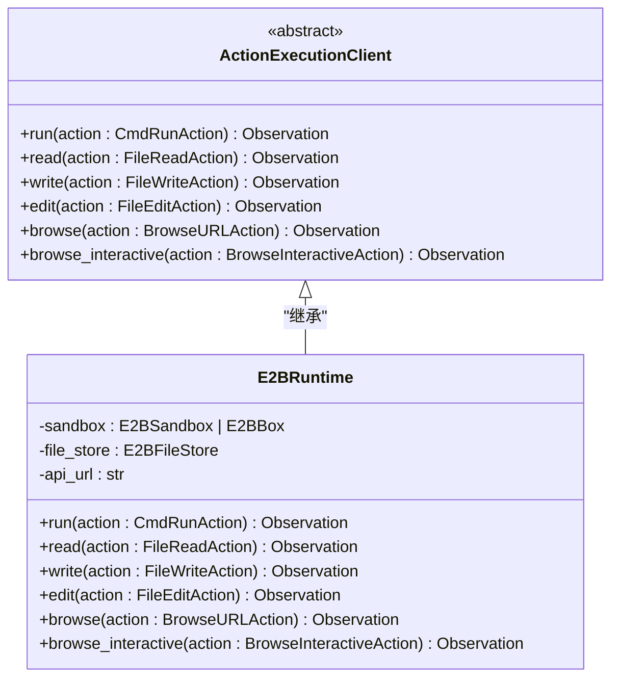
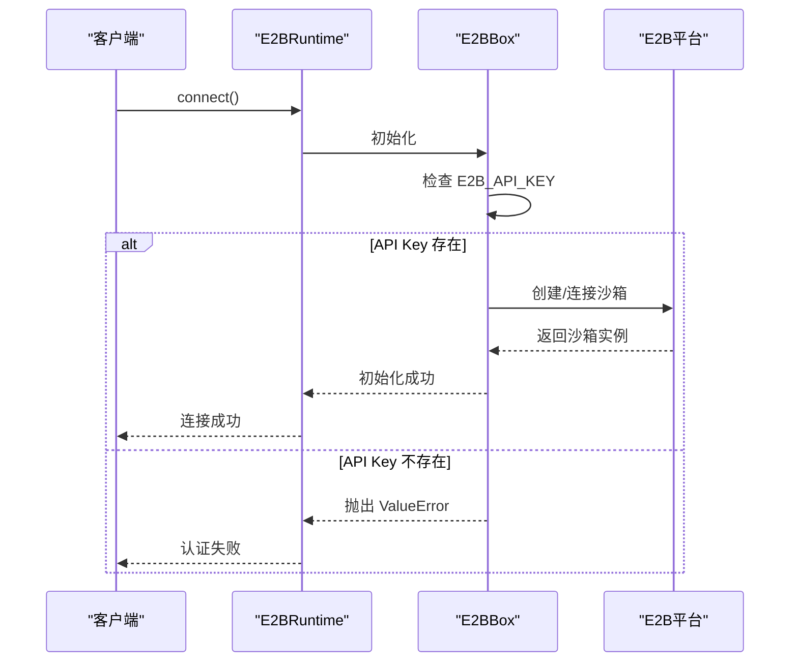
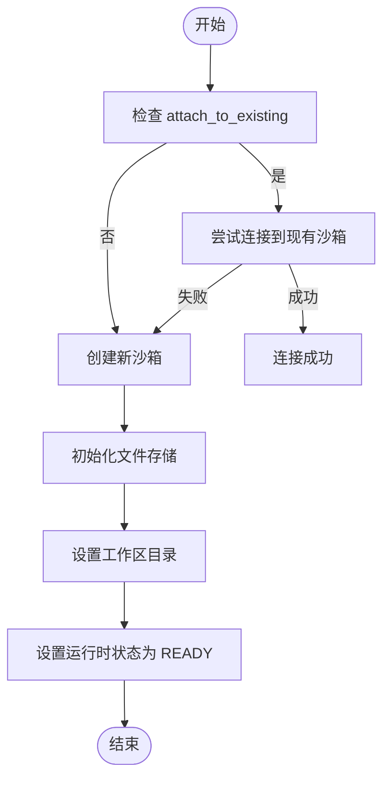
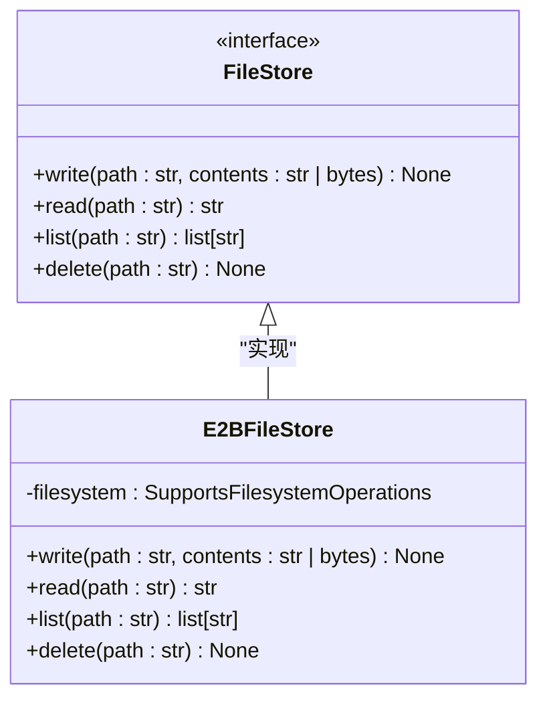
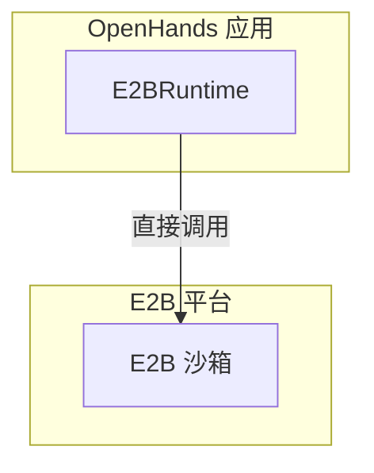
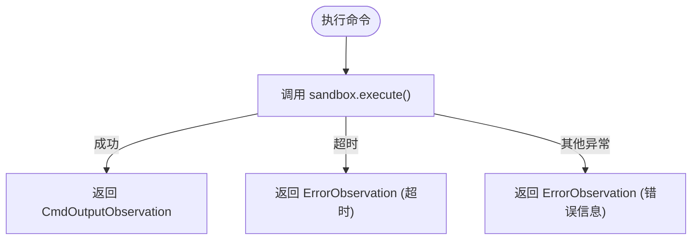
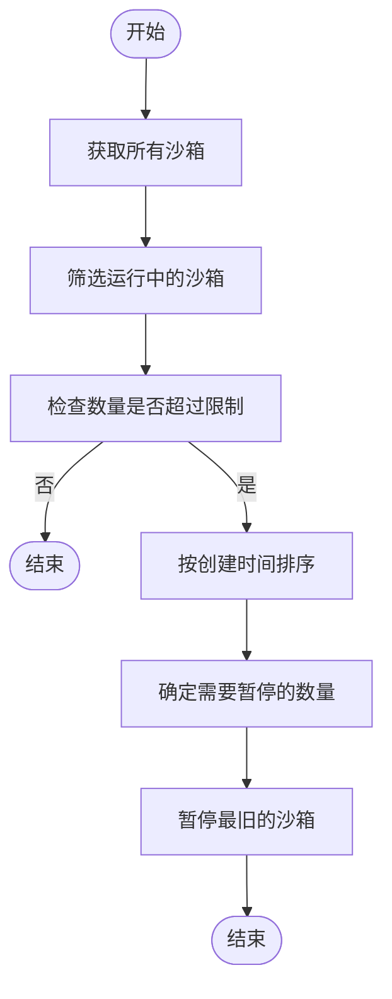

# e2b 集成

<cite>
**本文档中引用的文件**   
- [e2b_runtime.py](file://third_party/runtime/impl/e2b/e2b_runtime.py)
- [sandbox.py](file://third_party/runtime/impl/e2b/sandbox.py)
- [filestore.py](file://third_party/runtime/impl/e2b/filestore.py)
- [e2b.toml](file://third_party/containers/e2b-sandbox/e2b.toml)
- [config.py](file://openhands/app_server/config.py)
</cite>

## 目录
1. [简介](#简介)
2. [适配器模式实现](#适配器模式实现)
3. [认证机制](#认证机制)
4. [沙箱管理](#沙箱管理)
5. [文件存储](#文件存储)
6. [网络配置](#网络配置)
7. [错误处理策略](#错误处理策略)
8. [资源限制与性能优化](#资源限制与性能优化)
9. [代码示例](#代码示例)
10. [结论](#结论)

## 简介

e2b 集成提供了一个安全的云环境（沙箱），用于运行 AI 生成的代码和代理。该集成通过适配器模式将 e2b 平台的 API 封装为统一的运行时接口，使 OpenHands 能够无缝地与 e2b 沙箱进行交互。本技术文档详细解释了 e2b 运行时的实现细节，包括认证机制、沙箱生命周期管理、文件存储、网络配置、错误处理以及性能优化策略。

**Section sources**
- [e2b_runtime.py](file://third_party/runtime/impl/e2b/e2b_runtime.py#L1-L403)
- [sandbox.py](file://third_party/runtime/impl/e2b/sandbox.py#L1-L153)

## 适配器模式实现

e2b 运行时通过 `E2BRuntime` 类实现了适配器模式，将 e2b 平台的具体 API 调用适配到 OpenHands 的统一运行时接口。`E2BRuntime` 继承自 `ActionExecutionClient`，并重写了其抽象方法，如 `run`、`read`、`write` 等，以使用 e2b 沙箱的原生方法。



**Diagram sources **
- [e2b_runtime.py](file://third_party/runtime/impl/e2b/e2b_runtime.py#L39-L402)

**Section sources**
- [e2b_runtime.py](file://third_party/runtime/impl/e2b/e2b_runtime.py#L39-L402)

## 认证机制

e2b 运行时的认证机制依赖于环境变量 `E2B_API_KEY`。在初始化 `E2BBox` 或 `E2BSandbox` 实例时，代码会检查该环境变量是否存在。如果未设置，将抛出 `ValueError` 异常。



**Diagram sources **
- [sandbox.py](file://third_party/runtime/impl/e2b/sandbox.py#L27-L32)

**Section sources**
- [sandbox.py](file://third_party/runtime/impl/e2b/sandbox.py#L27-L32)

## 沙箱管理

e2b 运行时通过 `E2BRuntime` 类的 `connect` 和 `close` 方法管理沙箱的生命周期。`connect` 方法负责创建或连接到现有的 e2b 沙箱，而 `close` 方法则负责关闭沙箱。



**Diagram sources **
- [e2b_runtime.py](file://third_party/runtime/impl/e2b/e2b_runtime.py#L90-L177)

**Section sources**
- [e2b_runtime.py](file://third_party/runtime/impl/e2b/e2b_runtime.py#L90-L177)

## 文件存储

e2b 运行时通过 `E2BFileStore` 类实现持久化存储。`E2BFileStore` 实现了 `FileStore` 接口，并将文件操作委托给 e2b 沙箱的文件系统。



**Diagram sources **
- [filestore.py](file://third_party/runtime/impl/e2b/filestore.py#L13-L28)

**Section sources**
- [filestore.py](file://third_party/runtime/impl/e2b/filestore.py#L13-L28)

## 网络配置

e2b 运行时不使用独立的动作执行服务器，而是通过直接调用 e2b 沙箱的 API 来执行命令。因此，`action_execution_server_url` 属性返回一个虚拟的 URL `direct://e2b-sandbox`。



**Diagram sources **
- [e2b_runtime.py](file://third_party/runtime/impl/e2b/e2b_runtime.py#L128-L129)

**Section sources**
- [e2b_runtime.py](file://third_party/runtime/impl/e2b/e2b_runtime.py#L128-L129)

## 错误处理策略

e2b 运行时在各个方法中实现了详细的错误处理策略。例如，在执行命令时，会捕获超时异常和一般异常，并返回相应的 `ErrorObservation`。



**Diagram sources **
- [e2b_runtime.py](file://third_party/runtime/impl/e2b/e2b_runtime.py#L184-L193)

**Section sources**
- [e2b_runtime.py](file://third_party/runtime/impl/e2b/e2b_runtime.py#L184-L193)

## 资源限制与性能优化

e2b 运行时通过沙箱服务（SandboxService）管理沙箱的资源限制和性能优化。例如，`pause_old_sandboxes` 方法会暂停最旧的沙箱，以确保运行的沙箱数量不超过最大限制。



**Diagram sources **
- [sandbox_service.py](file://openhands/app_server/sandbox/sandbox_service.py#L80-L125)

**Section sources**
- [sandbox_service.py](file://openhands/app_server/sandbox/sandbox_service.py#L80-L125)

## 代码示例

以下代码示例展示了如何创建和管理 e2b 沙箱实例：

```python
# 创建 E2BRuntime 实例
runtime = E2BRuntime(
    config=config,
    event_stream=event_stream,
    llm_registry=llm_registry,
    sid="my-session",
    attach_to_existing=False
)

# 连接沙箱
await runtime.connect()

# 执行命令
observation = runtime.run(CmdRunAction(command="ls -la"))

# 读取文件
observation = runtime.read(FileReadAction(path="/workspace/file.txt"))

# 写入文件
observation = runtime.write(FileWriteAction(path="/workspace/new_file.txt", content="Hello, World!"))

# 关闭沙箱
await runtime.close()
```

**Section sources**
- [e2b_runtime.py](file://third_party/runtime/impl/e2b/e2b_runtime.py#L43-L57)

## 结论

e2b 集成通过适配器模式成功地将 e2b 平台的 API 封装为统一的运行时接口，为 OpenHands 提供了一个安全、隔离的代码执行环境。该集成实现了完整的认证机制、沙箱生命周期管理、文件存储、网络配置、错误处理和性能优化策略，确保了系统的稳定性和可靠性。