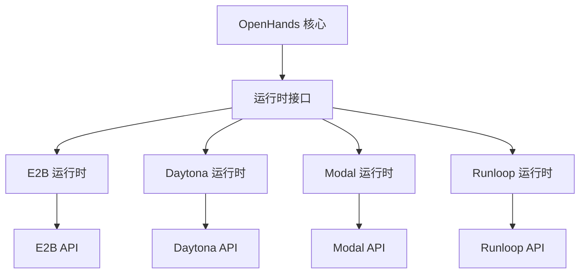
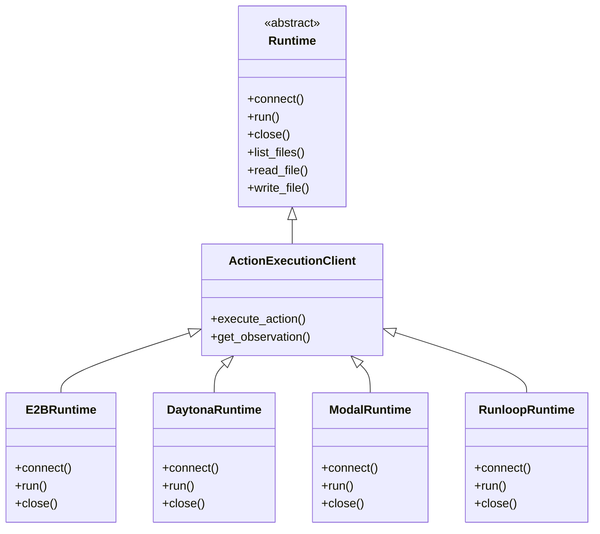

# 第三方集成

<cite>
**本文档中引用的文件**  
- [e2b_runtime.py](file://third_party/runtime/impl/e2b/e2b_runtime.py)
- [daytona_runtime.py](file://third_party/runtime/impl/daytona/daytona_runtime.py)
- [modal_runtime.py](file://third_party/runtime/impl/modal/modal_runtime.py)
- [runloop_runtime.py](file://third_party/runtime/impl/runloop/runloop_runtime.py)
- [__init__.py](file://third_party/__init__.py)
- [base.py](file://openhands/runtime/base.py)
- [action_execution_client.py](file://openhands/runtime/impl/action_execution/action_execution_client.py)
</cite>

## 目录
1. [简介](#简介)
2. [第三方运行时架构](#第三方运行时架构)
3. [适配器模式在统一接口中的应用](#适配器模式在统一接口中的应用)
4. [各平台集成实现](#各平台集成实现)
   1. [E2B 集成](#e2b-集成)
   2. [Daytona 集成](#daytona-集成)
   3. [Modal 集成](#modal-集成)
   4. [Runloop 集成](#runloop-集成)
5. [配置指南](#配置指南)
6. [使用示例](#使用示例)
7. [平台对比分析](#平台对比分析)
8. [性能与限制](#性能与限制)
9. [故障排除](#故障排除)

## 简介
本文档详细介绍了 OpenHands 框架中第三方运行时集成的实现，涵盖 E2B、Daytona、Modal 和 Runloop 等平台。文档提供了每个集成的技术说明、认证机制、API 调用方式、资源管理和成本控制策略。同时，解释了适配器模式如何在统一不同平台接口中发挥作用，并提供配置指南和使用示例，帮助用户在不同场景下选择合适的第三方运行时。

## 第三方运行时架构
OpenHands 的第三方运行时架构基于插件化设计，通过动态发现和加载机制支持多种第三方平台。运行时实现位于 `third_party/runtime/impl/` 目录下，每个平台都有独立的实现模块。



**图源**  
- [base.py](file://openhands/runtime/base.py)
- [__init__.py](file://third_party/__init__.py)

## 适配器模式在统一接口中的应用
适配器模式在 OpenHands 的第三方运行时集成中起着关键作用，它允许将不同平台的异构接口统一到一个标准化的运行时接口中。通过继承 `ActionExecutionClient` 类，每个第三方运行时实现都提供了统一的方法签名，如 `connect()`、`run()`、`close()` 等。

这种设计模式的主要优势包括：
- **接口一致性**：所有运行时提供相同的 API 接口，简化了上层代码的调用逻辑
- **可扩展性**：新增运行时只需实现标准接口，无需修改核心代码
- **可维护性**：平台特定的逻辑被隔离在各自的适配器中



**图源**  
- [base.py](file://openhands/runtime/base.py)
- [action_execution_client.py](file://openhands/runtime/impl/action_execution/action_execution_client.py)

## 各平台集成实现

### E2B 集成
E2B 运行时提供了一个安全的沙箱环境，通过 E2B API 进行交互。它直接在沙箱中执行命令，而不需要额外的动作执行服务器。

**认证机制**  
E2B 运行时通过环境变量 `E2B_API_KEY` 进行认证。

**API 调用方式**  
- 使用 `E2BSandbox` 类创建和管理沙箱实例
- 通过 `sandbox.execute()` 方法执行命令
- 使用 `E2BFileStore` 进行文件操作

**资源管理**  
- 沙箱 ID 缓存在类级别的字典中，支持会话重用
- 提供 `attach_to_existing` 参数控制是否连接到现有沙箱
- 自动创建工作空间目录并设置权限

**成本控制**  
- 通过 `attach_to_existing` 参数复用沙箱实例，减少创建成本
- 支持缓存沙箱 ID，避免重复创建

**限制条件**  
- 不支持交互式浏览（`browse_interactive`）
- 无法使用 `workspace_base` 配置，因为 E2B 提供独立的文件系统

**章节来源**  
- [e2b_runtime.py](file://third_party/runtime/impl/e2b/e2b_runtime.py)

### Daytona 集成
Daytona 运行时利用 Daytona 的云开发环境作为运行时环境，通过 Daytona API 进行管理。

**认证机制**  
Daytona 运行时需要以下环境变量：
- `DAYTONA_API_KEY`：API 密钥
- `DAYTONA_API_URL`：API URL（可选，默认为 `https://app.daytona.io/api`）
- `DAYTONA_TARGET`：目标区域（可选，默认为 `eu`）

**API 调用方式**  
- 使用 `Daytona` 客户端库进行 API 调用
- 通过 `create()` 方法创建沙箱
- 使用 `list()` 方法查找现有沙箱
- 通过 `process.execute_session_command()` 执行命令

**资源管理**  
- 使用标签 `OpenHands_SID` 标识沙箱实例
- 支持自动停止功能，可配置为 60 分钟后自动停止
- 提供 `DAYTONA_DELETE_ON_CLOSE` 环境变量控制关闭时是否删除沙箱

**成本控制**  
- 默认启用 60 分钟自动停止功能，防止资源浪费
- 支持手动控制沙箱的创建和删除
- 可通过环境变量禁用自动停止功能

**限制条件**  
- 不支持 `workspace_base` 配置
- 需要 Daytona API 密钥才能使用

**章节来源**  
- [daytona_runtime.py](file://third_party/runtime/impl/daytona/daytona_runtime.py)

### Modal 集成
Modal 运行时使用 Modal 云计算平台，通过 Modal API 创建和管理沙箱环境。

**认证机制**  
Modal 运行时需要以下环境变量：
- `MODAL_TOKEN_ID`：Modal API 令牌 ID
- `MODAL_TOKEN_SECRET`：Modal API 令牌密钥

**API 调用方式**  
- 使用 `modal.Client.from_credentials()` 创建客户端
- 通过 `modal.App.lookup()` 查找或创建应用
- 使用 `modal.Sandbox.create()` 创建沙箱
- 通过 `modal.Sandbox.from_id()` 连接到现有沙箱

**资源管理**  
- 沙箱 ID 存储在全局字典 `MODAL_RUNTIME_IDS` 中
- 支持连接到现有沙箱或创建新沙箱
- 使用加密端口确保通信安全

**成本控制**  
- 沙箱超时设置为 60 分钟
- 支持复用现有沙箱实例
- 关闭时自动终止沙箱（除非连接到现有实例）

**限制条件**  
- 不支持 `workspace_base` 配置
- 需要 Modal API 凭据才能使用

**章节来源**  
- [modal_runtime.py](file://third_party/runtime/impl/modal/modal_runtime.py)

### Runloop 集成
Runloop 运行时使用 Runloop AI 沙箱环境，通过 Runloop API 进行管理。

**认证机制**  
Runloop 运行时通过环境变量 `RUNLOOP_API_KEY` 进行认证。

**API 调用方式**  
- 使用 `Runloop` 客户端库进行 API 调用
- 通过 `devboxes.create()` 创建开发箱
- 使用 `devboxes.list()` 查找现有开发箱
- 通过 `devboxes.create_tunnel()` 创建隧道

**资源管理**  
- 开发箱名称使用会话 ID（sid）
- 元数据中包含容器名称，便于识别
- 大型资源请求（LARGE）确保足够的计算资源

**成本控制**  
- 支持连接到现有开发箱
- 提供明确的关闭机制，确保资源释放
- 使用预构建的 "openhands" 镜像，减少启动时间

**限制条件**  
- 需要 Runloop API 密钥才能使用
- 资源大小固定为 LARGE

**章节来源**  
- [runloop_runtime.py](file://third_party/runtime/impl/runloop/runloop_runtime.py)

## 配置指南
要使用第三方运行时，需要安装相应的依赖并设置环境变量。

### 安装依赖
```bash
pip install openhands-ai[third_party_runtimes]
```

### 环境变量配置
根据使用的平台，设置相应的环境变量：

**E2B**
```bash
export E2B_API_KEY=your_api_key
```

**Daytona**
```bash
export DAYTONA_API_KEY=your_api_key
export DAYTONA_API_URL=https://app.daytona.io/api  # 可选
export DAYTONA_TARGET=eu  # 可选
export DAYTONA_DISABLE_AUTO_STOP=false  # 可选
export DAYTONA_DELETE_ON_CLOSE=false  # 可选
```

**Modal**
```bash
export MODAL_TOKEN_ID=your_token_id
export MODAL_TOKEN_SECRET=your_token_secret
```

**Runloop**
```bash
export RUNLOOP_API_KEY=your_api_key
```

### 运行时选择
在配置文件中指定要使用的运行时：

```toml
runtime = "e2b"
# 或
runtime = "daytona"
# 或
runtime = "modal"
# 或
runtime = "runloop"
```

## 使用示例
以下示例展示了如何在不同场景下使用第三方运行时。

### 开发环境调试
```python
# 使用 Daytona 运行时进行开发调试
from openhands.runtime import get_runtime_cls

config = OpenHandsConfig()
runtime_cls = get_runtime_cls('daytona')
runtime = runtime_cls(
    config=config,
    event_stream=event_stream,
    sid='dev-session',
    attach_to_existing=True  # 复用现有沙箱
)
```

### 生产环境部署
```python
# 使用 E2B 运行时进行生产部署
runtime = E2BRuntime(
    config=config,
    event_stream=event_stream,
    sid='prod-session',
    attach_to_existing=False  # 创建新沙箱
)
```

### 成本敏感场景
```python
# 使用 Modal 运行时并复用沙箱以降低成本
runtime = ModalRuntime(
    config=config,
    event_stream=event_stream,
    sid='cost-sensitive-session',
    attach_to_existing=True  # 复用现有沙箱
)
```

### 快速原型开发
```python
# 使用 Runloop 运行时进行快速原型开发
runtime = RunloopRuntime(
    config=config,
    event_stream=event_stream,
    sid='prototype-session',
    attach_to_existing=False  # 确保干净的环境
)
```

## 平台对比分析
以下表格比较了各平台的主要特性：

| 特性 | E2B | Daytona | Modal | Runloop |
|------|-----|---------|-------|--------|
| **认证方式** | E2B_API_KEY | DAYTONA_API_KEY | MODAL_TOKEN_ID/SECRET | RUNLOOP_API_KEY |
| **沙箱复用** | 支持 | 支持 | 支持 | 支持 |
| **自动停止** | 不支持 | 支持（60分钟） | 不支持 | 不支持 |
| **资源大小** | 动态 | 动态 | 动态 | LARGE（固定） |
| **文件系统** | 独立 | 绑定挂载 | 加密端口 | 绑定挂载 |
| **交互式浏览** | 不支持 | 支持 | 支持 | 支持 |
| **VSCode 集成** | 支持 | 支持 | 支持 | 支持 |

## 性能与限制
### 性能特点
- **E2B**：启动速度快，适合短时任务
- **Daytona**：自动停止功能有助于成本控制
- **Modal**：强大的云基础设施，适合计算密集型任务
- **Runloop**：预构建镜像减少启动时间

### 限制条件
- **E2B**：不支持交互式浏览，无法使用 `workspace_base`
- **Daytona**：需要网络连接到 Daytona 服务
- **Modal**：需要 Modal 账户和 API 凭据
- **Runloop**：资源大小固定，无法调整

### 选择建议
- **开发调试**：推荐使用 Daytona，支持自动停止和沙箱复用
- **生产部署**：推荐使用 E2B，提供安全的隔离环境
- **成本敏感**：推荐使用 Modal，支持沙箱复用
- **快速原型**：推荐使用 Runloop，启动速度快

## 故障排除
### 常见问题
1. **认证失败**
   - 确保环境变量正确设置
   - 检查 API 密钥是否有效
   - 验证网络连接是否正常

2. **沙箱创建失败**
   - 检查配额是否已满
   - 验证资源是否可用
   - 查看平台状态页面

3. **连接超时**
   - 检查网络连接
   - 验证 API 端点是否可达
   - 增加超时设置

### 调试技巧
- 启用调试日志：`config.debug = True`
- 检查环境变量：`print(os.environ.get('YOUR_API_KEY'))`
- 验证运行时状态：`runtime.runtime_status`

**章节来源**  
- [e2b_runtime.py](file://third_party/runtime/impl/e2b/e2b_runtime.py)
- [daytona_runtime.py](file://third_party/runtime/impl/daytona/daytona_runtime.py)
- [modal_runtime.py](file://third_party/runtime/impl/modal/modal_runtime.py)
- [runloop_runtime.py](file://third_party/runtime/impl/runloop/runloop_runtime.py)