# 运行时环境

<cite>
**本文档中引用的文件**
- [openhands/runtime/__init__.py](file://openhands/runtime/__init__.py)
- [openhands/runtime/base.py](file://openhands/runtime/base.py)
- [openhands/runtime/impl/docker/docker_runtime.py](file://openhands/runtime/impl/docker/docker_runtime.py)
- [openhands/runtime/impl/local/local_runtime.py](file://openhands/runtime/impl/local/local_runtime.py)
- [openhands/runtime/impl/remote/remote_runtime.py](file://openhands/runtime/impl/remote/remote_runtime.py)
- [openhands/runtime/utils/runtime_build.py](file://openhands/runtime/utils/runtime_build.py)
- [openhands/runtime/action_execution_server.py](file://openhands/runtime/action_execution_server.py)
- [containers/app/Dockerfile](file://containers/app/Dockerfile)
- [containers/dev/Dockerfile](file://containers/dev/Dockerfile)
- [containers/runtime/README.md](file://containers/runtime/README.md)
- [openhands/runtime/plugins/__init__.py](file://openhands/runtime/plugins/__init__.py)
- [openhands/runtime/utils/command.py](file://openhands/runtime/utils/command.py)
</cite>

## 目录
1. [简介](#简介)
2. [运行时架构概览](#运行时架构概览)
3. [核心运行时类型](#核心运行时类型)
4. [安全隔离机制](#安全隔离机制)
5. [资源限制与性能监控](#资源限制与性能监控)
6. [运行时生命周期管理](#运行时生命周期管理)
7. [自定义运行时镜像](#自定义运行时镜像)
8. [运行时扩展机制](#运行时扩展机制)
9. [运行时选择指南](#运行时选择指南)
10. [故障排除](#故障排除)

## 简介

OpenHands的运行时环境是一个高度可扩展的沙箱系统，为AI代理提供了安全、隔离且功能丰富的执行环境。该系统支持多种运行时类型，从本地开发到生产级容器化部署，满足不同场景的需求。

运行时环境的核心设计理念是：
- **安全性**：通过多层隔离机制确保系统安全
- **可扩展性**：支持插件和第三方运行时扩展
- **一致性**：为所有运行时提供统一的接口
- **性能**：优化的资源管理和监控机制

## 运行时架构概览

OpenHands运行时系统采用分层架构设计，提供了灵活的抽象层次和强大的扩展能力。

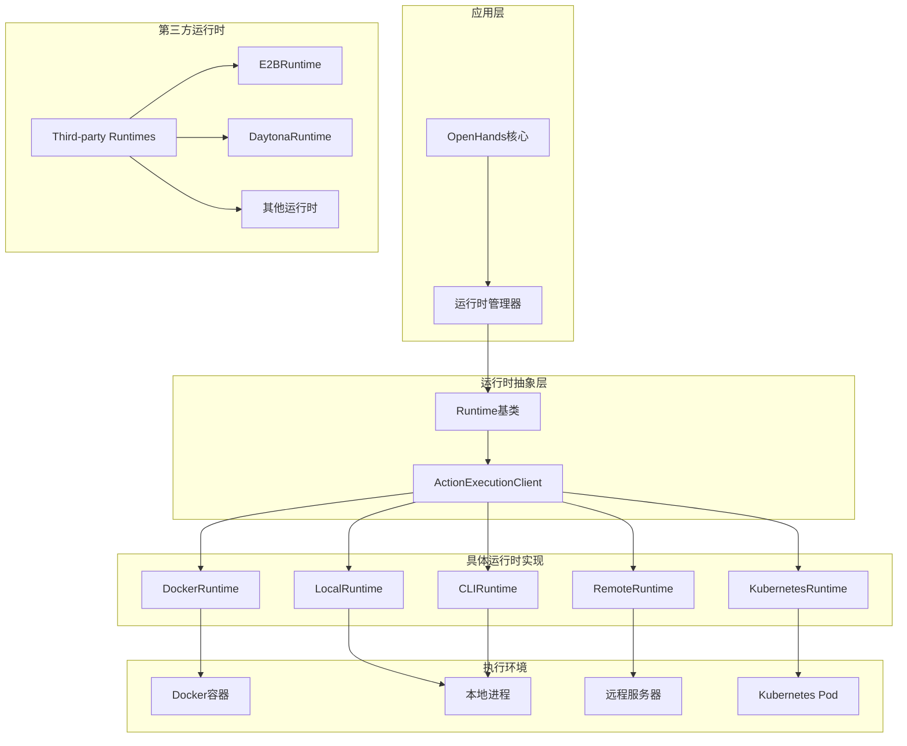

**图表来源**
- [openhands/runtime/__init__.py](file://openhands/runtime/__init__.py#L14-L21)
- [openhands/runtime/base.py](file://openhands/runtime/base.py#L91-L115)

**章节来源**
- [openhands/runtime/__init__.py](file://openhands/runtime/__init__.py#L1-L120)
- [openhands/runtime/base.py](file://openhands/runtime/base.py#L1-L800)

## 核心运行时类型

### Docker运行时 (DockerRuntime)

Docker运行时是最常用的生产环境运行时，提供完整的容器化隔离。

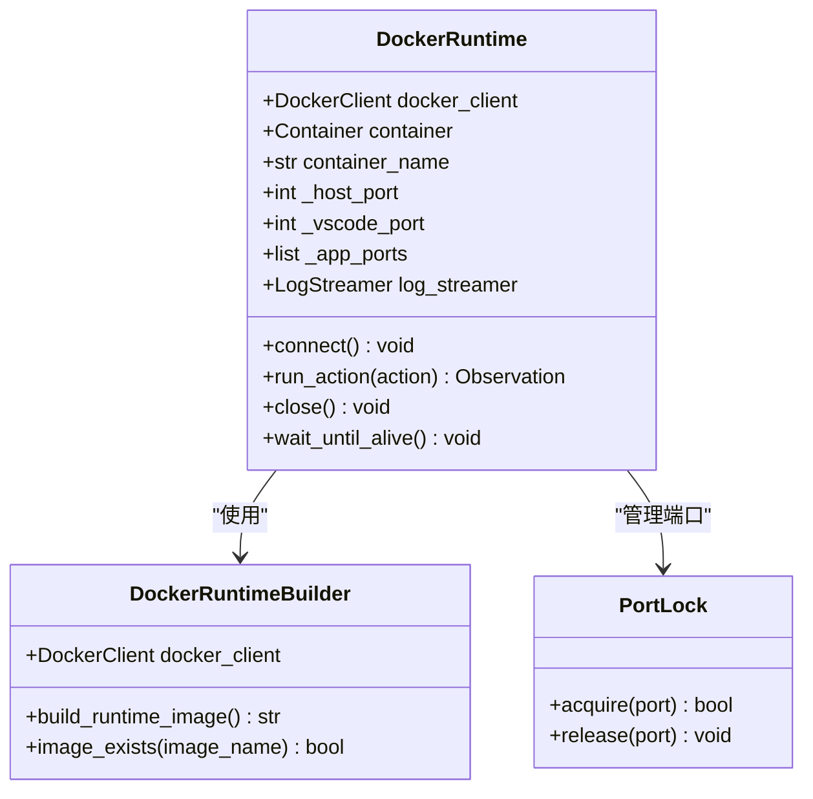

**图表来源**
- [openhands/runtime/impl/docker/docker_runtime.py](file://openhands/runtime/impl/docker/docker_runtime.py#L75-L200)

**主要特性**：
- 完整的容器化隔离
- 自动端口映射和管理
- 日志流式传输
- 支持热重启和状态恢复

### 本地运行时 (LocalRuntime)

本地运行时适用于开发和测试场景，直接在主机上运行而无需容器化。

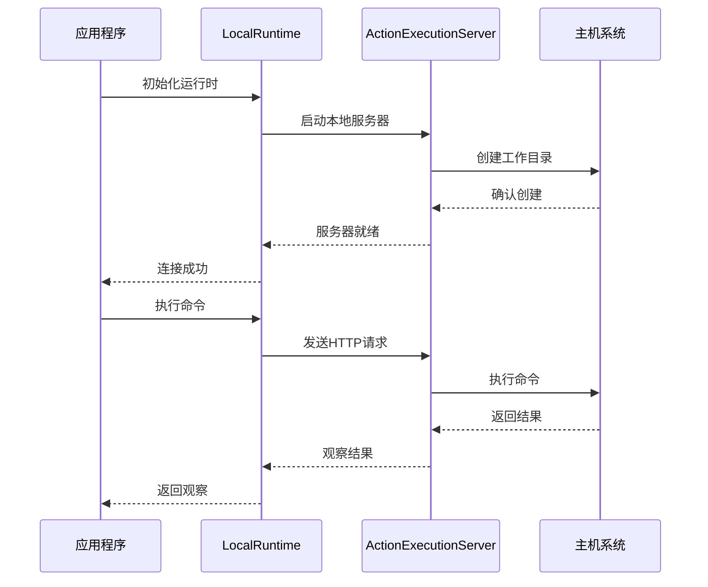

**图表来源**
- [openhands/runtime/impl/local/local_runtime.py](file://openhands/runtime/impl/local/local_runtime.py#L124-L200)

**主要特性**：
- 高性能，无容器开销
- 简化的调试体验
- 适合开发和CI/CD环境

### 远程运行时 (RemoteRuntime)

远程运行时允许在专用基础设施上执行，支持大规模部署。

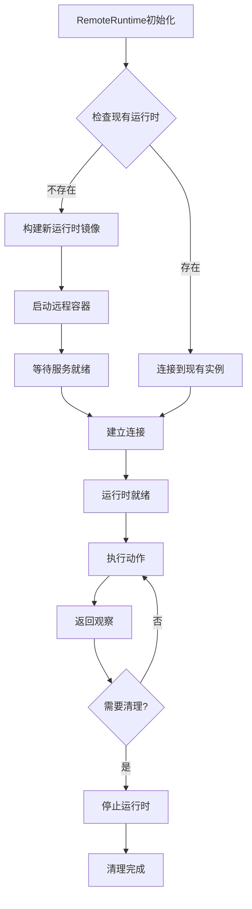

**图表来源**
- [openhands/runtime/impl/remote/remote_runtime.py](file://openhands/runtime/impl/remote/remote_runtime.py#L135-L200)

**主要特性**：
- 支持Sysbox和gVisor运行时类
- 可配置的资源因子
- 自动扩缩容支持

**章节来源**
- [openhands/runtime/impl/docker/docker_runtime.py](file://openhands/runtime/impl/docker/docker_runtime.py#L1-L200)
- [openhands/runtime/impl/local/local_runtime.py](file://openhands/runtime/impl/local/local_runtime.py#L1-L200)
- [openhands/runtime/impl/remote/remote_runtime.py](file://openhands/runtime/impl/remote/remote_runtime.py#L1-L200)

## 安全隔离机制

OpenHands运行时系统实现了多层次的安全隔离机制，确保系统安全和数据保护。

### 容器级隔离

Docker运行时使用以下安全特性：

| 安全机制 | 实现方式 | 配置参数 |
|---------|---------|---------|
| 用户命名空间 | `run_as_user` 和 `run_as_group` | `RUNTIME_UID`, `RUNTIME_USERNAME` |
| 文件系统隔离 | 只读根文件系统 | `readonly_root_fs` |
| 资源限制 | cgroups | `cpu_period`, `cpu_quota`, `mem_limit` |
| 网络隔离 | 独立网络命名空间 | `network_mode` |
| 设备访问控制 | 设备白名单 | `devices` |

### 进程级隔离

每个运行时都运行在独立的进程中，具有：
- 唯一的用户ID和组ID
- 限制的文件系统权限
- 独立的环境变量空间

### 网络安全

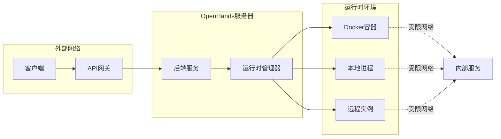

**图表来源**
- [openhands/runtime/impl/docker/docker_runtime.py](file://openhands/runtime/impl/docker/docker_runtime.py#L131-L140)

**章节来源**
- [openhands/runtime/impl/docker/docker_runtime.py](file://openhands/runtime/impl/docker/docker_runtime.py#L131-L140)

## 资源限制与性能监控

### 资源限制配置

OpenHands支持细粒度的资源限制配置：

| 资源类型 | 配置参数 | 默认值 | 说明 |
|---------|---------|--------|------|
| CPU周期 | `cpu_period` | 100000 | 每个周期100ms |
| CPU配额 | `cpu_quota` | 100000 | 可使用100ms |
| 内存限制 | `mem_limit` | 4G | 最大内存使用 |
| 交换内存 | `memswap_limit` | 0 | 禁用交换 |
| 文件描述符 | `ulimit` | 65536 | 最大文件句柄数 |

### 性能监控指标

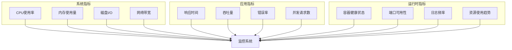

**图表来源**
- [openhands/runtime/utils/system_stats.py](file://openhands/runtime/utils/system_stats.py)

### 资源监控实现

运行时系统集成了实时监控机制：

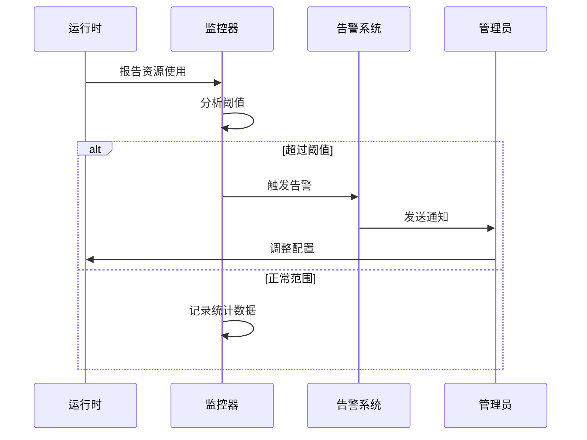

**章节来源**
- [tests/runtime/test_runtime_resource.py](file://tests/runtime/test_runtime_resource.py#L41-L115)

## 运行时生命周期管理

### 启动流程

运行时的启动遵循标准化的生命周期管理：

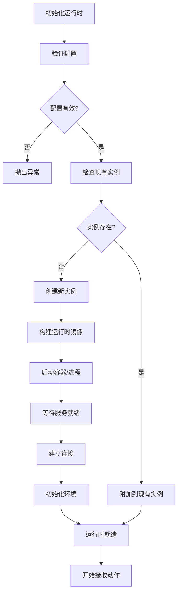

**图表来源**
- [openhands/runtime/base.py](file://openhands/runtime/base.py#L370-L390)

### 执行流程

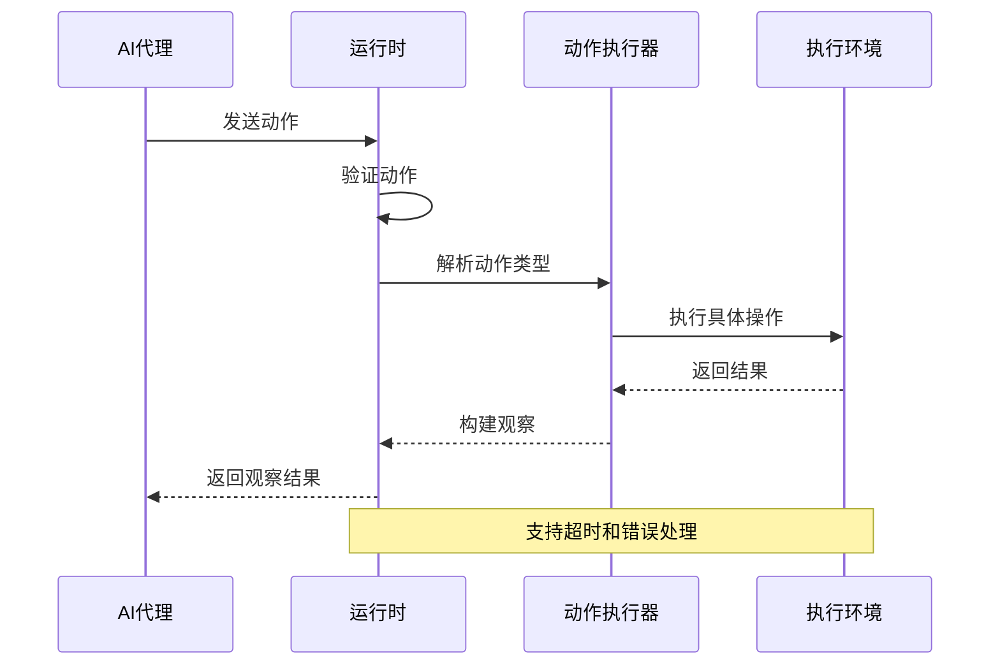

**图表来源**
- [openhands/runtime/base.py](file://openhands/runtime/base.py#L370-L410)

### 清理流程

运行时的清理过程确保资源的正确释放：

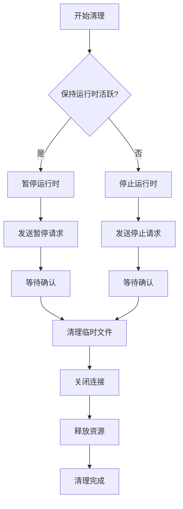

**图表来源**
- [openhands/runtime/impl/remote/remote_runtime.py](file://openhands/runtime/impl/remote/remote_runtime.py#L485-L516)

**章节来源**
- [openhands/runtime/base.py](file://openhands/runtime/base.py#L370-L410)
- [openhands/runtime/impl/remote/remote_runtime.py](file://openhands/runtime/impl/remote/remote_runtime.py#L485-L516)

## 自定义运行时镜像

### 镜像构建流程

OpenHands提供了自动化的运行时镜像构建系统：

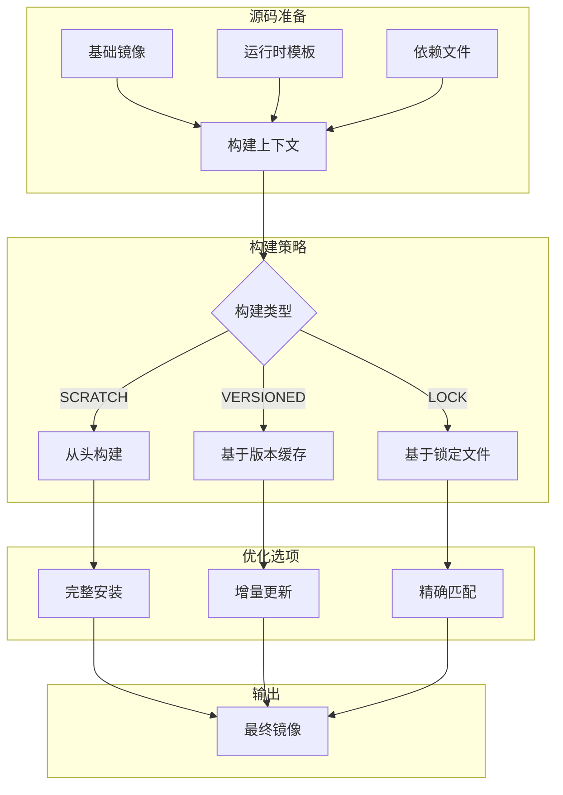

**图表来源**
- [openhands/runtime/utils/runtime_build.py](file://openhands/runtime/utils/runtime_build.py#L31-L62)

### 自定义镜像配置

创建自定义运行时镜像的步骤：

1. **选择基础镜像**：基于官方推荐的基础镜像
2. **配置构建参数**：设置额外依赖和环境变量
3. **启用浏览器支持**（可选）：安装Playwright和浏览器
4. **优化构建缓存**：利用分层缓存机制

### 镜像标签管理

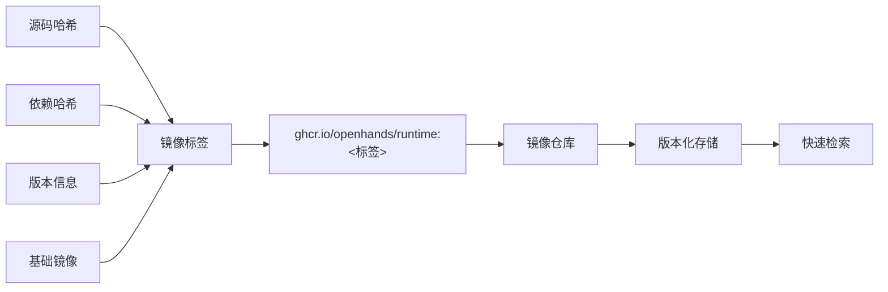

**图表来源**
- [openhands/runtime/utils/runtime_build.py](file://openhands/runtime/utils/runtime_build.py#L65-L105)

**章节来源**
- [openhands/runtime/utils/runtime_build.py](file://openhands/runtime/utils/runtime_build.py#L1-L200)
- [containers/runtime/README.md](file://containers/runtime/README.md#L1-L13)

## 运行时扩展机制

### 插件系统

OpenHands运行时支持插件扩展，提供模块化功能增强：

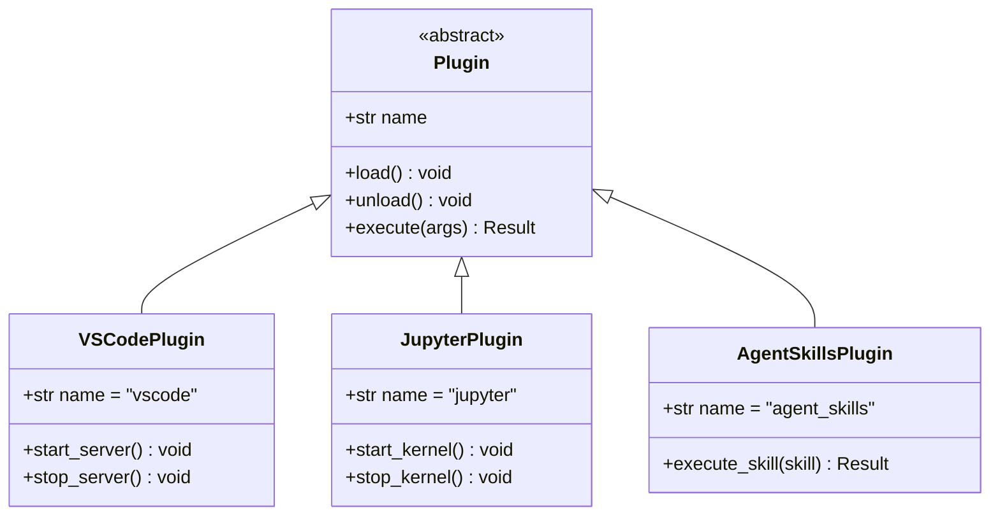

**图表来源**
- [openhands/runtime/plugins/__init__.py](file://openhands/runtime/plugins/__init__.py#L1-L26)

### 第三方运行时集成

系统支持第三方运行时的动态发现和加载：

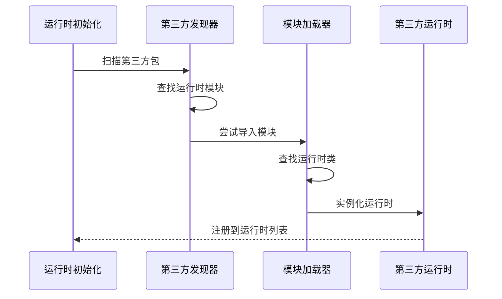

**图表来源**
- [openhands/runtime/__init__.py](file://openhands/runtime/__init__.py#L27-L80)

### 扩展点设计

| 扩展点类型 | 接口方法 | 用途 |
|-----------|---------|------|
| 运行时插件 | `Plugin.load()` | 加载额外功能 |
| 动作处理器 | `ActionExecutionClient.run_action()` | 自定义动作处理 |
| 环境配置 | `Runtime.setup_initial_env()` | 自定义环境设置 |
| 监控钩子 | `Runtime.set_runtime_status()` | 自定义状态报告 |

**章节来源**
- [openhands/runtime/plugins/__init__.py](file://openhands/runtime/plugins/__init__.py#L1-L26)
- [openhands/runtime/__init__.py](file://openhands/runtime/__init__.py#L27-L80)

## 运行时选择指南

### 场景分析矩阵

根据不同的使用场景，推荐相应的运行时类型：

| 使用场景 | 推荐运行时 | 理由 | 配置要点 |
|---------|-----------|------|---------|
| 开发测试 | LocalRuntime | 高性能，易调试 | 关闭安全限制 |
| 生产部署 | DockerRuntime | 完整隔离，可扩展 | 配置资源限制 |
| 大规模集群 | KubernetesRuntime | 弹性扩展，资源优化 | 配置调度策略 |
| 云原生环境 | RemoteRuntime | 专用基础设施 | 配置API密钥 |
| 特殊需求 | 自定义运行时 | 定制化功能 | 开发插件扩展 |

### 性能对比

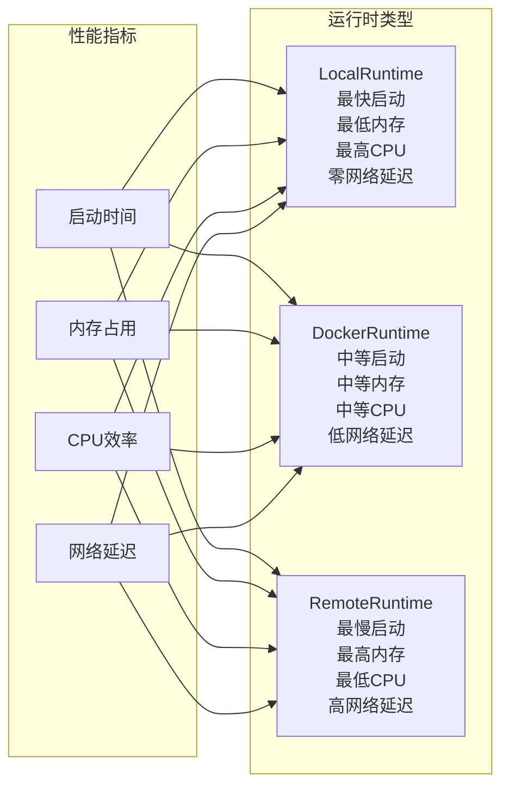

### 安全级别评估

| 安全级别 | 运行时类型 | 隔离强度 | 适用场景 |
|---------|-----------|---------|---------|
| 高 | DockerRuntime | 完整容器隔离 | 生产环境 |
| 中 | LocalRuntime | 进程级隔离 | 开发测试 |
| 低 | RemoteRuntime | 网络隔离 | 受控环境 |
| 最低 | KubernetesRuntime | 集群级隔离 | 大规模部署 |

## 故障排除

### 常见问题诊断

#### Docker运行时问题

**问题**：容器启动失败
**排查步骤**：
1. 检查Docker守护进程状态
2. 验证基础镜像可用性
3. 检查端口冲突
4. 查看容器日志

**解决方案**：
```bash
# 检查Docker状态
docker info

# 查看容器日志
docker logs <container_id>

# 清理未使用的资源
docker system prune -f
```

#### 远程运行时问题

**问题**：连接超时
**排查步骤**：
1. 检查网络连通性
2. 验证API密钥
3. 确认远程服务状态
4. 检查防火墙设置

**解决方案**：
```bash
# 测试连接
curl -H "X-API-Key: <api_key>" \
     https://<remote_runtime_url>/health

# 检查服务状态
curl -H "X-API-Key: <api_key>" \
     https://<remote_runtime_url>/status
```

### 性能调优建议

#### 资源优化

1. **内存管理**：
   - 设置合理的`mem_limit`
   - 配置`memswap_limit`为0
   - 监控内存使用趋势

2. **CPU优化**：
   - 调整`cpu_period`和`cpu_quota`
   - 使用CPU亲和性绑定
   - 避免过度分配CPU资源

3. **存储优化**：
   - 使用SSD存储
   - 配置适当的卷挂载
   - 定期清理临时文件

#### 监控配置

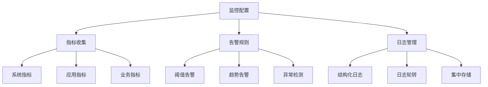

### 故障恢复策略

1. **自动恢复**：配置重试机制和健康检查
2. **手动干预**：提供紧急停止和重启接口
3. **数据备份**：定期备份重要数据和配置
4. **灾难恢复**：制定详细的恢复计划

**章节来源**
- [openhands/runtime/impl/docker/docker_runtime.py](file://openhands/runtime/impl/docker/docker_runtime.py#L57-L73)
- [openhands/runtime/impl/remote/remote_runtime.py](file://openhands/runtime/impl/remote/remote_runtime.py#L135-L200)

## 结论

OpenHands的运行时环境系统提供了强大而灵活的执行环境，支持从开发到生产的各种场景需求。通过模块化的架构设计、完善的安全机制和丰富的扩展能力，该系统能够满足现代AI应用对可靠性和可扩展性的要求。

关键优势包括：
- **安全性**：多层隔离机制确保系统安全
- **可扩展性**：插件和第三方运行时支持
- **性能**：优化的资源管理和监控
- **易用性**：统一的接口和自动化配置

随着AI技术的不断发展，OpenHands运行时环境将继续演进，为更复杂的应用场景提供支持。