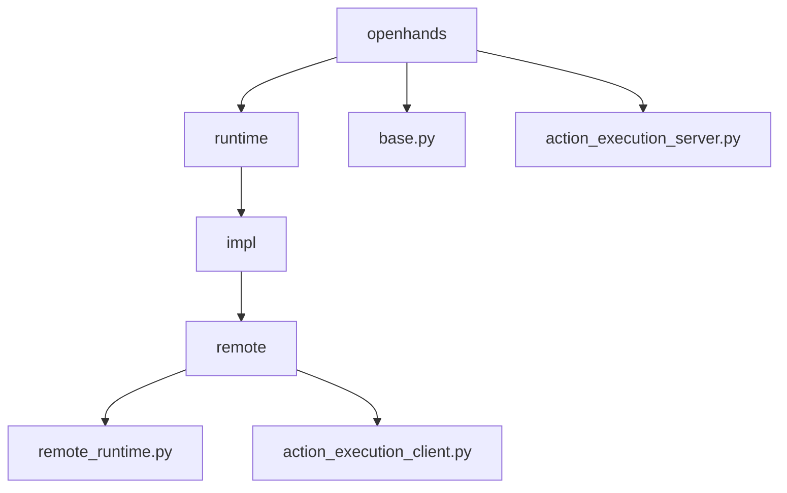
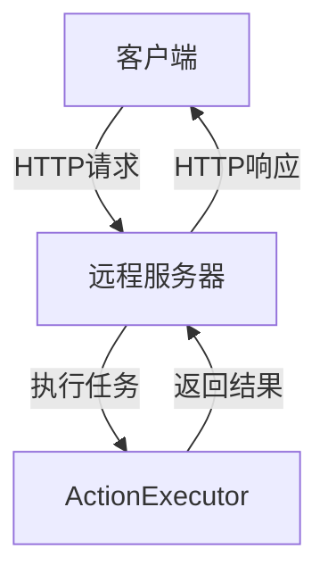
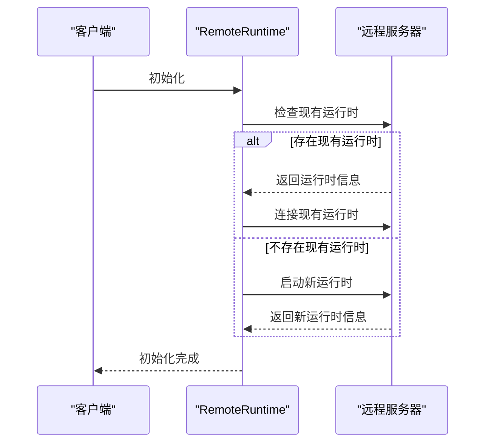
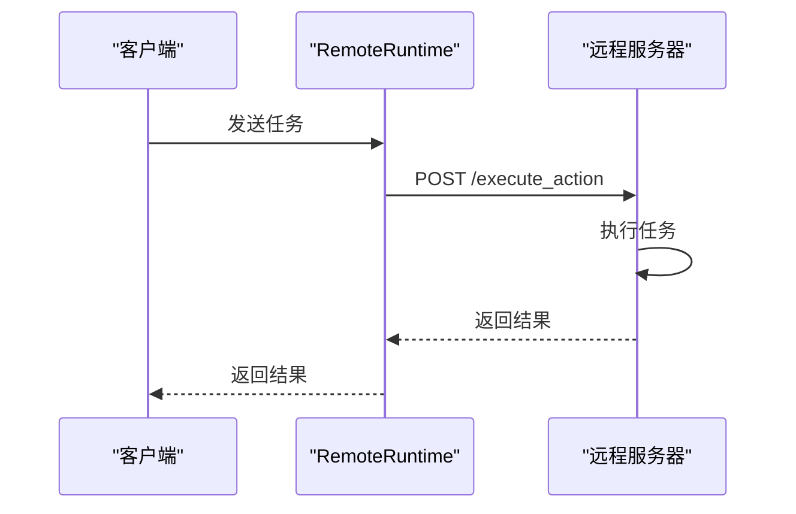
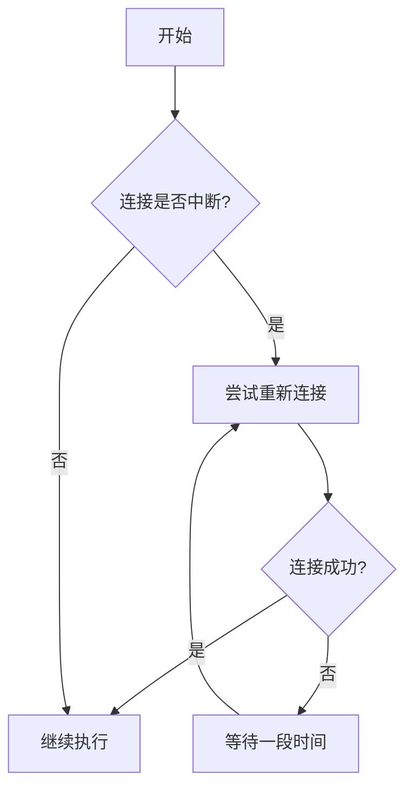
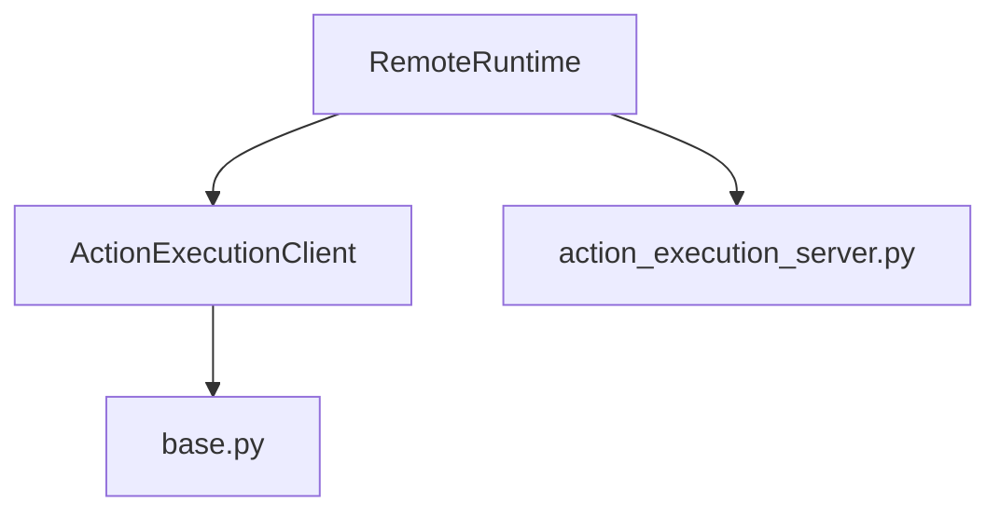

# 远程运行时

<cite>
**本文档引用的文件**   
- [remote_runtime.py](file://openhands/runtime/impl/remote/remote_runtime.py)
- [action_execution_client.py](file://openhands/runtime/impl/action_execution/action_execution_client.py)
- [base.py](file://openhands/runtime/base.py)
- [action_execution_server.py](file://openhands/runtime/action_execution_server.py)
- [config.template.toml](file://config.template.toml)
- [deployment.yaml](file://kind/manifests/deployment.yaml)
- [service.yaml](file://kind/manifests/service.yaml)
- [cluster.yaml](file://kind/cluster.yaml)
</cite>

## 目录
1. [引言](#引言)
2. [项目结构](#项目结构)
3. [核心组件](#核心组件)
4. [架构概述](#架构概述)
5. [详细组件分析](#详细组件分析)
6. [依赖关系分析](#依赖关系分析)
7. [性能考虑](#性能考虑)
8. [故障排除指南](#故障排除指南)
9. [结论](#结论)

## 引言
远程运行时是OpenHands框架中的一个关键组件，它允许在远程环境中执行任务。这种架构设计使得分布式执行成为可能，特别适用于生产环境、可扩展性要求高的场景以及本地资源受限的情况。本文档将深入探讨远程运行时的设计与实现，包括客户端-服务器通信协议、任务序列化和结果反序列化机制、连接管理、会话保持和错误恢复策略等。

## 项目结构
OpenHands项目的结构清晰地划分了不同的功能模块，其中远程运行时相关的代码主要位于`openhands/runtime/impl/remote`目录下。该目录包含了远程运行时的核心实现，如`remote_runtime.py`文件，它定义了与远程执行环境交互的逻辑。

**Diagram sources**
- [remote_runtime.py](file://openhands/runtime/impl/remote/remote_runtime.py#L1-L615)
- [action_execution_client.py](file://openhands/runtime/impl/action_execution/action_execution_client.py#L1-L494)
- [base.py](file://openhands/runtime/base.py#L1-L1241)
- [action_execution_server.py](file://openhands/runtime/action_execution_server.py#L1-L858)

## 核心组件
远程运行时的核心组件包括`RemoteRuntime`类，它继承自`ActionExecutionClient`，并实现了与远程执行环境的交互。`RemoteRuntime`负责管理远程运行时的生命周期，包括启动、连接、执行任务和关闭。

**Section sources**
- [remote_runtime.py](file://openhands/runtime/impl/remote/remote_runtime.py#L39-L615)

## 架构概述
远程运行时的架构基于客户端-服务器模型，其中客户端（即OpenHands应用）通过HTTP请求与远程服务器进行通信。远程服务器运行一个ActionExecutor，负责执行客户端发送的任务，并将结果返回给客户端。

**Diagram sources**
- [remote_runtime.py](file://openhands/runtime/impl/remote/remote_runtime.py#L39-L615)
- [action_execution_server.py](file://openhands/runtime/action_execution_server.py#L1-L858)

## 详细组件分析
### RemoteRuntime 分析
`RemoteRuntime`类是远程运行时的核心，它负责与远程执行环境的交互。以下是其主要功能的详细分析：

#### 初始化
`RemoteRuntime`的初始化过程包括设置会话、配置运行时参数和建立与远程服务器的连接。初始化过程中，`RemoteRuntime`会检查是否存在已有的运行时实例，如果存在则尝试连接，否则启动一个新的运行时实例。

**Diagram sources**
- [remote_runtime.py](file://openhands/runtime/impl/remote/remote_runtime.py#L51-L134)

#### 任务执行
`RemoteRuntime`通过发送HTTP请求到远程服务器的`/execute_action`端点来执行任务。任务以JSON格式序列化后发送，远程服务器执行任务并将结果反序列化后返回。

**Diagram sources**
- [remote_runtime.py](file://openhands/runtime/impl/remote/remote_runtime.py#L435-L462)
- [action_execution_server.py](file://openhands/runtime/action_execution_server.py#L814-L832)

#### 连接管理
`RemoteRuntime`通过定期发送心跳请求来保持与远程服务器的连接。如果连接中断，`RemoteRuntime`会尝试重新连接，确保会话的持续性。

**Diagram sources**
- [remote_runtime.py](file://openhands/runtime/impl/remote/remote_runtime.py#L125-L134)
- [action_execution_server.py](file://openhands/runtime/action_execution_server.py#L814-L832)

## 依赖关系分析
远程运行时依赖于多个组件，包括`ActionExecutionClient`、`base.py`和`action_execution_server.py`。这些组件共同构成了远程运行时的基础架构。

**Diagram sources**
- [remote_runtime.py](file://openhands/runtime/impl/remote/remote_runtime.py#L39-L615)
- [action_execution_client.py](file://openhands/runtime/impl/action_execution/action_execution_client.py#L61-L494)
- [base.py](file://openhands/runtime/base.py#L91-L1241)
- [action_execution_server.py](file://openhands/runtime/action_execution_server.py#L1-L858)

## 性能考虑
远程运行时的性能受到网络延迟、服务器处理能力和任务复杂度的影响。为了优化性能，建议使用高效的序列化格式（如JSON），并尽量减少不必要的网络请求。

## 故障排除指南
在使用远程运行时时，可能会遇到连接中断、任务执行失败等问题。以下是一些常见的故障排除步骤：

1. **检查网络连接**：确保客户端与远程服务器之间的网络连接稳定。
2. **验证API密钥**：确保API密钥正确无误，并且具有足够的权限。
3. **查看日志**：检查远程服务器的日志，查找可能的错误信息。

**Section sources**
- [remote_runtime.py](file://openhands/runtime/impl/remote/remote_runtime.py#L51-L615)
- [action_execution_server.py](file://openhands/runtime/action_execution_server.py#L1-L858)

## 结论
远程运行时是OpenHands框架中实现分布式执行的关键组件。通过客户端-服务器模型，它能够有效地管理远程执行环境，支持大规模部署和高可用性。本文档详细介绍了远程运行时的设计与实现，为开发者提供了全面的参考。