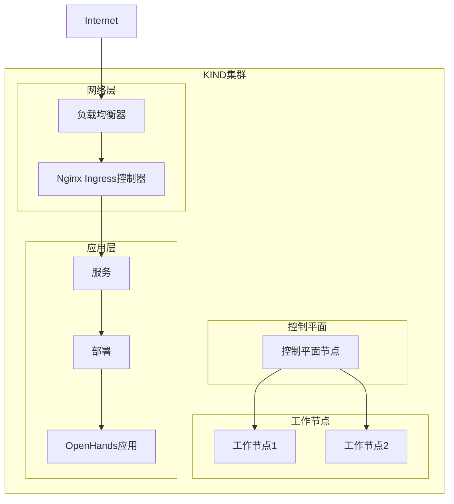
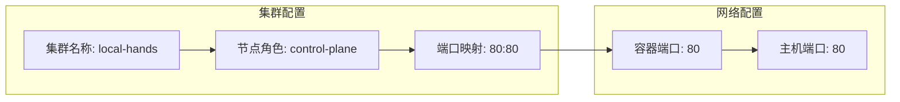
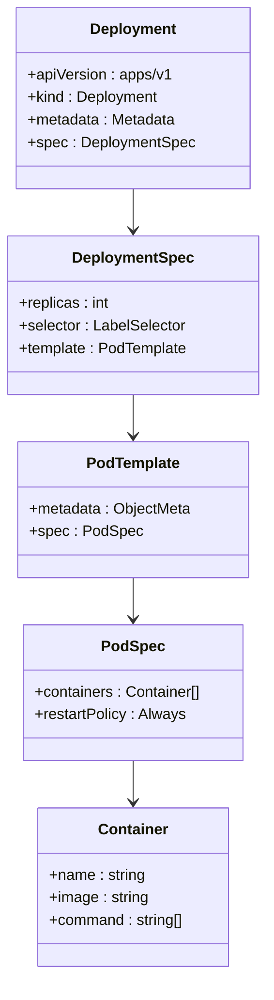
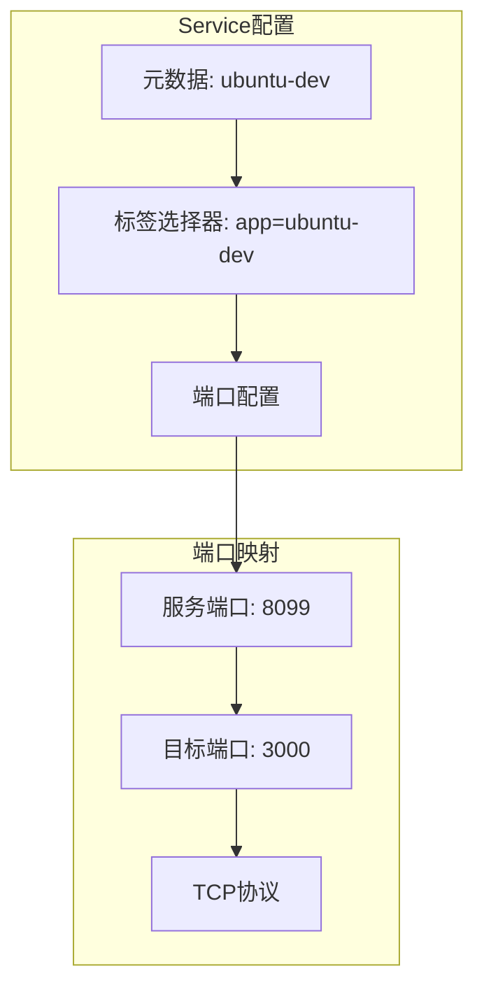
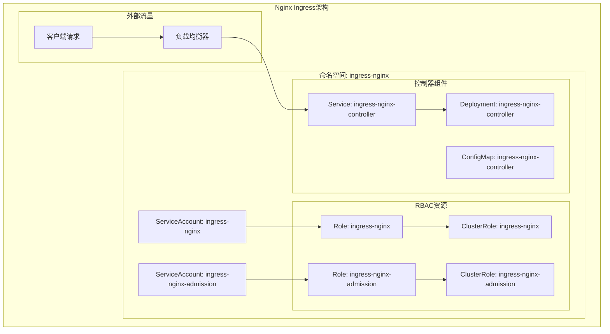
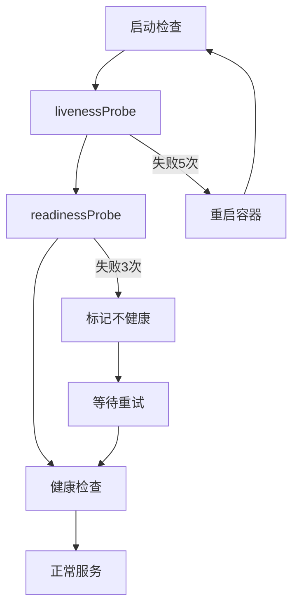
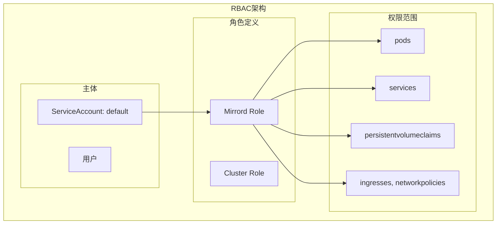
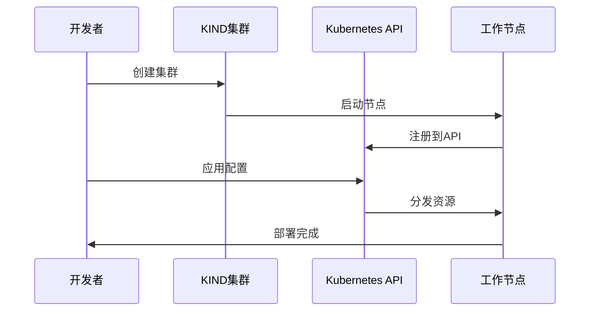
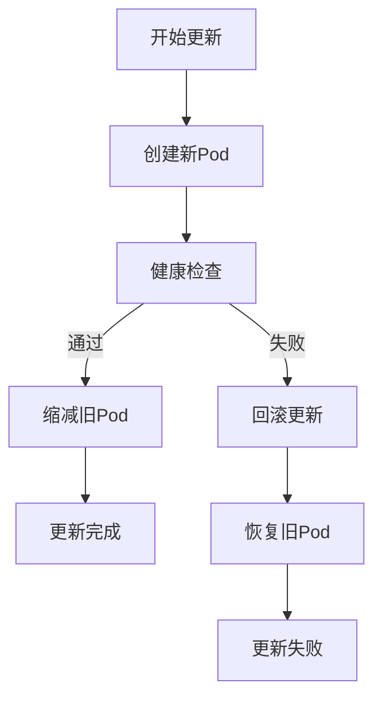
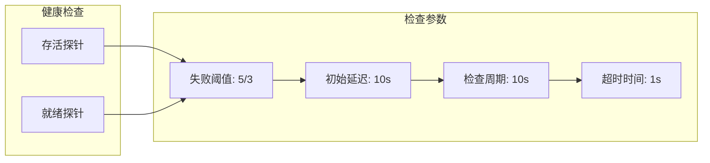

# Kubernetes部署指南

<cite>
**本文档引用的文件**
- [kind/cluster.yaml](file://kind/cluster.yaml)
- [kind/manifests/deployment.yaml](file://kind/manifests/deployment.yaml)
- [kind/manifests/service.yaml](file://kind/manifests/service.yaml)
- [kind/manifests/nginx.yaml](file://kind/manifests/nginx.yaml)
- [kind/manifests/role.yaml](file://kind/manifests/role.yaml)
- [kind/manifests/roleBinding.yaml](file://kind/manifests/roleBinding.yaml)
- [microagents/kubernetes.md](file://microagents/kubernetes.md)
- [Development.md](file://Development.md)
- [README.md](file://README.md)
- [config.template.toml](file://config.template.toml)
- [openhands/runtime/impl/kubernetes/kubernetes_runtime.py](file://openhands/runtime/impl/kubernetes/kubernetes_runtime.py)
</cite>

## 目录
1. [简介](#简介)
2. [项目架构概览](#项目架构概览)
3. [KIND集群配置](#kind集群配置)
4. [Deployment配置详解](#deployment配置详解)
5. [Service和服务发现](#service和服务发现)
6. [Nginx Ingress控制器](#nginx-ingress控制器)
7. [RBAC权限管理](#rbac权限管理)
8. [Kubernetes配置参数](#kubernetes配置参数)
9. [部署操作指南](#部署操作指南)
10. [滚动更新和故障恢复](#滚动更新和故障恢复)
11. [监控和调试](#监控和调试)
12. [最佳实践](#最佳实践)

## 简介

OpenHands是一个由AI驱动的软件开发平台，支持多种部署方式。本指南详细介绍了如何使用KIND（Kubernetes IN Docker）在本地环境中部署OpenHands，包括完整的Kubernetes集群配置、服务暴露、负载均衡和权限管理。

KIND是运行本地Kubernetes集群的最佳工具，它使用Docker容器作为节点，为开发者提供了与生产环境相似的测试环境。

## 项目架构概览

OpenHands的Kubernetes部署采用分层架构设计，包含以下核心组件：



**图表来源**
- [kind/cluster.yaml](file://kind/cluster.yaml#L1-L10)
- [kind/manifests/nginx.yaml](file://kind/manifests/nginx.yaml#L1-L50)

## KIND集群配置

### cluster.yaml配置详解

KIND集群配置文件定义了本地Kubernetes集群的基本参数和网络设置。



**图表来源**
- [kind/cluster.yaml](file://kind/cluster.yaml#L1-L10)

#### 关键配置参数

| 参数 | 值 | 说明 |
|------|-----|------|
| `kind` | Cluster | 集群类型标识 |
| `apiVersion` | kind.x-k8s.io/v1alpha4 | KIND API版本 |
| `name` | local-hands | 集群名称 |
| `role` | control-plane | 节点角色 |
| `containerPort` | 80 | 容器内部端口 |
| `hostPort` | 80 | 主机映射端口 |

**章节来源**
- [kind/cluster.yaml](file://kind/cluster.yaml#L1-L10)

### KIND安装和初始化

#### 安装要求
- Docker已安装并运行
- Linux、Mac OS或Windows WSL
- 至少4GB可用内存

#### 安装步骤

1. **下载并安装KIND**
```bash
# 下载KIND二进制文件
curl -Lo ./kind https://kind.sigs.k8s.io/dl/v0.22.0/kind-linux-amd64

# 设置可执行权限
chmod +x ./kind

# 移动到系统PATH
sudo mv ./kind /usr/local/bin/
```

2. **安装kubectl**
```bash
# 下载kubectl
curl -LO "https://dl.k8s.io/release/$(curl -L -s https://dl.k8s.io/release/stable.txt)/bin/linux/amd64/kubectl"

# 设置可执行权限
chmod +x kubectl

# 移动到系统PATH
sudo mv ./kubectl /usr/local/bin/
```

3. **创建KIND集群**
```bash
kind create cluster --config=kind/cluster.yaml
```

**章节来源**
- [microagents/kubernetes.md](file://microagents/kubernetes.md#L16-L51)

## Deployment配置详解

### deployment.yaml分析

OpenHands的Deployment配置定义了应用程序的Pod模板、副本数量和容器规格。



**图表来源**
- [kind/manifests/deployment.yaml](file://kind/manifests/deployment.yaml#L1-L20)

#### 核心配置参数

| 参数 | 值 | 说明 |
|------|-----|------|
| `apiVersion` | apps/v1 | API版本 |
| `kind` | Deployment | 资源类型 |
| `name` | ubuntu-dev | 部署名称 |
| `replicas` | 1 | 副本数量 |
| `app` | ubuntu-dev | 标签选择器 |

#### 容器配置

- **镜像**: `ubuntu:22.04`
- **命令**: `["sleep", "infinity"]`
- **用途**: 提供基础开发环境

**章节来源**
- [kind/manifests/deployment.yaml](file://kind/manifests/deployment.yaml#L1-L20)

## Service和服务发现

### service.yaml配置

Service资源提供了稳定的网络端点和负载均衡功能。



**图表来源**
- [kind/manifests/service.yaml](file://kind/manifests/service.yaml#L1-L13)

#### Service配置参数

| 参数 | 值 | 说明 |
|------|-----|------|
| `apiVersion` | v1 | API版本 |
| `kind` | Service | 资源类型 |
| `name` | ubuntu-dev | 服务名称 |
| `port` | 8099 | 服务端口 |
| `targetPort` | 3000 | 目标端口 |
| `protocol` | TCP | 协议类型 |

**章节来源**
- [kind/manifests/service.yaml](file://kind/manifests/service.yaml#L1-L13)

## Nginx Ingress控制器

### Nginx Ingress架构

Nginx Ingress控制器是Kubernetes集群中的关键组件，负责处理外部HTTP/HTTPS流量。



**图表来源**
- [kind/manifests/nginx.yaml](file://kind/manifests/nginx.yaml#L1-L100)

### Nginx Ingress配置详解

#### 核心配置参数

| 组件 | 配置项 | 值 | 说明 |
|------|--------|-----|------|
| Deployment | worker-processes | 2 | 工作进程数 |
| Deployment | max-worker-connections | 1024 | 最大连接数 |
| Service | port | 80 | HTTP端口 |
| Service | port | 443 | HTTPS端口 |
| Resources | CPU Request | 300m | CPU需求 |
| Resources | Memory Request | 256Mi | 内存需求 |
| Resources | Memory Limit | 512Mi | 内存限制 |

#### 健康检查配置



**图表来源**
- [kind/manifests/nginx.yaml](file://kind/manifests/nginx.yaml#L455-L486)

**章节来源**
- [kind/manifests/nginx.yaml](file://kind/manifests/nginx.yaml#L1-L679)

## RBAC权限管理

### 权限模型

OpenHands使用RBAC（基于角色的访问控制）来管理集群资源的访问权限。



**图表来源**
- [kind/manifests/role.yaml](file://kind/manifests/role.yaml#L1-L15)
- [kind/manifests/roleBinding.yaml](file://kind/manifests/roleBinding.yaml#L1-L15)

### 角色权限配置

#### Mirrord Role权限

| 资源类型 | 操作权限 | 说明 |
|----------|----------|------|
| pods | get, list, create, delete, watch, update | Pod管理权限 |
| pods/exec | get, list, create, delete, watch, update | Pod执行权限 |
| pods/portforward | get, list, create, delete, watch, update | 端口转发权限 |
| services | get, list, create, delete, watch, update | 服务管理权限 |
| persistentvolumeclaims | get, list, create, delete, watch, update | 存储卷权限 |
| ingresses | get, list, create, delete, watch, update | Ingress管理权限 |
| networkpolicies | get, list, create, delete, watch, update | 网络策略权限 |

#### 角色绑定

- **Subject**: ServiceAccount `default` 在 `default` 命名空间
- **Role**: `mirrord-role`
- **API Group**: `rbac.authorization.k8s.io`

**章节来源**
- [kind/manifests/role.yaml](file://kind/manifests/role.yaml#L1-L15)
- [kind/manifests/roleBinding.yaml](file://kind/manifests/roleBinding.yaml#L1-L15)

## Kubernetes配置参数

### 配置模板解析

OpenHands提供了完整的Kubernetes配置模板，支持生产环境部署。

#### 基础配置参数

| 配置项 | 默认值 | 说明 |
|--------|--------|------|
| `namespace` | default | Kubernetes命名空间 |
| `ingress_domain` | localhost | Ingress域名 |
| `pvc_storage_size` | 2Gi | PVC存储大小 |
| `pvc_storage_class` | standard | 存储类 |
| `resource_cpu_request` | 1 | CPU请求量 |
| `resource_memory_request` | 1Gi | 内存请求量 |
| `resource_memory_limit` | 2Gi | 内存限制 |

#### 高级配置选项

| 配置项 | 说明 |
|--------|------|
| `image_pull_secret` | 镜像拉取密钥 |
| `ingress_tls_secret` | TLS证书密钥 |
| `node_selector_key` | 节点选择器键 |
| `node_selector_val` | 节点选择器值 |
| `tolerations_yaml` | 容忍配置 |
| `privileged` | 是否启用特权模式 |

**章节来源**
- [config.template.toml](file://config.template.toml#L449-L490)

## 部署操作指南

### 部署流程



**图表来源**
- [microagents/kubernetes.md](file://microagents/kubernetes.md#L46-L51)

### 部署步骤

1. **准备环境**
```bash
# 安装依赖
sudo apt-get install docker.io curl

# 验证Docker
docker --version
```

2. **创建KIND集群**
```bash
# 使用配置文件创建集群
kind create cluster --config=kind/cluster.yaml

# 或使用默认配置
kind create cluster
```

3. **部署Nginx Ingress**
```bash
# 应用Nginx Ingress控制器
kubectl apply -f kind/manifests/nginx.yaml

# 等待部署完成
kubectl wait --namespace ingress-nginx \
  --for=condition=ready pod \
  --selector=app.kubernetes.io/component=controller \
  --timeout=90s
```

4. **部署应用**
```bash
# 应用Deployment和Service
kubectl apply -f kind/manifests/

# 查看部署状态
kubectl get pods,services,deployments
```

5. **验证部署**
```bash
# 检查Pod状态
kubectl describe pod <pod-name>

# 检查服务端点
kubectl get endpoints

# 检查Ingress状态
kubectl get ingress
```

**章节来源**
- [microagents/kubernetes.md](file://microagents/kubernetes.md#L46-L51)

## 滚动更新和故障恢复

### 滚动更新策略

OpenHands的Nginx Ingress控制器配置了优雅的滚动更新策略：



#### 更新配置参数

| 参数 | 值 | 说明 |
|------|-----|------|
| `strategy.type` | RollingUpdate | 滚动更新策略 |
| `strategy.rollingUpdate.maxUnavailable` | 1 | 最大不可用Pod数 |
| `minReadySeconds` | 0 | 最小就绪时间 |
| `revisionHistoryLimit` | 10 | 保留历史版本数 |

### 故障恢复机制

#### 健康检查配置



#### 自动恢复策略

1. **Pod级别恢复**
   - 容器重启策略：Always
   - 重启次数限制：无限制
   - 重启间隔：指数退避

2. **服务级别恢复**
   - 服务发现自动更新
   - 负载均衡重新分配
   - Ingress规则动态调整

3. **集群级别恢复**
   - 节点故障检测
   - Pod重新调度
   - 存储卷自动迁移

**章节来源**
- [kind/manifests/nginx.yaml](file://kind/manifests/nginx.yaml#L412-L414)
- [kind/manifests/nginx.yaml](file://kind/manifests/nginx.yaml#L455-L486)

## 监控和调试

### 集群监控

#### 关键指标监控

| 指标类别 | 监控项 | 告警阈值 |
|----------|--------|----------|
| 资源使用 | CPU使用率 | >80% |
| 资源使用 | 内存使用率 | >85% |
| 资源使用 | 存储使用率 | >90% |
| 服务可用性 | Pod就绪率 | <95% |
| 服务可用性 | 服务响应时间 | >5s |
| 网络连通性 | Ingress成功率 | <99% |

#### 日志收集

```bash
# 查看Pod日志
kubectl logs <pod-name> -n <namespace>

# 实时跟踪日志
kubectl logs -f <pod-name> -n <namespace>

# 查看特定容器日志
kubectl logs <pod-name> -c <container-name> -n <namespace>

# 查看事件
kubectl get events --sort-by=.metadata.creationTimestamp
```

### 调试工具

#### 常用调试命令

```bash
# 获取集群状态
kubectl cluster-info

# 查看节点状态
kubectl get nodes

# 查看Pod详细信息
kubectl describe pod <pod-name>

# 查看服务详情
kubectl describe service <service-name>

# 查看Ingress详情
kubectl describe ingress <ingress-name>

# 执行命令到Pod
kubectl exec -it <pod-name> -- /bin/bash
```

#### 网络诊断

```bash
# 检查DNS解析
kubectl exec -it <pod-name> -- nslookup <service-name>.<namespace>.svc.cluster.local

# 测试网络连通性
kubectl exec -it <pod-name> -- ping <target-ip>

# 检查端口连通性
kubectl exec -it <pod-name> -- telnet <service-name> <port>
```

## 最佳实践

### 安全最佳实践

1. **最小权限原则**
   - 使用专用ServiceAccount
   - 限制RBAC权限范围
   - 定期审计权限配置

2. **网络安全**
   - 启用Network Policies
   - 使用TLS加密通信
   - 配置Ingress安全策略

3. **资源管理**
   - 设置资源请求和限制
   - 启用Pod资源配额
   - 监控资源使用情况

### 性能优化

1. **资源配置**
   - 合理设置CPU和内存限制
   - 优化容器镜像大小
   - 使用合适的存储类

2. **网络优化**
   - 配置适当的Ingress缓存
   - 启用HTTP/2支持
   - 优化DNS查询

3. **存储优化**
   - 使用SSD存储
   - 配置持久化存储
   - 实施备份策略

### 运维最佳实践

1. **监控告警**
   - 设置关键指标监控
   - 配置自动化告警
   - 建立故障响应流程

2. **备份恢复**
   - 定期备份配置
   - 测试恢复流程
   - 文档化操作手册

3. **版本管理**
   - 使用Git管理配置
   - 实施变更控制
   - 建立发布流程

### 生产环境建议

1. **高可用部署**
   - 多节点集群配置
   - 负载均衡策略
   - 故障转移机制

2. **扩展性考虑**
   - 水平扩展能力
   - 自动扩缩容
   - 资源弹性调度

3. **合规性要求**
   - 安全扫描
   - 合规审计
   - 数据保护

通过遵循这些最佳实践，可以确保OpenHands在Kubernetes环境中的稳定、安全和高效运行。定期评估和优化配置，根据实际负载情况进行调整，是维持系统良好性能的关键。