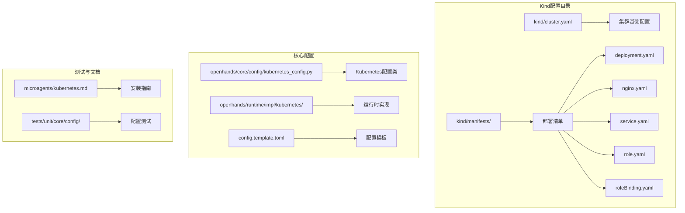
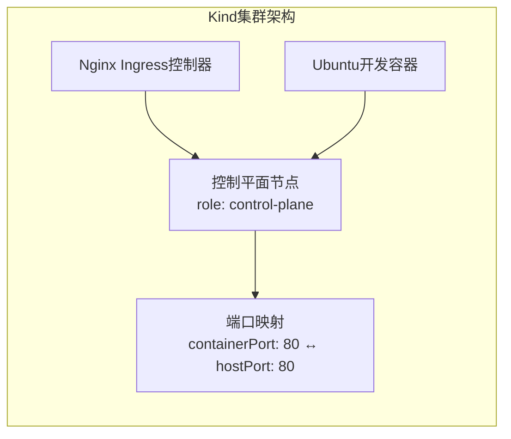
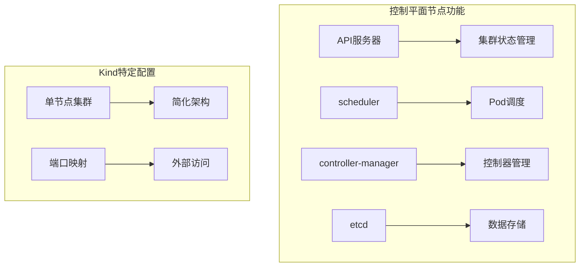
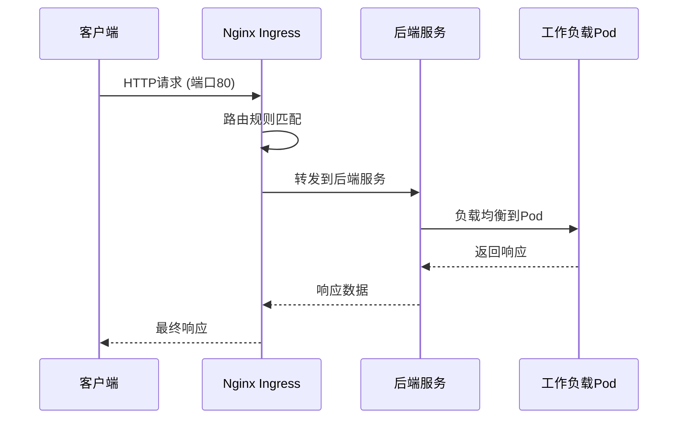
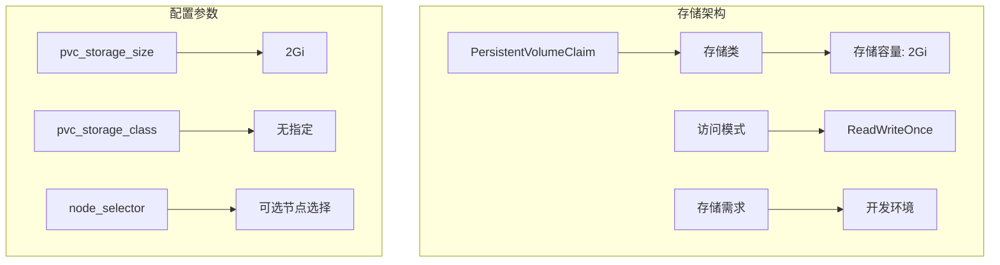
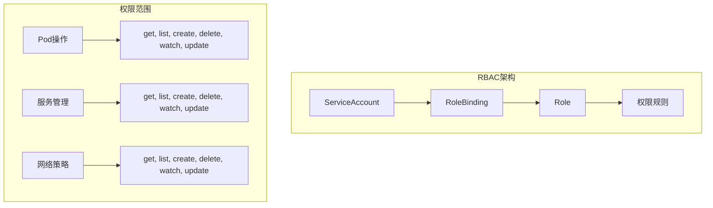
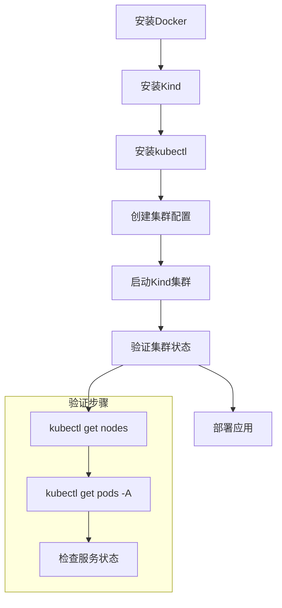
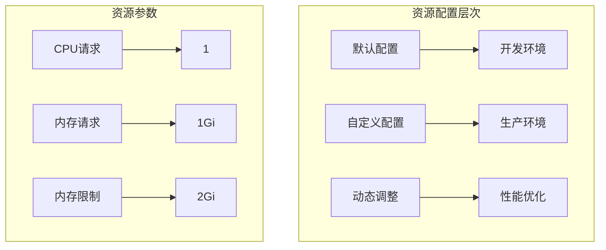

# Kubernetes集群设置

<cite>
**本文档中引用的文件**
- [kind/cluster.yaml](file://kind/cluster.yaml)
- [kind/manifests/deployment.yaml](file://kind/manifests/deployment.yaml)
- [kind/manifests/nginx.yaml](file://kind/manifests/nginx.yaml)
- [kind/manifests/service.yaml](file://kind/manifests/service.yaml)
- [kind/manifests/role.yaml](file://kind/manifests/role.yaml)
- [kind/manifests/roleBinding.yaml](file://kind/manifests/roleBinding.yaml)
- [openhands/core/config/kubernetes_config.py](file://openhands/core/config/kubernetes_config.py)
- [openhands/runtime/impl/kubernetes/kubernetes_runtime.py](file://openhands/runtime/impl/kubernetes/kubernetes_runtime.py)
- [microagents/kubernetes.md](file://microagents/kubernetes.md)
- [config.template.toml](file://config.template.toml)
- [tests/unit/core/config/test_kubernetes_config.py](file://tests/unit/core/config/test_kubernetes_config.py)
</cite>

## 目录
1. [简介](#简介)
2. [项目结构概览](#项目结构概览)
3. [Kind集群配置详解](#kind集群配置详解)
4. [节点配置与角色定义](#节点配置与角色定义)
5. [网络设置与CNI插件](#网络设置与cni插件)
6. [存储卷配置](#存储卷配置)
7. [RBAC权限管理](#rbac权限管理)
8. [集群操作指南](#集群操作指南)
9. [资源配置优化](#资源配置优化)
10. [故障排除指南](#故障排除指南)
11. [总结](#总结)

## 简介

本文档提供了基于OpenHands项目的Kubernetes集群配置完整指南。该项目使用Kind（Kubernetes IN Docker）作为本地开发环境的基础，为AI驱动的软件开发代理提供了一个完整的Kubernetes运行时环境。

Kind是一个轻量级的工具，允许开发者在Docker容器中运行本地Kubernetes集群，特别适合测试和开发场景。OpenHands项目通过精心设计的集群配置，为AI代理提供了接近生产环境的Kubernetes体验。

## 项目结构概览

OpenHands项目中的Kubernetes相关文件组织结构如下：



**图表来源**
- [kind/cluster.yaml](file://kind/cluster.yaml#L1-L10)
- [openhands/core/config/kubernetes_config.py](file://openhands/core/config/kubernetes_config.py#L1-L86)

**章节来源**
- [kind/cluster.yaml](file://kind/cluster.yaml#L1-L10)
- [openhands/core/config/kubernetes_config.py](file://openhands/core/config/kubernetes_config.py#L1-L86)

## Kind集群配置详解

### 基础集群配置

Kind集群的核心配置位于`kind/cluster.yaml`文件中，定义了单节点控制平面集群的基本结构：



**图表来源**
- [kind/cluster.yaml](file://kind/cluster.yaml#L1-L10)

### 集群特性说明

| 特性 | 配置值 | 说明 |
|------|--------|------|
| 集群名称 | `local-hands` | 标识该Kind集群的唯一名称 |
| API版本 | `kind.x-k8s.io/v1alpha4` | 使用Kind的Alpha API版本 |
| 节点角色 | `control-plane` | 定义为主控制平面节点 |
| 端口映射 | `containerPort: 80` ↔ `hostPort: 80` | 将集群内部的80端口映射到主机 |

**章节来源**
- [kind/cluster.yaml](file://kind/cluster.yaml#L1-L10)

## 节点配置与角色定义

### 控制平面节点配置

控制平面节点是Kubernetes集群的核心组件，负责管理整个集群的状态和调度工作负载。在Kind环境中，控制平面节点承担以下职责：



**图表来源**
- [kind/cluster.yaml](file://kind/cluster.yaml#L6-L9)

### Worker节点扩展

虽然当前配置只包含一个控制平面节点，但Kind支持添加多个worker节点以构建多节点集群。扩展配置示例：

```yaml
nodes:
- role: control-plane
- role: worker
- role: worker
```

这种配置可以创建一个包含两个worker节点的多节点集群，提高资源利用率和容错能力。

**章节来源**
- [kind/cluster.yaml](file://kind/cluster.yaml#L5-L10)

## 网络设置与CNI插件

### Nginx Ingress控制器配置

项目使用Nginx Ingress控制器作为默认的入口网关解决方案，提供HTTP/HTTPS流量路由功能：



**图表来源**
- [kind/manifests/nginx.yaml](file://kind/manifests/nginx.yaml#L369-L391)

### 网络策略配置

Nginx Ingress控制器的关键配置参数：

| 配置项 | 值 | 作用 |
|--------|-----|------|
| `worker-processes` | `2` | 工作进程数，建议设为CPU核心数 |
| `max-worker-connections` | `1024` | 每个工作进程的最大连接数 |
| `port` | `80` | HTTP服务端口 |
| `port` | `443` | HTTPS服务端口 |
| `targetPort` | `http/https` | 目标端口映射 |

### 网络架构特点

- **IPv4单栈支持**：配置为单栈IPv4网络
- **LoadBalancer类型**：模拟云环境的负载均衡器
- **滚动更新策略**：最大不可用实例数为1
- **健康检查**：定期执行健康检查确保服务可用性

**章节来源**
- [kind/manifests/nginx.yaml](file://kind/manifests/nginx.yaml#L334-L335)
- [kind/manifests/nginx.yaml](file://kind/manifests/nginx.yaml#L348-L367)

## 存储卷配置

### Persistent Volume Claim (PVC) 设置

项目配置了专门的存储卷用于持久化数据存储：



**图表来源**
- [openhands/core/config/kubernetes_config.py](file://openhands/core/config/kubernetes_config.py#L29-L33)

### 存储配置选项

| 参数 | 默认值 | 说明 |
|------|--------|------|
| `pvc_storage_size` | `"2Gi"` | PVC存储大小，默认2GB |
| `pvc_storage_class` | `None` | 存储类名称，使用默认存储类 |
| `access_modes` | `["ReadWriteOnce"]` | 访问模式，仅限单个节点读写 |

### 扩展存储配置

对于生产环境或需要更大存储空间的场景，可以调整配置：

```yaml
pvc_storage_size: "5Gi"
pvc_storage_class: "fast"
```

**章节来源**
- [openhands/core/config/kubernetes_config.py](file://openhands/core/config/kubernetes_config.py#L29-L33)
- [openhands/runtime/impl/kubernetes/kubernetes_runtime.py](file://openhands/runtime/impl/kubernetes/kubernetes_runtime.py#L394-L411)

## RBAC权限管理

### 角色与权限配置

项目实现了细粒度的RBAC（基于角色的访问控制）系统：



**图表来源**
- [kind/manifests/role.yaml](file://kind/manifests/role.yaml#L1-L15)
- [kind/manifests/roleBinding.yaml](file://kind/manifests/roleBinding.yaml#L1-L15)

### 权限规则详解

镜像守护（mirrord）角色的权限配置：

| 资源类型 | 操作权限 | 用途 |
|----------|----------|------|
| `pods` | `get, list, create, delete, watch, update` | Pod生命周期管理 |
| `pods/exec` | `get, list, create, delete, watch, update` | Pod命令执行 |
| `pods/portforward` | `get, list, create, delete, watch, update` | 端口转发 |
| `services` | `get, list, create, delete, watch, update` | 服务发现 |
| `persistentvolumeclaims` | `get, list, create, delete, watch, update` | 存储卷管理 |
| `ingresses` | `get, list, create, delete, watch, update` | 入口路由 |
| `networkpolicies` | `get, list, create, delete, watch, update` | 网络隔离 |

### 安全上下文配置

项目采用最小权限原则，配置了严格的安全上下文：

- **非特权模式**：默认不使用特权容器
- **用户隔离**：运行在非root用户下
- **能力限制**：仅授予必要的Linux能力
- **文件系统保护**：启用只读根文件系统

**章节来源**
- [kind/manifests/role.yaml](file://kind/manifests/role.yaml#L8-L14)
- [kind/manifests/roleBinding.yaml](file://kind/manifests/roleBinding.yaml#L7-L14)

## 集群操作指南

### 集群创建流程



### 基本操作命令

#### 创建集群
```bash
# 创建默认集群
kind create cluster

# 使用自定义配置创建集群
kind create cluster --config=kind/cluster.yaml
```

#### 验证集群状态
```bash
# 检查节点状态
kubectl get nodes

# 检查所有命名空间的Pod
kubectl get pods -A

# 检查服务状态
kubectl get services -A
```

#### 应用部署
```bash
# 部署Nginx Ingress控制器
kubectl apply -f kind/manifests/nginx.yaml

# 部署Ubuntu开发容器
kubectl apply -f kind/manifests/deployment.yaml

# 创建服务
kubectl apply -f kind/manifests/service.yaml
```

### 集群销毁

```bash
# 删除集群
kind delete cluster

# 清理所有Kind相关资源
kind get clusters
kind delete cluster --name <cluster-name>
```

**章节来源**
- [microagents/kubernetes.md](file://microagents/kubernetes.md#L46-L51)

## 资源配置优化

### CPU和内存资源配置

项目提供了灵活的资源配置选项，可以根据实际需求进行调整：



**图表来源**
- [openhands/core/config/kubernetes_config.py](file://openhands/core/config/kubernetes_config.py#L35-L42)

### 配置参数详解

| 参数类别 | 默认值 | 推荐值 | 说明 |
|----------|--------|--------|------|
| `resource_cpu_request` | `"1"` | `"2"` | CPU核心数请求 |
| `resource_memory_request` | `"1Gi"` | `"2Gi"` | 内存请求量 |
| `resource_memory_limit` | `"2Gi"` | `"4Gi"` | 内存使用上限 |
| `pvc_storage_size` | `"2Gi"` | `"5Gi"` | 存储卷大小 |

### 高可用性配置

对于需要高可用性的场景，可以考虑以下配置：

```yaml
# 多节点集群配置
nodes:
- role: control-plane
- role: worker
- role: worker

# 资源扩展示例
resource_cpu_request: "2"
resource_memory_request: "4Gi"
resource_memory_limit: "8Gi"
pvc_storage_size: "10Gi"
```

### 性能调优建议

1. **CPU优化**：
   - 根据工作负载类型调整CPU请求
   - 对于计算密集型任务增加CPU配额

2. **内存优化**：
   - 监控内存使用情况，避免内存泄漏
   - 合理设置内存限制防止OOM

3. **存储优化**：
   - 使用SSD存储类提升I/O性能
   - 定期清理临时文件释放空间

**章节来源**
- [openhands/core/config/kubernetes_config.py](file://openhands/core/config/kubernetes_config.py#L35-L42)
- [tests/unit/core/config/test_kubernetes_config.py](file://tests/unit/core/config/test_kubernetes_config.py#L25-L40)

## 故障排除指南

### 常见问题诊断

#### 集群创建失败

**问题症状**：
- Kind命令执行失败
- Docker容器无法启动

**解决方案**：
1. 检查Docker是否正常运行
2. 确认端口80未被占用
3. 检查磁盘空间是否充足

```bash
# 检查Docker状态
docker ps

# 检查端口占用
sudo netstat -tulpn | grep :80

# 检查磁盘空间
df -h
```

#### Pod启动失败

**问题症状**：
- Pod处于Pending状态
- ImagePullBackOff错误

**解决方案**：
1. 检查镜像是否存在
2. 验证镜像拉取密钥配置
3. 检查节点资源是否充足

```bash
# 查看Pod详细状态
kubectl describe pod <pod-name>

# 查看事件日志
kubectl get events --sort-by=.metadata.creationTimestamp
```

#### 网络连接问题

**问题症状**：
- 服务无法访问
- Ingress路由失败

**解决方案**：
1. 检查网络插件状态
2. 验证防火墙设置
3. 检查DNS解析

```bash
# 检查服务端点
kubectl get endpoints

# 测试DNS解析
kubectl run test-dns --image=busybox --rm -it -- nslookup kubernetes.default

# 检查网络策略
kubectl get networkpolicy
```

### 性能监控

#### 资源使用监控

```bash
# 监控节点资源使用
kubectl top nodes

# 监控Pod资源使用
kubectl top pods -A

# 监控存储使用
kubectl get pv,pvc
```

#### 日志收集

```bash
# 查看Pod日志
kubectl logs <pod-name>

# 实时跟踪日志
kubectl logs -f <pod-name>

# 查看历史日志
kubectl logs --previous <pod-name>
```

**章节来源**
- [openhands/runtime/impl/kubernetes/kubernetes_runtime.py](file://openhands/runtime/impl/kubernetes/kubernetes_runtime.py#L325-L336)

## 总结

本文档详细介绍了基于OpenHands项目的Kubernetes集群配置方案，涵盖了从基础架构到高级配置的各个方面。通过Kind工具，项目提供了一个轻量级但功能完整的Kubernetes开发环境，特别适合AI驱动的软件开发代理的测试和开发需求。

### 关键特性总结

1. **轻量级架构**：基于Docker的Kind集群，快速部署和销毁
2. **灵活配置**：支持多种资源配置和扩展选项
3. **安全可靠**：完善的RBAC权限管理和安全上下文配置
4. **易于维护**：清晰的配置文件结构和自动化部署流程

### 最佳实践建议

1. **环境隔离**：为不同环境使用独立的集群配置
2. **资源规划**：根据实际需求合理分配CPU、内存和存储资源
3. **监控告警**：建立完善的监控体系及时发现和解决问题
4. **备份恢复**：定期备份关键配置和数据，制定灾难恢复计划

通过遵循本文档的指导，开发者可以成功搭建和维护一个稳定、高效的Kubernetes集群环境，为AI驱动的软件开发项目提供强大的基础设施支持。