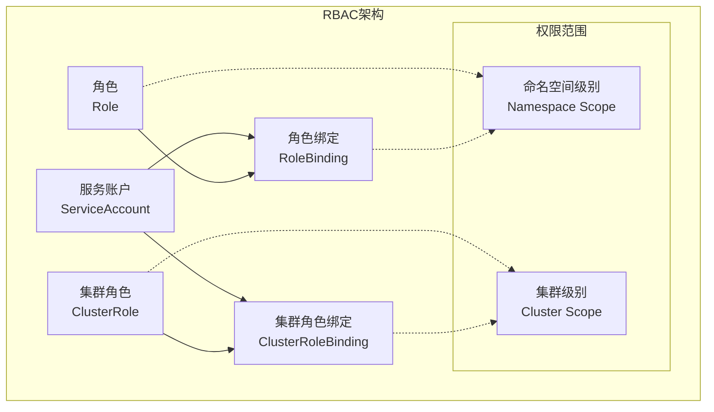
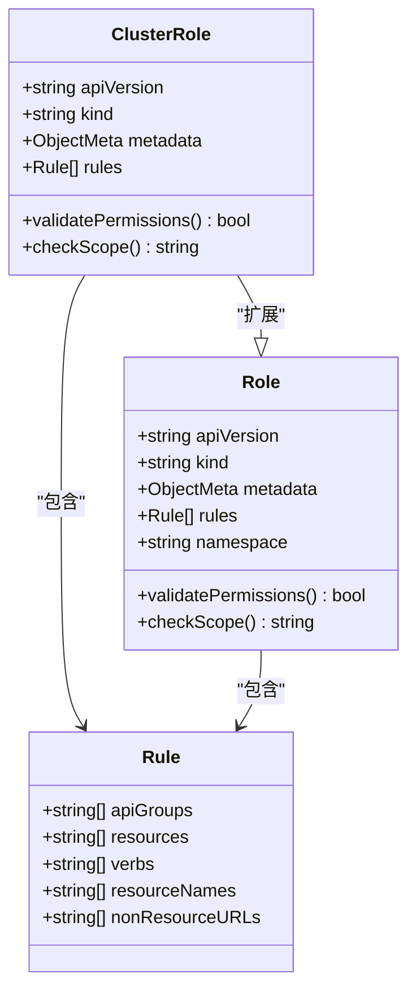
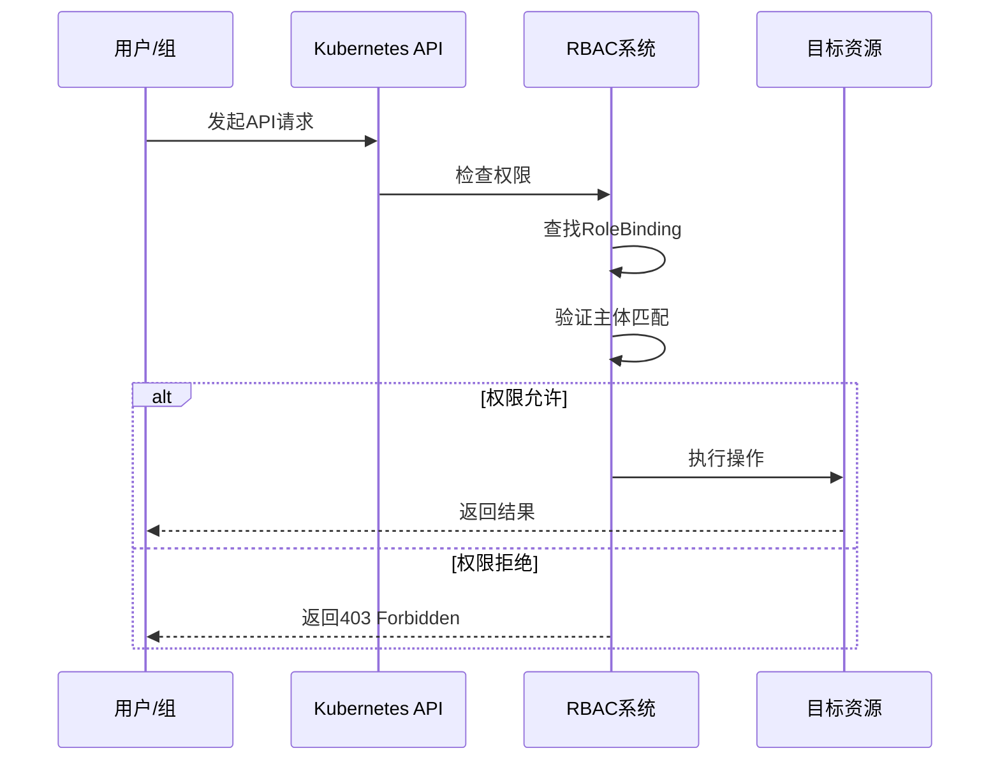
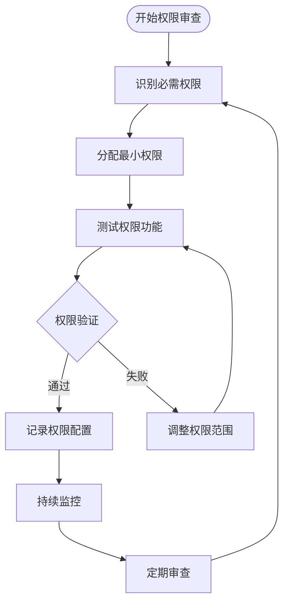
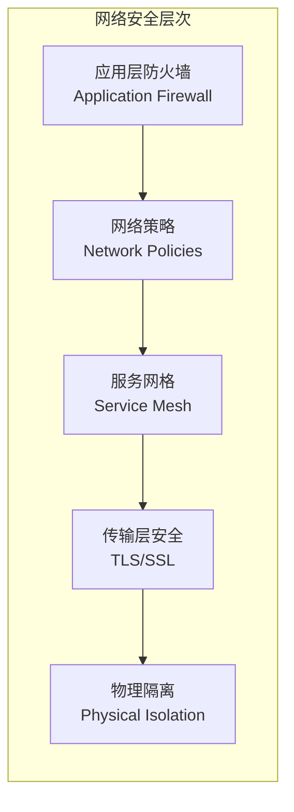
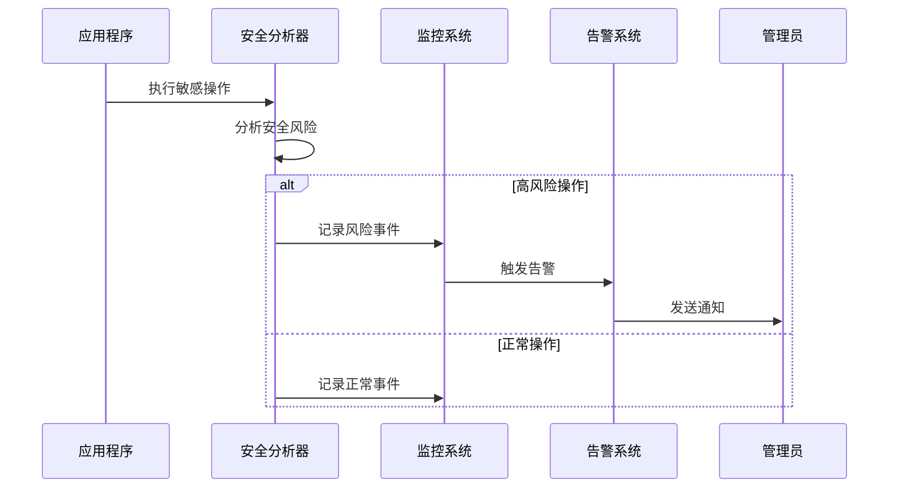
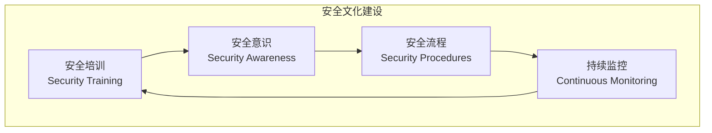
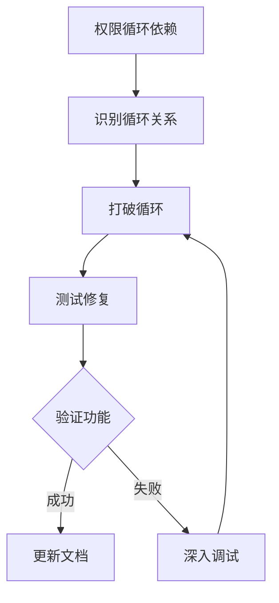

# Kubernetes安全配置指南

<cite>
**本文档中引用的文件**
- [role.yaml](file://kind/manifests/role.yaml)
- [roleBinding.yaml](file://kind/manifests/roleBinding.yaml)
- [nginx.yaml](file://kind/manifests/nginx.yaml)
- [deployment.yaml](file://kind/manifests/deployment.yaml)
- [service.yaml](file://kind/manifests/service.yaml)
- [cluster.yaml](file://kind/cluster.yaml)
- [security.md](file://microagents/security.md)
- [invariant-service.ts](file://frontend/src/api/invariant-service.ts)
- [analyzer.py](file://openhands/security/invariant/analyzer.py)
- [client.py](file://openhands/security/invariant/client.py)
- [test_security.py](file://tests/unit/security/test_security.py)
</cite>

## 目录
1. [简介](#简介)
2. [RBAC基础架构](#rbac基础架构)
3. [Role和ClusterRole详解](#role和clusterrole详解)
4. [RoleBinding和ClusterRoleBinding配置](#rolebinding和clusterrolebinding配置)
5. [最小权限原则实施](#最小权限原则实施)
6. [服务账户安全配置](#服务账户安全配置)
7. [Pod安全策略](#pod安全策略)
8. [网络策略配置](#网络策略配置)
9. [权限审计与监控](#权限审计与监控)
10. [安全最佳实践](#安全最佳实践)
11. [故障排除指南](#故障排除指南)
12. [总结](#总结)

## 简介

本指南基于OpenHands项目的Kubernetes安全配置实践，详细阐述了如何在Kubernetes环境中实施全面的安全策略。通过分析项目中的RBAC配置、安全监控机制和服务隔离策略，我们将为您提供一套完整的安全配置方案。

Kubernetes安全的核心在于建立多层次的防护体系，包括身份认证、授权控制、资源隔离和持续监控。本指南将重点介绍基于角色的访问控制（RBAC）机制的实现，以及如何通过最小权限原则确保集群的安全性。

## RBAC基础架构

### RBAC核心组件

Kubernetes RBAC（基于角色的访问控制）系统由以下核心组件构成：



**图表来源**
- [role.yaml](file://kind/manifests/role.yaml#L1-L15)
- [roleBinding.yaml](file://kind/manifests/roleBinding.yaml#L1-L15)

### RBAC工作原理

RBAC系统通过以下流程实现访问控制：

1. **身份验证**：验证用户或服务账户的身份
2. **权限检查**：根据RBAC规则检查操作权限
3. **授权决策**：决定是否允许特定操作
4. **审计记录**：记录所有权限使用情况

**节来源**
- [role.yaml](file://kind/manifests/role.yaml#L1-L15)
- [roleBinding.yaml](file://kind/manifests/roleBinding.yaml#L1-L15)

## Role和ClusterRole详解

### Role配置详解

Role是Kubernetes中用于定义命名空间级别权限的对象。它限制了特定命名空间内的资源访问权限。

#### 基础Role配置

基于项目中的mirrord-role配置，我们可以看到典型的Role权限设置：

```yaml
apiVersion: rbac.authorization.k8s.io/v1
kind: Role
metadata:
  name: mirrord-role
  namespace: default
rules:
  - apiGroups: [""]
    resources: ["pods", "pods/exec", "pods/portforward", "services", "persistentvolumeclaims"]
    verbs: ["get", "list", "create", "delete", "watch", "update"]
  - apiGroups: ["networking.k8s.io"]
    resources: ["ingresses", "networkpolicies"]
    verbs: ["get", "list", "create", "delete", "watch", "update"]
```

#### 权限分类

| 资源类型 | 允许的操作 | 安全考虑 |
|---------|-----------|----------|
| Pods | get, list, create, delete, watch, update | 需要严格控制对Pod的直接操作 |
| Services | get, list, create, delete, watch, update | 注意服务发现和负载均衡配置 |
| PersistentVolumeClaims | get, list, create, delete, watch, update | 涉及存储访问权限 |
| Ingresses | get, list, create, delete, watch, update | 网络入口控制 |
| NetworkPolicies | get, list, create, delete, watch, update | 网络隔离策略 |

### ClusterRole配置

ClusterRole提供集群级别的权限，不受命名空间限制：



**图表来源**
- [nginx.yaml](file://kind/manifests/nginx.yaml#L125-L224)

**节来源**
- [nginx.yaml](file://kind/manifests/nginx.yaml#L125-L224)
- [role.yaml](file://kind/manifests/role.yaml#L1-L15)

## RoleBinding和ClusterRoleBinding配置

### RoleBinding机制

RoleBinding将Role的权限授予特定的用户、组或服务账户。

#### 基础RoleBinding配置

```yaml
apiVersion: rbac.authorization.k8s.io/v1
kind: RoleBinding
metadata:
  name: mirrord-binding
  namespace: default
subjects:
  - kind: ServiceAccount
    name: default
    namespace: default
roleRef:
  kind: Role
  name: mirrord-role
  apiGroup: rbac.authorization.k8s.io
```

### 用户/组关联配置



**图表来源**
- [roleBinding.yaml](file://kind/manifests/roleBinding.yaml#L1-L15)

### ClusterRoleBinding配置

ClusterRoleBinding提供跨命名空间的权限管理：

```yaml
apiVersion: rbac.authorization.k8s.io/v1
kind: ClusterRoleBinding
metadata:
  name: ingress-nginx-cluster-role-binding
subjects:
  - kind: ServiceAccount
    name: nginx-ingress
    namespace: ingress-nginx
roleRef:
  kind: ClusterRole
  name: ingress-nginx
  apiGroup: rbac.authorization.k8s.io
```

**节来源**
- [roleBinding.yaml](file://kind/manifests/roleBinding.yaml#L1-L15)
- [nginx.yaml](file://kind/manifests/nginx.yaml#L245-L252)

## 最小权限原则实施

### 权限最小化策略

最小权限原则要求为每个用户、服务账户和应用程序分配完成其任务所需的最小权限集。

#### 权限评估矩阵

| 应用场景 | 必需权限 | 可选权限 | 安全风险等级 |
|---------|---------|---------|-------------|
| 日志收集 | pods/log, pods/exec | pods/list, pods/get | 低 |
| 应用部署 | deployments/create, deployments/update | deployments/delete | 中 |
| 监控服务 | services/get, endpoints/get | services/list, endpoints/list | 低 |
| 存储管理 | persistentvolumeclaims/* | volumesnapshot/* | 高 |

### 权限审查流程



**节来源**
- [security.md](file://microagents/security.md#L18-L35)

## 服务账户安全配置

### 服务账户最佳实践

服务账户是Kubernetes中最重要的安全实体之一，需要遵循严格的安全配置原则。

#### 安全配置要点

1. **专用服务账户**：为每个应用创建专用的服务账户
2. **权限分离**：避免单一服务账户拥有过多权限
3. **定期轮换**：定期更新服务账户的凭据
4. **命名规范**：使用清晰的命名约定标识服务账户用途

#### 服务账户配置示例

```yaml
apiVersion: v1
kind: ServiceAccount
metadata:
  name: application-name
  namespace: production
  annotations:
    # 启用自动挂载令牌
    kubernetes.io/enforce-mountable-secrets: "true"
automountServiceAccountToken: true
secrets:
  - name: application-secret
imagePullSecrets:
  - name: registry-credentials
```

### 凭据管理

服务账户的凭据管理包括：

- **API密钥轮换**：定期更换服务账户令牌
- **访问日志**：记录服务账户的所有访问活动
- **权限审计**：定期检查服务账户权限配置
- **异常检测**：监控异常的访问模式

**节来源**
- [security.md](file://microagents/security.md#L18-L35)

## Pod安全策略

### 安全上下文配置

Pod安全策略通过安全上下文定义容器的安全属性：

```yaml
apiVersion: v1
kind: Pod
metadata:
  name: secure-pod
spec:
  securityContext:
    runAsNonRoot: true
    runAsUser: 1000
    runAsGroup: 1000
    fsGroup: 2000
    seccompProfile:
      type: RuntimeDefault
  containers:
  - name: app
    image: nginx:latest
    securityContext:
      allowPrivilegeEscalation: false
      readOnlyRootFilesystem: true
      runAsNonRoot: true
      capabilities:
        drop:
        - ALL
```

### 容器安全特性

| 安全特性 | 配置方式 | 安全收益 |
|---------|---------|---------|
| 非root运行 | runAsNonRoot: true | 降低特权提升风险 |
| 只读根文件系统 | readOnlyRootFilesystem: true | 防止恶意修改 |
| 能力降级 | capabilities.drop: ALL | 移除不必要的系统调用 |
| Seccomp保护 | seccompProfile: RuntimeDefault | 限制系统调用 |

## 网络策略配置

### 网络隔离策略

网络策略定义Pod之间的网络通信规则：

```yaml
apiVersion: networking.k8s.io/v1
kind: NetworkPolicy
metadata:
  name: db-network-policy
  namespace: production
spec:
  podSelector:
    matchLabels:
      app: database
  policyTypes:
  - Ingress
  - Egress
  ingress:
  - from:
    - podSelector:
        matchLabels:
          app: application
    ports:
    - protocol: TCP
      port: 5432
  egress:
  - to:
    - podSelector:
        matchLabels:
          app: cache
    ports:
    - protocol: TCP
      port: 6379
```

### 网络安全层次



## 权限审计与监控

### 审计日志配置

Kubernetes审计提供了详细的权限使用记录：

```yaml
apiVersion: audit.k8s.io/v1
kind: Policy
rules:
  - level: Metadata
    resources:
    - group: ""
      resources: ["pods", "services"]
  - level: RequestResponse
    resources:
    - group: "apps"
      resources: ["deployments"]
  - level: None
    users: ["system:kube-proxy"]
```

### 实时监控机制

基于项目中的安全监控系统，我们实现了多层次的监控机制：



**图表来源**
- [analyzer.py](file://openhands/security/invariant/analyzer.py#L110-L125)
- [client.py](file://openhands/security/invariant/client.py#L69-L104)

### 安全指标监控

| 监控指标 | 阈值设置 | 告警级别 | 处理建议 |
|---------|---------|---------|---------|
| 权限拒绝次数 | >10次/小时 | 警告 | 检查权限配置 |
| 异常登录尝试 | >5次/天 | 严重 | 立即调查 |
| 敏感资源访问 | 每次访问 | 信息 | 记录审计 |
| 权限升级请求 | >1次/周 | 重要 | 审查权限变更 |

**节来源**
- [analyzer.py](file://openhands/security/invariant/analyzer.py#L110-L125)
- [client.py](file://openhands/security/invariant/client.py#L69-L104)
- [test_security.py](file://tests/unit/security/test_security.py#L104-L302)

## 安全最佳实践

### 开发阶段安全

1. **代码审查**：实施严格的代码安全审查流程
2. **依赖管理**：定期更新和扫描第三方依赖
3. **配置验证**：自动化配置文件的安全验证
4. **单元测试**：包含安全相关的单元测试

### 运维阶段安全

1. **定期审计**：每月执行一次全面的安全审计
2. **漏洞扫描**：使用自动化工具扫描已知漏洞
3. **权限审查**：每季度审查一次权限配置
4. **备份恢复**：建立完善的数据备份和恢复机制

### 安全文化培养



**节来源**
- [security.md](file://microagents/security.md#L18-L35)

## 故障排除指南

### 常见权限问题

#### 权限不足错误

当遇到"Forbidden"或"Unauthorized"错误时，按照以下步骤排查：

1. **检查RBAC配置**：确认Role和RoleBinding正确配置
2. **验证主体匹配**：确保用户或服务账户正确绑定
3. **检查API版本**：确认使用的API版本支持当前配置
4. **查看审计日志**：分析详细的权限拒绝原因

#### 权限循环依赖



### 性能优化

1. **缓存策略**：合理配置RBAC缓存以提高性能
2. **批量操作**：减少频繁的小规模权限检查
3. **索引优化**：优化审计日志的查询性能
4. **资源限制**：设置合理的资源配额防止滥用

**节来源**
- [test_security.py](file://tests/unit/security/test_security.py#L104-L302)

## 总结

本指南详细介绍了基于OpenHands项目的Kubernetes安全配置实践，涵盖了从基础RBAC配置到高级安全监控的完整安全体系。

### 关键要点回顾

1. **RBAC核心**：Role和ClusterRole提供了细粒度的权限控制
2. **最小权限**：始终遵循最小权限原则分配权限
3. **服务账户**：专用的服务账户配合严格的权限控制
4. **持续监控**：实时监控和审计确保安全态势感知
5. **最佳实践**：结合开发和运维的最佳实践形成完整的安全体系

### 实施建议

- **分阶段实施**：从基础RBAC开始，逐步添加高级安全特性
- **持续改进**：定期审查和更新安全配置
- **团队协作**：建立跨团队的安全协作机制
- **文档维护**：保持安全文档的及时更新

通过遵循本指南的建议和最佳实践，您可以构建一个安全、可靠且可扩展的Kubernetes环境，有效保护您的应用程序和数据安全。