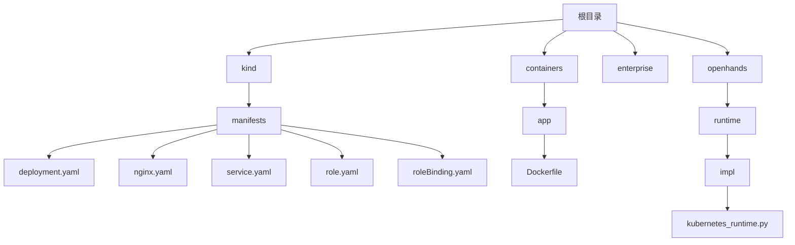
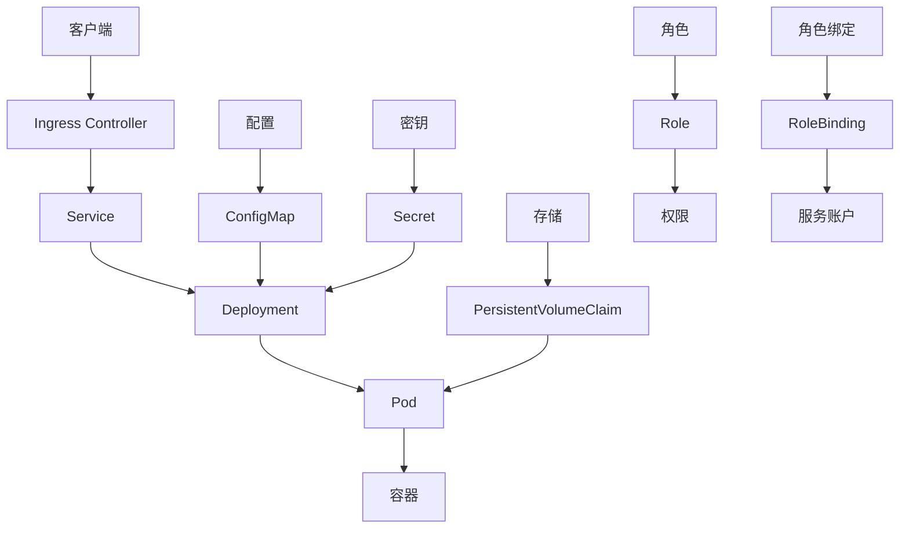
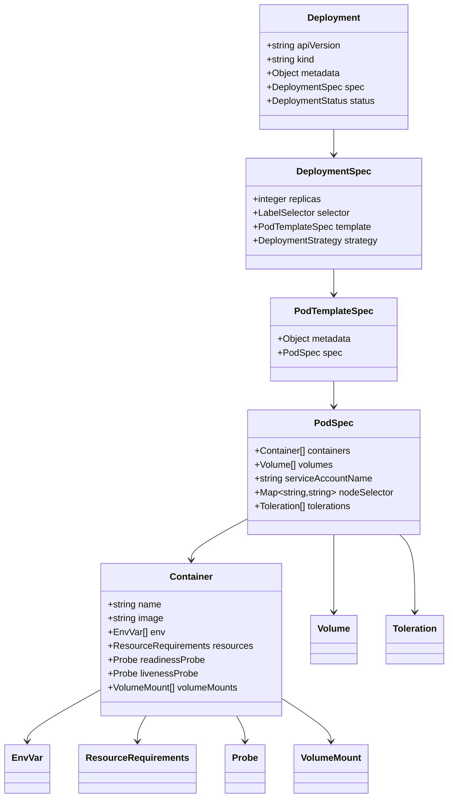
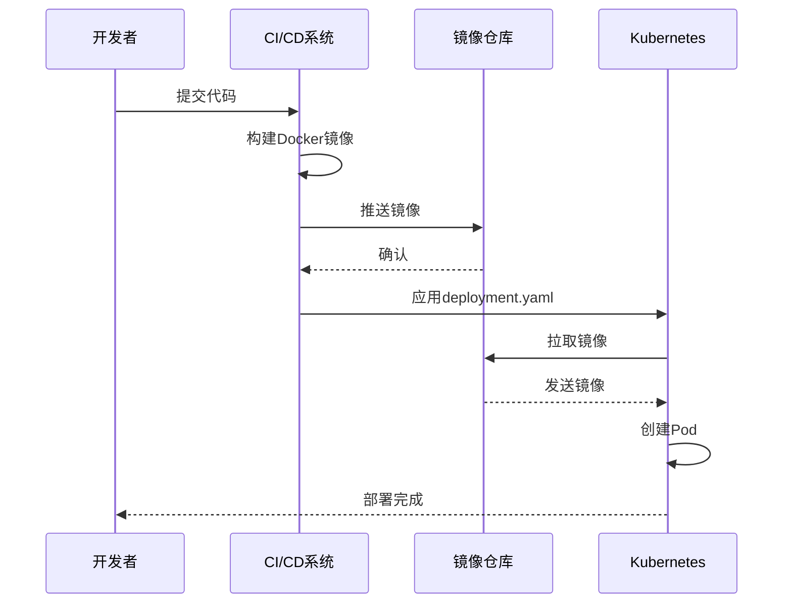
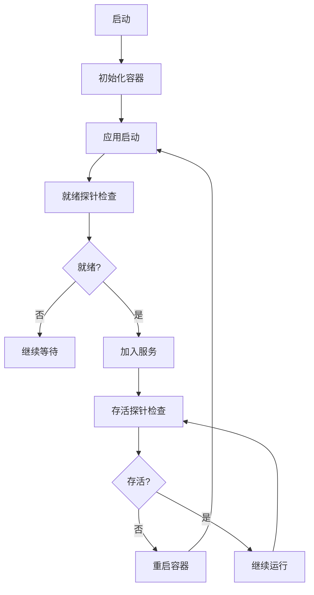
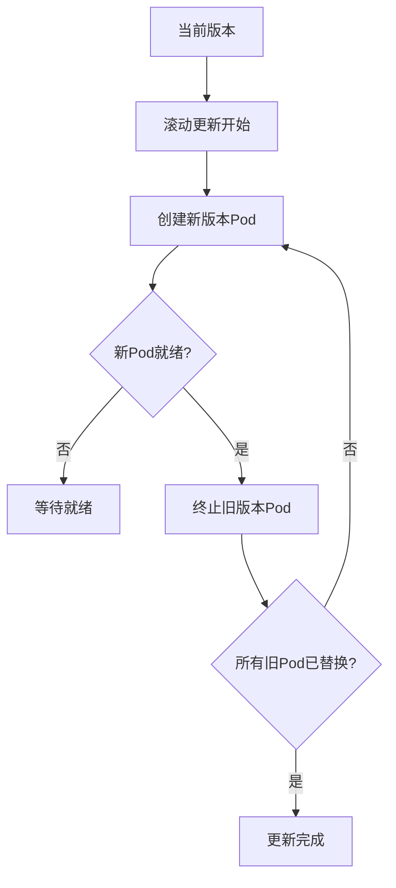
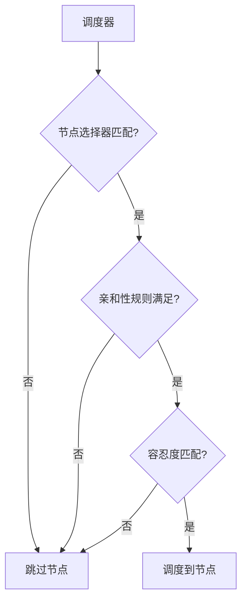
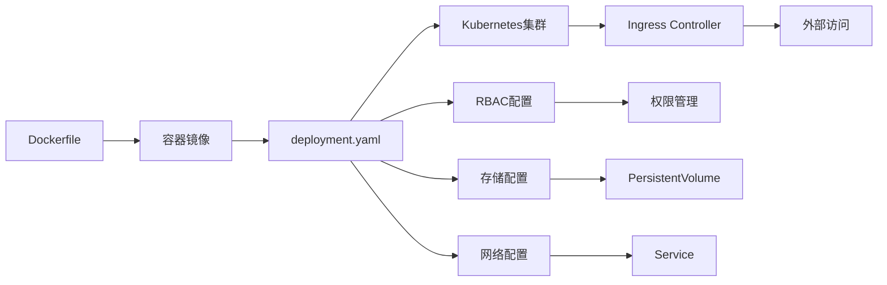

# 工作负载部署

<cite>
**本文档中引用的文件**  
- [deployment.yaml](file://kind/manifests/deployment.yaml)
- [nginx.yaml](file://kind/manifests/nginx.yaml)
- [service.yaml](file://kind/manifests/service.yaml)
- [role.yaml](file://kind/manifests/role.yaml)
- [roleBinding.yaml](file://kind/manifests/roleBinding.yaml)
- [Dockerfile](file://containers/app/Dockerfile)
- [kubernetes_runtime.py](file://openhands/runtime/impl/kubernetes/kubernetes_runtime.py)
- [test_kubernetes_config.py](file://tests/unit/core/config/test_kubernetes_config.py)
</cite>

## 目录
1. [介绍](#介绍)
2. [项目结构](#项目结构)
3. [核心组件](#核心组件)
4. [架构概述](#架构概述)
5. [详细组件分析](#详细组件分析)
6. [依赖分析](#依赖分析)
7. [性能考虑](#性能考虑)
8. [故障排除指南](#故障排除指南)
9. [结论](#结论)

## 介绍
本指南详细介绍了基于Kubernetes的OpenHands平台工作负载部署。文档涵盖了Deployment控制器的配置参数、容器镜像配置、健康检查机制、滚动更新策略以及调度约束等关键主题。通过分析deployment.yaml文件和相关配置，为部署和管理OpenHands应用提供了全面的指导。

## 项目结构

**Diagram sources**
- [deployment.yaml](file://kind/manifests/deployment.yaml)
- [Dockerfile](file://containers/app/Dockerfile)
- [kubernetes_runtime.py](file://openhands/runtime/impl/kubernetes/kubernetes_runtime.py)

**Section sources**
- [deployment.yaml](file://kind/manifests/deployment.yaml)
- [Dockerfile](file://containers/app/Dockerfile)

## 核心组件

本节分析了Kubernetes部署的核心组件，包括Deployment控制器、服务配置、RBAC设置以及容器镜像构建。通过deployment.yaml文件定义了应用的副本数、更新策略和Pod模板，而Dockerfile则定义了容器的构建过程和运行环境。

**Section sources**
- [deployment.yaml](file://kind/manifests/deployment.yaml)
- [Dockerfile](file://containers/app/Dockerfile)

## 架构概述

**Diagram sources**
- [deployment.yaml](file://kind/manifests/deployment.yaml)
- [nginx.yaml](file://kind/manifests/nginx.yaml)
- [service.yaml](file://kind/manifests/service.yaml)
- [role.yaml](file://kind/manifests/role.yaml)
- [roleBinding.yaml](file://kind/manifests/roleBinding.yaml)

## 详细组件分析

### Deployment控制器分析

**Diagram sources**
- [deployment.yaml](file://kind/manifests/deployment.yaml)
- [kubernetes_runtime.py](file://openhands/runtime/impl/kubernetes/kubernetes_runtime.py)

#### 容器配置分析

**Diagram sources**
- [Dockerfile](file://containers/app/Dockerfile)
- [deployment.yaml](file://kind/manifests/deployment.yaml)

#### 健康检查机制

**Diagram sources**
- [deployment.yaml](file://kind/manifests/deployment.yaml)
- [readiness.py](file://enterprise/server/routes/readiness.py)

**Section sources**
- [deployment.yaml](file://kind/manifests/deployment.yaml)
- [readiness.py](file://enterprise/server/routes/readiness.py)

### 配置参数分析

#### 副本数和更新策略
Deployment控制器通过`replicas`字段定义Pod的副本数量，确保应用的高可用性。更新策略通过`strategy`字段配置，支持滚动更新和重新创建两种模式。滚动更新允许在不停机的情况下逐步替换旧版本的Pod，确保服务的连续性。

**Diagram sources**
- [deployment.yaml](file://kind/manifests/deployment.yaml)
- [kubernetes_runtime.py](file://openhands/runtime/impl/kubernetes/kubernetes_runtime.py)

#### Pod模板配置
Pod模板定义了Pod的规范，包括容器配置、卷挂载、环境变量和资源限制。通过`template.spec`字段配置Pod的运行时环境，确保每个Pod实例具有一致的配置。

**Section sources**
- [deployment.yaml](file://kind/manifests/deployment.yaml)
- [kubernetes_runtime.py](file://openhands/runtime/impl/kubernetes/kubernetes_runtime.py)

### 调度约束分析

#### 亲和性规则和容忍度
Kubernetes提供了多种调度约束机制，包括节点选择器、亲和性规则和容忍度。节点选择器通过`nodeSelector`字段将Pod调度到具有特定标签的节点上。亲和性规则提供了更灵活的调度策略，支持节点亲和性和Pod亲和性。容忍度允许Pod被调度到具有特定污点的节点上。

**Diagram sources**
- [deployment.yaml](file://kind/manifests/deployment.yaml)
- [kubernetes_runtime.py](file://openhands/runtime/impl/kubernetes/kubernetes_runtime.py)

**Section sources**
- [deployment.yaml](file://kind/manifests/deployment.yaml)
- [kubernetes_runtime.py](file://openhands/runtime/impl/kubernetes/kubernetes_runtime.py)

## 依赖分析

**Diagram sources**
- [Dockerfile](file://containers/app/Dockerfile)
- [deployment.yaml](file://kind/manifests/deployment.yaml)
- [nginx.yaml](file://kind/manifests/nginx.yaml)
- [role.yaml](file://kind/manifests/role.yaml)
- [roleBinding.yaml](file://kind/manifests/roleBinding.yaml)

**Section sources**
- [Dockerfile](file://containers/app/Dockerfile)
- [deployment.yaml](file://kind/manifests/deployment.yaml)
- [nginx.yaml](file://kind/manifests/nginx.yaml)
- [role.yaml](file://kind/manifests/role.yaml)
- [roleBinding.yaml](file://kind/manifests/roleBinding.yaml)

## 性能考虑

在部署OpenHands工作负载时，需要考虑多个性能因素。资源限制通过`resources`字段配置，包括CPU和内存的请求和限制。合理的资源配置可以避免资源争用，提高应用的稳定性和性能。此外，通过配置就绪探针和存活探针，可以确保应用的健康状态，及时发现和处理问题。

**Section sources**
- [deployment.yaml](file://kind/manifests/deployment.yaml)
- [kubernetes_runtime.py](file://openhands/runtime/impl/kubernetes/kubernetes_runtime.py)

## 故障排除指南

当部署出现问题时，可以通过以下步骤进行故障排除：
1. 检查Pod状态：使用`kubectl get pods`命令查看Pod的状态。
2. 查看日志：使用`kubectl logs`命令查看容器日志。
3. 检查事件：使用`kubectl describe pod`命令查看Pod的事件。
4. 验证配置：检查deployment.yaml文件的配置是否正确。
5. 检查资源：确认集群有足够的资源来调度Pod。

**Section sources**
- [deployment.yaml](file://kind/manifests/deployment.yaml)
- [kubernetes_runtime.py](file://openhands/runtime/impl/kubernetes/kubernetes_runtime.py)

## 结论
本指南详细介绍了OpenHands平台的Kubernetes工作负载部署。通过分析deployment.yaml文件和相关配置，提供了从容器镜像构建到应用部署的完整流程。合理的配置和管理可以确保应用的高可用性和性能，为用户提供稳定的服务。