# Kubernetes网络配置指南

<cite>
**本文档中引用的文件**
- [service.yaml](file://kind/manifests/service.yaml)
- [nginx.yaml](file://kind/manifests/nginx.yaml)
- [deployment.yaml](file://kind/manifests/deployment.yaml)
- [cluster.yaml](file://kind/cluster.yaml)
- [kubernetes_config.py](file://openhands/core/config/kubernetes_config.py)
- [kubernetes_runtime.py](file://openhands/runtime/impl/kubernetes/kubernetes_runtime.py)
- [role.yaml](file://kind/manifests/role.yaml)
- [roleBinding.yaml](file://kind/manifests/roleBinding.yaml)
- [test_kubernetes_config.py](file://tests/unit/core/config/test_kubernetes_config.py)
</cite>

## 目录
1. [简介](#简介)
2. [项目结构概览](#项目结构概览)
3. [Service资源详解](#service资源详解)
4. [Ingress控制器配置](#ingress控制器配置)
5. [服务发现与DNS解析](#服务发现与dns解析)
6. [网络策略与安全配置](#网络策略与安全配置)
7. [负载均衡与会话保持](#负载均衡与会话保持)
8. [外部访问配置](#外部访问配置)
9. [性能优化与监控](#性能优化与监控)
10. [故障排除指南](#故障排除指南)
11. [最佳实践](#最佳实践)

## 简介

本指南基于OpenHands项目的Kubernetes网络配置，详细介绍了如何在Kubernetes环境中配置网络服务、负载均衡、Ingress控制器和安全策略。通过分析项目中的实际配置文件，我们将深入探讨各种网络配置模式及其应用场景。

## 项目结构概览

OpenHands项目提供了完整的Kubernetes网络配置示例，包括以下关键组件：

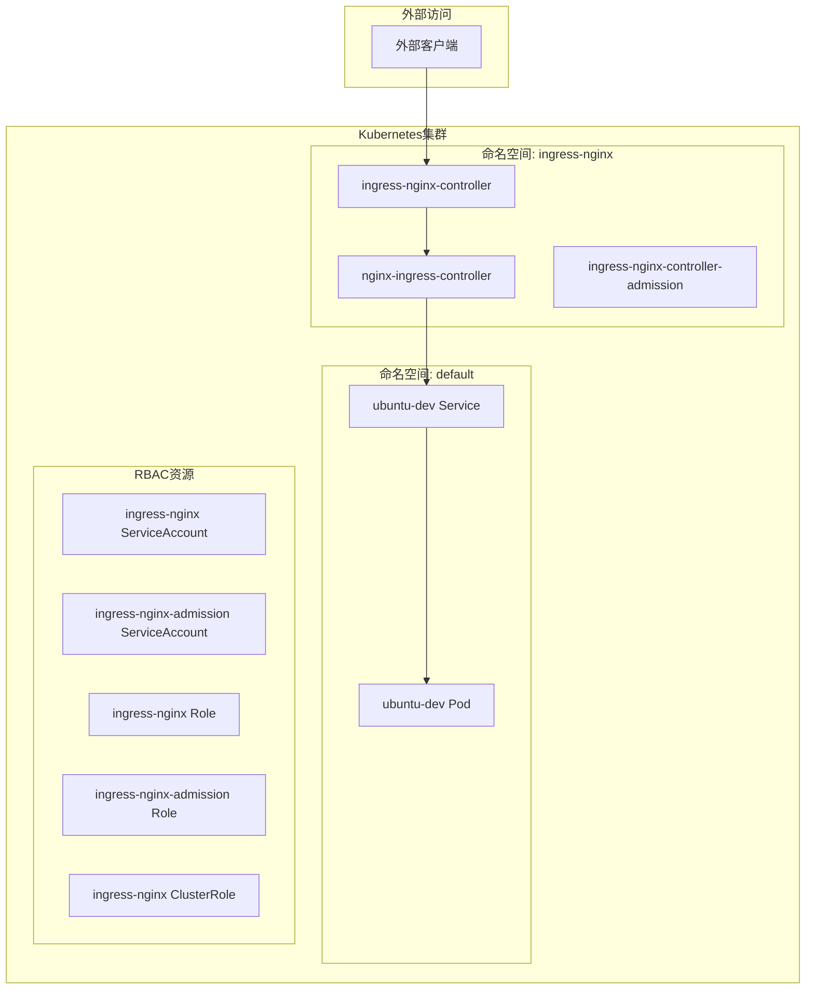

**图表来源**
- [nginx.yaml](file://kind/manifests/nginx.yaml#L1-L679)
- [service.yaml](file://kind/manifests/service.yaml#L1-L13)
- [deployment.yaml](file://kind/manifests/deployment.yaml#L1-L20)

**章节来源**
- [nginx.yaml](file://kind/manifests/nginx.yaml#L1-L679)
- [service.yaml](file://kind/manifests/service.yaml#L1-L13)
- [deployment.yaml](file://kind/manifests/deployment.yaml#L1-L20)

## Service资源详解

### Service类型配置

Kubernetes提供了多种Service类型，每种类型适用于不同的网络需求场景：

#### ClusterIP Service（默认类型）

ClusterIP是默认的Service类型，为Pod提供内部集群访问的虚拟IP地址。

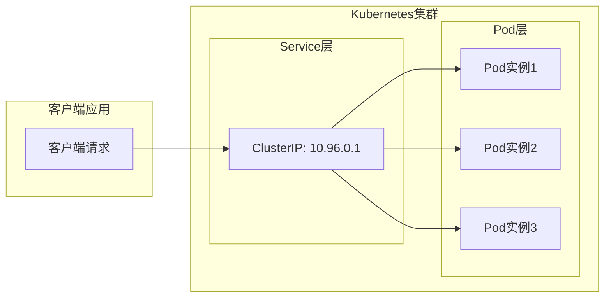

**图表来源**
- [service.yaml](file://kind/manifests/service.yaml#L1-L13)

#### NodePort Service

NodePort类型在每个节点上开放一个端口，允许从集群外部访问Service。

#### LoadBalancer Service

LoadBalancer类型用于云环境，自动创建外部负载均衡器。

### Service选择器配置

Service通过标签选择器关联到特定的Pod：

| 配置项 | 描述 | 示例值 |
|--------|------|--------|
| `selector` | 标签选择器，匹配Pod的标签 | `app: ubuntu-dev` |
| `ports` | 定义Service暴露的端口 | `port: 8099, targetPort: 3000` |
| `protocol` | 协议类型 | `TCP` |
| `type` | Service类型 | `ClusterIP` |

**章节来源**
- [service.yaml](file://kind/manifests/service.yaml#L1-L13)

## Ingress控制器配置

### Nginx Ingress控制器架构

OpenHands项目使用官方的Nginx Ingress控制器作为入口网关：

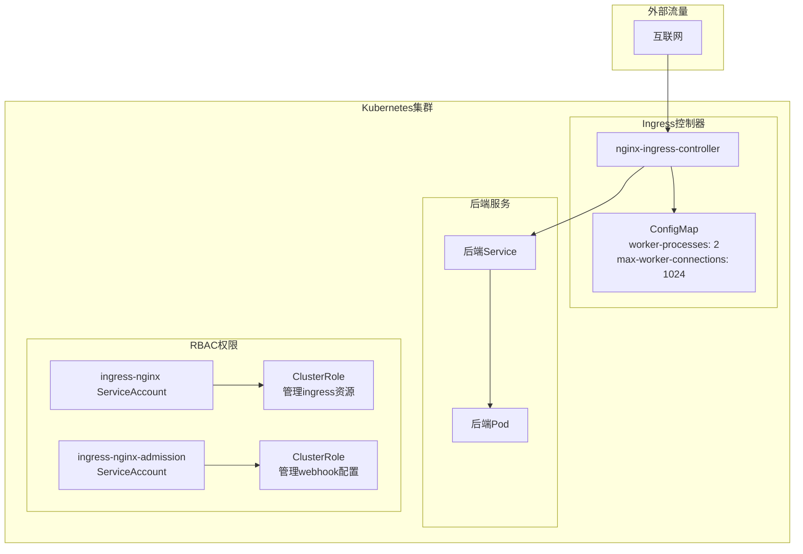

**图表来源**
- [nginx.yaml](file://kind/manifests/nginx.yaml#L392-L679)

### Ingress控制器配置参数

| 参数 | 值 | 说明 |
|------|-----|------|
| `worker-processes` | 2 | 工作进程数，设置为较低值以节省资源 |
| `max-worker-connections` | 1024 | 每个工作进程的最大连接数 |
| `controller-class` | k8s.io/ingress-nginx | 控制器类标识符 |
| `ingress-class` | nginx | Ingress类名 |
| `publish-status-address` | localhost | 状态发布地址 |

### Ingress规则配置

Ingress控制器支持复杂的路由规则配置：

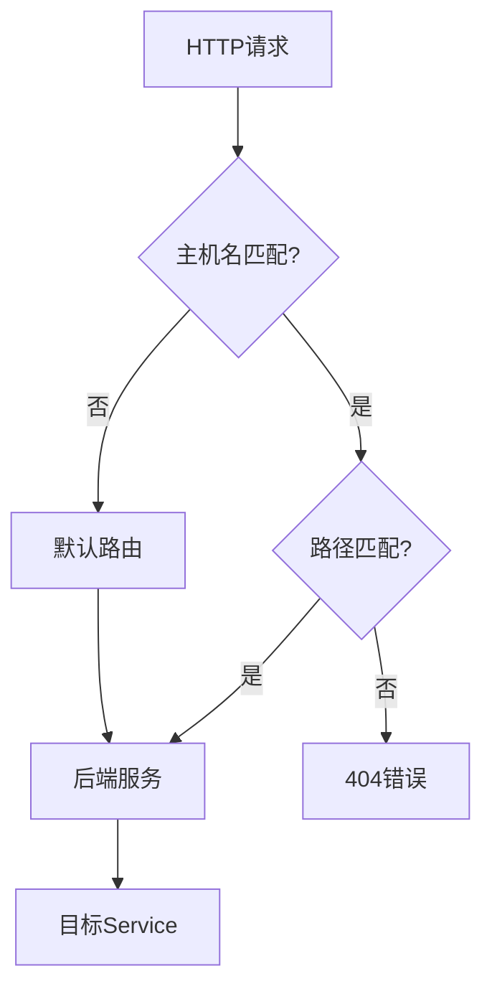

**图表来源**
- [kubernetes_runtime.py](file://openhands/runtime/impl/kubernetes/kubernetes_runtime.py#L579-L613)

**章节来源**
- [nginx.yaml](file://kind/manifests/nginx.yaml#L392-L679)
- [kubernetes_runtime.py](file://openhands/runtime/impl/kubernetes/kubernetes_runtime.py#L579-L613)

## 服务发现与DNS解析

### Kubernetes DNS架构

Kubernetes集群内置DNS服务，提供Pod和Service的名称解析：

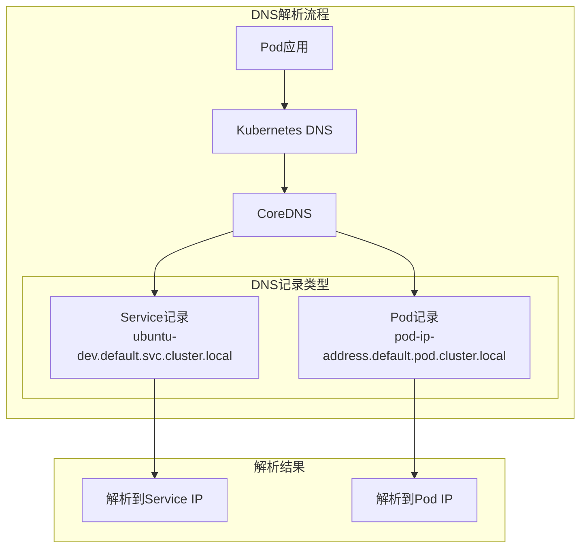

### DNS解析配置

| 解析类型 | 格式 | 示例 |
|----------|------|------|
| Service解析 | `{service-name}.{namespace}.svc.cluster.local` | `ubuntu-dev.default.svc.cluster.local` |
| Pod解析 | `{pod-ip}.{namespace}.pod.cluster.local` | `10-244-0-2.default.pod.cluster.local` |
| 跨命名空间 | `{service-name}.{namespace}.svc.cluster.local` | `ubuntu-dev.production.svc.cluster.local` |

### 服务发现实现

Kubernetes Runtime通过以下方式实现服务发现：

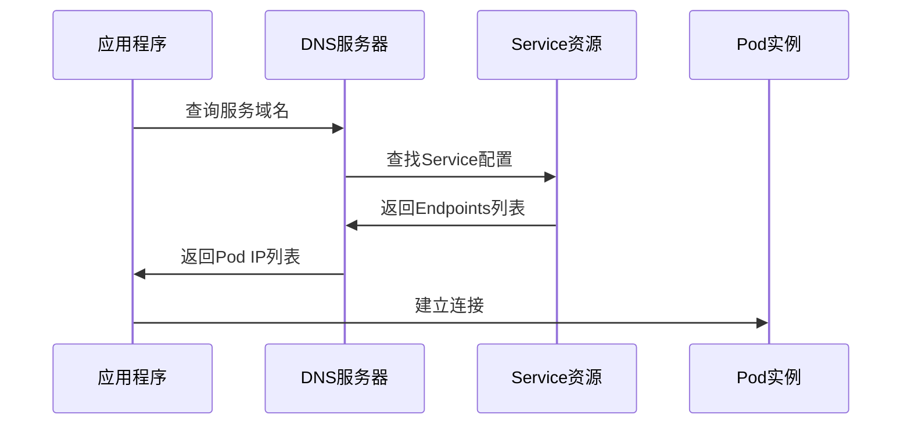

**图表来源**
- [kubernetes_runtime.py](file://openhands/runtime/impl/kubernetes/kubernetes_runtime.py#L114-L137)

**章节来源**
- [kubernetes_runtime.py](file://openhands/runtime/impl/kubernetes/kubernetes_runtime.py#L114-L137)

## 网络策略与安全配置

### RBAC权限控制

OpenHands项目实现了细粒度的RBAC权限控制：

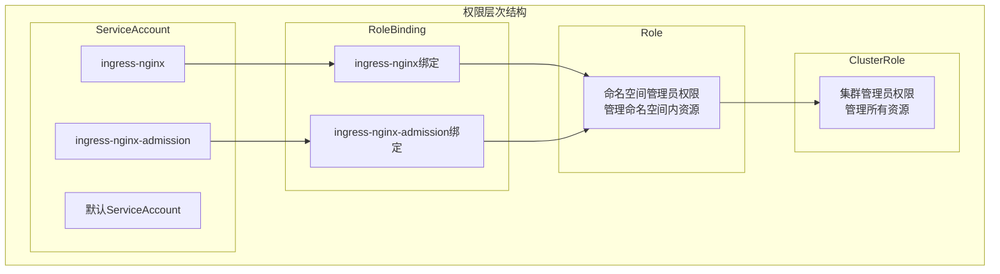

**图表来源**
- [nginx.yaml](file://kind/manifests/nginx.yaml#L145-L321)
- [role.yaml](file://kind/manifests/role.yaml#L1-L14)

### 安全上下文配置

| 配置项 | 值 | 安全意义 |
|--------|-----|----------|
| `allowPrivilegeEscalation` | false | 禁止特权提升 |
| `readOnlyRootFilesystem` | false | 允许写入根文件系统 |
| `runAsNonRoot` | true | 强制非root用户运行 |
| `runAsUser` | 101 | 使用指定用户ID |
| `runAsGroup` | 82 | 使用指定组ID |
| `capabilities` | NET_BIND_SERVICE | 仅允许绑定系统端口 |

### 网络安全策略

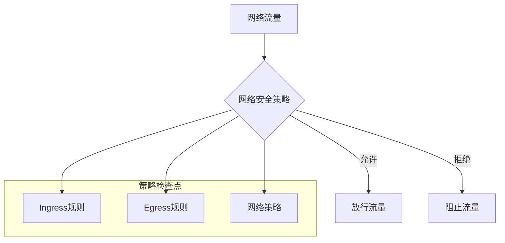

**章节来源**
- [nginx.yaml](file://kind/manifests/nginx.yaml#L145-L321)
- [role.yaml](file://kind/manifests/role.yaml#L1-L14)
- [roleBinding.yaml](file://kind/manifests/roleBinding.yaml#L1-L14)

## 负载均衡与会话保持

### 负载均衡算法

Kubernetes Service支持多种负载均衡算法：

| 算法类型 | 描述 | 适用场景 |
|----------|------|----------|
| Round Robin | 轮询分发请求 | 默认算法，适合大多数场景 |
| Random | 随机选择后端 | 简单随机负载均衡 |
| Least Connections | 最少连接数 | 适合长连接场景 |
| IP Hash | 基于IP哈希 | 需要会话保持的场景 |

### 会话保持配置

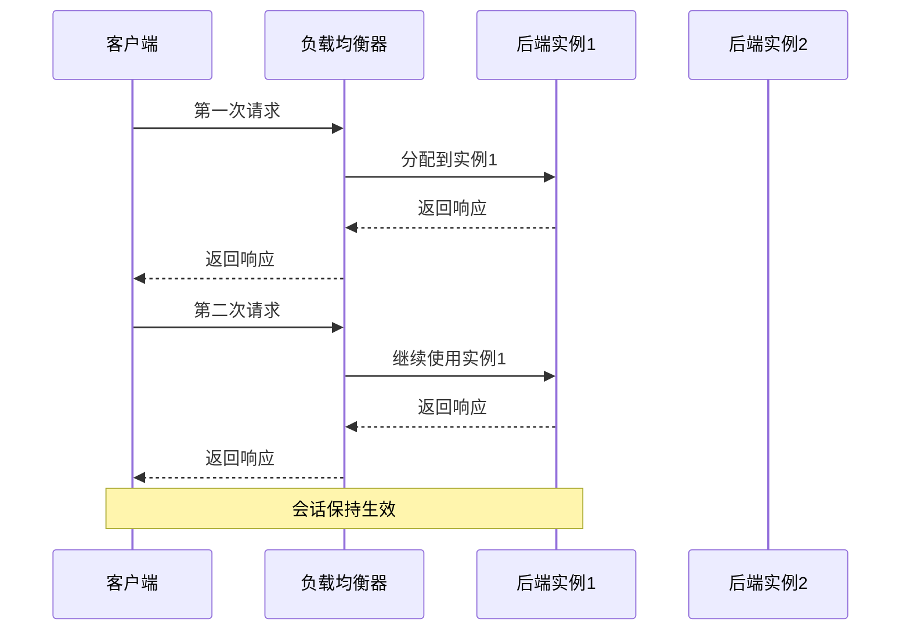

### 健康检查配置

| 检查类型 | 配置参数 | 说明 |
|----------|----------|------|
| Liveness Probe | `initialDelaySeconds: 10` | 初始延迟时间 |
| Liveness Probe | `periodSeconds: 10` | 检查间隔 |
| Liveness Probe | `failureThreshold: 5` | 失败阈值 |
| Readiness Probe | `initialDelaySeconds: 10` | 初始延迟 |
| Readiness Probe | `periodSeconds: 10` | 检查频率 |
| Readiness Probe | `successThreshold: 1` | 成功阈值 |

**章节来源**
- [nginx.yaml](file://kind/manifests/nginx.yaml#L454-L486)

## 外部访问配置

### Ingress域名配置

OpenHands项目支持自定义Ingress域名配置：

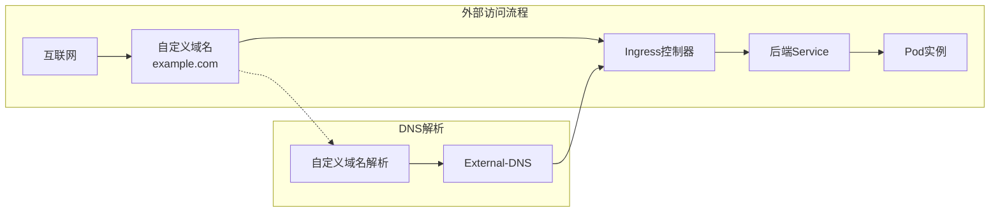

**图表来源**
- [kubernetes_runtime.py](file://openhands/runtime/impl/kubernetes/kubernetes_runtime.py#L606-L607)

### TLS证书配置

| 配置项 | 说明 | 示例 |
|--------|------|------|
| `ingress_tls_secret` | TLS Secret名称 | `tls-secret` |
| `annotations` | Ingress注解 | `'external-dns.alpha.kubernetes.io/hostname': 'example.com'` |
| `spec.tls` | TLS配置块 | 包含域名和Secret映射 |

### 外部DNS集成

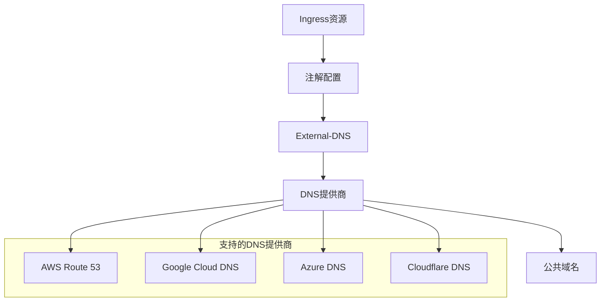

**章节来源**
- [kubernetes_runtime.py](file://openhands/runtime/impl/kubernetes/kubernetes_runtime.py#L606-L607)
- [kubernetes_config.py](file://openhands/core/config/kubernetes_config.py#L48-L49)

## 性能优化与监控

### 网络性能优化

OpenHands项目采用了多项网络性能优化措施：

| 优化项 | 配置值 | 效果 |
|--------|--------|------|
| Worker Processes | 2 | 减少资源消耗 |
| Max Worker Connections | 1024 | 提高并发处理能力 |
| CPU Requests | 300m | 合理分配计算资源 |
| Memory Limits | 512Mi | 防止内存溢出 |
| Image Pull Policy | IfNotPresent | 减少镜像拉取开销 |

### 资源限制配置

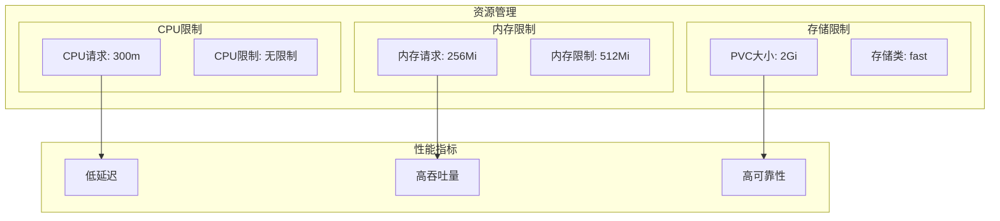

**图表来源**
- [nginx.yaml](file://kind/manifests/nginx.yaml#L487-L492)

### 监控与告警

| 监控指标 | 检查方法 | 告警阈值 |
|----------|----------|----------|
| Pod可用性 | Readiness Probe | 连续失败3次 |
| 响应时间 | Liveness Probe | 超过1秒 |
| 内存使用率 | 资源限制 | 超过80% |
| CPU使用率 | 资源限制 | 超过80% |

**章节来源**
- [nginx.yaml](file://kind/manifests/nginx.yaml#L487-L492)
- [kubernetes_config.py](file://openhands/core/config/kubernetes_config.py#L35-L43)

## 故障排除指南

### 常见网络问题诊断

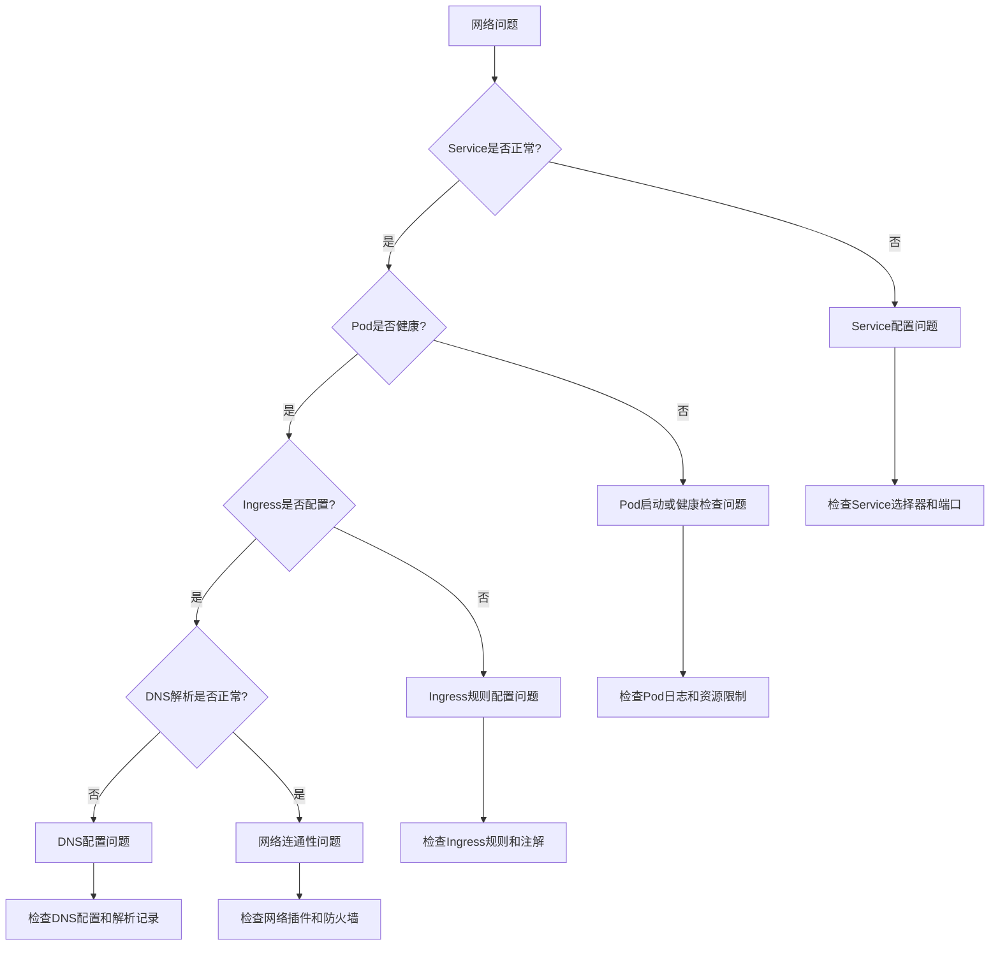

### 排查命令集

| 场景 | 排查命令 | 说明 |
|------|----------|------|
| Service状态 | `kubectl get svc -n ingress-nginx` | 检查Service状态 |
| Pod状态 | `kubectl get pods -n ingress-nginx` | 检查Pod运行状态 |
| Ingress状态 | `kubectl get ingress -n ingress-nginx` | 检查Ingress配置 |
| DNS解析 | `kubectl exec -it <pod> -- nslookup <service>` | 测试DNS解析 |
| 网络连通性 | `kubectl exec -it <pod> -- curl <url>` | 测试网络连通性 |

### 日志分析

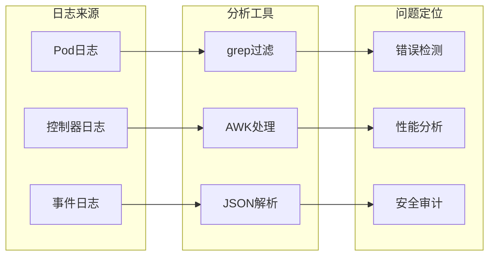

**章节来源**
- [nginx.yaml](file://kind/manifests/nginx.yaml#L454-L486)

## 最佳实践

### 网络设计原则

1. **最小权限原则**: 为ServiceAccount分配最小必要的权限
2. **网络隔离**: 使用命名空间和网络策略隔离不同环境
3. **高可用性**: 部署多个Ingress控制器实例
4. **监控告警**: 建立完善的网络监控体系
5. **安全防护**: 实施多层安全防护机制

### 配置模板

以下是推荐的网络配置模板：

| 配置类别 | 推荐值 | 说明 |
|----------|--------|------|
| Service类型 | ClusterIP | 内部服务优先使用ClusterIP |
| Ingress类型 | LoadBalancer | 生产环境使用LoadBalancer |
| 副本数量 | 2-3个 | 确保高可用性 |
| 资源限制 | CPU: 500m, Memory: 512Mi | 平衡性能和资源 |
| 健康检查 | 10秒间隔, 3次失败 | 及时发现问题 |

### 安全配置清单

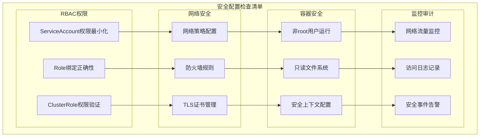

### 性能调优建议

1. **合理配置资源限制**: 避免资源浪费和过度限制
2. **优化DNS查询**: 使用本地DNS缓存减少查询延迟
3. **启用连接复用**: 在应用层面实现HTTP/2或连接池
4. **监控网络指标**: 建立完善的监控告警体系
5. **定期安全审计**: 检查网络配置的安全性和合规性

通过遵循这些最佳实践，可以构建一个高性能、高可用、高安全性的Kubernetes网络环境，为应用程序提供稳定可靠的网络服务。