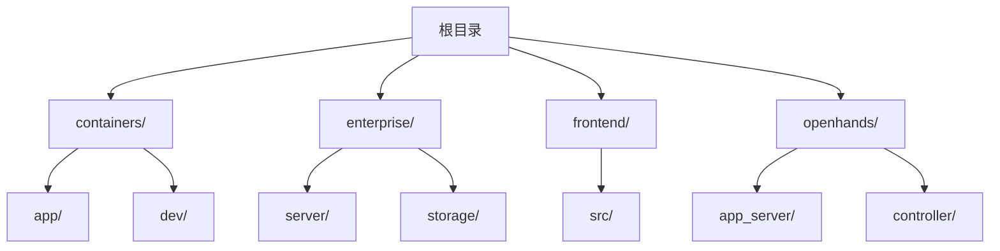
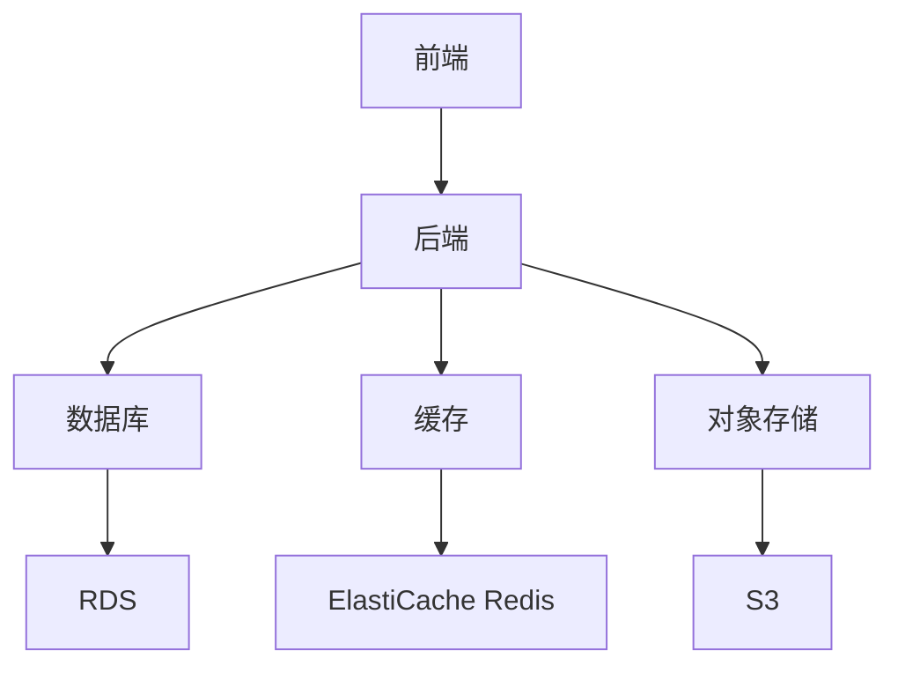
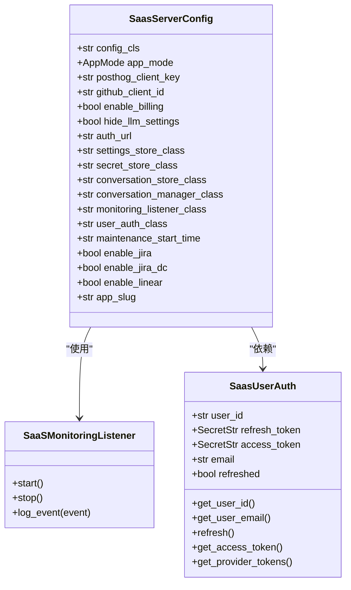
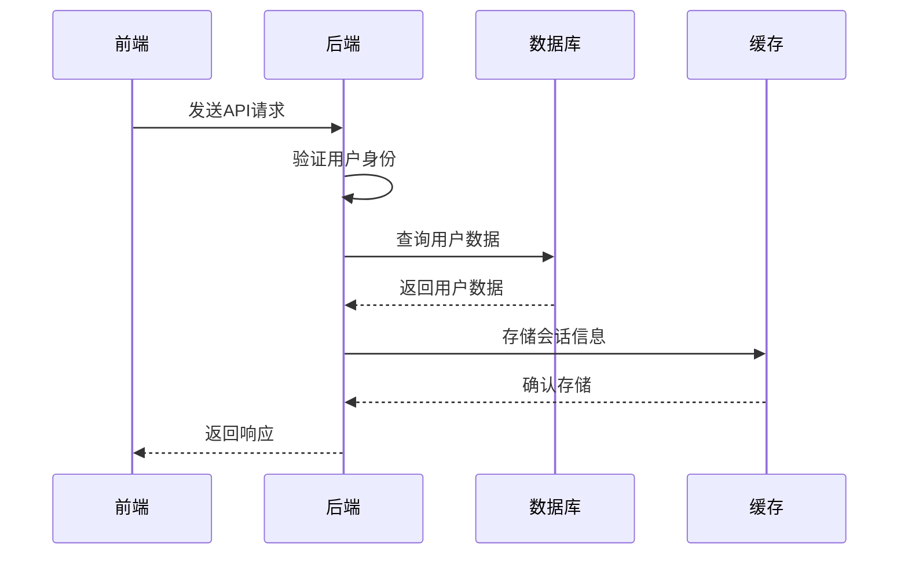
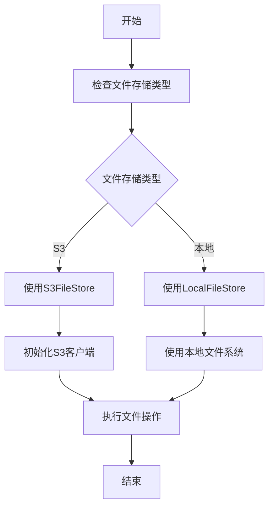
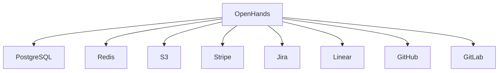

# AWS部署指南

<cite>
**本文档中引用的文件**  
- [Dockerfile](file://containers/app/Dockerfile)
- [Dockerfile](file://enterprise/Dockerfile)
- [docker-compose.yml](file://docker-compose.yml)
- [saas_server.py](file://enterprise/saas_server.py)
- [config.py](file://enterprise/server/config.py)
- [s3.py](file://openhands/storage/s3.py)
- [redis.py](file://enterprise/storage/redis.py)
</cite>

## 目录
1. [简介](#简介)
2. [项目结构](#项目结构)
3. [核心组件](#核心组件)
4. [架构概述](#架构概述)
5. [详细组件分析](#详细组件分析)
6. [依赖分析](#依赖分析)
7. [性能考虑](#性能考虑)
8. [故障排除指南](#故障排除指南)
9. [结论](#结论)
10. [附录](#附录)（如有必要）

## 简介
OpenHands是一个由AI驱动的软件开发代理平台，能够执行人类开发者可以完成的任何任务：修改代码、运行命令、浏览网页、调用API等。本指南详细说明了如何在Amazon Web Services上部署OpenHands，包括创建EC2实例、配置安全组和VPC网络、将Docker镜像推送至Amazon ECR、使用ECS或EKS进行容器编排、设置RDS数据库实例、ElastiCache Redis缓存和S3存储桶、使用IAM角色进行安全访问控制、负载均衡器配置、自动伸缩策略和CloudWatch监控集成。

## 项目结构
OpenHands项目结构包括多个关键目录，如`containers/`用于Docker配置，`enterprise/`包含企业级功能，`frontend/`包含前端代码，`openhands/`包含核心应用代码。部署主要涉及`containers/`目录下的Docker配置和`enterprise/`目录下的企业级服务配置。

**Diagram sources**
- [containers/app/Dockerfile](file://containers/app/Dockerfile)
- [enterprise/Dockerfile](file://enterprise/Dockerfile)

**Section sources**
- [containers/app/Dockerfile](file://containers/app/Dockerfile)
- [enterprise/Dockerfile](file://enterprise/Dockerfile)

## 核心组件
OpenHands的核心组件包括前端界面、后端服务、数据库存储和缓存系统。前端使用React构建，后端使用FastAPI框架，数据库使用PostgreSQL，缓存使用Redis。企业版还集成了Stripe支付、Jira、Linear等第三方服务。

**Section sources**
- [saas_server.py](file://enterprise/saas_server.py)
- [config.py](file://enterprise/server/config.py)

## 架构概述
OpenHands的架构包括前端、后端、数据库、缓存和对象存储。前端通过API与后端通信，后端处理业务逻辑并与数据库和缓存交互。对象存储用于存储用户上传的文件。

**Diagram sources**
- [saas_server.py](file://enterprise/saas_server.py)
- [config.py](file://enterprise/server/config.py)

## 详细组件分析

### 后端服务分析
后端服务使用FastAPI框架构建，处理所有API请求。它包括用户认证、会话管理、数据库操作和第三方服务集成。

#### 类图

**Diagram sources**
- [config.py](file://enterprise/server/config.py)
- [saas_server.py](file://enterprise/saas_server.py)

#### 序列图

**Diagram sources**
- [saas_server.py](file://enterprise/saas_server.py)
- [config.py](file://enterprise/server/config.py)

### 存储系统分析
OpenHands使用多种存储系统，包括关系型数据库、缓存和对象存储。

#### 流程图

**Diagram sources**
- [s3.py](file://openhands/storage/s3.py)
- [redis.py](file://enterprise/storage/redis.py)

**Section sources**
- [s3.py](file://openhands/storage/s3.py)
- [redis.py](file://enterprise/storage/redis.py)

## 依赖分析
OpenHands依赖多个外部服务和库，包括数据库、缓存、对象存储和第三方API。这些依赖通过环境变量配置，可以在部署时灵活调整。

**Diagram sources**
- [config.py](file://enterprise/server/config.py)
- [saas_server.py](file://enterprise/saas_server.py)

**Section sources**
- [config.py](file://enterprise/server/config.py)
- [saas_server.py](file://enterprise/saas_server.py)

## 性能考虑
在AWS上部署OpenHands时，需要考虑性能优化。建议使用EKS进行容器编排，以实现自动伸缩和高可用性。数据库使用RDS PostgreSQL，配置适当的实例类型和存储。缓存使用ElastiCache Redis，提高数据访问速度。对象存储使用S3，确保文件的高可用性和持久性。

## 故障排除指南
部署过程中可能遇到的问题包括网络配置错误、权限不足、服务启动失败等。建议使用CloudWatch监控日志，及时发现和解决问题。对于数据库连接问题，检查安全组和网络ACL配置。对于缓存问题，检查Redis实例状态和网络连接。

**Section sources**
- [config.py](file://enterprise/server/config.py)
- [saas_server.py](file://enterprise/saas_server.py)

## 结论
通过本指南，您可以在AWS上成功部署OpenHands，利用其强大的AI功能提升软件开发效率。建议使用EKS进行容器编排，RDS作为数据库，ElastiCache Redis作为缓存，S3作为对象存储，并使用IAM角色进行安全访问控制。