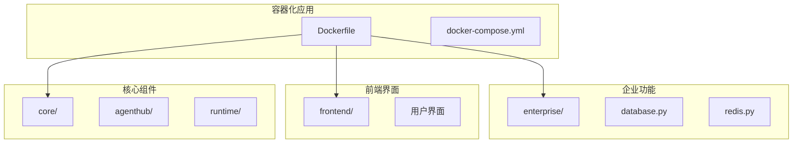
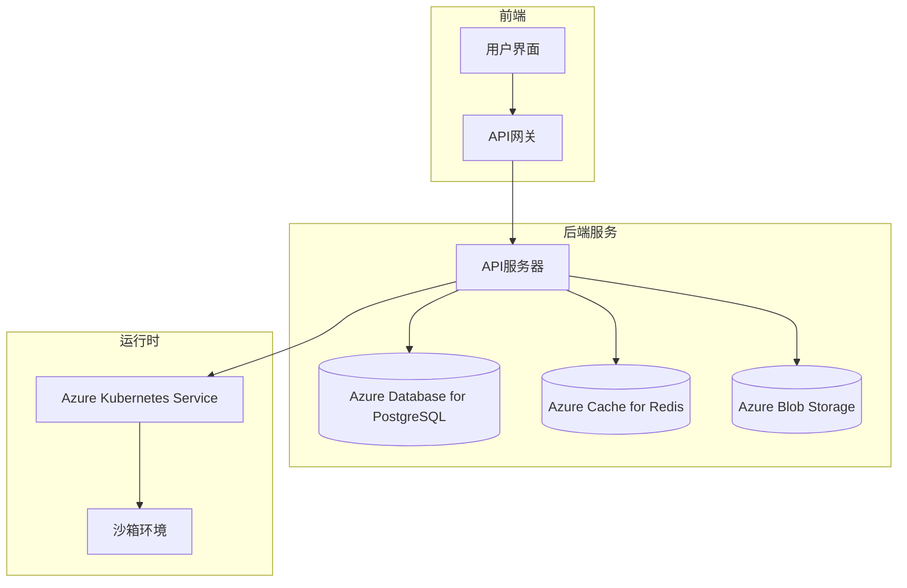
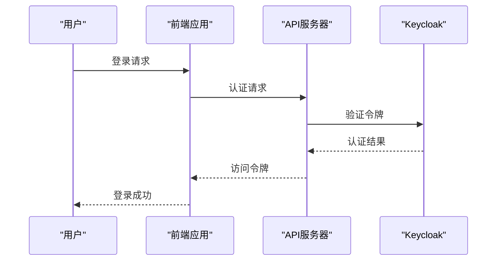
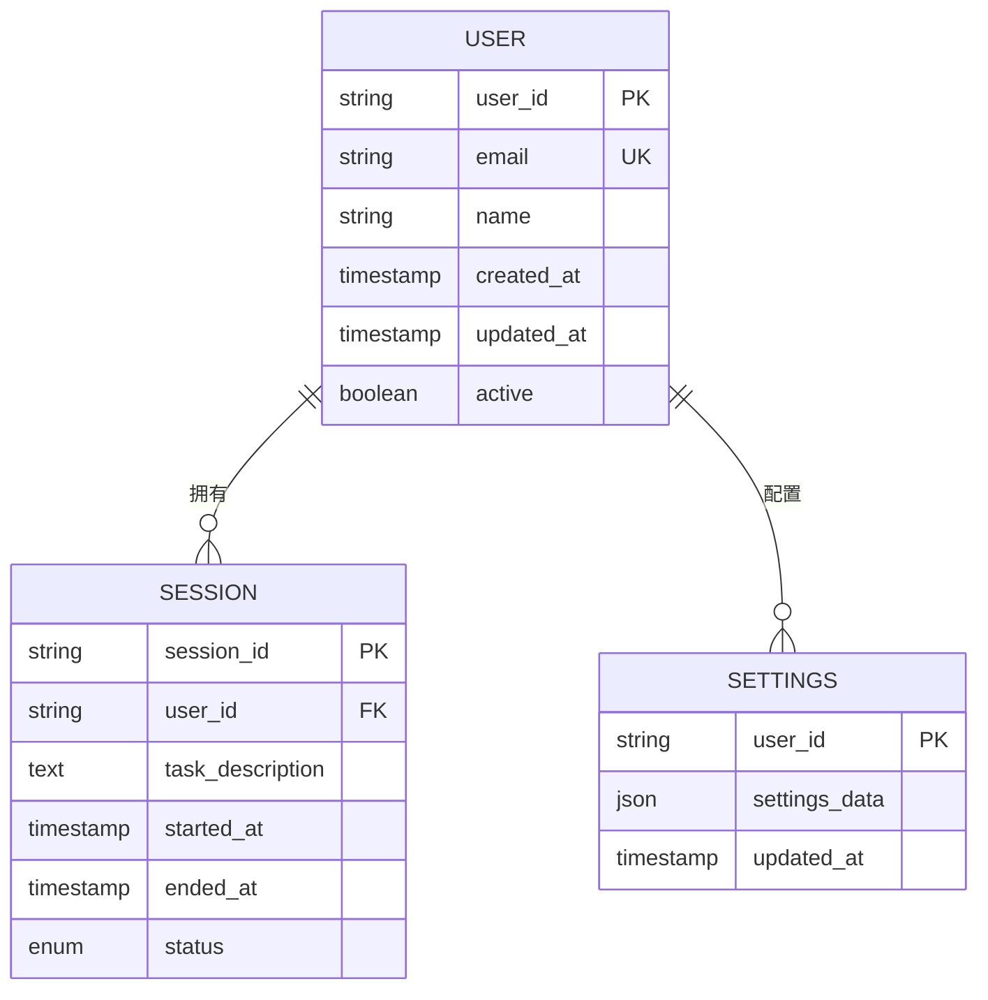
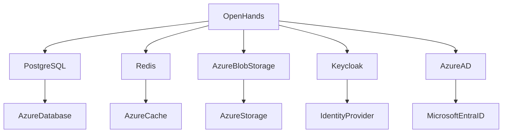

# Azure部署指南

<cite>
**本文档中引用的文件**   
- [README.md](file://README.md)
- [docker-compose.yml](file://docker-compose.yml)
- [containers/app/Dockerfile](file://containers/app/Dockerfile)
- [enterprise/Dockerfile](file://enterprise/Dockerfile)
- [config.template.toml](file://config.template.toml)
- [enterprise/storage/database.py](file://enterprise/storage/database.py)
- [enterprise/storage/redis.py](file://enterprise/storage/redis.py)
- [enterprise/server/saas_user_auth.py](file://enterprise/server/saas_user_auth.py)
- [enterprise/server/auth/keycloak_manager.py](file://enterprise/server/auth/keycloak_manager.py)
</cite>

## 目录
1. [简介](#简介)
2. [项目结构](#项目结构)
3. [核心组件](#核心组件)
4. [架构概述](#架构概述)
5. [详细组件分析](#详细组件分析)
6. [依赖分析](#依赖分析)
7. [性能考虑](#性能考虑)
8. [故障排除指南](#故障排除指南)
9. [结论](#结论)
10. [附录](#附录) (如有必要)

## 简介
OpenHands是一个由AI驱动的软件开发代理平台，能够执行人类开发者可以完成的任何任务，包括修改代码、运行命令、浏览网页、调用API等。本指南详细介绍了如何在Microsoft Azure上部署OpenHands，涵盖从虚拟机创建到容器编排、数据库集成和身份验证配置的完整流程。

## 项目结构
OpenHands项目采用模块化设计，主要包含容器化应用、企业级功能、前端界面和核心AI代理组件。项目通过Docker容器化部署，支持本地开发和云环境部署。



**Diagram sources**
- [docker-compose.yml](file://docker-compose.yml#L2-L24)
- [containers/app/Dockerfile](file://containers/app/Dockerfile#L1-L96)

**Section sources**
- [README.md](file://README.md#L1-L185)
- [docker-compose.yml](file://docker-compose.yml#L1-L24)

## 核心组件
OpenHands的核心组件包括AI代理引擎、运行时环境、存储系统和企业级功能模块。AI代理能够理解开发任务并自主执行代码修改、测试运行等操作。运行时环境提供隔离的沙箱环境，确保操作的安全性。存储系统管理会话数据、用户设置和认证信息。

**Section sources**
- [config.template.toml](file://config.template.toml#L1-L543)
- [enterprise/Dockerfile](file://enterprise/Dockerfile#L1-L41)

## 架构概述
OpenHands采用微服务架构，通过容器化部署实现组件解耦。系统架构包括前端界面、API服务器、数据库、缓存服务和运行时沙箱。Azure部署时，建议使用Azure Kubernetes Service进行容器编排，Azure Database for PostgreSQL作为主数据库，Azure Cache for Redis作为缓存服务。



**Diagram sources**
- [enterprise/storage/database.py](file://enterprise/storage/database.py#L1-L115)
- [enterprise/storage/redis.py](file://enterprise/storage/redis.py#L1-L24)

## 详细组件分析

### 身份验证组件分析
OpenHands企业版使用Keycloak进行身份验证管理，支持OAuth2和OpenID Connect协议。系统通过JWT令牌进行会话管理，集成Azure Active Directory作为身份提供商。



**Diagram sources**
- [enterprise/server/saas_user_auth.py](file://enterprise/server/saas_user_auth.py#L1-L324)
- [enterprise/server/auth/keycloak_manager.py](file://enterprise/server/auth/keycloak_manager.py#L1-L51)

**Section sources**
- [enterprise/server/saas_user_auth.py](file://enterprise/server/saas_user_auth.py#L1-L324)
- [enterprise/server/auth/keycloak_manager.py](file://enterprise/server/auth/keycloak_manager.py#L1-L51)

### 数据库组件分析
OpenHands使用PostgreSQL作为主数据库，存储用户信息、会话数据和系统配置。Azure部署时，建议使用Azure Database for PostgreSQL，配置高可用性和自动备份。



**Diagram sources**
- [enterprise/storage/database.py](file://enterprise/storage/database.py#L1-L115)

**Section sources**
- [enterprise/storage/database.py](file://enterprise/storage/database.py#L1-L115)

## 依赖分析
OpenHands依赖多个外部服务和库，包括数据库驱动、缓存客户端、身份验证库和云服务SDK。系统通过环境变量配置外部服务连接，支持灵活的部署配置。



**Diagram sources**
- [config.template.toml](file://config.template.toml#L1-L543)

**Section sources**
- [config.template.toml](file://config.template.toml#L1-L543)

## 性能考虑
在Azure上部署OpenHands时，需要考虑以下性能优化：
- 使用Azure Kubernetes Service的自动伸缩功能应对流量波动
- 配置Azure Database for PostgreSQL的读写分离提高数据库性能
- 使用Azure Cache for Redis缓存频繁访问的数据
- 优化Docker镜像大小减少部署时间
- 配置Application Gateway的SSL卸载减轻后端服务器负载

## 故障排除指南
常见问题及解决方案：
- **数据库连接失败**：检查网络安全组规则，确保应用服务器可以访问数据库端口
- **身份验证失败**：验证Keycloak配置和Azure AD集成设置
- **性能瓶颈**：监控Azure Monitor指标，调整Kubernetes节点配置
- **存储空间不足**：配置Azure Blob Storage生命周期管理自动清理旧数据
- **网络延迟**：将所有组件部署在同一Azure区域，使用内部负载均衡器

**Section sources**
- [enterprise/storage/database.py](file://enterprise/storage/database.py#L1-L115)
- [enterprise/storage/redis.py](file://enterprise/storage/redis.py#L1-L24)

## 结论
在Azure上部署OpenHands需要综合考虑计算、存储、网络和安全等多个方面。通过合理使用Azure Kubernetes Service、Azure Database for PostgreSQL、Azure Cache for Redis等服务，可以构建一个高可用、高性能的AI开发代理平台。建议使用Infrastructure as Code工具如Terraform管理Azure资源，确保部署的一致性和可重复性。

## 附录
### Azure资源命名约定
- 虚拟网络: `vnet-openhands-prod`
- 子网: `snet-openhands-app`, `snet-openhands-db`
- 网络安全组: `nsg-openhands-app`, `nsg-openhands-db`
- Azure Kubernetes Service: `aks-openhands-cluster`
- Azure Database for PostgreSQL: `db-openhands-postgres`
- Azure Cache for Redis: `cache-openhands-redis`
- Azure Blob Storage: `stg-openhands-blob`

### 环境变量配置
```bash
# 数据库配置
DB_HOST=your-postgres-server.postgres.database.azure.com
DB_PORT=5432
DB_USER=your-admin-user
DB_PASS=your-password
DB_NAME=openhands

# Redis配置
REDIS_HOST=your-redis-cache.redis.cache.azure.com
REDIS_PORT=6380
REDIS_PASSWORD=your-access-key
REDIS_SSL=true

# Azure Blob Storage配置
AZURE_STORAGE_ACCOUNT=your-storage-account
AZURE_STORAGE_KEY=your-storage-key
AZURE_CONTAINER_NAME=openhands-data

# 身份验证配置
KEYCLOAK_SERVER_URL=https://your-keycloak-server/auth
KEYCLOAK_REALM_NAME=openhands
KEYCLOAK_CLIENT_ID=openhands-client
KEYCLOAK_CLIENT_SECRET=your-client-secret
```