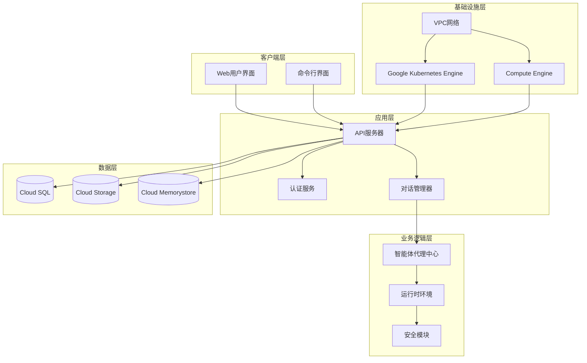
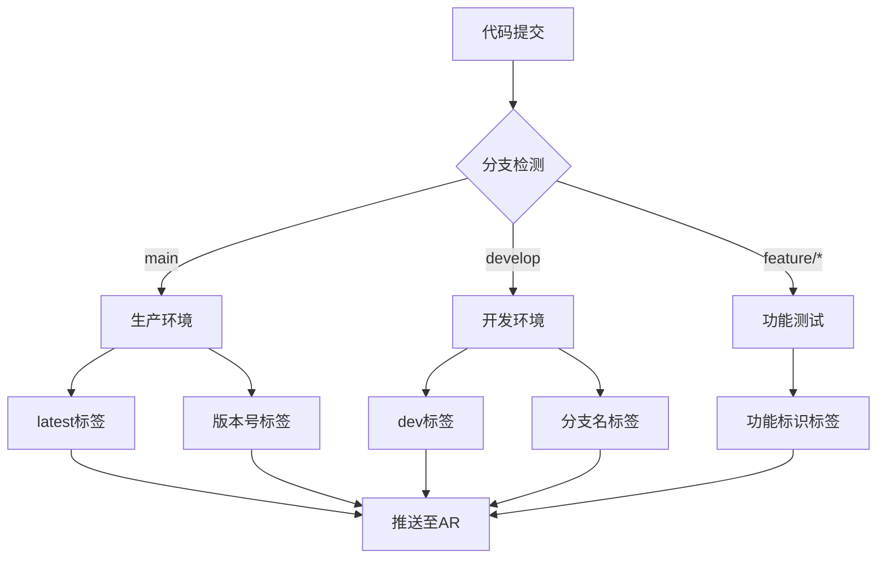
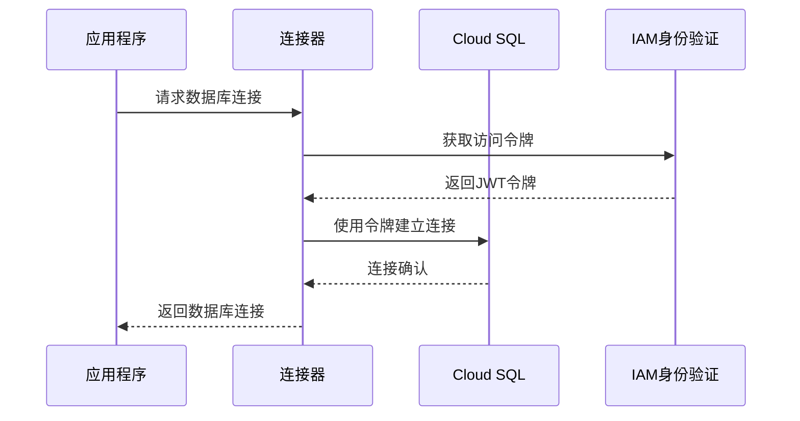
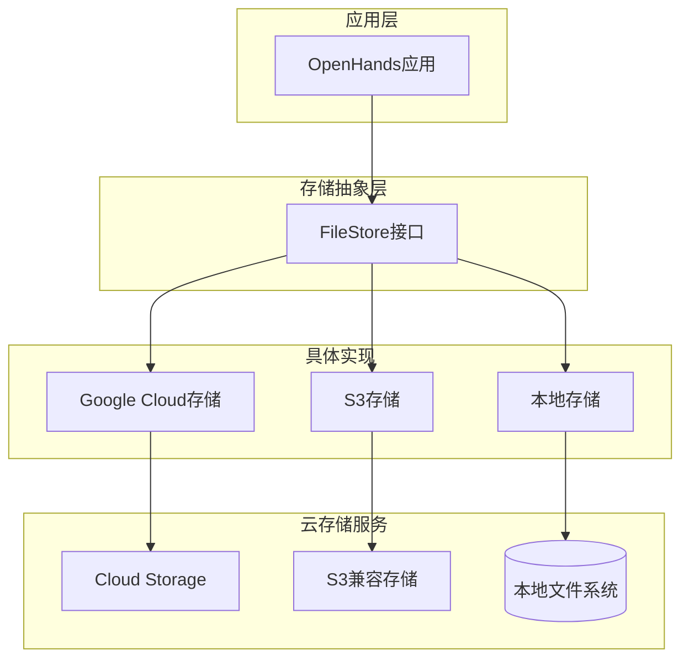
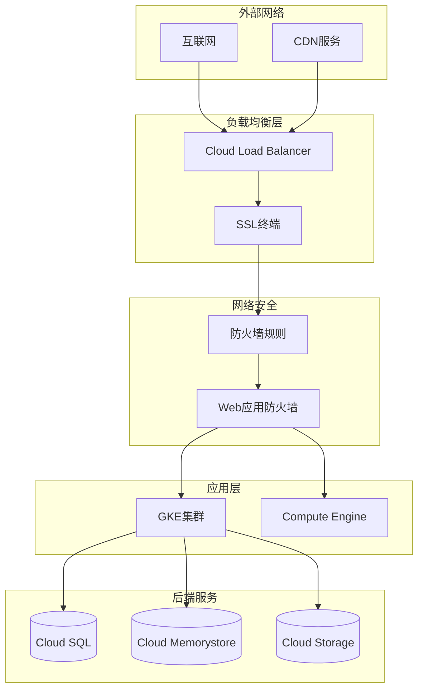
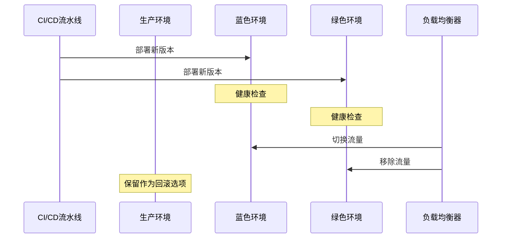

# GCP部署指南

<cite>
**本文档中引用的文件**
- [containers/app/Dockerfile](file://containers/app/Dockerfile)
- [enterprise/Dockerfile](file://enterprise/Dockerfile)
- [containers/build.sh](file://containers/build.sh)
- [docker-compose.yml](file://docker-compose.yml)
- [openhands/storage/google_cloud.py](file://openhands/storage/google_cloud.py)
- [openhands/app_server/services/db_session_injector.py](file://openhands/app_server/services/db_session_injector.py)
- [openhands/runtime/impl/kubernetes/kubernetes_runtime.py](file://openhands/runtime/impl/kubernetes/kubernetes_runtime.py)
- [kind/manifests/deployment.yaml](file://kind/manifests/deployment.yaml)
- [config.template.toml](file://config.template.toml)
- [openhands/server/monitoring.py](file://openhands/server/monitoring.py)
- [openhands/core/config/openhands_config.py](file://openhands/core/config/openhands_config.py)
- [enterprise/migrations/env.py](file://enterprise/migrations/env.py)
- [enterprise/storage/database.py](file://enterprise/storage/database.py)
- [enterprise/server/auth/sheets_client.py](file://enterprise/server/auth/sheets_client.py)
</cite>

## 目录
1. [简介](#简介)
2. [项目架构概览](#项目架构概览)
3. [GCP环境准备](#gcp环境准备)
4. [Compute Engine实例部署](#compute-engine实例部署)
5. [容器注册表配置](#容器注册表配置)
6. [Google Kubernetes Engine集群](#google-kubernetes-engine集群)
7. [数据库服务配置](#数据库服务配置)
8. [存储服务集成](#存储服务集成)
9. [网络与安全配置](#网络与安全配置)
10. [监控与日志](#监控与日志)
11. [CI/CD流水线](#cicd流水线)
12. [故障排除](#故障排除)

## 简介

本指南提供了在Google Cloud Platform (GCP) 上部署OpenHands AI平台的完整流程。OpenHands是一个基于AI的开发助手平台，支持多种部署模式，包括单机部署、容器化部署和Kubernetes集群部署。

### 主要特性
- 支持多种LLM提供商（OpenAI、Anthropic、Google等）
- 多种运行时环境（Docker、Kubernetes）
- 高可用性和可扩展性设计
- 完整的监控和日志系统
- 企业级功能支持

## 项目架构概览

OpenHands采用微服务架构，主要组件包括：



**图表来源**
- [openhands/core/config/openhands_config.py](file://openhands/core/config/openhands_config.py#L23-L184)
- [openhands/runtime/impl/kubernetes/kubernetes_runtime.py](file://openhands/runtime/impl/kubernetes/kubernetes_runtime.py#L1-L664)

## GCP环境准备

### 必需工具和SDK

1. **安装Google Cloud SDK**
```bash
curl https://sdk.cloud.google.com | bash
exec -l $SHELL
gcloud init
```

2. **验证安装**
```bash
gcloud --version
gcloud auth list
gcloud config list
```

3. **设置项目**
```bash
gcloud projects create openhands-project --name="OpenHands AI Platform"
gcloud config set project openhands-project
```

### IAM权限配置

1. **创建服务账户**
```bash
gcloud iam service-accounts create openhands-deploy \
    --display-name="OpenHands Deployment Service Account"
```

2. **分配角色权限**
```bash
# 计算引擎权限
gcloud projects add-iam-policy-binding openhands-project \
    --member=serviceAccount:openhands-deploy@openhands-project.iam.gserviceaccount.com \
    --role=roles/compute.admin

# Kubernetes Engine权限  
gcloud projects add-iam-policy-binding openhands-project \
    --member=serviceAccount:openhands-deploy@openhands-project.iam.gserviceaccount.com \
    --role=roles/container.admin

# 数据库权限
gcloud projects add-iam-policy-binding openhands-project \
    --member=serviceAccount:openhands-deploy@openhands-project.iam.gserviceaccount.com \
    --role=roles/cloudsql.admin

# 存储权限
gcloud projects add-iam-policy-binding openhands-project \
    --member=serviceAccount:openhands-deploy@openhands-project.iam.gserviceaccount.com \
    --role=roles/storage.admin
```

## Compute Engine实例部署

### 创建虚拟机实例

1. **创建VPC网络**
```bash
# 创建VPC网络
gcloud compute networks create openhands-network \
    --subnet-mode=custom

# 创建子网
gcloud compute networks subnets create openhands-subnet \
    --network=openhands-network \
    --range=10.0.0.0/24 \
    --region=us-central1

# 创建防火墙规则
gcloud compute firewall-rules create openhands-allow-http \
    --network=openhands-network \
    --allow=tcp:80 \
    --source-ranges=0.0.0.0/0 \
    --target-tags=openhands-http

gcloud compute firewall-rules create openhands-allow-https \
    --network=openhands-network \
    --allow=tcp:443 \
    --source-ranges=0.0.0.0/0 \
    --target-tags=openhands-https

gcloud compute firewall-rules create openhands-allow-ssh \
    --network=openhands-network \
    --allow=tcp:22 \
    --source-ranges=0.0.0.0/0 \
    --target-tags=openhands-ssh
```

2. **创建Compute Engine实例**
```bash
gcloud compute instances create openhands-server \
    --zone=us-central1-a \
    --machine-type=e2-standard-4 \
    --boot-disk-size=50GB \
    --boot-disk-type=pd-ssd \
    --network-interface=network-tier=PREMIUM,stack-type=IPV4_ONLY,network=openhands-network,subnet=openhands-subnet \
    --maintenance-policy=MIGRATE \
    --provisioning-model=STANDARD \
    --service-account=openhands-deploy@openhands-project.iam.gserviceaccount.com \
    --scopes=https://www.googleapis.com/auth/cloud-platform \
    --tags=openhands-http,openhands-https,openhands-ssh \
    --image-family=ubuntu-2204-lts \
    --image-project=ubuntu-os-cloud \
    --create-disk=auto-delete=yes,boot=yes,device-name=openhands-server,image=projects/ubuntu-os-cloud/global/images/ubuntu-2204-jammy-v20240911,mode=rw,size=50,type=projects/openhands-project/zones/us-central1-a/diskTypes/pd-ssd \
    --no-restart-on-failure \
    --reservation-affinity=any
```

3. **SSH连接到实例**
```bash
gcloud compute ssh openhands-server --zone=us-central1-a
```

### 基础环境配置

1. **更新系统包**
```bash
sudo apt update && sudo apt upgrade -y
```

2. **安装Docker**
```bash
# 卸载旧版本
sudo apt remove docker docker-engine docker.io containerd runc

# 安装必要依赖
sudo apt install -y ca-certificates curl gnupg lsb-release

# 添加Docker官方GPG密钥
curl -fsSL https://download.docker.com/linux/ubuntu/gpg | sudo gpg --dearmor -o /usr/share/keyrings/docker-archive-keyring.gpg

# 添加Docker仓库
echo "deb [arch=$(dpkg --print-architecture) signed-by=/usr/share/keyrings/docker-archive-keyring.gpg] https://download.docker.com/linux/ubuntu $(lsb_release -cs) stable" | sudo tee /etc/apt/sources.list.d/docker.list > /dev/null

# 安装Docker
sudo apt update
sudo apt install -y docker-ce docker-ce-cli containerd.io
```

3. **安装Docker Compose**
```bash
sudo curl -L "https://github.com/docker/compose/releases/download/v2.20.2/docker-compose-$(uname -s)-$(uname -m)" -o /usr/local/bin/docker-compose
sudo chmod +x /usr/local/bin/docker-compose
```

**章节来源**
- [docker-compose.yml](file://docker-compose.yml#L1-L24)
- [containers/app/Dockerfile](file://containers/app/Dockerfile#L1-L96)

## 容器注册表配置

### 使用Google Artifact Registry

1. **启用Artifact Registry API**
```bash
gcloud services enable artifactregistry.googleapis.com
```

2. **创建Docker仓库**
```bash
gcloud artifacts repositories create openhands-containers \
    --location=us-central1 \
    --repository-format=docker \
    --description="OpenHands Docker images"
```

3. **配置Docker认证**
```bash
# 登录到Artifact Registry
gcloud auth configure-docker us-central1-docker.pkg.dev

# 测试连接
docker pull us-central1-docker.pkg.dev/openhands-project/openhands-containers/openhands:latest
```

### 构建和推送Docker镜像

1. **构建应用程序镜像**
```bash
cd /path/to/openhands
./containers/build.sh -i openhands -o openhands-project --push
```

2. **构建运行时镜像**
```bash
./containers/build.sh -i runtime -o openhands-project --push
```

3. **构建企业版镜像**
```bash
./containers/build.sh -i enterprise -o openhands-project --push
```

### 镜像标签策略



**图表来源**
- [containers/build.sh](file://containers/build.sh#L56-L76)

**章节来源**
- [containers/build.sh](file://containers/build.sh#L1-L183)
- [containers/app/config.sh](file://containers/app/config.sh#L1-L4)

## Google Kubernetes Engine集群

### 创建GKE集群

1. **启用Kubernetes API**
```bash
gcloud services enable container.googleapis.com
```

2. **创建GKE集群**
```bash
gcloud container clusters create openhands-cluster \
    --zone=us-central1-a \
    --num-nodes=3 \
    --enable-autoscaling \
    --min-nodes=1 \
    --max-nodes=5 \
    --machine-type=e2-standard-4 \
    --enable-vertical-pod-autoscaling \
    --enable-autorepair \
    --enable-autoupgrade \
    --service-account=openhands-deploy@openhands-project.iam.gserviceaccount.com \
    --cluster-version=1.28 \
    --release-channel=regular \
    --workload-pool=openhands-project.svc.id.goog
```

3. **配置kubectl**
```bash
gcloud container clusters get-credentials openhands-cluster --zone us-central1-a
```

### Kubernetes资源配置

1. **命名空间创建**
```yaml
apiVersion: v1
kind: Namespace
metadata:
  name: openhands
  labels:
    name: openhands
    istio-injection: enabled
```

2. **持久化卷声明**
```yaml
apiVersion: v1
kind: PersistentVolumeClaim
metadata:
  name: openhands-workspace
  namespace: openhands
spec:
  accessModes:
    - ReadWriteOnce
  resources:
    requests:
      storage: 100Gi
  storageClassName: premium-rwo
```

3. **部署配置**
```yaml
apiVersion: apps/v1
kind: Deployment
metadata:
  name: openhands-app
  namespace: openhands
spec:
  replicas: 3
  selector:
    matchLabels:
      app: openhands
  template:
    metadata:
      labels:
        app: openhands
    spec:
      serviceAccountName: openhands-deploy
      containers:
      - name: openhands
        image: us-central1-docker.pkg.dev/openhands-project/openhands-containers/openhands:latest
        ports:
        - containerPort: 3000
        env:
        - name: GCP_PROJECT
          valueFrom:
            secretKeyRef:
              name: gcp-credentials
              key: project-id
        - name: GOOGLE_CLOUD_BUCKET_NAME
          valueFrom:
            secretKeyRef:
              name: gcp-credentials
              key: bucket-name
        resources:
          requests:
            memory: "2Gi"
            cpu: "1"
          limits:
            memory: "4Gi"
            cpu: "2"
        volumeMounts:
        - name: workspace
          mountPath: /opt/workspace_base
      volumes:
      - name: workspace
        persistentVolumeClaim:
          claimName: openhands-workspace
```

### 节点池配置

```bash
# 创建专用节点池
gcloud container node-pools create dedicated-pool \
    --cluster=openhands-cluster \
    --zone=us-central1-a \
    --num-nodes=2 \
    --machine-type=e2-standard-8 \
    --disk-size=100GB \
    --enable-autoscaling \
    --min-nodes=2 \
    --max-nodes=10 \
    --node-labels=environment=production \
    --node-taints=environment=production:NoSchedule
```

### Ingress配置

```yaml
apiVersion: networking.k8s.io/v1
kind: Ingress
metadata:
  name: openhands-ingress
  namespace: openhands
  annotations:
    kubernetes.io/ingress.class: "nginx"
    cert-manager.io/cluster-issuer: "letsencrypt-prod"
    nginx.ingress.kubernetes.io/rewrite-target: /
    nginx.ingress.kubernetes.io/ssl-redirect: "true"
spec:
  tls:
  - hosts:
    - openhands.yourdomain.com
    secretName: openhands-tls
  rules:
  - host: openhands.yourdomain.com
    http:
      paths:
      - path: /
        pathType: Prefix
        backend:
          service:
            name: openhands-service
            port:
              number: 3000
```

**章节来源**
- [openhands/runtime/impl/kubernetes/kubernetes_runtime.py](file://openhands/runtime/impl/kubernetes/kubernetes_runtime.py#L1-L664)
- [config.template.toml](file://config.template.toml#L449-L490)

## 数据库服务配置

### Cloud SQL PostgreSQL配置

1. **创建Cloud SQL实例**
```bash
gcloud sql instances create openhands-db \
    --database-version=POSTGRES_15 \
    --tier=db-custom-2-7680 \
    --region=us-central1 \
    --network=openhands-network \
    --no-assign-ip \
    --enable-private-path-for-google-cloud-services \
    --root-password=auto-generated-password
```

2. **创建数据库**
```bash
gcloud sql databases create openhands --instance=openhands-db
```

3. **配置连接**
```bash
# 获取连接字符串
gcloud sql instances describe openhands-db --format='value(connectionName)'

# 设置环境变量
export GCP_DB_INSTANCE=openhands-db
export GCP_PROJECT=openhands-project
export GCP_REGION=us-central1
export DB_USER=postgres
export DB_PASS=your-generated-password
```

### 数据库连接配置

OpenHands支持通过环境变量配置Cloud SQL连接：



**图表来源**
- [openhands/app_server/services/db_session_injector.py](file://openhands/app_server/services/db_session_injector.py#L71-L144)
- [enterprise/migrations/env.py](file://enterprise/migrations/env.py#L25-L38)

### 数据库迁移

```bash
# 执行数据库迁移
alembic upgrade head
```

**章节来源**
- [openhands/app_server/services/db_session_injector.py](file://openhands/app_server/services/db_session_injector.py#L71-L144)
- [enterprise/migrations/env.py](file://enterprise/migrations/env.py#L1-L38)
- [enterprise/storage/database.py](file://enterprise/storage/database.py#L1-L34)

## 存储服务集成

### Cloud Storage配置

1. **创建存储桶**
```bash
gsutil mb -l us-central1 gs://openhands-storage-bucket
```

2. **配置存储桶访问**
```bash
# 设置存储桶策略
gsutil iam ch serviceAccount:openhands-deploy@openhands-project.iam.gserviceaccount.com:roles/storage.objectAdmin gs://openhands-storage-bucket

# 启用版本控制
gsutil versioning set on gs://openhands-storage-bucket
```

3. **配置文件存储**
```bash
# 设置环境变量
export GOOGLE_CLOUD_BUCKET_NAME=openhands-storage-bucket
export FILE_STORE=google_cloud
```

### 文件存储架构



**图表来源**
- [openhands/storage/google_cloud.py](file://openhands/storage/google_cloud.py#L12-L81)

**章节来源**
- [openhands/storage/google_cloud.py](file://openhands/storage/google_cloud.py#L1-L81)

## 网络与安全配置

### VPC网络架构



### 防火墙规则配置

1. **入站规则**
```bash
# 允许HTTPS流量
gcloud compute firewall-rules create allow-https \
    --direction=INGRESS \
    --priority=1000 \
    --network=openhands-network \
    --action=ALLOW \
    --rules=tcp:443 \
    --source-ranges=0.0.0.0/0

# 允许HTTP流量（用于Let's Encrypt验证）
gcloud compute firewall-rules create allow-http \
    --direction=INGRESS \
    --priority=1000 \
    --network=openhands-network \
    --action=ALLOW \
    --rules=tcp:80 \
    --source-ranges=0.0.0.0/0

# 允许SSH流量
gcloud compute firewall-rules create allow-ssh \
    --direction=INGRESS \
    --priority=1000 \
    --network=openhands-network \
    --action=ALLOW \
    --rules=tcp:22 \
    --source-ranges=YOUR_IP_RANGE
```

2. **出站规则**
```bash
# 允许所有出站流量
gcloud compute firewall-rules create allow-all-outbound \
    --direction=EGRESS \
    --priority=1000 \
    --network=openhands-network \
    --action=ALLOW \
    --rules=all \
    --destination-ranges=0.0.0.0/0
```

### IAM和身份验证

1. **Workload Identity配置**
```bash
# 绑定服务账户
gcloud iam service-accounts add-iam-policy-binding \
    --role=roles/iam.workloadIdentityUser \
    --member="serviceAccount:openhands-project.svc.id.goog[openhands/openhands-deploy]" \
    openhands-deploy@openhands-project.iam.gserviceaccount.com

# 标记Kubernetes服务账户
kubectl annotate serviceaccount openhands-deploy \
    --namespace openhands \
    iam.gke.io/gcp-service-account=openhands-deploy@openhands-project.iam.gserviceaccount.com
```

2. **API密钥管理**
```bash
# 创建密钥管理服务密钥
gcloud secrets create openhands-api-keys \
    --replication-policy="automatic" \
    --data-file=- <<EOF
{
    "openai_api_key": "your-openai-key",
    "anthropic_api_key": "your-anthropic-key",
    "google_api_key": "your-google-key"
}
EOF
```

**章节来源**
- [enterprise/server/auth/sheets_client.py](file://enterprise/server/auth/sheets_client.py#L1-L28)

## 监控与日志

### Cloud Operations套件配置

1. **启用监控服务**
```bash
gcloud services enable monitoring.googleapis.com
gcloud services enable logging.googleapis.com
gcloud services enable cloudtrace.googleapis.com
gcloud services enable cloudprofiler.googleapis.com
```

2. **部署监控组件**
```bash
# 部署Prometheus
kubectl apply -f https://raw.githubusercontent.com/prometheus-operator/prometheus-operator/main/example/prometheus-operator-crd/monitoring.coreos.com_servicemonitors.yaml

# 部署Grafana
helm repo add grafana https://grafana.github.io/helm-charts
helm install grafana grafana/grafana \
    --namespace openhands \
    --create-namespace \
    --set adminPassword=admin123
```

3. **自定义监控指标**
```python
# 在MonitoringListener中添加自定义指标
class OpenHandsMonitoring(MonitoringListener):
    def __init__(self):
        self.metrics = {
            'agent_sessions_total': Counter('agent_sessions_total', 'Total agent sessions'),
            'conversation_duration_seconds': Histogram('conversation_duration_seconds', 'Conversation duration')
        }
    
    def on_agent_session_start(self, success: bool, duration: float):
        self.metrics['agent_sessions_total'].inc()
        self.metrics['conversation_duration_seconds'].observe(duration)
```

### 日志配置

1. **结构化日志记录**
```python
import structlog

structlog.configure(
    processors=[
        structlog.stdlib.filter_by_level,
        structlog.stdlib.add_logger_name,
        structlog.stdlib.add_log_level,
        structlog.stdlib.PositionalArgumentsFormatter(),
        structlog.processors.StackInfoRenderer(),
        structlog.processors.format_exc_info,
        structlog.processors.JSONRenderer()
    ],
    logger_factory=structlog.stdlib.LoggerFactory(),
    cache_logger_on_first_use=True,
)
```

2. **日志聚合配置**
```yaml
apiVersion: v1
kind: ConfigMap
metadata:
  name: fluent-bit-config
  namespace: kube-system
data:
  fluent-bit.conf: |
    [SERVICE]
        Flush         1
        Log_Level     info
        Daemon        off
        Parsers_File  parsers.conf
    
    [INPUT]
        Name              tail
        Path              /var/log/containers/*.log
        Parser            docker
        Tag               kube.*
        Refresh_Interval  5
    
    [OUTPUT]
        Name  stackdriver
        Match *
        Resource k8s_container
        Project_ID openhands-project
```

### 告警配置

```yaml
apiVersion: monitoring.coreos.com/v1
kind: PrometheusRule
metadata:
  name: openhands-alerts
  namespace: openhands
spec:
  groups:
  - name: openhands.rules
    rules:
    - alert: HighCPUUsage
      expr: rate(container_cpu_usage_seconds_total[5m]) > 0.8
      for: 5m
      labels:
        severity: warning
      annotations:
        summary: "High CPU usage detected"
        
    - alert: HighMemoryUsage
      expr: container_memory_usage_bytes / container_spec_memory_limit_bytes > 0.9
      for: 5m
      labels:
        severity: critical
      annotations:
        summary: "High memory usage detected"
```

**章节来源**
- [openhands/server/monitoring.py](file://openhands/server/monitoring.py#L1-L42)

## CI/CD流水线

### GitHub Actions配置

1. **工作流文件**
```yaml
name: Deploy to GCP

on:
  push:
    branches: [main, develop]
  pull_request:
    branches: [main]

jobs:
  build-and-deploy:
    runs-on: ubuntu-latest
    
    steps:
    - uses: actions/checkout@v4
    
    - name: Setup Google Cloud SDK
      uses: google-github-actions/setup-gcloud@v2
      with:
        project_id: openhands-project
        service_account_key: ${{ secrets.GCP_SA_KEY }}
        export_default_credentials: true
    
    - name: Build and Push Docker Images
      run: |
        ./containers/build.sh -i openhands -o openhands-project --push
        ./containers/build.sh -i runtime -o openhands-project --push
        
    - name: Deploy to GKE
      run: |
        gcloud container clusters get-credentials openhands-cluster --zone us-central1-a
        kubectl apply -f k8s/
        kubectl rollout restart deployment/openhands-app -n openhands
```

2. **环境变量配置**
```bash
# 生产环境
export ENVIRONMENT=production
export GCP_PROJECT=openhands-project
export GKE_CLUSTER=openhands-cluster
export GKE_ZONE=us-central1-a

# 开发环境
export ENVIRONMENT=development
export GCP_PROJECT=openhands-project-dev
export GKE_CLUSTER=openhands-dev-cluster
export GKE_ZONE=us-central1-a
```

### 蓝绿部署策略



### 自动化测试

```yaml
# 测试工作流
name: Automated Testing

on: [pull_request]

jobs:
  test:
    runs-on: ubuntu-latest
    
    steps:
    - uses: actions/checkout@v4
    
    - name: Run Unit Tests
      run: |
        docker-compose -f docker-compose.test.yml up --build --abort-on-container-exit
        
    - name: Run Integration Tests
      run: |
        docker-compose -f docker-compose.integration.yml up --build --abort-on-container-exit
        
    - name: Security Scan
      run: |
        trivy image us-central1-docker.pkg.dev/openhands-project/openhands-containers/openhands:latest
```

## 故障排除

### 常见问题及解决方案

1. **Docker镜像拉取失败**
```bash
# 检查认证状态
gcloud auth list

# 重新登录
gcloud auth configure-docker

# 手动拉取镜像
docker pull us-central1-docker.pkg.dev/openhands-project/openhands-containers/openhands:latest
```

2. **Kubernetes Pod启动失败**
```bash
# 查看Pod状态
kubectl get pods -n openhands

# 查看Pod日志
kubectl logs -f pod-name -n openhands

# 查看事件
kubectl describe pod pod-name -n openhands
```

3. **数据库连接问题**
```bash
# 检查Cloud SQL实例状态
gcloud sql instances describe openhands-db

# 测试连接
gcloud sql connect openhands-db --user=postgres

# 检查网络连接
gcloud compute ssh openhands-server --command="curl -I http://127.0.0.1:5432"
```

4. **存储权限问题**
```bash
# 检查服务账户权限
gcloud iam service-accounts get-iam-policy openhands-deploy@openhands-project.iam.gserviceaccount.com

# 验证存储桶访问
gsutil ls gs://openhands-storage-bucket
```

### 性能优化建议

1. **资源配额调整**
```yaml
resources:
  requests:
    memory: "2Gi"
    cpu: "1"
  limits:
    memory: "4Gi"
    cpu: "2"
```

2. **缓存策略**
```yaml
volumeMounts:
- name: redis-cache
  mountPath: /redis
volumes:
- name: redis-cache
  emptyDir: {}
```

3. **水平Pod自动扩缩容**
```yaml
apiVersion: autoscaling/v2
kind: HorizontalPodAutoscaler
metadata:
  name: openhands-hpa
  namespace: openhands
spec:
  scaleTargetRef:
    apiVersion: apps/v1
    kind: Deployment
    name: openhands-app
  minReplicas: 2
  maxReplicas: 10
  metrics:
  - type: Resource
    resource:
      name: cpu
      target:
        type: Utilization
        averageUtilization: 70
  - type: Resource
    resource:
      name: memory
      target:
        type: Utilization
        averageUtilization: 80
```

### 监控告警配置

1. **关键指标监控**
```yaml
# CPU使用率告警
expr: rate(cpu_usage_percent[5m]) > 0.8
labels:
  severity: warning
annotations:
  summary: "CPU使用率过高"

# 内存使用率告警
expr: (memory_usage_bytes / memory_total_bytes) > 0.9
labels:
  severity: critical
annotations:
  summary: "内存使用率过高"

# 响应时间告警
expr: histogram_quantile(0.95, request_duration_seconds) > 5
labels:
  severity: warning
annotations:
  summary: "响应时间过长"
```

2. **可用性监控**
```yaml
# Pod就绪状态检查
expr: up{job="kubernetes-pods"} == 0
labels:
  severity: critical
annotations:
  summary: "Pod不可用"

# 健康检查失败
expr: probe_success == 0
labels:
  severity: critical
annotations:
  summary: "健康检查失败"
```

通过遵循本指南中的步骤，您可以在Google Cloud Platform上成功部署OpenHands AI平台。确保定期监控系统性能，并根据实际负载需求调整资源配置。如遇到任何问题，请参考故障排除部分或联系技术支持团队。