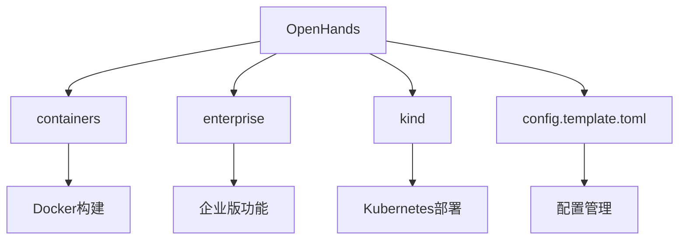
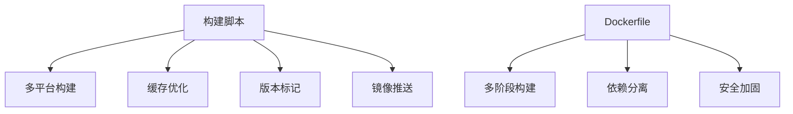
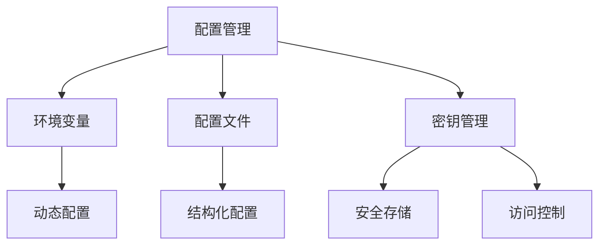
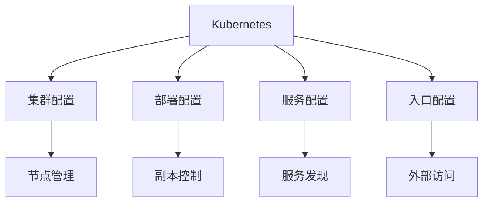
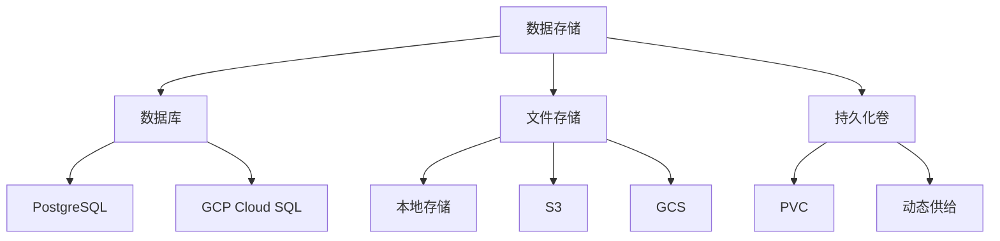
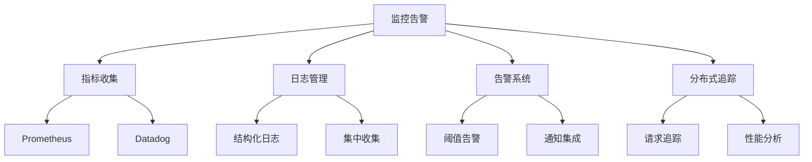
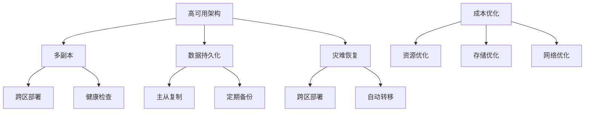
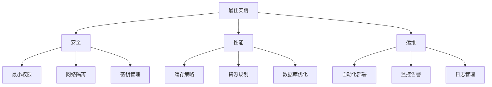

# 云部署

<cite>
**本文档中引用的文件**   
- [docker-compose.yml](file://docker-compose.yml)
- [containers/build.sh](file://containers/build.sh)
- [containers/app/Dockerfile](file://containers/app/Dockerfile)
- [enterprise/Dockerfile](file://enterprise/Dockerfile)
- [kind/cluster.yaml](file://kind/cluster.yaml)
- [kind/manifests/deployment.yaml](file://kind/manifests/deployment.yaml)
- [kind/manifests/service.yaml](file://kind/manifests/service.yaml)
- [containers/app/entrypoint.sh](file://containers/app/entrypoint.sh)
- [enterprise/saas_server.py](file://enterprise/saas_server.py)
- [enterprise/server/config.py](file://enterprise/server/config.py)
- [config.template.toml](file://config.template.toml)
</cite>

## 目录
1. [简介](#简介)
2. [项目结构](#项目结构)
3. [容器镜像构建与推送](#容器镜像构建与推送)
4. [云环境配置管理](#云环境配置管理)
5. [Kubernetes部署配置](#kubernetes部署配置)
6. [数据库与存储配置](#数据库与存储配置)
7. [监控与日志集成](#监控与日志集成)
8. [成本优化与高可用性架构](#成本优化与高可用性架构)
9. [部署最佳实践](#部署最佳实践)

## 简介
OpenHands是一个开源的AI编程代理平台，支持在多种云平台上进行部署。本指南将详细介绍如何在主流云平台（如AWS、GCP、Azure）上部署OpenHands，涵盖容器镜像构建、云实例配置、存储和网络设置、配置管理、负载均衡、自动伸缩以及监控告警等关键方面。

**Section sources**
- [docker-compose.yml](file://docker-compose.yml#L1-L24)
- [enterprise/saas_server.py](file://enterprise/saas_server.py#L1-L131)

## 项目结构
OpenHands项目采用模块化设计，主要包含以下关键组件：

- **containers/**: 包含Docker容器相关的构建脚本和Dockerfile
- **enterprise/**: 企业版相关代码，包括服务器配置、数据库迁移等
- **kind/**: Kubernetes in Docker (KinD) 配置文件，用于本地Kubernetes集群部署
- **config.template.toml**: 配置模板文件，包含各种环境的配置选项

项目通过Docker和Kubernetes实现云原生部署，支持多种云平台的灵活配置。



**Diagram sources **
- [docker-compose.yml](file://docker-compose.yml#L1-L24)
- [config.template.toml](file://config.template.toml#L1-L543)

**Section sources**
- [docker-compose.yml](file://docker-compose.yml#L1-L24)
- [config.template.toml](file://config.template.toml#L1-L543)

## 容器镜像构建与推送
OpenHands提供了完整的容器镜像构建和推送流程，通过`containers/build.sh`脚本实现多平台镜像构建。

### 构建脚本分析
`containers/build.sh`脚本支持以下关键功能：
- 多平台构建（linux/amd64, linux/arm64）
- 构建缓存优化
- 自动版本标记
- 镜像推送支持

```bash
# 示例：构建并推送OpenHands镜像
./containers/build.sh -i openhands --push -o your-org-name
```

### Dockerfile配置
项目包含多个Dockerfile，分别用于不同场景：

**应用容器Dockerfile** (`containers/app/Dockerfile`)：
- 基于Python 3.13.7-slim-trixie
- 包含前端构建和后端依赖安装
- 支持多阶段构建优化

**企业版Dockerfile** (`enterprise/Dockerfile`)：
- 基于基础OpenHands镜像
- 额外安装企业版依赖
- 支持安全更新和CVE修复



**Diagram sources **
- [containers/build.sh](file://containers/build.sh#L1-L183)
- [containers/app/Dockerfile](file://containers/app/Dockerfile#L1-L96)
- [enterprise/Dockerfile](file://enterprise/Dockerfile#L1-L41)

**Section sources**
- [containers/build.sh](file://containers/build.sh#L1-L183)
- [containers/app/Dockerfile](file://containers/app/Dockerfile#L1-L96)
- [enterprise/Dockerfile](file://enterprise/Dockerfile#L1-L41)

## 云环境配置管理
OpenHands通过环境变量和配置文件实现灵活的云环境配置管理。

### 环境变量配置
核心环境变量包括：
- `SANDBOX_RUNTIME_CONTAINER_IMAGE`: 沙箱运行时容器镜像
- `WORKSPACE_MOUNT_PATH`: 工作区挂载路径
- `SANDBOX_USER_ID`: 沙箱用户ID
- `FILE_STORE`: 文件存储类型（local, s3, gcs等）

### 配置文件管理
`config.template.toml`提供了完整的配置模板，包含以下主要配置部分：

**核心配置**:
```toml
[core]
workspace_base = "./workspace"
file_store = "memory"
max_iterations = 500
```

**LLM配置**:
```toml
[llm]
api_key = ""
model = "gpt-4o"
temperature = 0.0
```

**Kubernetes配置**:
```toml
[kubernetes]
namespace = "default"
ingress_domain = "localhost"
resource_memory_request = "1Gi"
```

### 密钥管理
企业版通过专门的密钥管理机制确保安全性：
- 使用`storage.saas_secrets_store.SaasSecretsStore`类管理密钥
- 支持环境变量和加密存储
- 提供密钥轮换和访问控制



**Diagram sources **
- [config.template.toml](file://config.template.toml#L1-L543)
- [enterprise/server/config.py](file://enterprise/server/config.py#L1-L191)

**Section sources**
- [config.template.toml](file://config.template.toml#L1-L543)
- [enterprise/server/config.py](file://enterprise/server/config.py#L1-L191)

## Kubernetes部署配置
OpenHands支持通过Kubernetes进行高可用部署，使用KinD（Kubernetes in Docker）进行本地测试和部署。

### 集群配置
`kind/cluster.yaml`定义了本地Kubernetes集群配置：

```yaml
kind: Cluster
apiVersion: kind.x-k8s.io/v1alpha4
name: local-hands
nodes:
- role: control-plane
  extraPortMappings:
  - containerPort: 80
    hostPort: 80
```

### 部署配置
`kind/manifests/deployment.yaml`定义了应用部署：

```yaml
apiVersion: apps/v1
kind: Deployment
metadata:
  name: ubuntu-dev
spec:
  replicas: 1
  selector:
    matchLabels:
      app: ubuntu-dev
  template:
    metadata:
      labels:
        app: ubuntu-dev
    spec:
      containers:
        - name: ubuntu
          image: ubuntu:22.04
          command: ["sleep", "infinity"]
```

### 服务配置
`kind/manifests/service.yaml`定义了服务暴露：

```yaml
apiVersion: v1
kind: Service
metadata:
  name: ubuntu-dev
spec:
  selector:
    app: ubuntu-dev
  ports:
    - protocol: TCP
      port: 8099
      targetPort: 3000
```

### 入口配置
通过Ingress实现外部访问，支持TLS加密和域名配置。



**Diagram sources **
- [kind/cluster.yaml](file://kind/cluster.yaml#L1-L10)
- [kind/manifests/deployment.yaml](file://kind/manifests/deployment.yaml#L1-L20)
- [kind/manifests/service.yaml](file://kind/manifests/service.yaml#L1-L13)

**Section sources**
- [kind/cluster.yaml](file://kind/cluster.yaml#L1-L10)
- [kind/manifests/deployment.yaml](file://kind/manifests/deployment.yaml#L1-L20)
- [kind/manifests/service.yaml](file://kind/manifests/service.yaml#L1-L13)

## 数据库与存储配置
OpenHands支持多种数据库和存储后端，满足不同云环境的需求。

### 数据库配置
通过`DbSessionInjector`类实现数据库连接管理，支持：
- PostgreSQL（默认）
- GCP Cloud SQL
- 其他兼容PostgreSQL的数据库

配置方式：
1. 环境变量配置（DB_HOST, DB_PORT, DB_NAME等）
2. 配置文件直接设置
3. GCP特定配置（gcp_db_instance, gcp_project等）

### 存储配置
支持多种文件存储后端：
- **本地存储**: `FILE_STORE=local`
- **S3兼容存储**: `FILE_STORE=s3`
- **Google Cloud Storage**: `FILE_STORE=gcs`
- **内存存储**: `FILE_STORE=memory`（仅用于测试）

### 持久化卷配置
Kubernetes环境下使用PersistentVolumeClaim（PVC）实现数据持久化：

```yaml
apiVersion: v1
kind: PersistentVolumeClaim
metadata:
  name: openhands-pvc
spec:
  accessModes:
    - ReadWriteOnce
  resources:
    requests:
      storage: 2Gi
```



**Diagram sources **
- [tests/unit/app_server/test_db_session_injector.py](file://tests/unit/app_server/test_db_session_injector.py#L52-L150)
- [config.template.toml](file://config.template.toml#L448-L453)

**Section sources**
- [tests/unit/app_server/test_db_session_injector.py](file://tests/unit/app_server/test_db_session_injector.py#L52-L150)
- [config.template.toml](file://config.template.toml#L448-L453)

## 监控与日志集成
OpenHands提供了完善的监控和日志集成方案，确保系统稳定运行。

### 监控指标
通过Prometheus和Datadog实现指标收集：
- **性能指标**: 响应延迟、请求速率
- **资源使用**: CPU、内存、磁盘使用率
- **业务指标**: 会话数、任务完成率

### 日志管理
支持结构化日志输出，便于集中收集和分析：
- JSON格式日志
- 多级别日志（DEBUG, INFO, ERROR）
- 分布式追踪集成

### 告警配置
基于关键指标设置告警规则：
- 高延迟告警
- 高错误率告警
- 资源耗尽告警

### 追踪系统
集成分布式追踪，支持：
- 请求链路追踪
- 性能瓶颈分析
- 错误根因定位



**Diagram sources **
- [enterprise/doc/design-doc/openhands-enterprise-telemetry-design.md](file://enterprise/doc/design-doc/openhands-enterprise-telemetry-design.md#L218-L255)
- [openhands/llm/metrics.py](file://openhands/llm/metrics.py#L198-L234)

**Section sources**
- [enterprise/doc/design-doc/openhands-enterprise-telemetry-design.md](file://enterprise/doc/design-doc/openhands-enterprise-telemetry-design.md#L218-L255)
- [openhands/llm/metrics.py](file://openhands/llm/metrics.py#L198-L234)

## 成本优化与高可用性架构
OpenHands提供了多种成本优化和高可用性架构选项。

### 成本优化策略
1. **资源优化**:
   - 合理设置CPU和内存请求/限制
   - 使用自动伸缩组
   - 选择合适的实例类型

2. **存储优化**:
   - 使用成本效益高的存储类型
   - 定期清理临时文件
   - 启用压缩和去重

3. **网络优化**:
   - 使用CDN加速静态资源
   - 优化API调用频率
   - 启用连接复用

### 高可用性架构
1. **多副本部署**:
   - 至少3个副本确保高可用
   - 跨可用区部署
   - 健康检查和自动恢复

2. **数据持久化**:
   - 数据库主从复制
   - 定期备份和恢复测试
   - 多区域数据同步

3. **灾难恢复**:
   - 跨区域部署
   - 自动故障转移
   - 快速恢复机制



**Diagram sources **
- [config.template.toml](file://config.template.toml#L452-L490)
- [tests/unit/core/config/test_kubernetes_config.py](file://tests/unit/core/config/test_kubernetes_config.py#L1-L62)

**Section sources**
- [config.template.toml](file://config.template.toml#L452-L490)
- [tests/unit/core/config/test_kubernetes_config.py](file://tests/unit/core/config/test_kubernetes_config.py#L1-L62)

## 部署最佳实践
结合OpenHands的特点，以下是云部署的最佳实践建议。

### 安全最佳实践
1. **最小权限原则**:
   - 为服务账户分配最小必要权限
   - 定期审查和更新权限

2. **网络隔离**:
   - 使用VPC和安全组
   - 限制外部访问
   - 启用加密通信

3. **密钥管理**:
   - 使用云平台密钥管理服务
   - 定期轮换密钥
   - 避免在代码中硬编码密钥

### 性能最佳实践
1. **缓存策略**:
   - 启用构建缓存
   - 使用CDN缓存静态资源
   - 实现应用级缓存

2. **资源规划**:
   - 根据负载预估资源需求
   - 设置合理的自动伸缩策略
   - 监控资源使用情况

3. **数据库优化**:
   - 创建适当的索引
   - 优化查询语句
   - 定期维护数据库

### 运维最佳实践
1. **自动化部署**:
   - 使用CI/CD流水线
   - 实现蓝绿部署或金丝雀发布
   - 自动化回滚机制

2. **监控告警**:
   - 设置关键指标监控
   - 配置多级告警
   - 定期审查告警规则

3. **日志管理**:
   - 集中收集日志
   - 设置日志保留策略
   - 实现日志分析和告警



**Diagram sources **
- [containers/app/entrypoint.sh](file://containers/app/entrypoint.sh#L1-L74)
- [enterprise/server/config.py](file://enterprise/server/config.py#L1-L191)

**Section sources**
- [containers/app/entrypoint.sh](file://containers/app/entrypoint.sh#L1-L74)
- [enterprise/server/config.py](file://enterprise/server/config.py#L1-L191)