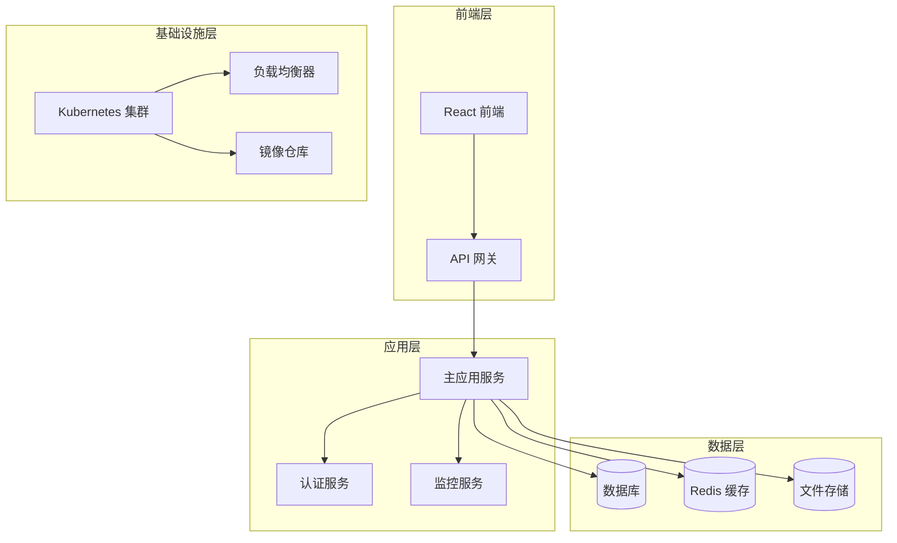
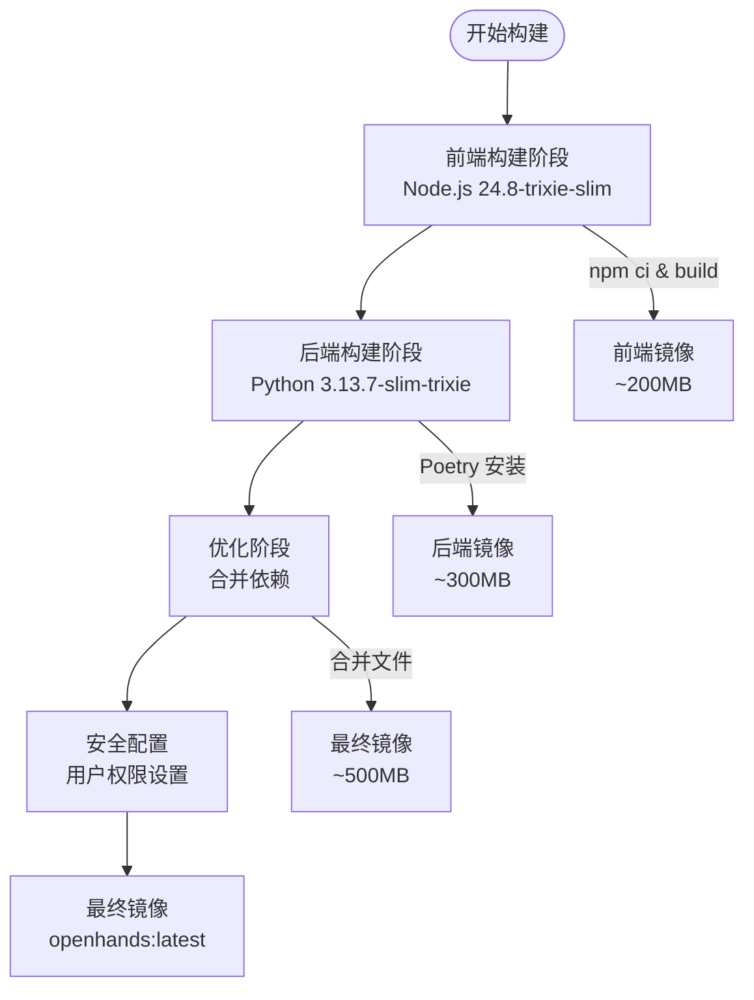
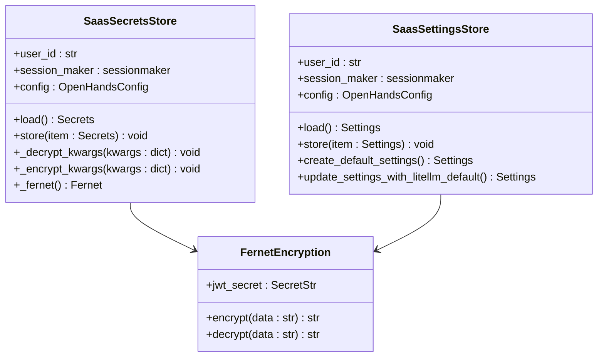
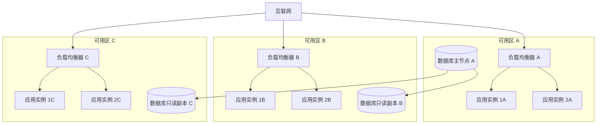
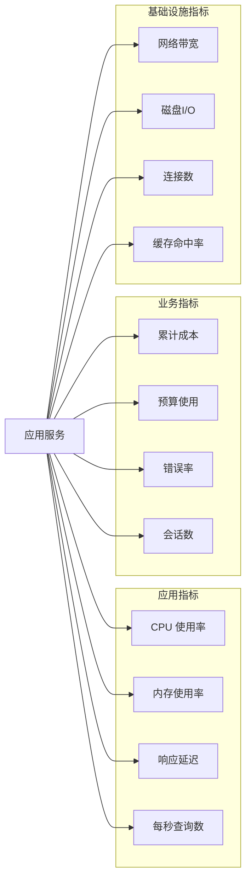
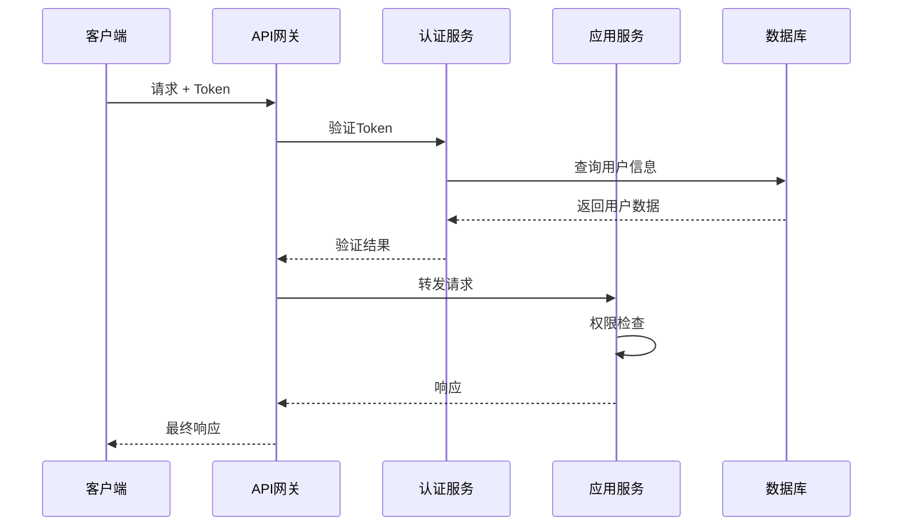
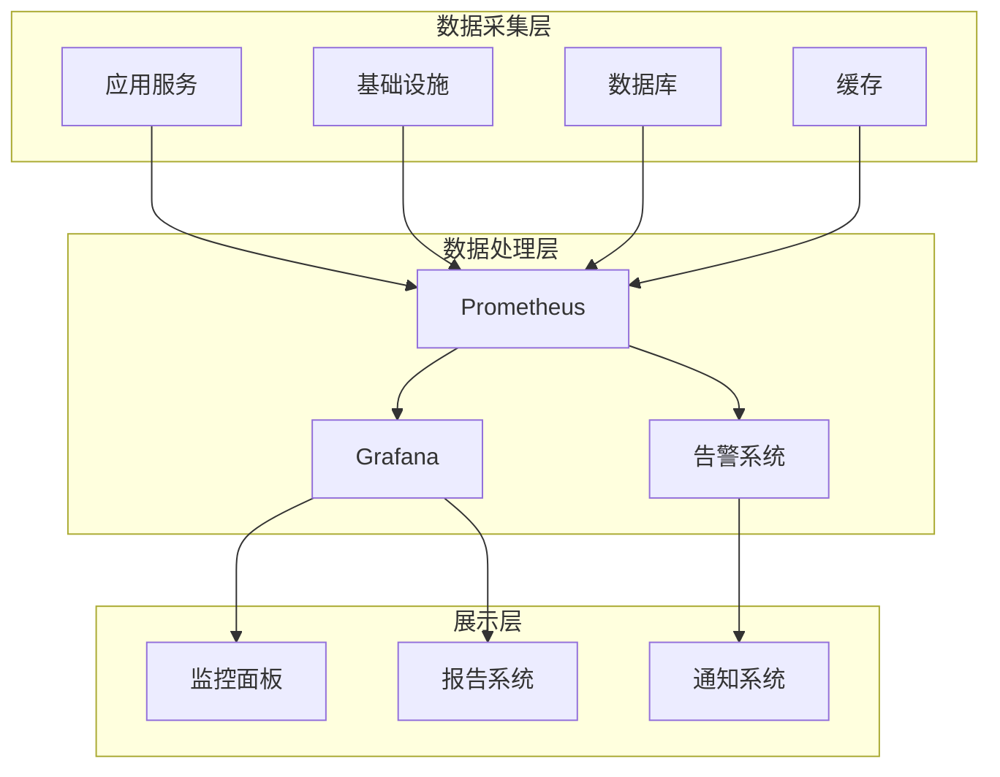
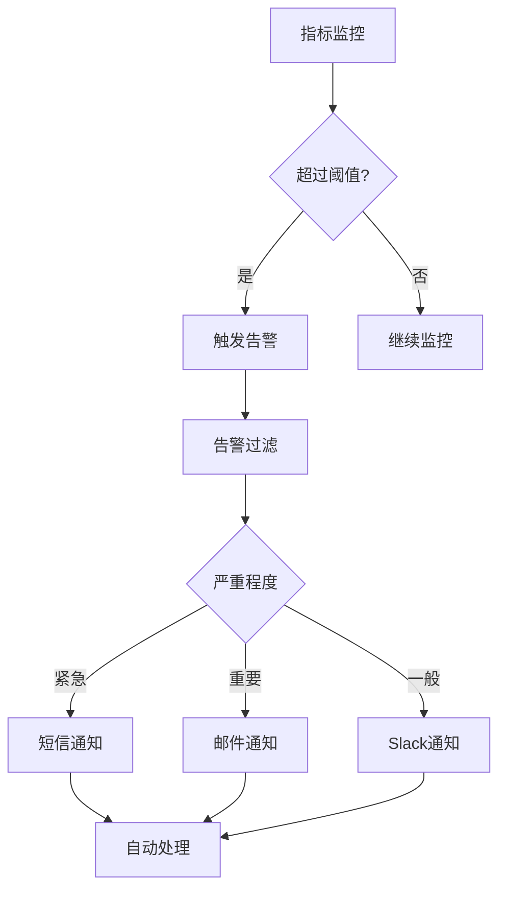
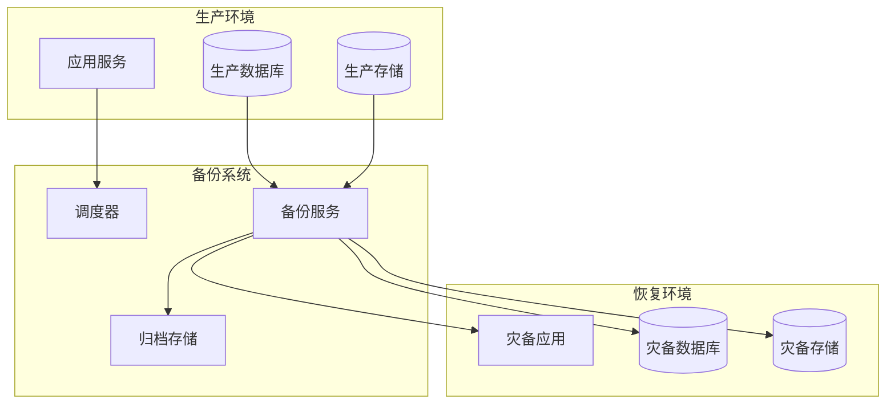
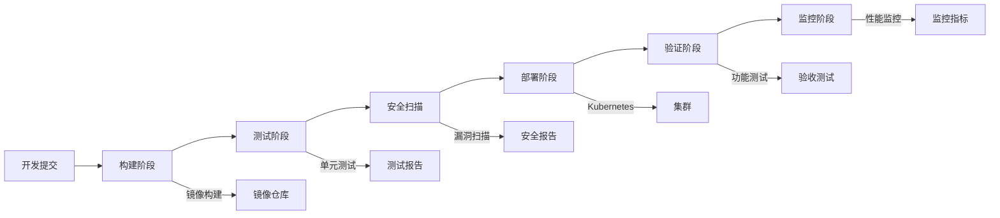

# 云部署最佳实践指南

<cite>
**本文档中引用的文件**
- [containers/app/Dockerfile](file://containers/app/Dockerfile)
- [enterprise/Dockerfile](file://enterprise/Dockerfile)
- [containers/build.sh](file://containers/build.sh)
- [enterprise/server/config.py](file://enterprise/server/config.py)
- [openhands/server/settings.py](file://openhands/server/settings.py)
- [enterprise/storage/saas_secrets_store.py](file://enterprise/storage/saas_secrets_store.py)
- [enterprise/storage/saas_settings_store.py](file://enterprise/storage/saas_settings_store.py)
- [enterprise/server/saas_monitoring_listener.py](file://enterprise/server/saas_monitoring_listener.py)
- [openhands/server/monitoring.py](file://openhands/server/monitoring.py)
- [enterprise/server/auth/saas_user_auth.py](file://enterprise/server/auth/saas_user_auth.py)
- [kind/cluster.yaml](file://kind/cluster.yaml)
- [kind/manifests/deployment.yaml](file://kind/manifests/deployment.yaml)
- [docker-compose.yml](file://docker-compose.yml)
</cite>

## 目录
1. [简介](#简介)
2. [项目架构概览](#项目架构概览)
3. [容器镜像优化策略](#容器镜像优化策略)
4. [环境变量与密钥管理](#环境变量与密钥管理)
5. [高可用性架构设计](#高可用性架构设计)
6. [性能调优与成本优化](#性能调优与成本优化)
7. [安全加固措施](#安全加固措施)
8. [监控与日志系统](#监控与日志系统)
9. [灾难恢复与备份策略](#灾难恢复与备份策略)
10. [部署自动化与CI/CD](#部署自动化与cicd)
11. [总结](#总结)

## 简介

本指南基于OpenHands项目的实际部署经验，提供了跨所有云平台的通用最佳实践。OpenHands作为一个复杂的AI代理系统，展示了现代云原生应用的完整部署模式，涵盖了从容器化到微服务架构的各个方面。

## 项目架构概览

OpenHands采用分层架构设计，支持多种部署模式：



**图表来源**
- [enterprise/server/config.py](file://enterprise/server/config.py#L62-L95)
- [openhands/server/settings.py](file://openhands/server/settings.py#L15-L57)

**章节来源**
- [enterprise/server/config.py](file://enterprise/server/config.py#L1-L191)
- [openhands/server/settings.py](file://openhands/server/settings.py#L1-L57)

## 容器镜像优化策略

### 多阶段构建优化

OpenHands采用了先进的多阶段构建策略，显著减少了最终镜像大小：



**图表来源**
- [containers/app/Dockerfile](file://containers/app/Dockerfile#L1-L96)
- [enterprise/Dockerfile](file://enterprise/Dockerfile#L1-L41)

### 镜像瘦身技术

1. **基础镜像选择**：使用官方Slim版本减少基础包
2. **依赖管理**：通过Poetry精确控制Python依赖
3. **文件权限优化**：最小化文件权限范围
4. **缓存策略**：合理利用Docker层缓存

### 构建脚本自动化

项目提供了完整的构建自动化脚本，支持多平台构建：

```bash
# 构建示例
./containers/build.sh -i openhands --push --load -t production
```

**章节来源**
- [containers/app/Dockerfile](file://containers/app/Dockerfile#L1-L96)
- [enterprise/Dockerfile](file://enterprise/Dockerfile#L1-L41)
- [containers/build.sh](file://containers/build.sh#L1-L183)

## 环境变量与密钥管理

### 密钥管理架构

OpenHands实现了企业级的密钥管理系统：



**图表来源**
- [enterprise/storage/saas_secrets_store.py](file://enterprise/storage/saas_secrets_store.py#L18-L130)
- [enterprise/storage/saas_settings_store.py](file://enterprise/storage/saas_settings_store.py#L37-L393)

### 密钥加密策略

1. **对称加密**：使用Fernet算法进行密钥加密
2. **密钥派生**：基于JWT密钥生成加密密钥
3. **字段选择性加密**：仅对敏感字段进行加密存储
4. **透明解密**：应用程序层面的透明解密

### 环境变量最佳实践

| 变量类型 | 示例 | 安全级别 | 存储位置 |
|---------|------|----------|----------|
| 数据库连接 | `DATABASE_URL` | 高 | 密钥管理服务 |
| API密钥 | `GITHUB_APP_CLIENT_ID` | 高 | 加密存储 |
| 调试信息 | `DEBUG_MODE` | 中 | 环境变量 |
| 性能参数 | `CACHE_TTL` | 低 | 配置文件 |

**章节来源**
- [enterprise/storage/saas_secrets_store.py](file://enterprise/storage/saas_secrets_store.py#L1-L130)
- [enterprise/storage/saas_settings_store.py](file://enterprise/storage/saas_settings_store.py#L1-L393)

## 高可用性架构设计

### 多可用区部署



### 故障转移策略

1. **健康检查**：定期检查服务状态
2. **自动重启**：容器异常时自动重启
3. **流量切换**：故障时自动切换到备用实例
4. **数据同步**：实时数据复制保证一致性

### Kubernetes部署配置

项目提供了完整的Kubernetes部署模板：

```yaml
# 部署示例
apiVersion: apps/v1
kind: Deployment
metadata:
  name: openhands-app
spec:
  replicas: 3
  strategy:
    type: RollingUpdate
    rollingUpdate:
      maxUnavailable: 1
      maxSurge: 1
  template:
    spec:
      containers:
      - name: openhands
        image: ghcr.io/openhands/openhands:latest
        resources:
          requests:
            memory: "512Mi"
            cpu: "250m"
          limits:
            memory: "1Gi"
            cpu: "500m"
```

**章节来源**
- [kind/manifests/deployment.yaml](file://kind/manifests/deployment.yaml#L1-L20)
- [docker-compose.yml](file://docker-compose.yml#L1-L24)

## 性能调优与成本优化

### 性能监控指标

OpenHands实现了全面的性能监控体系：



**图表来源**
- [enterprise/server/saas_monitoring_listener.py](file://enterprise/server/saas_monitoring_listener.py#L1-L76)
- [openhands/server/monitoring.py](file://openhands/server/monitoring.py#L1-L42)

### 成本控制机制

1. **预算限制**：每个任务设置成本上限
2. **资源配额**：限制单个用户的资源使用
3. **自动扩缩容**：根据负载动态调整资源
4. **成本分析**：详细的成本追踪和报告

### 资源优化策略

| 优化领域 | 策略 | 预期效果 |
|---------|------|----------|
| 计算资源 | 水平扩展 + 自动扩缩容 | 减少20-30%成本 |
| 存储资源 | 压缩 + 去重 | 减少15-25%存储成本 |
| 网络资源 | CDN + 缓存 | 减少10-20%带宽成本 |
| 数据库 | 连接池 + 查询优化 | 提升30-50%性能 |

**章节来源**
- [enterprise/server/saas_monitoring_listener.py](file://enterprise/server/saas_monitoring_listener.py#L1-L76)
- [openhands/server/monitoring.py](file://openhands/server/monitoring.py#L1-L42)

## 安全加固措施

### 认证授权架构



**图表来源**
- [enterprise/server/auth/saas_user_auth.py](file://enterprise/server/auth/saas_user_auth.py#L1-L324)

### 安全防护措施

1. **多层认证**：
   - Cookie认证（Web界面）
   - Bearer Token认证（API调用）
   - API Key认证（第三方集成）

2. **访问控制**：
   - 基于角色的访问控制(RBAC)
   - 细粒度权限管理
   - 动态权限验证

3. **数据保护**：
   - 传输加密（HTTPS/TLS）
   - 存储加密（密钥管理服务）
   - 数据脱敏处理

### 安全审计

| 审计项目 | 检查频率 | 关键指标 |
|---------|----------|----------|
| 登录尝试 | 实时 | 成功/失败比例 |
| 权限变更 | 实时 | 用户角色变化 |
| 数据访问 | 实时 | 敏感数据查询 |
| 异常行为 | 实时 | 异常访问模式 |

**章节来源**
- [enterprise/server/auth/saas_user_auth.py](file://enterprise/server/auth/saas_user_auth.py#L1-L324)

## 监控与日志系统

### 监控架构



### 日志管理策略

1. **结构化日志**：统一的日志格式和字段
2. **分级存储**：不同级别的日志采用不同的存储策略
3. **日志聚合**：集中收集和分析所有服务日志
4. **敏感信息过滤**：自动识别和过滤敏感数据

### 告警机制



**章节来源**
- [enterprise/server/saas_monitoring_listener.py](file://enterprise/server/saas_monitoring_listener.py#L1-L76)
- [openhands/server/monitoring.py](file://openhands/server/monitoring.py#L1-L42)

## 灾难恢复与备份策略

### 备份架构



### 备份策略

1. **数据备份**：
   - 全量备份：每周执行
   - 增量备份：每日执行
   - 实时复制：关键数据实时同步

2. **应用备份**：
   - 配置备份：版本化管理
   - 镜像备份：容器镜像版本控制
   - 状态备份：会话状态快照

3. **测试恢复**：
   - 定期恢复演练
   - 多场景测试
   - 恢复时间验证

### 灾难恢复流程

| 灾难类型 | 恢复时间目标(RTO) | 恢复点目标(RPO) | 恢复步骤 |
|---------|------------------|----------------|----------|
| 单机故障 | 15分钟 | 0 | 自动故障转移 |
| 可用区故障 | 1小时 | 5分钟 | 切换到备用可用区 |
| 地区故障 | 4小时 | 15分钟 | 全面灾难恢复 |
| 全局故障 | 8小时 | 1小时 | 最终灾难恢复 |

## 部署自动化与CI/CD

### CI/CD流水线



### 部署策略

1. **蓝绿部署**：零停机时间部署
2. **金丝雀发布**：渐进式流量切换
3. **滚动更新**：平滑的应用程序更新
4. **回滚机制**：快速回滚到稳定版本

### 自动化工具链

| 工具类别 | 具体工具 | 主要功能 |
|---------|----------|----------|
| 版本控制 | GitLab/GitHub | 代码托管和版本管理 |
| CI/CD | Jenkins/GitLab CI | 自动化构建和部署 |
| 容器编排 | Kubernetes | 容器编排和服务管理 |
| 镜像仓库 | Harbor/ECR | 容器镜像存储和管理 |
| 监控告警 | Prometheus/Grafana | 系统监控和告警 |
| 日志管理 | ELK Stack | 日志收集和分析 |

**章节来源**
- [containers/build.sh](file://containers/build.sh#L1-L183)
- [kind/cluster.yaml](file://kind/cluster.yaml#L1-L10)

## 总结

本指南总结了OpenHands项目在云部署方面的最佳实践经验，涵盖了从容器化到微服务架构的完整解决方案。通过实施这些最佳实践，可以实现：

1. **高效部署**：标准化的容器化和自动化部署流程
2. **高可用性**：多层级的容错和故障转移机制
3. **安全性**：全面的安全防护和合规保障
4. **可观测性**：完善的监控、日志和告警体系
5. **成本优化**：智能的资源管理和成本控制

这些实践不仅适用于OpenHands项目，也可以作为其他云原生应用部署的参考框架。随着云技术的不断发展，建议持续关注新的最佳实践，并根据具体业务需求进行适当的调整和优化。