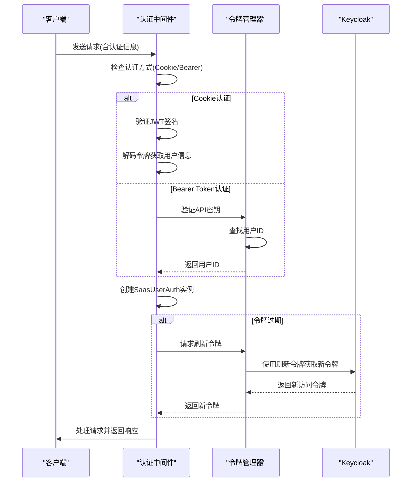
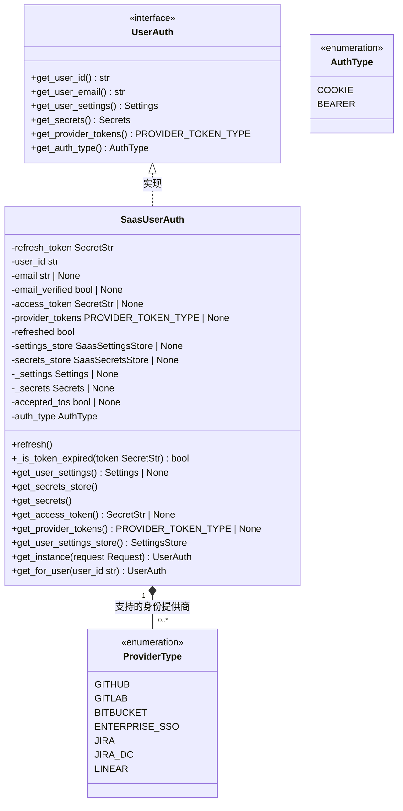
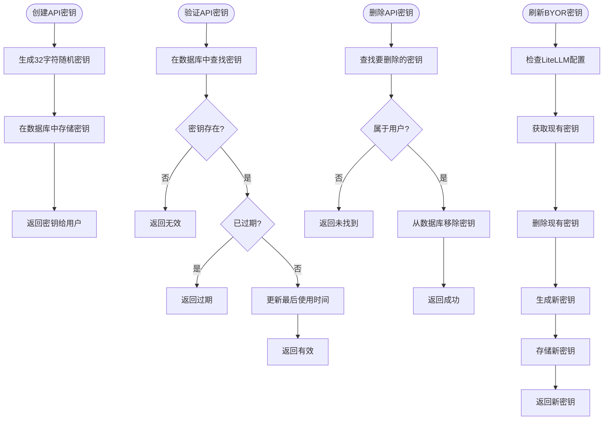
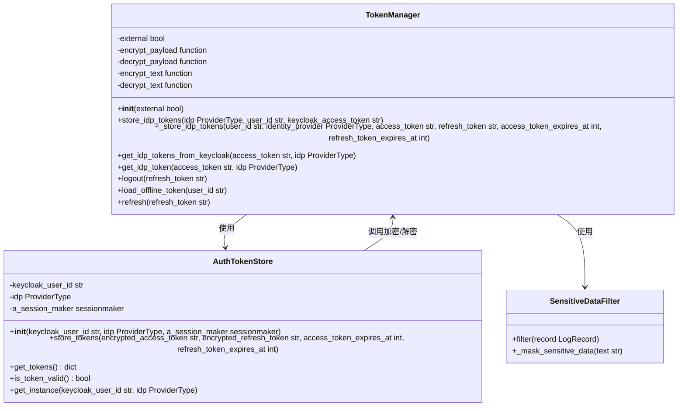
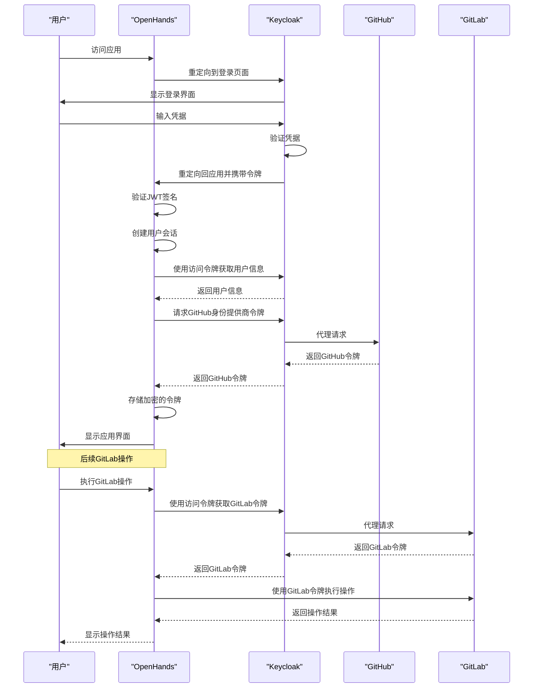
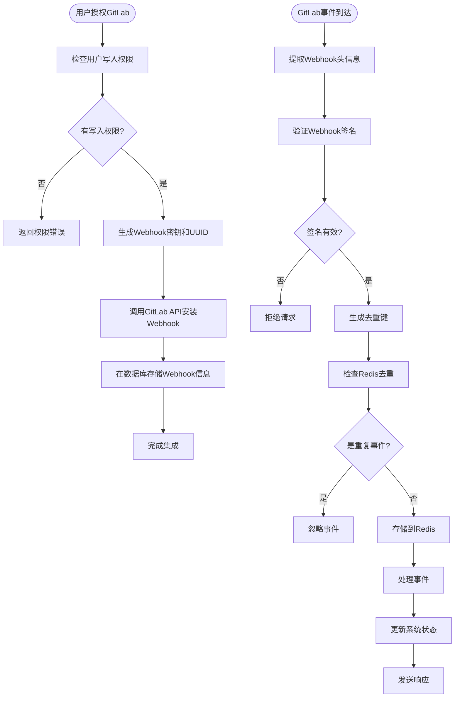
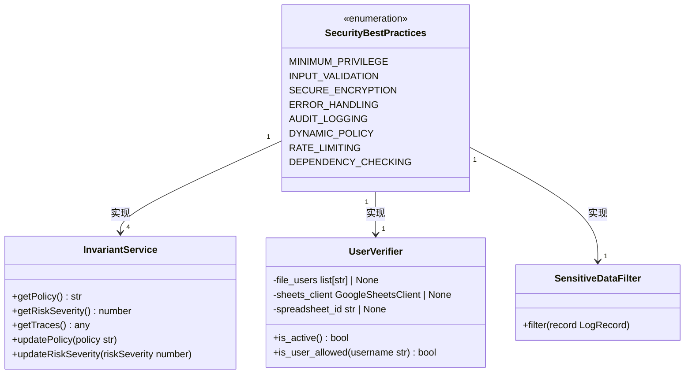
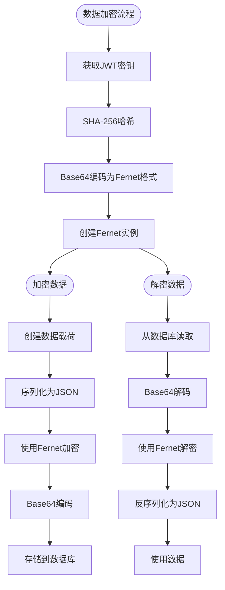

# 安全配置

<cite>
**本文档中引用的文件**   
- [token_manager.py](file://enterprise/server/auth/token_manager.py)
- [saas_user_auth.py](file://enterprise/server/auth/saas_user_auth.py)
- [keycloak_manager.py](file://enterprise/server/auth/keycloak_manager.py)
- [config.py](file://enterprise/server/config.py)
- [middleware.py](file://enterprise/server/middleware.py)
- [api_keys.py](file://enterprise/server/routes/api_keys.py)
- [api_key_store.py](file://enterprise/storage/api_key_store.py)
- [auth_utils.py](file://enterprise/server/auth/auth_utils.py)
- [rate_limit.py](file://enterprise/server/rate_limit.py)
- [constants.py](file://enterprise/server/auth/constants.py)
- [gitlab_service.py](file://enterprise/integrations/gitlab/gitlab_service.py)
- [gitlab.py](file://enterprise/server/routes/integration/gitlab.py)
- [invariant-service.ts](file://frontend/src/api/invariant-service.ts)
- [config.template.toml](file://config.template.toml)
</cite>

## 目录
1. [简介](#简介)
2. [认证配置](#认证配置)
3. [授权策略](#授权策略)
4. [API密钥管理](#api密钥管理)
5. [敏感数据保护](#敏感数据保护)
6. [Keycloak集成](#keycloak集成)
7. [GitLab同步](#gitlab同步)
8. [安全最佳实践](#安全最佳实践)
9. [安全审计日志](#安全审计日志)
10. [数据加密配置](#数据加密配置)
11. [默认值和推荐设置](#默认值和推荐设置)
12. [结论](#结论)

## 简介
OpenHands提供了一套全面的安全配置机制，确保系统在企业环境中的安全运行。本文档详细介绍了OpenHands的安全配置选项和机制，包括认证配置、授权策略、API密钥管理和敏感数据保护等安全相关设置。文档还解释了安全配置如何与企业版的Keycloak集成和GitLab同步功能协同工作，并涵盖了安全最佳实践，如最小权限原则、安全审计日志和数据加密配置。通过本文档，管理员可以了解如何根据组织的安全策略进行定制配置，确保系统的安全性。

**Section sources**
- [token_manager.py](file://enterprise/server/auth/token_manager.py#L1-L50)
- [saas_user_auth.py](file://enterprise/server/auth/saas_user_auth.py#L1-L50)

## 认证配置
OpenHands的认证配置基于JWT（JSON Web Token）和Keycloak实现，提供了多层安全保护。系统使用HS256算法对JWT进行签名和验证，确保令牌的完整性和真实性。认证流程支持多种身份验证方式，包括Cookie认证和Bearer Token认证。

在认证过程中，系统首先检查请求中的Keycloak认证Cookie，如果不存在，则检查Authorization头中的Bearer Token。对于API调用，系统还支持X-Session-API-Key头作为临时替代方案。认证成功后，系统会创建SaasUserAuth实例，包含用户ID、电子邮件、访问令牌和刷新令牌等信息。

系统实现了令牌刷新机制，当访问令牌即将过期时，会自动使用刷新令牌获取新的访问令牌，确保用户会话的连续性。同时，系统还实现了速率限制功能，防止暴力破解攻击。认证中间件会检查用户的使用情况，如果超过限制，则拒绝请求。

**Diagram sources**
- [saas_user_auth.py](file://enterprise/server/auth/saas_user_auth.py#L207-L324)
- [middleware.py](file://enterprise/server/middleware.py#L26-L175)
- [token_manager.py](file://enterprise/server/auth/token_manager.py#L147-L262)

**Section sources**
- [saas_user_auth.py](file://enterprise/server/auth/saas_user_auth.py#L207-L324)
- [middleware.py](file://enterprise/server/middleware.py#L26-L175)

## 授权策略
OpenHands的授权策略基于最小权限原则，确保用户只能访问其被授权的资源。系统通过SaasUserAuth类管理用户的权限，该类实现了UserAuth接口，并提供了获取用户ID、电子邮件、设置和密钥等方法。

授权策略的核心是权限检查机制。当用户尝试访问受保护的资源时，系统会验证用户的身份和权限。例如，在GitLab集成中，系统会检查用户是否对特定项目具有写入权限（访问级别>=30，即开发者级别）。这种细粒度的权限控制确保了资源的安全性。

系统还实现了基于角色的访问控制（RBAC），不同的用户角色具有不同的权限级别。管理员可以配置哪些身份提供商（如GitHub、GitLab、Bitbucket）是可用的，从而控制用户可以通过哪些方式登录系统。此外，系统支持企业单点登录（Enterprise SSO），允许组织使用其现有的身份管理系统。

**Diagram sources**
- [saas_user_auth.py](file://enterprise/server/auth/saas_user_auth.py#L43-L324)
- [constants.py](file://enterprise/server/auth/constants.py#L3-L33)

**Section sources**
- [saas_user_auth.py](file://enterprise/server/auth/saas_user_auth.py#L43-L324)

## API密钥管理
OpenHands提供了完善的API密钥管理功能，允许用户创建、列出、删除和管理API密钥。API密钥用于程序化访问系统，支持设置名称和过期时间，增强了密钥管理的安全性。

API密钥存储在数据库的auth_tokens表中，包含密钥ID、用户ID、名称、创建时间、最后使用时间和过期时间等字段。系统使用ApiKeyStore类来管理API密钥的生命周期，提供了创建、验证、删除和列出密钥的方法。API密钥采用32个字符的随机字符串，由大小写字母和数字组成，确保了足够的熵值。

对于BYOR（Bring Your Own Runtime）场景，系统还提供了专门的LLM API密钥管理功能。这些密钥通过LiteLLM服务生成和管理，支持密钥的生成、获取和刷新操作。当用户请求新的BYOR密钥时，系统会先尝试从数据库获取现有密钥，如果不存在则生成新的密钥并存储。

**Diagram sources**
- [api_keys.py](file://enterprise/server/routes/api_keys.py#L1-L390)
- [api_key_store.py](file://enterprise/storage/api_key_store.py#L1-L133)

**Section sources**
- [api_keys.py](file://enterprise/server/routes/api_keys.py#L1-L390)
- [api_key_store.py](file://enterprise/storage/api_key_store.py#L1-L133)

## 敏感数据保护
OpenHands实施了多层次的敏感数据保护机制，确保用户数据的安全。系统使用Fernet对称加密算法对敏感数据进行加密，包括访问令牌、刷新令牌和其他机密信息。加密密钥基于JWT密钥生成，确保了加密的安全性。

在数据存储方面，所有敏感数据在存储到数据库之前都会被加密。例如，AuthTokenStore在存储身份提供商的访问令牌和刷新令牌时，会使用TokenManager提供的加密函数对令牌进行加密。当需要使用这些令牌时，系统会从数据库读取加密的数据并解密。

系统还实现了敏感数据过滤机制，在日志记录时自动屏蔽环境变量中的敏感信息。任何包含"KEY"、"SECRET"、"TOKEN"或"PASSWORD"等关键字的环境变量值都会被替换为"******"，防止敏感信息意外泄露。此外，系统在处理用户输入时也会进行适当的清理和验证，防止注入攻击。

**Diagram sources**
- [token_manager.py](file://enterprise/server/auth/token_manager.py#L47-L262)
- [storage/auth_token_store.py](file://enterprise/storage/auth_token_store.py#L184-L208)

**Section sources**
- [token_manager.py](file://enterprise/server/auth/token_manager.py#L47-L262)

## Keycloak集成
OpenHands与Keycloak深度集成，实现了企业级的身份管理和单点登录功能。系统通过KeycloakAdmin和KeycloakOpenID客户端与Keycloak服务器通信，支持外部和内部两种部署模式。集成配置通过环境变量进行，包括Keycloak服务器URL、领域名称、客户端ID和密钥等。

Keycloak集成的核心是令牌管理。系统使用TokenManager类处理与Keycloak的交互，包括令牌刷新、用户信息获取和身份提供商令牌获取。当用户通过Keycloak登录后，系统会获取访问令牌和刷新令牌，并将其存储在加密的会话中。对于身份提供商集成（如GitHub、GitLab），系统会使用Keycloak的代理功能获取相应身份提供商的令牌。

系统还实现了Keycloak同步功能，确保用户状态的一致性。当用户重新认证时，系统会触发GitLab仓库同步，保持集成状态的最新。此外，系统支持Keycloak的速率限制处理，当遇到速率限制错误时，会适当调整同步策略。

**Diagram sources**
- [keycloak_manager.py](file://enterprise/server/auth/keycloak_manager.py#L1-L51)
- [token_manager.py](file://enterprise/server/auth/token_manager.py#L147-L262)
- [middleware.py](file://enterprise/server/middleware.py#L56-L58)

**Section sources**
- [keycloak_manager.py](file://enterprise/server/auth/keycloak_manager.py#L1-L51)
- [token_manager.py](file://enterprise/server/auth/token_manager.py#L147-L262)

## GitLab同步
OpenHands的GitLab同步功能确保了系统与GitLab仓库的实时集成。系统通过GitLab Webhook机制接收来自GitLab的事件通知，包括合并请求、问题和提交等。当用户授权GitLab集成后，系统会自动为用户的仓库安装Webhook。

Webhook的安装过程包括生成唯一的Webhook密钥和UUID，然后通过GitLab API创建Webhook。系统会验证用户对目标资源（项目或组）具有写入权限（访问级别>=30），确保只有授权用户才能安装Webhook。Webhook的负载包含用户ID、Webhook UUID和签名，用于验证请求的来源。

当GitLab发送事件通知时，系统会验证Webhook签名，确保请求来自合法的GitLab实例。验证通过后，系统会处理事件并更新相应的状态。为了防止重复处理，系统使用Redis实现去重机制，为每个事件生成唯一的哈希值并在一定时间内缓存。

**Diagram sources**
- [gitlab_service.py](file://enterprise/integrations/gitlab/gitlab_service.py#L458-L493)
- [gitlab.py](file://enterprise/server/routes/integration/gitlab.py#L21-L66)
- [install_gitlab_webhooks.py](file://enterprise/sync/install_gitlab_webhooks.py#L200-L301)

**Section sources**
- [gitlab_service.py](file://enterprise/integrations/gitlab/gitlab_service.py#L458-L493)
- [gitlab.py](file://enterprise/server/routes/integration/gitlab.py#L21-L66)

## 安全最佳实践
OpenHands遵循多项安全最佳实践，确保系统的整体安全性。首先，系统实施了最小权限原则，用户只能访问其被明确授权的资源。例如，在GitLab集成中，系统会检查用户是否具有足够的访问级别（>=30，即开发者级别）才能执行操作。

其次，系统实现了全面的输入验证和清理机制。所有用户输入在处理前都会进行验证，防止注入攻击和其他安全漏洞。系统还使用了安全的加密算法（如HS256和Fernet）来保护敏感数据，确保数据在传输和存储过程中的安全性。

系统还实施了严格的错误处理策略，避免在错误消息中暴露敏感信息。所有安全相关的事件都会被记录到审计日志中，便于追踪和分析。此外，系统支持安全策略的动态更新，管理员可以通过API调整风险严重性级别和安全策略。

**Diagram sources**
- [invariant-service.ts](file://frontend/src/api/invariant-service.ts#L1-L30)
- [auth_utils.py](file://enterprise/server/auth/auth_utils.py#L8-L80)
- [test_logger.py](file://tests/unit/core/logger/test_logger.py#L59-L117)

**Section sources**
- [invariant-service.ts](file://frontend/src/api/invariant-service.ts#L1-L30)
- [auth_utils.py](file://enterprise/server/auth/auth_utils.py#L8-L80)

## 安全审计日志
OpenHands实现了全面的安全审计日志功能，记录所有关键的安全事件。系统使用结构化日志记录，包含时间戳、事件类型、用户ID和相关上下文信息。审计日志覆盖了认证、授权、API调用和敏感操作等各个方面。

日志系统集成了敏感数据过滤器，自动屏蔽环境变量中的敏感信息。任何包含"KEY"、"SECRET"、"TOKEN"或"PASSWORD"等关键字的值都会被替换为"******"，防止敏感信息泄露。日志记录还包括速率限制事件、认证失败和权限拒绝等安全相关事件。

系统还提供了审计日志的导出功能，管理员可以通过API获取安全跟踪信息。这些信息可用于安全分析、合规审计和事件调查。日志级别可以根据需要调整，从详细的调试信息到关键的安全警报。

**Section sources**
- [test_logger.py](file://tests/unit/core/logger/test_logger.py#L59-L117)
- [stream.py](file://openhands/events/stream.py#L215-L252)

## 数据加密配置
OpenHands的数据加密配置基于Fernet对称加密算法，使用32字节的密钥。加密密钥由JWT密钥通过SHA-256哈希生成，然后转换为Fernet格式。这种设计确保了加密的安全性，同时与现有的认证机制无缝集成。

系统对多种敏感数据进行加密，包括身份提供商的访问令牌和刷新令牌、API密钥和其他机密信息。加密操作在数据存储到数据库之前执行，解密操作在数据从数据库读取后执行。系统提供了统一的加密工具函数，包括encrypt_text、decrypt_text、encrypt_payload和decrypt_payload。

加密配置通过环境变量进行管理，主要包括JWT_SECRET，该密钥用于生成加密密钥。系统要求JWT密钥足够长和随机，以确保加密的安全性。此外，系统支持密钥轮换，可以通过更新JWT密钥来实现加密密钥的轮换。

**Diagram sources**
- [token_manager.py](file://enterprise/server/auth/token_manager.py#L47-L87)
- [config.template.toml](file://config.template.toml#L1-L50)

**Section sources**
- [token_manager.py](file://enterprise/server/auth/token_manager.py#L47-L87)

## 默认值和推荐设置
OpenHands提供了一系列安全配置的默认值和推荐设置，帮助管理员快速建立安全的系统环境。以下是关键安全配置的默认值和推荐设置：

| 配置项 | 默认值 | 推荐设置 | 说明 |
|--------|--------|---------|------|
| JWT算法 | HS256 | HS256 | 推荐使用HS256进行对称加密 |
| 令牌有效期 | 由Keycloak决定 | 1小时 | 建议设置合理的过期时间 |
| API密钥长度 | 32字符 | 32字符 | 确保足够的熵值 |
| 速率限制 | 10/秒; 100/分钟 | 根据需求调整 | 防止暴力破解 |
| 敏感数据过滤 | 启用 | 启用 | 屏蔽日志中的敏感信息 |
| GitLab访问级别 | >=30(开发者) | >=30(开发者) | 确保足够的权限 |
| 加密算法 | Fernet(AES) | Fernet(AES) | 使用经过验证的加密算法 |
| 日志级别 | INFO | WARNING(生产环境) | 减少日志量 |

对于企业部署，建议启用企业单点登录（ENABLE_ENTERPRISE_SSO），并配置适当的维护窗口。同时，建议定期轮换JWT密钥以增强安全性。对于API密钥，建议设置合理的过期时间，并定期审查和清理不再使用的密钥。

**Section sources**
- [config.template.toml](file://config.template.toml#L1-L50)
- [constants.py](file://enterprise/server/auth/constants.py#L3-L33)

## 结论
OpenHands提供了一套全面的安全配置框架，涵盖了认证、授权、API密钥管理、敏感数据保护等多个方面。通过与Keycloak的深度集成，系统实现了企业级的身份管理和单点登录功能。GitLab同步机制确保了与代码仓库的实时集成，同时通过Webhook签名验证保证了通信的安全性。

系统的安全最佳实践包括最小权限原则、输入验证、安全加密和全面的审计日志。API密钥管理功能允许用户安全地进行程序化访问，而敏感数据保护机制确保了机密信息的安全。通过合理的默认值和推荐设置，管理员可以快速建立安全的系统环境，并根据组织的具体需求进行定制。

总之，OpenHands的安全配置设计充分考虑了现代应用的安全需求，提供了灵活而强大的安全机制，适用于各种规模的组织和部署场景。