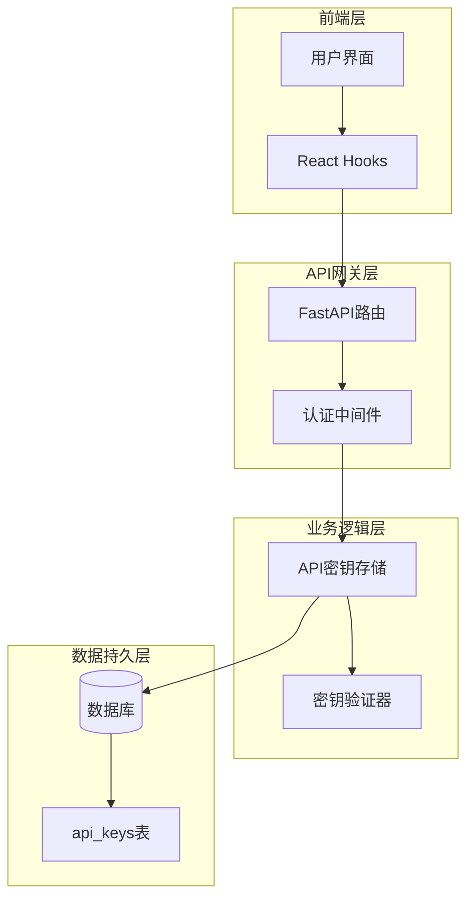
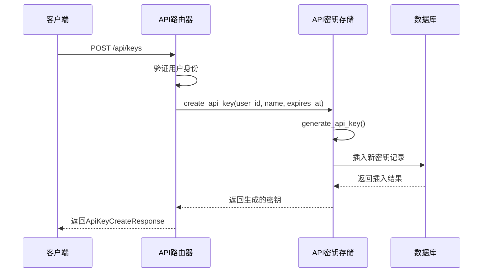
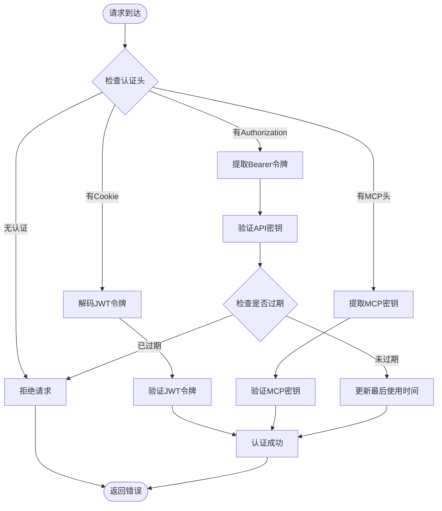
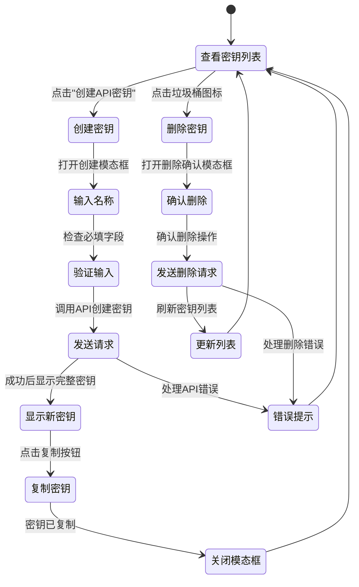
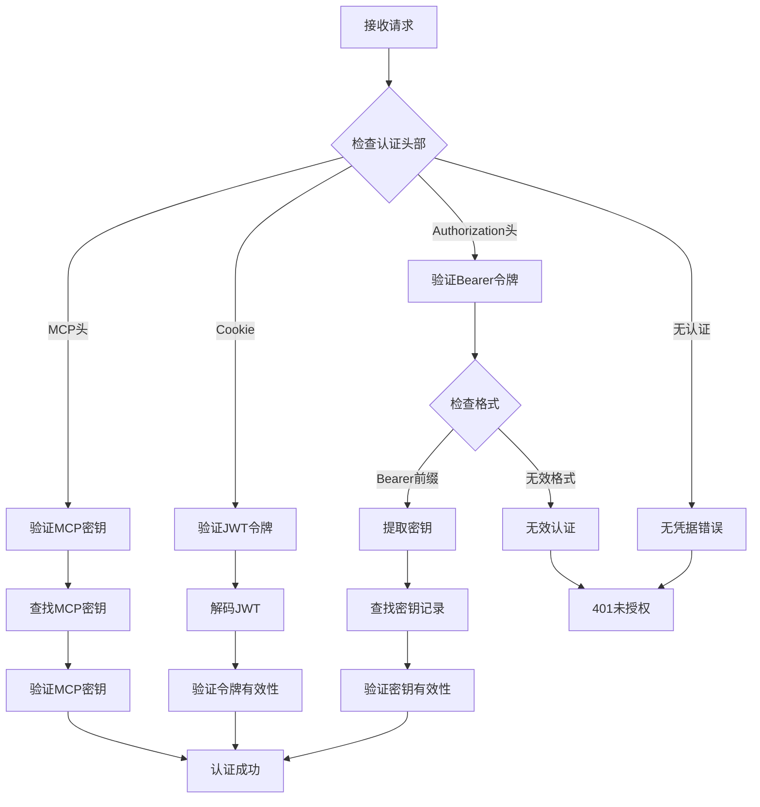
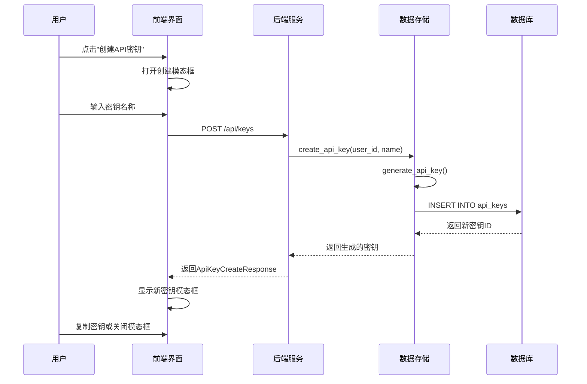
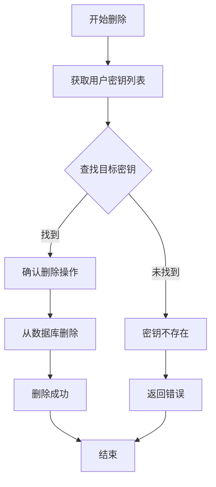
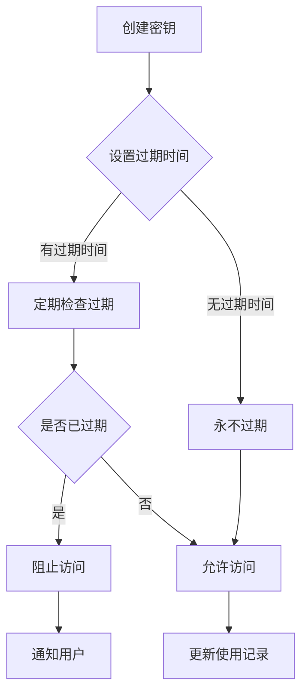

# API密钥管理

<cite>
**本文档中引用的文件**
- [api_keys.py](file://enterprise/server/routes/api_keys.py)
- [api_key.py](file://enterprise/storage/api_key.py)
- [api_key_store.py](file://enterprise/storage/api_key_store.py)
- [022_create_api_keys_table.py](file://enterprise/migrations/versions/022_create_api_keys_table.py)
- [api-keys.ts](file://frontend/src/api/api-keys.ts)
- [api-keys-manager.tsx](file://frontend/src/components/features/settings/api-keys-manager.tsx)
- [create-api-key-modal.tsx](file://frontend/src/components/features/settings/create-api-key-modal.tsx)
- [delete-api-key-modal.tsx](file://frontend/src/components/features/settings/delete-api-key-modal.tsx)
- [middleware.py](file://enterprise/server/middleware.py)
- [test_api_key_store.py](file://enterprise/tests/unit/test_api_key_store.py)
</cite>

## 目录
1. [简介](#简介)
2. [系统架构概览](#系统架构概览)
3. [数据库设计](#数据库设计)
4. [后端API端点](#后端api端点)
5. [前端用户界面](#前端用户界面)
6. [认证与授权机制](#认证与授权机制)
7. [密钥生命周期管理](#密钥生命周期管理)
8. [安全最佳实践](#安全最佳实践)
9. [自动化脚本使用示例](#自动化脚本使用示例)
10. [故障排除指南](#故障排除指南)

## 简介

OpenHands的API密钥管理系统提供了完整的API密钥生命周期管理功能，包括创建、使用、监控和撤销API密钥。该系统支持多种类型的API密钥，包括通用API密钥和专门用于LLM服务的密钥。

### 主要特性

- **多类型密钥支持**：支持通用API密钥和专用LLM API密钥
- **灵活的过期策略**：可设置密钥有效期和自动过期
- **细粒度权限控制**：通过密钥名称实现功能区分
- **完整的审计跟踪**：记录密钥创建、使用和删除时间
- **安全的存储机制**：采用加密存储和安全生成算法

## 系统架构概览

API密钥管理系统采用分层架构设计，确保安全性和可维护性：



**图表来源**
- [api_keys.py](file://enterprise/server/routes/api_keys.py#L149-L152)
- [api_key_store.py](file://enterprise/storage/api_key_store.py#L16-L133)

## 数据库设计

### api_keys表结构

API密钥的数据存储在`api_keys`表中，该表的设计充分考虑了性能和安全性：

| 字段名 | 数据类型 | 约束 | 描述 |
|--------|----------|------|------|
| id | Integer | PRIMARY KEY, AUTO_INCREMENT | 主键标识符 |
| key | String(255) | NOT NULL, UNIQUE, INDEX | 加密存储的API密钥 |
| user_id | String(255) | NOT NULL, INDEX | 关联的用户ID |
| name | String(255) | NULLABLE | 密钥的描述性名称 |
| created_at | DateTime | NOT NULL, DEFAULT CURRENT_TIMESTAMP | 创建时间戳 |
| last_used_at | DateTime | NULLABLE | 最后使用时间 |
| expires_at | DateTime | NULLABLE | 过期时间 |

### 索引设计

- **主键索引**：自动为主键创建唯一索引
- **密钥索引**：为`key`字段创建唯一索引以确保密钥唯一性
- **用户索引**：为`user_id`字段创建非唯一索引以优化查询性能

**节来源**
- [022_create_api_keys_table.py](file://enterprise/migrations/versions/022_create_api_keys_table.py#L20-L36)
- [api_key.py](file://enterprise/storage/api_key.py#L10-L19)

## 后端API端点

### REST API端点列表

| HTTP方法 | 端点 | 功能 | 请求体 | 响应格式 |
|----------|------|------|--------|----------|
| GET | `/api/keys` | 列出用户的所有API密钥 | 无 | `ApiKeyResponse[]` |
| POST | `/api/keys` | 创建新的API密钥 | `{name: string, expires_at: datetime}` | `ApiKeyCreateResponse` |
| DELETE | `/api/keys/{key_id}` | 删除指定的API密钥 | 无 | `{message: string}` |
| GET | `/api/keys/llm/byor` | 获取BYOR LLM API密钥 | 无 | `LlmApiKeyResponse` |
| POST | `/api/keys/llm/byor/refresh` | 刷新BYOR LLM API密钥 | 无 | `LlmApiKeyResponse` |

### 创建API密钥端点



**图表来源**
- [api_keys.py](file://enterprise/server/routes/api_keys.py#L181-L210)

### 密钥验证流程

系统支持多种认证方式，优先级从高到低：

1. **Authorization头**：`Bearer <API密钥>`
2. **Cookie认证**：Keycloak JWT令牌
3. **MCP认证头**：`X-Session-API-Key`



**图表来源**
- [middleware.py](file://enterprise/server/middleware.py#L102-L134)

**节来源**
- [api_keys.py](file://enterprise/server/routes/api_keys.py#L181-L268)

## 前端用户界面

### API密钥管理界面

前端提供了直观的API密钥管理界面，支持以下功能：

#### 主要组件

1. **API密钥表格**：显示所有用户的API密钥列表
2. **创建密钥模态框**：用于创建新的API密钥
3. **删除确认模态框**：安全删除API密钥
4. **新密钥显示模态框**：首次显示新创建的完整密钥

#### 用户交互流程



**图表来源**
- [api-keys-manager.tsx](file://frontend/src/components/features/settings/api-keys-manager.tsx#L208-L320)

### 组件详细说明

#### API密钥表格组件

显示用户的API密钥列表，包含以下信息：
- **名称**：密钥的描述性名称
- **创建时间**：密钥创建的具体时间
- **最后使用时间**：最近一次使用的时间（从未使用显示"Never"）
- **操作**：删除按钮

#### 创建API密钥模态框

提供创建新API密钥的功能：
- **密钥名称输入**：必填字段，用于标识密钥用途
- **创建按钮**：触发密钥创建过程
- **取消按钮**：关闭模态框

#### 删除确认模态框

安全删除API密钥：
- **确认消息**：显示要删除的密钥名称
- **删除按钮**：执行删除操作
- **取消按钮**：取消删除操作

**节来源**
- [api-keys-manager.tsx](file://frontend/src/components/features/settings/api-keys-manager.tsx#L1-L321)
- [create-api-key-modal.tsx](file://frontend/src/components/features/settings/create-api-key-modal.tsx#L1-L101)
- [delete-api-key-modal.tsx](file://frontend/src/components/features/settings/delete-api-key-modal.tsx#L1-L84)

## 认证与授权机制

### 密钥验证算法

系统使用安全的随机密钥生成算法：

```python
def generate_api_key(self, length: int = 32) -> str:
    """生成随机API密钥"""
    alphabet = string.ascii_letters + string.digits
    return ''.join(secrets.choice(alphabet) for _ in range(length))
```

### 密钥验证流程

1. **密钥查找**：根据提供的密钥值查询数据库
2. **过期检查**：验证密钥是否已过期
3. **使用更新**：更新密钥的最后使用时间
4. **用户关联**：返回关联的用户ID

### 中间件认证处理

系统中间件按优先级处理多种认证方式：



**图表来源**
- [middleware.py](file://enterprise/server/middleware.py#L102-L134)

**节来源**
- [api_key_store.py](file://enterprise/storage/api_key_store.py#L20-L72)
- [middleware.py](file://enterprise/server/middleware.py#L102-L134)

## 密钥生命周期管理

### 密钥创建流程



**图表来源**
- [api_keys.py](file://enterprise/server/routes/api_keys.py#L181-L210)
- [api_key_store.py](file://enterprise/storage/api_key_store.py#L25-L47)

### 密钥使用跟踪

系统自动跟踪密钥的使用情况：

- **创建时间**：记录密钥创建的确切时间
- **最后使用时间**：每次验证时自动更新
- **过期检查**：定期检查密钥是否已过期

### 密钥删除流程



**图表来源**
- [api_keys.py](file://enterprise/server/routes/api_keys.py#L241-L268)

**节来源**
- [api_key_store.py](file://enterprise/storage/api_key_store.py#L25-L98)
- [api_keys.py](file://enterprise/server/routes/api_keys.py#L241-L268)

## 安全最佳实践

### 密钥生成安全

1. **强随机性**：使用`secrets`模块而非`random`模块
2. **足够长度**：默认生成32字符的密钥
3. **字符集选择**：包含大小写字母和数字

### 存储安全

1. **唯一约束**：确保每个密钥值的唯一性
2. **索引优化**：为密钥字段创建唯一索引
3. **加密传输**：所有API通信使用HTTPS

### 访问控制

1. **用户隔离**：每个用户只能访问自己的密钥
2. **权限验证**：每次API调用都验证用户身份
3. **审计日志**：记录所有密钥操作

### 密钥轮换策略

建议的密钥轮换周期：
- **标准密钥**：每6个月轮换一次
- **敏感密钥**：每3个月轮换一次
- **临时密钥**：使用后立即删除

### 过期策略



**图表来源**
- [api_key_store.py](file://enterprise/storage/api_key_store.py#L50-L71)

**节来源**
- [api_key_store.py](file://enterprise/storage/api_key_store.py#L20-L24)
- [api_key_store.py](file://enterprise/storage/api_key_store.py#L50-L71)

## 自动化脚本使用示例

### 使用cURL的API密钥管理

#### 创建API密钥

```bash
# 设置环境变量
export OH_API_KEY="your_jwt_or_api_key_here"
export OH_BASE_URL="https://api.openhands.dev"

# 创建新的API密钥
curl -X POST "$OH_BASE_URL/api/keys" \
  -H "Authorization: Bearer $OH_API_KEY" \
  -H "Content-Type: application/json" \
  -d '{"name": "自动化脚本密钥"}' \
  -k
```

#### 列出所有API密钥

```bash
# 获取用户的所有API密钥
curl -X GET "$OH_BASE_URL/api/keys" \
  -H "Authorization: Bearer $OH_API_KEY" \
  -k
```

#### 使用API密钥进行身份验证

```bash
# 使用新创建的API密钥调用API
NEW_API_KEY="generated_api_key_here"
curl -X GET "$OH_BASE_URL/api/conversations" \
  -H "Authorization: Bearer $NEW_API_KEY" \
  -k
```

### Python脚本示例

```python
import requests
import json
from typing import Dict, List, Optional

class OpenHandsAPIClient:
    def __init__(self, base_url: str, auth_token: str):
        self.base_url = base_url
        self.auth_token = auth_token
        self.headers = {
            "Authorization": f"Bearer {auth_token}",
            "Content-Type": "application/json"
        }
    
    def create_api_key(self, name: str, expires_at: Optional[str] = None) -> Dict:
        """创建新的API密钥"""
        payload = {"name": name}
        if expires_at:
            payload["expires_at"] = expires_at
        
        response = requests.post(
            f"{self.base_url}/api/keys",
            headers=self.headers,
            json=payload,
            verify=False
        )
        
        response.raise_for_status()
        return response.json()
    
    def list_api_keys(self) -> List[Dict]:
        """列出所有API密钥"""
        response = requests.get(
            f"{self.base_url}/api/keys",
            headers=self.headers,
            verify=False
        )
        
        response.raise_for_status()
        return response.json()
    
    def delete_api_key(self, key_id: int) -> bool:
        """删除API密钥"""
        response = requests.delete(
            f"{self.base_url}/api/keys/{key_id}",
            headers=self.headers,
            verify=False
        )
        
        response.raise_for_status()
        return True

# 使用示例
client = OpenHandsAPIClient("https://api.openhands.dev", "your_auth_token")

# 创建新密钥
new_key = client.create_api_key("自动化测试密钥", "2024-12-31T23:59:59Z")
print(f"创建的密钥: {new_key}")

# 列出所有密钥
keys = client.list_api_keys()
print(f"当前密钥数量: {len(keys)}")

# 删除密钥
if keys:
    client.delete_api_key(keys[0]["id"])
    print("密钥已删除")
```

### Shell脚本示例

```bash
#!/bin/bash

# 配置
BASE_URL="https://api.openhands.dev"
AUTH_TOKEN="your_auth_token_here"
KEY_NAME="自动化脚本-${RANDOM}"

# 创建API密钥
echo "正在创建API密钥: ${KEY_NAME}"
CREATE_RESPONSE=$(curl -s -X POST "${BASE_URL}/api/keys" \
  -H "Authorization: Bearer ${AUTH_TOKEN}" \
  -H "Content-Type: application/json" \
  -d "{\"name\": \"${KEY_NAME}\"}" \
  -k)

# 提取密钥
API_KEY=$(echo $CREATE_RESPONSE | jq -r '.key')
KEY_ID=$(echo $CREATE_RESPONSE | jq -r '.id')

if [ "$API_KEY" != "null" ]; then
    echo "API密钥创建成功!"
    echo "密钥ID: ${KEY_ID}"
    echo "完整密钥: ${API_KEY}"
    
    # 测试密钥有效性
    echo "测试API密钥..."
    LIST_RESPONSE=$(curl -s -X GET "${BASE_URL}/api/keys" \
      -H "Authorization: Bearer ${API_KEY}" \
      -k)
    
    if [ $? -eq 0 ]; then
        echo "API密钥验证成功!"
    else
        echo "API密钥验证失败!"
    fi
    
    # 清理 - 删除密钥
    echo "清理: 删除创建的API密钥..."
    curl -X DELETE "${BASE_URL}/api/keys/${KEY_ID}" \
      -H "Authorization: Bearer ${AUTH_TOKEN}" \
      -k
    echo "清理完成"
else
    echo "API密钥创建失败"
    exit 1
fi
```

**节来源**
- [api-keys.ts](file://frontend/src/api/api-keys.ts#L1-L49)
- [api_keys.py](file://enterprise/server/routes/api_keys.py#L181-L210)

## 故障排除指南

### 常见问题及解决方案

#### 1. API密钥创建失败

**症状**：创建API密钥时收到500错误

**可能原因**：
- 数据库连接问题
- 用户权限不足
- 密钥名称重复

**解决方案**：
```bash
# 检查API响应详情
curl -X POST "$OH_BASE_URL/api/keys" \
  -H "Authorization: Bearer $OH_API_KEY" \
  -H "Content-Type: application/json" \
  -d '{"name": "测试密钥"}' \
  --verbose
```

#### 2. 密钥验证失败

**症状**：使用API密钥调用API时收到401错误

**诊断步骤**：
1. 检查密钥格式是否正确
2. 验证密钥是否已过期
3. 确认密钥是否被删除

**解决方案**：
```python
# 检查密钥状态
def check_api_key_status(client, key_id):
    keys = client.list_api_keys()
    for key in keys:
        if key['id'] == key_id:
            print(f"密钥状态: {key}")
            return True
    return False
```

#### 3. 前端界面加载问题

**症状**：API密钥列表无法加载

**可能原因**：
- 网络连接问题
- 认证令牌过期
- CORS配置问题

**解决方案**：
1. 检查浏览器开发者工具中的网络请求
2. 验证认证令牌的有效性
3. 确认API服务器的CORS配置

### 性能优化建议

#### 1. 查询优化

```sql
-- 优化密钥查询性能
EXPLAIN SELECT * FROM api_keys WHERE user_id = 'user123';
-- 应该使用user_id索引
```

#### 2. 缓存策略

- **密钥列表缓存**：5分钟内不刷新密钥列表
- **用户会话缓存**：15分钟内保持用户认证状态

#### 3. 监控指标

建议监控以下指标：
- API密钥创建频率
- 密钥使用率分布
- 密钥过期统计
- 认证失败率

**节来源**
- [test_api_key_store.py](file://enterprise/tests/unit/test_api_key_store.py#L51-L98)
- [api_keys.py](file://enterprise/server/routes/api_keys.py#L213-L268)

## 结论

OpenHands的API密钥管理系统提供了完整、安全且易于使用的密钥管理解决方案。通过合理的架构设计、严格的安全措施和友好的用户界面，该系统能够满足各种场景下的API密钥管理需求。

### 主要优势

1. **安全性**：采用行业标准的安全措施保护API密钥
2. **易用性**：提供直观的前端界面和清晰的API文档
3. **灵活性**：支持多种密钥类型和自定义过期策略
4. **可扩展性**：模块化设计便于功能扩展和维护

### 未来发展方向

1. **增强审计功能**：添加更详细的密钥使用审计日志
2. **权限细化**：支持基于角色的密钥权限控制
3. **集成优化**：提供更多第三方服务的集成选项
4. **监控告警**：建立密钥使用异常的监控和告警机制