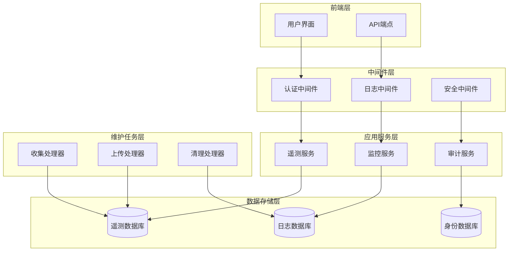
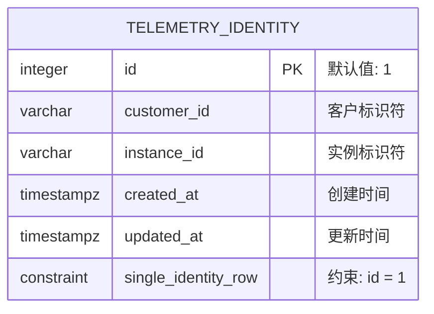
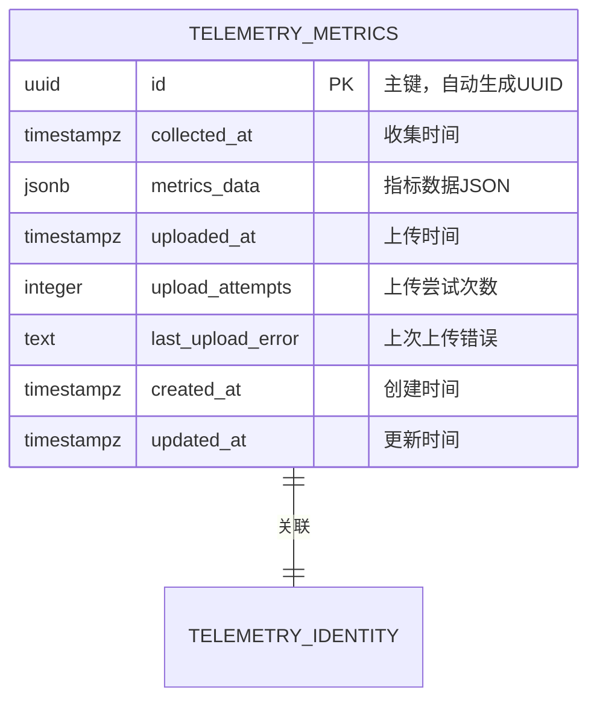
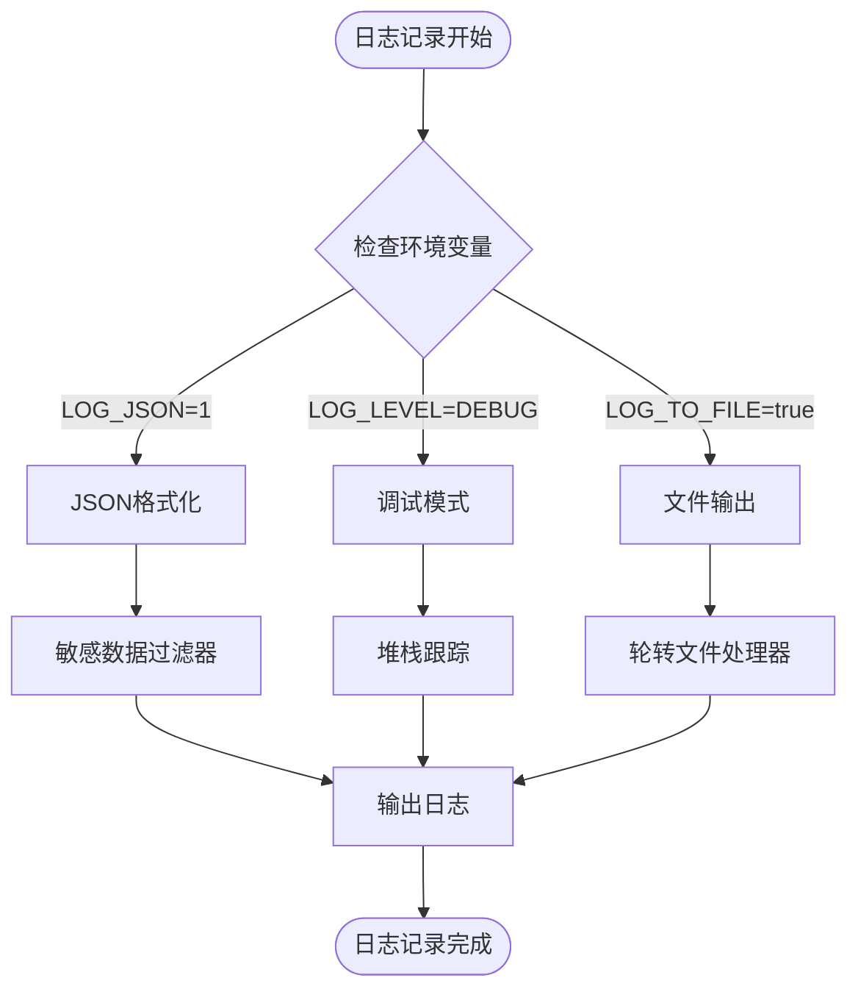
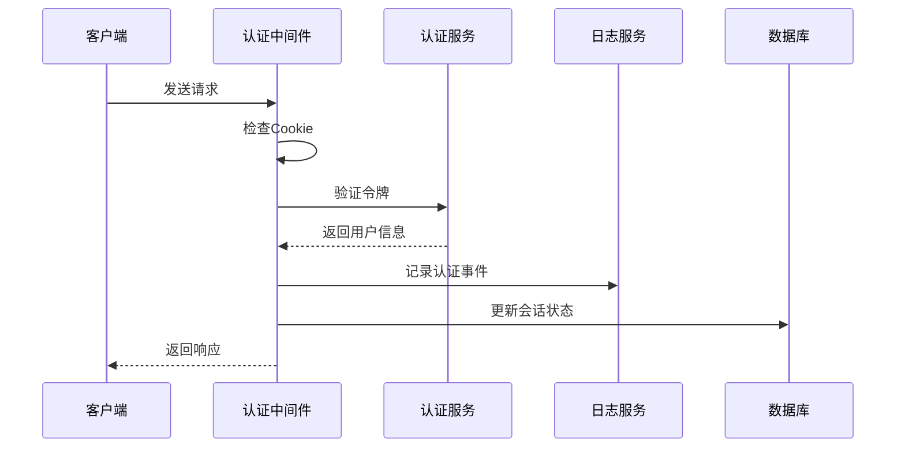
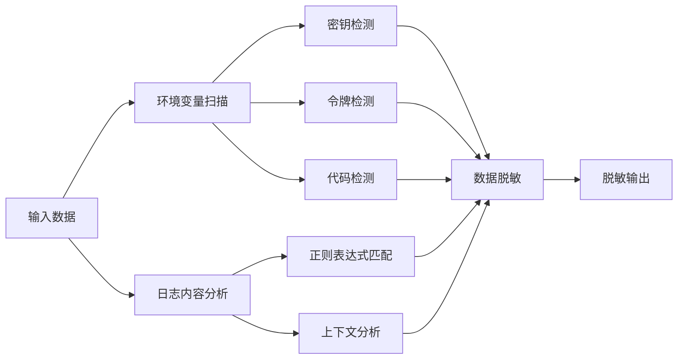
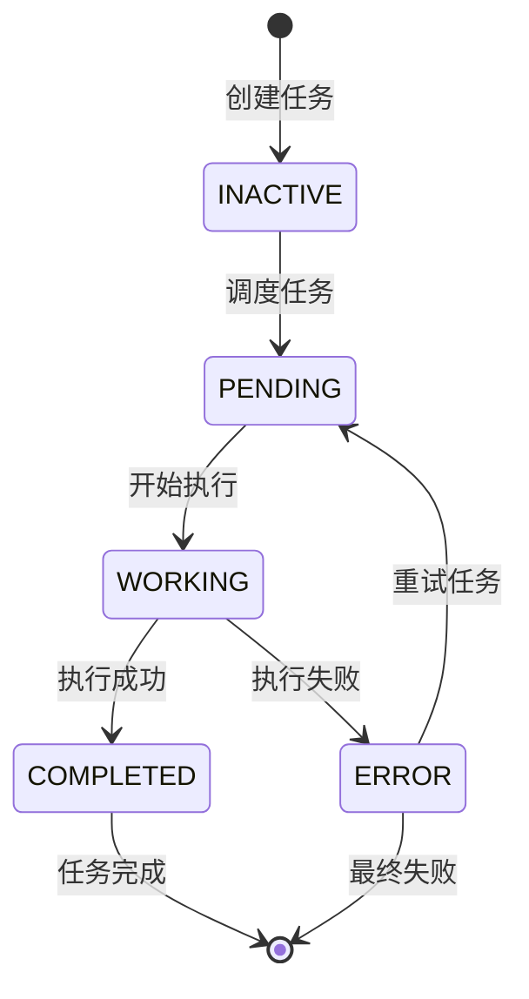
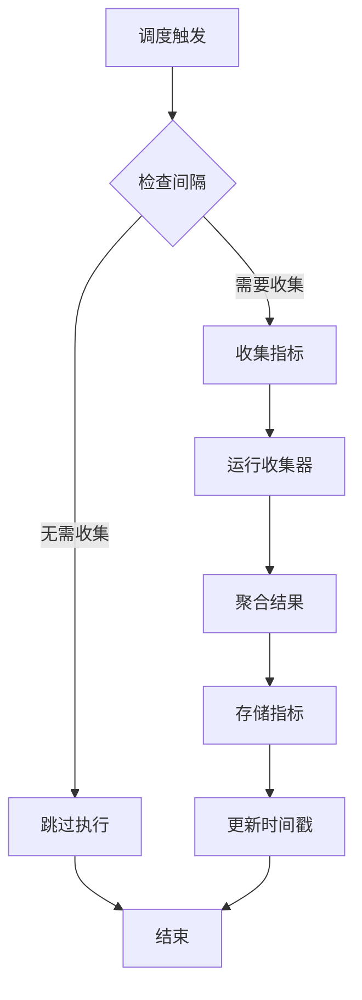
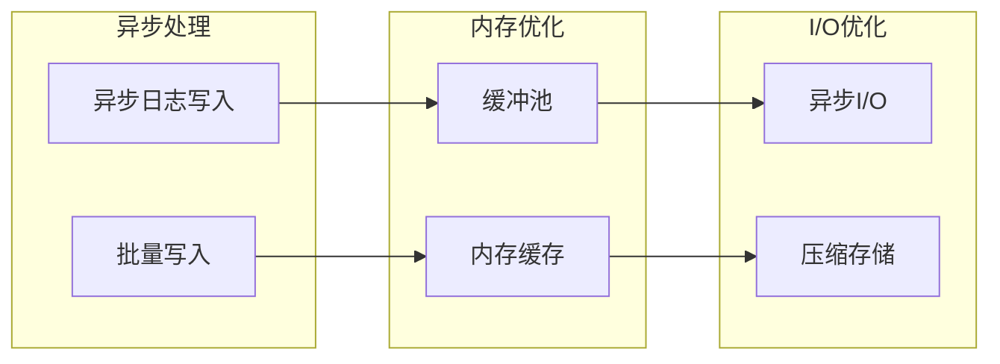

# 审计日志

<cite>
**本文档中引用的文件**
- [enterprise/server/logger.py](file://enterprise/server/logger.py)
- [enterprise/storage/telemetry_identity.py](file://enterprise/storage/telemetry_identity.py)
- [enterprise/storage/telemetry_metrics.py](file://enterprise/storage/telemetry_metrics.py)
- [enterprise/server/middleware.py](file://enterprise/server/middleware.py)
- [enterprise/server/saas_monitoring_listener.py](file://enterprise/server/saas_monitoring_listener.py)
- [openhands/core/logger.py](file://openhands/core/logger.py)
- [enterprise/doc/design-doc/openhands-enterprise-telemetry-design.md](file://enterprise/doc/design-doc/openhands-enterprise-telemetry-design.md)
- [enterprise/tests/unit/storage/test_telemetry_identity.py](file://enterprise/tests/unit/storage/test_telemetry_identity.py)
- [enterprise/tests/unit/test_logger.py](file://enterprise/tests/unit/test_logger.py)
- [enterprise/run_maintenance_tasks.py](file://enterprise/run_maintenance_tasks.py)
- [enterprise/migrations/versions/059_create_maintenance_tasks_table.py](file://enterprise/migrations/versions/059_create_maintenance_tasks_table.py)
</cite>

## 目录
1. [简介](#简介)
2. [系统架构概览](#系统架构概览)
3. [遥测数据表结构](#遥测数据表结构)
4. [日志记录机制](#日志记录机制)
5. [中间件审计](#中间件审计)
6. [敏感信息脱敏策略](#敏感信息脱敏策略)
7. [维护任务处理器](#维护任务处理器)
8. [日志查询和分析](#日志查询和分析)
9. [性能考虑](#性能考虑)
10. [故障排除指南](#故障排除指南)
11. [总结](#总结)

## 简介

OpenHands审计日志系统是一个全面的安全监控和合规性解决方案，旨在捕获关键用户操作、系统事件和遥测数据。该系统通过多层次的日志记录机制，确保符合数据隐私要求，同时为管理员提供强大的监控和分析工具。

### 核心特性

- **多层审计覆盖**：从应用层到数据库层的全方位日志记录
- **智能敏感信息保护**：自动识别和脱敏敏感数据
- **可扩展的遥测框架**：支持自定义指标收集
- **企业级合规性**：满足许可证管理和使用统计需求
- **高性能设计**：最小化对系统性能的影响

## 系统架构概览

OpenHands审计日志系统采用分层架构设计，包含以下核心组件：

**图表来源**
- [enterprise/server/middleware.py](file://enterprise/server/middleware.py#L1-L175)
- [enterprise/server/saas_monitoring_listener.py](file://enterprise/server/saas_monitoring_listener.py#L1-L76)

## 遥测数据表结构

### 身份表 (telemetry_identity)

身份表负责存储持久化的身份信息，这些信息必须在容器重启后仍然保持不变。

**表格来源**
- [enterprise/storage/telemetry_identity.py](file://enterprise/storage/telemetry_identity.py#L14-L99)

#### 字段定义

| 字段名 | 类型 | 约束 | 描述 |
|--------|------|------|------|
| id | INTEGER | PRIMARY KEY, DEFAULT 1 | 唯一标识符，强制为1以确保单行约束 |
| customer_id | VARCHAR(255) | NULLABLE | 与Replicated建立关系的唯一客户标识符 |
| instance_id | VARCHAR(255) | NULLABLE | 此OpenHands实例的唯一标识符 |
| created_at | TIMESTAMP WITH TIME ZONE | NOT NULL, DEFAULT CURRENT_TIMESTAMP | 记录创建时间戳 |
| updated_at | TIMESTAMP WITH TIME ZONE | NOT NULL, DEFAULT CURRENT_TIMESTAMP | 记录最后更新时间戳 |

### 指标表 (telemetry_metrics)

指标表存储收集的遥测指标数据，包含上传状态跟踪和重试逻辑。

**表格来源**
- [enterprise/storage/telemetry_metrics.py](file://enterprise/storage/telemetry_metrics.py#L15-L113)

#### 字段定义

| 字段名 | 类型 | 约束 | 描述 |
|--------|------|------|------|
| id | STRING | PRIMARY KEY, DEFAULT UUID | 唯一指标记录标识符 |
| collected_at | TIMESTAMP WITH TIME ZONE | NOT NULL | 指标收集的时间戳 |
| metrics_data | JSON | NOT NULL | 包含收集指标的JSON数据 |
| uploaded_at | TIMESTAMP WITH TIME ZONE | NULLABLE | 指标成功上传的时间戳 |
| upload_attempts | INTEGER | NOT NULL, DEFAULT 0 | 上传失败的尝试次数 |
| last_upload_error | TEXT | NULLABLE | 上次上传失败的错误信息 |
| created_at | TIMESTAMP WITH TIME ZONE | NOT NULL, DEFAULT CURRENT_TIMESTAMP | 记录创建时间戳 |
| updated_at | TIMESTAMP WITH TIME ZONE | NOT NULL, DEFAULT CURRENT_TIMESTAMP | 记录最后更新时间戳 |

**章节来源**
- [enterprise/storage/telemetry_identity.py](file://enterprise/storage/telemetry_identity.py#L1-L99)
- [enterprise/storage/telemetry_metrics.py](file://enterprise/storage/telemetry_metrics.py#L1-L113)

## 日志记录机制

### 结构化日志配置

OpenHands采用结构化日志格式，支持JSON输出和彩色控制台输出。

**图表来源**
- [openhands/core/logger.py](file://openhands/core/logger.py#L1-L606)
- [enterprise/server/logger.py](file://enterprise/server/logger.py#L1-L122)

### 日志级别配置

系统支持多种日志级别和配置选项：

| 环境变量 | 默认值 | 描述 |
|----------|--------|------|
| LOG_LEVEL | INFO | 全局日志级别 |
| LOG_JSON | False | 是否启用JSON格式输出 |
| DEBUG | False | 调试模式开关 |
| LOG_TO_FILE | False | 是否输出到文件 |
| LOG_ALL_EVENTS | False | 是否记录所有事件 |

### 日志处理器类型

1. **控制台处理器**：彩色输出，适合开发环境
2. **文件处理器**：轮转文件，适合生产环境
3. **JSON处理器**：结构化输出，适合云环境
4. **LLM处理器**：专门处理大语言模型交互日志

**章节来源**
- [openhands/core/logger.py](file://openhands/core/logger.py#L1-L606)
- [enterprise/server/logger.py](file://enterprise/server/logger.py#L1-L122)

## 中间件审计

### 认证Cookie中间件

认证中间件负责捕获和记录用户认证过程中的关键事件：

**图表来源**
- [enterprise/server/middleware.py](file://enterprise/server/middleware.py#L26-L175)

### 关键审计事件

1. **用户登录/登出**：记录认证状态变化
2. **权限变更**：跟踪用户权限提升或降级
3. **API访问**：记录API调用和响应
4. **异常处理**：记录认证失败和安全事件

### JWT验证和审计

系统对JWT令牌进行严格验证并记录相关事件：

- **签名验证**：检测无效签名尝试
- **过期检查**：记录令牌过期事件
- **TOS接受**：跟踪条款和服务接受状态

**章节来源**
- [enterprise/server/middleware.py](file://enterprise/server/middleware.py#L1-L175)

## 敏感信息脱敏策略

### 自动敏感数据识别

系统自动识别并脱敏以下类型的敏感数据：

**图表来源**
- [openhands/core/logger.py](file://openhands/core/logger.py#L239-L285)

### 支持的敏感数据类型

| 数据类别 | 检测模式 | 示例 |
|----------|----------|------|
| API密钥 | *_KEY, *_TOKEN | `API_KEY`, `GITHUB_TOKEN` |
| 访问密钥 | *_ACCESS_KEY | `AWS_ACCESS_KEY_ID` |
| 私有令牌 | *_SECRET | `JWT_SECRET` |
| GitHub令牌 | GITHUB_TOKEN | `ghp_xxxxxxxxxxxx` |
| 运行时令牌 | SANDBOX_ENV_* | `SANDBOX_ENV_GITHUB_TOKEN` |

### 脱敏算法

1. **精确匹配**：直接替换已知敏感值
2. **模式匹配**：使用正则表达式识别潜在敏感数据
3. **上下文分析**：结合上下文判断是否需要脱敏
4. **递归处理**：处理嵌套结构中的敏感数据

**章节来源**
- [openhands/core/logger.py](file://openhands/core/logger.py#L239-L285)
- [enterprise/tests/unit/test_logger.py](file://enterprise/tests/unit/test_logger.py#L1-L122)

## 维护任务处理器

### 任务生命周期管理

维护任务处理器负责协调各种后台操作：

**图表来源**
- [enterprise/migrations/versions/059_create_maintenance_tasks_table.py](file://enterprise/migrations/versions/059_create_maintenance_tasks_table.py#L1-L61)

### 遥测收集处理器

遥测收集处理器按计划周期性收集系统指标：

**图表来源**
- [enterprise/doc/design-doc/openhands-enterprise-telemetry-design.md](file://enterprise/doc/design-doc/openhands-enterprise-telemetry-design.md#L296-L352)

### 上传处理器

上传处理器负责将收集的指标数据发送到外部平台：

1. **数据准备**：获取待上传的指标记录
2. **身份验证**：验证Replicated平台凭据
3. **批量上传**：将指标数据发送到平台
4. **状态更新**：标记上传成功或失败
5. **错误处理**：记录上传失败原因

**章节来源**
- [enterprise/run_maintenance_tasks.py](file://enterprise/run_maintenance_tasks.py#L1-L78)
- [enterprise/migrations/versions/059_create_maintenance_tasks_table.py](file://enterprise/migrations/versions/059_create_maintenance_tasks_table.py#L1-L61)

## 日志查询和分析

### 查询接口设计

系统提供多种查询方式来分析审计日志：

| 查询类型 | 接口 | 参数 | 返回结果 |
|----------|------|------|----------|
| 时间范围查询 | `/api/logs` | startTime, endTime | 指定时间段内的日志 |
| 关键字搜索 | `/api/search` | keyword, level | 匹配关键字的日志 |
| 用户活动追踪 | `/api/user/activity` | userId | 用户相关操作日志 |
| 错误统计 | `/api/errors` | severity, count | 错误统计报告 |

### 分析仪表板

管理员可以通过以下维度分析系统状态：

1. **用户行为分析**：登录频率、操作类型分布
2. **系统健康监控**：错误率、响应时间趋势
3. **安全事件追踪**：认证失败、权限变更统计
4. **性能指标监控**：资源使用、并发连接数

### 实时告警

系统支持基于规则的实时告警：

- **阈值告警**：错误率超过设定阈值时触发
- **异常检测**：识别异常的用户行为模式
- **系统状态**：监控系统可用性和性能指标

## 性能考虑

### 日志记录性能优化

为了最小化对系统性能的影响，系统采用以下优化策略：

### 性能指标

| 指标 | 目标值 | 监控方法 |
|------|--------|----------|
| 日志写入延迟 | < 10ms | 应用程序监控 |
| 内存使用量 | < 100MB | 系统监控 |
| 磁盘I/O | < 10MB/s | 存储监控 |
| CPU使用率 | < 5% | 资源监控 |

### 扩展性设计

1. **水平扩展**：支持多实例部署
2. **负载均衡**：分散日志写入压力
3. **分区存储**：按时间分区存储日志
4. **压缩存储**：减少存储空间占用

## 故障排除指南

### 常见问题诊断

#### 日志丢失问题

**症状**：部分日志未被记录
**可能原因**：
- 文件权限不足
- 磁盘空间不足
- 日志级别设置过高

**解决步骤**：
1. 检查日志目录权限
2. 监控磁盘使用情况
3. 调整日志级别配置

#### 敏感信息泄露

**症状**：敏感数据出现在日志中
**可能原因**：
- 脱敏规则不完整
- 新增敏感数据类型
- 配置错误

**解决步骤**：
1. 更新敏感数据识别规则
2. 重新测试脱敏功能
3. 检查配置文件完整性

#### 性能问题

**症状**：系统响应缓慢
**可能原因**：
- 日志写入阻塞
- 缓冲区溢出
- 磁盘I/O瓶颈

**解决步骤**：
1. 启用异步日志写入
2. 增加缓冲区大小
3. 优化磁盘配置

### 监控和诊断工具

1. **日志分析工具**：实时查看和分析日志流
2. **性能监控面板**：监控系统性能指标
3. **告警管理系统**：接收和处理系统告警
4. **调试控制台**：手动触发诊断命令

**章节来源**
- [enterprise/tests/unit/test_logger.py](file://enterprise/tests/unit/test_logger.py#L1-L269)

## 总结

OpenHands审计日志系统提供了全面的安全监控和合规性解决方案。通过多层次的日志记录机制、智能的敏感信息保护策略和高效的维护任务处理，系统能够在保证数据隐私的同时，为管理员提供强大的监控和分析能力。

### 主要优势

1. **全面覆盖**：从应用层到数据库层的全方位审计
2. **智能保护**：自动识别和脱敏敏感数据
3. **高效执行**：最小化对系统性能的影响
4. **易于扩展**：支持自定义指标和处理器
5. **合规友好**：满足企业级安全和合规要求

### 最佳实践建议

1. **定期审查**：定期检查日志配置和脱敏规则
2. **容量规划**：根据业务规模规划存储容量
3. **监控告警**：建立完善的监控和告警机制
4. **备份策略**：制定日志数据的备份和恢复策略
5. **安全加固**：定期更新安全配置和防护措施

通过合理配置和使用本审计日志系统，组织可以有效监控系统安全状况，及时发现和响应安全威胁，同时确保符合各种合规性要求。