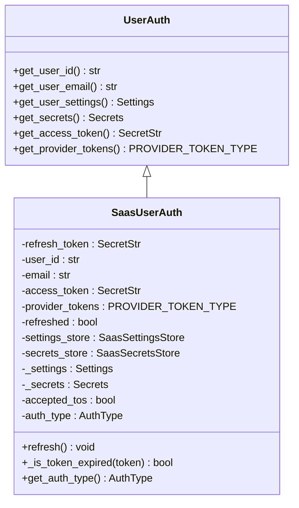
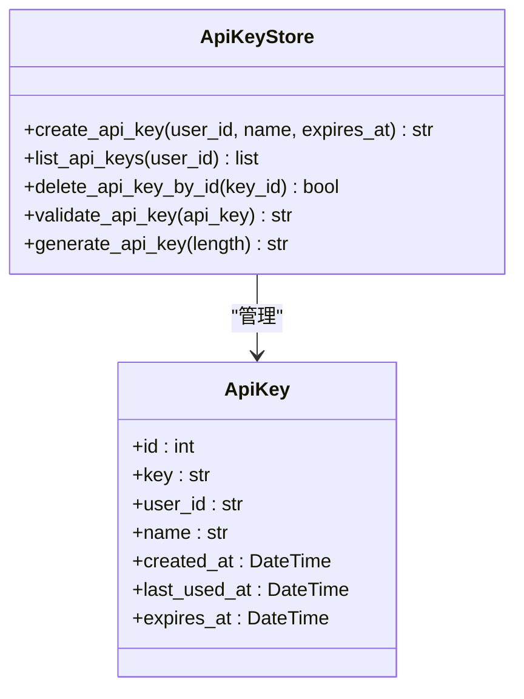
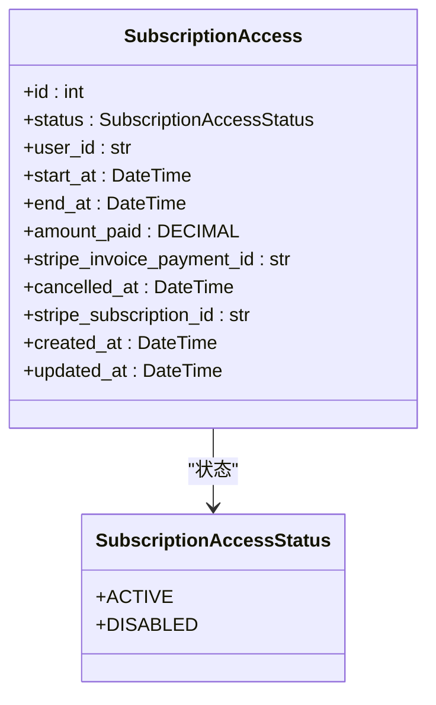
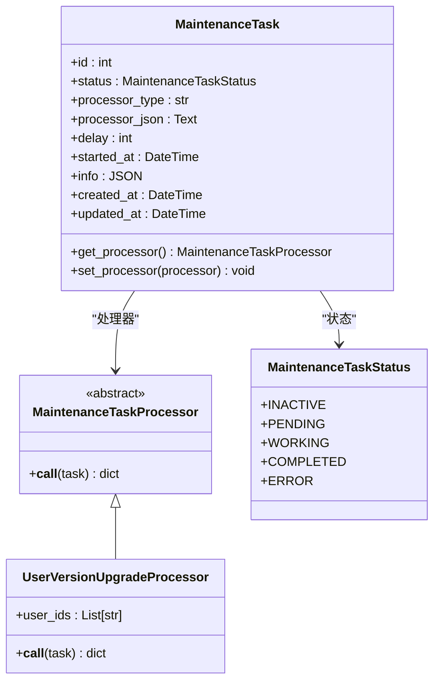
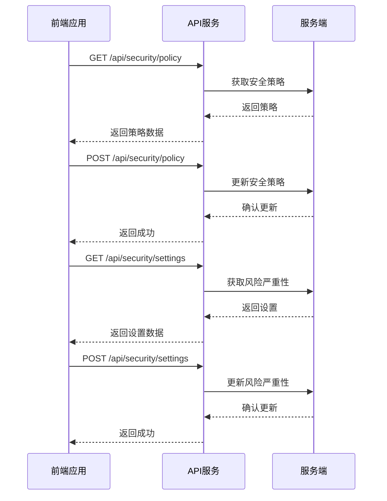

# 授权策略

<cite>
**本文档引用的文件**  
- [saas_user_auth.py](file://enterprise/server/auth/saas_user_auth.py)
- [api_keys.py](file://enterprise/server/routes/api_keys.py)
- [subscription_access.py](file://enterprise/storage/subscription_access.py)
- [api_key.py](file://enterprise/storage/api_key.py)
- [user_version_upgrade_processor.py](file://enterprise/server/maintenance_task_processor/user_version_upgrade_processor.py)
- [middleware.py](file://enterprise/server/middleware.py)
- [invariant-service.ts](file://frontend/src/api/invariant-service.ts)
</cite>

## 目录
1. [引言](#引言)
2. [基于角色的访问控制(RBAC)模型](#基于角色的访问控制rbac模型)
3. [API密钥管理](#api密钥管理)
4. [企业版订阅访问控制](#企业版订阅访问控制)
5. [用户版本升级授权逻辑](#用户版本升级授权逻辑)
6. [安全审计日志配置](#安全审计日志配置)
7. [最小权限原则实施](#最小权限原则实施)
8. [实际案例](#实际案例)
9. [结论](#结论)

## 引言
OpenHands平台提供了一套全面的权限管理和访问控制机制，确保系统安全性和数据保护。本文档详细阐述了平台的授权策略，包括基于角色的访问控制(RBAC)模型、API密钥管理、企业版特有的订阅访问控制以及用户版本升级任务的授权逻辑。文档还涵盖了安全审计日志的配置方法和最小权限原则的实施指导，帮助管理员有效管理权限，防止权限提升攻击。

## 基于角色的访问控制(RBAC)模型
OpenHands平台实现了基于角色的访问控制(RBAC)模型，通过`SaasUserAuth`类管理用户认证和权限。该模型支持多种认证方式，包括基于Cookie的会话认证和基于Bearer Token的API认证。

用户认证流程首先检查API密钥，如果不存在则检查Cookie中的认证令牌。系统使用JWT(JSON Web Token)进行令牌验证和管理，支持令牌刷新机制。用户权限与用户ID关联，通过不同的认证类型(AuthType)区分访问来源。

**图源**
- [saas_user_auth.py](file://enterprise/server/auth/saas_user_auth.py#L43-L324)

**本节来源**
- [saas_user_auth.py](file://enterprise/server/auth/saas_user_auth.py#L43-L324)

## API密钥管理
OpenHands平台提供了完整的API密钥生命周期管理功能，包括创建、列出、删除和管理特定用途的API密钥。

### API密钥创建与管理
API密钥通过`api_keys.py`路由进行管理，支持创建具有可选过期时间的API密钥。每个API密钥与特定用户关联，存储在`api_keys`数据库表中，包含密钥值、用户ID、名称、创建时间和最后使用时间等信息。

**图源**
- [api_key.py](file://enterprise/storage/api_key.py#L5-L20)
- [api_keys.py](file://enterprise/server/routes/api_keys.py#L154-L390)

### BYOR(Bring Your Own Runtime)密钥管理
平台还支持BYOR(Bring Your Own Runtime)场景下的LLM API密钥管理。系统通过LiteLLM服务生成和管理专用API密钥，支持密钥的获取和刷新操作。当用户请求BYOR密钥时，系统首先检查数据库中是否已存在有效密钥，如果不存在则调用LiteLLM API生成新密钥并存储。

**本节来源**
- [api_keys.py](file://enterprise/server/routes/api_keys.py#L1-L390)
- [api_key.py](file://enterprise/storage/api_key.py#L1-L20)

## 企业版订阅访问控制
企业版OpenHands平台引入了订阅访问控制机制，通过`subscription_access`表跟踪用户的订阅状态和访问权限。

### 订阅访问表结构
`subscription_access`表记录了用户的订阅信息，包括状态、用户ID、有效期、支付信息和创建/更新时间。订阅状态使用枚举类型定义，当前支持ACTIVE(激活)和DISABLED(禁用)两种状态。

**图源**
- [subscription_access.py](file://enterprise/storage/subscription_access.py#L7-L46)
- [subscription_access_status.py](file://enterprise/storage/subscription_access_status.py#L4-L6)

### 订阅状态管理
订阅访问记录通过数据库迁移脚本创建，确保所有用户订阅状态的变更都被持久化记录。管理员可以通过查询此表来验证用户的订阅状态，决定是否授予特定功能的访问权限。

**本节来源**
- [subscription_access.py](file://enterprise/storage/subscription_access.py#L1-L46)
- [074_create_subscription_access_table.py](file://enterprise/migrations/versions/074_create_subscription_access_table.py#L1-L66)

## 用户版本升级授权逻辑
OpenHands平台实现了安全的用户版本升级机制，通过维护任务处理器来处理用户设置的版本升级。

### 维护任务处理器架构
系统使用`MaintenanceTask`和`MaintenanceTaskProcessor`抽象类构建维护任务框架。`UserVersionUpgradeProcessor`作为具体实现，负责处理用户版本升级任务。

**图源**
- [maintenance_task.py](file://enterprise/storage/maintenance_task.py#L17-L110)
- [user_version_upgrade_processor.py](file://enterprise/server/maintenance_task_processor/user_version_upgrade_processor.py#L15-L156)

### 版本升级流程
用户版本升级处理器接收用户ID列表，检查每个用户的当前版本是否低于系统当前版本。对于需要升级的用户，系统调用`SaasSettingsStore.create_default_settings()`方法进行升级。处理器限制每次任务处理的用户数量不超过100个，以确保系统性能和稳定性。

数据库迁移脚本会在系统升级时自动创建用户版本升级任务，确保所有用户的设置都能及时更新到最新版本。

**本节来源**
- [user_version_upgrade_processor.py](file://enterprise/server/maintenance_task_processor/user_version_upgrade_processor.py#L1-L156)
- [060_create_user_version_upgrade_tasks.py](file://enterprise/migrations/versions/060_create_user_version_upgrade_tasks.py#L1-L100)

## 安全审计日志配置
OpenHands平台提供了安全策略和风险严重性级别的管理接口，支持安全审计功能。

### 安全策略管理
通过前端`InvariantService`类，管理员可以获取和更新安全策略、风险严重性级别，并导出安全追踪信息。这些操作通过API端点`/api/security/policy`和`/api/security/settings`实现，确保所有安全相关的变更都被记录和审计。

**图源**
- [invariant-service.ts](file://frontend/src/api/invariant-service.ts#L1-L30)

### 认证中间件审计
认证中间件`SetAuthCookieMiddleware`记录了关键的认证事件，包括令牌刷新、用户登出和认证错误。这些日志信息包含用户ID、任务ID和操作结果，为安全审计提供了重要数据。

**本节来源**
- [invariant-service.ts](file://frontend/src/api/invariant-service.ts#L1-L30)
- [middleware.py](file://enterprise/server/middleware.py#L26-L175)

## 最小权限原则实施
OpenHands平台通过多种机制实施最小权限原则，防止权限提升攻击。

### 认证与会话管理
系统采用分层认证机制，区分Cookie认证和Bearer Token认证。所有敏感操作都需要有效的认证令牌，且令牌具有过期机制。中间件会验证令牌的有效性，并在令牌过期时要求重新认证。

### 权限边界控制
API密钥具有明确的权限边界，只能访问创建者所属用户的资源。系统在执行操作前会验证API密钥与用户ID的关联关系，防止跨用户访问。BYOR密钥专门用于运行时通信，与其他API密钥隔离，降低了权限泄露的风险。

### 安全配置
系统配置了速率限制器，防止暴力破解攻击。认证错误会被记录并可能导致账户临时锁定。同时，系统要求用户接受服务条款(TOS)才能完全访问服务，确保用户知晓并同意使用条款。

**本节来源**
- [saas_user_auth.py](file://enterprise/server/auth/saas_user_auth.py#L43-L324)
- [middleware.py](file://enterprise/server/middleware.py#L26-L175)

## 实际案例
### 案例1：为开发团队配置API访问
为开发团队创建API密钥，用于自动化测试和CI/CD集成。每个开发者可以创建自己的API密钥，具有30天有效期。通过API密钥，开发者可以访问OpenHands的自动化功能，但无法访问其他用户的会话或数据。

### 案例2：企业客户订阅管理
为企业客户配置订阅访问，通过`subscription_access`表跟踪其订阅状态。当客户订阅激活时，系统自动授予企业版功能的访问权限；当订阅过期或取消时，相关权限被自动禁用。

### 案例3：安全审计响应
当安全团队发现异常活动时，可以通过安全策略API调整风险严重性级别，触发更严格的安全检查。同时，可以查看认证日志，追踪可疑活动的来源，并采取相应措施。

**本节来源**
- [api_keys.py](file://enterprise/server/routes/api_keys.py#L1-L390)
- [subscription_access.py](file://enterprise/storage/subscription_access.py#L1-L46)
- [invariant-service.ts](file://frontend/src/api/invariant-service.ts#L1-L30)

## 结论
OpenHands平台的授权策略设计全面考虑了安全性、灵活性和可管理性。通过基于角色的访问控制、精细的API密钥管理、企业版订阅控制和安全审计功能，平台为不同规模的用户提供了可靠的权限管理解决方案。管理员应遵循最小权限原则，合理配置访问控制，定期审查权限分配，确保系统的安全稳定运行。