# 用户权限控制

<cite>
**本文档引用的文件**
- [user_settings.py](file://enterprise/storage/user_settings.py)
- [subscription_access.py](file://enterprise/storage/subscription_access.py)
- [maintenance_task.py](file://enterprise/storage/maintenance_task.py)
- [user_version_upgrade_processor.py](file://enterprise/server/maintenance_task_processor/user_version_upgrade_processor.py)
- [constants.py](file://enterprise/server/constants.py)
- [saas_settings_store.py](file://enterprise/storage/saas_settings_store.py)
- [billing.py](file://enterprise/server/routes/billing.py)
- [app-settings.tsx](file://frontend/src/routes/app-settings.tsx)
- [subscription_access_status.py](file://enterprise/storage/subscription_access_status.py)
- [007_add_enable_sound_notifications_column.py](file://enterprise/migrations/versions/007_add_enable_sound_notifications_column.py)
- [008_fix_enable_sound_notifications_column.py](file://enterprise/migrations/versions/008_fix_enable_sound_notifications_column.py)
- [009_fix_enable_sound_notifications_column.py](file://enterprise/migrations/versions/009_fix_enable_sound_notifications_column.py)
- [048_add_max_budget_per_task_to_user_settings.py](file://enterprise/migrations/versions/048_add_max_budget_per_task_to_user_settings.py)
</cite>

## 目录
1. [简介](#简介)
2. [项目结构概览](#项目结构概览)
3. [核心权限组件](#核心权限组件)
4. [架构概览](#架构概览)
5. [详细组件分析](#详细组件分析)
6. [依赖关系分析](#依赖关系分析)
7. [性能考虑](#性能考虑)
8. [故障排除指南](#故障排除指南)
9. [结论](#结论)

## 简介

OpenHands的企业版用户权限控制系统是一个多层次的安全框架，旨在保护系统资源并确保用户只能访问其被授权的功能。该系统通过三个主要组件实现：用户设置表(user_settings)、订阅访问表(subscription_access)和维护任务系统(maintenance_tasks)，形成了一个完整的权限管理体系。

该权限控制体系的核心目标是：
- 实现最小权限原则，确保用户只能访问必要的功能
- 提供灵活的权限配置机制，支持不同用户角色的需求
- 确保企业级安全性和合规性要求
- 支持动态权限调整和版本升级

## 项目结构概览

OpenHands的用户权限控制体系主要分布在以下目录结构中：

```mermaid
graph TB
subgraph "企业版权限控制架构"
A[enterprise/] --> B[storage/]
A --> C[server/]
A --> D[frontend/]
B --> E[user_settings.py]
B --> F[subscription_access.py]
B --> G[maintenance_task.py]
C --> H[maintenance_task_processor/]
C --> I[routes/]
C --> J[auth/]
H --> K[user_version_upgrade_processor.py]
D --> L[app-settings.tsx]
D --> M[billing-service/]
end
```



**图表来源**
- [user_settings.py](file://enterprise/storage/user_settings.py#L1-L41)
- [subscription_access.py](file://enterprise/storage/subscription_access.py#L1-L46)
- [maintenance_task.py](file://enterprise/storage/maintenance_task.py#L1-L110)

## 核心权限组件

### 用户设置表 (UserSettings)

用户设置表是权限控制的核心数据存储，包含了用户的所有配置选项和权限标识。

#### 主要字段及其权限含义

| 字段名 | 数据类型 | 默认值 | 权限含义 |
|--------|----------|--------|----------|
| `max_budget_per_task` | Float | None | 单个任务的最大预算限制，控制用户使用成本 |
| `enable_sound_notifications` | Boolean | False | 启用/禁用声音通知功能 |
| `enable_proactive_conversation_starters` | Boolean | True | 启用主动对话启动器功能 |
| `enable_solvability_analysis` | Boolean | False | 启用可解性分析功能 |
| `user_version` | Integer | 0 | 用户设置版本号，用于版本升级管理 |
| `billing_margin` | Float | DEFAULT_BILLING_MARGIN | 账单利润率设置 |

#### 关键权限配置


**图表来源**
- [user_settings.py](file://enterprise/storage/user_settings.py#L6-L41)
- [saas_settings_store.py](file://enterprise/storage/saas_settings_store.py#L37-L393)

**章节来源**
- [user_settings.py](file://enterprise/storage/user_settings.py#L1-L41)
- [saas_settings_store.py](file://enterprise/storage/saas_settings_store.py#L1-L393)

### 订阅访问表 (SubscriptionAccess)

订阅访问表负责跟踪用户的订阅状态和访问权限，是企业版权限控制的重要组成部分。

#### 订阅状态枚举和业务逻辑

```mermaid
stateDiagram-v2
[*] --> INACTIVE
INACTIVE --> PENDING : 创建订阅记录
PENDING --> WORKING : 开始处理
WORKING --> COMPLETED : 处理成功
WORKING --> ERROR : 处理失败
COMPLETED --> [*]
ERROR --> [*]
note right of ACTIVE : ACTIVE状态允许完整功能访问
note right of DISABLED : DISABLED状态限制功能访问
```

#### 订阅访问状态转换

| 当前状态 | 目标状态 | 触发条件 | 权限影响 |
|----------|----------|----------|----------|
| INACTIVE | PENDING | 用户订阅开始 | 准备激活权限 |
| PENDING | WORKING | 订阅验证完成 | 开始权限激活 |
| WORKING | COMPLETED | 权限设置成功 | 完全功能访问 |
| WORKING | ERROR | 权限设置失败 | 降级到基础功能 |
| ACTIVE | DISABLED | 订阅到期或取消 | 功能访问受限 |

**章节来源**
- [subscription_access.py](file://enterprise/storage/subscription_access.py#L1-L46)
- [subscription_access_status.py](file://enterprise/storage/subscription_access_status.py#L1-L6)

### 维护任务系统 (MaintenanceTasks)

维护任务系统提供了自动化权限管理和版本升级功能，确保用户设置的一致性和安全性。

#### 维护任务处理器架构


**图表来源**
- [maintenance_task.py](file://enterprise/storage/maintenance_task.py#L17-L110)
- [user_version_upgrade_processor.py](file://enterprise/server/maintenance_task_processor/user_version_upgrade_processor.py#L15-L156)

**章节来源**
- [maintenance_task.py](file://enterprise/storage/maintenance_task.py#L1-L110)
- [user_version_upgrade_processor.py](file://enterprise/server/maintenance_task_processor/user_version_upgrade_processor.py#L1-L156)

## 架构概览

OpenHands的用户权限控制架构采用分层设计，确保了系统的可扩展性和安全性。


**图表来源**
- [app-settings.tsx](file://frontend/src/routes/app-settings.tsx#L1-L27)
- [billing.py](file://enterprise/server/routes/billing.py#L120-L143)
- [saas_settings_store.py](file://enterprise/storage/saas_settings_store.py#L37-L393)

## 详细组件分析

### 用户设置权限管理

#### 预算限制权限控制

用户设置表中的`max_budget_per_task`字段实现了精细化的预算控制机制：


#### 声音通知权限管理

声音通知功能通过`enable_sound_notifications`字段控制，该字段的迁移历史体现了权限管理的演进过程：


**图表来源**
- [007_add_enable_sound_notifications_column.py](file://enterprise/migrations/versions/007_add_enable_sound_notifications_column.py#L1-L31)
- [008_fix_enable_sound_notifications_column.py](file://enterprise/migrations/versions/008_fix_enable_sound_notifications_column.py#L1-L36)
- [009_fix_enable_sound_notifications_column.py](file://enterprise/migrations/versions/009_fix_enable_sound_notifications_column.py#L1-L39)

**章节来源**
- [007_add_enable_sound_notifications_column.py](file://enterprise/migrations/versions/007_add_enable_sound_notifications_column.py#L1-L31)
- [008_fix_enable_sound_notifications_column.py](file://enterprise/migrations/versions/008_fix_enable_sound_notifications_column.py#L1-L36)
- [009_fix_enable_sound_notifications_column.py](file://enterprise/migrations/versions/009_fix_enable_sound_notifications_column.py#L1-L39)

### 订阅访问权限控制

#### 订阅状态验证流程


#### 订阅访问表的数据模型

订阅访问表的设计充分考虑了企业级应用的需求：

| 字段 | 类型 | 约束 | 用途 |
|------|------|------|------|
| `status` | Enum | NOT NULL | 订阅状态（ACTIVE/DISABLED） |
| `user_id` | String | NOT NULL, INDEX | 用户唯一标识 |
| `start_at` | DateTime | NULLABLE | 订阅开始时间 |
| `end_at` | DateTime | NULLABLE | 订阅结束时间 |
| `cancelled_at` | DateTime | NULLABLE | 取消时间 |
| `stripe_subscription_id` | String | INDEX | Stripe订阅ID |

**章节来源**
- [subscription_access.py](file://enterprise/storage/subscription_access.py#L1-L46)
- [billing.py](file://enterprise/server/routes/billing.py#L120-L143)

### 企业版用户版本升级

#### 版本升级处理器工作流程


#### 版本升级的安全机制

版本升级处理器实现了严格的安全控制：


**图表来源**
- [user_version_upgrade_processor.py](file://enterprise/server/maintenance_task_processor/user_version_upgrade_processor.py#L15-L156)
- [saas_settings_store.py](file://enterprise/storage/saas_settings_store.py#L128-L393)

**章节来源**
- [user_version_upgrade_processor.py](file://enterprise/server/maintenance_task_processor/user_version_upgrade_processor.py#L1-L156)
- [constants.py](file://enterprise/server/constants.py#L22-L33)

### 前端权限控制界面

#### 设置管理组件的权限控制

前端设置管理组件提供了直观的权限配置界面：


**图表来源**
- [app-settings.tsx](file://frontend/src/routes/app-settings.tsx#L1-L27)

**章节来源**
- [app-settings.tsx](file://frontend/src/routes/app-settings.tsx#L1-L27)

## 依赖关系分析

### 权限控制系统的依赖图


**图表来源**
- [user_settings.py](file://enterprise/storage/user_settings.py#L1-L41)
- [saas_settings_store.py](file://enterprise/storage/saas_settings_store.py#L1-L393)
- [constants.py](file://enterprise/server/constants.py#L1-L107)

### 数据库模式依赖

权限控制系统的数据库模式展现了清晰的层次结构：


**图表来源**
- [user_settings.py](file://enterprise/storage/user_settings.py#L6-L41)
- [subscription_access.py](file://enterprise/storage/subscription_access.py#L7-L46)
- [maintenance_task.py](file://enterprise/storage/maintenance_task.py#L55-L110)

**章节来源**
- [user_settings.py](file://enterprise/storage/user_settings.py#L1-L41)
- [subscription_access.py](file://enterprise/storage/subscription_access.py#L1-L46)
- [maintenance_task.py](file://enterprise/storage/maintenance_task.py#L1-L110)

## 性能考虑

### 权限检查优化策略

1. **缓存机制**：用户权限信息采用多层缓存策略，减少数据库查询次数
2. **批量处理**：维护任务支持批量用户处理，提高版本升级效率
3. **索引优化**：关键字段建立适当索引，加速权限查询
4. **异步处理**：权限变更采用异步处理，避免阻塞主线程

### 内存使用优化

- 用户设置对象采用懒加载机制，只在需要时加载完整配置
- 加密密钥使用一次性生成，避免长期内存占用
- 大批量操作采用流式处理，控制内存峰值

### 并发控制

- 使用数据库事务确保权限变更的一致性
- 实现乐观锁机制防止并发冲突
- 维护任务采用分布式锁，避免重复执行

## 故障排除指南

### 常见权限问题及解决方案

#### 用户设置无法保存

**问题症状**：用户修改设置后无法保存，出现错误提示

**可能原因**：
1. 数据库连接问题
2. 用户权限不足
3. 设置值超出范围

**解决步骤**：
1. 检查数据库连接状态
2. 验证用户订阅状态
3. 检查设置值的有效性
4. 查看相关日志信息

#### 订阅权限失效

**问题症状**：付费用户无法使用高级功能

**诊断流程**：


#### 维护任务执行失败

**问题症状**：用户版本升级任务失败

**排查步骤**：
1. 检查任务状态是否为ERROR
2. 查看任务日志中的具体错误信息
3. 验证数据库连接和权限
4. 检查LiteLLM服务可用性

**章节来源**
- [billing.py](file://enterprise/server/routes/billing.py#L619-L656)
- [user_version_upgrade_processor.py](file://enterprise/server/maintenance_task_processor/user_version_upgrade_processor.py#L25-L156)

### 监控和告警

系统提供了完善的监控机制：

- 权限变更事件记录
- 异常访问尝试监控
- 维护任务执行状态跟踪
- 性能指标收集和告警

## 结论

OpenHands的企业版用户权限控制系统通过精心设计的三层架构，实现了全面而灵活的权限管理。该系统的主要优势包括：

1. **完整性**：覆盖了从用户设置到订阅管理的全流程权限控制
2. **灵活性**：支持多种用户角色和权限组合配置
3. **可扩展性**：模块化设计便于添加新的权限控制功能
4. **安全性**：多重验证机制确保权限控制的可靠性
5. **可观测性**：完善的日志和监控体系便于问题诊断

该权限控制体系为企业级应用提供了坚实的安全基础，同时保持了良好的用户体验。随着业务的发展，该系统可以通过添加新的处理器和扩展权限模型来适应不断变化的需求。

未来的改进方向包括：
- 增强实时权限验证能力
- 优化大规模用户场景下的性能
- 扩展细粒度权限控制功能
- 加强与第三方认证系统的集成