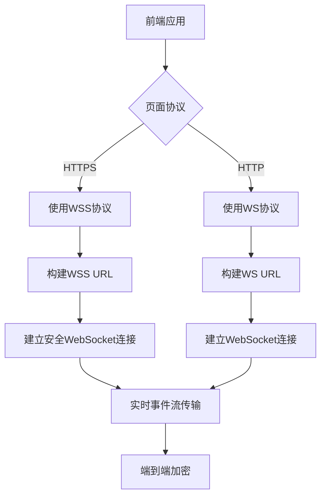
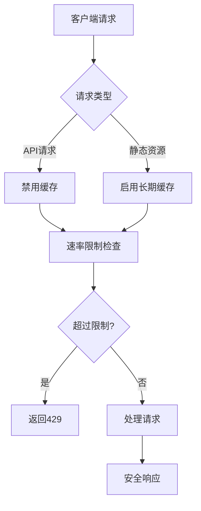

# 传输安全

<cite>
**本文档引用的文件**
- [jwt_service.py](file://openhands/app_server/services/jwt_service.py)
- [middleware.py](file://openhands/server/middleware.py)
- [http_session.py](file://openhands/utils/http_session.py)
- [websocket-url.ts](file://frontend/src/utils/websocket-url.ts)
- [use-websocket.ts](file://frontend/src/hooks/use-websocket.ts)
- [encryption_key.py](file://openhands/app_server/utils/encryption_key.py)
- [vite.config.ts](file://frontend/vite.config.ts)
- [auth.py](file://enterprise/server/routes/auth.py)
</cite>

## 目录
1. [引言](#引言)
2. [HTTPS/TLS配置要求](#httpstls配置要求)
3. [JWT令牌安全传输机制](#jwt令牌安全传输机制)
4. [WebSocket连接加密实现](#websocket连接加密实现)
5. [前端与后端API通信安全配置](#前端与后端api通信安全配置)
6. [网络层安全最佳实践](#网络层安全最佳实践)
7. [常见漏洞防御方案](#常见漏洞防御方案)
8. [结论](#结论)

## 引言

OpenHands系统通过多层次的安全机制确保数据传输的机密性、完整性和可用性。本文档全面阐述了系统的传输安全架构，包括HTTPS/TLS配置、JWT令牌管理、WebSocket加密、CORS策略等关键安全组件。系统采用现代安全实践，通过加密套件、证书验证、令牌签名等技术手段，有效防御中间人攻击等常见网络威胁，确保用户数据在传输过程中的安全性。

## HTTPS/TLS配置要求

OpenHands系统通过严格的HTTPS/TLS配置确保网络通信的安全性。系统在HTTP客户端配置中默认启用SSL证书验证，使用`ssl.create_default_context()`创建安全上下文，确保所有外部HTTP请求都经过证书验证。系统通过环境变量`VITE_INSECURE_SKIP_VERIFY`控制证书验证行为，生产环境中该选项默认关闭，强制执行严格的证书验证。

系统在存储服务中实现了URL协议的安全处理机制，通过`_ensure_url_scheme`方法确保安全连接使用HTTPS协议。当`secure`参数为`True`时，系统会自动将HTTP协议升级为HTTPS，防止协议降级攻击。这种机制确保了敏感数据在传输过程中始终使用加密通道。

**Section sources**
- [http_session.py](file://openhands/utils/http_session.py#L1-L42)
- [s3.py](file://openhands/storage/s3.py#L156-L165)

## JWT令牌安全传输机制

OpenHands系统采用JWT（JSON Web Token）作为跨服务通信的主要安全机制。系统实现了完整的JWT服务，支持令牌的创建、验证、加密和解密功能。JWT服务支持多种加密算法，包括HS256等安全算法，确保令牌的完整性和机密性。

系统采用多密钥管理机制，支持密钥轮换和版本控制。每个密钥都有唯一的ID和创建时间戳，系统自动选择最新的有效密钥作为默认签名密钥。令牌包含标准的JWT声明，如签发时间(iat)和过期时间(exp)，默认有效期为1小时，有效防止重放攻击。

JWT服务支持JWE（JSON Web Encryption）标准，对敏感数据进行加密保护。系统使用SHA256算法从密钥派生256位加密密钥，采用A256GCM加密模式，提供强大的数据机密性保护。密钥管理基于环境变量`JWT_SECRET`或本地密钥文件，确保密钥的安全存储和访问控制。

**Section sources**
- [jwt_service.py](file://openhands/app_server/services/jwt_service.py#L21-L249)
- [encryption_key.py](file://openhands/app_server/utils/encryption_key.py#L1-L59)

## WebSocket连接加密实现

OpenHands系统通过WebSocket协议实现前端与后端的实时事件流通信，确保数据传输的端到端安全性。系统根据当前页面的协议自动选择WebSocket的安全协议：当页面使用HTTPS时，WebSocket连接自动升级为WSS（WebSocket Secure）；当页面使用HTTP时，使用WS协议。

前端通过`buildWebSocketUrl`工具函数构建WebSocket连接URL，该函数根据传入的会话URL提取主机和端口信息，结合当前页面的协议构建安全的WebSocket连接地址。连接路径遵循`/sockets/events/{conversationId}`的标准化格式，确保连接的可预测性和安全性。

系统实现了WebSocket连接的自动重连机制，当连接意外断开时，客户端会在3秒延迟后尝试重新连接。重连机制包含最大尝试次数限制，防止无限重试导致的资源耗尽。连接状态通过事件监听器进行管理，确保应用能够及时响应连接状态变化。

**Diagram sources**
- [websocket-url.ts](file://frontend/src/utils/websocket-url.ts#L33-L54)
- [use-websocket.ts](file://frontend/src/hooks/use-websocket.ts#L37-L192)

## 前端与后端API通信安全配置

OpenHands系统通过全面的安全配置确保前端与后端API通信的安全性。系统实现了自定义的CORS（跨域资源共享）中间件，对本地开发环境提供特殊支持。当请求来源为localhost或127.0.0.1时，无论端口号如何，都允许跨域请求，方便本地开发调试。

对于生产环境，系统通过`PERMITTED_CORS_ORIGINS`环境变量配置允许的跨域来源，实施严格的访问控制。中间件配置允许凭据、所有HTTP方法和所有请求头，同时根据请求路径设置不同的缓存策略：静态资源启用长期缓存，API响应禁用缓存，防止敏感数据被浏览器缓存。

系统通过安全的Cookie机制管理用户会话。认证Cookie设置`HttpOnly`标志，防止JavaScript访问，抵御XSS攻击；设置`Secure`标志，确保Cookie仅通过HTTPS传输；根据请求来源设置适当的`SameSite`策略，localhost环境使用`Lax`，生产环境使用`Strict`，有效防御CSRF攻击。

**Section sources**
- [middleware.py](file://openhands/server/middleware.py#L1-L132)
- [auth.py](file://enterprise/server/routes/auth.py#L43-L78)

## 网络层安全最佳实践

OpenHands系统遵循网络层安全最佳实践，实施多层次的安全防护。系统通过速率限制中间件防止暴力破解和DDoS攻击，采用内存中的请求历史记录，跟踪每个客户端的请求频率。默认配置为每秒2次请求，超过限制的请求将被拒绝并返回429状态码。

系统实施严格的缓存控制策略，通过`CacheControlMiddleware`中间件为不同类型的响应设置适当的缓存头。API响应设置`no-cache, no-store, must-revalidate`指令，确保敏感数据不会被缓存；静态资源设置长期缓存，提高性能同时确保内容更新时能及时失效。

HTTP客户端实现防止会话重用导致的文件描述符泄漏，通过`HttpSession`包装器确保会话关闭后不可再使用。系统使用`httpx`库进行HTTP通信，支持异步操作和流式响应，同时确保SSL证书验证的正确配置，防止中间人攻击。

**Diagram sources**
- [middleware.py](file://openhands/server/middleware.py#L51-L67)
- [http_session.py](file://openhands/utils/http_session.py#L34-L87)

## 常见漏洞防御方案

OpenHands系统针对常见安全漏洞实施了全面的防御方案。针对中间人攻击，系统强制执行SSL证书验证，确保所有外部通信都通过可信的加密通道。通过`httpx_verify_option`函数返回SSL上下文，防止证书验证被绕过。

针对CSRF攻击，系统通过安全的Cookie配置和SameSite策略进行防御。认证Cookie设置`HttpOnly`和`Secure`标志，防止通过脚本访问和明文传输。根据请求来源动态设置SameSite策略，平衡安全性和可用性。

针对重放攻击，系统在JWT令牌中包含时间戳和有效期，确保令牌的时效性。密钥轮换机制进一步降低令牌被破解的风险。系统还实施速率限制，防止暴力破解和自动化攻击，保护认证接口的安全。

针对信息泄露，系统通过适当的缓存控制防止敏感数据被浏览器或代理服务器缓存。错误处理机制避免泄露内部实现细节，所有异常都经过适当处理后返回通用错误信息。

**Section sources**
- [http_session.py](file://openhands/utils/http_session.py#L15-L19)
- [middleware.py](file://openhands/server/middleware.py#L108-L125)
- [auth.py](file://enterprise/server/routes/auth.py#L66-L68)

## 结论

OpenHands系统通过综合的安全机制确保数据传输的完整性、机密性和可用性。系统采用现代安全实践，包括HTTPS/TLS加密、JWT令牌认证、WebSocket安全连接、CORS策略控制等，构建了多层次的安全防护体系。通过严格的配置管理和最佳实践，系统有效防御中间人攻击、CSRF、重放攻击等常见网络威胁，为用户提供安全可靠的使用体验。建议在生产部署中始终启用TLS加密，定期轮换密钥，并监控安全日志，持续改进系统的安全防护能力。