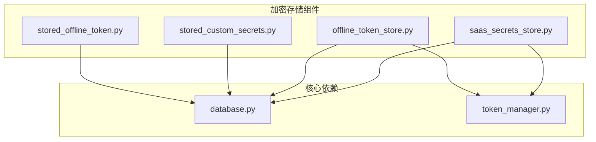
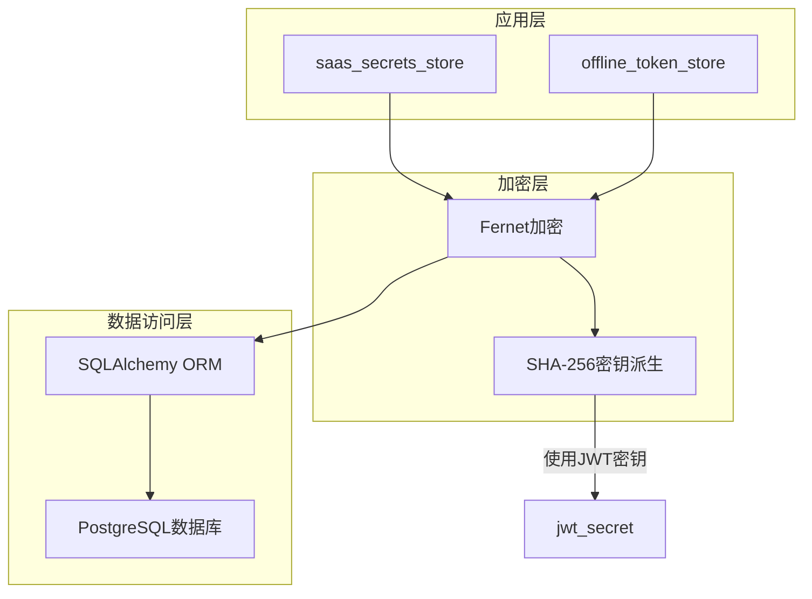
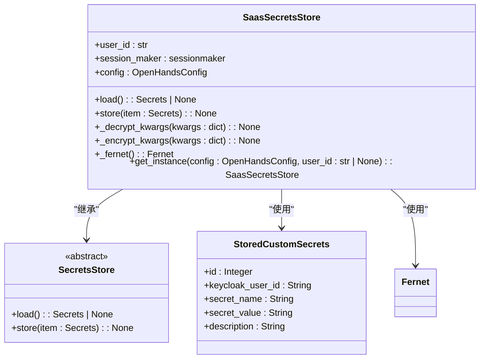
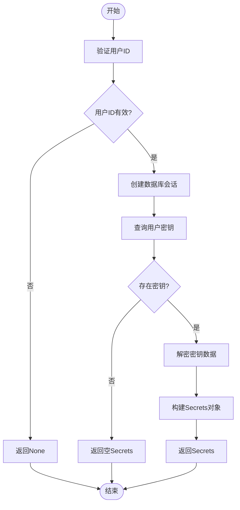
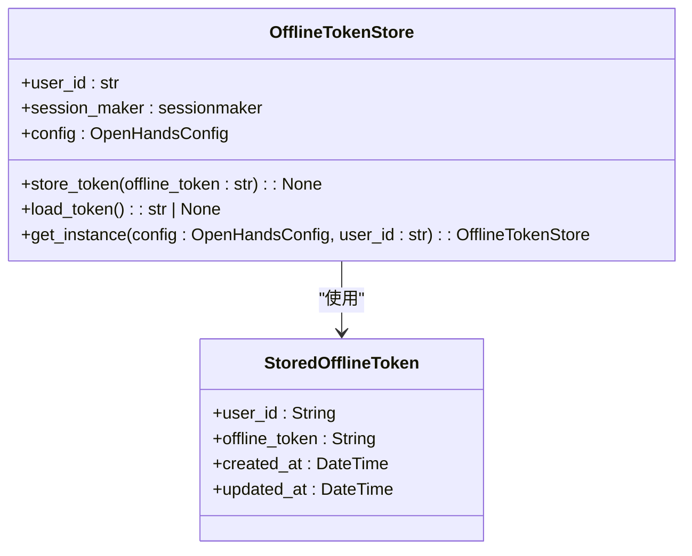
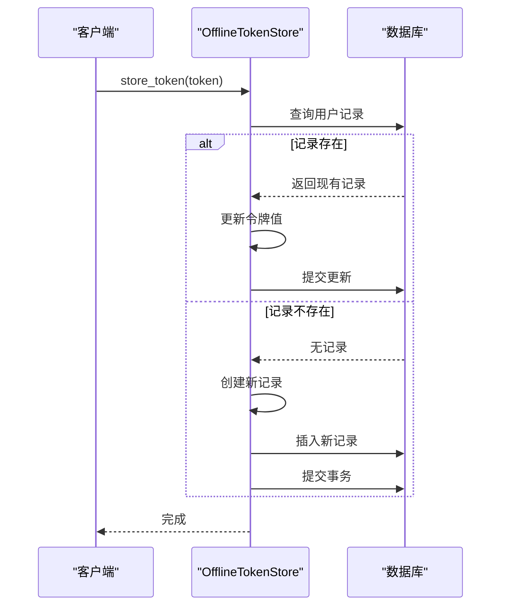
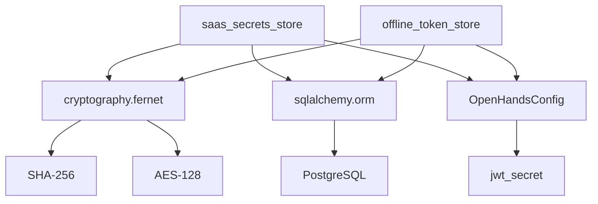

# 加密存储

<cite>
**本文档引用的文件**  
- [saas_secrets_store.py](file://enterprise/storage/saas_secrets_store.py)
- [offline_token_store.py](file://enterprise/storage/offline_token_store.py)
- [stored_custom_secrets.py](file://enterprise/storage/stored_custom_secrets.py)
- [stored_offline_token.py](file://enterprise/storage/stored_offline_token.py)
- [database.py](file://enterprise/storage/database.py)
- [token_manager.py](file://enterprise/server/auth/token_manager.py)
- [saas_settings_store.py](file://enterprise/storage/saas_settings_store.py)
- [encryption_key.py](file://openhands/app_server/utils/encryption_key.py)
</cite>

## 目录
1. [引言](#引言)
2. [项目结构](#项目结构)
3. [核心组件](#核心组件)
4. [架构概述](#架构概述)
5. [详细组件分析](#详细组件分析)
6. [依赖分析](#依赖分析)
7. [性能考虑](#性能考虑)
8. [故障排除指南](#故障排除指南)
9. [结论](#结论)

## 引言
本文档详细说明了OpenHands中敏感数据的持久化安全机制。重点介绍saas_secrets_store和custom_secrets存储系统的实现原理，包括数据加密算法、密钥派生函数的应用以及加密上下文管理。同时解释offline_token_store如何安全存储用户离线访问令牌，涵盖令牌加密、存储隔离和访问控制策略。文档还提供数据库字段级加密的实施细节，包括加密字段标识、密钥管理接口和性能优化方案，并包含存储层安全审计日志的集成方法和数据泄露防护措施。

## 项目结构
OpenHands的加密存储系统主要位于enterprise/storage目录下，包含多个专门用于处理敏感数据存储的组件。系统采用分层架构，将加密逻辑与数据访问逻辑分离，确保安全性的同时保持代码的可维护性。

**图示来源**
- [saas_secrets_store.py](file://enterprise/storage/saas_secrets_store.py)
- [offline_token_store.py](file://enterprise/storage/offline_token_store.py)
- [database.py](file://enterprise/storage/database.py)

**本节来源**
- [saas_secrets_store.py](file://enterprise/storage/saas_secrets_store.py)
- [offline_token_store.py](file://enterprise/storage/offline_token_store.py)

## 核心组件
OpenHands的加密存储系统由两个主要组件构成：saas_secrets_store用于管理用户自定义的敏感信息，offline_token_store用于安全存储用户的离线访问令牌。这两个组件都基于相同的加密原则和安全架构，使用Fernet对称加密算法和SHA-256哈希函数来保护数据。

**本节来源**
- [saas_secrets_store.py](file://enterprise/storage/saas_secrets_store.py#L1-L130)
- [offline_token_store.py](file://enterprise/storage/offline_token_store.py#L1-L60)

## 架构概述
OpenHands的加密存储架构采用分层设计，将加密逻辑与数据持久化逻辑分离。系统使用基于JWT密钥的加密上下文，通过SHA-256哈希函数生成Fernet密钥，确保加密的一致性和安全性。

**图示来源**
- [saas_secrets_store.py](file://enterprise/storage/saas_secrets_store.py#L113-L118)
- [token_manager.py](file://enterprise/server/auth/token_manager.py#L56-L57)
- [database.py](file://enterprise/storage/database.py#L103-L104)

## 详细组件分析

### saas_secrets_store分析
saas_secrets_store组件负责管理用户的自定义敏感信息，如API令牌、数据库密码等。该组件实现了完整的加密存储生命周期，包括数据的加密、解密、存储和检索。

#### 类图

**图示来源**
- [saas_secrets_store.py](file://enterprise/storage/saas_secrets_store.py#L18-L129)
- [stored_custom_secrets.py](file://enterprise/storage/stored_custom_secrets.py#L5-L11)

#### 数据加密流程

**图示来源**
- [saas_secrets_store.py](file://enterprise/storage/saas_secrets_store.py#L24-L48)

**本节来源**
- [saas_secrets_store.py](file://enterprise/storage/saas_secrets_store.py#L1-L130)
- [stored_custom_secrets.py](file://enterprise/storage/stored_custom_secrets.py#L1-L12)

### offline_token_store分析
offline_token_store组件专门用于安全存储用户的离线访问令牌，这些令牌通常用于在用户不在线时保持服务的持续访问权限。

#### 类图

**图示来源**
- [offline_token_store.py](file://enterprise/storage/offline_token_store.py#L13-L59)
- [stored_offline_token.py](file://enterprise/storage/stored_offline_token.py#L5-L18)

#### 令牌存储流程

**图示来源**
- [offline_token_store.py](file://enterprise/storage/offline_token_store.py#L19-L35)

**本节来源**
- [offline_token_store.py](file://enterprise/storage/offline_token_store.py#L1-L60)
- [stored_offline_token.py](file://enterprise/storage/stored_offline_token.py#L1-L19)

## 依赖分析
OpenHands的加密存储系统依赖于多个关键组件和库，形成了一个完整的安全生态系统。系统使用SQLAlchemy作为ORM层，PostgreSQL作为持久化存储，并依赖cryptography库提供Fernet加密功能。

**图示来源**
- [saas_secrets_store.py](file://enterprise/storage/saas_secrets_store.py#L7-L8)
- [offline_token_store.py](file://enterprise/storage/offline_token_store.py#L5-L6)
- [token_manager.py](file://enterprise/server/auth/token_manager.py#L9)

**本节来源**
- [saas_secrets_store.py](file://enterprise/storage/saas_secrets_store.py)
- [offline_token_store.py](file://enterprise/storage/offline_token_store.py)
- [database.py](file://enterprise/storage/database.py)

## 性能考虑
加密存储系统的性能主要受加密算法、数据库连接池和事务管理的影响。OpenHands通过以下方式优化性能：

1. **连接池管理**：使用SQLAlchemy的连接池功能，配置合理的池大小和溢出限制
2. **批量操作**：在存储多个密钥时，使用批量插入而非逐个插入
3. **缓存策略**：在应用层缓存常用的解密密钥，减少重复的加密操作
4. **异步支持**：提供异步数据库引擎支持，避免阻塞主线程

系统通过配置环境变量DB_POOL_SIZE和DB_MAX_OVERFLOW来调整连接池参数，确保在高并发场景下的性能稳定。

**本节来源**
- [database.py](file://enterprise/storage/database.py#L20-L21)
- [saas_secrets_store.py](file://enterprise/storage/saas_secrets_store.py#L54-L57)

## 故障排除指南
当遇到加密存储相关问题时，可以按照以下步骤进行排查：

1. **检查JWT密钥配置**：确保环境变量中的JWT密钥已正确设置
2. **验证数据库连接**：检查数据库连接参数和网络连通性
3. **审查加密上下文**：确认加密和解密使用相同的密钥上下文
4. **检查数据完整性**：验证存储的加密数据是否完整，没有被截断

常见错误包括密钥不匹配导致的解密失败、数据库连接超时和权限不足等问题。系统日志会记录详细的错误信息，帮助快速定位问题根源。

**本节来源**
- [saas_secrets_store.py](file://enterprise/storage/saas_secrets_store.py#L114-L115)
- [database.py](file://enterprise/storage/database.py#L10-L14)

## 结论
OpenHands的加密存储系统通过分层架构和标准化的加密实践，为敏感数据的持久化提供了可靠的安全保障。系统采用Fernet对称加密算法，结合SHA-256密钥派生函数，确保了数据的机密性和完整性。通过saas_secrets_store和offline_token_store两个核心组件，系统能够安全地管理用户的各种敏感信息，包括自定义密钥和离线访问令牌。

未来可以考虑引入硬件安全模块(HSM)或密钥管理服务(KMS)来进一步增强密钥的安全性，以及实现更细粒度的访问控制策略。同时，定期的加密审计和安全评估将有助于发现潜在的安全隐患，确保系统持续满足安全要求。