# 密钥管理

<cite>
**本文档引用的文件**
- [token_manager.py](file://enterprise/server/auth/token_manager.py)
- [jwt_service.py](file://openhands/app_server/services/jwt_service.py)
- [encryption_key.py](file://openhands/app_server/utils/encryption_key.py)
- [saas_secrets_store.py](file://enterprise/storage/saas_secrets_store.py)
- [redis.py](file://enterprise/storage/redis.py)
- [clustered_conversation_manager.py](file://enterprise/server/clustered_conversation_manager.py)
- [config.py](file://enterprise/server/config.py)
- [auth_token_store.py](file://enterprise/storage/auth_token_store.py)
- [api_key_store.py](file://enterprise/storage/api_key_store.py)
- [keycloak_manager.py](file://enterprise/server/auth/keycloak_manager.py)
</cite>

## 目录
1. [概述](#概述)
2. [密钥架构设计](#密钥架构设计)
3. [密钥生命周期管理](#密钥生命周期管理)
4. [Token管理机制](#token管理机制)
5. [分布式密钥同步](#分布式密钥同步)
6. [安全审计与监控](#安全审计与监控)
7. [应急响应流程](#应急响应流程)
8. [最佳实践指南](#最佳实践指南)
9. [故障排除](#故障排除)

## 概述

OpenHands采用分层密钥管理体系，确保企业级安全合规要求。系统包含主密钥（Master Key）与数据密钥（Data Key）的分层架构，支持多算法签名验证，具备完整的密钥轮换和审计功能。

### 核心特性

- **分层密钥架构**：主密钥用于JWT签名，数据密钥用于敏感数据加密
- **多算法支持**：支持HS256、RS256等JWT算法
- **自动密钥轮换**：基于时间的密钥轮换机制
- **分布式同步**：通过Redis实现密钥缓存一致性
- **完整审计**：记录所有密钥操作的日志

## 密钥架构设计

### 分层密钥体系

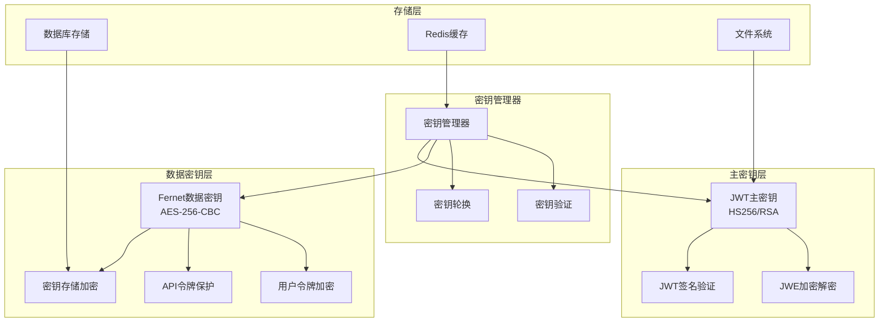

**图表来源**
- [token_manager.py](file://enterprise/server/auth/token_manager.py#L78-L87)
- [jwt_service.py](file://openhands/app_server/services/jwt_service.py#L21-L48)
- [saas_secrets_store.py](file://enterprise/storage/saas_secrets_store.py#L113-L118)

### 密钥类型定义

| 密钥类型 | 算法 | 用途 | 生命周期 | 安全级别 |
|---------|------|------|----------|----------|
| JWT主密钥 | HS256/RSA | JWT签名验证 | 长期有效 | 高 |
| 数据加密密钥 | Fernet/AES-256 | 敏感数据加密 | 90天轮换 | 高 |
| API密钥 | 随机字符串 | API访问控制 | 可配置过期 | 中 |
| 会话密钥 | HMAC-SHA256 | 会话管理 | 会话期间 | 中 |

**章节来源**
- [encryption_key.py](file://openhands/app_server/utils/encryption_key.py#L12-L20)
- [token_manager.py](file://enterprise/server/auth/token_manager.py#L47-L75)

## 密钥生命周期管理

### 密钥生成策略

系统采用多种密钥生成方式：

```mermaid
flowchart TD
Start([密钥生成请求]) --> CheckEnv{检查环境变量}
CheckEnv --> |存在JWT_SECRET| UseEnv["使用环境变量密钥"]
CheckEnv --> |不存在| CheckFile{检查密钥文件}
CheckFile --> |存在|.keys文件| LoadFromFile["从文件加载密钥"]
CheckFile --> |不存在| GenerateNew["生成新密钥"]
GenerateNew --> RandomGen["随机32字节生成"]
RandomGen --> Base62Encode["Base62编码"]
Base62Encode --> SaveToFile["保存到文件"]
UseEnv --> ValidateKey["验证密钥格式"]
LoadFromFile --> ValidateKey
SaveToFile --> ValidateKey
ValidateKey --> ActiveKey["激活密钥"]
ActiveKey --> End([密钥就绪])
```

**图表来源**
- [encryption_key.py](file://openhands/app_server/utils/encryption_key.py#L29-L58)

### 密钥轮换机制

#### 自动轮换策略

| 轮换周期 | 密钥类型 | 触发条件 | 备份策略 |
|---------|----------|----------|----------|
| 90天 | 主密钥 | 时间到期 | 自动备份旧密钥 |
| 30天 | 数据密钥 | 周期性更新 | 渐进式迁移 |
| 7天 | 临时密钥 | 使用后销毁 | 日志记录 |

#### 轮换流程

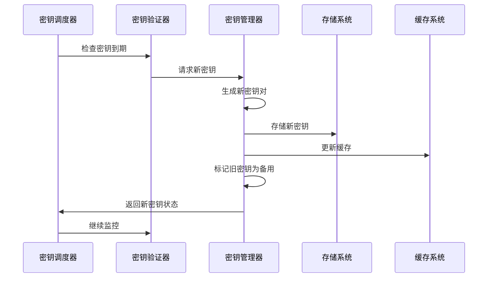

**图表来源**
- [jwt_service.py](file://openhands/app_server/services/jwt_service.py#L24-L43)
- [token_manager.py](file://enterprise/server/auth/token_manager.py#L47-L75)

**章节来源**
- [jwt_service.py](file://openhands/app_server/services/jwt_service.py#L24-L43)
- [encryption_key.py](file://openhands/app_server/utils/encryption_key.py#L29-L58)

## Token管理机制

### JWT服务架构

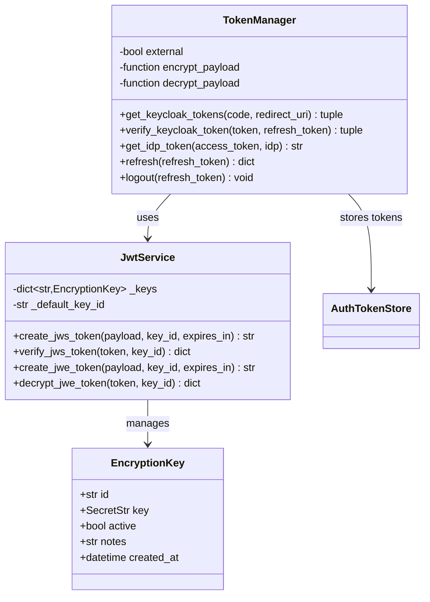

**图表来源**
- [jwt_service.py](file://openhands/app_server/services/jwt_service.py#L21-L48)
- [token_manager.py](file://enterprise/server/auth/token_manager.py#L78-L87)

### 认证令牌处理

#### 令牌创建流程

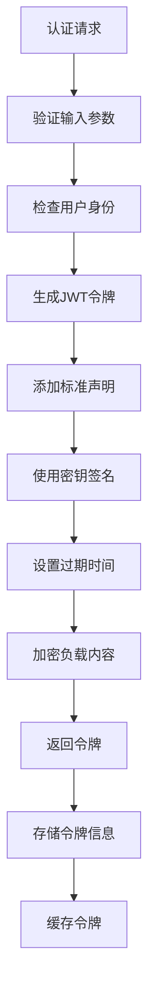

**图表来源**
- [jwt_service.py](file://openhands/app_server/services/jwt_service.py#L49-L90)
- [token_manager.py](file://enterprise/server/auth/token_manager.py#L89-L111)

#### 令牌验证机制

| 验证步骤 | 检查项目 | 错误处理 |
|---------|----------|----------|
| 格式验证 | JWT格式正确性 | 抛出InvalidTokenError |
| 签名验证 | 密钥匹配性 | 返回验证失败 |
| 过期检查 | 时间戳有效性 | 标记为过期 |
| 声明验证 | 必需字段存在 | 返回无效载荷 |

**章节来源**
- [jwt_service.py](file://openhands/app_server/services/jwt_service.py#L92-L128)
- [token_manager.py](file://enterprise/server/auth/token_manager.py#L113-L128)

## 分布式密钥同步

### Redis缓存架构

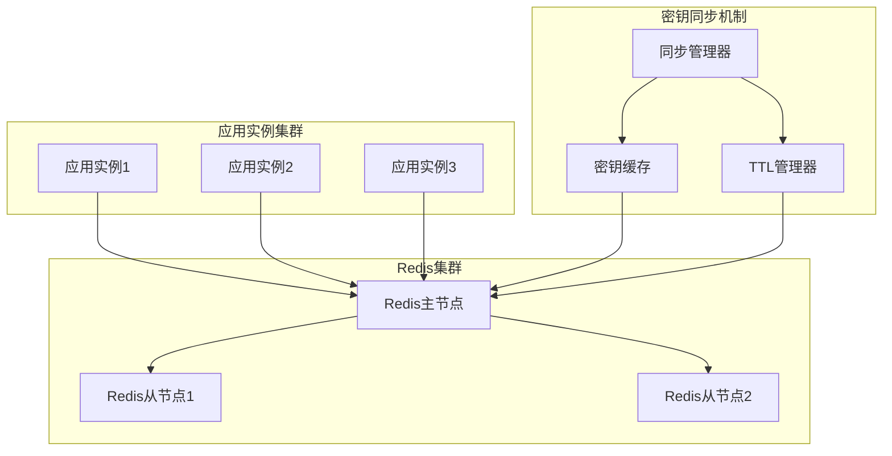

**图表来源**
- [redis.py](file://enterprise/storage/redis.py#L12-L19)
- [clustered_conversation_manager.py](file://enterprise/server/clustered_conversation_manager.py#L60-L77)

### 同步策略

#### 密钥更新流程

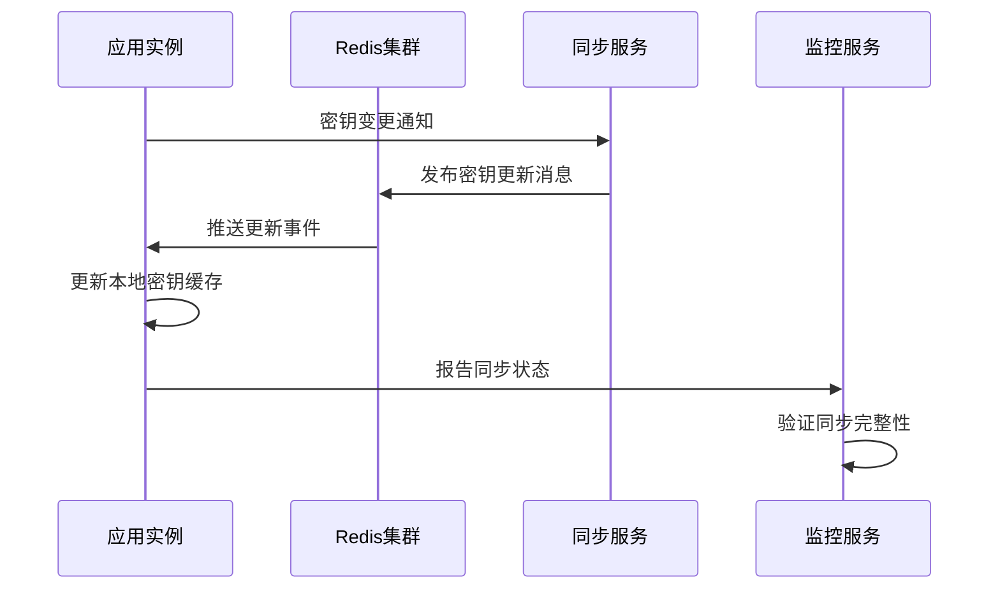

**图表来源**
- [clustered_conversation_manager.py](file://enterprise/server/clustered_conversation_manager.py#L422-L447)

#### 一致性保证

| 一致性级别 | 实现方式 | 延迟 | 适用场景 |
|-----------|----------|------|----------|
| 强一致性 | 同步写入 | < 100ms | 关键密钥更新 |
| 最终一致性 | 异步广播 | < 1秒 | 一般密钥更新 |
| 会话一致性 | 缓存失效 | < 500ms | 用户令牌更新 |

**章节来源**
- [clustered_conversation_manager.py](file://enterprise/server/clustered_conversation_manager.py#L41-L447)
- [redis.py](file://enterprise/storage/redis.py#L1-L24)

## 安全审计与监控

### 审计日志配置

系统提供完整的密钥操作审计功能：

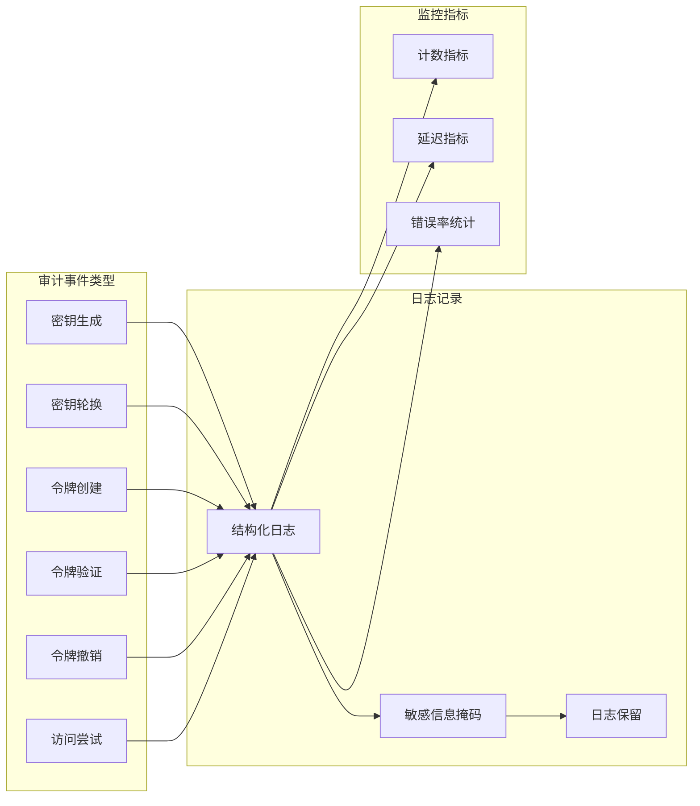

**图表来源**
- [saas_secrets_store.py](file://enterprise/storage/saas_secrets_store.py#L113-L118)

### 安全合规配置

| 合规要求 | 实现方式 | 配置参数 | 审计范围 |
|---------|----------|----------|----------|
| 数据加密 | AES-256-Fernet | jwt_secret | 所有敏感数据 |
| 密钥轮换 | 自动定时任务 | rotation_interval | 密钥生命周期 |
| 访问控制 | RBAC权限模型 | access_policies | 用户操作行为 |
| 审计追踪 | 结构化日志 | audit_enabled | 关键操作事件 |

**章节来源**
- [saas_secrets_store.py](file://enterprise/storage/saas_secrets_store.py#L1-L130)
- [config.py](file://enterprise/server/config.py#L62-L191)

## 应急响应流程

### 密钥泄露处理

#### 泄露检测机制

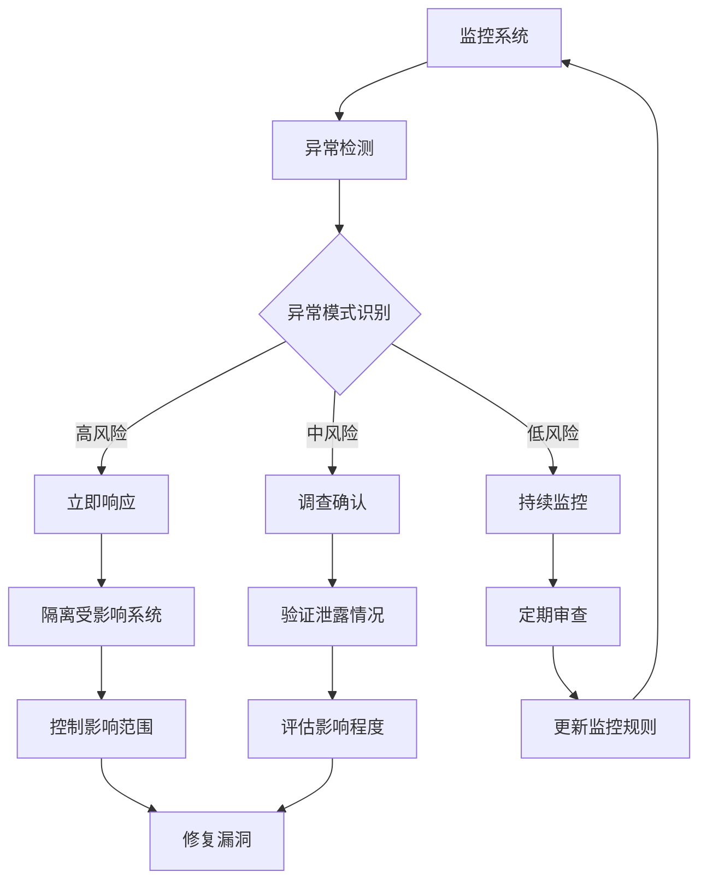

#### 应急响应步骤

1. **立即隔离**：停止受影响的服务实例
2. **密钥撤销**：标记泄露密钥为无效
3. **紧急轮换**：生成新的密钥对
4. **系统扫描**：检查其他潜在泄露点
5. **用户通知**：通知受影响用户重新认证
6. **根因分析**：调查泄露原因
7. **预防措施**：加强安全控制

### 灾难恢复计划

#### 恢复时间目标(RTO)

| 场景 | RTO目标 | 恢复策略 | 备用方案 |
|------|---------|----------|----------|
| 单实例故障 | < 5分钟 | 自动故障转移 | 手动切换 |
| Redis集群故障 | < 15分钟 | 主从切换 | 备用Redis |
| 密钥服务器故障 | < 30分钟 | 密钥恢复 | 热备密钥 |
| 全站故障 | < 1小时 | 备用数据中心 | 灾备系统 |

**章节来源**
- [token_manager.py](file://enterprise/server/auth/token_manager.py#L664-L671)

## 最佳实践指南

### 密钥管理最佳实践

#### 密钥生成规范

1. **熵值要求**：使用操作系统提供的真随机数生成器
2. **长度标准**：主密钥至少32字节，数据密钥至少16字节
3. **编码格式**：使用Base62或Base64编码存储
4. **版本控制**：保持密钥版本历史记录

#### 密钥存储安全

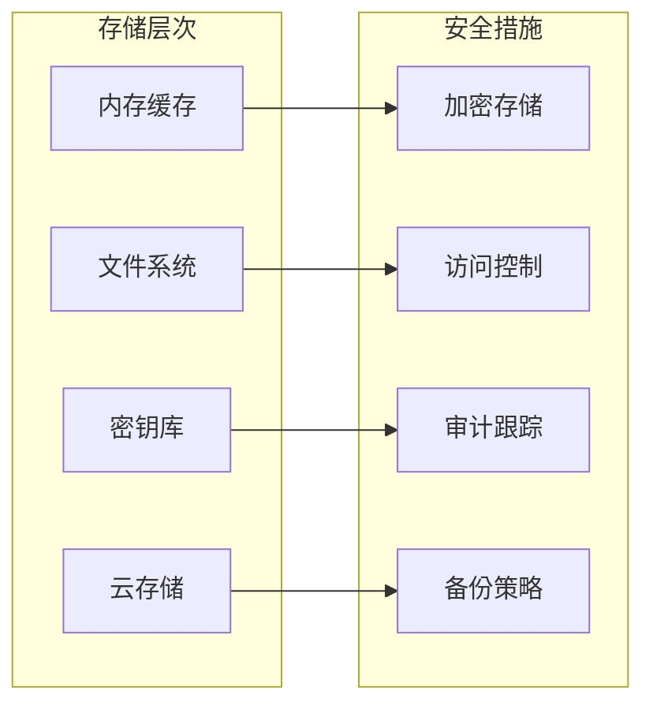

#### 密钥轮换策略

| 密钥类型 | 推荐轮换频率 | 触发条件 | 迁移方式 |
|---------|-------------|----------|----------|
| 主密钥 | 90天 | 定期更新 | 渐进式切换 |
| 数据密钥 | 30天 | 周期性 | 并行加密 |
| API密钥 | 可配置 | 用户主动 | 即时生效 |
| 临时密钥 | 会话结束 | 自动清理 | 内存清除 |

### 性能优化建议

#### 缓存策略

1. **本地缓存**：在应用实例中缓存常用密钥
2. **分布式缓存**：使用Redis共享密钥信息
3. **预热机制**：提前加载即将使用的密钥
4. **失效策略**：设置合理的缓存过期时间

#### 并发控制

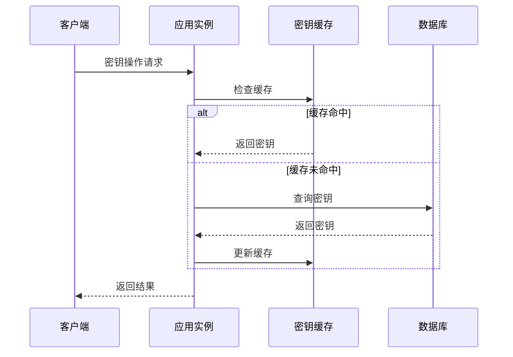

**图表来源**
- [clustered_conversation_manager.py](file://enterprise/server/clustered_conversation_manager.py#L436-L447)

## 故障排除

### 常见问题诊断

#### 密钥验证失败

**症状**：JWT令牌验证抛出InvalidTokenError异常

**排查步骤**：
1. 检查密钥格式是否正确
2. 验证密钥是否已过期
3. 确认算法匹配性
4. 检查时间同步状态

**解决方案**：
```python
# 示例：密钥验证调试
try:
    payload = jwt_service.verify_jws_token(token, key_id)
except jwt.InvalidTokenError as e:
    logger.error(f"Token验证失败: {e}")
    # 检查密钥状态
    if key_id not in jwt_service._keys:
        logger.error(f"密钥ID {key_id} 不存在")
```

#### 分布式同步问题

**症状**：不同实例间密钥不一致

**排查步骤**：
1. 检查Redis连接状态
2. 验证消息队列正常工作
3. 确认网络连通性
4. 检查防火墙规则

**解决方案**：
```python
# 示例：同步状态检查
def check_sync_status():
    redis_client = create_redis_client()
    keys = redis_client.keys("oh:*")
    logger.info(f"Redis中发现 {len(keys)} 个密钥相关键")
```

#### 性能问题

**症状**：密钥操作响应时间过长

**排查步骤**：
1. 监控CPU和内存使用率
2. 检查数据库连接池状态
3. 分析慢查询日志
4. 优化缓存策略

**章节来源**
- [jwt_service.py](file://openhands/app_server/services/jwt_service.py#L123-L128)
- [redis.py](file://enterprise/storage/redis.py#L12-L19)

### 监控告警配置

#### 关键指标监控

| 指标名称 | 阈值设置 | 告警级别 | 处理建议 |
|---------|----------|----------|----------|
| 密钥验证失败率 | > 1% | 警告 | 检查密钥配置 |
| JWT签名验证延迟 | > 100ms | 严重 | 优化算法性能 |
| Redis同步延迟 | > 5秒 | 警告 | 检查网络连接 |
| 密钥轮换成功率 | < 95% | 严重 | 检查自动化脚本 |

#### 告警通知机制

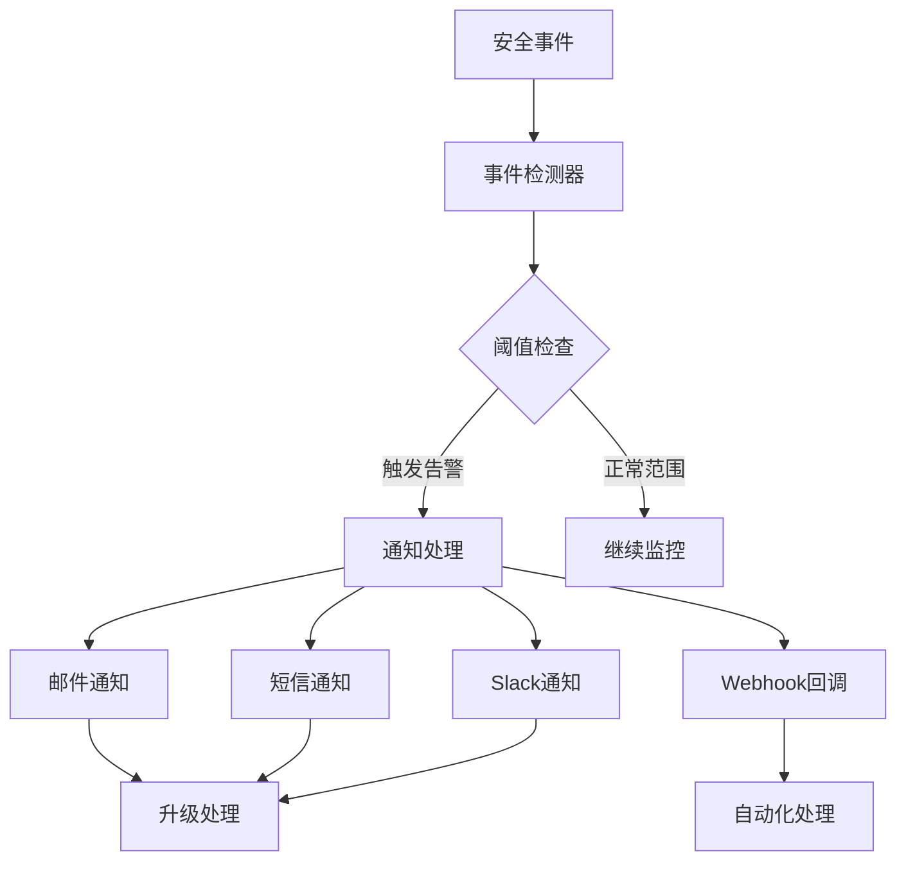

**章节来源**
- [token_manager.py](file://enterprise/server/auth/token_manager.py#L43-L46)
- [clustered_conversation_manager.py](file://enterprise/server/clustered_conversation_manager.py#L422-L447)