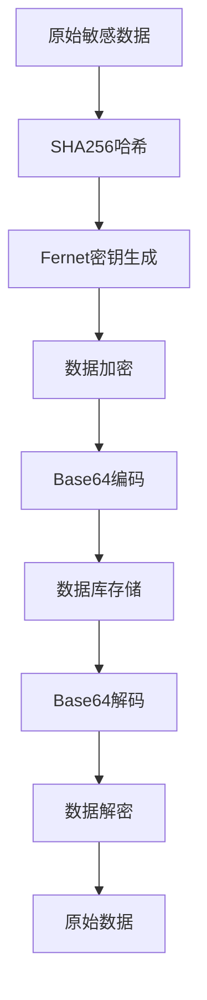
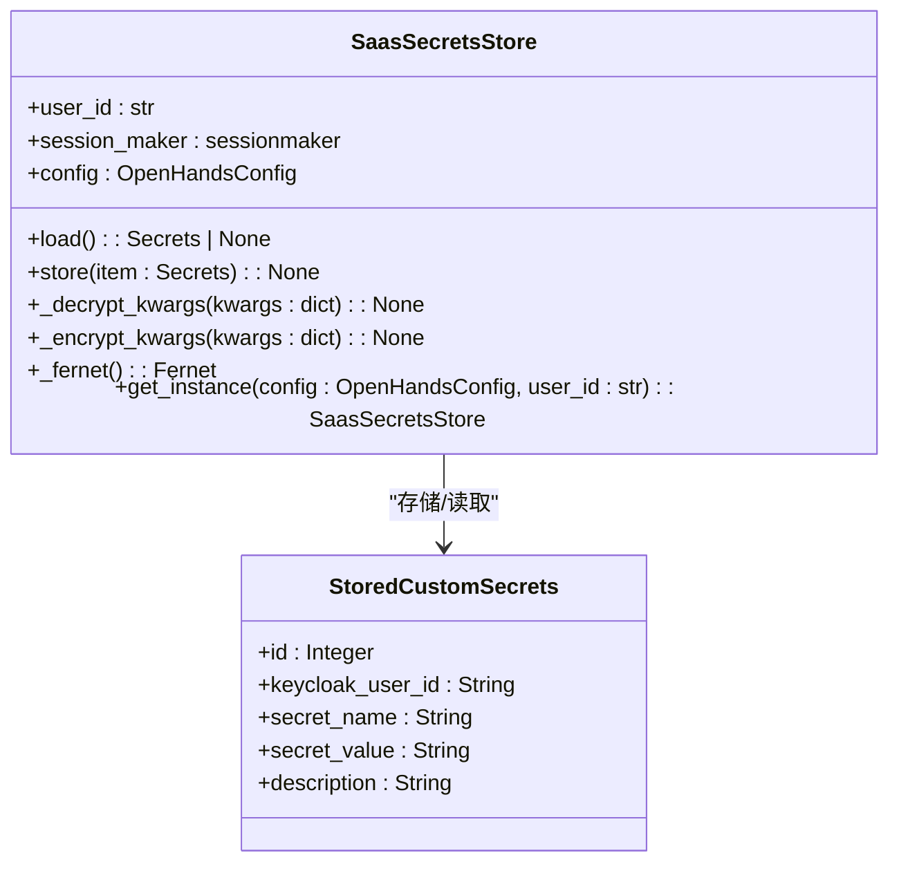
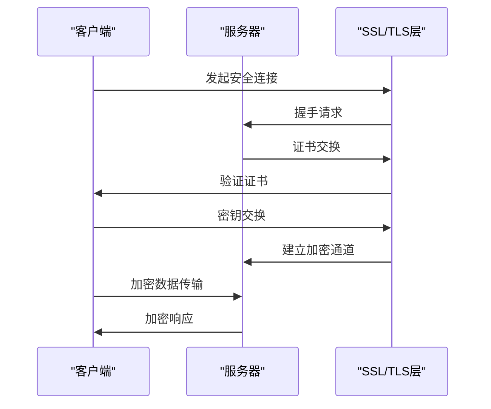
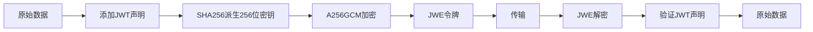
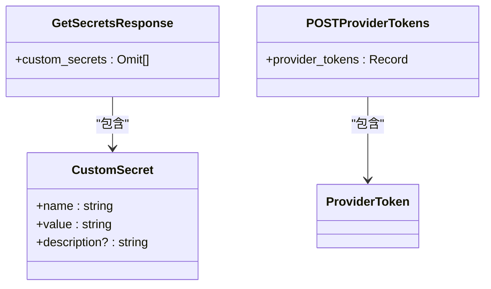
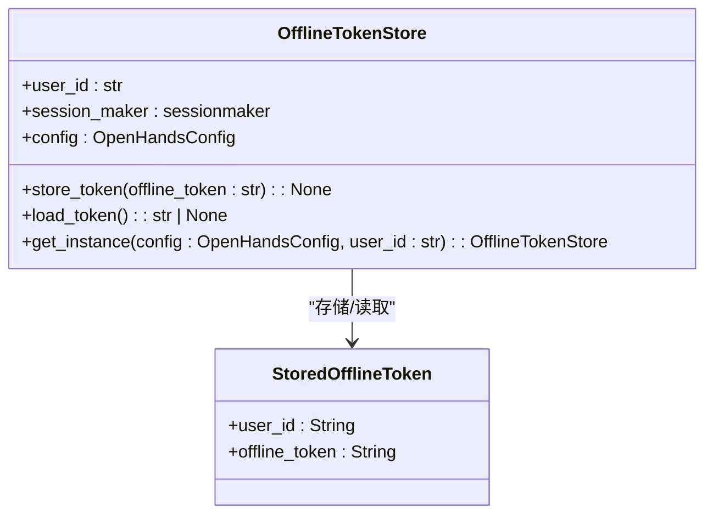
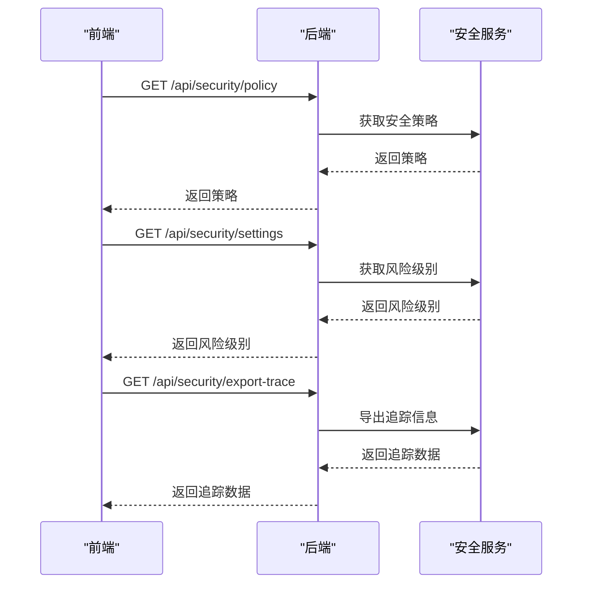
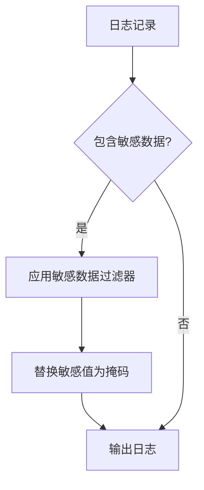
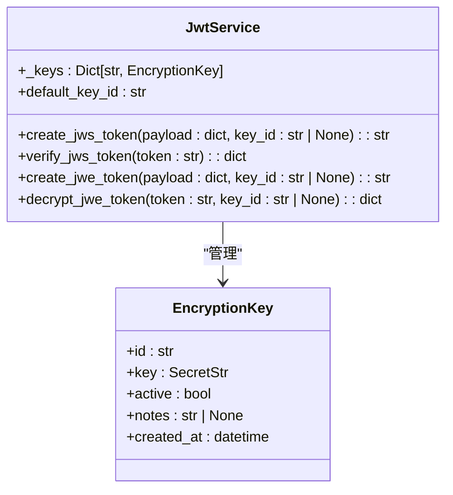

# 数据保护

<cite>
**本文档引用的文件**   
- [saas_secrets_store.py](file://enterprise/storage/saas_secrets_store.py)
- [token_manager.py](file://enterprise/server/auth/token_manager.py)
- [api_key_store.py](file://enterprise/storage/api_key_store.py)
- [offline_token_store.py](file://enterprise/storage/offline_token_store.py)
- [stored_custom_secrets.py](file://enterprise/storage/stored_custom_secrets.py)
- [stored_offline_token.py](file://enterprise/storage/stored_offline_token.py)
- [app_conversation.py](file://openhands/app_server/app_conversation.py)
- [encryption_key.py](file://openhands/app_server/utils/encryption_key.py)
- [http_session.py](file://openhands/utils/http_session.py)
- [invariant-service.ts](file://frontend/src/api/invariant-service.ts)
</cite>

## 目录
1. [引言](#引言)
2. [敏感数据加密存储](#敏感数据加密存储)
3. [数据传输安全](#数据传输安全)
4. [企业版安全特性](#企业版安全特性)
5. [数据泄露防护策略](#数据泄露防护策略)
6. [加密算法与密钥管理](#加密算法与密钥管理)
7. [GDPR合规性](#gdpr合规性)
8. [结论](#结论)

## 引言

OpenHands平台实施了全面的数据保护机制，确保用户敏感信息的安全。本文档系统性地介绍了OpenHands的数据安全架构，涵盖从敏感数据加密存储、数据传输安全到企业版特有的安全设计。平台通过多层次的安全措施，包括Fernet对称加密、JWT令牌管理、API密钥保护等技术，构建了完整的数据保护体系。所有敏感数据在存储和传输过程中都受到严格保护，符合GDPR等数据保护法规要求。

## 敏感数据加密存储

### 用户密钥与API令牌存储

OpenHands采用Fernet对称加密算法对用户密钥和API令牌进行加密存储。系统使用JWT密钥作为基础，通过SHA256哈希函数生成32字节的Fernet密钥，确保加密强度。所有敏感数据在写入数据库前都会被加密，读取时再进行解密。

**图表来源**
- [token_manager.py](file://enterprise/server/auth/token_manager.py#L47-L75)
- [saas_secrets_store.py](file://enterprise/storage/saas_secrets_store.py#L113-L118)

### 环境变量安全存储

环境变量通过`SaasSecretsStore`类进行安全管理。该类实现了`_encrypt_kwargs`和`_decrypt_kwargs`方法，能够递归地加密和解密嵌套的字典结构数据。系统会自动识别需要加密的字段，包括API令牌、密钥等敏感信息。

**图表来源**
- [saas_secrets_store.py](file://enterprise/storage/saas_secrets_store.py#L18-L130)
- [stored_custom_secrets.py](file://enterprise/storage/stored_custom_secrets.py#L5-L11)

**本节来源**
- [saas_secrets_store.py](file://enterprise/storage/saas_secrets_store.py#L24-L130)
- [stored_custom_secrets.py](file://enterprise/storage/stored_custom_secrets.py#L5-L11)

## 数据传输安全

### TLS/SSL配置

OpenHands通过HTTPX客户端库实现安全的数据传输。系统默认启用SSL证书验证，使用Python的`ssl.create_default_context()`创建安全上下文。对于需要禁用证书验证的特殊情况，可以通过环境变量进行配置，但不推荐在生产环境中使用。

**图表来源**
- [http_session.py](file://openhands/utils/http_session.py#L1-L42)

### 端到端加密实现

平台使用JSON Web Encryption (JWE)实现端到端加密。JWE令牌采用A256GCM加密算法，确保数据的机密性和完整性。加密过程使用256位密钥，通过SHA256哈希函数从主密钥派生，提供高强度的加密保护。

**图表来源**
- [jwt_service.py](file://openhands/app_server/services/jwt_service.py#L129-L230)

**本节来源**
- [http_session.py](file://openhands/utils/http_session.py#L1-L42)
- [jwt_service.py](file://openhands/app_server/services/jwt_service.py#L129-L230)

## 企业版安全特性

### 自定义密钥存储(custom_secrets)

企业版提供了`custom_secrets`功能，允许用户安全地存储自定义密钥。该功能通过`StoredCustomSecrets`数据库表实现，每个密钥都与特定的用户ID关联。系统在存储时自动加密密钥值，在读取时解密，确保敏感信息的安全。

**图表来源**
- [secrets-service.types.ts](file://frontend/src/api/secrets-service.types.ts#L3-L15)
- [saas_secrets_store.py](file://enterprise/storage/saas_secrets_store.py#L24-L48)

### 离线令牌存储(offline_token_store)

离线令牌存储通过`OfflineTokenStore`类实现，用于安全地存储用户的离线访问令牌。系统支持创建新记录或更新现有记录，确保令牌的最新性。存储过程不进行额外加密，依赖数据库层面的安全措施。

**图表来源**
- [offline_token_store.py](file://enterprise/storage/offline_token_store.py#L14-L60)
- [stored_offline_token.py](file://enterprise/storage/stored_offline_token.py)

**本节来源**
- [offline_token_store.py](file://enterprise/storage/offline_token_store.py#L14-L60)
- [stored_offline_token.py](file://enterprise/storage/stored_offline_token.py)
- [secrets-service.types.ts](file://frontend/src/api/secrets-service.types.ts#L3-L15)

## 数据泄露防护策略

### 数据访问监控

系统通过`InvariantService`实现安全策略管理，提供对安全事件的全面监控。前端通过API接口获取安全策略、风险级别和追踪信息，实现对潜在安全威胁的实时监控。

**图表来源**
- [invariant-service.ts](file://frontend/src/api/invariant-service.ts#L1-L30)

### 异常行为检测

平台在日志记录过程中实施敏感数据过滤，防止敏感信息意外泄露。`SensitiveDataFilter`会扫描环境变量中的敏感键名（如包含"SECRET"、"TOKEN"等），并在日志输出前将对应的值替换为掩码。

**图表来源**
- [test_logger.py](file://tests/unit/core/logger/test_logger.py#L1-L117)

### 应急响应流程

当检测到安全事件时，系统会触发相应的应急响应流程。这包括立即终止可疑会话、记录详细的安全日志、通知管理员以及根据预设策略采取进一步行动。安全分析器会评估每个操作的风险级别，确保高风险操作得到适当处理。

**本节来源**
- [invariant-service.ts](file://frontend/src/api/invariant-service.ts#L1-L30)
- [test_logger.py](file://tests/unit/core/logger/test_logger.py#L1-L117)

## 加密算法与密钥管理

### 加密算法选择

OpenHands采用行业标准的加密算法组合：
- **对称加密**: Fernet (基于AES-128-CBC和HMAC-SHA256)
- **哈希函数**: SHA256
- **密钥派生**: PBKDF2-HMAC-SHA256
- **数据加密**: A256GCM (AES-256-GCM)

这些算法的选择基于其广泛接受的安全性、性能和互操作性，符合NIST推荐标准。

### 密钥轮换策略

系统支持密钥轮换，通过`JwtService`管理多个加密密钥。每个密钥都有唯一的ID和创建时间戳，系统默认使用最新的活动密钥进行加密。旧密钥保持有效以解密历史数据，但不用于新数据的加密，实现平滑的密钥轮换。

**图表来源**
- [encryption_key.py](file://openhands/app_server/utils/encryption_key.py#L12-L58)
- [jwt_service.py](file://openhands/app_server/services/jwt_service.py#L44-L230)

### 数据脱敏技术

在数据展示和日志记录时，系统自动应用数据脱敏技术。敏感字段的值会被替换为掩码（如"**********"），同时保留字段结构和元数据。这种技术确保了调试和监控的需要，同时保护了敏感信息。

**本节来源**
- [encryption_key.py](file://openhands/app_server/utils/encryption_key.py#L12-L58)
- [jwt_service.py](file://openhands/app_server/services/jwt_service.py#L44-L230)

## GDPR合规性

OpenHands平台的设计充分考虑了GDPR等数据保护法规的要求。系统实施了数据最小化原则，仅收集必要的用户信息。用户对其数据拥有完全的控制权，包括访问、修改和删除的权利。所有数据处理活动都有明确的法律依据，并通过隐私政策向用户充分披露。

平台还实现了数据主体权利的自动化处理机制，包括数据导出和删除功能。审计日志记录了所有数据访问和修改操作，确保可追溯性和问责性。这些措施共同构成了符合GDPR要求的数据保护框架。

**本节来源**
- [user.py](file://enterprise/server/routes/user.py#L345-L380)
- [telemetry-design.md](file://enterprise/doc/design-doc/openhands-enterprise-telemetry-design.md#L84-L490)

## 结论

OpenHands平台通过多层次的安全机制，构建了全面的数据保护体系。从敏感数据的加密存储到安全的数据传输，从企业版特有的安全特性到完善的数据泄露防护策略，系统在各个层面都实施了严格的安全措施。采用行业标准的加密算法和密钥管理策略，确保了数据的机密性、完整性和可用性。同时，平台的设计充分考虑了GDPR等法规的合规要求，为用户提供了可靠的数据安全保障。