# GitLab 认证与同步配置文档

<cite>
**本文档中引用的文件**
- [gitlab_manager.py](file://enterprise/integrations/gitlab/gitlab_manager.py)
- [gitlab_service.py](file://enterprise/integrations/gitlab/gitlab_service.py)
- [gitlab_view.py](file://enterprise/integrations/gitlab/gitlab_view.py)
- [gitlab_sync.py](file://enterprise/server/auth/gitlab_sync.py)
- [gitlab_webhook.py](file://enterprise/storage/gitlab_webhook.py)
- [gitlab_webhook_store.py](file://enterprise/storage/gitlab_webhook_store.py)
- [install_gitlab_webhooks.py](file://enterprise/sync/install_gitlab_webhooks.py)
- [gitlab.py](file://enterprise/server/routes/integration/gitlab.py)
- [constants.py](file://enterprise/server/auth/constants.py)
- [auth.py](file://enterprise/server/routes/auth.py)
- [gitlab-token-input.tsx](file://frontend/src/components/features/settings/git-settings/gitlab-token-input.tsx)
- [gitlab-webhook_table.py](file://enterprise/migrations/versions/027_create_gitlab_webhook_table.py)
</cite>

## 目录
1. [简介](#简介)
2. [系统架构概览](#系统架构概览)
3. [GitLab OAuth2 应用配置](#gitlab-oauth2-应用配置)
4. [API 访问令牌设置](#api-访问令牌设置)
5. [Webhook 管理与安全](#webhook-管理与安全)
6. [仓库同步机制](#仓库同步机制)
7. [用户权限同步](#用户权限同步)
8. [配置参数详解](#配置参数详解)
9. [部署示例](#部署示例)
10. [安全最佳实践](#安全最佳实践)
11. [故障排除指南](#故障排除指南)
12. [总结](#总结)

## 简介

OpenHands 提供了完整的 GitLab 集成解决方案，支持通过 OAuth2 进行身份验证、自动仓库同步、Webhook 管理以及用户权限同步。该系统能够自动发现用户的 GitLab 仓库，建立安全的 Webhook 连接，并确保用户权限的实时同步。

## 系统架构概览

GitLab 集成系统采用分层架构设计，包含以下核心组件：

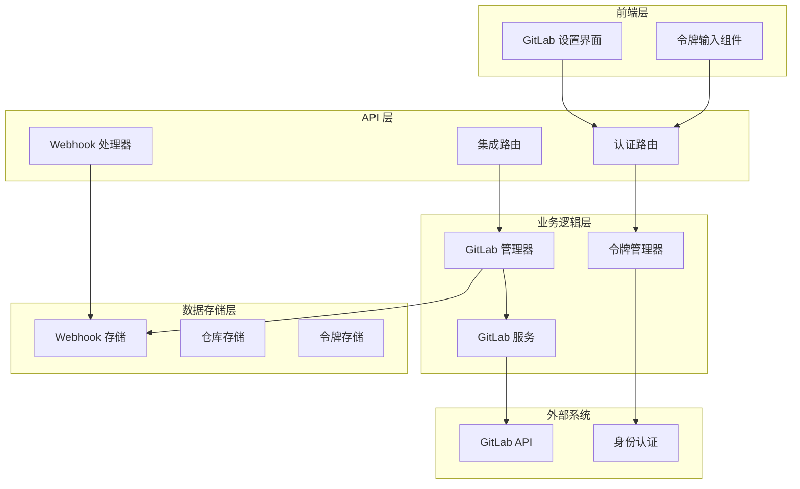

**图表来源**
- [gitlab_manager.py](file://enterprise/integrations/gitlab/gitlab_manager.py#L31-L262)
- [gitlab_service.py](file://enterprise/integrations/gitlab/gitlab_service.py#L21-L530)
- [gitlab.py](file://enterprise/server/routes/integration/gitlab.py#L14-L86)

## GitLab OAuth2 应用配置

### 创建 GitLab OAuth 应用

在 GitLab 中创建 OAuth 应用以启用身份验证：

1. **登录 GitLab 实例**
   - 导航到用户设置页面
   - 选择 "Applications" 选项卡

2. **配置 OAuth 应用**
   ```bash
   Application name: OpenHands Cloud
   Redirect URI: https://your-domain.com/api/oauth/gitlab/callback
   Scopes: api, read_user, read_repository
   ```

3. **获取客户端凭据**
   - 记录 Client ID 和 Client Secret
   - 配置环境变量：
     ```bash
     GITLAB_APP_CLIENT_ID=your_client_id
     GITLAB_APP_CLIENT_SECRET=your_client_secret
     ```

### 环境变量配置

| 环境变量 | 描述 | 示例值 |
|---------|------|--------|
| `GITLAB_APP_CLIENT_ID` | GitLab OAuth 客户端 ID | `abc123def456` |
| `GITLAB_APP_CLIENT_SECRET` | GitLab OAuth 客户端密钥 | `secret_key_here` |
| `GITLAB_BASE_URL` | GitLab API 基础 URL | `https://gitlab.com/api/v4` |

**章节来源**
- [constants.py](file://enterprise/server/auth/constants.py#L16-L17)

## API 访问令牌设置

### 个人访问令牌配置

GitLab 支持多种类型的访问令牌，每种都有不同的权限范围：

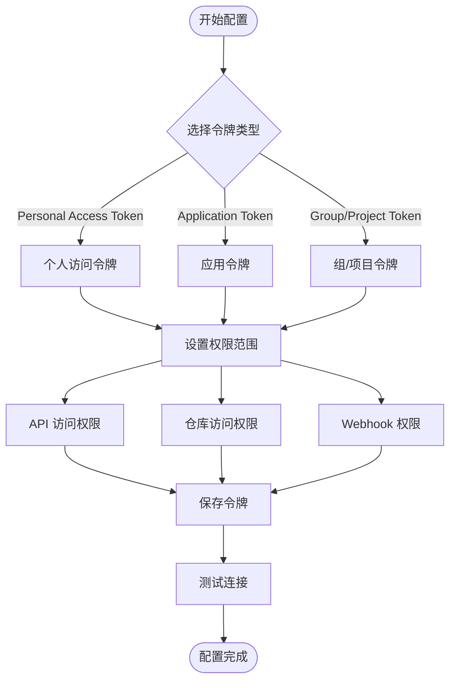

**图表来源**
- [gitlab_service.py](file://enterprise/integrations/gitlab/gitlab_service.py#L47-L81)

### 令牌权限要求

| 权限类别 | 所需权限 | 用途 |
|---------|---------|------|
| 仓库读取 | `read_repository` | 同步仓库列表和元数据 |
| API 访问 | `api` | 调用 GitLab API 接口 |
| Webhook 管理 | `write_repository` | 创建和管理 Webhook |
| 用户信息 | `read_user` | 获取用户详细信息 |

### 令牌管理流程

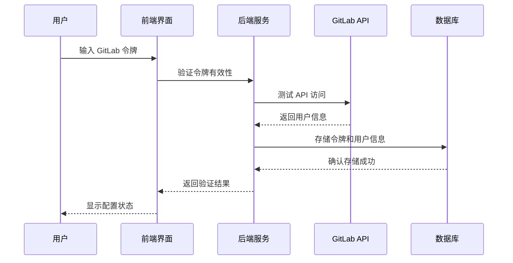

**图表来源**
- [gitlab_service.py](file://enterprise/integrations/gitlab/gitlab_service.py#L47-L81)
- [gitlab-token-input.tsx](file://frontend/src/components/features/settings/git-settings/gitlab-token-input.tsx#L17-L67)

**章节来源**
- [gitlab_service.py](file://enterprise/integrations/gitlab/gitlab_service.py#L47-L81)
- [gitlab-token-input.tsx](file://frontend/src/components/features/settings/git-settings/gitlab-token-input.tsx#L17-L67)

## Webhook 管理与安全

### Webhook 安装流程

系统自动为每个用户的 GitLab 仓库安装 Webhook，以实现实时事件通知：

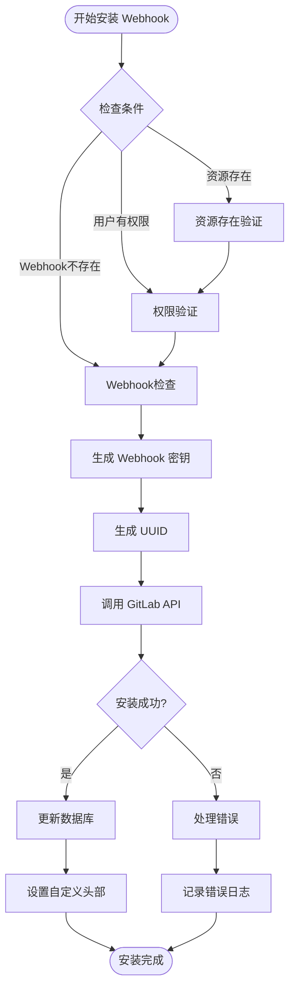

**图表来源**
- [install_gitlab_webhooks.py](file://enterprise/sync/install_gitlab_webhooks.py#L187-L241)

### Webhook 安全配置

| 配置项 | 描述 | 默认值 |
|-------|------|--------|
| `webhook_name` | Webhook 名称标识 | `OpenHands Resolver` |
| `enable_ssl_verification` | SSL 验证开关 | `true` |
| `token` | Webhook 安全令牌 | 自动生成 |
| `custom_headers` | 自定义请求头 | 包含用户 ID 和 Webhook ID |

### Webhook 事件类型

系统监听以下 GitLab 事件类型：

| 事件类型 | 触发条件 | 用途 |
|---------|---------|------|
| `note_events` | 评论事件 | 处理代码审查评论 |
| `merge_requests_events` | 合并请求事件 | 监控 PR 状态变化 |
| `issues_events` | 问题事件 | 跟踪问题状态更新 |
| `pipeline_events` | 流水线事件 | 监控构建状态 |
| `job_events` | 作业事件 | 跟踪任务执行状态 |

### Webhook 验证机制

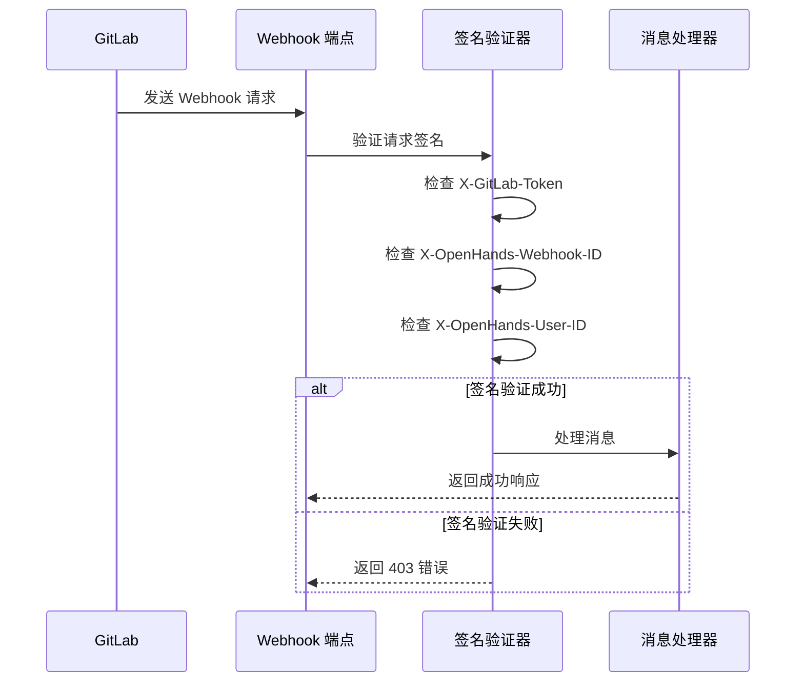

**图表来源**
- [gitlab.py](file://enterprise/server/routes/integration/gitlab.py#L21-L32)

**章节来源**
- [install_gitlab_webhooks.py](file://enterprise/sync/install_gitlab_webhooks.py#L16-L24)
- [gitlab.py](file://enterprise/server/routes/integration/gitlab.py#L21-L32)
- [gitlab_service.py](file://enterprise/integrations/gitlab/gitlab_service.py#L405-L474)

## 仓库同步机制

### 同步频率与策略

系统采用多层次的仓库同步策略：

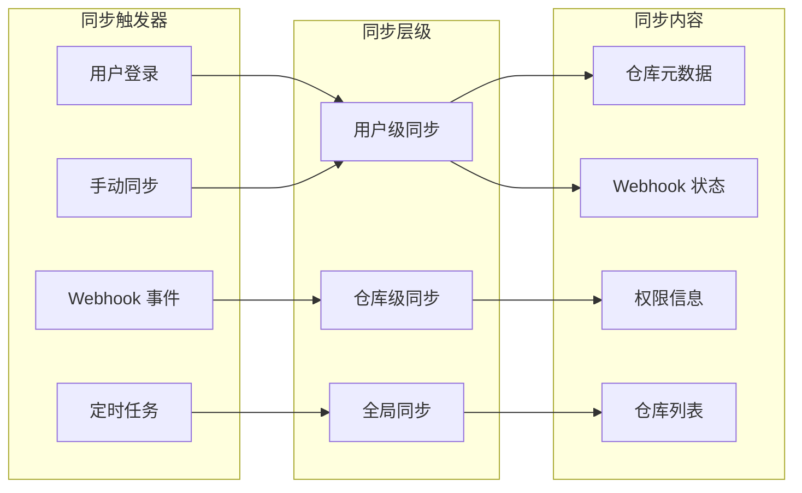

**图表来源**
- [gitlab_sync.py](file://enterprise/server/auth/gitlab_sync.py#L10-L31)

### 仓库发现算法

系统使用智能算法自动发现用户的 GitLab 仓库：

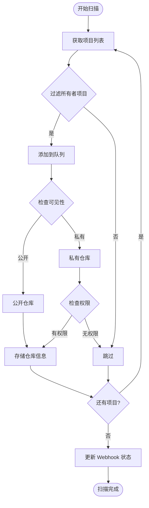

**图表来源**
- [gitlab_service.py](file://enterprise/integrations/gitlab/gitlab_service.py#L171-L268)

### 同步性能优化

| 优化策略 | 实现方式 | 性能提升 |
|---------|---------|---------|
| 分页加载 | 每次最多获取 100 个项目 | 减少单次 API 调用负载 |
| 并发处理 | 异步处理多个仓库 | 提升整体同步速度 |
| 缓存机制 | 缓存用户权限信息 | 减少重复 API 调用 |
| 增量同步 | 只同步变更的仓库 | 最小化网络开销 |

**章节来源**
- [gitlab_sync.py](file://enterprise/server/auth/gitlab_sync.py#L10-L31)
- [gitlab_service.py](file://enterprise/integrations/gitlab/gitlab_service.py#L171-L268)

## 用户权限同步

### 权限检查机制

系统实现了多层权限验证机制：

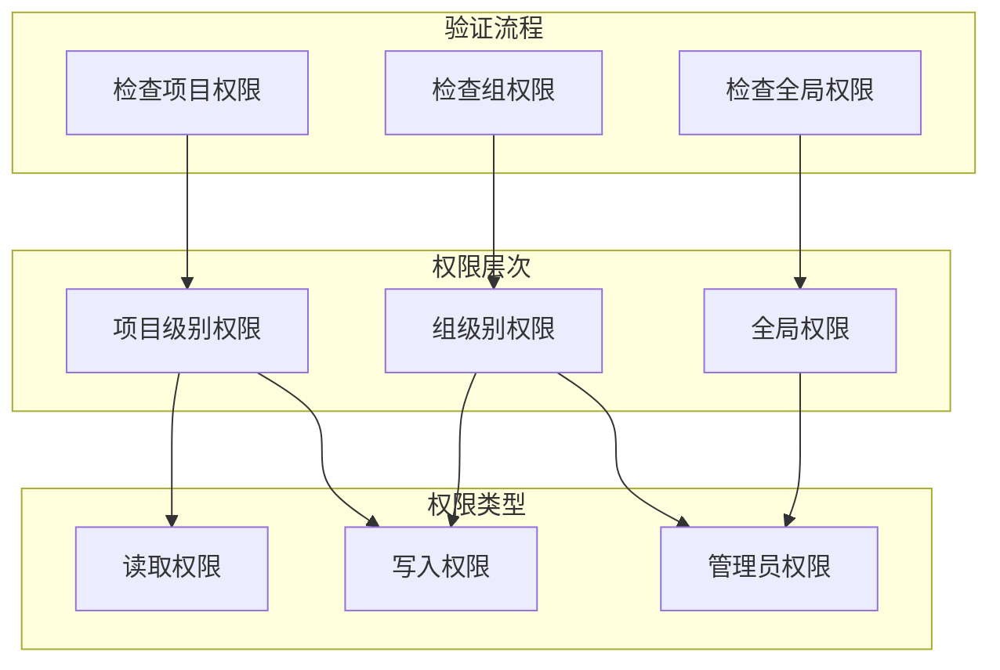

**图表来源**
- [gitlab_service.py](file://enterprise/integrations/gitlab/gitlab_service.py#L476-L499)

### 权限同步策略

| 权限类型 | 同步频率 | 更新触发器 |
|---------|---------|-----------|
| 项目访问权限 | 实时 | 用户操作、Webhook 事件 |
| 组成员权限 | 每小时 | 定时任务、权限变更 |
| 全局用户信息 | 每天 | 用户登录、系统维护 |

### 写入权限验证

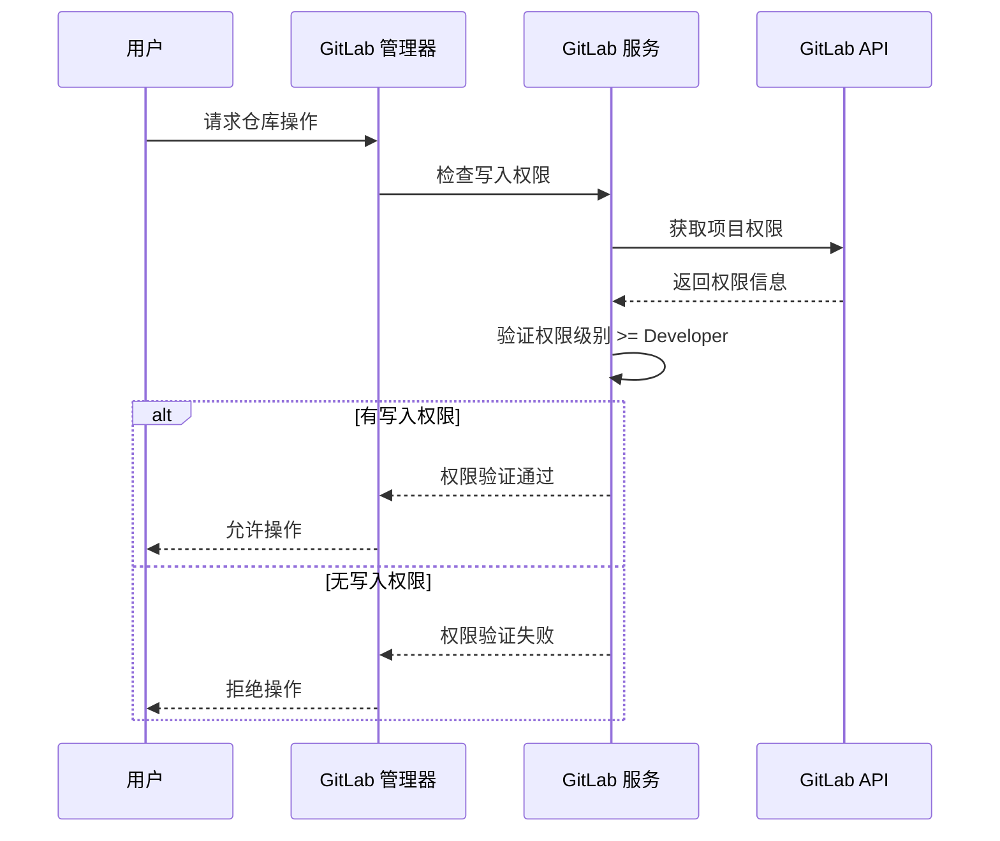

**图表来源**
- [gitlab_manager.py](file://enterprise/integrations/gitlab/gitlab_manager.py#L43-L73)

**章节来源**
- [gitlab_service.py](file://enterprise/integrations/gitlab/gitlab_service.py#L476-L499)
- [gitlab_manager.py](file://enterprise/integrations/gitlab/gitlab_manager.py#L43-L73)

## 配置参数详解

### 核心配置参数

| 参数名称 | 类型 | 默认值 | 描述 |
|---------|------|--------|------|
| `GITLAB_APP_CLIENT_ID` | 字符串 | - | GitLab OAuth 客户端 ID |
| `GITLAB_APP_CLIENT_SECRET` | 字符串 | - | GitLab OAuth 客户端密钥 |
| `GITLAB_BASE_URL` | 字符串 | `https://gitlab.com/api/v4` | GitLab API 基础 URL |
| `GITLAB_WEBHOOK_URL` | 字符串 | - | Webhook 回调 URL |
| `GITLAB_WEBHOOK_SECRET` | 字符串 | 自动生成 | Webhook 安全密钥 |

### 数据库表结构

GitLab 集成使用专门的数据库表来管理 Webhook 状态：

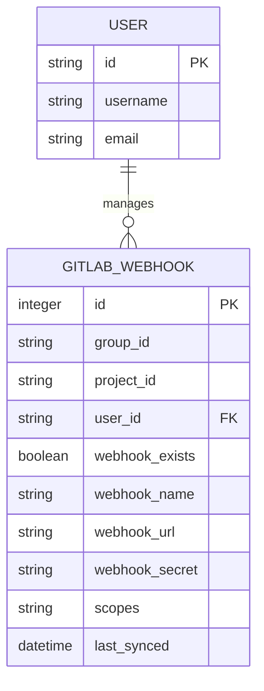

**图表来源**
- [gitlab-webhook_table.py](file://enterprise/migrations/versions/027_create_gitlab_webhook_table.py#L24-L36)

### 环境变量配置表

| 环境变量 | 必需性 | 默认值 | 说明 |
|---------|-------|--------|------|
| `GITLAB_APP_CLIENT_ID` | 必需 | - | GitLab 应用客户端 ID |
| `GITLAB_APP_CLIENT_SECRET` | 必需 | - | GitLab 应用客户端密钥 |
| `GITLAB_BASE_URL` | 可选 | `https://gitlab.com/api/v4` | GitLab API 地址 |
| `GITLAB_WEBHOOK_URL` | 必需 | - | Webhook 回调地址 |
| `KEYCLOAK_SERVER_URL` | 必需 | - | Keycloak 认证服务器地址 |

**章节来源**
- [constants.py](file://enterprise/server/auth/constants.py#L16-L17)
- [gitlab-webhook_table.py](file://enterprise/migrations/versions/027_create_gitlab_webhook_table.py#L24-L36)

## 部署示例

### 完整部署配置

以下是一个完整的 GitLab 集成部署示例：

```yaml
# docker-compose.yml 示例
version: '3.8'
services:
  openhands:
    image: openhands/cloud:latest
    environment:
      - GITLAB_APP_CLIENT_ID=${GITLAB_CLIENT_ID}
      - GITLAB_APP_CLIENT_SECRET=${GITLAB_CLIENT_SECRET}
      - GITLAB_BASE_URL=https://gitlab.com/api/v4
      - GITLAB_WEBHOOK_URL=https://your-domain.com/api/integration/gitlab/events
      - KEYCLOAK_SERVER_URL=https://auth.your-domain.com
      - KEYCLOAK_REALM_NAME=openhands
      - KEYCLOAK_CLIENT_ID=openhands-cloud
      - KEYCLOAK_CLIENT_SECRET=${KEYCLOAK_CLIENT_SECRET}
    ports:
      - "8080:8080"
    depends_on:
      - postgres
      - redis
  
  postgres:
    image: postgres:13
    environment:
      - POSTGRES_DB=openhands
      - POSTGRES_USER=openhands
      - POSTGRES_PASSWORD=${DB_PASSWORD}
    volumes:
      - postgres_data:/var/lib/postgresql/data
  
  redis:
    image: redis:6-alpine
    ports:
      - "6379:6379"
    volumes:
      - redis_data:/data

volumes:
  postgres_data:
  redis_data:
```

### 用户仓库自动发现流程

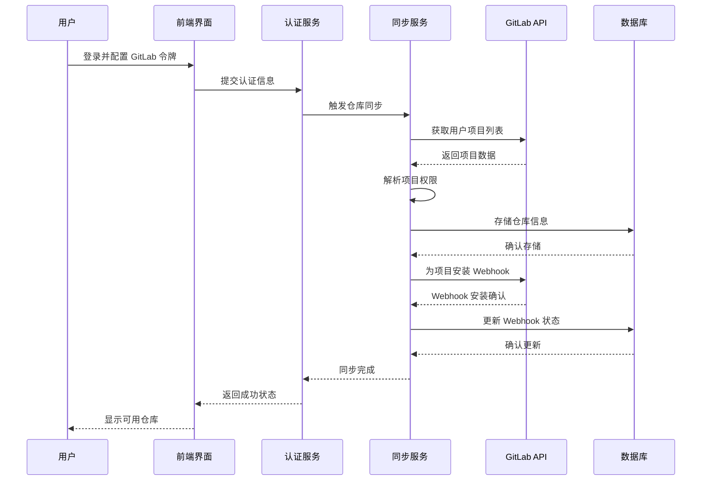

**图表来源**
- [auth.py](file://enterprise/server/routes/auth.py#L244-L247)
- [gitlab_sync.py](file://enterprise/server/auth/gitlab_sync.py#L10-L31)

### Webhook 安装示例

以下是 Webhook 安装的具体配置示例：

```python
# Webhook 安装配置
WEBHOOK_CONFIG = {
    "name": "OpenHands Resolver",
    "url": "https://your-domain.com/api/integration/gitlab/events",
    "token": "generated-secret-token",
    "enable_ssl_verification": True,
    "description": "Cloud OpenHands Resolver",
    "custom_headers": {
        "X-OpenHands-User-ID": "user-id",
        "X-OpenHands-Webhook-ID": "webhook-uuid"
    },
    "events": {
        "note_events": True,
        "merge_requests_events": True,
        "issues_events": True,
        "pipeline_events": True,
        "job_events": True,
        "confidential_issues_events": True,
        "confidential_note_events": True
    }
}
```

**章节来源**
- [install_gitlab_webhooks.py](file://enterprise/sync/install_gitlab_webhooks.py#L16-L24)
- [auth.py](file://enterprise/server/routes/auth.py#L244-L247)

## 安全最佳实践

### 令牌轮换策略

实施定期的令牌轮换机制以确保安全性：

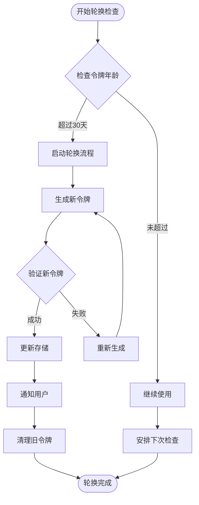

### Webhook 验证安全

| 安全措施 | 实现方式 | 防护目标 |
|---------|---------|---------|
| 请求签名验证 | HMAC-SHA256 签名 | 防止伪造请求 |
| 令牌匹配验证 | 令牌字符串比较 | 确保请求来源 |
| IP 白名单 | 可选 IP 地址限制 | 限制访问来源 |
| 速率限制 | Redis 计数器 | 防止暴力攻击 |

### 敏感信息保护

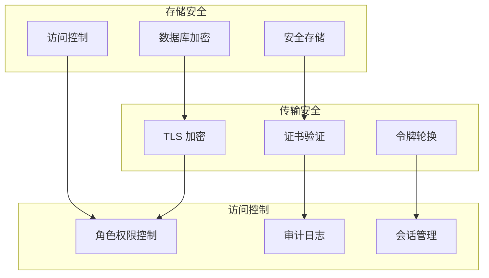

### 权限最小化原则

遵循最小权限原则配置 GitLab 令牌：

| 权限类别 | 推荐权限 | 不推荐权限 |
|---------|---------|-----------|
| 仓库访问 | `read_repository` | `write_repository` |
| 用户信息 | `read_user` | `admin_user` |
| API 访问 | `api` | `sudo` |
| Webhook 管理 | `write_repository` | `admin_project` |

**章节来源**
- [gitlab.py](file://enterprise/server/routes/integration/gitlab.py#L21-L32)
- [gitlab_service.py](file://enterprise/integrations/gitlab/gitlab_service.py#L405-L474)

## 故障排除指南

### 常见问题诊断

#### 仓库列表为空

**症状**: 用户登录后看不到任何 GitLab 仓库

**可能原因**:
1. GitLab 令牌权限不足
2. 用户没有访问任何仓库的权限
3. API 限制导致请求失败

**解决方案**:
```bash
# 检查令牌权限
curl -H "Authorization: Bearer YOUR_TOKEN" \
     https://gitlab.com/api/v4/user

# 检查仓库访问权限
curl -H "Authorization: Bearer YOUR_TOKEN" \
     https://gitlab.com/api/v4/projects?membership=true&per_page=1
```

#### Webhook 注册失败

**症状**: Webhook 安装过程中出现错误

**诊断步骤**:
1. 检查网络连接和防火墙设置
2. 验证 GitLab API 可访问性
3. 确认用户具有管理员权限

**解决方案**:
```python
# 检查 Webhook 安装状态
async def diagnose_webhook_issue(user_id: str):
    service = SaaSGitLabService(external_auth_id=user_id)
    
    # 检查资源是否存在
    exists, status = await service.check_resource_exists(resource_type, resource_id)
    
    # 检查用户权限
    has_permission, _ = await service.check_user_has_admin_access_to_resource(
        resource_type, resource_id
    )
    
    # 检查 Webhook 是否已存在
    webhook_exists, _ = await service.check_webhook_exists_on_resource(
        resource_type, resource_id, GITLAB_WEBHOOK_URL
    )
```

#### 权限同步异常

**症状**: 用户权限状态不正确或过期

**诊断工具**:
```python
# 权限诊断脚本
async def diagnose_permission_issue(user_id: str, project_id: str):
    service = SaaSGitLabService(external_auth_id=user_id)
    
    # 检查项目权限
    has_write = await service.user_has_write_access(project_id)
    
    # 获取项目权限详情
    url = f"{service.BASE_URL}/projects/{project_id}"
    response, _ = await service._make_request(url)
    
    permissions = response.get('permissions', {})
    project_access = permissions.get('project_access', {})
    group_access = permissions.get('group_access', {})
    
    return {
        "has_write_access": has_write,
        "project_access_level": project_access.get('access_level'),
        "group_access_level": group_access.get('access_level')
    }
```

### 错误代码参考

| 错误代码 | 描述 | 解决方案 |
|---------|------|---------|
| `401` | 未授权访问 | 检查 GitLab 令牌有效性 |
| `403` | 权限不足 | 验证用户对资源的访问权限 |
| `404` | 资源不存在 | 确认项目或组 ID 正确性 |
| `429` | 请求过于频繁 | 实施适当的重试策略 |
| `500` | 服务器内部错误 | 检查系统日志和依赖服务 |

### 日志分析指南

关键日志模式识别：

```bash
# Webhook 安装成功
[INFO] Installed webhook for user_id on resource_type:resource_id

# 权限验证失败
[WARNING] User does not have admin access to resource

# 令牌过期
[ERROR] GitLab API request failed: 401 Unauthorized

# 同步完成
[INFO] Successfully stored repository data for user user_id
```

### 性能监控指标

| 指标名称 | 正常范围 | 告警阈值 | 监控方法 |
|---------|---------|---------|---------|
| 同步延迟 | < 30秒 | > 2分钟 | 监控最后同步时间 |
| API 响应时间 | < 2秒 | > 10秒 | 应用性能监控 |
| Webhook 成功率 | > 95% | < 90% | Webhook 状态统计 |
| 权限验证时间 | < 1秒 | > 5秒 | 权限检查计时 |

**章节来源**
- [gitlab_service.py](file://enterprise/integrations/gitlab/gitlab_service.py#L270-L300)
- [install_gitlab_webhooks.py](file://enterprise/sync/install_gitlab_webhooks.py#L37-L43)

## 总结

OpenHands 的 GitLab 集成提供了完整的企业级解决方案，涵盖了从身份验证到仓库同步的全流程。通过 OAuth2 认证、安全的 Webhook 管理、智能的权限同步机制，系统能够为用户提供无缝的 GitLab 集成体验。

### 主要特性

1. **安全的身份验证**: 支持 OAuth2 和个人访问令牌
2. **自动化仓库同步**: 实时发现和同步用户仓库
3. **智能权限管理**: 多层次权限验证和同步
4. **安全的 Webhook**: 加密签名和重复消息防护
5. **灵活的配置**: 支持多种部署场景和配置选项

### 最佳实践建议

1. **定期轮换令牌**: 至少每 90 天更换一次访问令牌
2. **最小权限原则**: 仅授予必要的最低权限
3. **监控和告警**: 建立完善的监控和告警机制
4. **备份配置**: 定期备份重要的配置信息
5. **文档维护**: 保持配置文档的及时更新

通过遵循本文档的指导和最佳实践，您可以成功部署和维护 OpenHands 的 GitLab 集成，为您的团队提供高效、安全的代码协作体验。