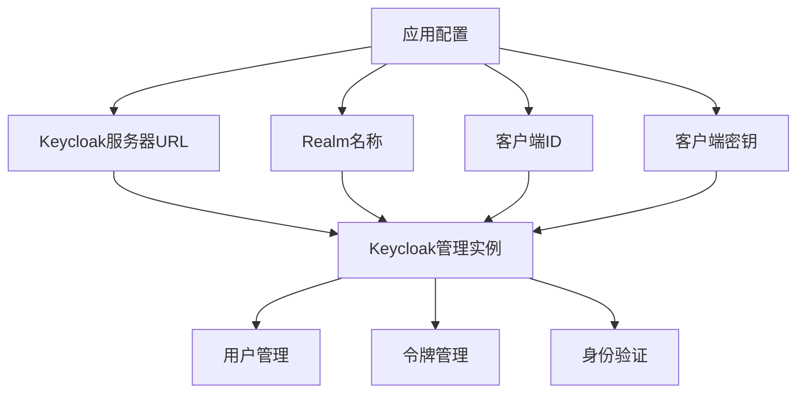
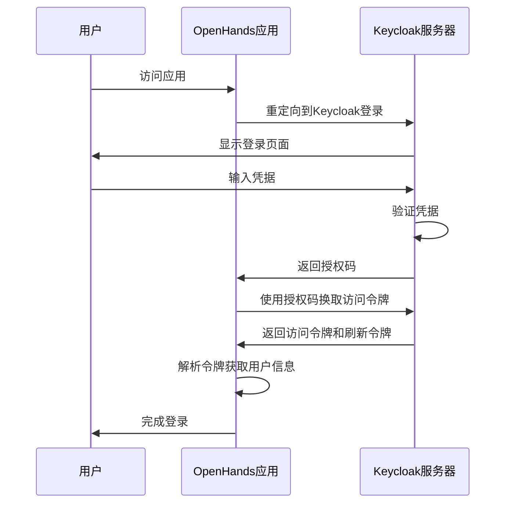
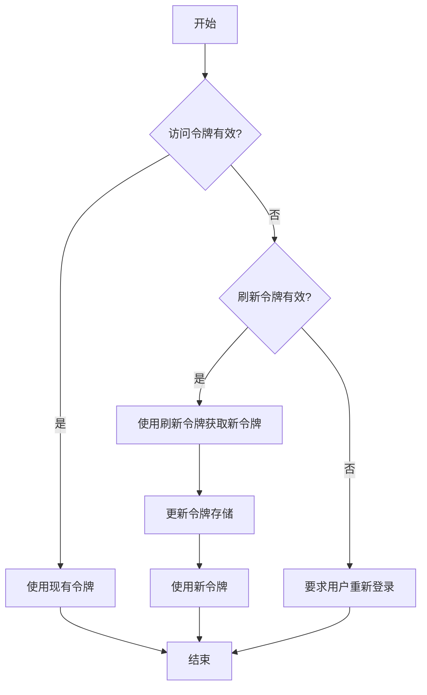
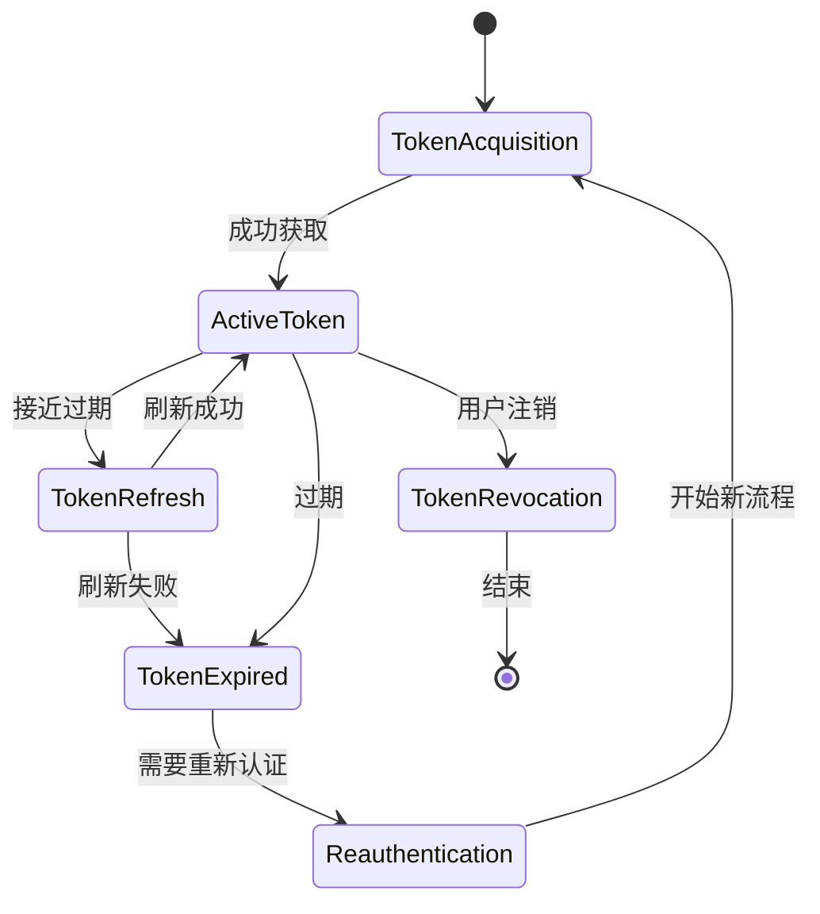

# Keycloak 集成配置

<cite>
**本文档引用的文件**   
- [keycloak_manager.py](file://enterprise/server/auth/keycloak_manager.py)
- [token_manager.py](file://enterprise/server/auth/token_manager.py)
- [saas_user_auth.py](file://enterprise/server/auth/saas_user_auth.py)
- [constants.py](file://enterprise/server/auth/constants.py)
- [auth.py](file://enterprise/server/routes/auth.py)
- [auth_token_store.py](file://enterprise/storage/auth_token_store.py)
- [resend_keycloak.py](file://enterprise/sync/resend_keycloak.py)
- [middleware.py](file://enterprise/server/middleware.py)
</cite>

## 目录
1. [简介](#简介)
2. [Keycloak 配置](#keycloak-配置)
3. [身份认证流程](#身份认证流程)
4. [令牌管理](#令牌管理)
5. [用户映射与角色同步](#用户映射与角色同步)
6. [安全最佳实践](#安全最佳实践)
7. [故障排查指南](#故障排查指南)

## 简介
本文档详细介绍了OpenHands与Keycloak的身份认证集成方案。文档涵盖了Keycloak客户端配置、realm设置、用户映射和角色同步等关键配置。重点说明了客户端ID、客户端密钥、令牌颁发者URL和用户属性映射等核心参数的配置方法。同时提供了实际部署示例，展示在企业环境中如何实现单点登录(SSO)和用户生命周期管理。文档还包含了JWT令牌验证、令牌刷新机制和会话超时策略等安全最佳实践，以及解决常见集成问题的故障排查指南。

## Keycloak 配置

### Realm 和客户端设置
Keycloak集成的核心配置在`enterprise/server/auth/constants.py`文件中定义，主要通过环境变量进行配置。关键配置参数包括：

- **KEYCLOAK_SERVER_URL**: Keycloak服务器的内部URL
- **KEYCLOAK_SERVER_URL_EXT**: Keycloak服务器的外部URL
- **KEYCLOAK_REALM_NAME**: Keycloak realm名称
- **KEYCLOAK_CLIENT_ID**: Keycloak客户端ID
- **KEYCLOAK_CLIENT_SECRET**: Keycloak客户端密钥
- **KEYCLOAK_ADMIN_PASSWORD**: Keycloak管理员密码

这些配置通过`get_keycloak_admin`和`get_keycloak_openid`函数创建Keycloak管理实例和OpenID实例，用于与Keycloak服务器进行交互。



**Diagram sources**
- [keycloak_manager.py](file://enterprise/server/auth/keycloak_manager.py#L36-L50)
- [constants.py](file://enterprise/server/auth/constants.py#L7-L15)

**Section sources**
- [keycloak_manager.py](file://enterprise/server/auth/keycloak_manager.py#L1-L51)
- [constants.py](file://enterprise/server/auth/constants.py#L1-L33)

### 用户属性映射
Keycloak用户属性映射在用户认证过程中自动处理。当用户通过Keycloak认证后，系统会从访问令牌中提取用户信息，包括用户ID(sub)、电子邮件(email)、用户名(preferred_username)等。这些信息用于在OpenHands系统中创建或更新用户记录。



**Diagram sources**
- [token_manager.py](file://enterprise/server/auth/token_manager.py#L89-L111)
- [auth.py](file://enterprise/server/routes/auth.py#L99-L248)

## 身份认证流程

### OAuth2认证流程
OpenHands与Keycloak的集成基于OAuth2协议实现。认证流程主要包括以下步骤：

1. 用户访问OpenHands应用
2. 应用重定向用户到Keycloak登录页面
3. 用户在Keycloak完成身份验证
4. Keycloak重定向回应用并提供授权码
5. 应用使用授权码向Keycloak请求访问令牌
6. Keycloak返回访问令牌和刷新令牌
7. 应用使用令牌完成用户会话建立

```python
async def keycloak_callback(
    request: Request,
    code: Optional[str] = None,
    state: Optional[str] = None,
):
    # 处理Keycloak回调
    keycloak_access_token, keycloak_refresh_token = await token_manager.get_keycloak_tokens(code, redirect_uri)
    
    # 获取用户信息
    user_info = await token_manager.get_user_info(keycloak_access_token)
    
    # 存储IDP令牌
    await token_manager.store_idp_tokens(ProviderType(idp), user_id, keycloak_access_token)
    
    # 设置响应cookie
    set_response_cookie(
        request=request,
        response=response,
        keycloak_access_token=keycloak_access_token,
        keycloak_refresh_token=keycloak_refresh_token,
        secure=True,
        accepted_tos=has_accepted_tos,
    )
```

**Section sources**
- [auth.py](file://enterprise/server/routes/auth.py#L99-L248)
- [token_manager.py](file://enterprise/server/auth/token_manager.py#L89-L111)

### 令牌验证与刷新
系统实现了自动令牌验证和刷新机制。当访问令牌即将过期时，系统会使用刷新令牌自动获取新的访问令牌，确保用户会话的连续性。



**Diagram sources**
- [token_manager.py](file://enterprise/server/auth/token_manager.py#L147-L189)
- [saas_user_auth.py](file://enterprise/server/auth/saas_user_auth.py#L65-L78)

## 令牌管理

### 令牌存储与加密
系统使用加密机制安全地存储用户令牌。所有敏感令牌信息在存储前都会进行加密处理，确保数据安全。

```python
def create_encryption_utility(secret_key: bytes):
    """使用32字节密钥创建加密工具."""
    # 将32字节密钥转换为Fernet密钥
    fernet_key = b64encode(hashlib.sha256(secret_key).digest())
    f = Fernet(fernet_key)
    
    def encrypt_text(text: str) -> str:
        return f.encrypt(text.encode()).decode()
    
    def decrypt_text(encrypted_text: str) -> str:
        return f.decrypt(encrypted_text.encode()).decode()
    
    return encrypt_payload, decrypt_payload, encrypt_text, decrypt_text
```

令牌存储在数据库中，通过`AuthTokenStore`类进行管理，确保令牌的安全存储和访问。

**Section sources**
- [token_manager.py](file://enterprise/server/auth/token_manager.py#L47-L75)
- [auth_token_store.py](file://enterprise/storage/auth_token_store.py#L1-L209)

### 令牌生命周期管理
系统实现了完整的令牌生命周期管理，包括令牌的获取、验证、刷新和注销。



**Diagram sources**
- [token_manager.py](file://enterprise/server/auth/token_manager.py#L596-L671)
- [auth.py](file://enterprise/server/routes/auth.py#L380-L406)

## 用户映射与角色同步

### 用户ID映射
系统通过Keycloak Admin API实现用户ID映射功能，可以根据不同的身份提供商(IDP)查找对应的用户。

```python
async def get_user_id_from_idp_user_id(
    self, idp_user_id: str, idp: ProviderType
) -> str | None:
    keycloak_admin = get_keycloak_admin(self.external)
    users = await keycloak_admin.a_get_users({'q': f'{idp.value}_id:{idp_user_id}'})
    if not users:
        return None
    keycloak_user_id = users[0]['id']
    return keycloak_user_id
```

此功能允许系统根据GitHub、GitLab等IDP的用户ID查找对应的Keycloak用户ID，实现跨平台用户映射。

**Section sources**
- [token_manager.py](file://enterprise/server/auth/token_manager.py#L490-L500)

### 用户生命周期同步
系统提供了用户生命周期同步功能，可以将Keycloak用户同步到其他系统，如邮件服务。

```python
def sync_users_to_resend():
    """将Keycloak用户同步到Resend."""
    # 获取Keycloak用户
    total_users = get_total_keycloak_users()
    
    # 获取Resend联系人
    resend_contacts = get_resend_contacts(RESEND_AUDIENCE_ID)
    
    # 处理用户批次
    offset = 0
    while offset < total_users:
        users = get_keycloak_users(offset, BATCH_SIZE)
        for user in users:
            email = user.get('email')
            if email and email.lower() not in resend_contacts:
                # 添加联系人到Resend
                add_contact_to_resend(RESEND_AUDIENCE_ID, email, user.get('first_name'), user.get('last_name'))
                # 发送欢迎邮件
                send_welcome_email(email, user.get('first_name'), user.get('last_name'))
        offset += BATCH_SIZE
```

**Section sources**
- [resend_keycloak.py](file://enterprise/sync/resend_keycloak.py#L294-L403)

## 安全最佳实践

### JWT令牌验证
系统实现了严格的JWT令牌验证机制，确保令牌的完整性和有效性。

```python
async def verify_keycloak_token(
    self, keycloak_token: str, refresh_token: str
) -> tuple[str, str]:
    try:
        await get_keycloak_openid(self.external).a_userinfo(keycloak_token)
        return keycloak_token, refresh_token
    except KeycloakAuthenticationError:
        # 尝试刷新Keycloak访问令牌
        new_keycloak_tokens = await get_keycloak_openid(self.external).a_refresh_token(refresh_token)
        return (
            new_keycloak_tokens['access_token'],
            new_keycloak_tokens['refresh_token'],
        )
```

**Section sources**
- [token_manager.py](file://enterprise/server/auth/token_manager.py#L113-L128)

### 会话管理
系统实现了安全的会话管理机制，包括会话cookie的安全设置和自动清理。

```python
def set_response_cookie(
    request: Request,
    response: Response,
    keycloak_access_token: str,
    keycloak_refresh_token: str,
    secure: bool = True,
    accepted_tos: bool = False,
):
    # 创建签名的JWT令牌
    cookie_data = {
        'access_token': keycloak_access_token,
        'refresh_token': keycloak_refresh_token,
        'accepted_tos': accepted_tos,
    }
    signed_token = sign_token(cookie_data, config.jwt_secret.get_secret_value())
    
    # 设置安全cookie
    response.set_cookie(
        key='keycloak_auth',
        value=signed_token,
        httponly=True,
        secure=secure,
        samesite=get_cookie_samesite(request),
    )
```

**Section sources**
- [auth.py](file://enterprise/server/routes/auth.py#L43-L77)
- [middleware.py](file://enterprise/server/middleware.py#L26-L175)

## 故障排查指南

### 常见问题及解决方案
以下是Keycloak集成中常见的问题及其解决方案：

1. **令牌验证失败**
   - 检查Keycloak服务器URL配置是否正确
   - 验证客户端ID和客户端密钥是否匹配
   - 确认realm名称配置正确

2. **用户同步延迟**
   - 检查网络连接是否稳定
   - 验证Keycloak管理员凭据是否有效
   - 检查API调用频率是否超过限制

3. **权限映射错误**
   - 确认用户属性映射配置正确
   - 检查角色映射规则是否准确
   - 验证用户在Keycloak中的角色分配

4. **会话超时问题**
   - 检查令牌过期时间配置
   - 验证刷新令牌机制是否正常工作
   - 确认会话cookie设置是否正确

### 日志分析
系统提供了详细的日志记录，可用于诊断集成问题。关键日志点包括：

- 认证流程中的各个阶段
- 令牌获取和刷新操作
- 用户信息查询结果
- 错误和异常情况

通过分析这些日志，可以快速定位和解决集成问题。

**Section sources**
- [token_manager.py](file://enterprise/server/auth/token_manager.py#L190-L500)
- [middleware.py](file://enterprise/server/middleware.py#L70-L97)
- [auth.py](file://enterprise/server/routes/auth.py#L177-L195)