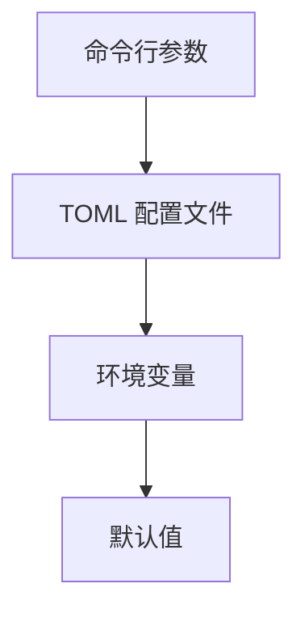
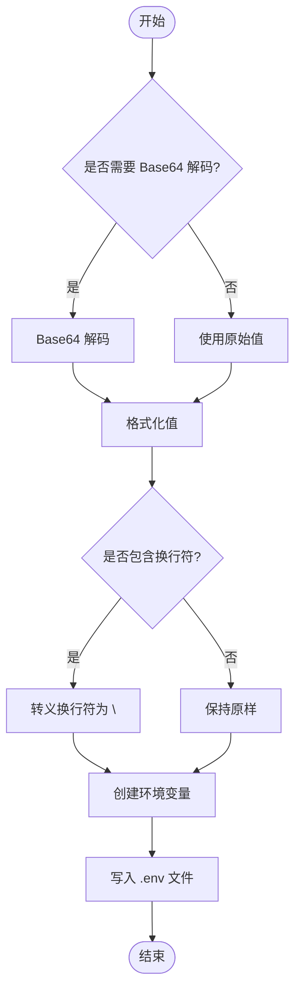

# 环境变量

<cite>
**本文档引用的文件**
- [README.md](file://openhands/core/config/README.md)
- [utils.py](file://openhands/core/config/utils.py)
- [openhands_config.py](file://openhands/core/config/openhands_config.py)
- [config.template.toml](file://config.template.toml)
- [env.py](file://enterprise/migrations/env.py)
- [convert_to_env.py](file://enterprise/enterprise_local/convert_to_env.py)
</cite>

## 目录
1. [简介](#简介)
2. [环境变量使用方法](#环境变量使用方法)
3. [支持的环境变量列表](#支持的环境变量列表)
4. [优先级关系和覆盖规则](#优先级关系和覆盖规则)
5. [命名规范和最佳实践](#命名规范和最佳实践)
6. [安全处理方式](#安全处理方式)
7. [配置示例](#配置示例)

## 简介

OpenHands 使用灵活的配置系统，允许通过环境变量、TOML 文件和命令行参数来定义设置。该系统基于 `openhands/core/config/` 包中的数据类结构，提供了类型安全的配置管理。环境变量是配置 OpenHands 组件行为的重要方式之一，开发者可以通过遵循命名约定和使用提供的函数来自定义应用程序设置。

**Section sources**
- [README.md](file://openhands/core/config/README.md#L1-L101)

## 环境变量使用方法

OpenHands 的配置系统通过 `load_from_env` 函数从环境变量中加载配置值。该函数递归处理配置类，将环境变量名称映射到类属性。环境变量的值会被尝试转换为模型中指定的类型，包括基本类型（str、int、bool）、可选类型（如 `str | None`）和嵌套模型。如果类型转换失败，会记录错误并保留默认值。

**Section sources**
- [README.md](file://openhands/core/config/README.md#L19-L47)
- [utils.py](file://openhands/core/config/utils.py#L39-L124)

## 支持的环境变量列表

OpenHands 支持多种环境变量，按功能领域分类如下：

### 认证相关
- `LLM_API_KEY`: 语言模型 API 密钥
- `SEARCH_API_KEY`: Tavily 搜索引擎 API 密钥
- `JWT_SECRET`: JWT 认证密钥

### 数据库连接
- `DB_USER`: 数据库用户名
- `DB_PASS`: 数据库密码
- `DB_HOST`: 数据库主机地址
- `DB_PORT`: 数据库端口
- `DB_NAME`: 数据库名称
- `GCP_DB_INSTANCE`: GCP 数据库实例
- `GCP_PROJECT`: GCP 项目
- `GCP_REGION`: GCP 区域

### API 密钥
- `POSTHOG_CLIENT_KEY`: PostHog 客户端密钥
- `STRIPE_API_KEY`: Stripe API 密钥
- `LITE_LLM_API_KEY`: Lite LLM API 密钥

### 功能开关
- `ENABLE_EXPERIMENT_MANAGER`: 是否启用实验管理器
- `COLLECT_GITHUB_INTERACTIONS`: 是否收集 GitHub 交互
- `ENABLE_PROACTIVE_CONVERSATION_STARTERS`: 是否启用主动对话启动器
- `ENABLE_SOLVABILITY_ANALYSIS`: 是否启用可解决性分析

**Section sources**
- [env.py](file://enterprise/migrations/env.py#L10-L22)
- [constants.py](file://enterprise/experiments/constants.py#L7-L35)
- [utils.py](file://enterprise/integrations/utils.py#L45-L50)

## 优先级关系和覆盖规则

OpenHands 配置的优先级顺序（从高到低）如下：
1. 命令行参数（如 -l 用于 LLM 配置）
2. 当前目录中的 config.toml 文件（或通过 --config-file 指定的位置）
3. ~/.openhands/settings.json 和 ~/.openhands/config.toml

当多个配置源同时存在时，优先级高的配置会覆盖优先级低的配置。例如，命令行参数会覆盖 TOML 文件中的配置，而 TOML 文件中的配置会覆盖环境变量的设置。



**Diagram sources**
- [utils.py](file://openhands/core/config/utils.py#L845-L849)

**Section sources**
- [utils.py](file://openhands/core/config/utils.py#L840-L855)

## 命名规范和最佳实践

### 命名约定
- 前缀：配置类名称的大写形式后跟下划线（如 `LLM_`、`AGENT_`）
- 字段名称：全部大写
- 完整变量名：前缀 + 字段名称（如 `LLM_API_KEY`、`AGENT_MEMORY_ENABLED`）

### 最佳实践
- 使用大写字母和下划线分隔单词
- 避免使用特殊字符
- 保持变量名简洁明了
- 使用一致的前缀来组织相关变量

**Section sources**
- [README.md](file://openhands/core/config/README.md#L23-L27)

## 安全处理方式

对于敏感信息的处理，OpenHands 提供了以下安全措施：
- 使用 `SecretStr` 类型来存储敏感信息，如 API 密钥和密码
- 环境变量中的空值会被跳过，回退到默认值
- 支持从 `.env` 文件中加载环境变量，便于管理敏感信息
- 提供了 `convert_to_env.py` 脚本，可以将参数转换为环境变量格式，并支持 Base64 编码



**Diagram sources**
- [convert_to_env.py](file://enterprise/enterprise_local/convert_to_env.py#L37-L72)

**Section sources**
- [utils.py](file://openhands/core/config/utils.py#L81-L85)
- [convert_to_env.py](file://enterprise/enterprise_local/convert_to_env.py#L37-L72)

## 配置示例

以下是一些常见的环境变量设置示例：

```bash
# 基本配置
export LLM_API_KEY='your_api_key_here'
export LLM_MODEL='gpt-4'
export AGENT_MEMORY_ENABLED='true'
export SANDBOX_TIMEOUT='300'

# 数据库配置
export DB_USER='postgres'
export DB_PASS='postgres'
export DB_HOST='localhost'
export DB_PORT='5432'
export DB_NAME='openhands'

# 功能开关
export ENABLE_EXPERIMENT_MANAGER='true'
export COLLECT_GITHUB_INTERACTIONS='false'

# 安全配置
export JWT_SECRET='your_jwt_secret_here'
export SEARCH_API_KEY='your_search_api_key_here'
```

这些示例展示了如何设置不同功能领域的环境变量，可以根据实际需求进行调整和扩展。

**Section sources**
- [README.md](file://openhands/core/config/README.md#L29-L36)
- [config.template.toml](file://config.template.toml#L1-L543)