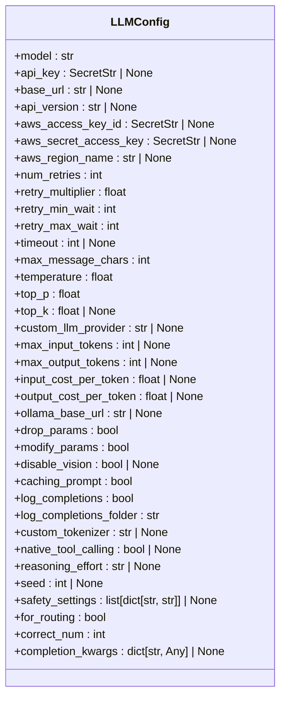
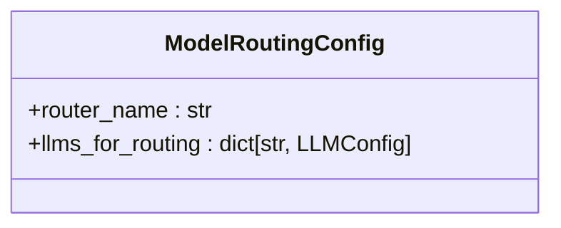
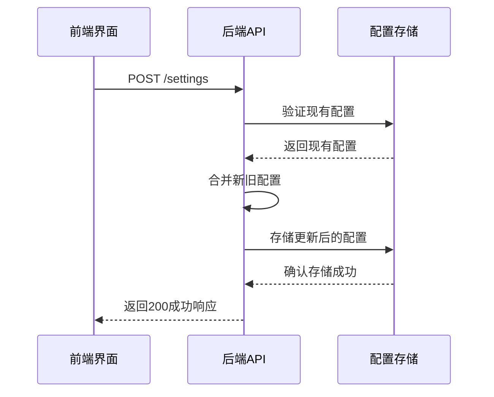
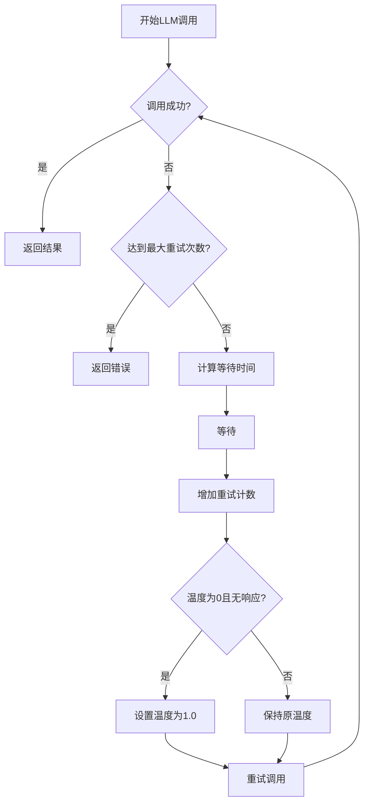

# LLM配置

<cite>
**本文档引用的文件**
- [llm_config.py](file://openhands/core/config/llm_config.py)
- [model_routing_config.py](file://openhands/core/config/model_routing_config.py)
- [config.template.toml](file://config.template.toml)
- [settings.py](file://openhands/server/routes/settings.py)
- [llm.py](file://openhands/llm/llm.py)
- [settings.types.ts](file://frontend/src/settings-service/settings.types.ts)
- [llm-settings.tsx](file://frontend/src/routes/llm-settings.tsx)
</cite>

## 目录
1. [LLM配置体系概述](#llm配置体系概述)
2. [LLM配置类结构详解](#llm配置类结构详解)
3. [模型路由配置](#模型路由配置)
4. [前端与后端的配置交互](#前端与后端的配置交互)
5. [多LLM提供商配置示例](#多llm提供商配置示例)
6. [高级配置与性能优化](#高级配置与性能优化)
7. [配置参数对AI代理的影响](#配置参数对ai代理的影响)

## LLM配置体系概述

OpenHands的LLM配置体系是一个灵活且可扩展的系统，支持通过多种方式配置大语言模型。该系统主要由`llm_config.py`中的`LLMConfig`类和`model_routing_config.py`中的`ModelRoutingConfig`类构成，允许用户通过配置文件、环境变量或前端界面来设置LLM参数。

配置体系的核心是`LLMConfig`类，它定义了所有与LLM相关的配置参数，包括模型名称、API密钥、基础URL、温度、最大token数等。这些配置可以通过`config.toml`文件进行设置，也可以通过前端的settings-service API进行动态更新。

**Section sources**
- [llm_config.py](file://openhands/core/config/llm_config.py#L12-L199)
- [model_routing_config.py](file://openhands/core/config/model_routing_config.py#L6-L40)

## LLM配置类结构详解

`LLMConfig`类是OpenHands中LLM配置的核心数据结构，它继承自Pydantic的`BaseModel`，提供了类型安全和数据验证功能。该类定义了丰富的配置属性，涵盖了LLM使用的各个方面。

### 核心配置参数

`LLMConfig`类包含以下核心配置参数：

- **模型参数**：`model`（模型名称）、`api_key`（API密钥）、`base_url`（基础URL）
- **性能参数**：`temperature`（温度）、`top_p`（top-p采样）、`top_k`（top-k采样）
- **限制参数**：`max_input_tokens`（最大输入token数）、`max_output_tokens`（最大输出token数）
- **重试策略**：`num_retries`（重试次数）、`retry_multiplier`（重试乘数）、`retry_min_wait`（最小等待时间）、`retry_max_wait`（最大等待时间）
- **成本参数**：`input_cost_per_token`（输入token成本）、`output_cost_per_token`（输出token成本）



**Diagram sources**
- [llm_config.py](file://openhands/core/config/llm_config.py#L12-L199)

### 配置继承与覆盖机制

`LLMConfig`类通过`from_toml_section`类方法实现了配置继承与覆盖机制。该机制允许在`config.toml`文件中定义一个通用的LLM配置，然后为特定场景创建自定义配置，这些自定义配置可以继承通用配置的大部分设置，同时覆盖特定参数。

例如，在`config.toml`中可以这样配置：
```toml
[llm]
model = "gpt-4o"
num_retries = 5

[llm.gpt4o-mini]
model = "gpt-4o-mini"
api_key = "your-api-key"
```

在这个例子中，`gpt4o-mini`配置会继承`llm`部分的`num_retries`设置，同时覆盖`model`和`api_key`参数。

**Section sources**
- [llm_config.py](file://openhands/core/config/llm_config.py#L108-L167)
- [config.template.toml](file://config.template.toml#L100-L229)

## 模型路由配置

OpenHands支持通过`ModelRoutingConfig`类实现多模型智能路由。该功能允许系统根据特定条件在不同的LLM之间进行智能切换，以优化性能和成本。

### 路由配置结构

`ModelRoutingConfig`类包含以下主要属性：
- `router_name`：指定使用的路由器名称，如`noop_router`（无路由）或`multimodal_router`（多模态路由）
- `llms_for_routing`：一个字典，映射路由LLM配置名称到其配置对象



**Diagram sources**
- [model_routing_config.py](file://openhands/core/config/model_routing_config.py#L6-L40)

### 多模态路由实现

多模态路由通过`MultimodalRouter`类实现，它会根据消息内容自动选择合适的LLM。当检测到包含图像的多模态内容时，系统会自动路由到支持多模态的主模型；当消息内容超过次级模型的上下文窗口限制时，也会路由到主模型。

路由配置示例：
```toml
[llm]
model = "claude-sonnet-4"
api_key = "your-api-key"

[llm.secondary_model]
model = "kimi-k2"
api_key = "your-api-key"
for_routing = true

[model_routing]
router_name = "multimodal_router"
```

**Section sources**
- [model_routing_config.py](file://openhands/core/config/model_routing_config.py#L6-L40)
- [base.py](file://openhands/llm/router/base.py#L1-L164)
- [impl.py](file://openhands/llm/router/rule_based/impl.py#L1-L74)

## 前端与后端的配置交互

OpenHands的前端通过settings-service API与后端进行LLM配置的交互，实现了配置的动态获取和更新。

### 配置获取流程

前端通过GET请求从后端获取当前的LLM配置。配置数据通过`ApiSettings`类型定义，包含以下主要字段：
- `llm_model`：当前使用的LLM模型
- `llm_base_url`：LLM API的基础URL
- `llm_api_key_set`：API密钥是否已设置的布尔值
- `agent`：当前使用的代理类型

### 配置更新流程

前端通过POST请求向后端发送新的配置。更新流程包括：
1. 前端收集用户输入的配置参数
2. 发送POST请求到`/settings`端点
3. 后端验证并存储新的配置
4. 返回操作结果



**Diagram sources**
- [settings.py](file://openhands/server/routes/settings.py#L133-L157)
- [settings.types.ts](file://frontend/src/settings-service/settings.types.ts#L1-L53)
- [llm-settings.tsx](file://frontend/src/routes/llm-settings.tsx#L163-L453)

**Section sources**
- [settings.py](file://openhands/server/routes/settings.py#L133-L157)
- [settings.types.ts](file://frontend/src/settings-service/settings.types.ts#L1-L53)

## 多LLM提供商配置示例

OpenHands支持多种LLM提供商，包括OpenAI、Anthropic、LiteLLM等。以下是不同提供商的配置示例。

### OpenAI配置

```toml
[llm]
model = "gpt-4o"
api_key = "your-openai-api-key"
base_url = "https://api.openai.com/v1"
temperature = 0.7
max_output_tokens = 4096
```

### Anthropic配置

```toml
[llm]
model = "claude-3-5-sonnet-20241022"
api_key = "your-anthropic-api-key"
base_url = "https://api.anthropic.com"
temperature = 0.5
max_output_tokens = 8192
```

### LiteLLM配置

```toml
[llm]
model = "litellm_proxy/claude-sonnet-4-20250514"
api_key = "your-litellm-api-key"
base_url = "https://llm-proxy.app.all-hands.dev/"
custom_llm_provider = "litellm_proxy"
temperature = 0.3
```

### 本地LLM配置

```toml
[llm]
model = "ollama/llama3"
base_url = "http://localhost:11434"
temperature = 0.8
max_input_tokens = 8192
max_output_tokens = 2048
```

**Section sources**
- [config.template.toml](file://config.template.toml#L100-L229)
- [llm.py](file://openhands/llm/llm.py#L112-L219)
- [map-provider.ts](file://frontend/src/utils/map-provider.ts#L1-L41)

## 高级配置与性能优化

OpenHands提供了多种高级配置选项，可以帮助优化LLM的性能和使用成本。

### 流式响应配置

通过设置`stream`参数，可以启用流式响应，使LLM的输出能够逐字显示，提供更好的用户体验。

### 超时设置

`timeout`参数可以设置LLM API调用的超时时间，防止请求长时间挂起。合理的超时设置可以提高系统的响应性和稳定性。

### 重试策略

OpenHands实现了智能重试机制，包括：
- 指数退避重试：通过`retry_multiplier`、`retry_min_wait`和`retry_max_wait`参数控制
- 温度调整重试：当遇到LLM无响应错误时，自动将温度从0调整到1.0



**Diagram sources**
- [retry_mixin.py](file://openhands/llm/retry_mixin.py#L40-L69)
- [llm_config.py](file://openhands/core/config/llm_config.py#L63-L67)

### 性能优化建议

1. **合理设置温度**：对于需要确定性输出的任务，使用较低的温度（0.0-0.3）；对于需要创造性的任务，使用较高的温度（0.7-1.0）
2. **优化token使用**：根据任务需求设置合适的`max_input_tokens`和`max_output_tokens`，避免不必要的资源消耗
3. **启用缓存**：通过`caching_prompt`参数启用提示缓存，减少重复计算
4. **选择合适的重试策略**：根据API的稳定性和成本，调整重试次数和等待时间

**Section sources**
- [llm_config.py](file://openhands/core/config/llm_config.py#L23-L27)
- [retry_mixin.py](file://openhands/llm/retry_mixin.py#L40-L69)
- [llm.py](file://openhands/llm/llm.py#L710-L781)

## 配置参数对AI代理的影响

不同的LLM配置参数会对AI代理的性能和行为产生显著影响。

### 温度参数的影响

温度参数控制LLM输出的随机性：
- **低温度（0.0-0.3）**：输出更加确定性和一致，适合需要精确答案的任务
- **中等温度（0.4-0.6）**：平衡了创造性和确定性，适合一般性任务
- **高温度（0.7-1.0）**：输出更加随机和创造性，适合需要创新思维的任务

### 最大token数的影响

`max_input_tokens`和`max_output_tokens`参数直接影响AI代理的上下文理解和生成能力：
- 较大的输入token限制允许AI代理处理更长的上下文，提高理解能力
- 较大的输出token限制允许AI代理生成更详细的响应，但可能增加成本和延迟

### 重试策略的影响

合理的重试策略可以提高系统的可靠性：
- 适当的重试次数可以应对临时的API故障
- 指数退避可以避免对API服务器造成过大压力
- 温度调整重试可以解决某些特定的LLM无响应问题

**Section sources**
- [llm_config.py](file://openhands/core/config/llm_config.py#L29-L31)
- [llm.py](file://openhands/llm/llm.py#L114-L124)
- [test_llm.py](file://tests/unit/llm/test_llm.py#L149-L166)