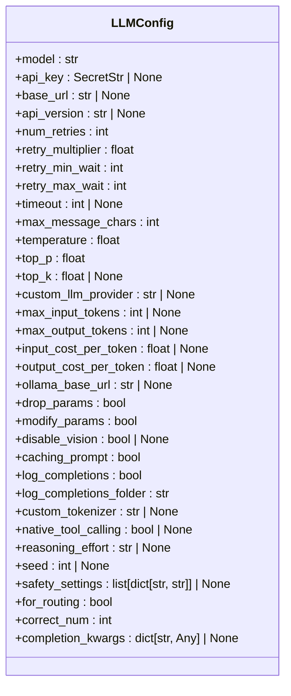
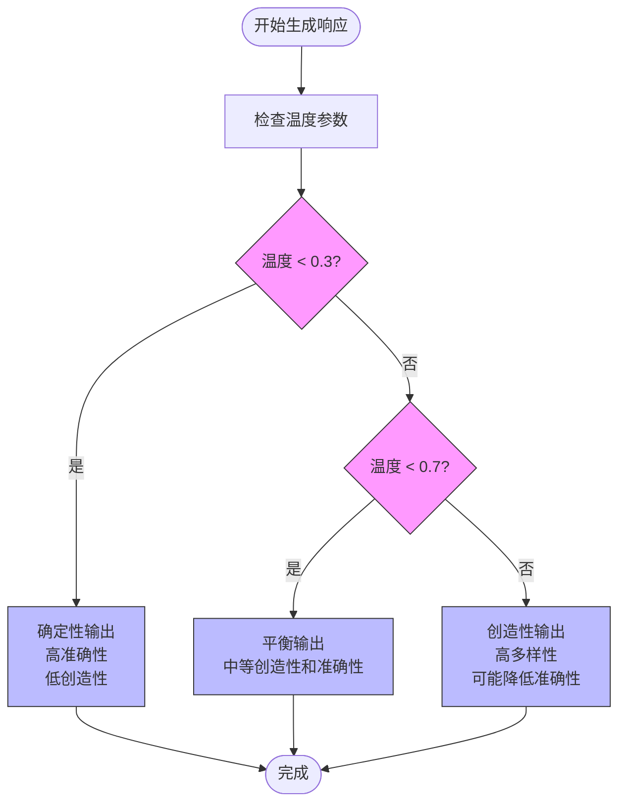
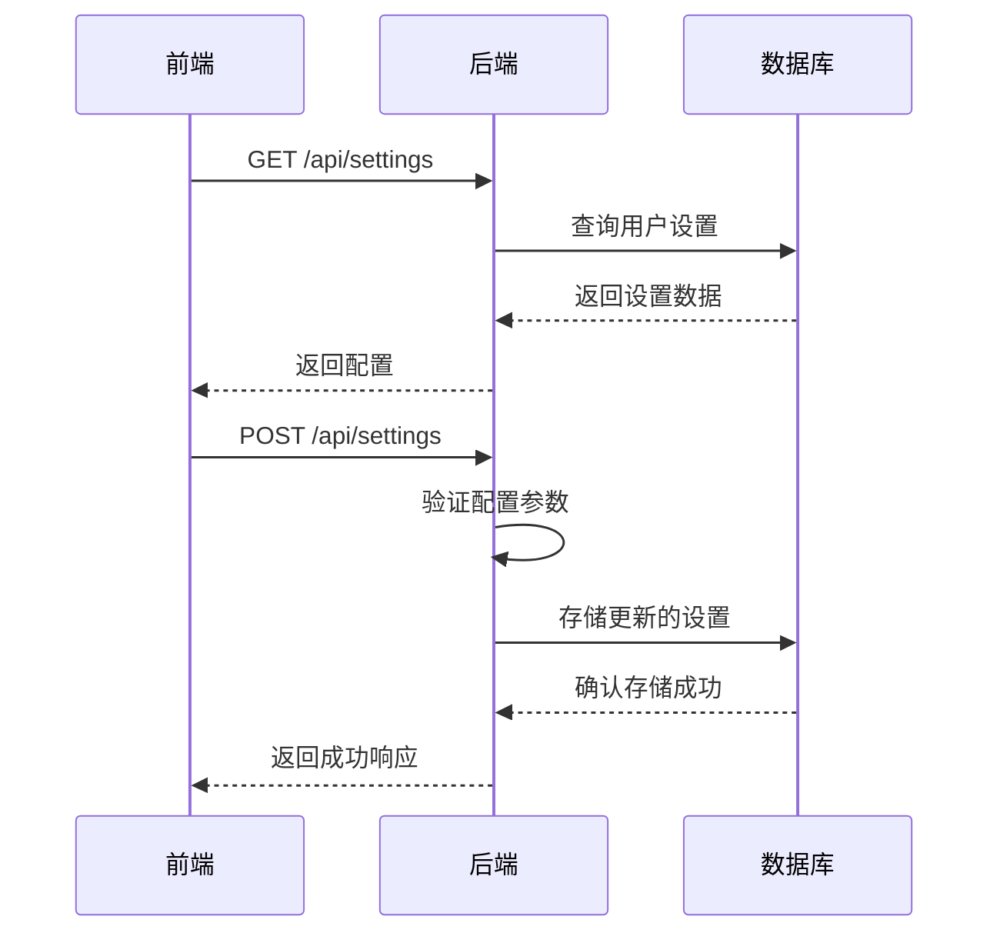
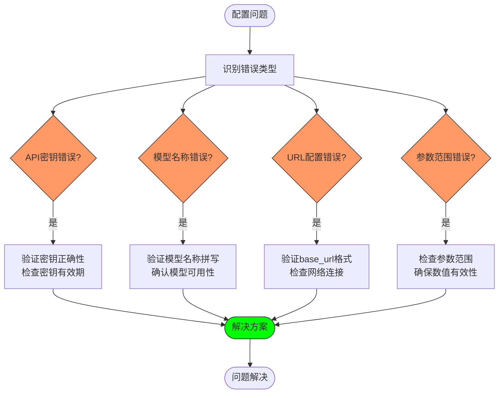

# 基础配置

<cite>
**本文档中引用的文件**  
- [llm_config.py](file://openhands/core/config/llm_config.py)
- [settings.py](file://openhands/server/settings.py)
- [settings.types.ts](file://frontend/src/settings-service/settings.types.ts)
- [settings-service.api.ts](file://frontend/src/settings-service/settings-service.api.ts)
- [config.template.toml](file://config.template.toml)
- [test_llm_config.py](file://tests/unit/core/config/test_llm_config.py)
</cite>

## 目录
1. [简介](#简介)
2. [LLM核心配置参数](#llm核心配置参数)
3. [主流LLM提供商配置示例](#主流llm提供商配置示例)
4. [参数对AI代理行为的影响](#参数对ai代理行为的影响)
5. [前端配置管理流程](#前端配置管理流程)
6. [常见配置错误及解决方案](#常见配置错误及解决方案)
7. [配置验证与安全](#配置验证与安全)

## 简介
本文档详细介绍了OpenHands项目中LLM（大语言模型）的基础配置系统。文档重点分析了`llm_config.py`文件中定义的核心配置参数，包括模型选择、API认证、生成参数等关键设置。同时，文档还解释了前端如何通过settings-service API与后端交互来获取和更新这些配置，以及这些配置如何影响AI代理的创造性、准确性和响应行为。

**Section sources**
- [llm_config.py](file://openhands/core/config/llm_config.py#L1-L199)

## LLM核心配置参数
LLM配置系统通过`LLMConfig`类定义了全面的参数设置，这些参数控制着大语言模型的行为和性能特征。

### 基本连接参数
这些参数定义了与LLM服务的基本连接信息：

- **model**: 指定要使用的模型名称，如`gpt-4o`、`claude-sonnet-4-20250514`等。这是必填参数。
- **api_key**: 用于认证的API密钥，使用`SecretStr`类型确保安全存储。
- **base_url**: API的基础URL，对于本地LLM部署（如Ollama）是必需的。
- **api_version**: API版本，特别是对于Azure模型，系统会自动设置默认版本`2024-12-01-preview`。

### 生成控制参数
这些参数直接影响LLM生成文本的质量和风格：

- **temperature**: 控制生成的随机性或创造性。值越高（接近1.0），输出越随机和创造性；值越低（接近0.0），输出越确定和保守。默认值为0.0。
- **top_p**: 核采样参数，控制生成时考虑的词汇概率累积。值为1.0表示考虑所有可能的词汇。
- **top_k**: 限制生成时考虑的最高k个词汇。默认为None，表示不限制。
- **max_output_tokens**: 生成的最大token数量限制。

### 重试与超时参数
这些参数确保在API调用失败时的可靠性和稳定性：

- **num_retries**: 失败时的最大重试次数，默认为5次。
- **retry_multiplier**: 指数退避的乘数，默认为8。
- **retry_min_wait**: 重试之间的最小等待时间（秒），默认为8秒。
- **retry_max_wait**: 重试之间的最大等待时间（秒），默认为64秒。
- **timeout**: API调用的超时时间。

### 高级功能参数
这些参数支持更复杂的LLM功能和优化：

- **caching_prompt**: 是否使用提示缓存功能（如果LLM和提供商支持）。
- **disable_vision**: 对于支持视觉的模型，是否禁用图像处理以降低成本。
- **reasoning_effort**: 推理模型的推理努力程度，可设置为'low'、'medium'、'high'或'none'。
- **safety_settings**: 安全设置，适用于支持此功能的模型（如Mistral AI和Gemini）。



**Diagram sources**
- [llm_config.py](file://openhands/core/config/llm_config.py#L12-L199)

**Section sources**
- [llm_config.py](file://openhands/core/config/llm_config.py#L1-L199)

## 主流LLM提供商配置示例
以下是如何在配置文件中设置不同LLM提供商的示例。

### OpenAI配置
```toml
[llm]
model = "gpt-4o"
api_key = "your-openai-api-key"
temperature = 0.7
max_output_tokens = 4096
```

### Anthropic配置
```toml
[llm]
model = "claude-3-5-sonnet"
api_key = "your-anthropic-api-key"
temperature = 0.5
max_output_tokens = 8192
```

### Azure OpenAI配置
```toml
[llm]
model = "azure/gpt-4o"
api_key = "your-azure-api-key"
api_version = "2024-12-01-preview"
base_url = "https://your-resource.openai.azure.com"
```

### Ollama本地模型配置
```toml
[llm]
model = "ollama/llama3"
base_url = "http://localhost:11434"
ollama_base_url = "http://localhost:11434"
temperature = 0.8
```

### AWS Bedrock配置
```toml
[llm]
model = "bedrock/anthropic.claude-3-sonnet-20240229-v1:0"
aws_access_key_id = "your-access-key"
aws_secret_access_key = "your-secret-key"
aws_region_name = "us-west-2"
```

**Section sources**
- [config.template.toml](file://config.template.toml#L100-L190)

## 参数对AI代理行为的影响
LLM配置参数对AI代理的行为有显著影响，理解这些影响对于优化代理性能至关重要。

### 温度参数的影响
- **低温度（0.0-0.3）**: 代理行为更加确定和保守，适合需要高准确性和一致性的任务，如代码生成和事实性回答。
- **中等温度（0.4-0.7）**: 平衡创造性和准确性，适合一般性任务和对话。
- **高温度（0.8-1.0）**: 代理更具创造性和随机性，适合创意生成和探索性任务，但可能降低准确性。

### top_p参数的影响
- **高top_p值（0.9-1.0）**: 考虑更广泛的词汇选择，增加输出的多样性。
- **低top_p值（0.5-0.8）**: 限制词汇选择范围，使输出更加集中和相关。

### 最大token数的影响
- **较小的max_output_tokens**: 生成更简洁的响应，适合需要简短回答的场景。
- **较大的max_output_tokens**: 允许生成更详细的响应，适合需要深入分析和长篇回答的任务。

### 重试策略的影响
重试参数的配置直接影响代理的可靠性和用户体验：
- **较高的num_retries**: 提高在API不稳定时的成功率，但可能增加响应延迟。
- **合理的retry_min_wait和retry_max_wait**: 通过指数退避策略避免对API造成过大压力，同时确保及时重试。



**Diagram sources**
- [llm_config.py](file://openhands/core/config/llm_config.py#L71-L73)

**Section sources**
- [llm_config.py](file://openhands/core/config/llm_config.py#L71-L73)

## 前端配置管理流程
前端通过settings-service API与后端交互来获取和更新LLM基础配置。

### API请求/响应格式
#### 获取配置
- **端点**: `GET /api/settings`
- **响应格式**:
```typescript
interface ApiSettings {
  llm_model: string;
  llm_base_url: string;
  llm_api_key: string | null;
  llm_api_key_set: boolean;
  temperature: number;
  max_tokens: number;
  // 其他配置...
}
```

#### 更新配置
- **端点**: `POST /api/settings`
- **请求格式**:
```typescript
interface PostApiSettings {
  llm_model?: string;
  llm_base_url?: string;
  llm_api_key?: string;
  temperature?: number;
  max_tokens?: number;
  // 其他可选配置...
}
```

### 配置验证规则
后端在存储配置时实施严格的验证规则：

1. **必填字段验证**: `llm_model`等关键字段必须提供。
2. **API密钥处理**: 如果未提供新的API密钥，则保留现有密钥。
3. **URL格式验证**: `base_url`必须是有效的URL格式。
4. **数值范围验证**: `temperature`必须在0.0到1.0之间，`max_tokens`必须为正数。

### 前端实现
前端使用`SettingsService`类来管理配置：

```typescript
class SettingsService {
  static async getSettings(): Promise<ApiSettings> {
    const { data } = await openHands.get<ApiSettings>("/api/settings");
    return data;
  }

  static async saveSettings(settings: Partial<PostApiSettings>): Promise<boolean> {
    const data = await openHands.post("/api/settings", settings);
    return data.status === 200;
  }
}
```



**Diagram sources**
- [settings-service.api.ts](file://frontend/src/settings-service/settings-service.api.ts#L1-L28)
- [settings.py](file://openhands/server/routes/settings.py#L133-L186)

**Section sources**
- [settings.types.ts](file://frontend/src/settings-service/settings.types.ts#L3-L38)
- [settings-service.api.ts](file://frontend/src/settings-service/settings-service.api.ts#L1-L28)
- [settings.py](file://openhands/server/routes/settings.py#L133-L186)

## 常见配置错误及解决方案
以下是配置LLM时常见的错误及其解决方案。

### API密钥错误
- **症状**: 认证失败，返回401错误。
- **原因**: API密钥为空、格式错误或已过期。
- **解决方案**: 
  1. 检查API密钥是否正确复制。
  2. 确认密钥没有过期。
  3. 在配置文件中正确设置`api_key`参数。

### 模型名称错误
- **症状**: 返回"模型未找到"错误。
- **原因**: 模型名称拼写错误或不支持。
- **解决方案**:
  1. 检查模型名称的正确拼写。
  2. 确认模型在所选提供商中可用。
  3. 使用`get_supported_llm_models`函数获取支持的模型列表。

### URL配置错误
- **症状**: 连接超时或无法连接。
- **原因**: `base_url`配置错误或网络问题。
- **解决方案**:
  1. 验证`base_url`的正确性。
  2. 检查网络连接和防火墙设置。
  3. 对于本地LLM，确保服务正在运行。

### 参数范围错误
- **症状**: 配置验证失败。
- **原因**: 参数值超出允许范围。
- **解决方案**:
  1. `temperature`必须在0.0到1.0之间。
  2. `max_tokens`必须为正整数。
  3. 检查所有数值参数的范围。

### Azure配置特殊问题
- **症状**: Azure模型调用失败。
- **原因**: 缺少`api_version`参数。
- **解决方案**: 确保为Azure模型设置正确的`api_version`，系统会自动设置默认值`2024-12-01-preview`。



**Diagram sources**
- [llm_config.py](file://openhands/core/config/llm_config.py#L184-L188)
- [test_llm_config.py](file://tests/unit/core/config/test_llm_config.py#L217-L256)

**Section sources**
- [llm_config.py](file://openhands/core/config/llm_config.py#L184-L188)
- [test_llm_config.py](file://tests/unit/core/config/test_llm_config.py#L217-L256)

## 配置验证与安全
系统实施了多层次的配置验证和安全措施来确保配置的正确性和安全性。

### 配置验证机制
1. **Pydantic模型验证**: 使用Pydantic的`Field`和`ConfigDict`进行类型和范围验证。
2. **运行时验证**: 在`model_post_init`方法中进行额外的运行时验证和处理。
3. **环境变量同步**: 将OpenRouter相关变量同步到环境变量中。

### 安全措施
1. **敏感信息保护**: 使用`SecretStr`类型存储API密钥等敏感信息。
2. **输入验证**: 对所有配置输入进行严格的验证，防止注入攻击。
3. **默认安全设置**: 为Azure等提供商自动设置安全的默认值。

### 错误处理
系统实现了全面的错误处理机制：
- **配置解析错误**: 在`from_toml_section`方法中捕获`ValidationError`并记录警告。
- **重试机制**: 通过指数退避策略处理临时性API故障。
- **优雅降级**: 当自定义配置失败时，使用默认配置继续运行。

**Section sources**
- [llm_config.py](file://openhands/core/config/llm_config.py#L107-L167)