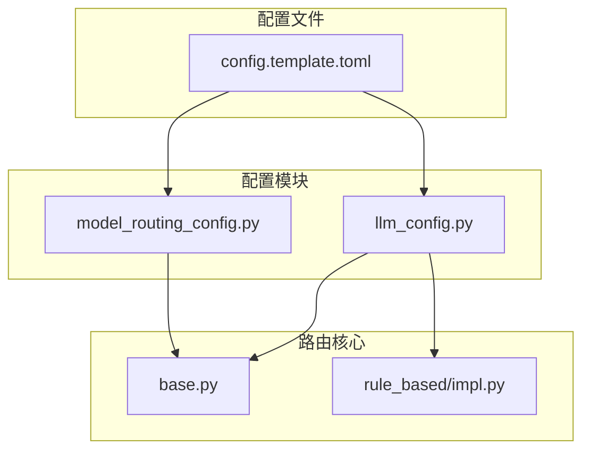
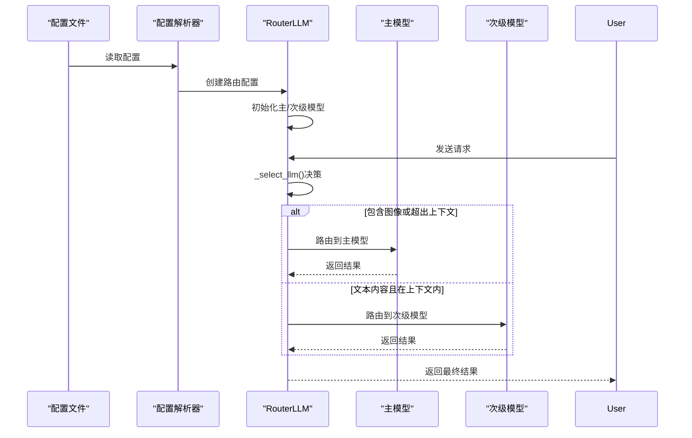
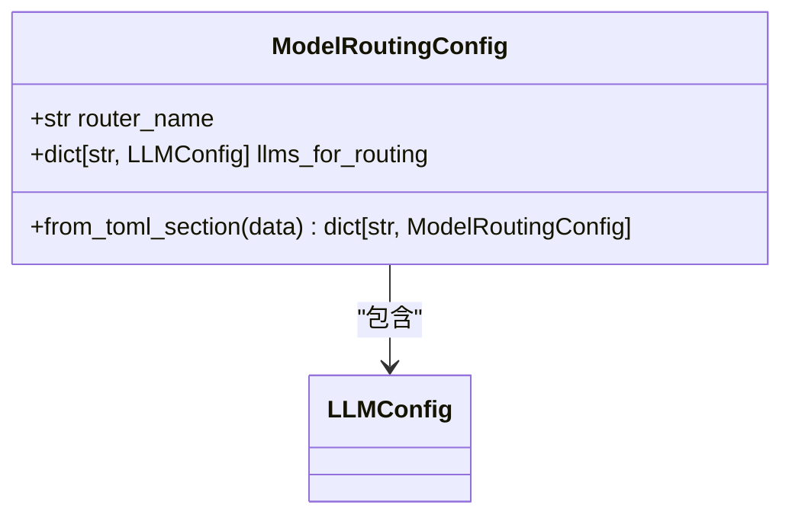
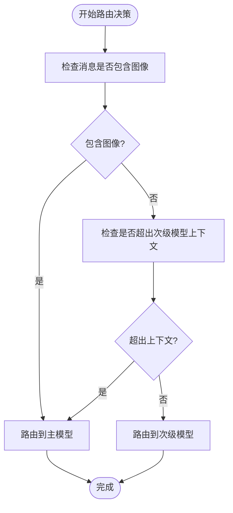
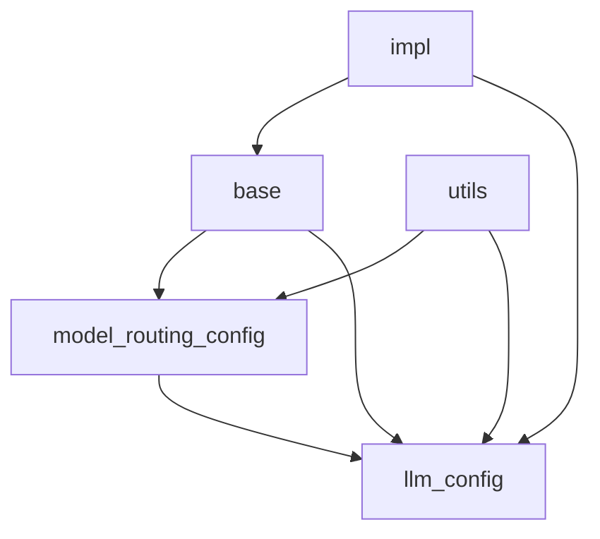

# 模型路由配置

<cite>
**本文档引用的文件**
- [model_routing_config.py](file://openhands/core/config/model_routing_config.py)
- [base.py](file://openhands/llm/router/base.py)
- [impl.py](file://openhands/llm/router/rule_based/impl.py)
- [config.template.toml](file://config.template.toml)
- [llm_config.py](file://openhands/core/config/llm_config.py)
</cite>

## 目录
1. [简介](#简介)
2. [项目结构](#项目结构)
3. [核心组件](#核心组件)
4. [架构概述](#架构概述)
5. [详细组件分析](#详细组件分析)
6. [依赖分析](#依赖分析)
7. [性能考虑](#性能考虑)
8. [故障排除指南](#故障排除指南)
9. [结论](#结论)

## 简介
模型路由配置系统是OpenHands中的一个实验性功能，旨在实现智能的多模型选择机制。该系统允许根据任务类型、成本、性能等因素在不同的LLM模型之间进行智能切换。通过规则引擎，系统能够基于输入内容的特性（如是否包含图像）和上下文长度限制，自动选择最合适的模型进行处理。这种机制既保证了在需要高级功能时使用高性能模型，又能在处理简单文本任务时利用低成本模型，从而优化整体成本效益。

## 项目结构
OpenHands的模型路由配置系统主要由以下几个核心组件构成：
- `model_routing_config.py`：定义了模型路由的配置结构
- `llm/router/` 目录：包含了路由系统的核心实现
- `config.template.toml`：提供了配置模板



**图示来源**
- [model_routing_config.py](file://openhands/core/config/model_routing_config.py#L1-L40)
- [llm_config.py](file://openhands/core/config/llm_config.py#L1-L199)
- [base.py](file://openhands/llm/router/base.py#L1-L165)
- [impl.py](file://openhands/llm/router/rule_based/impl.py#L1-L75)
- [config.template.toml](file://config.template.toml#L533-L543)

**节来源**
- [model_routing_config.py](file://openhands/core/config/model_routing_config.py#L1-L40)
- [llm_config.py](file://openhands/core/config/llm_config.py#L1-L199)

## 核心组件
模型路由系统的核心组件包括配置类`ModelRoutingConfig`、基类`RouterLLM`和具体的路由实现`MultimodalRouter`。`ModelRoutingConfig`定义了路由配置的基本结构，包括路由器名称和用于路由的LLM配置字典。`RouterLLM`作为所有路由器的基类，继承自`LLM`类，提供了多模型支持的基础框架。`MultimodalRouter`是具体的路由实现，根据输入内容是否包含图像或是否超出次级模型的上下文限制来决定使用主模型还是次级模型。

**节来源**
- [model_routing_config.py](file://openhands/core/config/model_routing_config.py#L1-L40)
- [base.py](file://openhands/llm/router/base.py#L1-L165)
- [impl.py](file://openhands/llm/router/rule_based/impl.py#L1-L75)

## 架构概述
模型路由系统的架构基于一个分层的设计模式，从配置解析到路由决策再到模型调用，形成了一个完整的处理链。系统首先从配置文件中读取路由配置，然后根据配置初始化相应的路由器实例。当收到请求时，路由器会根据预定义的规则选择最合适的模型，并将请求转发给该模型进行处理。



**图示来源**
- [base.py](file://openhands/llm/router/base.py#L88-L135)
- [impl.py](file://openhands/llm/router/rule_based/impl.py#L26-L61)

## 详细组件分析
### ModelRoutingConfig 分析
`ModelRoutingConfig`类是模型路由配置的核心数据结构，它定义了路由系统所需的基本配置参数。



**图示来源**
- [model_routing_config.py](file://openhands/core/config/model_routing_config.py#L6-L39)

#### 路由策略配置
路由策略通过`config.template.toml`文件进行配置，主要包含三个部分：主模型配置、用于路由的次级模型配置和路由启用配置。

```toml
# 主LLM（主模型）
[llm]
model = "claude-sonnet-4"
api_key = "your-api-key"

# 用于路由的次级模型
[llm.secondary_model]
model = "kimi-k2"
api_key = "your-api-key"
for_routing = true

# 启用路由
[model_routing]
router_name = "multimodal_router"
```

关键配置项说明：
- `for_routing = true`：标记该模型可用于路由
- `router_name`：指定使用的路由器类型

**节来源**
- [config.template.toml](file://config.template.toml#L533-L543)
- [llm_config.py](file://openhands/core/config/llm_config.py#L97-L98)

### MultimodalRouter 分析
`MultimodalRouter`是当前实现的具体路由策略，它根据输入内容的特性进行智能路由决策。



**图示来源**
- [impl.py](file://openhands/llm/router/rule_based/impl.py#L26-L61)

#### 路由决策逻辑
`MultimodalRouter`的路由决策逻辑主要在`_select_llm`方法中实现，遵循以下优先级顺序：
1. 如果消息包含图像，则路由到主模型
2. 如果消息超出次级模型的上下文限制，则路由到主模型
3. 否则，使用次级模型处理

这种设计确保了在需要视觉处理能力或处理长上下文时使用功能更强的主模型，而在处理普通文本任务时使用成本更低的次级模型。

**节来源**
- [impl.py](file://openhands/llm/router/rule_based/impl.py#L26-L61)

## 依赖分析
模型路由系统依赖于多个核心模块，形成了一个复杂的依赖网络。



**图示来源**
- [model_routing_config.py](file://openhands/core/config/model_routing_config.py#L3-L4)
- [base.py](file://openhands/llm/router/base.py#L5-L6)
- [impl.py](file://openhands/llm/router/rule_based/impl.py#L1-L6)

## 性能考虑
模型路由系统在设计时充分考虑了性能因素。通过将请求路由到最适合的模型，系统能够在保证功能需求的同时优化成本效益。主模型通常具有更强的功能（如视觉处理能力）但成本较高，而次级模型则成本较低但功能有限。路由系统通过智能决策，在两者之间取得平衡，避免了不必要的高成本模型调用。此外，系统还考虑了上下文长度限制，确保不会因为超出模型限制而导致请求失败。

## 故障排除指南
在使用模型路由配置时，可能会遇到以下常见问题：

1. **路由器未注册**：如果配置的`router_name`在`ROUTER_LLM_REGISTRY`中找不到，系统会抛出`ValueError`异常。
2. **次级模型配置缺失**：`MultimodalRouter`要求必须配置名为`secondary_model`的次级模型，否则会抛出`ValueError`异常。
3. **配置解析错误**：如果`config.toml`文件中的配置格式不正确，系统会记录警告信息并使用默认值。

**节来源**
- [base.py](file://openhands/llm/router/base.py#L159-L163)
- [impl.py](file://openhands/llm/router/rule_based/impl.py#L67-L70)
- [utils.py](file://openhands/core/config/utils.py#L255-L258)

## 结论
OpenHands的模型路由配置系统提供了一个灵活且可扩展的框架，用于实现基于规则的多模型智能选择。通过`ModelRoutingConfig`配置类、`RouterLLM`基类和具体的`MultimodalRouter`实现，系统能够根据任务需求在不同模型之间进行智能切换。这种设计不仅提高了系统的适应性，还优化了成本效益。未来可以通过实现更多的路由器类来扩展系统的功能，例如基于任务类型、成本预算或性能要求的路由策略。