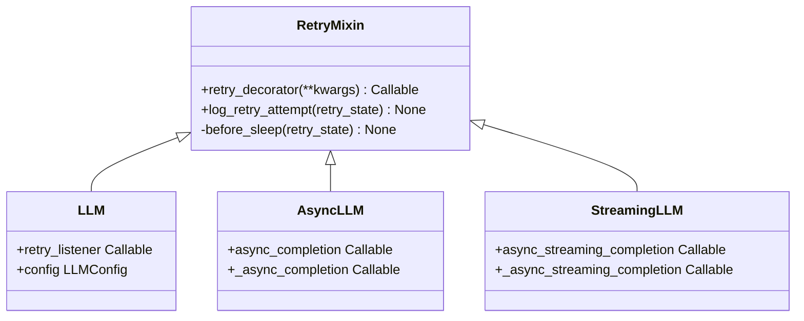
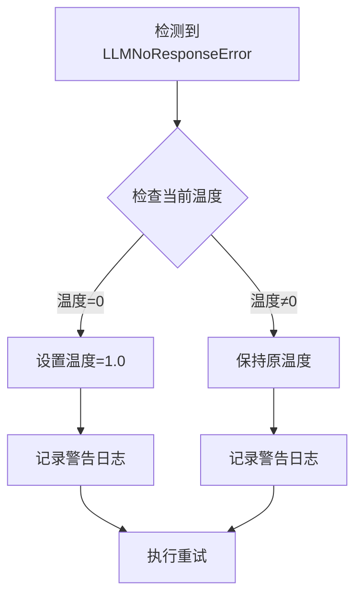
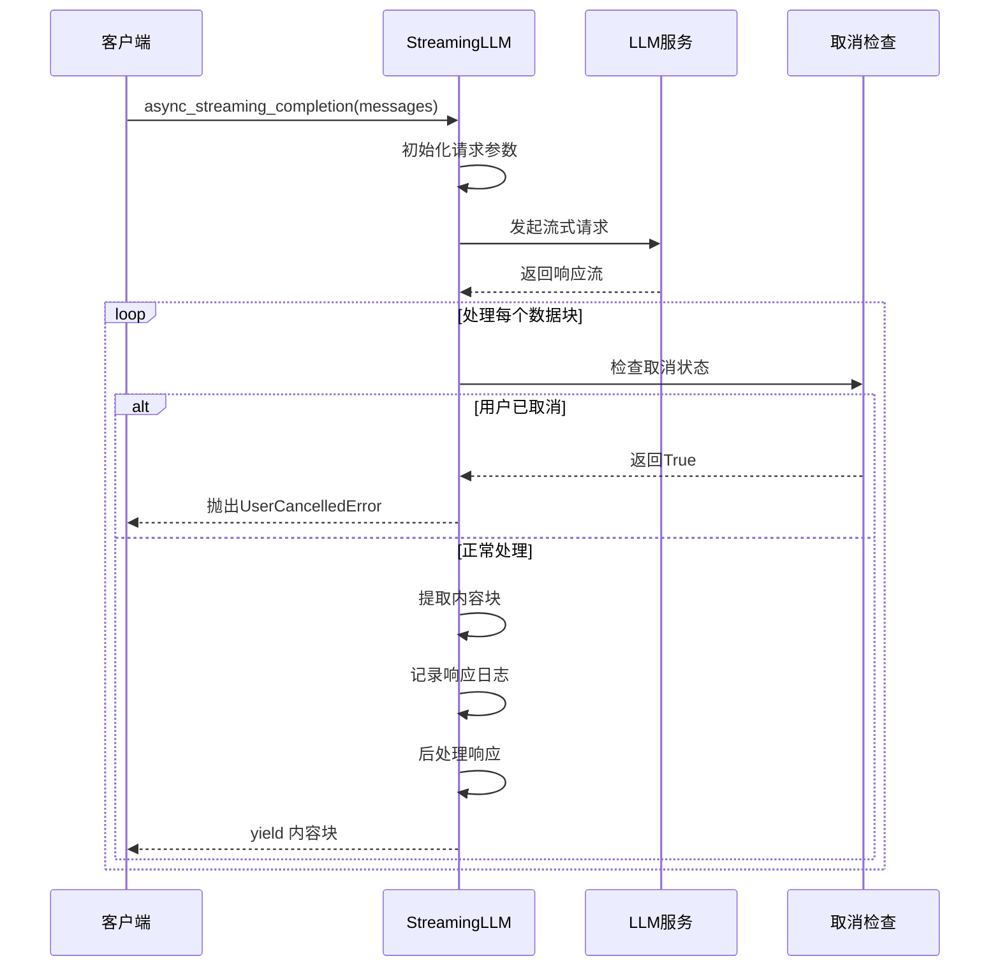
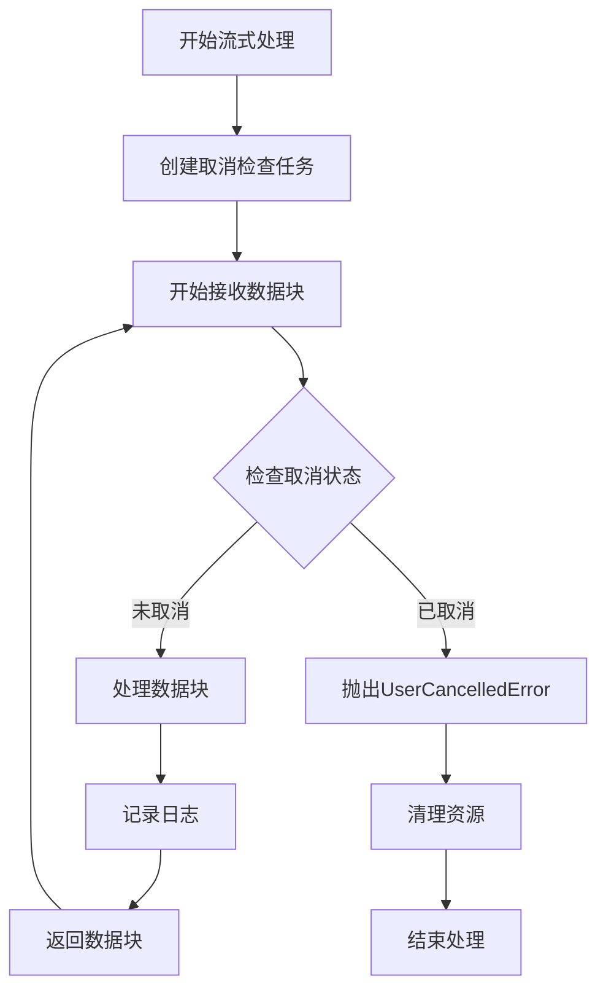
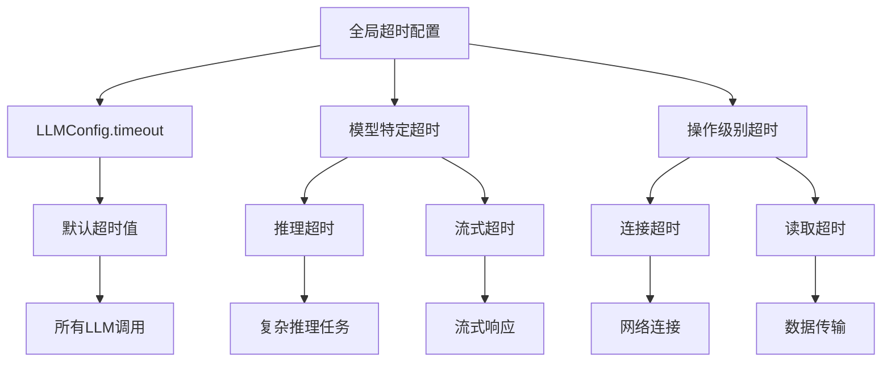
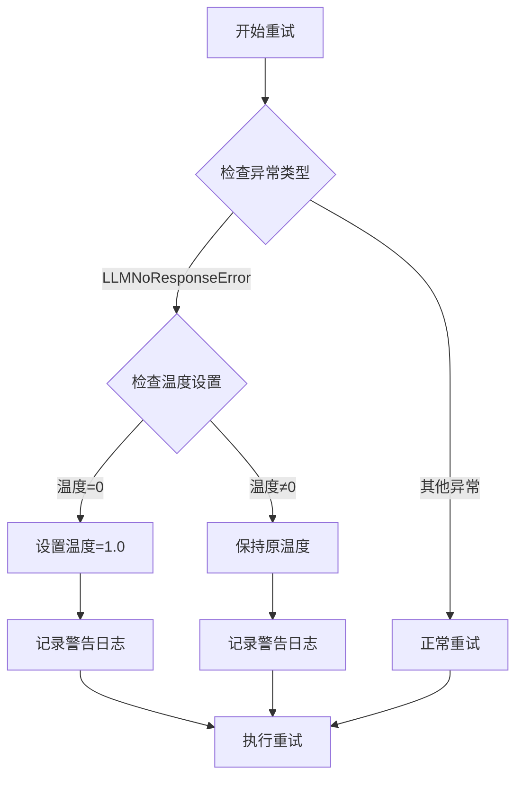

# 高级配置

<cite>
**本文档中引用的文件**
- [retry_mixin.py](file://openhands/llm/retry_mixin.py)
- [streaming_llm.py](file://openhands/llm/streaming_llm.py)
- [async_llm.py](file://openhands/llm/async_llm.py)
- [llm.py](file://openhands/llm/llm.py)
- [llm_config.py](file://openhands/core/config/llm_config.py)
- [tenacity_stop.py](file://openhands/utils/tenacity_stop.py)
- [llm_registry.py](file://openhands/llm/llm_registry.py)
</cite>

## 目录
1. [简介](#简介)
2. [重试机制详解](#重试机制详解)
3. [流式响应配置](#流式响应配置)
4. [超时配置管理](#超时配置管理)
5. [高级参数优化](#高级参数优化)
6. [性能监控与调优](#性能监控与调优)
7. [配置示例](#配置示例)
8. [故障排除指南](#故障排除指南)

## 简介

OpenHands的LLM高级配置系统提供了强大的重试机制、流式响应和超时控制功能，确保LLM调用的可靠性和用户体验的流畅性。本文档深入探讨这些高级功能的实现原理、配置方法和最佳实践。

## 重试机制详解

### RetryMixin核心架构

重试机制通过`RetryMixin`类实现，基于tenacity库构建了灵活且可配置的重试策略。



**图表来源**
- [retry_mixin.py](file://openhands/llm/retry_mixin.py#L15-L101)
- [llm.py](file://openhands/llm/llm.py#L54-L87)
- [async_llm.py](file://openhands/llm/async_llm.py#L17-L134)
- [streaming_llm.py](file://openhands/llm/streaming_llm.py#L11-L117)

### 重试参数配置

| 参数名称 | 类型 | 默认值 | 描述 |
|---------|------|--------|------|
| `num_retries` | int | 5 | 最大重试次数 |
| `retry_exceptions` | tuple | LLM_RETRY_EXCEPTIONS | 触发重试的异常类型 |
| `retry_min_wait` | int | 8 | 最小等待时间（秒） |
| `retry_max_wait` | int | 64 | 最大等待时间（秒） |
| `retry_multiplier` | float | 8 | 指数退避乘数 |
| `retry_listener` | Callable | None | 重试事件监听器 |

### 退避策略算法

系统采用指数退避策略，计算公式为：
```
等待时间 = retry_min_wait × (retry_multiplier ^ 当前尝试次数)
```

最大等待时间为`retry_max_wait`，防止无限延长等待时间。

### 特殊异常处理

#### LLMNoResponseError自动调节

当检测到`LLMNoResponseError`且温度为0时，系统会自动将温度调整为1.0进行重试：



**图表来源**
- [retry_mixin.py](file://openhands/llm/retry_mixin.py#L40-L54)

**节来源**
- [retry_mixin.py](file://openhands/llm/retry_mixin.py#L15-L101)

## 流式响应配置

### StreamingLLM架构设计

流式响应通过`StreamingLLM`类实现，支持实时数据传输和用户取消操作。



**图表来源**
- [streaming_llm.py](file://openhands/llm/streaming_llm.py#L36-L111)

### 流式配置参数

| 参数名称 | 类型 | 默认值 | 描述 |
|---------|------|--------|------|
| `stream` | bool | True | 启用流式响应 |
| `timeout` | int | None | 请求超时时间 |
| `on_cancel_requested_fn` | Callable | None | 取消检查函数 |

### 取消机制实现

流式响应支持实时取消操作，通过异步任务定期检查取消状态：



**图表来源**
- [streaming_llm.py](file://openhands/llm/streaming_llm.py#L80-L95)

**节来源**
- [streaming_llm.py](file://openhands/llm/streaming_llm.py#L11-L117)

## 超时配置管理

### 超时层级结构

OpenHands的超时配置采用分层设计，支持全局和特定场景的超时控制：



### 超时影响因素

| 影响因素 | 默认值 | 配置方式 | 性能影响 |
|---------|--------|----------|----------|
| 基础超时 | None | LLMConfig.timeout | 直接影响响应时间 |
| 连接超时 | 30秒 | HTTP客户端配置 | 网络稳定性 |
| 读取超时 | 60秒 | HTTP客户端配置 | 数据传输效率 |
| 流式超时 | 300秒 | 流式处理器配置 | 实时性保证 |

**节来源**
- [llm_config.py](file://openhands/core/config/llm_config.py#L67-L67)

## 高级参数优化

### 温度调节策略

系统在重试过程中智能调节温度参数：



**图表来源**
- [retry_mixin.py](file://openhands/llm/retry_mixin.py#L40-L54)

### 推理努力配置

对于支持推理优化的模型，系统提供推理努力级别配置：

| 推理努力级别 | 适用模型 | 性能特点 | 使用场景 |
|-------------|----------|----------|----------|
| `none` | 所有模型 | 标准推理 | 快速响应 |
| `low` | Gemini 2.5+ | 优化思考预算 | 平衡性能 |
| `medium` | 支持推理模型 | 中等思考深度 | 一般任务 |
| `high` | 高级推理模型 | 深度思考分析 | 复杂问题 |

**节来源**
- [llm.py](file://openhands/llm/llm.py#L135-L163)

## 性能监控与调优

### 关键性能指标

系统提供全面的性能监控指标：

| 指标类别 | 具体指标 | 监控方法 | 优化建议 |
|---------|----------|----------|----------|
| 响应时间 | 延迟分布 | Metrics.add_response_latency() | 调整超时阈值 |
| 成本控制 | Token使用量 | Metrics.add_token_usage() | 优化提示长度 |
| 错误率 | 重试成功率 | 日志统计 | 调整重试参数 |
| 资源使用 | 并发限制 | 系统监控 | 负载均衡 |

### 调优建议

#### 重试策略优化

1. **高可用环境**：增加重试次数，降低最小等待时间
2. **成本敏感环境**：减少重试次数，增加等待时间
3. **实时性要求高**：使用较短的等待时间和较少的重试

#### 流式响应优化

1. **网络不稳定**：启用流式响应，提供更好的用户体验
2. **长文本生成**：使用流式响应，避免长时间等待
3. **交互式应用**：结合取消机制，提供更好的控制

**节来源**
- [llm.py](file://openhands/llm/llm.py#L597-L680)

## 配置示例

### 基础重试配置

```toml
[llm]
model = "claude-3-5-sonnet"
api_key = "your-api-key"
num_retries = 5
retry_min_wait = 8
retry_max_wait = 64
retry_multiplier = 2
timeout = 30
```

### 高可用重试配置

```toml
[llm.high_availability]
model = "claude-3-5-sonnet"
num_retries = 10
retry_min_wait = 5
retry_max_wait = 30
retry_multiplier = 1.5
timeout = 60
```

### 流式响应配置

```toml
[llm.streaming]
model = "gpt-4o"
stream = true
timeout = 300
max_output_tokens = 4096
temperature = 0.7
```

### 成本优化配置

```toml
[llm.cost_optimized]
model = "gpt-3.5-turbo"
num_retries = 3
retry_min_wait = 15
retry_max_wait = 45
timeout = 45
temperature = 0.0
```

**节来源**
- [llm_config.py](file://openhands/core/config/llm_config.py#L107-L199)

## 故障排除指南

### 常见问题诊断

#### 重试失败问题

1. **症状**：达到最大重试次数后仍失败
2. **原因**：异常类型不在重试列表中或配置错误
3. **解决方案**：检查`LLM_RETRY_EXCEPTIONS`配置和异常类型

#### 流式响应中断

1. **症状**：流式响应意外终止
2. **原因**：网络中断或超时设置过短
3. **解决方案**：增加超时时间，检查网络连接

#### 性能问题

1. **症状**：响应时间过长
2. **原因**：重试等待时间过长或并发过多
3. **解决方案**：调整重试参数，并发控制

### 调试技巧

1. **启用详细日志**：设置日志级别为DEBUG
2. **监控重试事件**：使用`retry_listener`跟踪重试过程
3. **性能分析**：使用内置Metrics收集性能数据

**节来源**
- [retry_mixin.py](file://openhands/llm/retry_mixin.py#L71-L101)
- [streaming_llm.py](file://openhands/llm/streaming_llm.py#L80-L111)