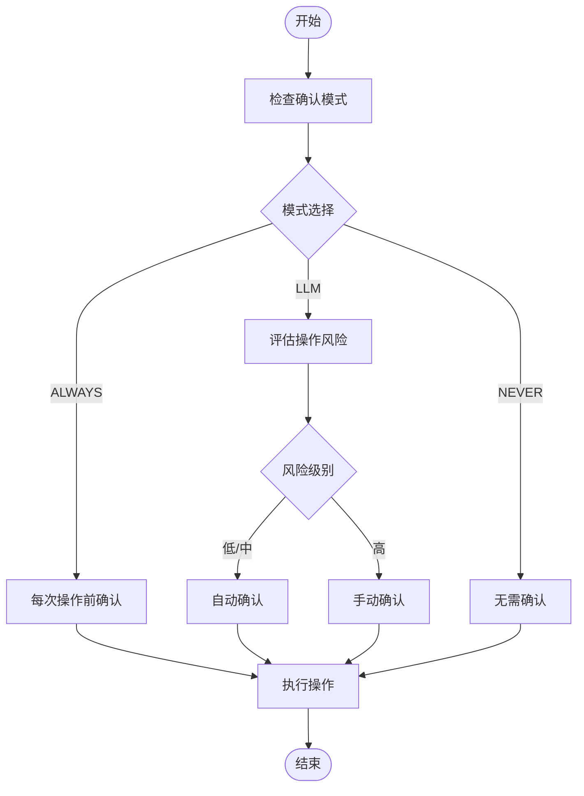
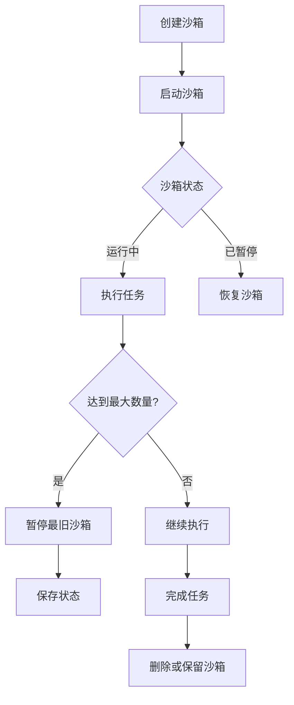

# 代理行为配置

<cite>
**本文档引用的文件**
- [agent_config.py](file://openhands/core/config/agent_config.py)
- [condenser_config.py](file://openhands/core/config/condenser_config.py)
- [agent_action.py](file://openhands-cli/openhands_cli/user_actions/agent_action.py)
- [types.py](file://openhands-cli/openhands_cli/user_actions/types.py)
- [runner.py](file://openhands-cli/openhands_cli/runner.py)
- [sandbox_service.py](file://openhands/app_server/sandbox/sandbox_service.py)
- [remote_sandbox_service.py](file://openhands/app_server/sandbox/remote_sandbox_service.py)
</cite>

## 目录
1. [简介](#简介)
2. [代理核心行为参数](#代理核心行为参数)
3. [默认代理类型配置](#默认代理类型配置)
4. [确认模式配置](#确认模式配置)
5. [会话持久化配置](#会话持久化配置)
6. [代理行为特征](#代理行为特征)
7. [配置示例](#配置示例)

## 简介
本文档详细介绍了OpenHands项目中代理行为的配置方法，重点说明了agent_config.py文件中定义的核心行为参数。文档涵盖了默认代理类型（如CodeActAgent、BrowsingAgent）的配置方法、确认模式的三种状态及其安全考量、会话持久化配置对沙箱环境的影响，以及代理在执行命令、文件操作和代码编辑时的行为特征。

## 代理核心行为参数

`AgentConfig`类定义了代理的核心行为参数，这些参数控制着代理在执行任务时的各种功能和行为。主要参数包括：

- **cli_mode**: 指示代理是否在CLI模式下运行
- **llm_config**: 指定使用的LLM配置名称
- **classpath**: 自定义代理的类路径
- **system_prompt_filename**: 系统提示模板文件名
- **enable_browsing**: 是否启用浏览工具
- **enable_llm_editor**: 是否启用LLM编辑器工具
- **enable_editor**: 是否启用标准编辑器工具
- **enable_jupyter**: 是否启用Jupyter工具
- **enable_cmd**: 是否启用bash工具
- **enable_think**: 是否启用思考工具
- **enable_finish**: 是否启用完成工具
- **enable_condensation_request**: 是否启用压缩请求工具
- **enable_prompt_extensions**: 是否启用提示扩展
- **enable_mcp**: 是否启用MCP工具
- **disabled_microagents**: 禁用的微代理列表
- **enable_history_truncation**: 是否启用历史截断
- **enable_som_visual_browsing**: 是否启用SoM视觉浏览
- **enable_plan_mode**: 是否启用计划模式

**Section sources**
- [agent_config.py](file://openhands/core/config/agent_config.py#L15-L67)

## 默认代理类型配置

OpenHands支持多种默认代理类型，每种类型都有其特定的配置和用途。主要代理类型包括：

### CodeActAgent
CodeActAgent是代码执行代理，专注于代码相关的任务。通过`agent_config.py`中的配置，可以控制其行为特征：

- 启用或禁用各种工具（如命令行、编辑器、Jupyter等）
- 配置系统提示模板
- 控制历史记录的处理方式

### BrowsingAgent
BrowsingAgent是浏览代理，专门处理网页浏览任务。其配置特点包括：

- 启用浏览工具
- 配置视觉浏览功能
- 处理网页交互

### VisualBrowsingAgent
VisualBrowsingAgent是视觉浏览代理，提供完整的网页浏览功能。其配置包括：

- 启用SoM（标记集）视觉浏览
- 处理复杂的网页结构
- 支持截图和可访问性树

**Section sources**
- [agent_config.py](file://openhands/core/config/agent_config.py#L15-L67)
- [browsing_agent/__init__.py](file://openhands/agenthub/browsing_agent/__init__.py#L1-L4)
- [codeact_agent/__init__.py](file://openhands/agenthub/codeact_agent/__init__.py#L1-L4)
- [visualbrowsing_agent/__init__.py](file://openhands/agenthub/visualbrowsing_agent/__init__.py#L1-L6)

## 确认模式配置

确认模式是代理安全执行的关键机制，提供了三种不同的确认策略：

### ALWAYS模式
在ALWAYS模式下，代理在执行任何操作前都需要用户确认。这种模式提供了最高的安全性，但会显著降低执行效率。

### LLM模式
在LLM模式下，系统会根据操作的风险级别决定是否需要确认。低风险和中等风险的操作会自动确认，而高风险操作需要用户确认。这种模式在安全性和效率之间提供了平衡。

### NEVER模式
在NEVER模式下，代理会自动执行所有操作，无需用户确认。这种模式效率最高，但安全风险也最大。



**Diagram sources**
- [agent_action.py](file://openhands-cli/openhands_cli/user_actions/agent_action.py#L44-L80)
- [types.py](file://openhands-cli/openhands_cli/user_actions/types.py#L9-L12)
- [runner.py](file://openhands-cli/openhands_cli/runner.py#L159-L188)

**Section sources**
- [agent_action.py](file://openhands-cli/openhands_cli/user_actions/agent_action.py#L44-L80)
- [types.py](file://openhands-cli/openhands_cli/user_actions/types.py#L1-L18)
- [runner.py](file://openhands-cli/openhands_cli/runner.py#L159-L188)

## 会话持久化配置

会话持久化配置影响沙箱环境的生命周期管理，主要通过以下机制实现：

### 沙箱生命周期管理
沙箱环境的生命周期由`SandboxService`管理，包括创建、启动、暂停和删除等操作。系统会自动管理运行中的沙箱数量，当达到最大限制时，会暂停最旧的沙箱。

### 持久化策略
持久化策略决定了沙箱环境在会话间的保留方式：

- **临时沙箱**: 每次会话创建新的沙箱环境
- **持久化沙箱**: 在会话间保留沙箱环境，保持状态



**Diagram sources**
- [sandbox_service.py](file://openhands/app_server/sandbox/sandbox_service.py#L80-L125)
- [remote_sandbox_service.py](file://openhands/app_server/sandbox/remote_sandbox_service.py#L294-L324)

**Section sources**
- [sandbox_service.py](file://openhands/app_server/sandbox/sandbox_service.py#L80-L125)
- [remote_sandbox_service.py](file://openhands/app_server/sandbox/remote_sandbox_service.py#L294-L324)

## 代理行为特征

代理在执行不同操作时表现出特定的行为特征：

### 命令执行
代理通过`enable_cmd`参数控制命令执行能力。当启用时，代理可以执行bash命令，但需要根据确认模式进行安全检查。

### 文件操作
文件操作包括读取和写入文件，由`enable_editor`和`enable_llm_editor`参数控制。代理会根据系统配置决定使用哪种编辑器工具。

### 代码编辑
代码编辑功能允许代理修改代码文件。系统提供了多种编辑方式，包括标准编辑器和LLM驱动的智能编辑器。

### 浏览行为
浏览行为由`enable_browsing`和`enable_som_visual_browsing`参数控制。代理可以执行网页浏览任务，包括打开URL和与网页元素交互。

**Section sources**
- [agent_config.py](file://openhands/core/config/agent_config.py#L24-L35)
- [action-type.tsx](file://frontend/src/types/action-type.tsx#L17-L27)
- [actions.ts](file://frontend/src/types/core/actions.ts#L112-L119)

## 配置示例

以下是一些针对不同开发场景的代理行为策略配置示例：

### 生产环境变更
```toml
[agent]
# 生产环境需要最高安全级别
confirmation_mode = "LLM"
# 只允许必要的工具
enable_cmd = true
enable_editor = true
enable_browsing = false
enable_jupyter = false
# 启用计划模式以确保任务完整性
enable_plan_mode = true
```

### 实验性开发
```toml
[agent]
# 实验性开发需要更高的灵活性
confirmation_mode = "NEVER"
# 启用所有工具以支持各种实验
enable_cmd = true
enable_editor = true
enable_browsing = true
enable_jupyter = true
enable_llm_editor = true
# 启用历史截断以处理长会话
enable_history_truncation = true
```

### 代码审查
```toml
[agent]
# 代码审查需要详细的思考过程
confirmation_mode = "ALWAYS"
# 启用思考工具以提供详细解释
enable_think = true
# 启用完成工具以确保任务完整性
enable_finish = true
# 禁用可能修改代码的工具
enable_editor = false
enable_cmd = false
```

**Section sources**
- [agent_config.py](file://openhands/core/config/agent_config.py#L15-L67)
- [condenser_config.py](file://openhands/core/config/condenser_config.py#L11-L313)