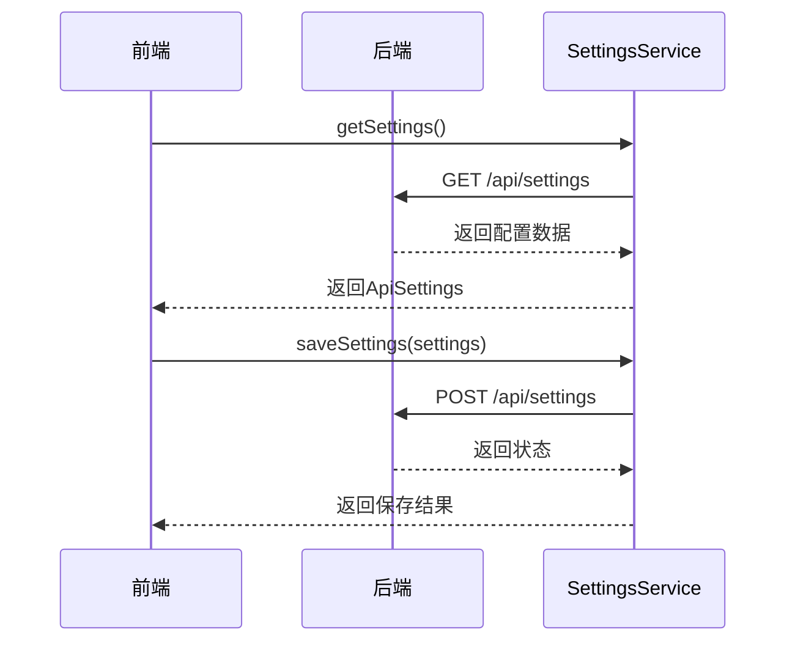

# 代理配置

<cite>
**本文档中引用的文件**  
- [agent_config.py](file://openhands/core/config/agent_config.py)
- [condenser_config.py](file://openhands/core/config/condenser_config.py)
- [settings-service.api.ts](file://frontend/src/settings-service/settings-service.api.ts)
- [settings.types.ts](file://frontend/src/settings-service/settings.types.ts)
- [settings.py](file://openhands/server/routes/settings.py)
- [config.template.toml](file://config.template.toml)
</cite>

## 目录
1. [简介](#简介)
2. [代理配置核心组件](#代理配置核心组件)
3. [记忆压缩器配置](#记忆压缩器配置)
4. [配置传递与运行时应用](#配置传递与运行时应用)
5. [使用场景与配置优化](#使用场景与配置优化)
6. [代理行为调优与资源管理](#代理行为调优与资源管理)
7. [故障恢复机制](#故障恢复机制)
8. [结论](#结论)

## 简介
本文档系统性地介绍OpenHands AI代理的各项配置选项，深入分析代理配置类和记忆压缩器的配置方法，以及这些配置如何通过settings-service API从前端传递到后端并在运行时动态应用。

## 代理配置核心组件

OpenHands AI代理的配置主要通过`agent_config.py`文件中的`AgentConfig`类来定义。该类包含了代理的各种配置选项，如默认代理类型、安全分析器设置、确认模式、会话持久化等核心功能的配置方法。

**Section sources**
- [agent_config.py](file://openhands/core/config/agent_config.py)

## 记忆压缩器配置

记忆压缩器的配置在`condenser_config.py`文件中定义，包括压缩策略、窗口大小、摘要生成等参数对代理记忆管理的影响。这些配置选项允许用户根据具体需求调整代理的记忆管理策略。

```mermaid
classDiagram
class NoOpCondenserConfig {
+type : Literal['noop']
}
class ObservationMaskingCondenserConfig {
+type : Literal['observation_masking']
+attention_window : int
}
class RecentEventsCondenserConfig {
+type : Literal['recent']
+keep_first : int
+max_events : int
}
class LLMSummarizingCondenserConfig {
+type : Literal['llm']
+llm_config : LLMConfig
+keep_first : int
+max_size : int
+max_event_length : int
}
class AmortizedForgettingCondenserConfig {
+type : Literal['amortized']
+max_size : int
+keep_first : int
}
class LLMAttentionCondenserConfig {
+type : Literal['llm_attention']
+llm_config : LLMConfig
+max_size : int
+keep_first : int
}
class StructuredSummaryCondenserConfig {
+type : Literal['structured']
+llm_config : LLMConfig
+keep_first : int
+max_size : int
+max_event_length : int
}
class CondenserPipelineConfig {
+type : Literal['pipeline']
+condensers : list[CondenserConfig]
}
class ConversationWindowCondenserConfig {
+type : Literal['conversation_window']
}
NoOpCondenserConfig <|-- ObservationMaskingCondenserConfig
NoOpCondenserConfig <|-- RecentEventsCondenserConfig
NoOpCondenserConfig <|-- LLMSummarizingCondenserConfig
NoOpCondenserConfig <|-- AmortizedForgettingCondenserConfig
NoOpCondenserConfig <|-- LLMAttentionCondenserConfig
NoOpCondenserConfig <|-- StructuredSummaryCondenserConfig
NoOpCondenserConfig <|-- CondenserPipelineConfig
NoOpCondenserConfig <|-- ConversationWindowCondenserConfig
```

**Diagram sources**
- [condenser_config.py](file://openhands/core/config/condenser_config.py)

**Section sources**
- [condenser_config.py](file://openhands/core/config/condenser_config.py)

## 配置传递与运行时应用

代理配置通过settings-service API从前端传递到后端，并在运行时动态应用。前端通过`settings-service.api.ts`文件中的`SettingsService`类与后端进行通信，实现配置的获取和保存。

**Diagram sources**
- [settings-service.api.ts](file://frontend/src/settings-service/settings-service.api.ts)
- [settings.py](file://openhands/server/routes/settings.py)

**Section sources**
- [settings-service.api.ts](file://frontend/src/settings-service/settings-service.api.ts)
- [settings.types.ts](file://frontend/src/settings-service/settings.types.ts)
- [settings.py](file://openhands/server/routes/settings.py)

## 使用场景与配置优化

根据不同使用场景（如代码审查、bug修复、功能开发）调整代理配置以优化性能。例如，在代码审查场景中，可以启用更严格的安全分析器和确认模式，以确保代码质量。

**Section sources**
- [config.template.toml](file://config.template.toml)

## 代理行为调优与资源管理

代理行为调优和资源管理策略的配置选项包括最大预算每任务、最大迭代次数、运行时环境等。这些配置选项帮助用户根据具体需求调整代理的行为和资源使用。

**Section sources**
- [config.template.toml](file://config.template.toml)

## 故障恢复机制

故障恢复机制的配置选项包括会话持久化、最大会话年龄等。这些配置选项确保在发生故障时，代理能够快速恢复并继续执行任务。

**Section sources**
- [config.template.toml](file://config.template.toml)

## 结论
本文档详细介绍了OpenHands AI代理的各项配置选项，包括代理配置核心组件、记忆压缩器配置、配置传递与运行时应用、使用场景与配置优化、代理行为调优与资源管理以及故障恢复机制。通过合理配置这些选项，用户可以根据具体需求优化代理的性能和行为。