# 安全配置

<cite>
**本文档引用的文件**
- [openhands/security/analyzer.py](file://openhands/security/analyzer.py)
- [openhands/security/options.py](file://openhands/security/options.py)
- [openhands/security/grayswan/analyzer.py](file://openhands/security/grayswan/analyzer.py)
- [openhands/security/invariant/analyzer.py](file://openhands/security/invariant/analyzer.py)
- [openhands/security/llm/analyzer.py](file://openhands/security/llm/analyzer.py)
- [openhands/security/README.md](file://openhands/security/README.md)
- [config.template.toml](file://config.template.toml)
- [openhands/core/config/security_config.py](file://openhands/core/config/security_config.py)
- [openhands/controller/agent_controller.py](file://openhands/controller/agent_controller.py)
- [openhands-cli/openhands_cli/user_actions/agent_action.py](file://openhands-cli/openhands_cli/user_actions/agent_action.py)
- [openhands-cli/openhands_cli/runner.py](file://openhands-cli/openhands_cli/runner.py)
- [openhands/server/middleware.py](file://openhands/server/middleware.py)
- [microagents/security.md](file://microagents/security.md)
</cite>

## 目录
1. [简介](#简介)
2. [安全分析器架构](#安全分析器架构)
3. [安全分析器类型](#安全分析器类型)
4. [确认模式配置](#确认模式配置)
5. [安全配置选项](#安全配置选项)
6. [环境变量配置](#环境变量配置)
7. [安全策略集成](#安全策略集成)
8. [安全事件日志记录](#安全事件日志记录)
9. [最佳实践](#最佳实践)
10. [故障排除](#故障排除)

## 简介

OpenHands 的安全配置系统提供了多层次的安全防护机制，通过安全分析器（Security Analyzer）框架对代理行为进行实时监控和风险评估。该系统支持多种安全分析器，包括基于 LLM 的风险评估、Invariant 分析器和 GraySwan AI 集成，为生产环境部署提供了灵活且强大的安全保障。

安全配置的核心目标是：
- 在执行潜在危险操作前进行风险评估
- 提供多层次的安全防护机制
- 支持与第三方安全工具的集成
- 实现全面的安全事件日志记录和审计跟踪
- 满足企业级合规性要求

## 安全分析器架构

### 基础架构设计

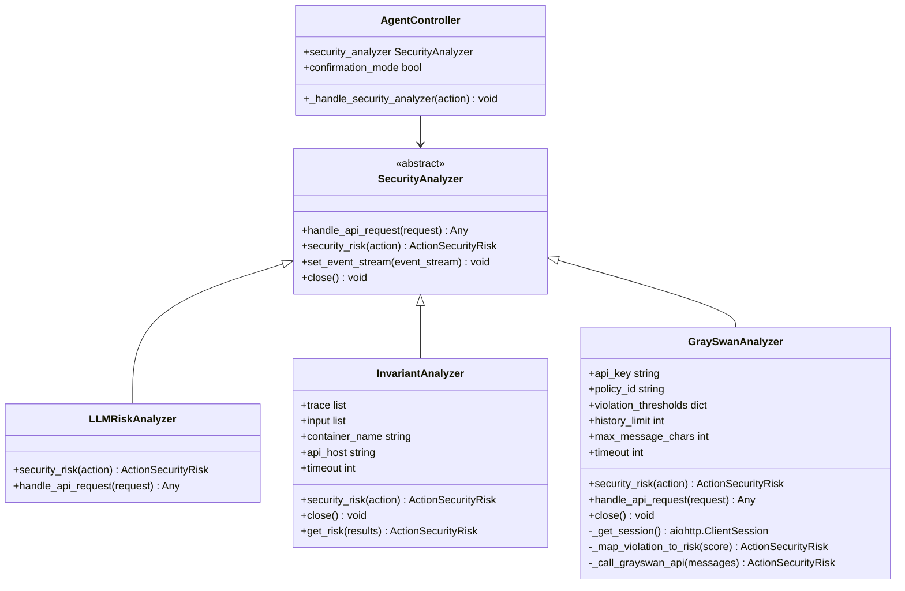

**图表来源**
- [openhands/security/analyzer.py](file://openhands/security/analyzer.py#L8-L38)
- [openhands/security/llm/analyzer.py](file://openhands/security/llm/analyzer.py#L12-L43)
- [openhands/security/invariant/analyzer.py](file://openhands/security/invariant/analyzer.py#L15-L126)
- [openhands/security/grayswan/analyzer.py](file://openhands/security/grayswan/analyzer.py#L18-L205)
- [openhands/controller/agent_controller.py](file://openhands/controller/agent_controller.py#L194-L243)

### 安全分析器交互流程

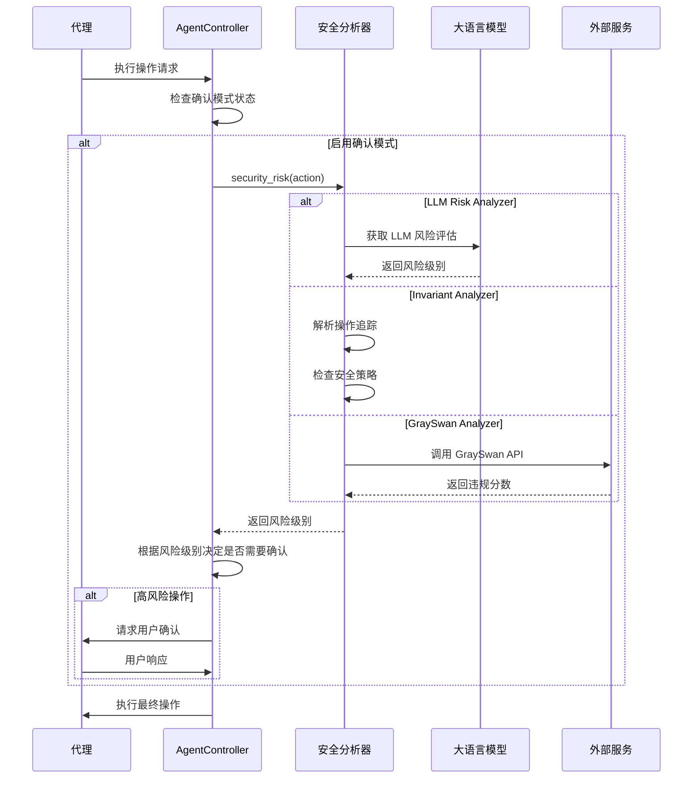

**图表来源**
- [openhands/controller/agent_controller.py](file://openhands/controller/agent_controller.py#L211-L243)
- [openhands/security/grayswan/analyzer.py](file://openhands/security/grayswan/analyzer.py#L165-L200)

**章节来源**
- [openhands/security/analyzer.py](file://openhands/security/analyzer.py#L1-L38)
- [openhands/controller/agent_controller.py](file://openhands/controller/agent_controller.py#L194-L243)

## 安全分析器类型

### LLM 风险分析器

LLM 风险分析器是默认的安全分析器，利用大语言模型提供的风险评估能力。它检查操作是否包含 `security_risk` 属性，并将其映射到相应的风险级别。

#### 主要特性
- 使用 LLM 提供的风险评估（LOW、MEDIUM、HIGH）
- 自动对 HIGH 风险操作要求确认
- 尊重确认模式设置处理 MEDIUM 和 LOW 风险
- 轻量级高效，无外部依赖
- 与代理决策过程无缝集成

#### 配置示例
```toml
[security]
security_analyzer = "llm"
```

**章节来源**
- [openhands/security/llm/analyzer.py](file://openhands/security/llm/analyzer.py#L1-L43)
- [openhands/security/README.md](file://openhands/security/README.md#L56-L69)

### Invariant 分析器

Invariant 分析器使用 Invariant Labs 的安全分析技术，通过容器化运行时检测潜在的安全问题。

#### 核心功能
- 检测：
  - 代理可能泄露的敏感信息
  - Python 代码中的安全问题
  - 危险的 Bash 命令
  - 危害性的用户任务（浏览代理设置）
  - 有害内容生成（浏览代理设置）

#### 运行时设置
- 可配置的 Invariant 策略
- 可接受的风险阈值
- （可选）check_browsing_alignment 标志
- （可选）guardrail_llm 评估代理行为安全性

#### 浏览代理安全特性
- 使用底层 LLM 检查用户请求是否有害
- 检查代理在文本框中输入的内容是否有害
- 如果评估为有害，发出 change_agent_state 操作并转换 AgentState 到 ERROR

#### 配置示例
```toml
[security]
security_analyzer = "invariant"
```

**章节来源**
- [openhands/security/invariant/analyzer.py](file://openhands/security/invariant/analyzer.py#L1-L126)
- [openhands/security/README.md](file://openhands/security/README.md#L70-L102)

### GraySwan 分析器

GraySwan 分析器集成了 Gray Swan AI 的 Cygnal API，提供高级的人工智能安全监控。

#### 快速开始
1. 导航到 Gray Swan 平台创建账户
2. 创建 GraySwan API 密钥
3. 配置环境变量：
   ```bash
   export GRAYSWAN_API_KEY="your_api_key_here"
   export GRAYSWAN_POLICY_ID="your_policy_id_optional"
   ```

#### 配置参数
- `history_limit`: 包含上下文的最近事件数量（默认：20）
- `max_message_chars`: 对话处理的最大字符数（默认：30000）
- `timeout`: 请求超时时间（默认：30秒）
- `low_threshold`: LOW 分类的风险阈值（默认：0.3）
- `medium_threshold`: MEDIUM 分类的风险阈值（默认：0.7）
- `high_threshold`: HIGH 分类的风险阈值（默认：1.0）

#### 配置示例
```toml
[security]
security_analyzer = "grayswan"
```

#### 风险阈值映射
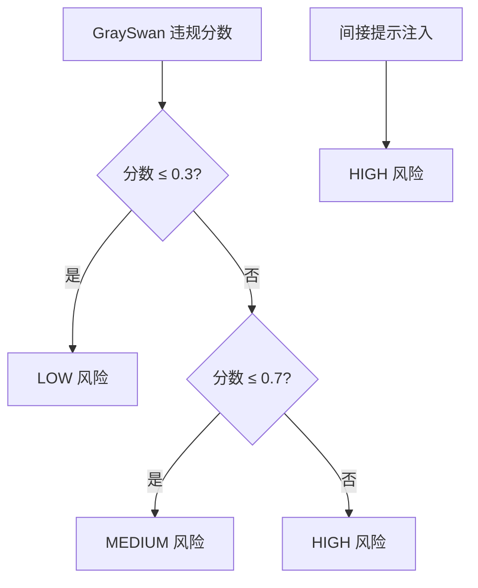

**图表来源**
- [openhands/security/grayswan/analyzer.py](file://openhands/security/grayswan/analyzer.py#L109-L117)

**章节来源**
- [openhands/security/grayswan/analyzer.py](file://openhands/security/grayswan/analyzer.py#L1-L205)
- [openhands/security/README.md](file://openhands/security/README.md#L103-L129)

## 确认模式配置

确认模式是安全配置的核心组件，提供基于风险级别的操作确认机制。

### 确认模式类型

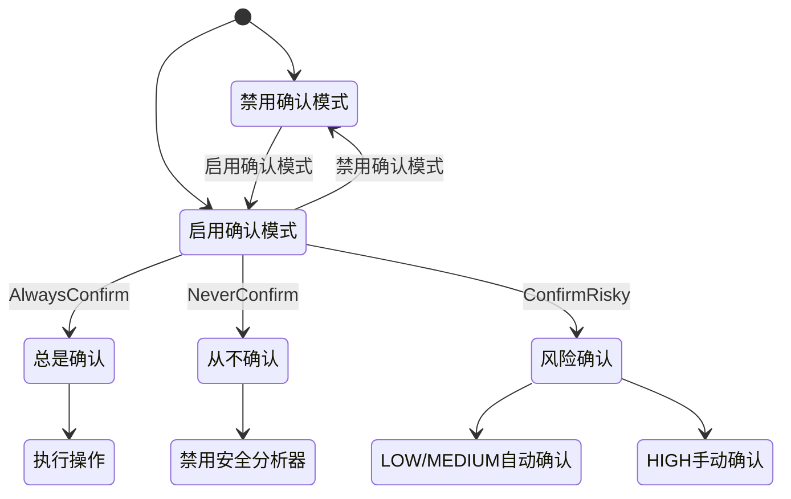

### 确认策略配置

#### 基本确认模式
```toml
[security]
confirmation_mode = true
```

#### 风险级别确认策略
用户可以选择不同的确认策略：

1. **总是确认**：所有操作都需要人工确认
2. **从不确认**：禁用确认模式，自动执行所有操作
3. **自动确认安全**：LOW/MEDIUM 风险自动确认，HIGH 风险需要确认
4. **自定义风险阈值**：根据具体风险级别设置确认策略

### 确认流程

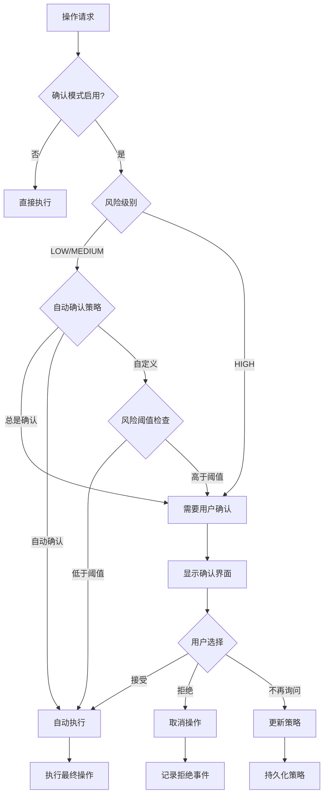

**图表来源**
- [openhands-cli/openhands_cli/user_actions/agent_action.py](file://openhands-cli/openhands_cli/user_actions/agent_action.py#L44-L80)
- [openhands-cli/openhands_cli/runner.py](file://openhands-cli/openhands_cli/runner.py#L159-L188)

**章节来源**
- [openhands-cli/openhands_cli/user_actions/agent_action.py](file://openhands-cli/openhands_cli/user_actions/agent_action.py#L44-L80)
- [openhands-cli/openhands_cli/runner.py](file://openhands-cli/openhands_cli/runner.py#L159-L188)

## 安全配置选项

### 核心安全配置

| 配置项 | 类型 | 默认值 | 描述 |
|--------|------|--------|------|
| `confirmation_mode` | bool | false | 是否启用确认模式 |
| `security_analyzer` | string | null | 使用的安全分析器类型 |
| `enable_security_analyzer` | bool | true | 是否启用安全分析器 |

### 配置方式

#### 1. 配置文件方式
```toml
[security]
confirmation_mode = true
security_analyzer = "invariant"
enable_security_analyzer = true
```

#### 2. 环境变量方式
```bash
OPENHANDS_SECURITY_CONFIRMATION_MODE=true
OPENHANDS_SECURITY_SECURITY_ANALYZER=invariant
```

#### 3. 运行时配置
通过前端界面或 API 动态配置安全设置。

### 安全配置验证

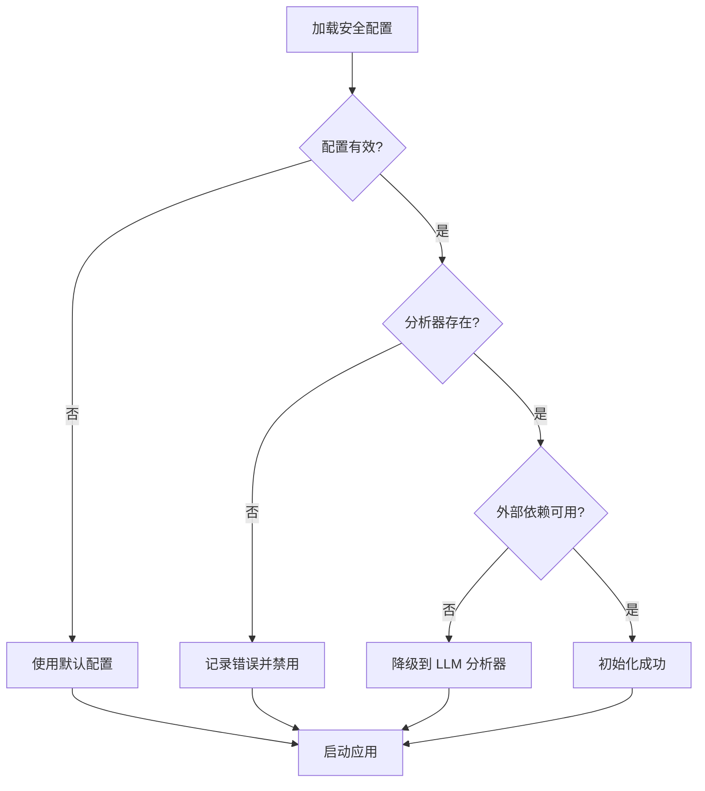

**章节来源**
- [openhands/core/config/security_config.py](file://openhands/core/config/security_config.py#L1-L35)
- [config.template.toml](file://config.template.toml#L368-L379)

## 环境变量配置

### 安全相关环境变量

#### GraySwan 分析器
```bash
# 必需：GraySwan API 密钥
GRAYSWAN_API_KEY="your_api_key_here"

# 可选：自定义策略 ID
GRAYSWAN_POLICY_ID="your_custom_policy_id"
```

#### 认证和授权
```bash
# JWT 密钥（用于认证）
JWT_SECRET="your_jwt_secret_here"

# 允许的 CORS 原点
PERMITTED_CORS_ORIGINS="https://trusted-domain.com,http://localhost:3000"
```

#### 安全策略
```bash
# 安全事件日志级别
OPENHANDS_SECURITY_LOG_LEVEL="INFO"

# 审计跟踪存储路径
OPENHANDS_SECURITY_AUDIT_PATH="/var/log/openhands/security-audit.log"
```

### 环境变量验证

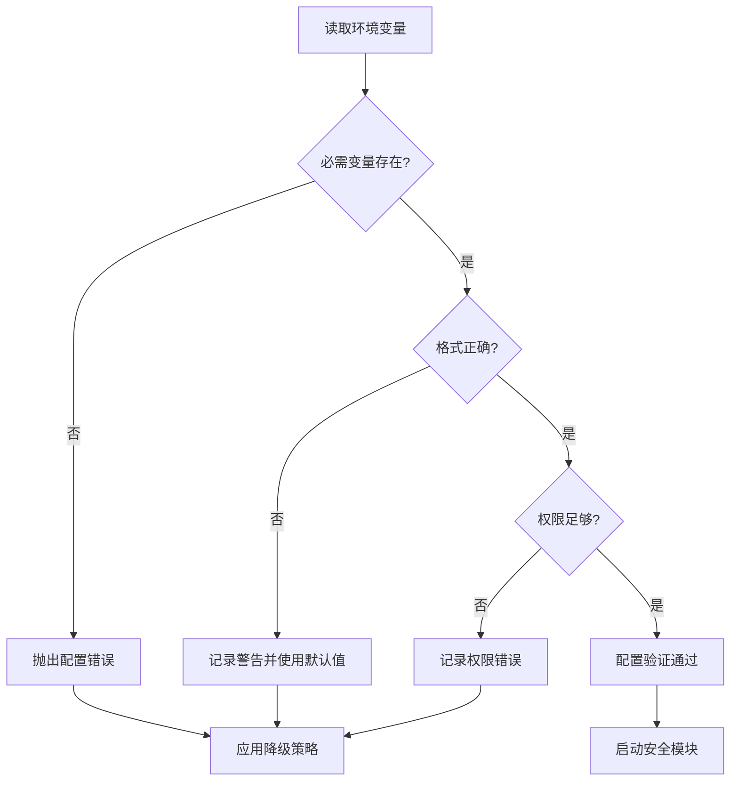

**章节来源**
- [openhands/security/grayswan/analyzer.py](file://openhands/security/grayswan/analyzer.py#L48-L62)
- [openhands/server/middleware.py](file://openhands/server/middleware.py#L16-L48)

## 安全策略集成

### 第三方安全工具集成

#### 1. GraySwan AI 集成
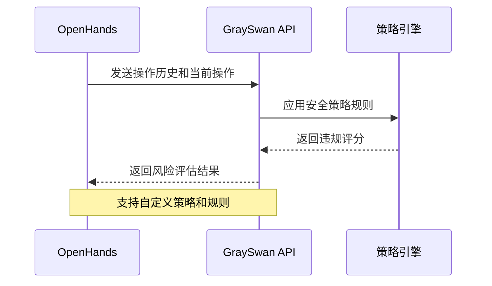

#### 2. Invariant Labs 集成
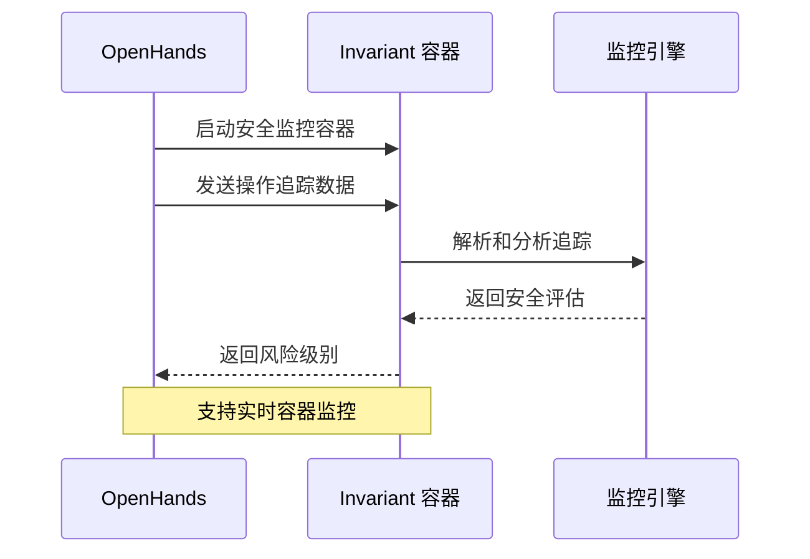

#### 3. 自定义分析器开发

##### 开发步骤
1. 继承 `SecurityAnalyzer` 基类
2. 实现抽象方法
3. 注册到分析器选项
4. 添加前端配置界面

##### 示例结构
```python
class CustomSecurityAnalyzer(SecurityAnalyzer):
    def __init__(self, config):
        super().__init__()
        # 初始化自定义逻辑
    
    async def security_risk(self, action: Action) -> ActionSecurityRisk:
        # 实现风险评估逻辑
        pass
    
    async def handle_api_request(self, request: Request) -> Any:
        # 处理 API 请求
        pass
```

### 策略可扩展性

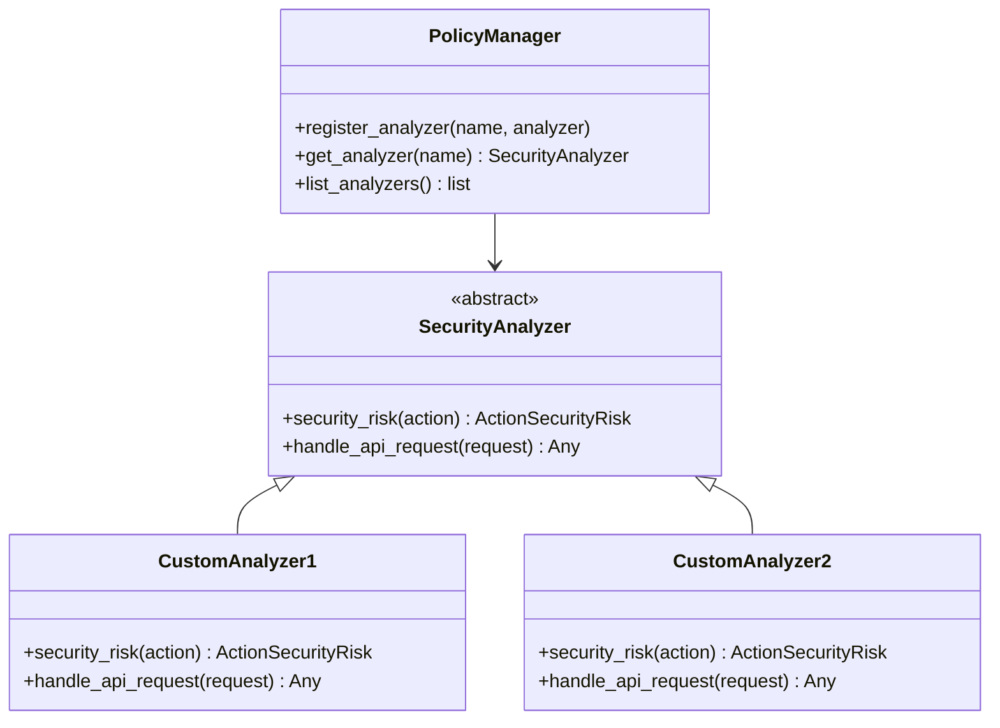

**图表来源**
- [openhands/security/options.py](file://openhands/security/options.py#L6-L10)

**章节来源**
- [openhands/security/options.py](file://openhands/security/options.py#L1-L11)
- [openhands/security/grayswan/analyzer.py](file://openhands/security/grayswan/analyzer.py#L1-L205)

## 安全事件日志记录

### 日志记录架构

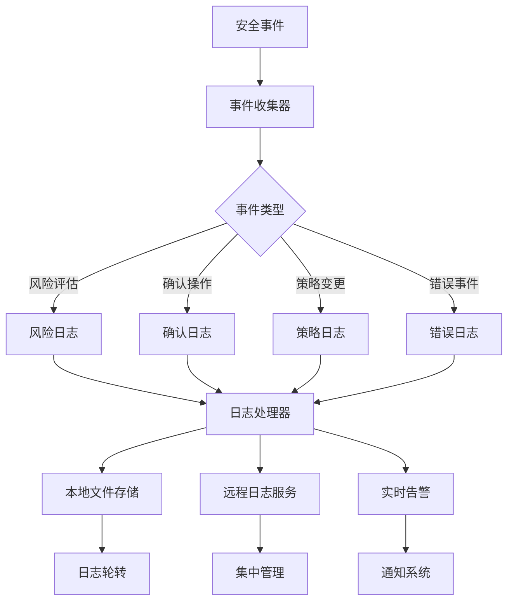

### 审计跟踪配置

#### 基本审计配置
```toml
[security.audit]
enabled = true
log_level = "INFO"
retention_days = 90
rotation_size = "100MB"
compress_old_logs = true
```

#### 安全事件类型
| 事件类型 | 描述 | 记录级别 |
|----------|------|----------|
| `SECURITY_RISK_ASSESSMENT` | 安全风险评估 | INFO |
| `USER_CONFIRMATION` | 用户确认操作 | INFO |
| `POLICY_CHANGE` | 策略配置变更 | WARN |
| `UNAUTHORIZED_ACCESS` | 未授权访问尝试 | ERROR |
| `SYSTEM_ERROR` | 系统安全错误 | ERROR |

### 敏感信息保护

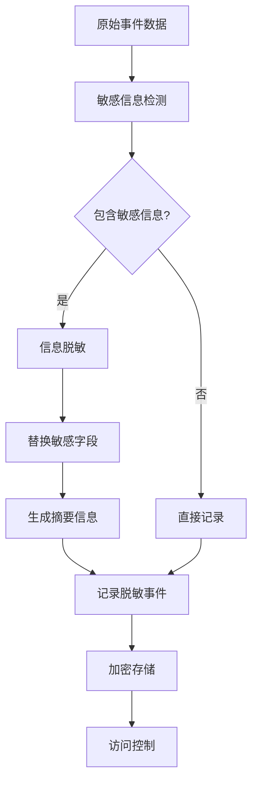

**章节来源**
- [microagents/security.md](file://microagents/security.md#L30-L35)

## 最佳实践

### 生产环境部署安全建议

#### 1. 分层安全策略
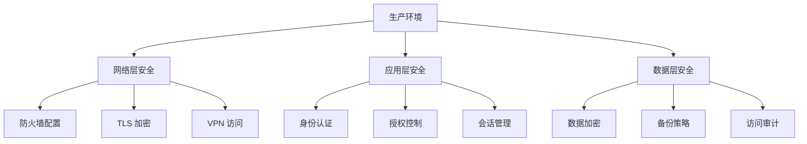

#### 2. 安全配置清单

##### 基础配置
- ✅ 启用确认模式
- ✅ 配置适当的安全分析器
- ✅ 设置合理的风险阈值
- ✅ 启用详细日志记录
- ✅ 配置审计跟踪

##### 高级配置
- ✅ 部署 GraySwan 或其他第三方分析器
- ✅ 配置自定义安全策略
- ✅ 设置实时监控和告警
- ✅ 实施定期安全评估
- ✅ 建立应急响应流程

#### 3. 合规性要求

##### 数据保护
- 实施数据分类和标记
- 配置数据传输加密
- 建立数据保留和销毁政策
- 确保符合 GDPR、CCPA 等法规要求

##### 访问控制
- 实施最小权限原则
- 配置多因素认证
- 建立角色基础访问控制
- 定期审查访问权限

##### 审计和监控
- 启用完整事件跟踪
- 配置异常行为检测
- 建立安全信息和事件管理（SIEM）
- 实施定期安全报告

### 性能优化建议

#### 1. 分析器性能调优
```toml
[security.performance]
# 缩短分析器响应时间
analysis_timeout = 5  # 秒

# 限制历史事件数量
history_limit = 10

# 优化内存使用
max_cache_size = "100MB"

# 并发处理限制
max_concurrent_analyses = 5
```

#### 2. 网络优化
```toml
[security.network]
# 配置代理服务器
proxy_url = "http://proxy.company.com:8080"

# 设置连接池大小
max_connections = 10

# 配置超时时间
request_timeout = 30  # 秒
```

#### 3. 存储优化
```toml
[security.storage]
# 启用压缩
enable_compression = true

# 配置缓存策略
cache_ttl = 300  # 秒

# 优化索引
optimize_indexes = true
```

### 安全测试策略

#### 1. 单元测试
```python
def test_security_risk_assessment():
    """测试安全风险评估功能"""
    analyzer = GraySwanAnalyzer()
    action = create_test_action()
    
    risk = await analyzer.security_risk(action)
    assert risk in [ActionSecurityRisk.LOW, 
                   ActionSecurityRisk.MEDIUM, 
                   ActionSecurityRisk.HIGH]
```

#### 2. 集成测试
```python
def test_end_to_end_security_flow():
    """测试完整的安全流程"""
    # 启动带有安全配置的服务
    # 执行危险操作
    # 验证确认流程
    # 检查日志记录
```

#### 3. 渗透测试
- 定期进行安全漏洞扫描
- 执行社会工程学测试
- 测试应急响应能力
- 验证备份和恢复流程

**章节来源**
- [openhands/security/README.md](file://openhands/security/README.md#L1-L130)

## 故障排除

### 常见问题及解决方案

#### 1. 安全分析器初始化失败

**症状**：分析器无法启动或频繁重启
**原因**：外部依赖不可用或配置错误
**解决方案**：
```bash
# 检查外部服务连接
curl -H "Authorization: Bearer $GRAYSWAN_API_KEY" \
     https://api.grayswan.ai/cygnal/monitor

# 验证环境变量
echo $GRAYSWAN_API_KEY
echo $GRAYSWAN_POLICY_ID

# 检查容器状态（Invariant）
docker ps | grep openhands-invariant-server
```

#### 2. 确认模式行为异常

**症状**：确认对话框不出现或重复出现
**原因**：配置冲突或状态同步问题
**解决方案**：
```bash
# 重置确认模式状态
curl -X POST http://localhost:8080/api/security/reset

# 检查当前配置
curl http://localhost:8080/api/security/settings
```

#### 3. 性能问题

**症状**：操作延迟增加或系统响应缓慢
**原因**：分析器负载过高或资源不足
**解决方案**：
```toml
# 优化配置
[security]
confirmation_mode = false  # 临时禁用确认模式
security_analyzer = "llm"  # 使用轻量级分析器
```

#### 4. 日志记录问题

**症状**：安全事件未被记录或记录不完整
**原因**：日志级别设置不当或存储空间不足
**解决方案**：
```bash
# 检查日志配置
cat /etc/openhands/logging.conf

# 清理旧日志
find /var/log/openhands -name "*.log" -mtime +30 -delete

# 检查磁盘空间
df -h /var/log
```

### 调试工具

#### 1. 实时监控仪表板
```bash
# 查看安全分析器状态
curl http://localhost:8080/api/security/status

# 监控实时事件
tail -f /var/log/openhands/security.log | jq .
```

#### 2. 配置验证工具
```bash
# 验证配置文件
openhands validate-config --security

# 检查环境变量
openhands check-environment --security
```

#### 3. 性能分析工具
```bash
# 分析响应时间
time curl -X POST http://localhost:8080/api/security/risk-assessment

# 监控资源使用
docker stats openhands-invariant-server
```

### 错误代码参考

| 错误代码 | 描述 | 解决方案 |
|----------|------|----------|
| `SECURITY_001` | 分析器初始化失败 | 检查外部服务和配置 |
| `SECURITY_002` | API 调用超时 | 增加超时时间或检查网络 |
| `SECURITY_003` | 权限不足 | 验证 API 密钥和权限 |
| `SECURITY_004` | 配置无效 | 检查配置文件语法 |
| `SECURITY_005` | 内存不足 | 增加内存限制或优化配置 |

**章节来源**
- [openhands/security/grayswan/analyzer.py](file://openhands/security/grayswan/analyzer.py#L154-L159)
- [openhands/security/invariant/analyzer.py](file://openhands/security/invariant/analyzer.py#L38-L44)

## 结论

OpenHands 的安全配置系统提供了全面而灵活的安全防护机制。通过合理配置安全分析器、确认模式和相关策略，可以有效保护系统免受潜在威胁。建议在生产环境中采用分层安全策略，结合多种分析器和监控手段，确保系统的安全性和可靠性。

定期的安全评估、性能优化和合规性检查是维护系统安全的重要环节。通过遵循本文档提供的最佳实践和故障排除指南，可以确保 OpenHands 系统在各种环境下都能安全稳定地运行。