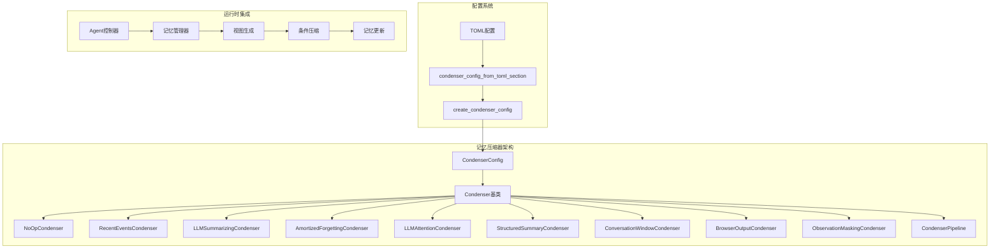
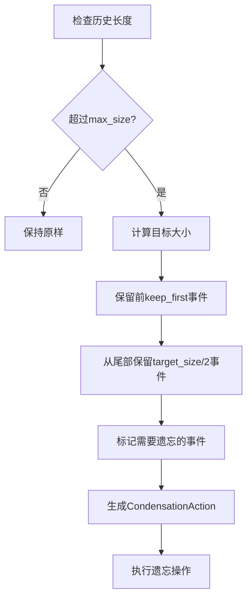

# 记忆管理配置

<cite>
**本文档引用的文件**
- [condenser_config.py](file://openhands/core/config/condenser_config.py)
- [conversation_window_condenser.py](file://openhands/memory/condenser/impl/conversation_window_condenser.py)
- [llm_summarizing_condenser.py](file://openhands/memory/condenser/impl/llm_summarizing_condenser.py)
- [llm_attention_condenser.py](file://openhands/memory/condenser/impl/llm_attention_condenser.py)
- [amortized_forgetting_condenser.py](file://openhands/memory/condenser/impl/amortized_forgetting_condenser.py)
- [structured_summary_condenser.py](file://openhands/memory/condenser/impl/structured_summary_condenser.py)
- [recent_events_condenser.py](file://openhands/memory/condenser/impl/recent_events_condenser.py)
- [browser_output_condenser.py](file://openhands/memory/condenser/impl/browser_output_condenser.py)
- [no_op_condenser.py](file://openhands/memory/condenser/impl/no_op_condenser.py)
- [test_condenser.py](file://tests/unit/memory/condenser/test_condenser.py)
- [config.template.toml](file://config.template.toml)
</cite>

## 目录
1. [简介](#简介)
2. [记忆压缩器架构概览](#记忆压缩器架构概览)
3. [核心配置类型](#核心配置类型)
4. [详细配置分析](#详细配置分析)
5. [记忆管理策略对比](#记忆管理策略对比)
6. [性能优化指南](#性能优化指南)
7. [实际应用案例](#实际应用案例)
8. [故障排除](#故障排除)
9. [最佳实践](#最佳实践)

## 简介

OpenHands 的记忆管理系统通过多种记忆压缩器（condenser）实现了智能的记忆管理机制。这些压缩器能够根据不同的任务需求和性能要求，动态地处理和压缩对话历史，确保代理在长时间交互中保持高效的记忆能力。

记忆压缩器系统的核心目标是：
- **控制内存使用**：防止对话历史无限增长导致的内存溢出
- **维护上下文连续性**：确保重要信息不会被错误遗忘
- **优化性能表现**：平衡记忆保留与计算效率
- **适应不同任务类型**：为复杂功能开发和多步骤问题解决提供专门支持

## 记忆压缩器架构概览



**图表来源**
- [condenser_config.py](file://openhands/core/config/condenser_config.py#L182-L193)
- [conversation_window_condenser.py](file://openhands/memory/condenser/impl/conversation_window_condenser.py#L16-L189)

## 核心配置类型

### 配置类型层次结构

```mermaid
classDiagram
class CondenserConfig {
<<union>>
}
class NoOpCondenserConfig {
+Literal type = "noop"
}
class RecentEventsCondenserConfig {
+Literal type = "recent"
+int keep_first
+int max_events
}
class LLMSummarizingCondenserConfig {
+Literal type = "llm"
+LLMConfig llm_config
+int keep_first
+int max_size
+int max_event_length
}
class AmortizedForgettingCondenserConfig {
+Literal type = "amortized"
+int max_size
+int keep_first
}
class LLMAttentionCondenserConfig {
+Literal type = "llm_attention"
+LLMConfig llm_config
+int max_size
+int keep_first
}
class StructuredSummaryCondenserConfig {
+Literal type = "structured"
+LLMConfig llm_config
+int keep_first
+int max_size
+int max_event_length
}
class ConversationWindowCondenserConfig {
+Literal type = "conversation_window"
}
class BrowserOutputCondenserConfig {
+Literal type = "browser_output_masking"
+int attention_window
}
class ObservationMaskingCondenserConfig {
+Literal type = "observation_masking"
+int attention_window
}
class CondenserPipelineConfig {
+Literal type = "pipeline"
+CondenserConfig[] condensers
}
CondenserConfig <|-- NoOpCondenserConfig
CondenserConfig <|-- RecentEventsCondenserConfig
CondenserConfig <|-- LLMSummarizingCondenserConfig
CondenserConfig <|-- AmortizedForgettingCondenserConfig
CondenserConfig <|-- LLMAttentionCondenserConfig
CondenserConfig <|-- StructuredSummaryCondenserConfig
CondenserConfig <|-- ConversationWindowCondenserConfig
CondenserConfig <|-- BrowserOutputCondenserConfig
CondenserConfig <|-- ObservationMaskingCondenserConfig
CondenserConfig <|-- CondenserPipelineConfig
```



**图表来源**
- [condenser_config.py](file://openhands/core/config/condenser_config.py#L11-L193)

**章节来源**
- [condenser_config.py](file://openhands/core/config/condenser_config.py#L11-L193)

## 详细配置分析

### 1. 窗口大小与最大步数参数

#### window_size vs max_size 参数差异

| 参数类型 | 用途 | 影响范围 | 性能影响 |
|---------|------|----------|----------|
| `window_size` | 控制当前对话窗口大小 | 实时对话上下文 | 低内存占用 |
| `max_size` | 定义历史压缩阈值 | 长期记忆管理 | 中等计算开销 |

#### 参数配置原则

**保守配置（适用于关键任务）：**
```toml
[condenser]
type = "amortized"
max_size = 200
keep_first = 10
```

**平衡配置（适用于一般任务）：**
```toml
[condenser]
type = "llm"
max_size = 100
keep_first = 5
max_event_length = 5000
```

**激进配置（适用于快速迭代）：**
```toml
[condenser]
type = "recent"
max_events = 50
keep_first = 2
```

### 2. conversation_window 压缩策略

**工作原理：**
- 识别关键事件（系统消息、用户消息、召回操作）
- 保留约一半的历史事件
- 确保动作-观察配对的完整性
- 忽略孤立的观察事件

**适用场景：**
- 需要保持对话连续性的任务
- 避免丢失重要上下文信息
- 维护任务状态的一致性

### 3. llm_summarization 摘要生成

**核心特性：**
- 使用LLM生成高质量摘要
- 支持结构化和非结构化摘要格式
- 可配置的最大事件长度限制
- 自动维护摘要链

**提示词模板配置：**
```python
prompt = """You are maintaining a context-aware state summary for an interactive agent.
You will be given a list of events corresponding to actions taken by the agent, and the most recent previous summary if one exists.

Track:

USER_CONTEXT: (Preserve essential user requirements, goals, and clarifications in concise form)

TASK_TRACKING: {Active tasks, their IDs and statuses - PRESERVE TASK IDs}

COMPLETED: (Tasks completed so far, with brief results)
PENDING: (Tasks that still need to be done)
CURRENT_STATE: (Current variables, data structures, or relevant state)

For code-specific tasks, also include:
CODE_STATE: {File paths, function signatures, data structures}
TESTS: {Failing cases, error messages, outputs}
CHANGES: {Code edits, variable updates}
DEPS: {Dependencies, imports, external calls}
VERSION_CONTROL_STATUS: {Repository state, current branch, PR status, commit history}

PRIORITIZE:
1. Adapt tracking format to match the actual task type
2. Capture key user requirements and goals
3. Distinguish between completed and pending tasks
4. Keep all sections concise and relevant

SKIP: Tracking irrelevant details for the current task type
"""
```

### 4. amortized_forgetting 惰性遗忘

**算法流程：**


**图表来源**
- [amortized_forgetting_condenser.py](file://openhands/memory/condenser/impl/amortized_forgetting_condenser.py#L40-L69)

**参数验证规则：**
- `keep_first < max_size // 2`：确保有足够的空间进行压缩
- `keep_first ≥ 0`：不能为负数
- `max_size ≥ 2`：至少保留两个事件

**章节来源**
- [amortized_forgetting_condenser.py](file://openhands/memory/condenser/impl/amortized_forgetting_condenser.py#L16-L69)
- [llm_summarizing_condenser.py](file://openhands/memory/condenser/impl/llm_summarizing_condenser.py#L52-L183)

## 记忆管理策略对比

### 策略性能对比表

| 策略类型 | 内存占用 | 处理速度 | 上下文保留 | 适用任务 |
|---------|----------|----------|------------|----------|
| NoOpCondenser | 最高 | 最快 | 完整保留 | 短期对话 |
| RecentEventsCondenser | 中等 | 快速 | 最新事件 | 快速迭代 |
| AmortizedForgettingCondenser | 中等 | 中等 | 平衡保留 | 长期任务 |
| LLMSummarizingCondenser | 较低 | 较慢 | 高质量摘要 | 复杂开发 |
| LLMAttentionCondenser | 较低 | 较慢 | 关键事件 | 重点任务 |
| StructuredSummaryCondenser | 较低 | 较慢 | 结构化摘要 | 代码项目 |

### 不同任务类型的推荐配置

#### 复杂功能开发任务
```toml
[condenser.complex_dev]
type = "structured"
llm_config = "gpt-4o"
max_size = 300
keep_first = 15
max_event_length = 10000
```

#### 多步骤问题解决
```toml
[condenser.multi_step]
type = "llm_attention"
llm_config = "gpt-4o"
max_size = 200
keep_first = 10
```

#### 快速原型开发
```toml
[condenser.quick_prototype]
type = "amortized"
max_size = 100
keep_first = 5
```

#### 简单问答任务
```toml
[condenser.simple_qa]
type = "recent"
max_events = 50
keep_first = 2
```

## 性能优化指南

### 1. LLM配置优化

**模型选择策略：**
- **摘要生成**：优先选择支持函数调用的模型（如GPT-4、Claude-3）
- **注意力机制**：需要支持JSON Schema响应的模型
- **成本控制**：使用较小的模型进行简单任务

**缓存配置：**
```toml
[llm.condenser_llm]
model = "gpt-4o-mini"
caching_prompt = false  # 摘总器禁用缓存以避免写入浪费
```

### 2. 事件长度优化

**内容截断策略：**
```python
def _truncate(self, content: str) -> str:
    """截断内容以适应最大事件长度限制"""
    return truncate_content(content, max_chars=self.max_event_length)
```

**优化建议：**
- 设置合理的`max_event_length`（通常5000-10000字符）
- 对于浏览器输出使用专门的掩码策略
- 在LLM摘要中使用结构化字段而非自由文本

### 3. 批量处理优化

**管道配置：**
```toml
[condenser.pipeline]
type = "pipeline"
condensers = [
    "browser_output_masking",
    "observation_masking",
    "llm"
]
```

**章节来源**
- [structured_summary_condenser.py](file://openhands/memory/condenser/impl/structured_summary_condenser.py#L195-L200)
- [browser_output_condenser.py](file://openhands/memory/condenser/impl/browser_output_condenser.py#L21-L40)

## 实际应用案例

### 案例1：大型代码重构项目

**配置方案：**
```toml
[condenser.large_refactor]
type = "structured"
llm_config = "gpt-4o"
max_size = 500
keep_first = 20
max_event_length = 15000

[llm.refactor_llm]
model = "gpt-4o"
temperature = 0.1
caching_prompt = false
```

**预期效果：**
- 保留完整的重构历史
- 自动生成代码变更摘要
- 维护版本控制状态跟踪
- 支持复杂的多文件操作

### 案例2：数据分析项目

**配置方案：**
```toml
[condenser.data_analysis]
type = "llm_attention"
llm_config = "claude-3-sonnet"
max_size = 300
keep_first = 10

[llm.analysis_llm]
model = "claude-3-sonnet"
temperature = 0.2
```

**预期效果：**
- 重点关注关键数据操作
- 自动识别重要发现
- 维护分析进度跟踪
- 支持复杂的查询链

### 案例3：Web应用开发

**配置方案：**
```toml
[condenser.web_dev]
type = "conversation_window"
attention_window = 50

[condenser.browser_mask]
type = "browser_output_masking"
attention_window = 3
```

**预期效果：**
- 保持对话连续性
- 优化浏览器输出处理
- 减少不必要的屏幕截图传输
- 维护UI状态一致性

**章节来源**
- [test_condenser.py](file://tests/unit/memory/condenser/test_condenser.py#L450-L510)

## 故障排除

### 常见配置错误

#### 1. 参数验证失败
**错误信息：** `ValueError: keep_first must be less than half of max_size`

**解决方案：**
```toml
# 错误配置
[condenser]
type = "amortized"
max_size = 10
keep_first = 6  # 超过max_size//2

# 正确配置
[condenser]
type = "amortized"
max_size = 10
keep_first = 4  # 小于max_size//2
```

#### 2. LLM配置缺失
**错误信息：** `LLM config 'missing_llm' not found`

**解决方案：**
```toml
# 确保LLM配置存在
[llm.summary_llm]
model = "gpt-4o"
api_key = "your-api-key"

[condenser]
type = "llm"
llm_config = "summary_llm"
max_size = 100
```

#### 3. 模型不支持功能
**错误信息：** `The LLM model must support the 'response_schema' parameter`

**解决方案：**
```toml
# 使用支持JSON Schema的模型
[llm.attention_llm]
model = "gpt-4o"  # 或 claude-3-sonnet

[condenser]
type = "llm_attention"
llm_config = "attention_llm"
max_size = 100
```

### 性能问题诊断

#### 内存使用过高
**检查点：**
- `max_size`设置是否过小
- 是否启用了过多的压缩器
- `max_event_length`是否过大

**优化建议：**
```toml
# 增加max_size或减少max_event_length
[condenser.optimized]
type = "amortized"
max_size = 200  # 从100增加到200
keep_first = 10
max_event_length = 5000  # 从10000减少到5000
```

#### 处理速度过慢
**检查点：**
- LLM摘要是否过于频繁
- 是否使用了过于复杂的模型
- 是否启用了不必要的功能

**优化建议：**
```toml
# 使用更轻量级的配置
[condenser.fast]
type = "recent"
max_events = 100
keep_first = 5
```

**章节来源**
- [condenser_config.py](file://openhands/core/config/condenser_config.py#L256-L261)
- [test_condenser.py](file://tests/unit/memory/condenser/test_condenser.py#L464-L469)

## 最佳实践

### 1. 配置命名规范

**推荐命名模式：**
```toml
# 基于任务类型的命名
[condenser.code_review]
type = "structured"
llm_config = "review_llm"

[condenser.bug_fix]
type = "amortized"
max_size = 150

[condenser.feature_dev]
type = "llm_attention"
llm_config = "dev_llm"
```

### 2. 渐进式配置优化

**优化流程：**
1. **初始配置**：使用默认设置进行测试
2. **性能监控**：观察内存使用和处理时间
3. **参数调整**：根据需求微调参数
4. **功能验证**：确保上下文保留正确
5. **持续优化**：基于实际使用反馈调整

### 3. 测试与验证

**测试策略：**
```python
# 创建测试用例验证配置效果
def test_condenser_configuration():
    """测试不同配置的效果"""
    configs = [
        ("basic", {"type": "recent", "max_events": 50}),
        ("advanced", {"type": "structured", "max_size": 200}),
        ("optimized", {"type": "amortized", "max_size": 100})
    ]
    
    for name, config in configs:
        condenser = Condenser.from_config(config, llm_registry)
        # 验证配置正确性
        assert condenser is not None
        # 测试处理效果
        test_memory_retention(condenser)
```

### 4. 文档化配置决策

**配置文档模板：**
```toml
# 项目名称：大型前端重构
# 配置目的：平衡记忆保留与性能
# 使用策略：结构化摘要 + 惰性遗忘
# 参数说明：
# - max_size: 300 - 允许较大的历史容量
# - keep_first: 15 - 保留关键初始化事件
# - max_event_length: 10000 - 适应复杂代码片段
# - LLM: gpt-4o - 提供高质量摘要
```

### 5. 监控与告警

**监控指标：**
- 内存使用量
- 处理延迟
- 摘要质量评分
- 事件遗忘率

**告警阈值：**
```toml
# 建议的监控阈值
[monitoring]
max_memory_usage = 80  # 百分比
max_processing_time = 5  # 秒
min_summary_quality = 0.7  # 评分
max_forgetting_rate = 0.2  # 事件比例
```

通过遵循这些最佳实践，可以确保记忆管理配置既满足业务需求，又保持良好的性能表现。定期评估和调整配置是维持系统高效运行的关键。