# Docker沙箱配置

<cite>
**本文档中引用的文件**
- [containers/app/Dockerfile](file://containers/app/Dockerfile)
- [containers/app/config.sh](file://containers/app/config.sh)
- [containers/app/entrypoint.sh](file://containers/app/entrypoint.sh)
- [containers/runtime/config.sh](file://containers/runtime/config.sh)
- [containers/build.sh](file://containers/build.sh)
- [containers/dev/Dockerfile](file://containers/dev/Dockerfile)
- [containers/dev/compose.yml](file://containers/dev/compose.yml)
- [containers/dev/dev.sh](file://containers/dev/dev.sh)
- [openhands/core/config/sandbox_config.py](file://openhands/core/config/sandbox_config.py)
- [openhands/runtime/impl/docker/docker_runtime.py](file://openhands/runtime/impl/docker/docker_runtime.py)
- [openhands/app_server/sandbox/docker_sandbox_service.py](file://openhands/app_server/sandbox/docker_sandbox_service.py)
- [third_party/containers/e2b-sandbox/Dockerfile](file://third_party/containers/e2b-sandbox/Dockerfile)
</cite>

## 目录
1. [简介](#简介)
2. [项目结构概览](#项目结构概览)
3. [核心配置组件](#核心配置组件)
4. [架构概览](#架构概览)
5. [详细组件分析](#详细组件分析)
6. [依赖关系分析](#依赖关系分析)
7. [性能考虑](#性能考虑)
8. [故障排除指南](#故障排除指南)
9. [结论](#结论)

## 简介

OpenHands项目采用基于Docker的沙箱架构来提供安全、隔离的运行时环境。该系统通过多层Docker配置实现了灵活的容器化部署，支持多种编程语言环境，并提供了完整的生命周期管理功能。本文档深入解析了Docker沙箱的配置机制，包括基础镜像选择、容器网络模式、端口映射、卷挂载策略、资源限制和安全选项等关键配置要素。

## 项目结构概览

OpenHands的Docker沙箱配置分布在多个目录中，形成了层次化的架构：

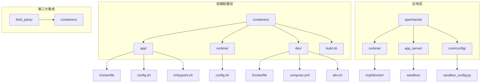

**图表来源**
- [containers/app/Dockerfile](file://containers/app/Dockerfile#L1-L96)
- [containers/dev/Dockerfile](file://containers/dev/Dockerfile#L1-L128)
- [openhands/core/config/sandbox_config.py](file://openhands/core/config/sandbox_config.py#L1-L124)

**章节来源**
- [containers/app/Dockerfile](file://containers/app/Dockerfile#L1-L96)
- [containers/dev/Dockerfile](file://containers/dev/Dockerfile#L1-L128)
- [containers/runtime/config.sh](file://containers/runtime/config.sh#L1-L8)

## 核心配置组件

### 基础镜像配置

OpenHands使用分层构建策略，通过多阶段Dockerfile实现优化的镜像构建：

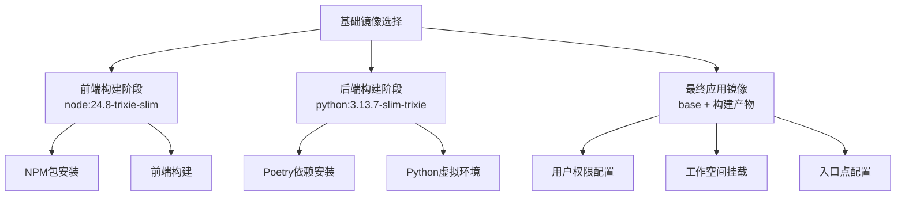

**图表来源**
- [containers/app/Dockerfile](file://containers/app/Dockerfile#L2-L31)

### 环境变量配置

系统通过多个配置文件管理环境变量：

| 配置文件 | 用途 | 关键变量 |
|---------|------|----------|
| `containers/app/config.sh` | 应用容器注册表配置 | `DOCKER_REGISTRY`, `DOCKER_ORG`, `DOCKER_IMAGE` |
| `containers/runtime/config.sh` | 运行时容器配置 | `DOCKER_IMAGE`, `DOCKER_IMAGE_TAG` |
| `containers/dev/config.sh` | 开发环境配置 | `DEV_MODE`, `DEBUG_ENABLED` |
| `sandbox_config.py` | 运行时配置类 | `base_container_image`, `runtime_container_image` |

**章节来源**
- [containers/app/config.sh](file://containers/app/config.sh#L1-L5)
- [containers/runtime/config.sh](file://containers/runtime/config.sh#L1-L8)
- [openhands/core/config/sandbox_config.py](file://openhands/core/config/sandbox_config.py#L55-L58)

## 架构概览

OpenHands的Docker沙箱架构采用分层设计，实现了从开发到生产的完整流程：

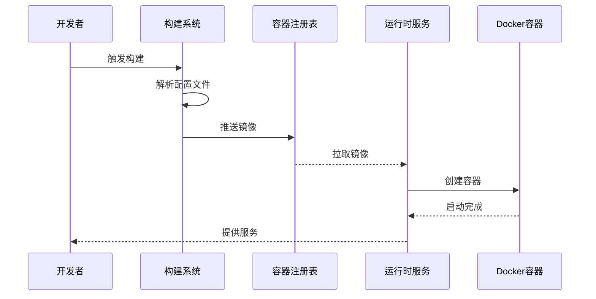

**图表来源**
- [containers/build.sh](file://containers/build.sh#L1-L183)
- [openhands/runtime/impl/docker/docker_runtime.py](file://openhands/runtime/impl/docker/docker_runtime.py#L170-L200)

## 详细组件分析

### Dockerfile配置详解

#### 多阶段构建流程

OpenHands采用多阶段构建来优化最终镜像大小和安全性：

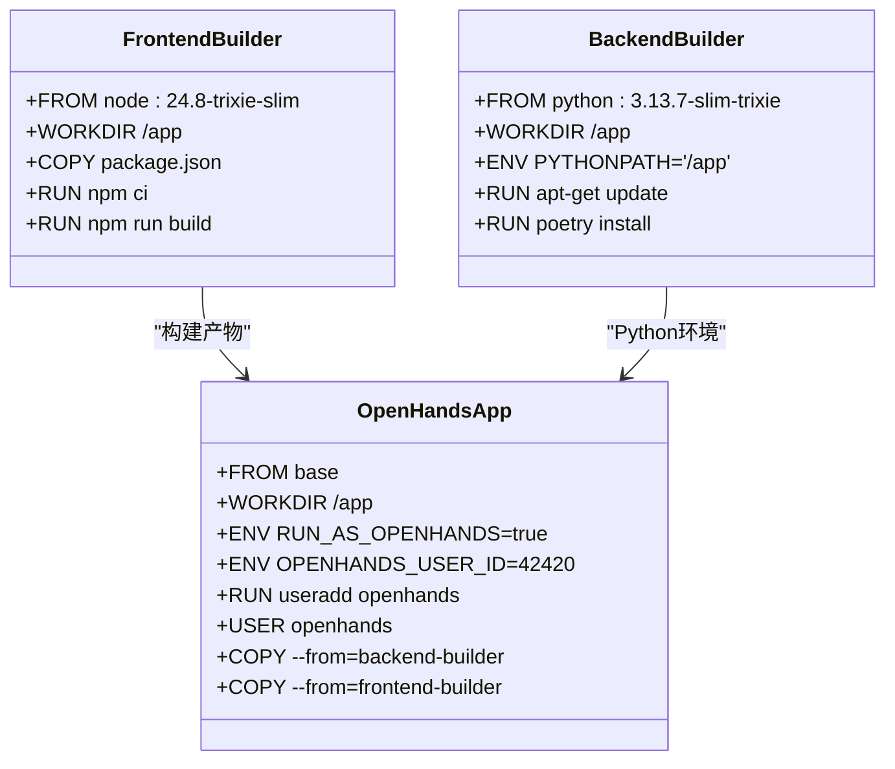

**图表来源**
- [containers/app/Dockerfile](file://containers/app/Dockerfile#L2-L31)
- [containers/app/Dockerfile](file://containers/app/Dockerfile#L32-L96)

#### 用户权限管理

系统实现了精细的用户权限控制：

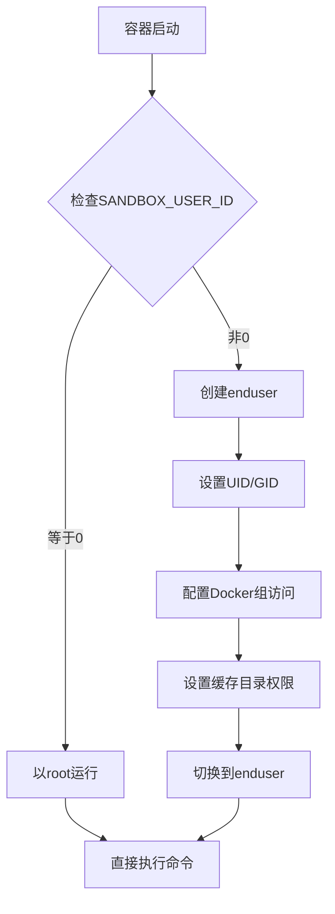

**图表来源**
- [containers/app/entrypoint.sh](file://containers/app/entrypoint.sh#L38-L73)

**章节来源**
- [containers/app/Dockerfile](file://containers/app/Dockerfile#L32-L96)
- [containers/app/entrypoint.sh](file://containers/app/entrypoint.sh#L1-L74)

### 网络配置与端口映射

#### 端口管理策略

OpenHands实现了智能的端口分配机制：

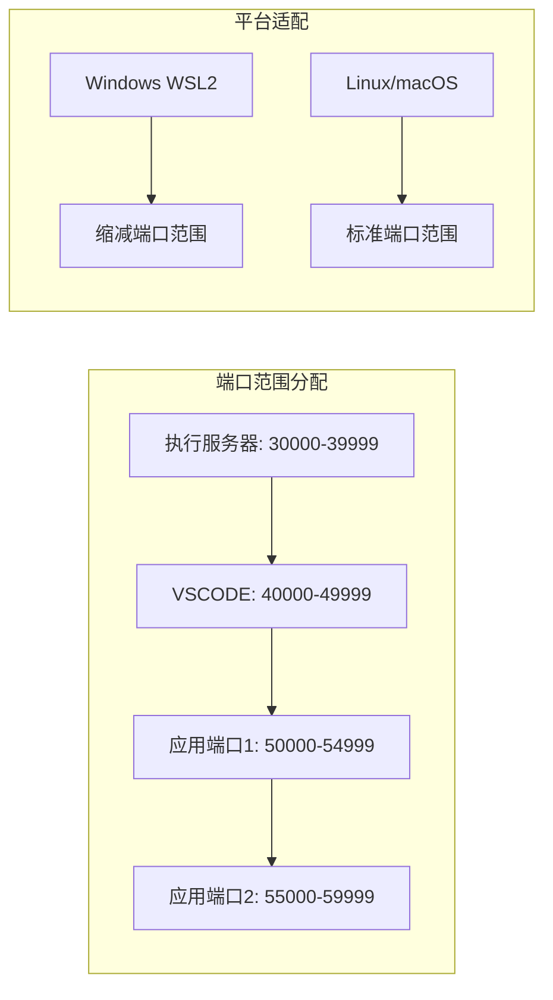

**图表来源**
- [openhands/runtime/impl/docker/docker_runtime.py](file://openhands/runtime/impl/docker/docker_runtime.py#L44-L56)

#### 网络模式配置

| 网络模式 | 用途 | 优势 | 适用场景 |
|---------|------|------|----------|
| `host` | 主要服务通信 | 高性能，简化网络配置 | 开发环境，本地部署 |
| `bridge` | 默认容器网络 | 安全隔离，灵活配置 | 生产环境，多容器部署 |
| 自定义网络 | 特定需求 | 精确控制，服务发现 | 微服务架构，测试环境 |

**章节来源**
- [openhands/runtime/impl/docker/docker_runtime.py](file://openhands/runtime/impl/docker/docker_runtime.py#L421-L444)

### 卷挂载策略

#### 挂载类型与权限

OpenHands支持多种卷挂载方式：

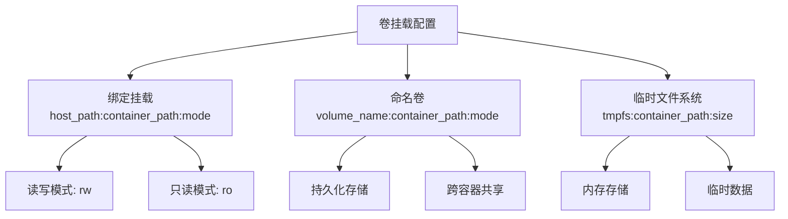

**图表来源**
- [openhands/runtime/impl/docker/docker_runtime.py](file://openhands/runtime/impl/docker/docker_runtime.py#L312-L322)

#### 资源限制配置

系统提供了全面的资源限制选项：

| 资源类型 | 配置参数 | 默认值 | 说明 |
|---------|----------|--------|------|
| CPU配额 | `cpu_period`, `cpu_quota` | 100ms周期，1CPU | 控制CPU使用时间片 |
| 内存限制 | `mem_limit`, `memswap_limit` | 无限制 | 设置内存和交换空间上限 |
| 存储配额 | `blkio_weight` | 500 | 控制磁盘I/O权重 |
| 网络带宽 | `network_mode` | bridge | 网络模式配置 |

**章节来源**
- [openhands/runtime/impl/docker/docker_runtime.py](file://openhands/runtime/impl/docker/docker_runtime.py#L518-L533)

### 安全配置选项

#### 权限控制机制

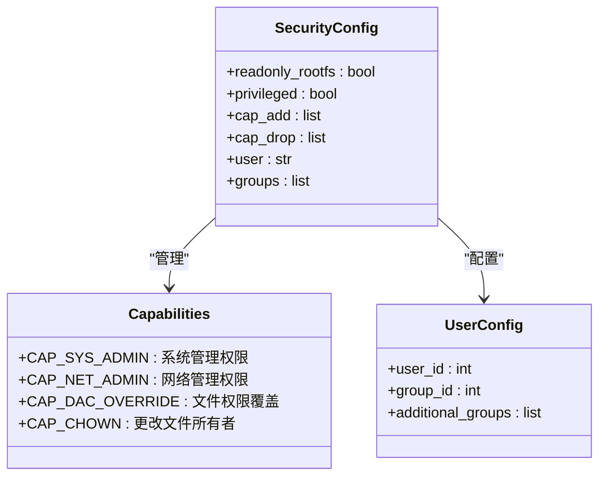

**图表来源**
- [openhands/runtime/impl/docker/docker_runtime.py](file://openhands/runtime/impl/docker/docker_runtime.py#L518-L533)

**章节来源**
- [openhands/runtime/impl/docker/docker_runtime.py](file://openhands/runtime/impl/docker/docker_runtime.py#L518-L533)

## 依赖关系分析

### 构建系统依赖

OpenHands的构建系统具有清晰的依赖层次：

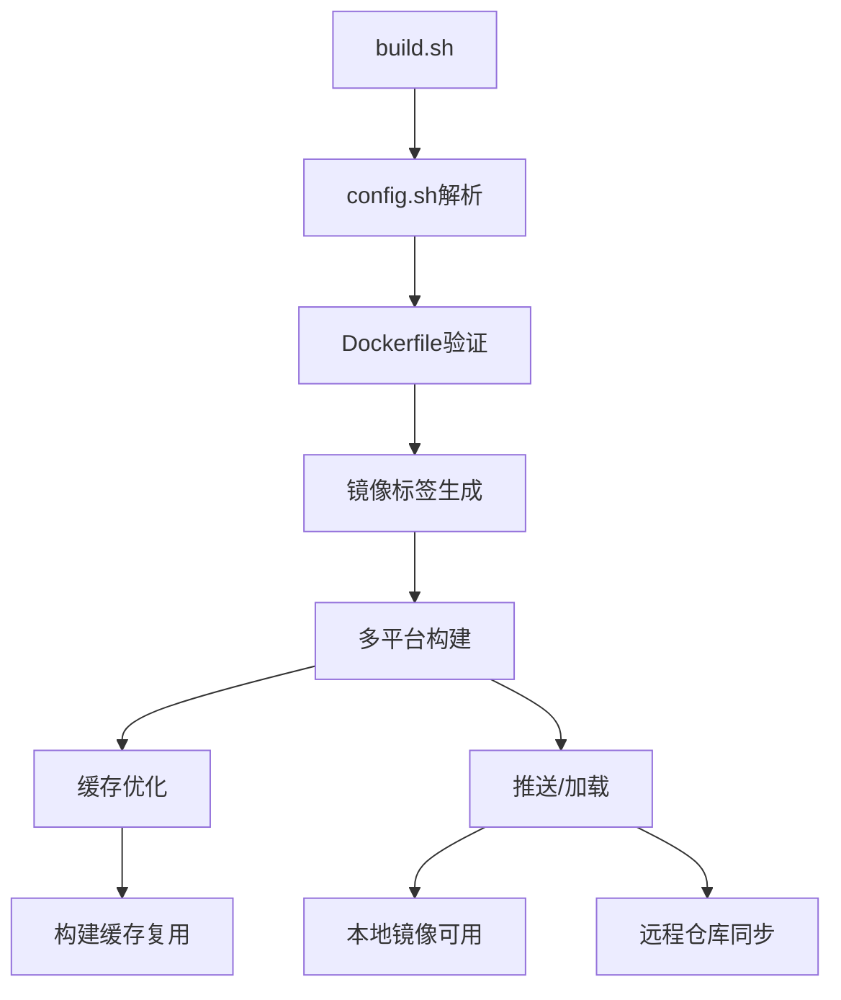

**图表来源**
- [containers/build.sh](file://containers/build.sh#L1-L183)

### 运行时依赖管理

运行时环境的依赖通过多层次配置实现：

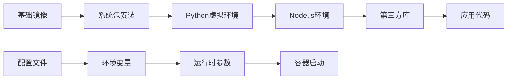

**图表来源**
- [containers/app/Dockerfile](file://containers/app/Dockerfile#L23-L29)
- [containers/dev/Dockerfile](file://containers/dev/Dockerfile#L33-L46)

**章节来源**
- [containers/build.sh](file://containers/build.sh#L1-L183)
- [containers/app/Dockerfile](file://containers/app/Dockerfile#L23-L29)

## 性能考虑

### 构建优化策略

OpenHands采用了多种构建优化技术：

1. **多阶段构建**：减少最终镜像大小
2. **缓存优化**：利用Docker层缓存
3. **并行构建**：支持多平台并行构建
4. **增量构建**：仅重新构建变更部分

### 运行时性能调优

运行时性能优化包括：

1. **资源配额**：合理分配CPU和内存
2. **网络优化**：选择合适的网络模式
3. **存储优化**：使用SSD和适当的文件系统
4. **监控告警**：实时监控资源使用情况

## 故障排除指南

### 常见问题及解决方案

#### 权限错误

**问题描述**：容器内文件访问被拒绝

**解决方案**：
1. 检查用户ID映射
2. 验证挂载路径权限
3. 确认SELinux/AppArmor配置

#### 网络连接失败

**问题描述**：容器无法访问外部网络

**解决方案**：
1. 检查防火墙规则
2. 验证DNS配置
3. 确认网络模式设置

#### 资源耗尽

**问题描述**：容器因资源限制而终止

**解决方案**：
1. 增加内存限制
2. 调整CPU配额
3. 优化应用程序资源使用

### 调试工具和技术

OpenHands提供了丰富的调试功能：

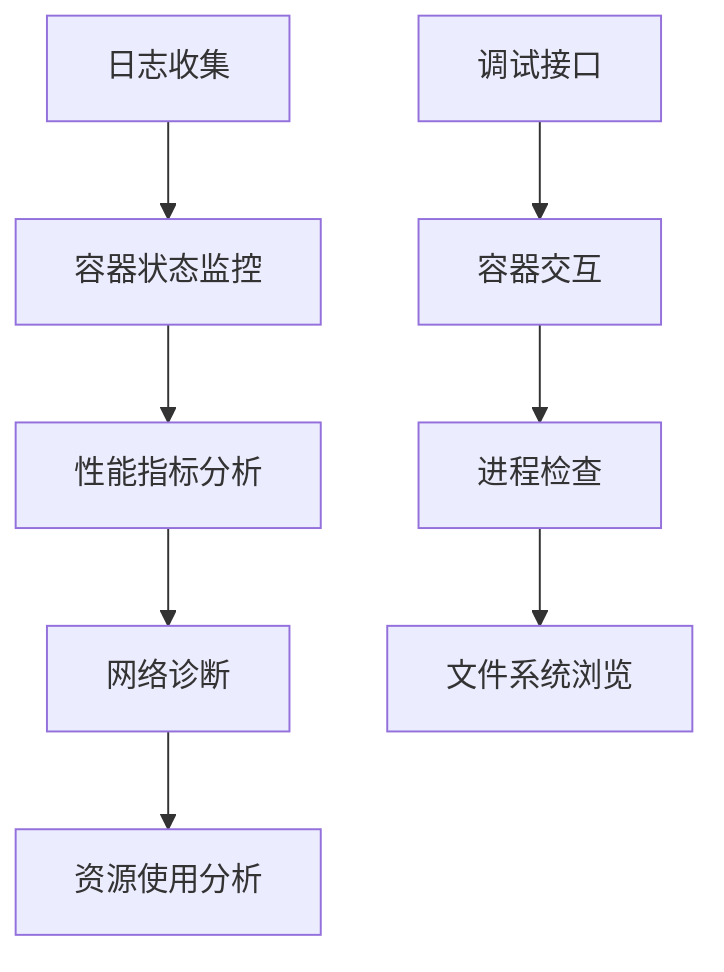

**章节来源**
- [openhands/runtime/impl/docker/docker_runtime.py](file://openhands/runtime/impl/docker/docker_runtime.py#L594-L603)

## 结论

OpenHands的Docker沙箱配置系统展现了现代容器化应用的最佳实践。通过分层架构、灵活的配置管理和完善的生命周期控制，该系统能够满足从开发到生产环境的各种需求。其模块化的设计使得扩展和维护变得简单，而丰富的配置选项则确保了系统的适应性和可定制性。

未来的改进方向包括：
1. 更细粒度的资源控制
2. 增强的安全特性
3. 更好的监控和可观测性
4. 支持更多的部署场景

通过持续的优化和改进，OpenHands的Docker沙箱配置将继续为用户提供可靠、高效的容器化运行时环境。