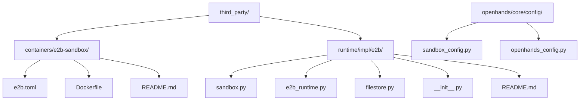
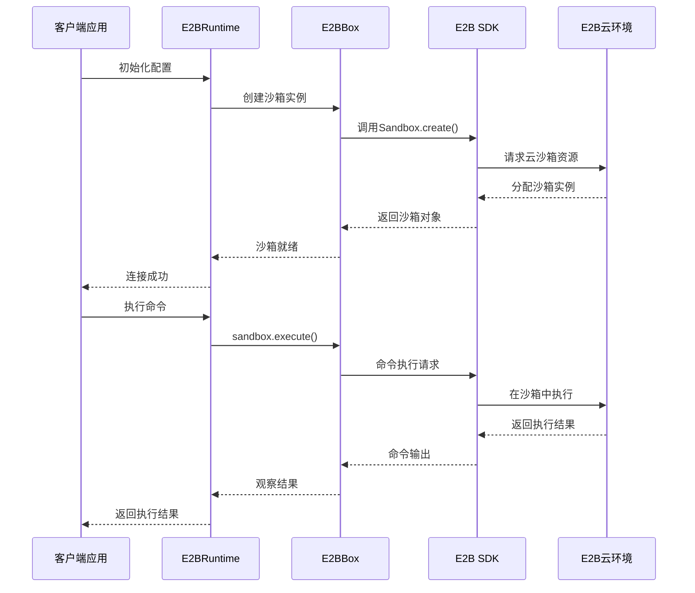
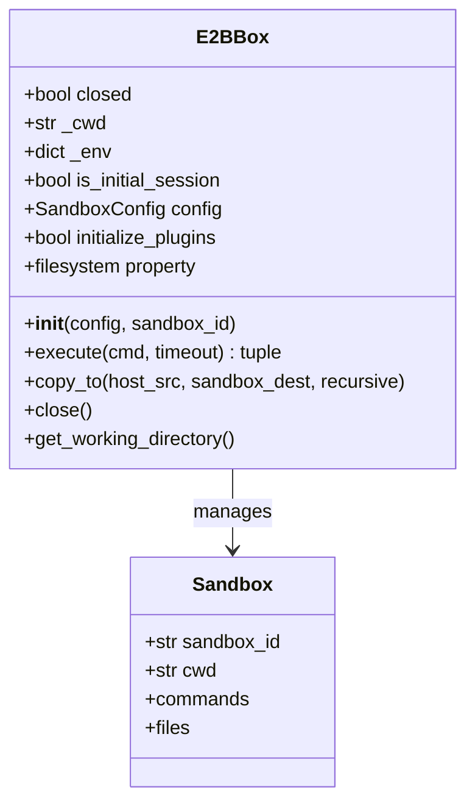
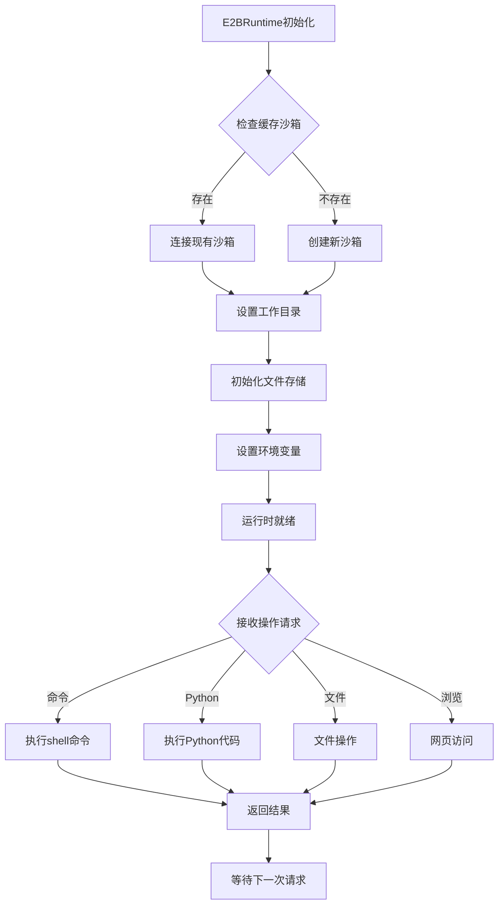

# E2B沙箱配置

<cite>
**本文档中引用的文件**
- [e2b.toml](file://third_party/containers/e2b-sandbox/e2b.toml)
- [Dockerfile](file://third_party/containers/e2b-sandbox/Dockerfile)
- [sandbox.py](file://third_party/runtime/impl/e2b/sandbox.py)
- [e2b_runtime.py](file://third_party/runtime/impl/e2b/e2b_runtime.py)
- [filestore.py](file://third_party/runtime/impl/e2b/filestore.py)
- [__init__.py](file://third_party/runtime/impl/e2b/__init__.py)
- [README.md](file://third_party/runtime/impl/e2b/README.md)
- [sandbox_config.py](file://openhands/core/config/sandbox_config.py)
- [openhands_config.py](file://openhands/core/config/openhands_config.py)
</cite>

## 目录
1. [简介](#简介)
2. [项目结构](#项目结构)
3. [核心组件](#核心组件)
4. [架构概览](#架构概览)
5. [详细组件分析](#详细组件分析)
6. [配置文件详解](#配置文件详解)
7. [环境变量配置](#环境变量配置)
8. [使用示例](#使用示例)
9. [故障排除](#故障排除)
10. [最佳实践](#最佳实践)
11. [总结](#总结)

## 简介

E2B（Environment for Everything Building）是一个开源的安全云环境沙箱平台，专为运行AI生成的代码和代理而设计。OpenHands通过E2B沙箱提供了强大的云端计算能力，支持复杂的开发任务、数据分析和实验操作。

本文档详细介绍了OpenHands中基于E2B云沙箱的集成与配置，包括配置文件结构、环境变量设置、运行时管理和最佳实践。

## 项目结构

E2B沙箱相关文件在OpenHands项目中的组织结构如下：



**图表来源**
- [e2b.toml](file://third_party/containers/e2b-sandbox/e2b.toml#L1-L15)
- [sandbox.py](file://third_party/runtime/impl/e2b/sandbox.py#L1-L153)
- [e2b_runtime.py](file://third_party/runtime/impl/e2b/e2b_runtime.py#L1-L403)

## 核心组件

E2B沙箱系统包含以下核心组件：

### 1. 沙箱配置管理器 (E2BBox)
负责E2B沙箱的创建、连接和生命周期管理。

### 2. 运行时控制器 (E2BRuntime)
提供高级API接口，支持命令执行、文件操作、浏览器浏览等功能。

### 3. 文件存储抽象层 (E2BFileStore)
封装E2B文件系统的操作，提供统一的文件访问接口。

### 4. 配置系统
基于Pydantic的配置验证和管理机制。

**章节来源**
- [sandbox.py](file://third_party/runtime/impl/e2b/sandbox.py#L13-L153)
- [e2b_runtime.py](file://third_party/runtime/impl/e2b/e2b_runtime.py#L39-L403)
- [filestore.py](file://third_party/runtime/impl/e2b/filestore.py#L13-L27)

## 架构概览

E2B沙箱在OpenHands中的整体架构如下：



**图表来源**
- [e2b_runtime.py](file://third_party/runtime/impl/e2b/e2b_runtime.py#L90-L152)
- [sandbox.py](file://third_party/runtime/impl/e2b/sandbox.py#L19-L62)

## 详细组件分析

### E2BBox - 沙箱实例管理器

E2BBox是E2B沙箱的核心管理类，负责沙箱的创建、连接和基本操作。

#### 主要功能特性：
- **API密钥验证**：自动从环境变量读取并验证E2B_API_KEY
- **自定义域名支持**：支持配置自定义E2B域名（E2B_DOMAIN）
- **沙箱生命周期管理**：支持创建新沙箱或连接现有沙箱
- **文件系统抽象**：提供统一的文件操作接口

#### 关键方法：
- `__init__()`: 初始化沙箱实例
- `execute()`: 执行命令并返回结果
- `copy_to()`: 将本地文件复制到沙箱
- `close()`: 关闭沙箱连接



**图表来源**
- [sandbox.py](file://third_party/runtime/impl/e2b/sandbox.py#L13-L153)

**章节来源**
- [sandbox.py](file://third_party/runtime/impl/e2b/sandbox.py#L13-L153)

### E2BRuntime - 高级运行时接口

E2BRuntime提供了丰富的API接口，支持多种类型的代码执行和文件操作。

#### 支持的操作类型：
- **命令执行**：`run(CmdRunAction)`
- **交互式Python**：`run_ipython(IPythonRunCellAction)`
- **文件操作**：读取、写入、编辑文件
- **浏览器访问**：`browse(BrowseURLAction)`
- **环境变量管理**：`add_env_vars()`

#### 连接管理：
- **沙箱缓存**：支持连接复用以提高效率
- **自动重连**：断线后自动尝试重新连接
- **资源清理**：正确关闭沙箱连接



**图表来源**
- [e2b_runtime.py](file://third_party/runtime/impl/e2b/e2b_runtime.py#L90-L152)

**章节来源**
- [e2b_runtime.py](file://third_party/runtime/impl/e2b/e2b_runtime.py#L39-L403)

### E2BFileStore - 文件系统抽象层

E2BFileStore提供了统一的文件操作接口，屏蔽了底层E2B文件系统的差异。

#### 核心功能：
- **文件读写**：支持文本和二进制文件操作
- **目录遍历**：列出目录内容
- **文件删除**：安全删除文件
- **路径处理**：统一的路径管理

**章节来源**
- [filestore.py](file://third_party/runtime/impl/e2b/filestore.py#L13-L27)

## 配置文件详解

### e2b.toml - 沙箱模板配置

e2b.toml是E2B沙箱模板的配置文件，定义了沙箱的基本属性和构建参数。

#### 配置字段说明：

| 字段名 | 类型 | 必需 | 描述 |
|--------|------|------|------|
| `dockerfile` | string | 是 | Dockerfile路径，指定沙箱的基础镜像和安装过程 |
| `template_name` | string | 是 | 模板名称，用于SDK调用时识别 |
| `template_id` | string | 是 | 模板唯一标识符，用于精确识别 |

#### 使用示例：

```toml
# Python SDK调用方式
from e2b import Sandbox
sandbox = Sandbox(template='openhands')

# JavaScript SDK调用方式
import { Sandbox } from 'e2b'
const sandbox = await Sandbox.create({ template: 'openhands' })
```

**章节来源**
- [e2b.toml](file://third_party/containers/e2b-sandbox/e2b.toml#L1-L15)

### Dockerfile - 沙箱基础镜像

Dockerfile定义了E2B沙箱的基础环境，包含了常用的开发工具和依赖。

#### 包含的工具：
- **基础系统**：Ubuntu 24.04 LTS
- **版本控制**：Git
- **编辑器**：Vim、Nano
- **压缩工具**：Unzip、Zip
- **Python环境**：Python 3.12、pip、虚拟环境支持
- **构建工具**：Build-essential、开发头文件
- **网络工具**：Curl、Wget
- **SSH服务**：OpenSSH服务器

**章节来源**
- [Dockerfile](file://third_party/containers/e2b-sandbox/Dockerfile#L1-L20)

### OpenHands配置系统

OpenHands使用分层配置系统，支持多种配置源和优先级。

#### SandboxConfig配置项：

| 配置项 | 默认值 | 描述 |
|--------|--------|------|
| `timeout` | 120秒 | 单个操作的超时时间 |
| `initialize_plugins` | True | 是否初始化插件 |
| `enable_gpu` | False | 是否启用GPU支持 |
| `base_container_image` | nikolaik/python-nodejs:python3.12-nodejs22 | 基础容器镜像 |
| `workspace_mount_path_in_sandbox` | /workspace | 工作空间挂载路径 |

#### OpenHandsConfig配置项：

| 配置项 | 默认值 | 描述 |
|--------|--------|------|
| `runtime` | docker | 运行时类型 |
| `sandbox` | SandboxConfig实例 | 沙箱配置 |
| `max_iterations` | 50 | 最大迭代次数 |
| `enable_browser` | True | 是否启用浏览器 |

**章节来源**
- [sandbox_config.py](file://openhands/core/config/sandbox_config.py#L7-L122)
- [openhands_config.py](file://openhands/core/config/openhands_config.py#L22-L182)

## 环境变量配置

### 必需环境变量

#### E2B_API_KEY
- **用途**：E2B服务的身份验证
- **获取方式**：访问E2B官网注册并获取API密钥
- **示例**：`export E2B_API_KEY="your-api-key-here"`

#### E2B_DOMAIN（可选）
- **用途**：配置自定义E2B域名（企业部署场景）
- **格式**：`https://your-domain.com`
- **示例**：`export E2B_DOMAIN="sandbox.company.com"`

### 可选环境变量

#### SANDBOX_VOLUMES
- **用途**：配置额外的卷挂载
- **格式**：`host_path:container_path[:mode]`
- **示例**：`export SANDBOX_VOLUMES="/host/data:/workspace/data:rw"`

#### WORKSPACE_MOUNT_PATH_IN_SANDBOX
- **用途**：自定义工作空间挂载路径
- **默认值**：`/workspace`
- **示例**：`export WORKSPACE_MOUNT_PATH_IN_SANDBOX="/project"`

**章节来源**
- [sandbox.py](file://third_party/runtime/impl/e2b/sandbox.py#L27-L37)
- [__init__.py](file://third_party/runtime/impl/e2b/__init__.py#L3-L5)

## 使用示例

### 基础配置示例

```python
# 基础E2B运行时配置
from openhands.core.config import OpenHandsConfig, SandboxConfig

# 创建沙箱配置
sandbox_config = SandboxConfig(
    timeout=300,  # 5分钟超时
    initialize_plugins=True,
    enable_gpu=False
)

# 创建OpenHands配置
config = OpenHandsConfig(
    runtime='e2b',
    sandbox=sandbox_config,
    max_iterations=100
)
```

### 高级配置示例

```python
# 配置GPU支持和自定义环境
from openhands.core.config import SandboxConfig, OpenHandsConfig

sandbox_config = SandboxConfig(
    timeout=600,  # 10分钟超时
    initialize_plugins=True,
    enable_gpu=True,  # 启用GPU支持
    runtime_extra_deps="""
    pip install torch torchvision torchaudio --index-url https://download.pytorch.org/whl/cu118
    """
)

# 设置环境变量
sandbox_config.runtime_startup_env_vars = {
    'CUDA_VISIBLE_DEVICES': '0',
    'PYTHONPATH': '/workspace/src'
}

config = OpenHandsConfig(
    runtime='e2b',
    sandbox=sandbox_config,
    workspace_base='/workspace/projects',
    max_budget_per_task=10.0  # 最大预算10美元
)
```

### 多实例管理示例

```python
# 使用沙箱缓存进行多实例管理
from third_party.runtime.impl.e2b.e2b_runtime import E2BRuntime

# 第一次创建沙箱
runtime1 = E2BRuntime(
    config=config,
    event_stream=event_stream,
    llm_registry=llm_registry,
    sid='experiment-1',
    attach_to_existing=False
)

# 第二次使用相同ID的沙箱
runtime2 = E2BRuntime(
    config=config,
    event_stream=event_stream,
    llm_registry=llm_registry,
    sid='experiment-1',  # 使用相同ID
    attach_to_existing=True  # 连接到现有沙箱
)
```

### 错误处理示例

```python
# 健壮的E2B运行时初始化
import os
from openhands.core.config import OpenHandsConfig
from third_party.runtime.impl.e2b.e2b_runtime import E2BRuntime

def create_e2b_runtime(config: OpenHandsConfig):
    try:
        # 验证环境变量
        if not os.getenv('E2B_API_KEY'):
            raise ValueError("E2B_API_KEY环境变量未设置")
        
        # 创建运行时
        runtime = E2BRuntime(
            config=config,
            event_stream=event_stream,
            llm_registry=llm_registry
        )
        
        # 连接沙箱
        await runtime.connect()
        return runtime
        
    except Exception as e:
        logger.error(f"E2B运行时初始化失败: {e}")
        # 清理资源
        if 'runtime' in locals():
            await runtime.close()
        raise
```

## 故障排除

### 常见问题及解决方案

#### 1. API密钥错误
**症状**：`ValueError: E2B_API_KEY environment variable is required for E2B runtime`

**解决方案**：
```bash
# 检查API密钥是否正确设置
echo $E2B_API_KEY

# 重新设置API密钥
export E2B_API_KEY="your-correct-api-key"
```

#### 2. 沙箱创建失败
**症状**：`Failed to create/connect E2B sandbox`

**诊断步骤**：
```python
# 启用详细日志
import logging
logging.getLogger('e2b').setLevel(logging.DEBUG)

# 检查网络连接
import requests
try:
    response = requests.get('https://api.e2b.dev/v2/sandboxes', timeout=10)
    print(f"API响应状态码: {response.status_code}")
except Exception as e:
    print(f"网络连接失败: {e}")
```

#### 3. 超时问题
**症状**：命令执行超时或沙箱无响应

**解决方案**：
```python
# 增加超时时间
sandbox_config = SandboxConfig(
    timeout=600,  # 从120秒增加到600秒
    remote_runtime_api_timeout=300
)

# 或者针对特定操作设置超时
result = sandbox.execute("long_running_command", timeout=300)
```

#### 4. 内存不足
**症状**：沙箱被强制终止或性能下降

**解决方案**：
```python
# 监控内存使用
import psutil

def check_memory_usage():
    memory = psutil.virtual_memory()
    print(f"可用内存: {memory.available / 1024**3:.2f} GB")
    print(f"内存使用率: {memory.percent}%")
```

### 性能监控

```python
# 沙箱性能监控示例
import time
from typing import Dict, Any

class E2BPerformanceMonitor:
    def __init__(self):
        self.metrics: Dict[str, Any] = {}
    
    def measure_execution_time(self, func, *args, **kwargs):
        start_time = time.time()
        try:
            result = func(*args, **kwargs)
            duration = time.time() - start_time
            self.metrics['last_execution_time'] = duration
            return result
        except Exception as e:
            duration = time.time() - start_time
            self.metrics['last_execution_error'] = {
                'duration': duration,
                'error': str(e)
            }
            raise
    
    def get_performance_summary(self):
        return {
            '平均执行时间': sum(m['duration'] for m in self.metrics.values()) / len(self.metrics),
            '最大执行时间': max(m['duration'] for m in self.metrics.values()),
            '错误率': len([m for m in self.metrics.values() if 'error' in m]) / len(self.metrics)
        }
```

### 日志配置

```python
# 配置E2B相关日志
import logging

# 设置E2B SDK日志级别
e2b_logger = logging.getLogger('e2b')
e2b_logger.setLevel(logging.INFO)

# 设置OpenHands E2B模块日志
e2b_runtime_logger = logging.getLogger('third_party.runtime.impl.e2b')
e2b_runtime_logger.setLevel(logging.DEBUG)

# 添加自定义处理器
handler = logging.StreamHandler()
formatter = logging.Formatter('%(asctime)s - %(name)s - %(levelname)s - %(message)s')
handler.setFormatter(formatter)
e2b_runtime_logger.addHandler(handler)
```

## 最佳实践

### 1. 配置优化

#### a) 资源分配
```python
# 根据任务复杂度调整资源配置
task_complexity = 'medium'  # low, medium, high

if task_complexity == 'low':
    sandbox_config = SandboxConfig(timeout=120, enable_gpu=False)
elif task_complexity == 'medium':
    sandbox_config = SandboxConfig(timeout=300, enable_gpu=False)
else:  # high
    sandbox_config = SandboxConfig(timeout=600, enable_gpu=True)
```

#### b) 环境隔离
```python
# 为不同任务创建独立的工作空间
def create_task_environment(task_id: str):
    return SandboxConfig(
        workspace_mount_path_in_sandbox=f"/workspace/{task_id}",
        runtime_startup_env_vars={
            'TASK_ID': task_id,
            'LOG_LEVEL': 'DEBUG'
        }
    )
```

### 2. 成本管理

#### a) 沙箱生命周期管理
```python
class E2BCostManager:
    def __init__(self):
        self.start_time = time.time()
        self.cost_tracker = {}
    
    def track_cost(self, operation: str, cost: float):
        if operation not in self.cost_tracker:
            self.cost_tracker[operation] = []
        self.cost_tracker[operation].append(cost)
    
    def get_total_cost(self):
        return sum(sum(costs) for costs in self.cost_tracker.values())
    
    def cleanup_unused_sandboxes(self):
        # 实现沙箱清理逻辑
        pass
```

#### b) 自动化资源回收
```python
# 使用上下文管理器确保资源释放
from contextlib import contextmanager

@contextmanager
def managed_e2b_runtime(config):
    runtime = None
    try:
        runtime = E2BRuntime(config, ...)
        yield runtime
    finally:
        if runtime:
            asyncio.run(runtime.close())

# 使用示例
with managed_e2b_runtime(config) as runtime:
    # 执行任务
    result = runtime.run(CmdRunAction(command="python script.py"))
```

### 3. 安全考虑

#### a) 环境变量保护
```python
# 安全地设置敏感环境变量
def safe_set_env_vars(runtime, sensitive_vars: Dict[str, str]):
    for key, value in sensitive_vars.items():
        # 避免直接暴露明文密码
        runtime.add_env_vars({
            f'SECURE_{key}': encrypt_value(value)
        })
```

#### b) 访问控制
```python
# 实现简单的访问控制
class E2BAccessControl:
    def __init__(self):
        self.allowed_users = set()
        self.operation_limits = {}
    
    def check_permission(self, user_id: str, operation: str):
        if user_id not in self.allowed_users:
            raise PermissionError(f"用户 {user_id} 无权执行操作 {operation}")
        
        if operation in self.operation_limits:
            # 检查操作限制
            pass
```

### 4. 开发调试

#### a) 本地测试
```python
# 开发阶段使用本地沙箱
def create_debug_config():
    return SandboxConfig(
        timeout=30,  # 快速失败
        initialize_plugins=False,  # 减少初始化时间
        runtime_extra_deps="""
        # 仅安装必要的调试工具
        pip install ipdb pytest
        """
    )
```

#### b) 日志记录
```python
# 结构化日志记录
import json

def log_operation(operation_type: str, **kwargs):
    log_entry = {
        'timestamp': time.time(),
        'operation': operation_type,
        'status': 'success',
        'metrics': kwargs
    }
    
    # 记录到文件
    with open('e2b_operations.log', 'a') as f:
        f.write(json.dumps(log_entry) + '\n')
```

### 5. 集成测试

```python
# E2B运行时集成测试
import pytest
from unittest.mock import Mock

@pytest.fixture
def mock_e2b_runtime():
    runtime = Mock(spec=E2BRuntime)
    runtime.connect.return_value = None
    runtime.run.return_value = Mock(exit_code=0, content="Success")
    return runtime

def test_basic_execution(mock_e2b_runtime):
    result = mock_e2b_runtime.run(CmdRunAction(command="echo hello"))
    assert result.exit_code == 0
    assert "hello" in result.content
```

## 总结

E2B沙箱为OpenHands提供了强大而灵活的云端计算能力。通过本文档的详细介绍，开发者可以：

1. **理解架构**：掌握E2B沙箱在OpenHands中的整体架构和组件关系
2. **配置管理**：学会正确配置e2b.toml、Dockerfile和各种环境变量
3. **运行时操作**：熟练使用E2BRuntime提供的各种API接口
4. **故障排除**：快速诊断和解决常见的E2B集成问题
5. **最佳实践**：遵循推荐的配置模式和安全规范

### 关键要点回顾

- **API密钥管理**：确保E2B_API_KEY正确设置且安全存储
- **资源优化**：根据任务需求合理配置超时时间和GPU支持
- **成本控制**：实施有效的沙箱生命周期管理和成本监控
- **安全性**：注意环境变量保护和访问控制
- **可维护性**：使用结构化的配置管理和日志记录

通过遵循这些指导原则和最佳实践，开发者可以充分发挥E2B沙箱的强大功能，为AI代理提供稳定可靠的云端计算环境。