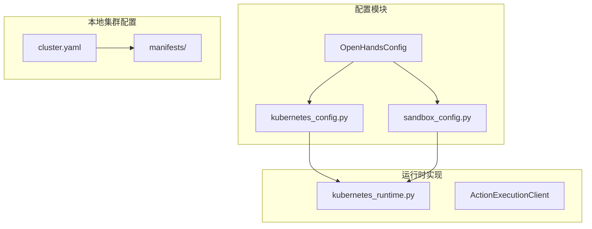
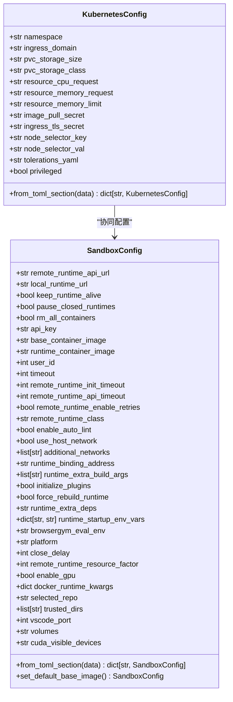
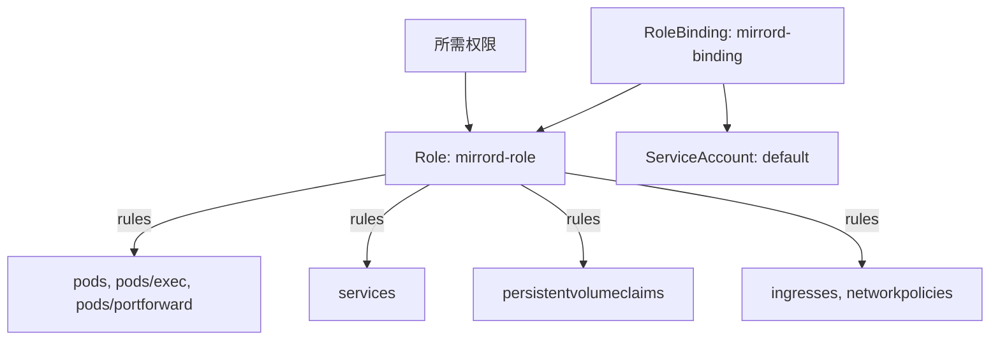
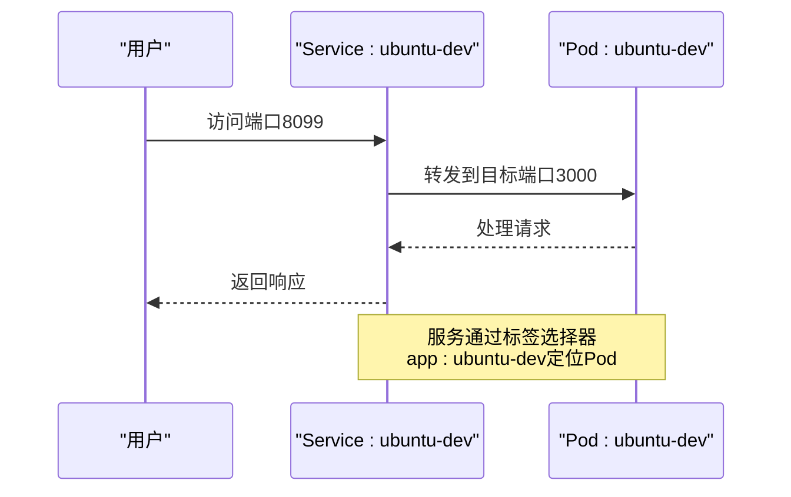
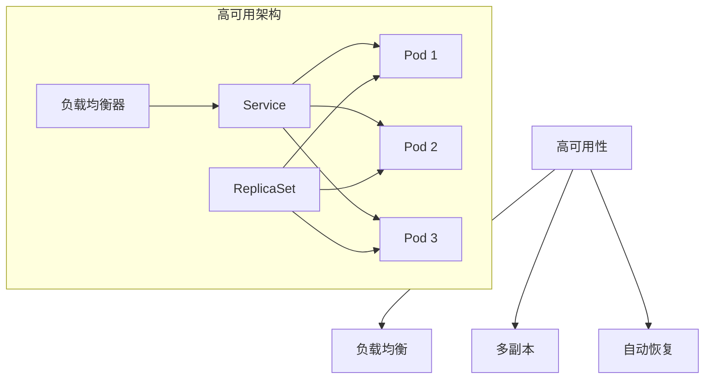
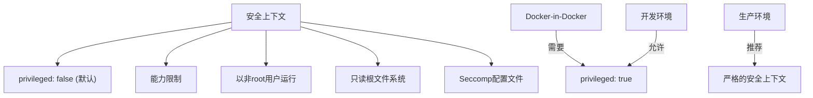
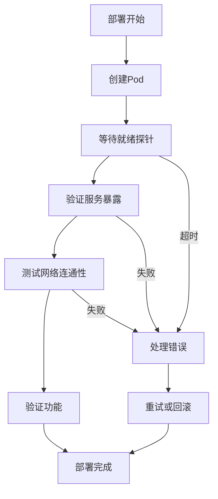
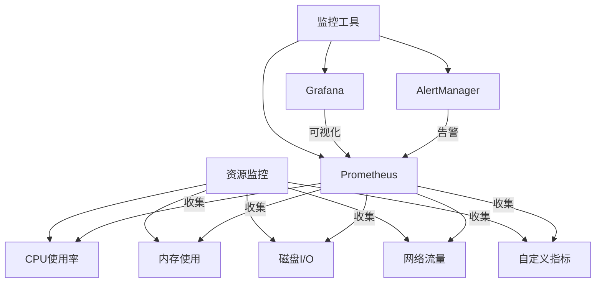
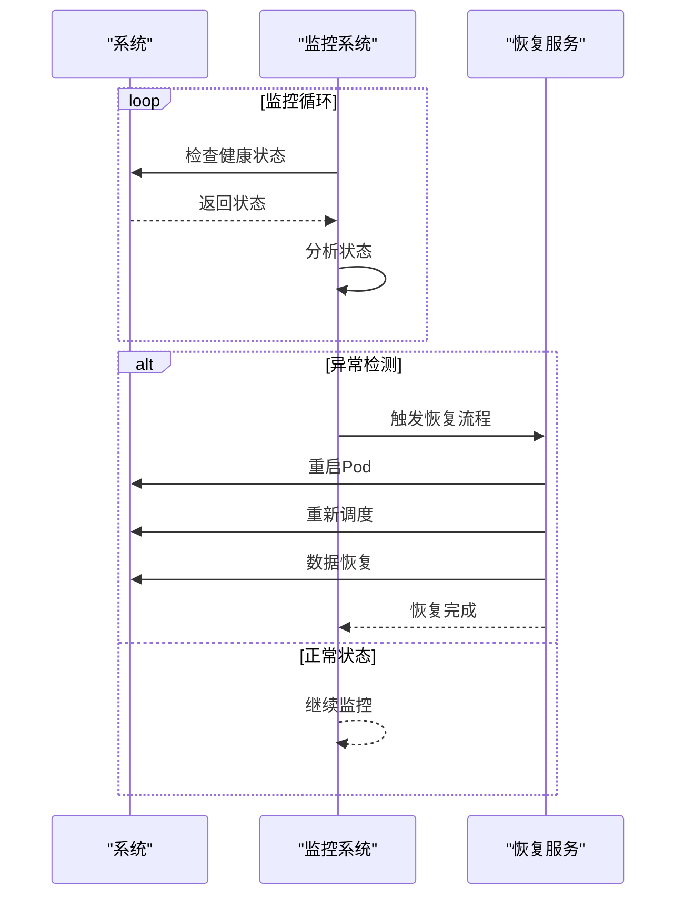

# Kubernetes沙箱配置

<cite>
**本文档引用的文件**   
- [kubernetes_config.py](file://openhands/core/config/kubernetes_config.py)
- [sandbox_config.py](file://openhands/core/config/sandbox_config.py)
- [kubernetes_runtime.py](file://openhands/runtime/impl/kubernetes/kubernetes_runtime.py)
- [cluster.yaml](file://kind/cluster.yaml)
- [role.yaml](file://kind/manifests/role.yaml)
- [roleBinding.yaml](file://kind/manifests/roleBinding.yaml)
- [deployment.yaml](file://kind/manifests/deployment.yaml)
- [service.yaml](file://kind/manifests/service.yaml)
</cite>

## 目录
1. [项目结构](#项目结构)
2. [核心配置类分析](#核心配置类分析)
3. [Kubernetes配置详解](#kubernetes配置详解)
4. [沙箱配置协同工作](#沙箱配置协同工作)
5. [本地集群配置](#本地集群配置)
6. [生产环境最佳实践](#生产环境最佳实践)
7. [部署验证与监控](#部署验证与监控)

## 项目结构

OpenHands项目的Kubernetes沙箱配置主要分布在`openhands/core/config/`目录下，其中`kubernetes_config.py`和`sandbox_config.py`定义了核心配置类。`kind/`目录包含了本地Kubernetes集群的配置文件，用于开发和测试环境。



**Diagram sources**
- [kubernetes_config.py](file://openhands/core/config/kubernetes_config.py)
- [sandbox_config.py](file://openhands/core/config/sandbox_config.py)
- [kubernetes_runtime.py](file://openhands/runtime/impl/kubernetes/kubernetes_runtime.py)
- [cluster.yaml](file://kind/cluster.yaml)

**Section sources**
- [kubernetes_config.py](file://openhands/core/config/kubernetes_config.py)
- [sandbox_config.py](file://openhands/core/config/sandbox_config.py)
- [cluster.yaml](file://kind/cluster.yaml)

## 核心配置类分析

OpenHands的Kubernetes沙箱配置基于Pydantic模型实现，提供了类型安全和配置验证功能。`KubernetesConfig`和`SandboxConfig`两个核心类分别管理Kubernetes特定配置和沙箱通用配置。

### KubernetesConfig类

`KubernetesConfig`类定义了Kubernetes运行时的所有配置选项，包括命名空间、资源请求与限制、持久卷声明等。该类使用Pydantic的`Field`装饰器提供详细的字段描述和默认值。



**Diagram sources**
- [kubernetes_config.py](file://openhands/core/config/kubernetes_config.py#L4-L85)
- [sandbox_config.py](file://openhands/core/config/sandbox_config.py#L8-L124)

**Section sources**
- [kubernetes_config.py](file://openhands/core/config/kubernetes_config.py#L4-L85)
- [sandbox_config.py](file://openhands/core/config/sandbox_config.py#L8-L124)

## Kubernetes配置详解

### 命名空间配置

`namespace`属性指定了OpenHands资源在Kubernetes集群中的命名空间。默认值为`default`，但建议在生产环境中使用专用命名空间以实现资源隔离。

### 资源请求与限制

Kubernetes配置中的资源管理通过以下属性实现：
- `resource_cpu_request`: 运行时Pod的CPU请求，默认为`1`
- `resource_memory_request`: 运行时Pod的内存请求，默认为`1Gi`
- `resource_memory_limit`: 运行时Pod的内存限制，默认为`2Gi`

这些配置确保了沙箱容器获得足够的计算资源，同时防止资源过度消耗。

### 持久卷声明

持久卷声明(PVC)配置通过以下属性管理：
- `pvc_storage_size`: PVC存储大小，默认为`2Gi`
- `pvc_storage_class`: PVC存储类，可选配置

PVC用于持久化沙箱工作区数据，确保在Pod重启后数据不丢失。

### 服务账户与网络策略

通过`kind/manifests/`目录下的RBAC配置文件，定义了运行时所需的服务账户权限：



**Diagram sources**
- [role.yaml](file://kind/manifests/role.yaml)
- [roleBinding.yaml](file://kind/manifests/roleBinding.yaml)

**Section sources**
- [role.yaml](file://kind/manifests/role.yaml)
- [roleBinding.yaml](file://kind/manifests/roleBinding.yaml)

## 沙箱配置协同工作

`sandbox_config.py`中的配置与Kubernetes配置协同工作，共同定义了沙箱的运行环境。`SandboxConfig`类提供了更通用的沙箱配置选项，而`KubernetesConfig`则专注于Kubernetes特定的配置。

### 配置继承与覆盖

当使用Kubernetes运行时时，配置的继承关系如下：
1. `base_container_image`作为基础容器镜像
2. `runtime_container_image`作为运行时容器镜像（可选覆盖）
3. Kubernetes资源配置应用于容器实例

### 环境变量配置

`runtime_startup_env_vars`属性允许在运行时启动时设置环境变量，这对于配置特定于环境的参数非常有用。例如，可以设置浏览器评估环境的基URL。

## 本地集群配置

`kind/cluster.yaml`文件定义了本地Kubernetes集群的配置，使用KinD (Kubernetes in Docker) 创建开发和测试环境。

### 集群配置分析

```yaml
kind: Cluster
apiVersion: kind.x-k8s.io/v1alpha4
name: local-hands
nodes:
- role: control-plane
  extraPortMappings:
  - containerPort: 80 # 集群中nginx的节点端口
    hostPort: 80 # nginx的本地端口
```

此配置创建了一个单节点控制平面集群，并将容器端口80映射到主机端口80，允许通过本地网络访问集群服务。

### 部署与服务配置

`kind/manifests/`目录中的部署和服务配置文件展示了如何在集群中部署和暴露应用：



**Diagram sources**
- [cluster.yaml](file://kind/cluster.yaml)
- [deployment.yaml](file://kind/manifests/deployment.yaml)
- [service.yaml](file://kind/manifests/service.yaml)

**Section sources**
- [cluster.yaml](file://kind/cluster.yaml)
- [deployment.yaml](file://kind/manifests/deployment.yaml)
- [service.yaml](file://kind/manifests/service.yaml)

## 生产环境最佳实践

### 高可用性设置

在生产环境中，建议配置多个副本和适当的资源限制来确保高可用性：



### 自动伸缩策略

基于资源使用情况配置水平Pod自动伸缩器(HPA)：

```python
# 示例：HPA配置逻辑
hpa_config = {
    "apiVersion": "autoscaling/v2",
    "kind": "HorizontalPodAutoscaler",
    "spec": {
        "scaleTargetRef": {
            "apiVersion": "apps/v1",
            "kind": "Deployment",
            "name": "openhands-runtime"
        },
        "minReplicas": 2,
        "maxReplicas": 10,
        "metrics": [
            {
                "type": "Resource",
                "resource": {
                    "name": "cpu",
                    "target": {
                        "type": "Utilization",
                        "averageUtilization": 70
                    }
                }
            }
        ]
    }
}
```

### 安全上下文配置

通过`privileged`属性和安全上下文配置容器权限：



**Section sources**
- [kubernetes_config.py](file://openhands/core/config/kubernetes_config.py#L60-L63)
- [kubernetes_runtime.py](file://openhands/runtime/impl/kubernetes/kubernetes_runtime.py#L531-L532)

## 部署验证与监控

### 部署验证流程

部署后需要验证沙箱的运行状态和网络连通性：



### 日志收集

配置集中式日志收集系统，捕获沙箱运行时的日志：

```python
# 日志配置示例
logging_config = {
    "handlers": [
        "console",
        "file",
        "elasticsearch"  # 发送到Elasticsearch
    ],
    "formatters": {
        "detailed": {
            "format": "%(asctime)s %(name)-15s %(levelname)-8s %(processName)-10s %(message)s"
        }
    },
    "loggers": {
        "openhands": {
            "level": "INFO",
            "handlers": ["console", "file", "elasticsearch"]
        }
    }
}
```

### 资源监控

实施全面的资源监控策略，包括：



### 故障恢复流程

建立完善的故障恢复机制：



**Section sources**
- [kubernetes_runtime.py](file://openhands/runtime/impl/kubernetes/kubernetes_runtime.py#L383-L393)
- [kubernetes_runtime.py](file://openhands/runtime/impl/kubernetes/kubernetes_runtime.py#L640-L664)