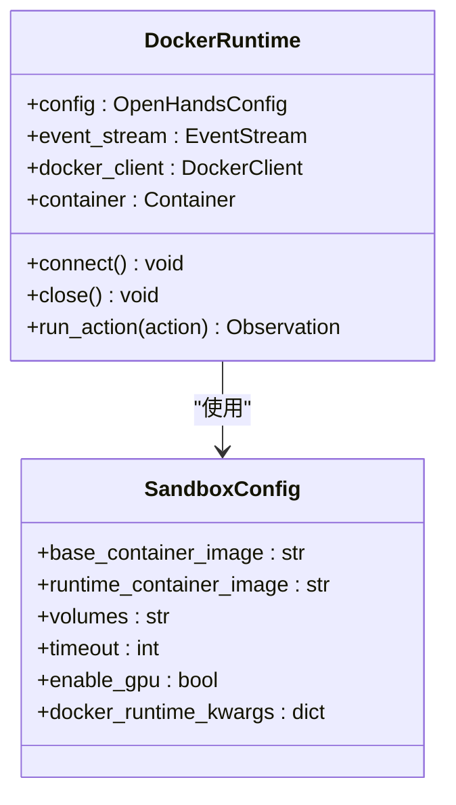
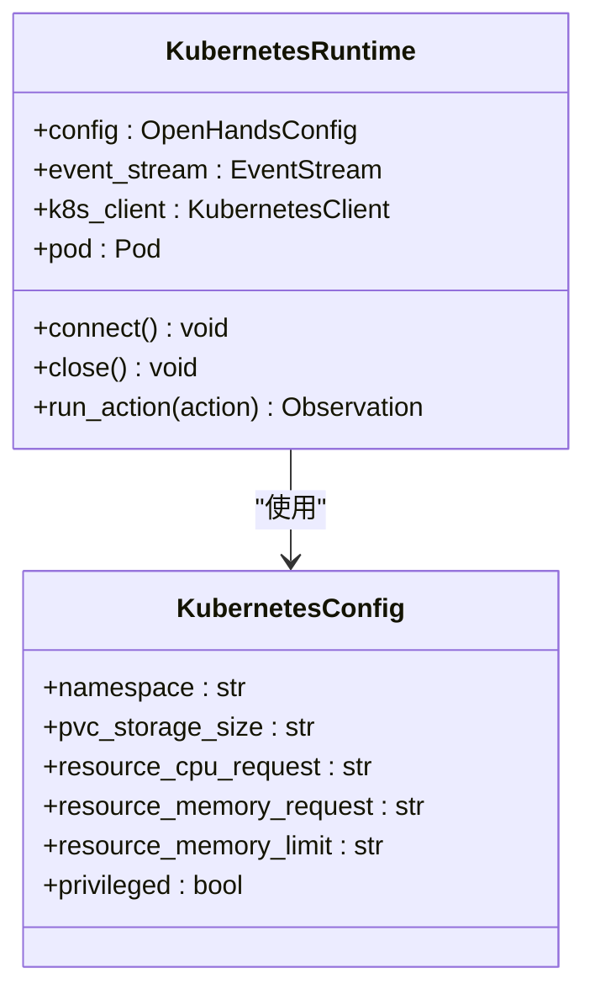
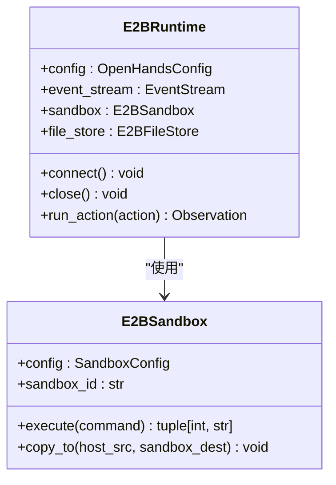
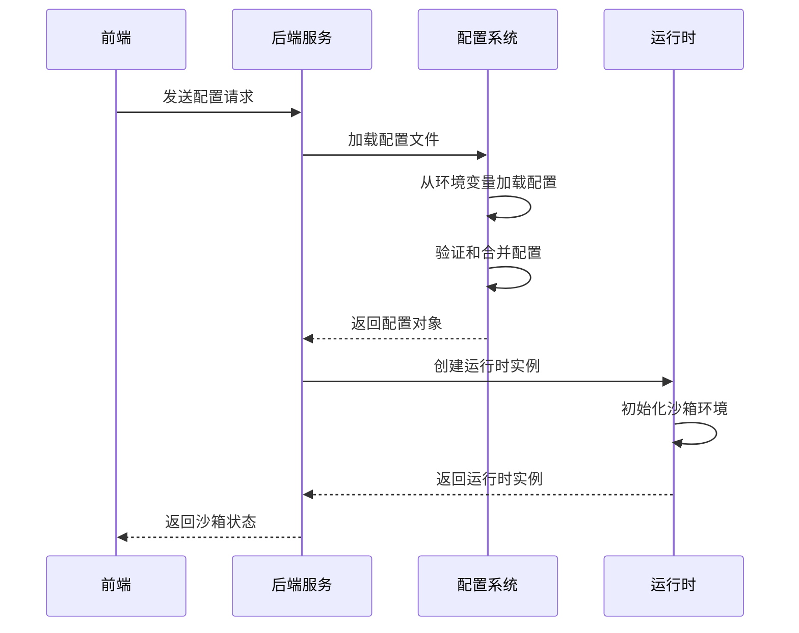

# 沙箱配置

<cite>
**本文档中引用的文件**  
- [sandbox_config.py](file://openhands/core/config/sandbox_config.py)
- [config.sh](file://containers/app/config.sh)
- [config.sh](file://containers/runtime/config.sh)
- [e2b.toml](file://third_party/containers/e2b-sandbox/e2b.toml)
- [kubernetes_config.py](file://openhands/core/config/kubernetes_config.py)
- [docker_runtime.py](file://openhands/runtime/impl/docker/docker_runtime.py)
- [kubernetes_runtime.py](file://openhands/runtime/impl/kubernetes/kubernetes_runtime.py)
- [e2b_runtime.py](file://third_party/runtime/impl/e2b/e2b_runtime.py)
</cite>

## 目录
1. [简介](#简介)
2. [核心沙箱配置](#核心沙箱配置)
3. [沙箱类型与配置差异](#沙箱类型与配置差异)
4. [环境初始化脚本](#环境初始化脚本)
5. [E2B沙箱配置](#e2b沙箱配置)
6. [前端与后端集成](#前端与后端集成)
7. [自定义配置示例](#自定义配置示例)
8. [性能调优与故障排查](#性能调优与故障排查)

## 简介
OpenHands运行时沙箱环境为AI代理提供了一个安全、隔离的执行环境。本文档详细阐述了沙箱配置机制，包括不同沙箱类型的配置选项、环境变量初始化以及运行时参数传递。沙箱配置系统支持多种运行时类型，包括Docker、E2B和Kubernetes，每种类型都有其特定的配置参数和资源管理策略。

## 核心沙箱配置

OpenHands的沙箱配置主要通过`SandboxConfig`类定义，该类位于`openhands/core/config/sandbox_config.py`文件中。`SandboxConfig`类使用Pydantic模型定义了沙箱的各种配置参数，包括容器镜像、网络设置、资源限制和挂载卷等。

关键配置项包括：
- **base_container_image**: 基础容器镜像，默认为`nikolaik/python-nodejs:python3.12-nodejs22`
- **runtime_container_image**: 运行时容器镜像，用于创建沙箱实例
- **volumes**: 卷挂载配置，格式为`host_path:container_path[:mode]`
- **timeout**: 沙箱操作的超时时间
- **enable_gpu**: 是否启用GPU支持
- **docker_runtime_kwargs**: Docker运行时的额外参数
- **trusted_dirs**: 可信任的目录列表

**Section sources**
- [sandbox_config.py](file://openhands/core/config/sandbox_config.py#L8-L124)

## 沙箱类型与配置差异

### Docker沙箱配置
Docker沙箱是OpenHands的默认运行时环境，通过`DockerRuntime`类实现。Docker沙箱配置主要关注容器级别的资源限制和网络设置。

关键配置参数：
- **use_host_network**: 是否使用主机网络模式
- **additional_networks**: 需要连接的额外Docker网络列表
- **runtime_binding_address**: 运行时端口绑定地址
- **docker_runtime_kwargs**: Docker运行时的额外参数，如CPU和内存限制

Docker沙箱通过`docker_runtime.py`文件中的`DockerRuntime`类实现，该类负责创建和管理Docker容器，处理容器的生命周期和资源分配。



**Diagram sources**
- [docker_runtime.py](file://openhands/runtime/impl/docker/docker_runtime.py#L75-L200)
- [sandbox_config.py](file://openhands/core/config/sandbox_config.py#L8-L124)

### Kubernetes沙箱配置
Kubernetes沙箱通过`KubernetesRuntime`类实现，提供了更高级的资源管理和调度功能。Kubernetes配置在`kubernetes_config.py`文件中定义，包含命名空间、持久卷声明、资源请求和限制等参数。

关键配置参数：
- **namespace**: Kubernetes命名空间
- **pvc_storage_size**: 持久卷声明的存储大小
- **resource_cpu_request**: CPU请求
- **resource_memory_request**: 内存请求
- **resource_memory_limit**: 内存限制
- **privileged**: 是否以特权模式运行容器

Kubernetes沙箱通过`kubernetes_runtime.py`文件中的`KubernetesRuntime`类实现，该类使用Kubernetes Python客户端创建和管理Pod，处理服务、入口和持久卷声明等资源。



**Diagram sources**
- [kubernetes_runtime.py](file://openhands/runtime/impl/kubernetes/kubernetes_runtime.py#L61-L200)
- [kubernetes_config.py](file://openhands/core/config/kubernetes_config.py#L4-L86)

### E2B沙箱配置
E2B沙箱是一种基于云的沙箱环境，通过`E2BRuntime`类实现。E2B沙箱配置主要通过环境变量和`e2b.toml`文件进行管理。

关键特点：
- 使用E2B API密钥进行身份验证
- 支持自定义E2B域
- 不使用传统的卷挂载，而是通过E2B文件系统API进行文件操作
- 忽略`SANDBOX_VOLUMES`环境变量，始终使用`/workspace`作为工作目录

E2B沙箱通过`e2b_runtime.py`文件中的`E2BRuntime`类实现，该类负责与E2B服务进行通信，创建和管理远程沙箱实例。



**Diagram sources**
- [e2b_runtime.py](file://third_party/runtime/impl/e2b/e2b_runtime.py#L39-L200)
- [sandbox.py](file://third_party/runtime/impl/e2b/sandbox.py#L13-L67)

## 环境初始化脚本

### 应用容器配置
`containers/app/config.sh`脚本定义了应用容器的基本配置，包括Docker注册表、组织名称和镜像名称。

```bash
DOCKER_REGISTRY=ghcr.io
DOCKER_ORG=openhands
DOCKER_IMAGE=openhands
DOCKER_BASE_DIR="."
```

### 运行时容器配置
`containers/runtime/config.sh`脚本定义了运行时容器的配置，包括Docker基础目录和镜像名称。该脚本还包含由`runtime_build.py`脚本追加的变量占位符。

```bash
DOCKER_REGISTRY=ghcr.io
DOCKER_ORG=openhands
DOCKER_BASE_DIR="./containers/runtime"
DOCKER_IMAGE=runtime
# 这些变量将由runtime_build.py脚本追加
# DOCKER_IMAGE_TAG=
# DOCKER_IMAGE_SOURCE_TAG=
```

**Section sources**
- [config.sh](file://containers/app/config.sh#L1-L5)
- [config.sh](file://containers/runtime/config.sh#L1-L8)

## E2B沙箱配置

E2B沙箱的配置主要通过`e2b.toml`文件进行管理，该文件位于`third_party/containers/e2b-sandbox/`目录中。

```toml
# 这是E2B沙箱模板的配置
# 您可以使用此配置中的'template_id' (785n69crgahmz0lkdw9h) 或 'template_name' (openhands) 来启动沙箱

dockerfile = "Dockerfile"
template_name = "openhands"
template_id = "785n69crgahmz0lkdw9h"
```

E2B沙箱的构建和管理遵循以下步骤：
1. 安装E2B CLI
2. 使用Dockerfile构建沙箱模板
3. 通过API密钥验证与E2B服务通信
4. 创建和管理远程沙箱实例

E2B沙箱的配置特点包括：
- 使用`template_name`或`template_id`来标识沙箱模板
- 通过Dockerfile定义沙箱环境
- 支持自定义E2B域
- 提供CLI工具用于调试和管理运行中的沙箱

**Section sources**
- [e2b.toml](file://third_party/containers/e2b-sandbox/e2b.toml#L1-L15)
- [README.md](file://third_party/containers/e2b-sandbox/README.md#L1-L16)

## 前端与后端集成

前端设置通过后端服务传递到沙箱配置，影响运行时环境的创建。这个过程涉及多个组件的协同工作：

1. **配置加载**: 后端服务从配置文件和环境变量中加载沙箱配置
2. **配置验证**: 使用Pydantic模型验证配置的正确性
3. **运行时初始化**: 根据配置创建相应的运行时实例
4. **环境变量传递**: 将必要的环境变量注入到沙箱环境中

配置传递的关键机制包括：
- **环境变量解析**: 从环境变量中解析配置值，如`SANDBOX_VOLUMES`和`E2B_API_KEY`
- **类型转换**: 将环境变量值转换为适当的Python类型，如布尔值、字典和列表
- **默认值设置**: 为未指定的配置项设置合理的默认值
- **配置合并**: 合并来自不同来源的配置，如配置文件、环境变量和命令行参数



**Diagram sources**
- [sandbox_config.py](file://openhands/core/config/sandbox_config.py#L8-L124)
- [utils.py](file://openhands/core/config/utils.py#L92-L117)

## 自定义配置示例

### 安全设置
通过配置文件或环境变量设置安全相关的参数：

```toml
[sandbox]
# 禁用自动lint
enable_auto_lint = false
# 使用主机网络
use_host_network = true
# 设置用户ID
user_id = 1001
```

### 预装软件包
通过`runtime_extra_deps`配置项安装额外的依赖包：

```toml
[sandbox]
runtime_extra_deps = '''
pip install numpy pandas matplotlib
apt-get update && apt-get install -y vim git
'''
```

### 网络代理配置
配置网络代理以访问外部资源：

```toml
[sandbox]
runtime_startup_env_vars = {
    "http_proxy" = "http://proxy.company.com:8080",
    "https_proxy" = "http://proxy.company.com:8080",
    "no_proxy" = "localhost,127.0.0.1"
}
```

### 资源限制
为Docker运行时设置资源限制：

```toml
[sandbox]
docker_runtime_kwargs = {
    "mem_limit" = "4G",
    "memswap_limit" = "0",
    "cpu_period" = 100000,
    "cpu_quota" = 50000
}
```

**Section sources**
- [sandbox_config.py](file://openhands/core/config/sandbox_config.py#L8-L124)
- [docker_runtime.py](file://openhands/runtime/impl/docker/docker_runtime.py#L446-L478)

## 性能调优与故障排查

### 性能调优建议
1. **资源分配**: 根据工作负载合理分配CPU和内存资源
2. **网络优化**: 使用主机网络模式减少网络开销
3. **镜像优化**: 使用轻量级基础镜像减少启动时间
4. **缓存策略**: 启用沙箱实例缓存以提高重复任务的执行效率

### 故障排查指南
1. **连接问题**: 检查网络配置和防火墙设置
2. **权限问题**: 确认用户ID和文件权限设置正确
3. **资源不足**: 监控CPU和内存使用情况，调整资源限制
4. **依赖问题**: 验证所有依赖包正确安装且版本兼容

常见故障排查步骤：
1. 检查日志输出，定位错误信息
2. 验证配置文件语法正确性
3. 确认环境变量设置正确
4. 测试网络连接和端口可用性
5. 验证Docker或Kubernetes服务正常运行

**Section sources**
- [docker_runtime.py](file://openhands/runtime/impl/docker/docker_runtime.py#L41-L115)
- [kubernetes_runtime.py](file://openhands/runtime/impl/kubernetes/kubernetes_runtime.py#L383-L393)
- [e2b_runtime.py](file://third_party/runtime/impl/e2b/e2b_runtime.py#L154-L177)