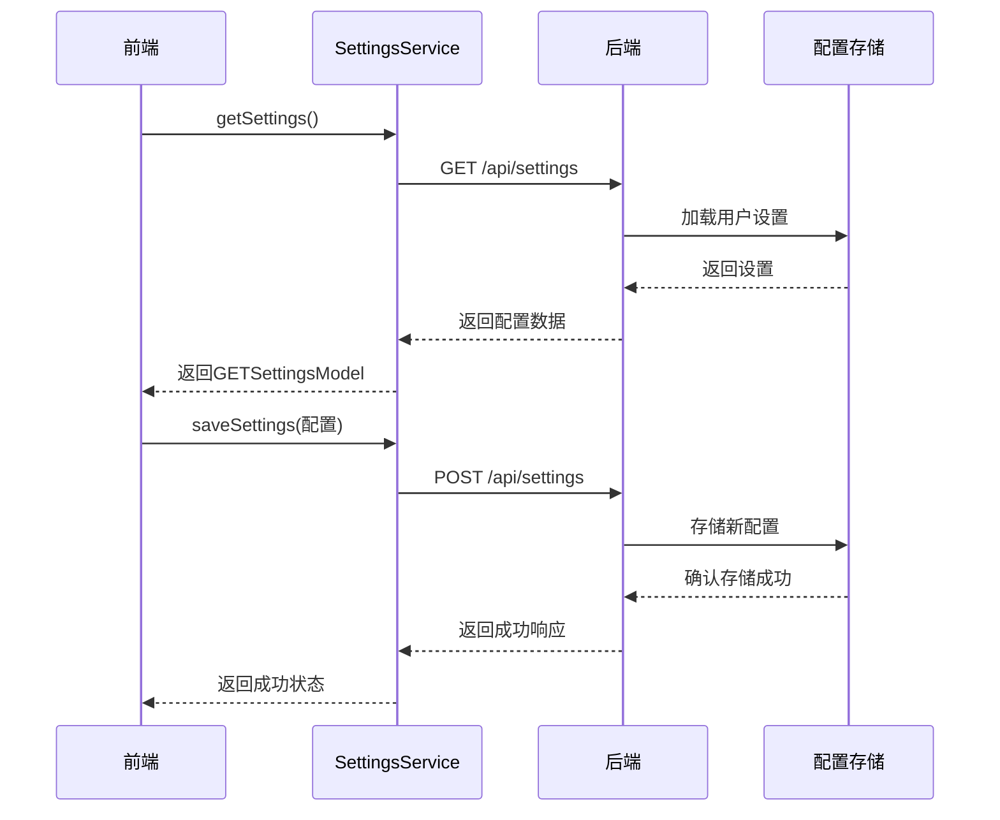

# 运行时配置

<cite>
**本文档引用的文件**
- [llm_config.py](file://openhands/core/config/llm_config.py)
- [sandbox_config.py](file://openhands/core/config/sandbox_config.py)
- [agent_config.py](file://openhands/core/config/agent_config.py)
- [openhands_config.py](file://openhands/core/config/openhands_config.py)
- [utils.py](file://openhands/core/config/utils.py)
- [settings.py](file://openhands/server/settings.py)
- [settings-service.api.ts](file://frontend/src/settings-service/settings-service.api.ts)
- [settings.types.ts](file://frontend/src/settings-service/settings.types.ts)
</cite>

## 目录
1. [引言](#引言)
2. [LLM配置](#llm配置)
3. [沙箱配置](#沙箱配置)
4. [代理配置](#代理配置)
5. [配置交互机制](#配置交互机制)
6. [热重载与动态更新](#热重载与动态更新)
7. [配置优先级与加载流程](#配置优先级与加载流程)

## 引言
OpenHands的运行时配置系统提供了一套灵活且类型安全的机制，用于管理应用程序的各种设置。该系统支持通过环境变量、TOML配置文件和前端API等多种方式来配置LLM（大语言模型）、沙箱环境和代理行为。配置系统采用分层结构，允许用户在不同粒度上进行设置，从全局默认值到特定代理的定制化配置。前端通过settings-service API与后端交互，实现配置的获取和更新，支持热重载和动态更新，确保配置变更能够立即生效，无需重启服务。

## LLM配置
LLM配置定义了大语言模型的关键参数，包括模型选择、温度、最大token数等。`LLMConfig`类是LLM配置的核心数据结构，包含模型名称、API密钥、基础URL、API版本、AWS凭证、重试策略、超时设置、最大消息字符数、温度、top_p、top_k、自定义LLM提供者、最大输入/输出token数、成本参数、Ollama基础URL、丢弃参数、修改参数、禁用视觉、缓存提示、日志记录、自定义分词器、原生工具调用、推理努力、种子、安全设置、路由标志和完成参数等属性。配置支持从TOML文件和环境变量加载，其中环境变量优先级高于TOML文件。系统支持为不同代理配置不同的LLM，通过`llm_config`字段指定配置组名称。

**Section sources**
- [llm_config.py](file://openhands/core/config/llm_config.py#L12-L199)
- [openhands_config.py](file://openhands/core/config/openhands_config.py#L65-L66)

## 沙箱配置
沙箱配置管理运行时环境的容器化设置。`SandboxConfig`类定义了远程运行时API URL、本地运行时URL、基础容器镜像、运行时容器镜像、用户ID、超时、远程运行时初始化超时、远程运行时API超时、是否启用远程运行时重试、是否启用自动lint、是否使用主机网络、附加网络、运行时绑定地址、是否初始化插件、是否强制重建运行时、运行时额外依赖、运行时启动环境变量、BrowserGym评估环境、平台、远程运行时资源因子、是否启用GPU、Docker运行时参数、信任目录和VSCode端口等属性。配置支持通过`SANDBOX_RUNTIME_EXTRA_BUILD_ARGS`等环境变量传递列表值，允许在构建运行时镜像时添加额外的构建参数。

**Section sources**
- [sandbox_config.py](file://openhands/core/config/sandbox_config.py#L8-L124)
- [openhands_config.py](file://openhands/core/config/openhands_config.py#L68)

## 代理配置
代理配置控制AI代理的行为和功能。`AgentConfig`类包含CLI模式、LLM配置名称、类路径、系统提示模板文件名、是否启用浏览、是否启用LLM编辑器、是否启用标准编辑器、是否启用Jupyter、是否启用命令、是否启用思考、是否启用完成、是否启用凝练请求、是否启用提示扩展、是否启用MCP、禁用的微代理列表、是否启用历史截断、是否启用SoM视觉浏览、是否启用计划模式、凝练器配置、模型路由配置、扩展配置和运行时类型等属性。配置支持通过TOML文件的`[agent.<agent_name>]`节为特定代理设置定制化配置，允许在不同代理间共享通用设置的同时进行个性化调整。

**Section sources**
- [agent_config.py](file://openhands/core/config/agent_config.py#L15-L159)
- [openhands_config.py](file://openhands/core/config/openhands_config.py#L67)

## 配置交互机制
前端通过settings-service API与后端交互来获取和更新运行时配置。`SettingsService`类提供了`getSettings`和`saveSettings`方法，分别用于从服务器获取配置和保存配置到服务器。前端使用`GETSettingsModel`和`POSTProviderModel`等类型定义来描述配置数据结构。后端通过`/api/settings`端点处理配置请求，`load_settings`函数负责加载用户设置并返回给前端，`store_settings`函数处理配置保存请求，更新全局配置并持久化到存储中。配置中的敏感信息如API密钥在传输过程中被特殊处理，确保安全性。

**Diagram sources**
- [settings-service.api.ts](file://frontend/src/settings-service/settings-service.api.ts#L1-L28)
- [settings.py](file://openhands/server/routes/settings.py#L28-L212)

## 热重载与动态更新
OpenHands的配置系统支持热重载和动态更新，确保配置变更能够立即生效。当通过API保存新配置时，`store_settings`函数会直接更新内存中的全局配置对象，如`config.sandbox.remote_runtime_resource_factor`和`config.git_user_name`等。这种即时更新机制使得代理和沙箱等组件能够立即感知到配置变化，无需重启服务。对于某些需要重建的组件，如运行时容器，系统会在下次启动时应用新配置。配置的动态更新流程确保了系统的灵活性和响应性，允许用户在运行时调整关键参数以优化AI代理的行为和性能。

**Section sources**
- [settings.py](file://openhands/server/routes/settings.py#L160-L179)

## 配置优先级与加载流程
OpenHands的配置加载遵循特定的优先级顺序：环境变量 > TOML配置文件 > 默认值。`load_from_env`和`load_from_toml`函数分别负责从环境变量和TOML文件加载配置，`finalize_config`函数在最后阶段完成配置的最终化处理。配置系统支持多种配置源，包括`config.toml`文件、环境变量和运行时API调用。对于LLM配置，系统支持在TOML文件中定义多个配置组，通过`[llm.<config_name>]`语法创建定制化配置，并在代理配置中通过`llm_config`字段引用。这种灵活的配置机制允许用户根据具体需求精细控制AI代理的行为。

**Section sources**
- [utils.py](file://openhands/core/config/utils.py#L71-L192)
- [openhands_config.py](file://openhands/core/config/openhands_config.py#L135-L174)