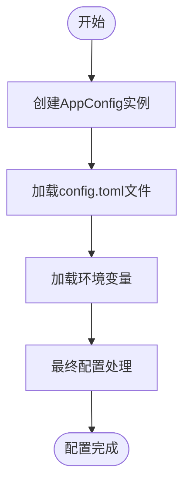
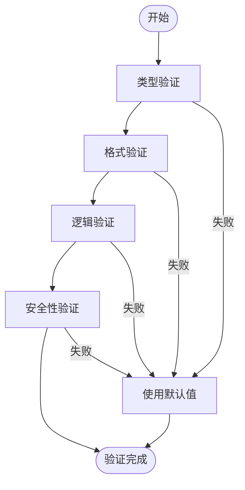
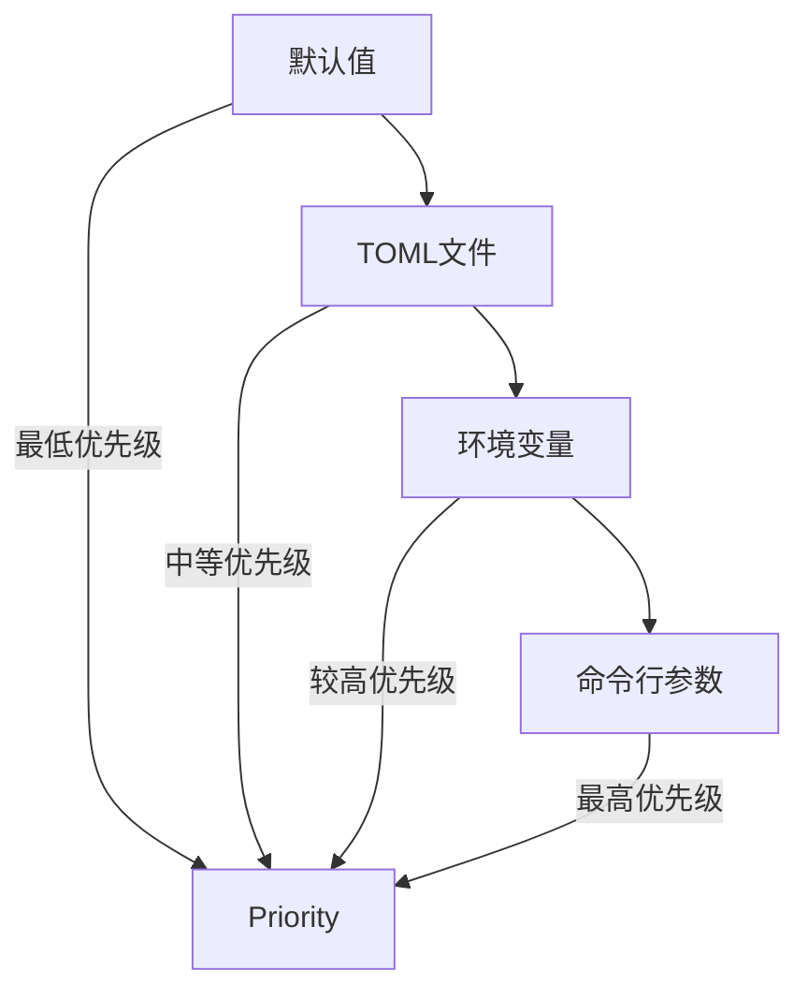

# 配置文件

<cite>
**本文档中引用的文件**   
- [config.template.toml](file://config.template.toml)
- [openhands/core/config/utils.py](file://openhands/core/config/utils.py)
- [openhands/core/config/llm_config.py](file://openhands/core/config/llm_config.py)
- [openhands/core/config/agent_config.py](file://openhands/core/config/agent_config.py)
- [openhands/core/config/sandbox_config.py](file://openhands/core/config/sandbox_config.py)
- [openhands/core/config/security_config.py](file://openhands/core/config/security_config.py)
- [openhands/core/config/condenser_config.py](file://openhands/core/config/condenser_config.py)
- [openhands/core/config/mcp_config.py](file://openhands/core/config/mcp_config.py)
- [openhands/core/config/model_routing_config.py](file://openhands/core/config/model_routing_config.py)
- [openhands/core/config/openhands_config.py](file://openhands/core/config/openhands_config.py)
- [openhands/core/config/README.md](file://openhands/core/config/README.md)
</cite>

## 目录
1. [简介](#简介)
2. [配置文件结构](#配置文件结构)
3. [配置加载流程](#配置加载流程)
4. [核心组件配置](#核心组件配置)
5. [配置验证规则](#配置验证规则)
6. [配置优先级与环境变量](#配置优先级与环境变量)
7. [实际配置示例](#实际配置示例)
8. [结论](#结论)

## 简介
OpenHands的配置系统提供了一种灵活的方式来管理应用程序的各种设置。该系统支持通过TOML文件、环境变量和命令行参数等多种方式定义配置。`config.template.toml`文件作为配置模板，包含了所有可用配置项的示例和说明。配置系统的核心是`AppConfig`类，它作为根配置类，管理着LLM模型、代理、沙箱环境、安全特性等各个组件的配置。通过分层的配置加载机制，用户可以轻松地根据不同的使用场景定制OpenHands的行为。

**Section sources**
- [config.template.toml](file://config.template.toml)
- [openhands/core/config/README.md](file://openhands/core/config/README.md)

## 配置文件结构
OpenHands的配置文件采用TOML格式，具有清晰的分层结构。配置文件主要由以下几个核心部分组成：

1. **[core]**: 核心配置，包含工作区路径、调试模式、最大迭代次数等全局设置
2. **[llm]**: LLM模型配置，定义了使用的语言模型、API密钥、重试策略等
3. **[agent]**: 代理配置，控制代理的行为，如是否启用浏览工具、IPython工具等
4. **[sandbox]**: 沙箱配置，管理沙箱环境的设置，如超时时间、容器镜像等
5. **[security]**: 安全配置，包含确认模式、安全分析器等安全相关设置
6. **[condenser]**: 压缩器配置，控制对话历史的管理和压缩方式
7. **[mcp]**: MCP（Model Context Protocol）服务器配置，用于与外部工具服务器通信
8. **[model_routing]**: 模型路由配置，支持在不同LLM模型之间智能切换

每个配置部分都包含详细的注释，说明了各项配置的用途和默认值。用户只需取消注释并修改需要调整的配置项即可。

**Section sources**
- [config.template.toml](file://config.template.toml)

## 配置加载流程
OpenHands的配置加载流程遵循一个明确的顺序，确保配置的正确性和一致性。加载流程如下：

1. **创建配置实例**: 首先创建`AppConfig`的实例，该实例包含所有配置项的默认值
2. **加载TOML文件**: 从`config.toml`文件中读取配置，如果文件存在，则用文件中的值覆盖默认值
3. **加载环境变量**: 从环境变量中读取配置，环境变量的值会覆盖TOML文件中的值
4. **最终配置处理**: 对配置进行最后的调整和验证，确保所有路径都是绝对路径，并处理一些特殊情况

配置加载的核心函数是`load_openhands_config()`，它按照上述顺序执行配置加载。对于每个配置部分，系统会检查相应的TOML节是否存在，如果存在则解析并应用配置。例如，对于`[llm]`节，系统会调用`LLMConfig.from_toml_section()`方法来创建LLM配置实例。



**Diagram sources**
- [openhands/core/config/utils.py](file://openhands/core/config/utils.py#L137-L367)
- [openhands/core/config/README.md](file://openhands/core/config/README.md#L58-L64)

## 核心组件配置
### LLM模型配置
LLM模型配置是OpenHands的核心，它决定了使用的语言模型和相关参数。主要配置项包括：

- **model**: 指定使用的LLM模型，如"gpt-4o"
- **api_key**: LLM服务的API密钥
- **base_url**: API基础URL，用于本地LLM
- **num_retries**: 操作失败时的重试次数
- **temperature**: API的温度参数
- **max_input_tokens**: 最大输入令牌数
- **max_output_tokens**: 最大输出令牌数

LLM配置支持创建多个配置实例，允许为不同的代理使用不同的LLM模型。例如，可以为成本敏感的代理配置一个便宜的模型，而为需要高质量输出的代理配置一个高级模型。

```mermaid
classDiagram
class LLMConfig {
+model : str
+api_key : SecretStr | None
+base_url : str | None
+api_version : str | None
+num_retries : int
+retry_multiplier : float
+retry_min_wait : int
+retry_max_wait : int
+timeout : int | None
+max_message_chars : int
+temperature : float
+top_p : float
+top_k : float | None
+custom_llm_provider : str | None
+max_input_tokens : int | None
+max_output_tokens : int | None
+input_cost_per_token : float | None
+output_cost_per_token : float | None
+ollama_base_url : str | None
+drop_params : bool
+modify_params : bool
+disable_vision : bool | None
+caching_prompt : bool
+log_completions : bool
+log_completions_folder : str
+custom_tokenizer : str | None
+native_tool_calling : bool | None
+reasoning_effort : str | None
+seed : int | None
+safety_settings : list[dict[str, str]] | None
+for_routing : bool
+correct_num : int
+completion_kwargs : dict[str, Any] | None
}
LLMConfig : +from_toml_section(data : dict) dict[str, LLMConfig]
LLMConfig : +model_post_init(__context : Any) None
```

**Diagram sources**
- [openhands/core/config/llm_config.py](file://openhands/core/config/llm_config.py)

### 代理配置
代理配置控制着代理的行为和能力。主要配置项包括：

- **enable_browsing**: 是否启用浏览工具
- **enable_llm_editor**: 是否启用LLM编辑器
- **enable_jupyter**: 是否启用IPython工具
- **enable_cmd**: 是否启用命令工具
- **enable_think**: 是否启用思考工具
- **enable_finish**: 是否启用完成工具
- **llm_config**: 使用的LLM配置组

代理配置支持为不同的代理类型创建特定的配置。例如，可以为`RepoExplorerAgent`配置一个便宜的LLM模型以降低成本，同时为`CustomAgent`指定一个自定义的类路径。

```mermaid
classDiagram
class AgentConfig {
+enable_browsing : bool
+enable_llm_editor : bool
+enable_editor : bool
+enable_jupyter : bool
+enable_cmd : bool
+enable_think : bool
+enable_finish : bool
+llm_config : str
+enable_prompt_extensions : bool
+disabled_microagents : list[str]
+enable_history_truncation : bool
+enable_condensation_request : bool
+condenser : CondenserConfig
+model_routing : ModelRoutingConfig
}
AgentConfig : +from_toml_section(data : dict) dict[str, AgentConfig]
```

**Diagram sources**
- [openhands/core/config/agent_config.py](file://openhands/core/config/agent_config.py)

### 运行时环境与沙箱配置
沙箱配置管理着运行时环境的各个方面。主要配置项包括：

- **timeout**: 沙箱超时时间（秒）
- **user_id**: 沙箱用户ID
- **base_container_image**: 使用的容器镜像
- **use_host_network**: 是否使用主机网络
- **runtime_extra_build_args**: 运行时额外构建参数
- **enable_auto_lint**: 是否启用自动lint
- **runtime_extra_deps**: 运行时额外依赖
- **runtime_startup_env_vars**: 运行时启动时的环境变量
- **platform**: 构建运行时镜像的平台
- **force_rebuild_runtime**: 是否强制重建运行时镜像
- **runtime_container_image**: 运行时容器镜像
- **keep_runtime_alive**: 会话结束后是否保持运行时存活
- **pause_closed_runtimes**: 是否暂停关闭的运行时
- **close_delay**: 关闭空闲运行时的延迟时间
- **rm_all_containers**: 停止运行时时是否移除所有容器
- **enable_gpu**: 是否启用GPU支持
- **cuda_visible_devices**: 指定GPU ID
- **docker_runtime_kwargs**: 额外的Docker运行时参数
- **vscode_port**: VSCode使用的特定端口
- **volumes**: 卷挂载

沙箱配置还支持Kubernetes运行时的特定配置，包括命名空间、入口域、持久卷声明大小等。

```mermaid
classDiagram
class SandboxConfig {
+timeout : int
+user_id : int
+base_container_image : str
+use_host_network : bool
+runtime_extra_build_args : list[str]
+enable_auto_lint : bool
+runtime_extra_deps : str
+runtime_startup_env_vars : dict[str, str]
+platform : str
+force_rebuild_runtime : bool
+runtime_container_image : str
+keep_runtime_alive : bool
+pause_closed_runtimes : bool
+close_delay : int
+rm_all_containers : bool
+enable_gpu : bool
+cuda_visible_devices : str
+docker_runtime_kwargs : dict[str, Any]
+vscode_port : int | None
+volumes : str | None
}
SandboxConfig : +from_toml_section(data : dict) dict[str, SandboxConfig]
```

**Diagram sources**
- [openhands/core/config/sandbox_config.py](file://openhands/core/config/sandbox_config.py)

### 安全配置
安全配置管理着OpenHands的安全特性。主要配置项包括：

- **confirmation_mode**: 是否启用确认模式
- **security_analyzer**: 使用的安全分析器（"llm"或"invariant"）
- **enable_security_analyzer**: 是否启用安全分析器

这些配置项允许用户根据安全需求调整OpenHands的行为，例如在生产环境中启用确认模式以防止意外操作。

```mermaid
classDiagram
class SecurityConfig {
+confirmation_mode : bool
+security_analyzer : str
+enable_security_analyzer : bool
}
SecurityConfig : +from_toml_section(data : dict) dict[str, SecurityConfig]
```

**Diagram sources**
- [openhands/core/config/security_config.py](file://openhands/core/config/security_config.py)

## 配置验证规则
OpenHands的配置系统实现了严格的验证规则，确保配置的正确性和安全性。主要验证规则包括：

1. **类型验证**: 所有配置项都经过类型验证，确保值的类型正确。例如，布尔值必须是"true"或"false"，整数必须是有效的数字。
2. **格式验证**: 对于特定格式的配置项，如URL、环境变量名等，系统会进行格式验证。例如，MCP服务器的URL必须是有效的URL格式。
3. **逻辑验证**: 系统会检查配置项之间的逻辑关系。例如，如果启用了浏览工具，则必须同时启用浏览器环境。
4. **安全性验证**: 敏感信息如API密钥会被存储为`SecretStr`类型，防止意外泄露。

配置验证主要通过Pydantic的`ValidationError`实现。当配置项不符合预期时，系统会记录警告信息并使用默认值。例如，在`LLMConfig.from_toml_section()`方法中，如果无法解析配置，系统会记录警告并继续使用默认配置。



**Diagram sources**
- [openhands/core/config/llm_config.py](file://openhands/core/config/llm_config.py#L107-L167)
- [openhands/core/config/agent_config.py](file://openhands/core/config/agent_config.py#L97-L131)
- [openhands/core/config/condenser_config.py](file://openhands/core/config/condenser_config.py#L301-L312)

## 配置优先级与环境变量
OpenHands的配置系统支持多种配置源，它们的优先级从低到高依次为：

1. **默认值**: 配置类中定义的默认值
2. **TOML文件**: `config.toml`文件中的配置
3. **环境变量**: 环境变量中的配置
4. **命令行参数**: 命令行参数中的配置

环境变量的命名遵循特定的约定：配置类名的大写形式加上下划线，再加上字段名的大写形式。例如，`LLMConfig`类的`api_key`字段对应的环境变量是`LLM_API_KEY`。

环境变量的值会覆盖TOML文件中的值，这使得在不同环境中快速切换配置成为可能。例如，可以在开发环境中使用一个测试API密钥，而在生产环境中使用一个正式的API密钥，而无需修改配置文件。



**Diagram sources**
- [openhands/core/config/utils.py](file://openhands/core/config/utils.py#L71-L73)
- [openhands/core/config/README.md](file://openhands/core/config/README.md#L23-L27)

## 实际配置示例
以下是一些实际的配置示例，展示了如何根据不同的使用场景定制配置文件。

### 基本配置示例
```toml
[core]
default_agent = "CodeActAgent"
max_iterations = 100

[llm]
model = "gpt-4o"
api_key = "your-api-key"

[agent]
enable_browsing = true
enable_jupyter = true
```

### 多LLM模型配置示例
```toml
[llm]
model = "gpt-4o"
api_key = "your-primary-api-key"

[llm.cheap]
model = "gpt-3.5-turbo"
api_key = "your-cheap-api-key"

[agent.RepoExplorerAgent]
llm_config = "cheap"
```

### 沙箱配置示例
```toml
[sandbox]
timeout = 300
base_container_image = "nikolaik/python-nodejs:python3.12-nodejs22"
volumes = "/my/host/dir:/workspace:rw"
```

### MCP服务器配置示例
```toml
[mcp]
shttp_servers = [
    "https://api.example.com/mcp/shttp",
    {url = "https://api.example.com/mcp/shttp", api_key = "your-api-key", timeout = 180}
]
```

这些示例展示了如何根据具体需求调整配置，从基本设置到高级功能的配置。

**Section sources**
- [config.template.toml](file://config.template.toml)

## 结论
OpenHands的配置系统提供了一个强大而灵活的机制来管理应用程序的各种设置。通过TOML文件、环境变量和命令行参数的组合，用户可以轻松地根据不同的使用场景定制OpenHands的行为。配置系统的设计考虑了易用性、安全性和可扩展性，使得开发者能够快速上手并进行高级定制。理解配置文件的结构、加载流程、验证规则和优先级机制，对于有效使用和定制OpenHands至关重要。通过合理配置，用户可以优化性能、降低成本并提高安全性，充分发挥OpenHands的潜力。