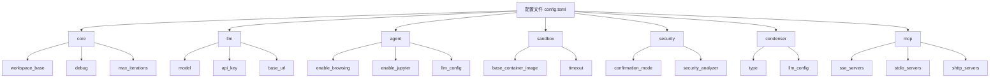
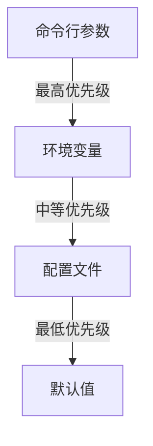
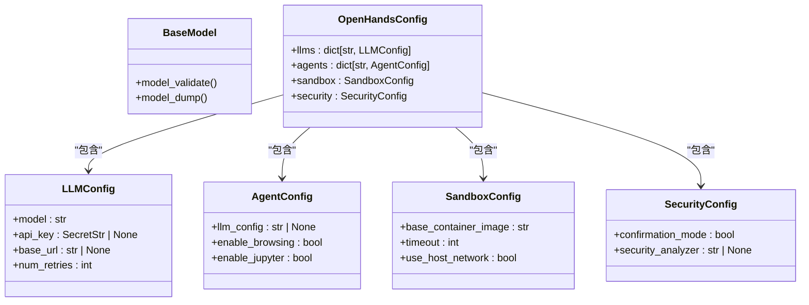

# 配置系统

<cite>
**本文档引用的文件**   
- [config.template.toml](file://config.template.toml)
- [openhands_config.py](file://openhands/core/config/openhands_config.py)
- [utils.py](file://openhands/core/config/utils.py)
- [mcp_config.py](file://openhands/core/config/mcp_config.py)
- [llm_config.py](file://openhands/core/config/llm_config.py)
- [agent_config.py](file://openhands/core/config/agent_config.py)
- [security_config.py](file://openhands/core/config/security_config.py)
- [server_config.py](file://openhands/server/config/server_config.py)
- [app_server/config.py](file://openhands/app_server/config.py)
- [settings.py](file://enterprise/storage/data_models/settings.py)
</cite>

## 目录
1. [简介](#简介)
2. [配置文件结构](#配置文件结构)
3. [环境变量和命令行参数](#环境变量和命令行参数)
4. [配置验证和类型安全](#配置验证和类型安全)
5. [配置选项参考](#配置选项参考)
6. [配置热重载和动态更新](#配置热重载和动态更新)
7. [配置迁移和版本管理](#配置迁移和版本管理)
8. [最佳实践](#最佳实践)
9. [结论](#结论)

## 简介
OpenHands的配置系统是一个灵活且类型安全的机制，用于管理应用程序的各种设置。该系统支持通过配置文件、环境变量和命令行参数等多种方式来定义和覆盖配置。核心配置类`OpenHandsConfig`使用Pydantic模型来确保类型安全和数据验证。配置系统还支持配置的合并、优先级处理和动态更新，使得在不同环境和使用场景下都能灵活地调整应用程序行为。

**Section sources**
- [openhands_config.py](file://openhands/core/config/openhands_config.py#L23-L184)
- [utils.py](file://openhands/core/config/utils.py#L39-L469)

## 配置文件结构
OpenHands的配置主要通过`config.toml`文件进行管理，该文件遵循TOML格式。配置文件的结构分为多个部分，每个部分对应不同的配置类别。主要的配置部分包括`[core]`、`[llm]`、`[agent]`、`[sandbox]`、`[security]`、`[condenser]`和`[mcp]`等。

`[core]`部分包含应用程序的核心配置，如工作区路径、调试模式、最大迭代次数等。`[llm]`部分用于配置语言模型的参数，如模型名称、API密钥、基础URL等。`[agent]`部分定义了代理的行为，如启用的工具、LLM配置等。`[sandbox]`部分配置了沙箱环境的参数，如容器镜像、超时时间等。`[security]`部分用于安全相关的配置，如确认模式、安全分析器等。`[condenser]`部分控制对话历史的压缩和管理。`[mcp]`部分配置了模型上下文协议（MCP）服务器。

配置文件还支持自定义配置组，例如`[llm.gpt4o-mini]`或`[agent.RepoExplorerAgent]`，这些自定义组可以覆盖默认配置中的特定参数。

**Diagram sources**
- [config.template.toml](file://config.template.toml)

**Section sources**
- [config.template.toml](file://config.template.toml)
- [openhands_config.py](file://openhands/core/config/openhands_config.py#L23-L184)

## 环境变量和命令行参数
OpenHands的配置系统支持通过环境变量和命令行参数来覆盖配置文件中的设置。环境变量的命名遵循`[SECTION]_[FIELD]`的格式，例如`LLM_API_KEY`对应`[llm]`部分的`api_key`字段。命令行参数则通过`--`前缀来指定，例如`--llm-api-key`。

配置的优先级顺序为：命令行参数 > 环境变量 > 配置文件。这意味着命令行参数具有最高的优先级，可以覆盖环境变量和配置文件中的设置。环境变量的优先级次之，可以覆盖配置文件中的设置。配置文件中的设置具有最低的优先级。

**Diagram sources**
- [utils.py](file://openhands/core/config/utils.py#L71-L124)

**Section sources**
- [utils.py](file://openhands/core/config/utils.py#L39-L135)

## 配置验证和类型安全
OpenHands的配置系统使用Pydantic模型来确保配置的类型安全和数据验证。每个配置类都继承自`BaseModel`，并使用`Field`来定义字段的类型、默认值和验证规则。例如，`LLMConfig`类中的`api_key`字段被定义为`SecretStr`类型，以确保API密钥的安全性。

配置系统还支持自定义验证器，例如`@field_validator`和`@model_validator`装饰器，用于在字段或模型级别进行额外的验证。例如，`MCPStdioServerConfig`类中的`validate_server_name`方法用于验证服务器名称的格式。

**Diagram sources**
- [openhands_config.py](file://openhands/core/config/openhands_config.py#L23-L184)
- [llm_config.py](file://openhands/core/config/llm_config.py#L12-L105)
- [agent_config.py](file://openhands/core/config/agent_config.py#L15-L68)
- [security_config.py](file://openhands/core/config/security_config.py#L4-L15)

**Section sources**
- [openhands_config.py](file://openhands/core/config/openhands_config.py#L23-L184)
- [llm_config.py](file://openhands/core/config/llm_config.py#L12-L105)
- [agent_config.py](file://openhands/core/config/agent_config.py#L15-L68)
- [security_config.py](file://openhands/core/config/security_config.py#L4-L15)

## 配置选项参考
### AI模型设置
- `model`: 指定使用的语言模型，如`gpt-4o`。
- `api_key`: 语言模型的API密钥。
- `base_url`: 语言模型API的基础URL，用于本地LLM。
- `num_retries`: API调用失败时的重试次数。
- `temperature`: API的温度参数，控制生成文本的随机性。
- `top_p`: API的top_p参数，控制生成文本的多样性。

### 运行时参数
- `runtime`: 运行时环境标识符，如`docker`。
- `max_iterations`: 允许的最大迭代次数。
- `max_budget_per_task`: 每个任务的最大预算，超出后代理停止。
- `debug`: 是否启用调试模式。

### 安全选项
- `confirmation_mode`: 是否启用确认模式。
- `security_analyzer`: 使用的安全分析器，如`llm`或`invariant`。

**Section sources**
- [config.template.toml](file://config.template.toml)
- [llm_config.py](file://openhands/core/config/llm_config.py#L12-L105)
- [openhands_config.py](file://openhands/core/config/openhands_config.py#L23-L184)

## 配置热重载和动态更新
OpenHands的配置系统支持配置的热重载和动态更新。当配置文件发生变化时，系统可以自动重新加载配置，而无需重启应用程序。这通过`load_from_toml`函数实现，该函数定期检查配置文件的修改时间，并在检测到变化时重新加载配置。

此外，配置系统还支持通过API端点动态更新配置。例如，`/api/settings`端点允许用户通过HTTP请求更新配置，并触发配置的重新加载。

**Section sources**
- [utils.py](file://openhands/core/config/utils.py#L137-L161)
- [app_server/config.py](file://openhands/app_server/config.py#L110-L195)

## 配置迁移和版本管理
OpenHands的配置系统支持配置的迁移和版本管理。当配置文件的结构发生变化时，系统可以通过迁移脚本来更新旧版本的配置文件。例如，`enterprise/migrations/versions/036_add_mcp_config_to_user_settings.py`脚本用于将`mcp_config`字段添加到用户设置表中。

配置的版本管理通过`config_cls`环境变量实现，该变量指定要使用的配置类。不同的配置类可以对应不同的配置版本，从而实现配置的向后兼容。

**Section sources**
- [036_add_mcp_config_to_user_settings.py](file://enterprise/migrations/versions/036_add_mcp_config_to_user_settings.py)
- [server_config.py](file://openhands/server/config/server_config.py#L8-L62)

## 最佳实践
### 处理敏感信息
敏感信息如API密钥应通过环境变量或安全的密钥管理服务来管理，而不是直接写入配置文件。使用`SecretStr`类型可以确保敏感信息在日志和输出中被隐藏。

### 多环境配置
为不同的环境（如开发、测试、生产）创建独立的配置文件，如`config.dev.toml`、`config.test.toml`和`config.prod.toml`。通过环境变量`CONFIG_FILE`来指定要使用的配置文件。

### 配置审计
定期审计配置文件和环境变量，确保没有不必要的权限或暴露的敏感信息。使用配置验证器来检查配置的完整性和正确性。

**Section sources**
- [utils.py](file://openhands/core/config/utils.py#L369-L376)
- [security_config.py](file://openhands/core/config/security_config.py#L4-L15)

## 结论
OpenHands的配置系统提供了一个灵活、安全且易于管理的机制来控制应用程序的行为。通过结合配置文件、环境变量和命令行参数，用户可以在不同场景下轻松地调整配置。类型安全和数据验证确保了配置的正确性，而热重载和动态更新功能则提高了系统的灵活性和可用性。遵循最佳实践可以进一步增强配置的安全性和可维护性。